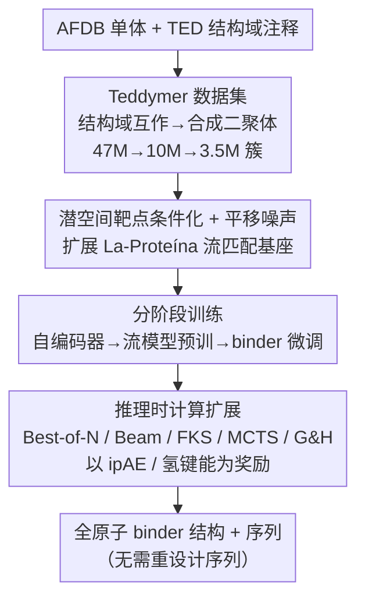

# Scaling Atomistic Protein Binder Design with Generative Pretraining and Test-Time Compute

**会议**: ICLR 2026  
**OpenReview**: [https://openreview.net/forum?id=qmCpJtFZra](https://openreview.net/forum?id=qmCpJtFZra)  
**论文**: [Project page (NVIDIA GenAIR)](https://research.nvidia.com/labs/genair/proteina-complexa/)  
**代码**: 将开源（源码 / 模型权重 / Teddymer 数据集）  
**领域**: AI for Science / 蛋白质设计 / 生成式建模  
**关键词**: 蛋白质 binder 设计、流匹配、推理时计算扩展、全原子生成、合成数据集

## 一句话总结
本文提出 **Proteína-Complexa（Complexa）**，把蛋白质 binder（结合蛋白）设计中长期割裂的"生成式建模"和"hallucination 序列优化"两条路线统一进同一框架：先用一个从 AFDB 结构域互作里造出来的大规模合成数据集 **Teddymer** 预训练一个全原子流匹配生成基座，再在推理时把扩散/流模型里的 test-time scaling 算法（Best-of-N、beam search、FKS、MCTS）搬过来，用结构预测器的界面置信度当奖励去"搜"出强 binder，在归一化算力预算下大幅超过 BindCraft 等 hallucination 方法。

## 研究背景与动机
**领域现状**：de novo（从头）binder 设计目前被结构视角主导，主流分两派。一派是**生成式方法**（以 RFDiffusion 为代表）：在"binder–靶点复合物"结构上训生成模型，给定新靶点条件生成候选 binder。另一派是 **hallucination 方法**（以 BindCraft 为代表）：不训任何生成器，直接拿 AlphaFold2 这类结构预测器的置信度/对齐分数当目标，对 binder 序列做梯度优化。

**现有痛点**：这两派各有硬伤。生成式方法依赖实验解析的多聚体复合物训练，而 PDB 里这类数据极少（≈22.5 万条且需进一步筛选），数据瓶颈限制了基座表达力；而且很多生成模型只产骨架，还得再用 ProteinMPNN 反折叠重设计序列。hallucination 方法没有生成先验，等于在巨大的序列空间里做纯暴力优化，既慢又容易陷在局部最优，而且要对离散序列做各种 ad-hoc 松弛才能拿到梯度。

**核心矛盾**：作者指出这其实是个**伪二分法**。对照语言和图像领域——那里早已是"一个预训练基座 + 推理时自适应算力扩展/推理"统一在一个框架里（CoT、test-time scaling）。而 binder 设计里，生成式 ≈ 纯训练时优化、hallucination ≈ 没有生成先验的纯推理时优化，两者本可以合二为一。

**本文目标**：(1) 解决生成基座的数据匮乏；(2) 造一个强的全原子流匹配 binder 生成基座；(3) 在这个基座上做推理时算力扩展，把搜索"约束在生成先验内部"，从而同时拿到生成式的高质量先验和 hallucination 的可优化性。

**核心 idea**：用合成数据 Teddymer 把生成基座做强，再把扩散/流的 test-time scaling 算法接到这个流模型的去噪过程上、以结构预测器界面分数为奖励——**在生成先验里搜，而不是在裸序列空间里暴力优化**。

## 方法详解

### 整体框架
Complexa 是一条"造数据 → 训生成基座 → 推理时搜索优化"的完整管线。输入是一个靶点（蛋白靶点或小分子靶点）外加标记界面位置的 hotspot tokens，输出是全原子的 binder 结构与序列（同时共生成，**不需要再用 ProteinMPNN 重设计序列**）。

第一步先解决数据：从 AFDB 的预测单体里、按 TED 结构域注释把多结构域单体切成单独的结构域，把"结构域间互作"近似当成"链间互作"，筛出空间邻近的二聚体并聚类去冗余，得到 350 万簇的合成 binder–靶点数据集 Teddymer。第二步在 La-Proteína 的部分隐空间流匹配基座上扩展出**靶点条件化机制**，配合一个迫使模型推理全局定位的**平移噪声**，再用一套**分阶段训练**把基座喂强。第三步在推理时把流模型的随机去噪轨迹当作可搜索对象，用 **Best-of-N / beam search / FKS / MCTS / Generate-and-Hallucinate** 五种算法、以界面 ipAE（或加上氢键能量）为奖励去引导生成，搜出高质量 binder。

### 关键设计

**1. Teddymer：用结构域间互作造大规模合成 binder–靶点数据**

生成基座最缺的就是"binder–靶点"配对结构，而实验解析的多聚体只在 PDB 里有、量太小。作者的破局点是：AFDB 里有海量预测单体，且大多是**多结构域蛋白**；既然一条多结构域链内部不同结构域之间也存在真实的生物物理互作（界面、氢键），那就可以把"结构域间互作"近似当成"链间（binder–靶点）互作"。具体做法：从聚类版 AFDB50 里取有 TED 结构域注释的子集（约 4700 万个样本），把每个多结构域单体按结构域切成"多聚体"（每个结构域当一条链），再抽出空间邻近、且 CAT 注释完整的二聚体，得到 1000 万个二聚体，最后聚类去冗余压到 **350 万簇**。训练实际用四套数据：AFDB 单体簇代表、Teddymer 二聚体（按界面 pLDDT>70、ipAE<10、界面长度>10 过滤）、PDB 多聚体、以及小分子用的 PLINDER。这套合成数据是基座变强的关键——消融显示去掉 Teddymer 后性能"暴跌"，因为单靠过滤后的 PDB 数据量太小，学不到多样的蛋白–蛋白互作。

**2. 潜空间靶点条件化 + 平移噪声：把 La-Proteína 改造成 binder 生成器**

Complexa 基座建在 La-Proteína 之上——后者用"部分隐空间表示 + 流匹配 + 快速 transformer"做全原子单体生成，对每个残基联合建模 α 碳坐标 $x^{C\alpha}$ 和编码氨基酸身份与其余原子坐标的连续隐变量 $z$。本文的巧思是**只让流匹配模型条件于靶点，而自编码器完全不动**（它只负责编解码单体 binder）。靶点用 Atom37 方案表示（每残基最多 37 个原子坐标），叠加氨基酸身份特征和标记界面的二值 **hotspot tokens**，得到的靶点条件特征 $c_{\text{target}}$ 经线性嵌入后，在 token 维上拼接到带噪 binder 的 $x^{C\alpha}$、$z$ 序列后面，由带 pair-biased attention 的 transformer 去噪器联合处理 binder 与靶点——pair 表示在二者拼接后的整段序列上联合构造。这个"只条件化隐空间生成器、不动自编码器"的设计直接对应视觉里的 latent diffusion 范式，好处是**同一个自编码器对所有靶点类型通用**（它只需建模单体链），框架被极大简化。

另一处关键改动是**平移噪声**：训练时给 binder 的 α 碳坐标加一个全局随机平移 $d \sim \mathcal{N}(0, c_d^2)$（取 $c_d=0.2$ nm）。直觉上，单体生成里全局位置无所谓，但 binder 设计里 binder 必须被精确摆在界面上。从 Fourier 视角看，常规流/扩散模型在生成早期就定下最低频成分且不再精修，而全局平移恰好对应最低频模式——加这个平移噪声**逼模型在整个生成过程中持续精修定位**。消融证实没有它会出现严重的 binder 摆位错误。

**3. 分阶段训练：借鉴大模型的预训练–后训练范式喂强基座**

模仿大规模生成 AI 的训练策略，作者用多阶段 pipeline。先训自编码器：在 AFDB 单体上训、再在 PDB 结构上微调（因为纯 AFDB 合成结构由折叠模型生成、过于理想化）。然后**预训**部分隐空间流匹配模型于编码后的 AFDB Foldseek 单体簇代表，让它先获得通用蛋白结构生成能力。**最后才**在 binder–靶点配对上训练：蛋白 binder 用 Teddymer + PDB 多聚体；小分子 binder 用 PLINDER + AFDB 单体并走 **LoRA**（因 PLINDER 规模小，用 LoRA 防过拟合）。这套"先学通用结构、再学界面互作"的递进，让数据匮乏的 binder 任务能站在通用生成先验的肩膀上。

**4. 推理时计算扩展：在生成先验里"搜"binder，统一生成与 hallucination**

这是把两派统一的关键落点。Complexa 把流模型的随机去噪轨迹当作可搜索对象，奖励来自结构预测器的界面 ipAE 分数 $f_{\text{ipAE}}$（蛋白靶点成功判据为 $f_{\text{pLDDT}}>90$、$f_{\text{ipAE}}<7.0$、$f_{\text{Binder-RMSD}}<1.5\,\text{Å}$）。作者适配了五种算法：

$$B_{t+\Delta t} = \arg\max_{\mathcal{T}\subseteq C,\,|\mathcal{T}|=N}\ \sum_{i\in\mathcal{T}} R\big((x^{C\alpha}_{t+\Delta t}, z_{t+\Delta t})_i\big)$$

- **Best-of-N**：最简单，随预算增大就多采 $N$ 个样本、选出所有 $f_{\text{ipAE}}<7.0$ 的；
- **Beam Search**：维护宽度 $N$ 的去噪轨迹束，每条分裂出 $L$ 条新轨迹跑 $K$ 步得到 $N\times L$ 个候选，全部 roll-out 到干净态、解码折叠算奖励，再按上式取 top-$N$（与前人不同，它不用 Tweedie 公式估计一步去噪的平均奖励，而是**迭代地把所有候选 roll-out 到干净态**，因为基于结构预测的奖励只在真实序列上可靠）；
- **Feynman–Kac Steering (FKS)**：用重要性采样从倾斜分布 $p_\phi(x,z)\exp\{\beta R(x,z)\}$ 里子采样，而非硬取 top-$N$；
- **MCTS**：把去噪过程当成树搜索，用含 exploitation/exploration 两项的 UCB 式选子节点，平衡探索与利用；
- **Generate-and-Hallucinate (G&H)**：更朴素的合流——先用生成模型初始化一个 binder 候选，再交给 BindCraft 这类 hallucination 方法精修序列，相当于给暴力优化一个好起点。

因为 Complexa 生成器很快，整轨 roll-out 代价很低（且只每 $K$ 步搜一次），所以在归一化算力下能远超 hallucination 基线——本质是**用一个强生成先验把搜索约束在"像样的 binder"流形附近**，而不是在裸序列空间里盲搜。

### 损失函数 / 训练策略
基座的训练目标是带平移噪声的部分隐空间流匹配损失，对 $z$ 通道和 $x^{C\alpha}$ 通道分别回归向量场（rectified flow 线性插值，$x^{C\alpha}$ 和 $z$ 用各自独立的时间表 $t_x, t_z$）：

$$\min_{\phi}\ \mathbb{E}\Big[\big\|v_\phi^{z}(\cdot) - (E(x)-z_0)\big\|^2 + \big\|v_\phi^{x}(\cdot) - (x^{C\alpha} - [x^{C\alpha}_0 + d\,\mathbf{1}])\big\|^2\Big]$$

其中 $E(x)$ 是单体编码器，$d\sim\mathcal{N}(0, c_d^2)$ 即平移噪声项。训练用上文的分阶段策略；小分子分支用 LoRA 微调。

## 实验关键数据

### 主实验
蛋白靶点：每方法每靶点生成 200 个 binder（40–250 残基），报告**去重后的唯一成功数**（成功样本聚类后数簇数），还报新颖度（对 PDB）、单样本生成时间、以及"取得最佳分数"的靶点次数。

| 模型 | 唯一成功数 (Self) ↑ | 唯一成功数 (MPNN) ↑ | 最佳方法次数 (Self) ↑ | 时间[s] ↓ | 新颖度 ↓ |
|------|------|------|------|------|------|
| RFDiffusion | – | 4.68 | – | 70.8 | 0.87 |
| Protpardelle-1c | – | 0.73 | – | 8.13 | 0.77 |
| APM | 0.31 | 3.15 | 1 | 73.1 | 0.86 |
| **Complexa (ours)** | **9.10** | **14.4** | **14** | **15.6** | 0.80 |

即便只用 Complexa 自生成序列（Self，不重设计），也已全面超过所有需要 MPNN 重设计的基线，且采样速度比 RFDiffusion/APM 快约 4–5 倍。

小分子靶点（四个分子 SAM/OQO/FAD/IAI，唯一其它公开纯生成法是 RFDiffusion-AllAtom）：

| 模型 | SAM | OQO | FAD | IAI | 时间[s] ↓ | 新颖度 ↓ |
|------|-----|-----|-----|-----|------|------|
| RFDiffusion-AllAtom | 2 | 3 | 5 | 8 | 87.4 | 0.72 |
| **Complexa (ours)** | **10** | **6** | **17** | **19** | **13.5** | 0.71 |

推理时优化（Fig. 7/8）：按 GPU 小时画成功曲线、并把靶点分 easy/hard。**易靶点上 Best-of-N 就能超基线；难靶点上必须靠 Beam Search/FKS/MCTS 这类结构化搜索**——符合直觉（暴力采样够用 vs. 采样低效时需结构化搜索）。BindCraft/BoltzDesign/AlphaDesign 在归一化算力下整体大幅落后。对 TNF-α/H1/IL17A 这类极难多链靶点，所有公开基线在 <32 GPU 小时内零成功，而 Complexa 把搜索拉到 >100 GPU 小时后分别找到 15 / 7 / 1 个唯一成功。

### 消融实验
| 配置（beam search 奖励组合） | 唯一成功数 ↑ | 平均氢键数 ↑ |
|------|------|------|
| Complexa（无奖励） | 77.00 | 5.271 |
| w/ $f_{\text{ipAE}}$ | 83.36 | 5.524 |
| w/ $f_{\text{H-Bond}}$ | 82.36 | 7.154 |
| w/ $f_{\text{ipAE}} + f_{\text{H-Bond}}$ | **86.26** | 6.518 |

另有两项核心消融（Sec. I.1/I.2）：去掉**平移噪声**→binder 摆位变差；去掉 **Teddymer** 训练数据→性能暴跌（单靠 PDB 数据太小）。

### 关键发现
- **Teddymer 与平移噪声是两大基石**：作者把 Tab.2 的强生成性能很大程度归因于 Teddymer；没有平移噪声模型无法对 binder 全局定位做有效推理。
- **奖励可叠加且可超越折叠分数**：把界面氢键能量 $f_{\text{H-Bond}}$ 加进奖励能显著提升界面氢键数（5.27→7.15），ipAE+氢键联合还能把唯一成功数推到 86.26——而以往 hallucination 方法只用折叠模型分数，说明该框架能优化"结构置信度 + 物理能量"等异质奖励。
- **难度自适应**：易靶点用简单 Best-of-N、难靶点用结构化搜索，统一在同一生成先验下按算力预算切换。
- **酶设计泛化**：在 AME 酶设计基准的 41 个任务里，Complexa 在 38/41 上显著超过 RFDiffusion2（自生成与重设计序列均如此）。

## 亮点与洞察
- **"伪二分法"的破除很漂亮**：把 binder 设计类比成 LLM 的"预训练基座 + test-time compute"，一句话点破生成式≈纯训练时优化、hallucination≈无先验的纯推理时优化，再用一个框架统一——这是个有思想史分量的 reframing，而非单纯堆 trick。
- **Teddymer 的"结构域当链"近似**很省钱：不需要任何新实验数据，纯靠"多结构域单体内部互作 ≈ 链间互作"的假设，就从 AFDB 造出比 PDB 大一个数量级的训练集，可复用到任何缺多聚体数据的蛋白生成任务。
- **平移噪声的 Fourier 解释**很有洞察：把"binder 摆位"对应到生成过程最低频模式、并指出常规扩散早期就定死低频，因此专门加最低频扰动逼模型持续精修定位——这个分析可迁移到其它"需要精确全局定位"的生成任务。
- **"在生成先验里搜"而非"裸空间暴力优化"**：把扩散 test-time scaling 系统性搬到蛋白设计、且坚持把候选 roll-out 到干净态再算奖励（因为结构预测奖励只在真实序列上可靠），是工程与原理上的双重正确。
- **省掉序列重设计**：自生成序列直接评测就超过需 ProteinMPNN 重设计的基线，简化了整条流水线。

## 局限与展望
- **全是 in-silico 评测**：成功判据完全建立在 AlphaFold2-Multimer/RF3 等结构预测器的置信度上，没有湿实验验证；这些代理指标与真实结合活性的相关性虽有文献支持，但仍是间接证据。
- **难靶点算力昂贵**：TNF-α 这类靶点要 >100 GPU 小时才出个位数成功，可扩展性虽强但绝对成本高，且与基线"归一化算力"的比较口径在不同靶点难度间不可直接横比。
- **依赖 hotspot 已知**：界面 hotspot 在 benchmark 里通常给定，真实场景若 hotspot 未知需额外预处理识别，这部分未充分展开。
- **奖励即结构预测器的偏置**：用 ipAE 当奖励，本质是在拟合折叠模型的偏好，可能放大结构预测器自身的系统性误差（如偏好 α 螺旋）；fold class guidance 能缓解多样性但属定性结果。

## 相关工作与启发
- **vs RFDiffusion / RFDiffusion-AllAtom / APM（生成式派）**：它们把 binder 设计当条件生成、多数只产骨架且要 MPNN 重设计序列，受限于 PDB 多聚体数据量；本文用合成数据 Teddymer 解决数据瓶颈、全原子共生成结构与序列、并叠加推理时搜索，全面超越。
- **vs BindCraft / BoltzDesign / AlphaDesign（hallucination 派）**：它们没有生成先验、在序列空间做暴力/梯度优化，要对离散序列做 ad-hoc 松弛；本文把搜索约束在生成先验内部，在归一化算力下大幅领先，并能把 BindCraft 当作 G&H 的后端用生成样本初始化加速。
- **vs La-Proteína（基座来源）**：La-Proteína 做全原子单体生成与 motif scaffolding，本文与其正交互补——只条件化其隐空间流模型、冻结自编码器，加靶点条件化 + 平移噪声把它扩展到 binder 设计。
- **启发**：把"预训练 + test-time scaling"范式系统迁移到结构生物学，是科学生成任务里值得复制的模板；"合成互作数据 + 通用结构预训 + 任务微调"的递进，对任何配对结构数据稀缺的领域都有借鉴意义。

## 评分
- 新颖性: ⭐⭐⭐⭐⭐ 首个把生成基座与推理时优化统一进结构 binder 设计的框架，外加 Teddymer 合成数据与平移噪声两个独立创新。
- 实验充分度: ⭐⭐⭐⭐⭐ 蛋白/小分子/酶设计三类任务、多种 test-time 算法、易/难靶点分层、关键消融齐全。
- 写作质量: ⭐⭐⭐⭐⭐ "伪二分法"叙事清晰，方法与动机层层递进，图文对照充分。
- 价值: ⭐⭐⭐⭐⭐ 数据/模型/代码全开源，且为缺配对数据的科学生成任务提供了可复用范式。

<!-- RELATED:START -->

## 相关论文

- [\[ICLR 2026\] Prior-Free Tabular Test-Time Adaptation](prior-free_tabular_test-time_adaptation.md)
- [\[ICLR 2026\] PriorGuide: Test-Time Prior Adaptation for Simulation-Based Inference](priorguide_test-time_prior_adaptation_for_simulation-based_inference.md)
- [\[ICLR 2026\] Exposing Mixture and Annotating Confusion for Active Universal Test-Time Adaptation](exposing_mixture_and_annotating_confusion_for_active_universal_test-time_adaptat.md)
- [\[ICLR 2026\] Buckingham $\pi$-Invariant Test-Time Projection for Robust PDE Surrogate Modeling](buckingham_pi-invariant_testtime_projection_for_robust_pde_surrogate_modeling.md)
- [\[CVPR 2026\] Neural Collapse in Test-Time Adaptation](../../CVPR2026/others/neural_collapse_in_test-time_adaptation.md)

<!-- RELATED:END -->
