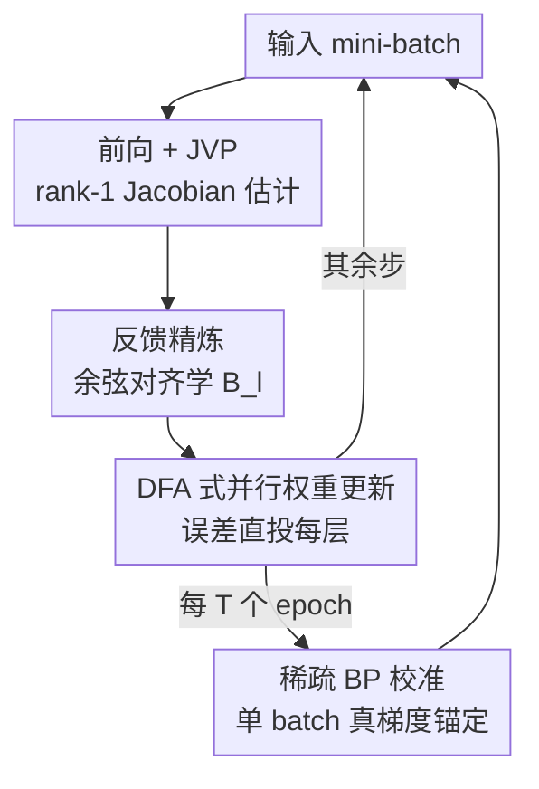

# Scaling Direct Feedback Learning with Jacobian Alignment Guarantees

**会议**: ICLR 2026  
**OpenReview**: [https://openreview.net/forum?id=kasbbmwk3s](https://openreview.net/forum?id=kasbbmwk3s)  
**领域**: 训练算法 / 生物可塑性学习 / 反向传播替代  
**关键词**: 直接反馈对齐(DFA), 前向梯度, Jacobian 对齐, 并行训练, 反向传播替代

## 一句话总结
针对直接反馈对齐(DFA)在深层卷积网络和 Transformer 上彻底失效的问题，本文提出 GrAPE：用前向模式 JVP 估出 rank-1 Jacobian，再用一个局部余弦对齐损失把每层的随机反馈矩阵"校正"到真实梯度方向，并周期性地插入单 batch 的真 BP 校准，从而在保持逐层并行更新的同时，首次把 DFA 类方法成功扩展到 VGG-16 / ResNet / Transformer，把和 BP 的差距收掉了一大半。

## 研究背景与动机

**领域现状**：反向传播(BP)至今仍是训练深度网络的事实标准，但它有两个结构性弊端阻碍并行化——前向与反向之间的**权重对称性**（反向用的是 $W^\top$）以及**误差的逐层串行回传**。为了绕开这两点，社区主要探索了两条路线：一是随机反馈（FA / DFA），用固定随机矩阵 $B_l$ 取代转置权重，DFA 更进一步把输出误差**直接**投影到每一层，实现了真正的逐层并行更新 $\delta a_l = (B_l \nabla\mathcal{L}_L)\odot\sigma'_l(a_l)$；二是前向梯度（Forward Gradient）方法，用前向模式自动微分（FwAD）沿随机方向算 Jacobian-向量积来无偏估梯度，彻底取消反向通路。

**现有痛点**：DFA 虽然能并行，但在复杂结构上**几乎不可用**——在 VGG-16 上准确率只有 1.0%，在 ResNet-20/CIFAR-100 上只有 20.9%（BP 是 68.7%）。前向梯度方法则因为在参数空间采样，**方差随维度线性增长**，难以扩展到现代大模型。两条路各有死穴。

**核心矛盾**：DFA 失效的根因在于——固定随机反馈方向 $B_l$ 与真实梯度 $\nabla\mathcal{L}_l$ 之间**无法保证正余弦相似度**。卷积层的线性变换本质是块 Toeplitz 结构，单个固定随机矩阵根本无法复现这种结构，于是反馈方向和真实梯度严重错位。而下降的充分条件恰恰是 Zoutendijk 式的对齐：$\cos(\omega_l)=\frac{\nabla\mathcal{L}_l^\top B_l}{\|\nabla\mathcal{L}_l\|\cdot\|B_l\|}>0$。一旦这个余弦变负，反馈就不再能降低损失。

**本文目标**：在保留 DFA 逐层并行优势的前提下，让反馈矩阵**自适应地对齐**到真实梯度方向，并为这种对齐提供可证明的统计保证。

**切入角度**：作者注意到前向梯度虽然方差高，但它提供的是**无偏**的 Jacobian 信息——与其用它直接当梯度（高方差），不如**只用它来校正反馈方向**。一个 rank-1 的 Jacobian 估计就足以把 $B_l$ 拉向正确方向，而 rank-1 估计与真 Jacobian 之间存在严格为正的期望余弦下界。

**核心 idea**：用前向模式 JVP 估出 rank-1 Jacobian，通过一个局部余弦对齐损失在线学习反馈矩阵 $B_l$（让随机反馈"变得有信息"），再辅以稀疏的单 batch BP 校准压住高维下的方差漂移——把"随机反馈的并行性"和"前向梯度的对齐保证"缝在一起。

## 方法详解

### 整体框架

GrAPE（Gradient-Aligned Projected Error）的核心是把 DFA 那一步"用固定 $B_l$ 投影误差"改造成"用一个**会自适应对齐到真梯度**的 $B_l$ 投影误差"。在每个 mini-batch 内，它走四步：(1) 一次携带 dual 数的前向追踪，顺便用前向模式 AD 算出每层的 JVP，从而得到 rank-1 Jacobian 估计 $\hat{J}_l$；(2) 反馈精炼——用一个局部余弦对齐损失对 $B_l$ 做一步梯度更新，让它转向 $\hat{J}_l$，再做列归一化；(3) 用精炼后的 $B_l$ 执行标准 DFA 式逐层并行权重更新；(4) 每隔 $T$ 个 epoch，在单个随机 mini-batch 上插一次真 BP，用精确梯度重新锚定所有 $W_l$。

关键在于：第 1-3 步**全程不需要任何反向传播**，只用前向模式 JVP（成本约等于一次额外前向，且不随参数量增长），所以绝大多数更新都是逐层并行的；只有第 4 步是串行 BP，但它每 $T$ 个 epoch 才在一个 batch 上发生一次（$T=1$ 时也仅占 BP 反向次数的约 0.5%）。这构成一个**双时间尺度**方案：高频的并行 GrAPE 步 + 低频的稀疏 BP 同步。

### 关键设计

**1. rank-1 Jacobian 前向估计与正期望对齐下界：用 JVP 廉价拿到"指向真梯度"的方向**

DFA 的死穴是它"看不见"自己的反馈方向偏了多少。GrAPE 用前向模式 JVP 来提供这把尺子。对第 $l$ 层的 Jacobian $J_l=\frac{\partial\hat{y}}{\partial h_l}$，取扰动 $p\sim\mathcal{N}(0,I_{n_l})$，前向算出 JVP $J_l p$，构造无偏 rank-1 估计 $\hat{J}_l = (J_l p)\,p^\top$。这一步只需一次携带 dual 的前向追踪，成本约等于一次前向，且**不随参数量缩放**。

它之所以有用，是因为这个 rank-1 估计与真 Jacobian 之间的 Frobenius 余弦有**严格为正的期望下界**。把 $p=r\,s$（$s$ 在单位球面上均匀）代入可得 $\cos_F(J_l,\hat{J}_l)=\frac{\|J_l s\|}{\|J_l\|_F}$，再投影到 $J_l$ 的首奇异方向并用单位球面坐标的标准界，得到

$$\mathbb{E}\!\left[\cos_F\!\big(J_l,\hat{J}_l\big)\right]\;\ge\;\sqrt{\frac{2}{\pi n_l}}\,\frac{\|J_l\|_2}{\|J_l\|_F},$$

对任意 $J_l\neq 0$ 都严格为正。批估计（$B$ 个独立 rank-1 估计平均）会以 $O(1/\sqrt{B})$ 速率向该下界集中。这条估计层面的保证，正是后面对齐目标的理论支撑——它说明"朝 $\hat{J}_l$ 对齐"在期望意义下确实是朝真梯度对齐。

**2. 局部余弦对齐损失学反馈矩阵：把固定随机 $B_l$ 在线校正到 Jacobian 方向**

有了 $\hat{J}_l$ 这个指向真梯度的廉价方向，GrAPE 不再让 $B_l$ 固定不变，而是在每个 batch 上用一个**局部对齐损失**把它拉过去。定义 $\cos(\omega_l):=\cos_F(B_l,\hat{J}_l)=\frac{\langle B_l,\hat{J}_l\rangle_F}{\|B_l\|_F\,\|\hat{J}_l\|_F}$，对齐损失即

$$\mathcal{L}_{\text{align}}(B_l)=1-\cos(\omega_l),$$

对 $B_l$ 走一步梯度下降 $B_l \leftarrow B_l-\eta_{B_l}\nabla_{B_l}\mathcal{L}_{\text{align}}(B_l)$，再按列归一化 $B_l[:,k]\leftarrow B_l[:,k]/(\|B_l[:,k]\|+\varepsilon)$ 以保证只调方向不调尺度。实现上用**逐列余弦的经验平均** $\bar{c}_l=\frac{1}{n_l}\sum_k\cos(B_l[:,k],\hat{J}_l[:,k])$ 作为 $\cos_F$ 的便捷代理（列归一化后两者权重接近均匀）。这一步同样只用前向 JVP、不需 BP，且作者发现**每 batch 一步对齐就够**，再多无增益。

它有效的根据是 Zoutendijk 视角加一条 Frobenius 余弦复合引理：若 $\cos_F(B_l,\hat{J}_l)$ 和 $\cos_F(\hat{J}_l,J_l)$ 都有正的下界，则能诱导出 $\cos_F(B_l,J_l)$ 的下界——也就是说，把 $B_l$ 对齐到估计 Jacobian，间接把它对齐到了真 Jacobian。这与"更新方向与真梯度正期望余弦即可在期望意义下收敛到稳定点"的标准随机逼近结论相呼应。值得强调：仅两个中间余弦为正**不自动**保证复合界为正，所以才需要下面的 BP 校准来压方差。和旧的权重镜像、KP 规则、SVD 多损失对齐相比，GrAPE 只用**单个余弦损失**、且天然适配逐层并行，不继承 FA 的串行性。

**3. 稀疏单 batch BP 校准：用极小的串行代价压住高维前向梯度的方差漂移**

前向梯度估计的方差随隐藏维度**线性增长**，在 VGG-16 / Transformer / ResNet 这类又深又宽的模型上，纯 GrAPE 的对齐会被噪声带偏、逐渐漂移。GrAPE 的对策是周期性地"重锚"：每隔 $T$ 个 epoch，**只在一个随机 mini-batch** 上做一次完整 BP，用精确梯度对所有 $W_l$ 做一步标准梯度下降。

这一步的代价被刻意压到极小——以 ResNet-20、batch 256、CIFAR-100 为例，每个 epoch 约 195 个 batch，$T=1$ 时校准只占 BP 反向次数的约 0.5%，摊销开销约为 $O(N_b+1/T)$ 对比 BP 的 $O(N_b)$。它有效是因为：高频并行 GrAPE 步快速推进，低频精确 BP 步定期把累积的方差漂移"拉回正轨"，形成双时间尺度的稳定训练。实验显示 $T=1$ 显著优于 $T>1$，且对越深越大的模型越关键——这也印证了"漂移来自高维方差"这一解释。作者把它类比为联邦学习里的周期性同步。

### 损失函数 / 训练策略
- **对齐损失**：$\mathcal{L}_{\text{align}}(B_l)=1-\bar{c}_l$，每 batch 对每层 $B_l$ 走一步，随后列归一化。
- **DFA 主更新**：$\delta a_l=(B_l\nabla\mathcal{L}_L)\odot\sigma'_l(a_l)$，$\delta W_l=-\eta\,\delta a_l\,h_{l-1}^\top$，逐层并行。
- **扰动空间自适应**：每层在权重空间与激活空间中**选维度更小的那个**做扰动（深层卷积网络的首层激活空间反而可能更小），以降低估计方差与成本。
- **BP 校准**：每 $T$ 个 epoch 在单 batch 上做一次真 BP；Transformer 内注意力层仍沿用 Launay et al. (2020) 的内部 BP，宏(macro，每 encoder block 一个反馈)/微(micro，每子层一个反馈)两种粒度。

## 实验关键数据

### 主实验

浅层网络（无需 BP 校准），CIFAR-100 准确率：

| 方法 | 可并行 | MNIST-CNN | CIFAR10-CNN | CIFAR100-CNN |
|------|--------|-----------|-------------|--------------|
| BP | 否 | 99.03 | 74.66 | 44.22 |
| FA | 否 | 98.7 | 71.05 | 35.0 |
| DFA | 是 | 98.6 | 69.34 | 34.53 |
| PEPITA | 是 | NA | NA | NA |
| **GrAPE (ours)** | 是 | **98.8** | **73.1** | **38.0** |

深层卷积网络 + BP 校准（$T=1$），CIFAR-100：

| 方法 | AlexNet | VGG-16 |
|------|---------|--------|
| BP | 64.61 | 70.33 |
| DFA | 42.59 | **1.00** |
| DFA + 校准 | 49.37 | 29.40 |
| GrAPE | 45.45 | 32.40 |
| **GrAPE + 校准** | **62.63** | **56.93** |

ResNet（CIFAR-100），以及 Transformer/WikiText-103 困惑度（越低越好）：

| 设置 | BP | DFA | GrAPE | DFA+校准(T=1) | GrAPE+校准(T=1) |
|------|----|----|-------|---------------|-----------------|
| ResNet-20 acc | 68.72 | 20.94 | 24.28 | 59.80 | **64.82** |
| ResNet-56 acc | 71.42 | 24.29 | 29.33 | 62.43 | **66.92** |
| Transformer Macro ppl | 29.8 | 52.0 | 42.3 | 42.7 | **33.1** |
| Transformer Micro ppl | — | 93.3 | 81.1 | 78.8 | **67.3** |

### 消融实验

| 配置 | 关键现象 | 说明 |
|------|---------|------|
| 纯 GrAPE（无校准） | 浅层全面超 FA/DFA/DRTP/PEPITA | 低维下前向梯度足够准，不需 BP |
| 纯 GrAPE vs 纯 DFA | ResNet-20 上 24.3 vs 20.9 | 自适应反馈本身就强于固定随机反馈 |
| GrAPE 无校准 vs DFA 有校准 | VGG-16/Transformer 上前者反超 | 对齐规则的增益甚至盖过一次 BP 校准 |
| 校准频率 $T$:1→5→10→50 | 准确率单调下降 | 越深越大的模型越依赖高频校准 |

### 关键发现
- **自适应反馈是根本增益**：即便都不做 BP 校准，GrAPE 也稳定优于 DFA；在 VGG-16、Transformer 上"无校准 GrAPE"甚至超过"有校准 DFA"，说明对齐规则本身比固定随机反馈更优，BP 校准只是锦上添花的方差控制。
- **BP 校准对深大模型是命门**：VGG-16 上 DFA 从 1.0% 被一次/epoch 的校准拉到 29.4%，GrAPE+校准更达 56.9%；作者归因于前向梯度方差随隐藏维度线性增长，深大模型噪声更大。
- **并行潜力**：在隐藏维 128、深度 2/4/8 的 Transformer 原型上（用 CUDA streams + double-forward 算 JVP），GrAPE 每 batch 平均耗时约为 BP 的 1/3，深度越大优势越明显——尽管当前 BioTorch 实现是串行的、每步仅有 6–20% 额外开销。

## 亮点与洞察
- **"不用前向梯度当梯度，只用它当指南针"**：前向梯度方差高、不适合直接做更新，但 rank-1 估计的**方向**信息（正期望余弦）足够用来校正反馈矩阵——这个"降级使用"的思路很巧妙，绕开了前向梯度的高方差死穴。
- **理论与算法严丝合缝**：Zoutendijk 下降条件 → rank-1 估计正期望余弦下界 → 余弦复合引理 → 单一对齐损失，整条逻辑链让"为什么对齐 $\hat{J}_l$ 有用"有据可循，而不是经验调出来的 trick。
- **双时间尺度的代价折中可迁移**：高频并行近似步 + 极稀疏精确步（仅 0.5% 反向）的组合，是一种通用的"用少量精确信号锚住大量廉价近似"的范式，可迁移到其他需要并行化但怕漂移的训练场景。
- **首次把 DFA 扩到现代架构**：VGG-16 / ResNet-20/56 / Transformer-Base 这些 DFA 历来"灾难性失败"的架构上，GrAPE 第一次让 DFA 类方法逼近 BP。

## 局限与展望
- **并行加速尚未真正落地**：当前 BioTorch 原型是单 GPU 串行实现，逐层并行的真实 wall-clock 收益只有小原型佐证，需要专用并行核才能兑现，作者明确留作 future work。
- **深大模型离不开 BP 校准**：纯 GrAPE 在深层网络上仍远逊 BP（ResNet-20 仅 24.3% vs 68.7%），必须靠 $T=1$ 的频繁校准才能补上，"完全无 BP"的承诺在大模型上打了折扣。
- **校准调度可改进**：现按固定 epoch 间隔随机选 batch，作者提出可改为由对齐度量触发的**事件驱动/自适应**校准，并用不确定性采样 / core-set 挑更有信息量的校准样本。
- **Transformer 注意力内部仍需 BP**：宏/微反馈只替换了 block/子层间的反馈，注意力块内部仍保留 BP，并非端到端无反向。
- **复现性对照存疑**：作者指出与 FDFA 的对比中无法复现其报告数字（见附录），横向比较需谨慎。

## 相关工作与启发
- **vs DFA (Nøkland, 2016)**：DFA 用**固定**随机 $B_l$ 直投误差，无法度量/纠正与真梯度的夹角，在 CNN/Transformer 上崩溃；GrAPE 用前向 JVP **在线学习** $B_l$ 去对齐 Jacobian，保留并行性的同时把对齐拉正。
- **vs 前向梯度 (Baydin et al., 2022; Ren et al., 2022)**：它们直接用 JVP 当无偏梯度估计，但参数空间采样方差大、难扩展；GrAPE 只用 rank-1 估计的方向去校反馈，把高方差信号"降维"成对齐信号。
- **vs 权重镜像 / KP 规则 / FDFA (Akrout 2019; Bacho & Chu 2024)**：这些自适应反馈要么本质串行、要么依赖复杂的 SVD/多项损失机制；GrAPE 只用单个余弦损失，且给出解析可证的 rank-1 对齐保证。
- **vs SVD 空间解锁 (Roy et al., 2025)**：后者优化 5 个局部损失（含余弦项）对齐前向奇异向量；GrAPE 用单损失 + JVP，更简洁且有期望余弦下界。

## 评分
- 新颖性: ⭐⭐⭐⭐⭐ 用 rank-1 JVP 的方向信息校正 DFA 反馈、并配上正期望余弦下界，把两条独立路线缝得既新又有理论支撑。
- 实验充分度: ⭐⭐⭐⭐ 覆盖 MLP/CNN/VGG/ResNet/Transformer 多架构多任务、10 次重复，但真实并行加速只有小原型佐证。
- 写作质量: ⭐⭐⭐⭐ 理论与算法逻辑链清晰，附录详尽；术语略密集，对不熟悉 DFA 的读者门槛偏高。
- 价值: ⭐⭐⭐⭐ 首次让 DFA 类方法扩到现代架构，为可并行训练提供了有理论保证的现实路径。

<!-- RELATED:START -->

## 相关论文

- [\[ICLR 2026\] Active Learning for Decision Trees with Provable Guarantees](active_learning_for_decision_trees_with_provable_guarantees.md)
- [\[ICLR 2026\] Noisy-Pair Robust Representation Alignment for Positive-Unlabeled Learning](noisy-pair_robust_representation_alignment_for_positive-unlabeled_learning.md)
- [\[ICLR 2026\] Regulating Internal Alignment Flows for Robust Learning Under Spurious Correlations](regulating_internal_alignment_flows_for_robust_learning_under_spurious_correlati.md)
- [\[ICLR 2026\] Learning Adaptive Distribution Alignment with Neural Characteristic Function for Graph Domain Adaptation](learning_adaptive_distribution_alignment_with_neural_characteristic_function_for.md)
- [\[ACL 2025\] HelpSteer3: Human-Annotated Feedback and Edit Data to Empower Inference-Time Scaling](../../ACL2025/others/helpsteer3_human-annotated_feedback_and_edit_data_to_empower_inference-time_scal.md)

<!-- RELATED:END -->
