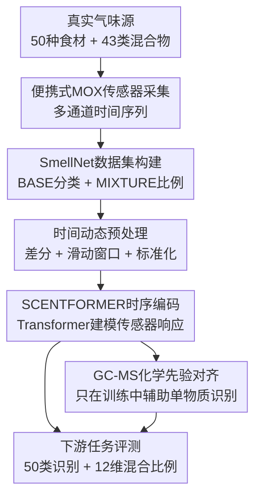

# SmellNet: A Large-scale Dataset for Real-world Smell Recognition

**会议**: ICLR2026  
**OpenReview**: [https://openreview.net/forum?id=aUnheo6zFD](https://openreview.net/forum?id=aUnheo6zFD)  
**代码**: https://github.com/MIT-MI/SmellNet  
**领域**: 其他  
**关键词**: 机器嗅觉, 气体传感器, 时序建模, GC-MS, 混合气味识别  

## 一句话总结
SmellNet 用低成本便携式气体传感器采集 50 种自然食材和 43 类混合气味的真实时序信号，并用结合时间差分、滑动窗口和 GC-MS 化学先验的 SCENTFORMER 建立机器嗅觉基准。

## 研究背景与动机
**领域现状**：AI 对视觉、文本、语音已经有成熟的大规模数据、模型和评测协议，但“闻气味”这件事仍然停在比较早期的阶段。已有嗅觉数据大致分成两类：一类是人类对单分子气味或混合气味的语义评分，另一类是电子鼻/气体传感器对少量样本的读数。前者更接近人类感知标签，后者更接近真实部署设备，但规模、覆盖范围和标准化程度都有限。

**现有痛点**：现实应用需要的是便携、实时、可部署的嗅觉 AI，例如食品过敏源检测、制造流程监控、环境监测，甚至疾病或压力状态相关挥发物识别。过去很多工作依赖大型化学实验设备采集的 GC-MS 数据，或者在小数据集上做手工特征和简单分类器；这些做法要么不便携，要么缺少真实世界里传感器随时间变化、受环境扰动影响的动态信号。

**核心矛盾**：气味本身是复杂的化学混合物，而低成本 MOX 传感器的单个通道又不是“精确测量某一种化合物”的仪器。它们对多类挥发物交叉敏感，读数还会受漂移、基线和环境影响。因此，机器嗅觉的关键不是把某个通道解释成绝对浓度，而是学习多通道时序响应里相对变化、短期动态和组合模式。

**本文目标**：作者希望先补齐这个方向最缺的一块基础设施：一个足够大、真实、可复现、传感器侧的机器嗅觉数据集。它既要支持单一物质的 50 类分类，也要支持混合气味的成分比例预测；同时，论文还给出一个时序模型基线，检验时间动态、GC-MS 化学先验和混合物建模到底能带来多少收益。

**切入角度**：作者没有从人类嗅觉描述词或昂贵化学仪器出发，而是直接构建便携式气体传感器阵列，让模型面对真实设备会看到的多通道时间序列。这个角度的好处是很工程化：如果低成本传感器读数已经含有足够的可分信息，那么后续才有机会把嗅觉 AI 做成实时、低功耗、可部署的系统。

**核心 idea**：用大规模真实传感器时序数据作为机器嗅觉的基础基准，再用时间差分、滑动窗口和 GC-MS 对齐把低分辨率气体读数转成可学习的气味表示。

## 方法详解

### 整体框架
SmellNet 的整体流程可以分成两条主线：第一条是数据集构建，作者用便携式 MOX 气体传感器在受控容器里采集自然食材和混合香味材料的多通道时间序列；第二条是建模与评测，作者把这些信号切成窗口，做时间差分和标准化，再用 SCENTFORMER 预测单一物质类别或混合物比例，并在单物质任务中用 GC-MS 嵌入做跨模态监督。整篇论文的重点不是提出一个复杂网络，而是把“气味信号如何采、如何预处理、如何评测”这条链路标准化。

在数据侧，SMELLNET-BASE 包含 50 种基础物质，覆盖坚果、香料、草本、水果和蔬菜五大类。每种物质采集 6 次，每次 10 分钟，在 1 Hz 下记录 6 个传感器通道，所以单物质部分总计约 50 小时、180,000 个时间步。SMELLNET-MIXTURE 则选择 12 种基础气味材料，构造二元和三元固定体积比例混合物；受采集环境大小限制，混合物只用 Grove 多通道传感器的 4 个通道，在 10 Hz 下采集，形成 18 小时、648,000 个时间步。两部分合计 68 小时、828,000 个时间步。

在模型侧，SCENTFORMER 把每个样本视作 $x=(x_1,\ldots,x_T)\in\mathbb{R}^{T\times d}$ 的多通道时间序列。编码器 $f_\theta$ 输出固定维度表示 $h=f_\theta(x)$。对 BASE，任务是 50 类分类；对 MIXTURE，任务是预测 12 维配方比例向量 $\pi\in[0,1]^{12}$，并满足 $\sum_i\pi_i=1$。这让论文同时覆盖了“这是什么味道”和“这个混合味道由哪些成分按什么比例组成”两个层次。

### 关键设计
**1. 传感器侧大规模基准：把机器嗅觉从小样本演示推向可复现实验**

SmellNet 最核心的贡献是数据集，而不是单个模型技巧。作者用 MQ-3、MQ-5 和 Grove Multichannel Gas Sensor V2 组成低成本 MOX 传感器阵列，记录 CO、NO2、VOC、C2H5OH、Alcohol、LPG 等制造商标注通道。论文特别强调，这些通道名不能理解为对纯化合物的精确浓度测量；MOX 传感器本来就是交叉敏感的，单个通道可能对多类挥发物都有响应。正因为如此，数据集把重点放在多通道联合时间模式上，而不是把每个通道硬解释成单一化学物质。

采集协议也服务于“可学而不是偶然可分”。每个基础物质在不同日期重复 6 次，每次放入透明受控容器中采集 10 分钟，结束后通风并等待传感器稳定，尽量减少上一轮气味残留。混合物部分进一步构造 12 种气味材料的 126 个配方实例，并区分 test-seen 和 test-unseen：前者考验已见比例/组合在不同 session 下的稳定性，后者考验从未见过的组合或比例的组合泛化。这样设计后，模型不能只记住一次采样的环境状态，而必须学习对气味成分更稳定的时序响应。

**2. 时间动态预处理：用差分和窗口暴露气味响应过程**

低成本气体传感器的绝对读数容易受漂移、设备偏置和背景环境影响。如果直接把原始 $x_t$ 当作静态特征，模型很可能学到某一天、某个容器状态或某个通道基线，而不是气味进入传感器后的动态变化。作者因此使用一阶时间差分：对固定滞后 $p$，计算 $\Delta x_t=x_t-x_{t-p}$；当 $p=0$ 时保留原始信号。这个变换把模型注意力从“现在读数是多少”转到“最近一段时间读数怎样变”，更符合 MOX 传感器对挥发物积累和扩散过程的响应方式。

滑动窗口则解决样本量和时序上下文之间的矛盾。每条 10 分钟记录被切成长度 $w$ 的窗口，stride 为 $w/2$。以 BASE 的 1 Hz、600 个时间步为例，$w=50$ 时可得到 23 个有效窗口，$w=100$ 时得到 11 个窗口。短窗口增加训练样本数，长窗口提供更稳定的气味动态；实验显示 $w=100$ 通常更稳，而差分 $p=25$ 是提升单物质识别的关键因素。最后，作者用训练集统计量做标准化，减少不同通道量纲和噪声幅度对模型的影响。

**3. SCENTFORMER时序编码：把传感器读数当成序列而不是表格**

SCENTFORMER 采用 pre-norm Transformer encoder：窗口内每个时间步的多通道读数先线性投影到隐空间，可加入位置编码和可学习的 `[CLS]` token，再经过多层 Transformer。输出通过 mean pooling 或 `[CLS]` pooling 得到固定长度表示，之后接 50 类分类头、混合物存在性头和比例预测头。这个选择的关键在于，气味识别不是看某一瞬间的读数，而是看不同传感器通道随时间共同上升、滞后、饱和或回落的模式。

论文把 SCENTFORMER 与 MLP、CNN、LSTM 放在同一套预处理和训练协议下比较，避免把收益简单归因于模型容量。结果显示，非时序 MLP 在许多类别上明显吃亏，而 CNN、LSTM、Transformer 都能从时序结构中获益。SCENTFORMER 的优势尤其体现在混合物比例预测上，因为混合气味的信号是多个成分挥发动态叠加后的结果，单点特征更难分离。

**4. GC-MS化学先验：训练时用高分辨率化学信息校准低分辨率传感器表示**

传感器数据分辨率低，但食品和气味材料的挥发化合物可以从 FooDB 等数据库中获得 GC-MS 相关描述。作者没有要求测试时重新做 GC-MS 测量，而是为每个基础 ingredient 预先构造一个固定的 GC-MS 嵌入，主要版本是把 EI 质谱在 40-500 m/z 范围内按 1 Da 分箱、归一化并对化合物求平均得到的 Xspec 表示。它相当于 ingredient 级别的化学先验。

训练时，传感器窗口嵌入和对应 ingredient 的 GC-MS 嵌入通过对称对比学习对齐：匹配的 sensor-GC-MS 对相似度更高，不匹配的对被推远。这个机制的意义是给低成本传感器表示一个化学结构上的锚点，尤其在模型较弱或原始信号较难分时有帮助。但论文也诚实展示了它不是万能增强：强时序模型有时已经捕捉到足够的判别信息，GC-MS 对齐可能带来小幅收益，也可能与短程时序特征发生冲突。重要的是，GC-MS 只作为训练监督使用，推理时仍然只需要便携式传感器读数。

### 损失函数 / 训练策略
BASE 单物质识别使用 softmax 分类和交叉熵损失，并在有 GC-MS 监督时加入对称对比学习。对一个 batch 中的传感器嵌入 $z_i^{(s)}$ 和 GC-MS 嵌入 $z_i^{(g)}$，论文使用余弦相似度和温度 $\tau$ 做双向匹配，让 $z_i^{(s)}$ 更接近 $z_i^{(g)}$，同时远离其他 ingredient 的 GC-MS 表示。

MIXTURE 任务预测 12 维归一化比例向量。目标配方先从原始体积比例 $\tilde{\pi}$ 归一化为 $\pi^*=\tilde{\pi}/\sum_i\tilde{\pi}_i$。训练损失是三项组合：KL divergence 约束整体分布接近真实配方，hinge-$\ell_1$ 只在真实存在的成分上惩罚超过容忍阈值 $\epsilon$ 的比例误差，focal BCE 则处理成分存在/不存在的类别不均衡。直观地说，模型既要知道“哪些成分在里面”，也要把存在成分的比例预测到配方网格附近。

实验训练协议比较统一。BASE 任务用最后一天作为测试集，前五天训练，同时附录还报告 leave-one-day-out；模型训练 90 epochs，batch size 32，学习率从 $3\times10^{-4}$、$10^{-3}$、$3\times10^{-3}$ 中选择。MIXTURE 任务训练 60 epochs，batch size 64；由于 10 Hz 采样下小滞后变化不明显，而大滞后会减少有效窗口，混合物实验使用原始窗口而不做时间差分。

## 实验关键数据

### 主实验
论文主要评测三个问题：BASE 单一物质能否分类，GC-MS 对齐是否有帮助，MIXTURE 的配方比例能否从传感器时序中恢复。最有代表性的主结果如下。

| 任务 | 设置 | 最佳/代表模型 | 关键指标 | 结论 |
|------|------|---------------|----------|------|
| SMELLNET-BASE | Sensor-only, $w=100,p=25$ | SCENTFORMER | Acc@1 56.1 / Acc@5 87.4 / F1 55.5 | 时间差分 + 长窗口能显著提升单物质识别 |
| SMELLNET-BASE | GC-MS contrastive, $w=100,p=25$ | SCENTFORMER | Acc@1 63.3 / Acc@5 86.1 / F1 61.7 | GC-MS 监督让最佳 Transformer 的 Top-1 提升 7.2 点 |
| SMELLNET-MIXTURE seen | $w=50$ | SCENTFORMER | MAE 0.0395 / Top-1@0.1 50.2 / Top-K 87.9 | 已见组合/比例的跨 session 泛化最好 |
| SMELLNET-MIXTURE unseen | $w=50$ | SCENTFORMER | Top-1@0.1 16.0 / Top-K 38.9 | 未见混合组合仍很难，但明显高于随机 Top-K 约 16.7% |

单物质分类表格里最清楚的模式是：差分 $p=25$ 比原始信号 $p=0$ 稳定得多。比如 SCENTFORMER 在 $w=100$ 时从 sensor-only 的 39.9 Acc@1 提升到 56.1；加入 GC-MS 后进一步到 63.3。CNN 和 LSTM 也从差分中受益，说明贡献并不只是 Transformer 架构，而是“把气味响应看成动态过程”这件事本身。

混合物任务中，SCENTFORMER 在 test-seen 上 Top-1@0.1 达到 50.2，是表中最高；但 test-unseen 只有 16.0，说明模型对新组合和新比例的组合泛化仍然薄弱。Top-K 还能达到 38.9，表示它经常能把真实成分缩小到较合理的候选集合，但比例精确度不足。

### 消融实验
| 消融/分析 | 关键数据 | 说明 |
|-----------|----------|------|
| 时间差分 | across models 平均提升约 16.1% Acc@1 | MOX 传感器的相对变化比绝对读数更判别 |
| 窗口长度 | SCENTFORMER leave-one-day-out: $w=50$ Acc@1 49.4±8.0, $w=100$ 53.0±6.0 | 长窗口牺牲样本数但提供更稳定上下文 |
| GC-MS 编码 | SCENTFORMER $w=100,p=25$: sensor-only 56.1, Xatom 58.5, Xspec 63.3 | 质谱分箱表示比粗元素组成更有信息 |
| 单通道 mask | $w=50,p=25$ 下遮蔽 LPG 使 Acc@1 下降约 28 点 | 每个气体通道都有贡献，LPG/VOC/Alcohol 在差分设置下尤其重要 |
| 采集时长 | $p=25,w=50$ 下 200 steps Acc@1 45.7，500 steps 53.2，约 600 steps 50.6 | 前 400-600 秒已捕捉主要动态，10 分钟采样较合理 |

### 关键发现
- 时间差分是全文最稳定的建模收益来源。它削弱了慢漂移和基线偏置，让模型聚焦气味进入容器后传感器响应的变化率。
- 水果、香料等类别在 PCA 和分类结果中更容易分开；坚果和蔬菜存在明显重叠，是当前传感器分辨率下的难点。
- GC-MS 监督对弱模型和原始信号更有帮助，对强时序模型效果混合，说明化学先验和传感器动态不是简单相加关系。
- MIXTURE 的 seen split 表现可用，但 unseen split 下降很大，真实世界的混合气味组合泛化仍是开放问题。
- SCENTFORMER 推理开销很小，L40S 上每窗口约 0.0191-0.0479 ms，说明瓶颈更多在数据采集、传感器可靠性和泛化，而不是模型推理速度。

## 亮点与洞察
- 这篇论文最有价值的地方是把“嗅觉 AI”从概念演示拉回到标准 benchmark。50 种自然物质、43 类混合物、68 小时数据虽然还不算巨型，但对便携式传感器机器嗅觉来说已经提供了可复现实验基础。
- 作者对 MOX 传感器的解释比较克制：不把通道名当成精确化学浓度，而是承认交叉敏感和低分辨率，再让模型学习联合时序签名。这一点避免了很多传感器论文容易出现的过度化学解释。
- test-seen / test-unseen 的划分很关键。气味混合物如果只测已见组合，很容易高估应用前景；未见组合上的大幅掉点暴露了机器嗅觉真正难的地方是组合泛化。
- GC-MS 的用法很实用：训练时用数据库化学先验校准表示，部署时不需要昂贵仪器。这种“高成本模态训练监督、低成本模态推理”的范式可以迁移到食品检测、环境传感、可穿戴生理信号等任务。
- 论文也提醒我们，新的多模态不一定只有文本、图像、语音。气味传感器时序与化学数据库、语言描述、甚至视觉食品信息之间都有潜在融合空间。

## 局限与展望
- 数据采集仍然主要在受控容器中完成，缺少复杂开放环境里的背景扣除、气流变化、传感器摆放变化和长期漂移测试。真实部署时这些因素可能比论文中的分类任务更难。
- SMELLNET-MIXTURE 的气味材料来自 12 种油、提取物或 fragrance oil，和 BASE 中的自然食材并不完全同源；这让混合物任务更像一个配方比例基准，而不是任意真实食物混合气味的完整模拟。
- GC-MS 先验来自 FooDB 等公开数据库，而不是同一批样本的同步 GC-MS 测量。它能提供 ingredient 级化学结构信息，但不能解释具体采集 session 中挥发浓度、温度、湿度或容器动态带来的差异。
- 50 类基础物质和 12 维混合物只是机器嗅觉的早期规模。要走向现实应用，还需要更多物质类别、更细粒度浓度、更长时间跨度、更换设备后的跨硬件泛化，以及面向异常检测/安全检测的评测任务。
- 当前模型主要学习监督分类和比例预测，尚未充分利用气味的物理扩散过程、传感器响应曲线建模或组合生成机制。未来可以把物理先验、域自适应和组合数据增强引入 SCENTFORMER 之外的模型。

## 相关工作与启发
- **vs 人类嗅觉感知数据集**: Dravnieks Atlas、DREAM Challenge、Olfactory Metamers 等关注人对气味的语义评分或相似性判断；SmellNet 关注传感器读数，因此更适合训练可部署机器，而不是直接预测人类主观描述。
- **vs GC-MS / 分子图模型**: DeepNose、principal odor map 等工作更多从分子结构或高分辨率化学测量出发；SmellNet 的难点是低成本传感器信号低分辨率、噪声大、但实时可获得。
- **vs 传统电子鼻小数据集**: 咖啡质量、牛肉质量、gas sensor drift 等数据集通常类别窄、样本少或场景单一；SmellNet 覆盖自然食材和混合物，并给出统一的 BASE/MIXTURE 任务。
- **对多模态学习的启发**: GC-MS 对齐展示了一种跨模态监督路径：训练期用高质量但昂贵的化学表示塑形，推理期只保留便携传感器。这和视觉-语言预训练、音频-文本对齐有相似思想，但模态噪声和物理约束完全不同。
- **对数据集论文的启发**: 好的 benchmark 不只是“更多样本”，还要有清楚的采集协议、split 设计、基线、消融和失败案例。SmellNet 最值得复用的不是某个 Transformer，而是它把机器嗅觉拆成可测任务的方式。

## 评分
- 新颖性: ⭐⭐⭐⭐☆ 传感器侧机器嗅觉大规模基准很少见，贡献形态新颖，但模型本身主要是合理组合而非结构突破。
- 实验充分度: ⭐⭐⭐⭐☆ 主任务、混合物、GC-MS 对齐、窗口/差分/channel mask 都覆盖到了；真实开放环境泛化还不足。
- 写作质量: ⭐⭐⭐⭐☆ 数据集、模型和实验链条清楚，附录细节充分；部分 GC-MS 表示和混合物设置需要读附录才能完全理解。
- 价值: ⭐⭐⭐⭐⭐ 对机器嗅觉、低成本传感器 AI、食品/环境/健康检测都有基础设施意义，是一个能带动后续工作的 benchmark。

<!-- RELATED:START -->

## 相关论文

- [\[CVPR 2026\] ImmerIris: A Large-Scale Dataset and Benchmark for Off-Axis and Unconstrained Iris Recognition in Immersive Applications](../../CVPR2026/others/immeriris_a_large-scale_dataset_and_benchmark_for_off-axis_and_unconstrained_iri.md)
- [\[CVPR 2026\] UniMERNet: A Universal Network for Real-World Mathematical Expression Recognition](../../CVPR2026/others/unimernet_a_universal_network_for_real-world_mathematical_expression_recognition.md)
- [\[CVPR 2026\] MSPT: Efficient Large-Scale Physical Modeling via Parallelized Multi-Scale Attention](../../CVPR2026/others/mspt_efficient_large-scale_physical_modeling_via_parallelized_multi-scale_attent.md)
- [\[CVPR 2026\] Multi-view Crowd Tracking Transformer with View-Ground Interactions Under Large Real-World Scenes](../../CVPR2026/others/multi-view_crowd_tracking_transformer_with_view-ground_interactions_under_large_.md)
- [\[ICML 2026\] Torus Graphs for Large-Scale Neural Phase Analysis](../../ICML2026/others/torus_graphs_for_large_scale_neural_phase_analysis.md)

<!-- RELATED:END -->
