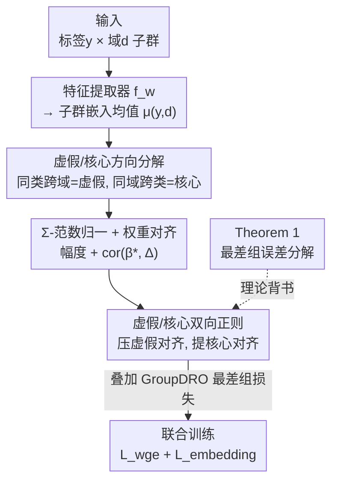

# Spurious Correlation-Aware Embedding Regularization for Worst-Group Robustness

**会议**: ICLR 2026  
**OpenReview**: [https://openreview.net/forum?id=Grb5AOs7WC](https://openreview.net/forum?id=Grb5AOs7WC)  
**代码**: https://github.com/MLAI-Yonsei/SCER  
**领域**: 鲁棒性 / 虚假相关 / 最差组泛化  
**关键词**: 虚假相关, 最差组准确率, 嵌入正则, 子群偏移, GroupDRO

## 一句话总结
SCER 首次给出"最差组误差 = 分类器对虚假方向的依赖 − 对核心方向的依赖"的理论分解，并据此在嵌入空间直接加一项正则——压制分类器权重与"虚假方向"的对齐、增强与"核心方向"的对齐，在 Waterbirds / CelebA / MetaShift / ColorMNIST / CivilComments / MultiNLI 六个基准上把最差组准确率刷到 SOTA。

## 研究背景与动机

**领域现状**：深度模型常常依赖训练集里的虚假相关（spurious correlation）——比如"水鸟总在水边背景出现"这种与标签统计相关但无因果关系的模式。一旦测试时子群分布发生偏移（subpopulation shift），这些靠捷径特征做预测的模型就会在欠表示的少数组上崩盘，最差组准确率（worst-group accuracy）极低。这正是 ERM 的通病：它只最小化平均损失，对子群不均衡视而不见。

**现有痛点**：缓解虚假相关的方法大致分四类——子群鲁棒（GroupDRO、LISA、PDE 靠重加权/多阶段训练/特殊损失）、域不变（IRM、CORAL 对齐特征分布）、数据增强、类别不均衡。但它们几乎都是**间接**地影响模型：要么对样本重加权，要么在输出层对齐分布，**没有任何一个显式约束"虚假特征在嵌入空间里到底是怎么被编码的"**。结果虚假相关在表示里依然残留，鲁棒性提升有限。

**核心矛盾**：现有方法缺一条把"嵌入空间的表示结构"和"最差组误差"直接挂钩的理论。既然不知道嵌入里哪一部分对应虚假、哪一部分对应核心，自然也就无从精准地去抑制虚假、强化核心。

**本文目标**：(1) 从理论上把最差组误差分解到嵌入空间的可度量结构上；(2) 据此设计一个直接作用于嵌入层的正则项，让模型聚焦核心特征、降低对虚假模式的敏感度。

**切入角度**：作者观察到，在"标签 $y$ × 域 $d$"构成子群的设定下，同一类别跨不同域的嵌入均值之差天然刻画了"域驱动的虚假变化"，而同一域内跨不同类别的嵌入均值之差刻画了"标签驱动的核心变化"。把这两个方向拆开，就能分别度量并干预。

**核心 idea**：用"分类器权重与虚假方向/核心方向的对齐度"重写最差组误差，然后直接在嵌入空间加正则——降低虚假对齐、提升核心对齐。

## 方法详解

### 整体框架

SCER（Spurious Correlation-Aware Embedding Regularization）要解决的是"如何在嵌入层直接、显式地削弱虚假相关"。整体流程是：输入数据经特征提取器 $f_w$ 编码成嵌入 $x_{emb}$；对每个"标签-域"子群 $(y,d)$ 计算嵌入均值 $\mu_{(y,d)}$；由这些均值差分出**虚假方向** $\Delta_{spur}$（同类跨域之差）和**核心方向** $\Delta_{core}$（同域跨类之差）；用 $\Sigma$-范数归一化得到虚假/核心幅度，再测量当前分类器权重 $\beta^*$ 与两个方向的对齐度，组成虚假损失与核心损失；最后把这项嵌入正则叠加到 GroupDRO 的最差组分类损失上联合训练。整套设计的合法性由 Theorem 1（最差组误差分解）背书。

### 关键设计

**1. 嵌入均值差分出"虚假方向"与"核心方向"：把抽象的虚假相关变成可计算的两个向量**

现有方法说不清"虚假特征藏在嵌入哪里"，SCER 的第一步就是把它显式定位出来。对每个子群 $(y,d)$ 计算均值嵌入 $\mu_{(y,d)} = \mathbb{E}_{x\sim P_{y,d}}[f_w(x)]$ 作为代表向量。然后做两个差分：同一类别 $y$ 跨不同域 $d_i,d_j$ 的均值差 $\Delta^{(y,d_{i,j})}_{spur} = \mu_{(y,d_i)} - \mu_{(y,d_j)}$ 捕捉的是"域变了但标签没变"的差异，这恰恰是应该被抹平的**虚假**变化；同一域 $d$ 跨不同类别 $y_i,y_j$ 的均值差 $\Delta^{(y_{i,j},d)}_{core} = \mu_{(y_i,d)} - \mu_{(y_j,d)}$ 捕捉的是"标签变了"的真实判别信号，是应该被保留强化的**核心**变化。把这些差分在类别/域上取期望聚合，就得到全局的虚假方向 $\Delta_{spur} = \mathbb{E}_{y}[\Delta^{(y,d_{i,j})}_{spur}]$ 和核心方向 $\Delta_{core} = \mathbb{E}_{d}[\Delta^{(y_{i,j},d)}_{core}]$。这一步的巧妙之处在于：它不需要任何额外的虚假属性标注，仅靠"标签×域"网格里的均值几何就把虚假/核心解耦开。

**2. $\Sigma$-范数归一与权重对齐度：用分类器权重和方向的相关性度量"模型有多依赖虚假"**

光有方向还不够，需要一个标量来量化"分类器到底有多依赖虚假/核心"。SCER 用 $\Sigma$-范数 $\|v\|_\Sigma = \sqrt{v^\top \Sigma v}$（$\Sigma$ 是嵌入向量的经验协方差矩阵）对方向归一，得到虚假幅度 $\|\Delta_{spur}\|_\Sigma$ 与核心幅度 $\|\Delta_{core}\|_\Sigma$——之所以用 $\Sigma$-范数而非欧氏范数，是为了顾及嵌入空间本身的几何结构（各维度方差不同），这一点和 Theorem 1 的高斯假设直接呼应。随后计算分类器权重矩阵 $\beta^* = [\beta_1^*,\dots,\beta_m^*]$ 与两个方向的逐类平均相关：

$$\mathrm{cor}(\beta^*, \Delta_{spur}) = \frac{1}{m}\sum_{j=1}^{m} \frac{\langle \beta_j^*, \Delta_{spur}\rangle}{\|\beta_j^*\|_\Sigma \cdot \|\Delta_{spur}\|_\Sigma}, \quad \mathrm{cor}(\beta^*, \Delta_{core}) = \frac{1}{m}\sum_{j=1}^{m} \frac{\langle \beta_j^*, \Delta_{core}\rangle}{\|\beta_j^*\|_\Sigma \cdot \|\Delta_{core}\|_\Sigma}$$

权重-虚假对齐 $\mathrm{cor}(\beta^*,\Delta_{spur})$ 越大，说明决策边界越倚重域特异的捷径；权重-核心对齐越大，说明越倚重跨域一致的真实判别方向。这两个标量就是后续正则的直接抓手。

**3. 虚假/核心双向正则损失：一压一提，由理论分解直接导出**

有了对齐度和幅度，SCER 定义虚假损失 $L_{spur} = \mathrm{cor}(\beta^*, \Delta_{spur})\|\Delta_{spur}\|_\Sigma$ 和核心损失 $L_{core} = \mathrm{cor}(\beta^*, \Delta_{core})\|\Delta_{core}\|_\Sigma$，再用控制参数组合成嵌入损失：

$$L_{embedding} = \lambda_{spur} L_{spur} - \lambda_{core} L_{core}$$

注意核心项前的**负号**——最小化 $L_{embedding}$ 时，模型会主动压低虚假对齐（减项变小）、抬高核心对齐（被减项变大）。最终目标把它叠加到 GroupDRO 的最差组分类损失上：$L_{total} = L_{wge} + L_{embedding}$。这套损失的合法性不是拍脑袋来的，而是直接对应 **Theorem 1（最差组误差分解）**：在高斯子群假设下，最差组误差可写成 $E_{wge} = \Phi\!\big(\pm\frac{1}{2}\mathrm{cor}(\beta^*,\Delta_{spur})\|\Delta_{spur}\|_\Sigma - \frac{1}{2}\mathrm{cor}(\beta^*,\Delta_{core})\|\Delta_{core}\|_\Sigma\big)$（$\Phi$ 为标准正态 CDF）。由于 $\Phi$ 单调递增，最小化 $E_{wge}$ 等价于"减小虚假项 + 增大核心项"，这正是 $L_{embedding}$ 在做的事。相比 GroupDRO 只靠重加权间接调整，SCER 是从误差表达式里直接读出该优化什么，因此对齐项有明确的理论含义而非启发式。⚠️ 完整证明在原文 Appendix A.2，以原文为准。

### 损失函数 / 训练策略
图像数据用预训练 ResNet-50 + SGD with momentum，文本数据用预训练 BERT + AdamW。训练步数：Waterbirds / MetaShift / ColorMNIST 为 5,000，CelebA / CivilComments / MultiNLI 为 30,000。$\lambda_{spur}$、$\lambda_{core}$ 为关键超参（消融见 Table 6，两者各自都能独立涨点，联合最优）。SCER 还可作为模块化组件，无需显式偏置标注，与 EIIL（环境推断）框架对接，替换其第二阶段的 IRM 目标。

## 实验关键数据

### 主实验

| 数据集 | 指标 | SCER | 之前最佳 | 说明 |
|--------|------|------|----------|------|
| Waterbirds | Worst Acc | **91.2** | 90.3 (PDE) | 最差组最高 |
| CelebA | Worst Acc | **91.4** | 91.4 (ElRep) | 持平最高，方差更小（±0.1） |
| MetaShift | Worst Acc | **86.7** | 85.6 (GroupDRO/ReSample) | 最差组最高 |
| ColorMNIST (ρ=80%) | Worst Acc | **73.6** | 73.2 (LISA) | 最差组最高 |
| CivilComments | Worst Acc | **74.0** | 73.7 (LISA) | 文本多域，最高 |
| MultiNLI | Worst Acc | **76.8** | 76.0 (GroupDRO) | 文本多类，最高 |

SCER 在六个基准上全部拿下最差组准确率第一，同时平均准确率保持竞争力，说明嵌入级解耦确实在缩小"平均/最差"的差距。

### 强虚假相关 & 极端缺组实验

| 设定 | 指标 | SCER | 次优 | 说明 |
|------|------|------|------|------|
| ColorMNIST ρ=95% | Worst Acc | **72.8** | 71.4 (LISA) | 偏置加剧仍稳 |
| ColorMNIST ρ=99% | Worst Acc | **56.0** | 47.5 (PDE) | 极端偏置下大幅领先 |
| ColorMNIST 缺一组 | Worst Acc | **59.6** | 44.1 (GroupDRO) | 训练时整组缺失，领先 15+ 点 |
| EIIL+SCER（无环境标注） | Avg Acc | **72.6** | 68.2 (EIIL+DRO) | 用推断环境替代真标签 |

### 消融实验

| 配置 | Worst Acc (ColorMNIST ρ=95%) | 说明 |
|------|------|------|
| $\lambda_{spur}=\lambda_{core}=0$ | 70.7 | 退化为 GroupDRO 基线 |
| 仅 $\lambda_{core}=1.0$ | 72.0 | 单独核心正则即涨点 |
| 仅 $\lambda_{spur}=1.0$ | 72.8 | 单独虚假正则即涨点 |
| 双项联合 | **72.8+** | 互补，联合最优 |

### 关键发现
- **虚假项和核心项是互补的**：消融显示两项各自单独打开都能超过 GroupDRO 基线，联合优化达到最高，印证 Theorem 1"同时压虚假、提核心"的理论指引。
- **越极端越能体现优势**：在 ρ=99% 和"训练缺整组"这类极端虚假场景下，重加权类方法（GroupDRO/LISA/ReSample）和渐进扩集的 PDE 都因无法外推到未见子群而失效，SCER 因直接正则表示空间，能泛化到完全没见过的组合，领先幅度最大。
- **无需偏置标注也能用**：与 EIIL 对接、用 >95% 一致性的推断环境当伪标签，SCER 仍稳健，而 GroupDRO 在环境错配下显著退化。
- **可视化佐证**：Waterbirds 的 t-SNE 显示 ERM 按背景聚类、GroupDRO 残留背景分簇，SCER 则按标签对齐、背景不变，定性证明虚假相关被压制。

## 亮点与洞察
- **把"最差组误差"写成可优化的闭式表达式**：Theorem 1 是全文最漂亮的地方——它把抽象的鲁棒性目标拆成"虚假对齐 − 核心对齐"两个能直接算、直接求导的标量，损失函数几乎是从误差公式里"抄"下来的，理论和实现一一对应，没有启发式缝隙。
- **不用虚假属性标注就能解耦**：仅靠"标签×域"网格的均值几何（同类跨域=虚假、同域跨类=核心）就分出两个方向，这个 trick 干净且通用，可迁移到任何有子群划分的鲁棒性任务。
- **$\Sigma$-范数而非欧氏范数**：用嵌入协方差归一方向，呼应高斯假设、顾及空间各向异性，是个容易被忽略但有理论根据的细节。
- **模块化、即插即用**：作为正则项可叠到 GroupDRO，也能替换 EIIL 的 IRM 阶段，迁移成本低。

## 局限与展望
- **理论假设较强**：Theorem 1 建立在二分类、两域、组条件高斯、协方差跨域相等、先验均匀等一系列假设上，真实多类多域、协方差异质的场景下分解是否依然紧致，原文未充分回答。
- **依赖子群（标签×域）定义**：方法需要域/环境信息来算均值差分；虽然能用 EIIL 推断环境替代，但推断质量（文中 >95% 一致）本身依赖数据，弱监督环境推断失准时的表现需更多验证。
- **嵌入均值的估计稳定性**：少数组样本极少甚至缺失时，$\mu_{(y,d)}$ 的估计方差大，虽然实验显示缺组场景仍领先，但均值差分在小样本下的鲁棒性是潜在隐患。
- **超参敏感性**：$\lambda_{spur}/\lambda_{core}$ 的选择影响结果，跨数据集是否需重新调参、有无自适应方案值得探索。

## 相关工作与启发
- **vs GroupDRO**：GroupDRO 靠动态上调高损失组的权重间接提升最差组，SCER 直接在嵌入空间正则虚假/核心对齐；SCER 把 GroupDRO 的最差组损失当 backbone，在其上叠加理论导出的正则，在极端缺组场景大幅超越（59.6 vs 44.1）。
- **vs LISA / PDE（数据增强/渐进扩集）**：它们靠插值或扩充可见样本提升鲁棒，本质上只能利用已见域，面对训练时完全缺失的组就失效；SCER 直接约束表示，能外推到未见子群。
- **vs ElRep**：ElRep 对最后一层表示加范数惩罚，是表示级方法但缺少与最差组误差的理论连接；SCER 给出了显式的误差分解，正则项有理论含义，且在 MetaShift / ColorMNIST 上明显更稳（ElRep 在 ColorMNIST ρ=80% 仅 46.5）。
- **vs IRM / 域不变方法**：IRM 学跨环境不变特征但优化难、易退化，SCER 用嵌入均值几何直接定位虚假方向，目标更直接，且可作为 EIIL 第二阶段替换 IRM 后涨点（72.6 vs 68.2）。

## 评分
- 新颖性: ⭐⭐⭐⭐⭐ 首次把最差组误差闭式分解到嵌入空间的虚假/核心对齐，损失从理论直接导出
- 实验充分度: ⭐⭐⭐⭐ 六基准 + 强虚假/缺组/无标注三类压力测试 + t-SNE，覆盖全面，但理论假设与实操差距未深究
- 写作质量: ⭐⭐⭐⭐ 理论与方法对应清晰，图文配合好
- 价值: ⭐⭐⭐⭐⭐ 给"嵌入级抗虚假相关"提供了可复用的理论框架和即插即用正则，迁移性强

<!-- RELATED:START -->

## 相关论文

- [\[ICLR 2026\] Mitigating Spurious Correlation via Distributionally Robust Learning with Hierarchical Ambiguity Sets](mitigating_spurious_correlation_via_distributionally_robust_learning_with_hierar.md)
- [\[ICLR 2026\] Regulating Internal Alignment Flows for Robust Learning Under Spurious Correlations](regulating_internal_alignment_flows_for_robust_learning_under_spurious_correlati.md)
- [\[ICLR 2026\] Noise-Aware Generalization: Robustness to In-Domain Noise and Out-of-Domain Generalization](noise-aware_generalization_robustness_to_in-domain_noise_and_out-of-domain_gener.md)
- [\[AAAI 2026\] DECOR: Deep Embedding Clustering with Orientation Robustness](../../AAAI2026/others/decor_deep_embedding_clustering_with_orientation_robustness.md)
- [\[ICLR 2026\] A Scalable Inter-edge Correlation Modeling in CopulaGNN for Link Sign Prediction](a_scalable_inter-edge_correlation_modeling_in_copulagnn_for_link_sign_prediction.md)

<!-- RELATED:END -->
