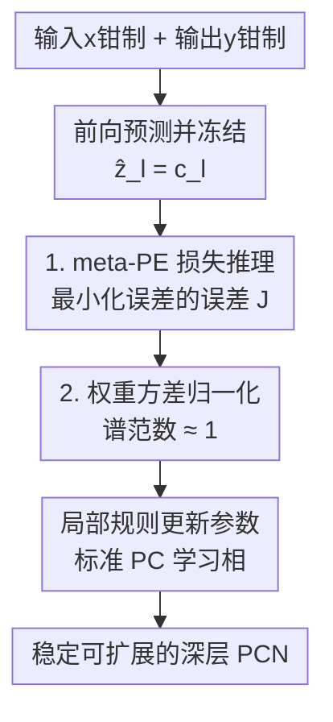

# Stable and Scalable Deep Predictive Coding Networks with Meta-Prediction Errors

**会议**: ICLR 2026  
**OpenReview**: [https://openreview.net/forum?id=kE5jJUHl9i](https://openreview.net/forum?id=kE5jJUHl9i)  
**代码**: 无  
**领域**: 类脑学习 / 预测编码 / 局部学习规则  
**关键词**: 预测编码网络, 元预测误差, 动力学平均场, 反向传播替代, 局部学习

## 一句话总结
本文用动力学平均场理论（DMFT）诊断出深层预测编码网络（PCN）训练不稳定的两大病根——预测误差不均衡与预测误差爆炸/消失，并提出 Meta-PCN：用「误差的误差」（meta-PE）损失把非线性推理线性化、再用方差归一化把权重谱范数压到 1 附近，在 CIFAR-10/100 与 TinyImageNet 上以纯局部规则在 30 个配置里 29 个超过反向传播。

## 研究背景与动机

**领域现状**：预测编码（Predictive Coding, PC）是一套源自皮层信息处理的理论框架，认为大脑不断生成对环境的预测、再通过最小化预测误差（prediction error, PE）来更新内部表征。把它落成神经网络就是 PCN：把一串局部 PC 模块按层级链式连接，每层只用**纯局部学习规则**更新参数，不需要反向传播那样的全局误差链。因为局部、可大规模并行、贴合生物约束，PCN 被视为神经形态（neuromorphic）计算的有力候选，是 BP 的一个有原则的替代品。

**现有痛点**：PCN 有个致命短板——**网络一深，训练就越来越不稳定**。浅层还能凑合，层数一上去精度急剧崩溃（实测 CIFAR-10 上常规 PCN 在多数深层架构上只剩 10–20% 准确率）。但人们一直没搞清楚这种不稳定的**底层机制**是什么，只能靠调度表、归一化器之类的对症修补，拿不到「与深度无关」的稳定性保证。

**核心矛盾**：PCN 的运行分两相——推理相（latent state 迭代到平衡）与学习相（更新权重）。作者用 DMFT 做了严格的长度（length）统计分析，挖出两个相互纠缠的病根：

- **PE 不均衡**：误差在输入/输出边界层堆积、在中间层趋于消失，呈典型「U 形」分布。因为信息从相隔 $k$ 层的地方传播速率只有 $O(\nu^k)$（$\nu=\eta\sigma_w$），通常 $\nu\le 1$，指数衰减让推理还没把信息送到中间层就提前终止。中间层 $\delta_{l+1}\approx 0$ 时，权重梯度 $\nabla_{W_l}F=-D(h_{l+1})\delta_{l+1}z_l^\top\approx 0$，于是发生**梯度饥饿**——学习信号断流。这里有个悖论：PE 本身是要最小化的目标，但把它压到接近 0 反而会切断学习信号。
- **EVPE（预测误差爆炸/消失）**：推理过程中潜状态与 PE 出现乘性缩放 $\|\delta_l^{t+1}\|\approx\tau_t(\sigma_w)\|\delta_l^t\|$，$\tau_t>1$ 几何增长、$\tau_t<1$ 几何衰减。稳定区间（$\tau\approx 1$）只在 $\sigma_w$ 接近 1 的一个**窄带**里，而且这个窄带随深度收缩，越深越难初始化。它跟经典 BP 的梯度爆炸/消失**不同**：发生在推理相、参数还没更新之前，但因 $\|\text{vec}(\Delta W_l^t)\|\propto\|\delta_{l+1}^t\|\|z_l^t\|$，会直接传染到参数更新幅度。

**本文目标**：把「稳定性」当成首要设计目标，给出一个理论指导、架构无关的统一解法，同时**保住 PCN 的全局卖点——纯局部学习规则**。

**切入角度**：既然 PE 不均衡的根源是「直接最小化 PE 会断学习信号」，那就别再直接最小化 PE，而是去逼近平衡态应满足的 delta 关系 $\delta_l=g_l(\delta_{l+1},h_{l+1})$；既然 EVPE 的根源是权重方差 $\sigma_w^2$ 失控让谱范数偏离 1，那就直接把谱范数归一化到 1 附近。

**核心 idea**：用「最小化误差的误差」（meta-PE）的代理损失把非线性推理线性化、解决梯度饥饿，再叠加方差归一化把谱范数钉在 1 附近、解决 EVPE——两件互补的事协同，让深层 PCN 第一次稳定可扩展。

## 方法详解

### 整体框架

Meta-PCN 不改 PCN 的架构、也不改它「推理相迭代 latent、学习相局部更新参数」的双相骨架，只在两个地方动刀：**推理相用什么目标**、**权重怎么约束**。它针对第 3 节诊断出的两个病根各给一记药，且两记药协同：meta-PE 损失主治 PE 不均衡（顺带改善收敛），方差归一化主治 EVPE（顺带也压住 PE 不均衡）。整条流程是：输入 $x$、输出 $y$ 钳制在边界 → 前向算一遍预测并**冻结**它作为参考点 → 推理相迭代 latent 去最小化 meta-PE 损失 $J$（把非线性平衡线性化）→ 权重做方差归一化（谱范数 $\approx 1$）→ 学习相仍用标准 PC 局部规则更新参数 → 得到稳定可扩展的深层 PCN。

### 关键设计

**1. 元预测误差（meta-PE）损失：不直接压 PE，而是逼近误差应满足的 delta 关系**

这一招针对的是「直接最小化 PE 会引发梯度饥饿」的悖论，外加一个常被忽视的训练-测试错配：推理时模型靠迭代 latent，测试时却只做一次前向，两者不一致。Meta-PCN 的做法是把前向预测**冻结**为初始化点 $\hat z_l^{(t)}=f_{l-1}(\hat z_{l-1}^{(0)})=c_l$（$c_l:=\phi(h_l^{(0)})$），从而把非线性平衡系统 $F(z)=\nabla_z F(z)=0$ 在前向初始化点附近**线性化**。引入误差 $\tilde\delta_l:=z_l-c_l$，可得逐层的线性不动点关系 $\tilde F_l(z)=\tilde\delta_l-g_l(\tilde\delta_{l+1},h_{l+1}^{(0)})$，于是定义损失

$$J(\tilde\delta)=\frac{1}{2}\sum_{l=2}^{L-1}\big\|\tilde\delta_l-g_l(\tilde\delta^{*}_{l+1},h_{l+1}^{(0)})\big\|_2^2.$$

其中 $\tilde\delta^{*}_{l+1}$ 是「平衡态下应有的自上而下误差」，实践中用当前估计 $\tilde\delta_{l+1}^{(t)}$ 近似（类比时序差分学习里的 bootstrapping）。概念上，它把 $g_l(\cdot)$ 当成一个「用稳定后的误差信号去预测本层前向 PE $\tilde\delta_l$」的函数——所以 $J$ 最小化的是**预测误差的预测误差**，这正是「meta-PE」之名的由来。关键在于 $\partial\tilde\delta_l/\partial z_l=I$，于是 $\nabla_{z_l}J=\tilde\delta_l-g_l(\tilde\delta^{*}_{l+1},h_{l+1}^{(0)})$ 恰好等于线性化后的平稳映射，最小化 $J$ 就是把线性平衡残差驱到 0。这样一来：① 不再直接把 PE 压到 0，而是让 PE 遵循 delta 关系，跨层误差传播变均衡，绕开梯度饥饿；② 冻结前向预测缓解了训练-测试错配。注意只**冻结预测 $c_l$**，latent $z_l$ 仍在迭代演化（$\tilde\delta_l=z_l-c_l$），所以 PC 的迭代推理本质被保留。参数更新仍走标准 PC 损失 $L(\theta)=\frac12\sum_l\|z_l^{(T)}-f_{l-1}(z_{l-1}^{(0)};\theta)\|_2^2$，让 meta 目标只管稳定推理、局部学习规则原封不动。

**2. 方差归一化的权重正则：把谱范数钉在 1 附近，掐断指数缩放**

这一招直击 EVPE 的根源——乘性因子 $\tau_t(\sigma_w)$ 由权重方差 $\sigma_w^2$ 主导，偏离稳定窄带就指数爆炸/消失。直接算谱范数太贵，作者用随机矩阵理论给了个廉价代理：对 $(m,n)$ 形状、方差 $\sigma_w^2=\mathrm{Var}(W)$ 的权重矩阵，其谱范数满足 $\|W\|_2\approx(\sqrt m+\sqrt n)\sigma_w$，于是直接做归一化

$$W \leftarrow \frac{W}{(\sqrt m+\sqrt n)\,\sigma_w},$$

就能保证 $\|W_{\text{normalized}}\|_2\approx 1$。维度按层型取：线性层 $m=d_{\text{out}},n=d_{\text{in}}$；卷积层 $m=C_{\text{out}},n=C_{\text{in}}\cdot k_H\cdot k_W$。好处是几乎零成本（可并行、不引入额外参数）、对所有层型统一适用，且通过把谱范数维持在 1 附近，**同时**压住 EVPE（让 $\tau_t\approx 1$，三种不同初始 $\sigma_w$ 的轨迹归一后完全重合成一条）和 PE 不均衡（调控算子 $W_l^\top D(h_{l+1}^{(0)})$ 的尺度，抹平 U 形衰减）。作者也坦承 i.i.d. 假设没完全刻画卷积滤波器的结构性与训练中演化的权重分布，结构化算子的完整理论留作未来工作。

### 损失函数 / 训练策略
推理相最小化 meta-PE 损失 $J(\tilde\delta)$（只冻结预测 $c_l$，latent 继续迭代），学习相用标准 PC 损失 $L(\theta)$ 以局部规则更新权重，并在每步对权重施加方差归一化。分类任务把输出层的平方误差替换为交叉熵。Meta-PCN **不引入**任何超出常规 PCN 的新超参（推理率、推理步数、优化器设置都沿用），保证三方对比公平。

## 实验关键数据

### 主实验
在 CIFAR-10/100 与 TinyImageNet 上，用 VGG（5/7/9/11/13 层）与 ResNet-18 跑三方对比：反向传播（BP）、只用前向初始化的常规 PCN、完整 Meta-PCN。除算法本身外（目标函数与更新规则不同），架构与所有共享超参完全一致。

| 设置 | 常规 PCN | BP | Meta-PCN |
|--------|---------|------|----------|
| CIFAR-10 VGG-13 Top-1 | ≈12% | 87.85% | **89.53%** |
| CIFAR-10 各深度 Top-1 | 10–20%（随深度崩） | — | 80–90%（深度稳定） |
| 30 个数据集×架构×指标配置 | 普遍劣于 BP | 基准 | **胜 29/30，平均 +2.15%** |

唯一败例是 CIFAR-100 ResNet-18 Top-1，BP 仅微弱领先 0.02%（$p=0.84$，不显著）。相对常规 PCN，Meta-PCN 在所有架构上提升 12–79%。

### 消融实验

| 配置 | 准确率 | 说明 |
|------|--------|------|
| 完整 Meta-PCN | 89.5% | meta-PE 损失 + 方差归一化 |
| w/o meta-PE 损失 | 10.0% | 去掉后直接崩溃，证明它是不可或缺的核心 |
| w/o 权重归一化 | −1.3% | 统计显著但幅度温和 |

### 关键发现
- **meta-PE 损失是命门**：去掉它精度从 89.5% 暴跌到 10.0%（近乎随机），说明把推理线性化、绕开梯度饥饿才是深层 PCN 能训起来的关键；方差归一化是显著但温和的「锦上添花」（约 1.3%）。
- **病根被真正修复**：Meta-PCN 下 PE 跨层分布变均衡（不再 U 形）、潜状态/PE/权重更新的轨迹在 $\sigma_w\in\{0.185,1.0,5.4\}$ 三种初始化下重合且稳定（EVPE 消失），meta 目标 $J$ 快速收敛到 0，而常规 PCN 收敛缓慢。
- **训练动态**：VGG-13/CIFAR-10 上常规 PCN 整段训练停在 ≈12%（梯度饥饿），Meta-PCN 平滑单调上升、贴着 BP 轨迹并最终反超（89.53% vs 87.85%）。
- **深度越大优势越稳**：在更深的 VGG-13、ResNet-18 上，Meta-PCN 不靠架构专属调参就能追平或超过 BP。

## 亮点与洞察
- **「误差的误差」是个漂亮的视角转换**：直接最小化 PE 会自断学习信号（PE 既是目标又是信号载体），作者把目标改成「让 PE 满足平衡态的 delta 关系」，用 $g_l$ 去预测本层 PE，再最小化这个二阶残差——既保住了误差传播、又把非线性平衡线性化，一举绕开悖论。这种「不去优化量本身、而去优化它该满足的关系」的思路可迁移到其他平衡态/不动点训练问题（如 DEQ、Hopfield 类网络）。
- **诊断与解法严丝合缝**：先用 DMFT 长度分析把两个病根（PE 不均衡来自边界条件+谱衰减、EVPE 来自方差失控）讲清楚，再对症下药，理论与方法不是两张皮。
- **方差归一化是个便宜好用的 trick**：用 $\|W\|_2\approx(\sqrt m+\sqrt n)\sigma_w$ 这个随机矩阵理论结果做谱控制，零额外参数、可并行、跨层型统一，比直接算谱范数省太多，值得在任何需要谱约束的场景借用。

## 局限与展望
- **理论假设与实验架构有缺口**：DMFT 分析建立在 i.i.d. 高斯权重、线性（或线性化）前后向映射、等宽层、大宽度极限之上，这些都不完全匹配实验里用的深层非线性卷积网络，作者自己点明这是「理论与实践之间固有的鸿沟」。
- **结构化算子缺完整理论**：方差归一化的 i.i.d. 假设没刻画卷积滤波器的结构性，也没处理训练中权重分布的演化，结构化算子的谱控制理论待补。
- **规模仍偏小**：实验止步于 CIFAR/TinyImageNet 与 VGG/ResNet-18，离 ImageNet 级或更深网络还有距离，「可扩展」的边界有待进一步验证。
- **前向初始化非本文贡献**：作者明确声明 feed-forward 初始化是 PCN 文献的标准做法，新意只在 DMFT 诊断 + meta-PE + 方差归一化；冻结前向预测与 meta 目标深度绑定，单独拆开能否成立需看附录消融。

## 相关工作与启发
- **vs 常规 PCN（Whittington & Bogacz, 2017；Millidge et al., 2022a）**：他们建立 PC 与 BP 在特定条件下的近似等价，但不解决深层稳定性问题。本文不追求「等价于 BP」，而是把稳定性当首要目标，用 meta-PE 直接打击 EVPE 与 PE 不均衡，是互补而非替代。
- **vs 对症修补类方法（Salvatori et al., 2023b 的 iPC；Pinchetti et al., 2024 的 nudging 变体）**：它们靠交错状态/权重更新、调度表或归一化器提升鲁棒性与速度，但给不出与深度无关的稳定性保证，且常依赖 GELU、推理动量、关掉 weight decay 等与 PC 核心机制正交的辅助 trick。本文用标准训练协议、纯局部规则，把改进归因到结构性诊断本身。
- **vs 深度聚焦方法（Qi et al., 2025 的 DPC；Goemaere et al., 2025；Innocenti et al., 2025）**：它们或减少误差畸变累积但依赖时序非局部更新、或在误差空间重参数化、或用深度感知参数化训练深层残差 PCN——都提升了性能却仍缺架构无关的稳定推理保证。本文的差异在于用 DMFT 给出统一的病理诊断，再据此设计强制收缩与尺度分离的解法。

## 评分
- 新颖性: ⭐⭐⭐⭐⭐ 「最小化误差的误差」把推理线性化是真正新颖的目标重构，且诊断-解法一体。
- 实验充分度: ⭐⭐⭐⭐ 三数据集×多深度×三方对比 + 5 次重复 + 统计显著性检验扎实，但止于 CIFAR/TinyImageNet 规模。
- 写作质量: ⭐⭐⭐⭐⭐ 从 DMFT 诊断到解法逻辑清晰，理论与方法对应紧密，且诚实标注假设缺口。
- 价值: ⭐⭐⭐⭐ 让深层 PCN 第一次稳定超过 BP 且保持局部规则，对神经形态/类脑学习方向有实质推进。

<!-- RELATED:START -->

## 相关论文

- [\[NeurIPS 2025\] Sheaf Cohomology of Linear Predictive Coding Networks](../../NeurIPS2025/others/sheaf_cohomology_of_linear_predictive_coding_networks.md)
- [\[ICLR 2026\] A Scalable Inter-edge Correlation Modeling in CopulaGNN for Link Sign Prediction](a_scalable_inter-edge_correlation_modeling_in_copulagnn_for_link_sign_prediction.md)
- [\[ICML 2026\] Possibilistic Predictive Uncertainty for Deep Learning](../../ICML2026/others/possibilistic_predictive_uncertainty_for_deep_learning.md)
- [\[ICLR 2026\] Evaluating GFlowNet from Partial Episodes for Stable and Flexible Policy-Based Training](evaluating_gflownet_from_partial_episodes_for_stable_and_flexible_policy-based_t.md)
- [\[ICLR 2026\] Fast and Stable Riemannian Metrics on SPD Manifolds via Cholesky Product Geometry](fast_and_stable_riemannian_metrics_on_spd_manifolds_via_cholesky_product_geometr.md)

<!-- RELATED:END -->
