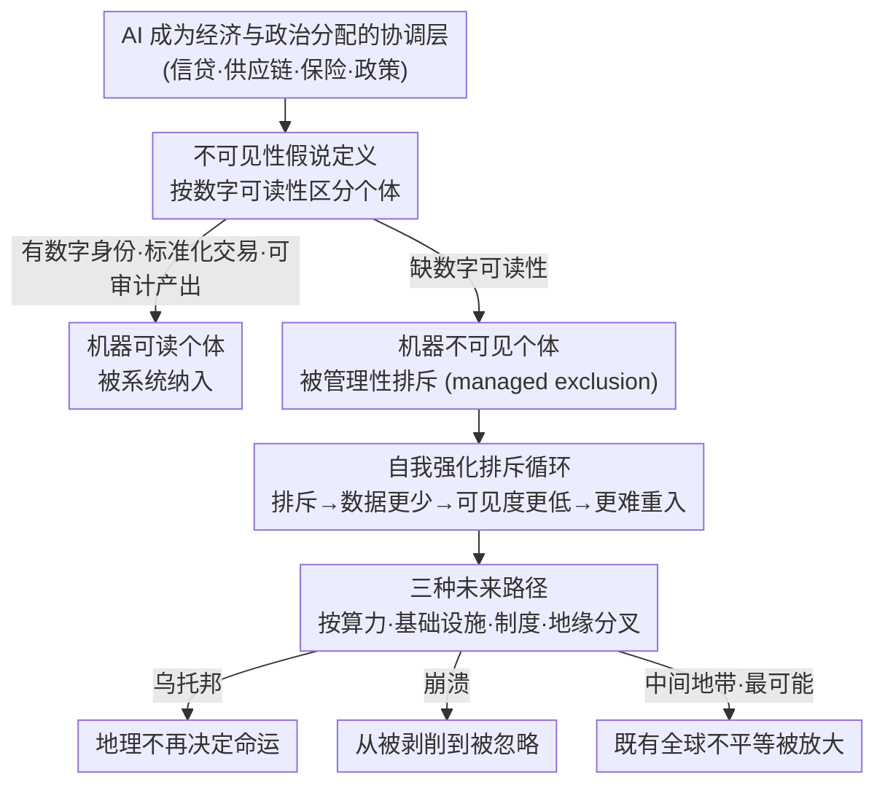

# The Invisibility Hypothesis: Promises of AGI and the Future of the Global South

**会议**: ICLR 2026  
**arXiv**: [2603.01616](https://arxiv.org/abs/2603.01616)  
**代码**: 无  
**领域**: AI与社会 / AI伦理  
**关键词**: AGI, Global South, Invisibility Hypothesis, economic inequality, informal economy, AI governance

## 一句话总结

提出"不可见性假说"（Invisibility Hypothesis），论证AI系统日益成为经济和政治分配的协调层时将系统性偏向"机器可读"个体，全球南方的非正式工人因缺乏数字可验证性而被管理性排斥（managed exclusion），核心风险从job displacement转向relevance loss，且排斥具有自我强化特性。

## 研究背景与动机

**领域现状**：AGI讨论集中在技术可行性、时间表和存在性风险（Amodei 2024, OpenAI 2023, DeepMind 2025），社会影响分析往往假设对不同人群同质。对发展中国家的具体差异化影响研究严重不足（Wall et al. 2021）。

**现有痛点**：AI社会影响研究以发达国家为中心，忽略了全球南方的结构性弱势；AGI讨论两极化为"万能工具 vs 存在性威胁"，均忽略不同人群的差异化影响；现有自动化焦虑文献聚焦job displacement，未发现更深层的排斥机制。

**核心矛盾**：AGI的民主化承诺（人人获得专家级知识）与现实趋势（算力集中、专有模型、AI系统偏向数据丰富的正式经济参与者）之间的根本张力。

**本文目标** 当科学发现、经济协调和治理决策日益自动化时，对那些在数据中代表性不足、在正式经济中整合薄弱、距离技术权力中心遥远的人群意味着什么？

**切入角度**：不讨论AGI是否/何时到来，而是将其作为现有全球不平等的"压力测试"——检验高度自主AI系统如何与既有的基础设施、制度和地缘政治力量互动。

**核心 idea**：AI驱动的经济系统优化可度量、可验证的对象，使缺乏数字可读性的全球南方人口从"被剥削"转向"被忽略"——不可见比被压迫更难逆转。

## 方法详解

### 整体框架

这是一篇概念分析论文，不构建模型，而是搭起一条层层递进的论证链：先把"经济不可见"操作化为一个可讨论的概念，区分出"机器可读"与"机器不可读"两类个体；再揭示不可见性如何通过一个自我强化的反馈环不断加深，使排斥难以逆转；最后用算力、基础设施、制度、地缘政治这些结构性变量作分叉点，推演 AGI 落地后全球南方可能走向的三条未来轨迹，并用宏观经济数据为整条链路提供实证信号。

### 关键设计

**1. 不可见性假说的形式化定义：把"经济不可见"从模糊直觉变成可分析的概念**

论文的起点是观察到 AI 系统正在成为经济与政治分配的协调层——信贷审批、供应链调度、保险定价、政策制定越来越多地由自动化系统中介。这类 AI-mediated allocation 天然偏好可度量、可验证的对象，论文把一个人的"可见度"刻画为其数字属性的函数：$\text{Visibility} \propto f(\text{digital identity}, \text{standardized transactions}, \text{auditable outputs})$。缺乏数字身份、标准化交易记录和可审计产出的个体，可见度趋近于零，于是被系统性地管理性排斥（managed exclusion）。这与传统"数字鸿沟"的关键区别在于：数字鸿沟关心的是 access（能不能用上技术），而不可见性假说关心的是 AI 时代的 relevance 与 participation（系统还需不需要你参与）。

**2. 自我强化排斥循环：解释为什么不可见性一旦发生就极难逆转**

光有一次性的排斥还不足以构成深层风险，论文最有力的论证是指出排斥会自我喂养。一个非正式工人被拒绝信贷、合同或保险后，他能产生的可验证记录和标准化信号随之减少，这进一步降低了他在下一轮 AI 系统中的可见度，使重新进入更加困难——形成 $\text{Exclusion}_t \to \text{Less Data}_{t+1} \to \text{Lower Visibility}_{t+2} \to \text{More Exclusion}_{t+3}$ 的正反馈环。这个循环正是"被忽略比被压迫更难逆转"这一核心判断的机制根源：压迫意味着系统仍然依赖你、仍要从你身上提取价值，而忽略意味着系统已经绕过你、不再把你纳入回路，因此也没有任何内生动力把你拉回来。

**3. 三种未来路径分析框架：用结构性变量推演而非给单一预言**

为了避免技术决定论式的单一叙事，论文不去断言 AGI 必然带来某个结局，而是把算力、基础设施、制度质量、地缘政治力量这些结构性因素当作分叉变量，推演出三条差异化轨迹：乌托邦路径下专家级智能普惠到人手，地理位置不再决定命运；崩溃路径下全球南方从"被剥削"质变为"被忽略"，系统不再需要这些人；中间地带则是现状的加剧版，AGI 放大而非抹平既有的全球不平等。这个多路径框架承认了未来的不确定性，同时把判断权交给可观测的结构性条件，使后文的风险分析有了落点。

## 实验关键数据

### 主要论据：全球结构性不对称（论文图1）

| 维度 | 全球北方 | 全球南方 | 数据来源 |
|------|---------|---------|---------|
| GDP per capita | 高（集中化） | 低 | World Bank/IMF/OECD |
| 制度质量（腐败感知指数） | 强 | 普遍脆弱 | V-Dem |
| 人口占比 | 少数 | 绝大多数 | UN 2022 |
| AI算力控制 | 集中 | 边缘 | 定性分析 |

### 三种路径对比

| 路径 | 全球南方命运 | 与历史不平等的关系 | 可能性 |
|------|-----------|----------------|-------|
| 乌托邦 | 认知跳跃绕过发展瓶颈 | 彻底颠覆 | 低 |
| 崩溃 | 从被剥削到被忽略 | 质变（不再需要人） | 中 |
| 中间地带 | 渐进排斥正常化 | 现状加剧版 | **最高** |

### 关键发现

- **"能力 ≠ 全能"**：即使AGI技术本身普惠化，能源、算力、数据质量、制度信任等物理/制度约束仍限制其在全球南方的实际效用——额外智能在协调和执行成为瓶颈后收益递减
- **排斥先于自动化**：短期风险不是被机器替代，而是在AI控制的信贷、供应链、保险和政策系统中失去准入——routine office work因已标准化而先被替代，physical labor则因robotics不成熟暂时安全，但exclusion可以先于两者发生
- **个体层面的差异化**：排斥不在国家层面均匀发生——全球南方的特权精英（资本、基础设施、跨国网络）仍可整合进全球AI系统，底层个体面临更高排斥风险
- **历史视角的质变**：殖民主义依赖人（需要劳动力），AGI体制可能不依赖人——这是从历史不平等的质变：曾经通过extraction被整合的人群变为系统不再需要其参与的无关人群

## 亮点与洞察

- **概念创新**："被替代"（displacement）→"被忽略"（irrelevance）的分析框架转换，捕获了AI不平等的更深层机制
- **自我强化循环是最有力的洞察**：不可见性的feedback loop使排斥具有path dependency，一旦开始就极难逆转
- **对AGI讨论的重要纠正**：将焦点从技术可行性转向结构性影响的差异化分析，填补了AI社会影响研究的重要空白
- **历史类比的深度**：殖民主义需要人→AGI可能不需要人，这个类比既新颖又有解释力

## 局限与展望

- 纯概念分析，缺乏定量建模或实证验证——"不可见性"的度量标准不够具体
- "全球南方"内部差异巨大（中国/印度 vs 撒哈拉以南非洲）未充分讨论
- 政策建议薄弱——提出问题但解决方案有限
- AGI定义模糊，与现有AI能力的界限不清晰
- 未讨论全球南方的主动角色（如印度IT外包、非洲移动支付创新）
- 缺少具体产业链（农业、制造业）中AI排斥机制的案例分析

## 相关工作与启发

- **vs Korinek & Suh (2024)**：他们讨论AGI转型的经济场景，本文聚焦于全球南方的差异化影响路径
- **vs Restrepo (2025)**：讨论AGI世界的工作和增长，本文强调不是工作消失而是相关性消失——视角更深
- **vs AI ethics主流**：多数AI伦理研究聚焦偏见/公平性，本文关注结构性排斥的宏观维度
- **vs 数字鸿沟文献**：传统关注技术获取（access），不可见性假说关注参与和相关性（relevance）的更深层次

## 评分

- 新颖性: ⭐⭐⭐⭐⭐ 不可见性假说是对AI不平等讨论的重要概念贡献，自我强化循环是深刻洞察
- 实验充分度: ⭐⭐ 纯概念分析，仅使用宏观统计数据做illustrative论证，缺乏定量验证
- 写作质量: ⭐⭐⭐⭐ 论证清晰，历史类比有力，结构紧凑，5页短文完成有效论证
- 价值: ⭐⭐⭐⭐ 对AGI社会影响研究提供了被忽视的重要视角，但缺乏可操作的政策指引

<!-- RELATED:START -->

## 相关论文

- [\[ICLR 2026\] Latent Equivariant Operators for Robust Object Recognition: Promises and Challenges](latent_equivariant_operators_for_robust_object_recognition_promises_and_challeng.md)
- [\[CVPR 2026\] Global Information Thresholding for Sufficient and Necessary Circuits](../../CVPR2026/others/global_information_thresholding_for_sufficient_and_necessary_circuits.md)
- [\[CVPR 2025\] FIction: 4D Future Interaction Prediction from Video](../../CVPR2025/others/fiction_4d_future_interaction_prediction_from_video.md)
- [\[CVPR 2026\] Global Underwater Geolocation from Time-Lapse Polarization Imagery](../../CVPR2026/others/global_underwater_geolocation_from_time-lapse_polarization_imagery.md)
- [\[ICML 2025\] Probably Approximately Global Robustness Certification](../../ICML2025/others/probably_approximately_global_robustness_certification.md)

<!-- RELATED:END -->
