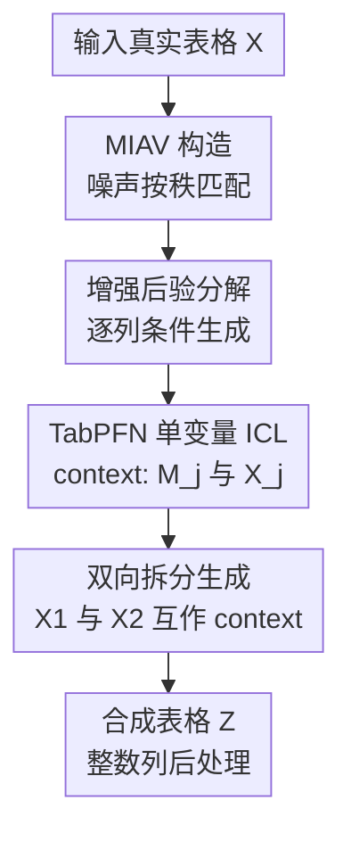

# Using maximal information auxiliary variables to improve synthetic data generation based on TabPFN foundation models

**会议**: ICLR2026  
**OpenReview**: [https://openreview.net/forum?id=6PkiUAcTWF](https://openreview.net/forum?id=6PkiUAcTWF)  
**代码**: https://github.com/echaibub/MIAV  
**领域**: 表格数据生成 / Tabular Synthetic Data Generation  
**关键词**: TabPFN, 表格数据生成, 最大信息辅助变量, 隐私保护, in-context learning

## 一句话总结
这篇论文指出直接用 TabPFN 做表格合成数据时会在弱相关变量上失效，并提出 maximal information auxiliary variables (MIAV)：通过把随机噪声按真实变量秩匹配成辅助变量，让 TabPFN 只需学习 $X_j$ 与 $M_j$ 的单变量关系，从而更稳定、更高效地生成保留边际分布和关联结构的合成表格数据。

## 研究背景与动机
**领域现状**：表格合成数据生成通常服务于隐私保护数据共享：研究者希望公开一个看起来像真实数据、能保留统计规律和下游建模价值、但又不直接暴露原始记录的数据副本。传统路线多依赖特定数据集训练的生成模型或统计模型，例如 SMOTE、CTGAN、TVAE、TabDDPM、ARF、Bayesian network 等；这些方法往往需要针对每个数据集调参或训练，迁移能力有限。

**现有痛点**：TabPFN 这类 tabular foundation model 给这个方向带来一个诱人的替代路线。TabPFN 已经在大量合成任务上预训练，推理时把训练样本作为 context、把待预测样本作为 query，通过一次前向传播近似后验预测分布。因此它不必为每个小表格重新训练一个生成器，理论上可以直接把某一列当作目标变量、其他列当作条件变量，逐列生成合成表格。

**核心矛盾**：问题在于，监督预测和合成数据生成对“无信息特征”的容忍度完全不同。在监督学习里，如果特征与目标无关，一个合理模型输出接近随机猜测就可以了；但在合成数据里，每个变量本身都要被生成出来。若某个变量 $X_j$ 与其他变量弱相关甚至独立，TabPFN 从 context 特征中几乎拿不到关于 $X_j$ 的信号，生成出的边际分布会漂移，关联结构也会失真。

**本文目标**：作者要解决的不是重新训练 TabPFN，而是在不改动现有 TabPFN / TabICL foundation model 的前提下，把合成数据生成问题改写成更适合 in-context learning 的形式。具体来说，方法需要在弱相关变量上仍能保留边际分布，同时尽量保持原表的关联结构、降低计算成本，并避免直接 joint factorization 对列顺序敏感的问题。

**切入角度**：作者观察到，TabPFN 失败的根源并不是模型完全不能生成某个变量，而是条件上下文没有携带足够信息。于是论文人为构造一个与每个真实变量 $X_j$ 单调对应的辅助变量 $M_j$。这个辅助变量本身来自随机噪声，但通过 rank matching 与 $X_j$ 保持相同秩序，因此在非参数意义下携带关于 $X_j$ 的最大信息。

**核心 idea**：用“按秩匹配的随机噪声辅助变量”替代“其他真实列”作为 TabPFN 的 in-context 条件，让每个变量都通过自己的 MIAV 生成，从而把弱相关变量难题转成一个信息充足的单变量条件生成问题。

## 方法详解

### 整体框架
这篇论文的方法可以理解成一个“先造可预测的辅助坐标，再用 TabPFN 按列生成”的流程。给定真实表格 $X=(X_1,\ldots,X_p)$，方法先为每一列 $X_j$ 构造一个 maximal information auxiliary variable $M_j$；随后把原始数据拆成两半，在 TabPFN 的 ICL 形式下用 $(m_j^{tr}, x_j^{tr})$ 作为 context，用 $m_j^{ts}$ 作为 query 生成 $\hat{x}_j^{ts}$，再对另一半反向生成，最后拼成完整合成表。

论文首先讨论两个直接基线。Joint factorization (JF) 按列分解后验预测分布，形式类似 $P(X^{ts}|X^{tr})=\prod_j P(X_j^{ts}|X_{<j}^{ts},X^{tr})$，再用 TabPFN 近似每一项。它的问题有两个：第一列需要人为引入随机噪声 $X_0$ 才能给 TabPFN 一个 context；后续列只依赖前面列，因此结果受列顺序影响。Full conditional (FC) 则为每列使用所有其他列 $X_{-j}$ 作为条件，顺序不敏感，但它不对应一个严格的 joint PPD 分解，并且每次调用 TabPFN 都带 $p-1$ 个特征，列数稍大时计算代价明显上升。

MIAV 的改写更干净：它不问“其他列能否预测 $X_j$”，而是为每列配一个专门的信息载体 $M_j$。增强后的后验预测分布可以写成 $P(X^{ts}|X^{tr},M^{ts},M^{tr})$，再利用 $X_j$ 在给定 $M_j$ 后与其他变量条件独立这一性质，把逐列项化简为 $P(X_j^{ts}|M_j^{ts},M_j^{tr},X_j^{tr})$。因此 TabPFN 的实际调用只需要一个特征列 $M_j$，生成目标是对应的 $X_j$。

### 关键设计
**1. 最大信息辅助变量：用秩匹配让随机噪声变成每列的专属上下文**

直接 TabPFN 合成数据的弱点是：当 $X_j$ 与其他列弱相关时，模型从 $X_{-j}$ 或 $X_{<j}$ 里看不到足够信号。MIAV 反过来为每个 $X_j$ 构造一个必然有信号的辅助变量。具体做法很朴素：先生成长度为 $n$ 的随机噪声向量并排序；若 $X_j$ 是连续变量，就计算 $X_j$ 的秩，平局随机打破；若 $X_j$ 是类别变量，就先按类别频数给每个类别内的样本分配数值秩，再把排序后的噪声按这些秩重新排列。最后得到的 $m_j$ 与 $x_j$ 具有相同排序。

这个设计的关键不在噪声分布，而在 rank matching。论文默认从 $[0,1]$ 均匀分布采样噪声，但强调分布选择并不敏感，因为 MIAV 真正携带的是样本间的秩结构。对连续变量，$m_j$ 与 $x_j$ 是严格单调对应；对类别变量，numeric rank encoding 让同一类别内部随机排列、不同类别占据不同秩区间。这样 $M_j$ 既不直接复制 $X_j$ 的数值，又在非参数离散化意义下足以确定 $X_j$ 的样本位置关系。

**2. 信息论性质：把“弱相关变量无法预测”改写成“给定 MIAV 后无需依赖其他列”**

论文给出 Theorem 1 来解释为什么这个简单构造有效。设 $Y$ 是除 $X_j$ 和 $M_j$ 以外的任意变量，则 MIAV 满足两个性质：$I(X_j;Y|M_j)=0$，以及 $H(X_j|M_j)=0$。前者表示在给定 $M_j$ 后，$X_j$ 与其他变量没有额外条件互信息；后者表示 $M_j$ 在秩匹配的非参数意义下包含关于 $X_j$ 的全部信息。

这组性质直接对准 TabPFN 生成失败的根因。JF 和 FC 试图从其他真实列中找预测 $X_j$ 的信号，所以当 $X_j$ 与其他列独立时会失效；MIAV 则把 $X_j$ 的生成条件改成自己的 $M_j$。因此即使原表里某列是弱相关变量，TabPFN 看到的 context 仍然是高信息量的 $(m_j^{tr},x_j^{tr})$。换句话说，MIAV 不是让原表变量之间变得更相关，而是把每列生成所需的信息显式放进该列自己的辅助坐标里。

**3. 增强后验分解：让 TabPFN 合成数据有顺序不敏感的概率解释**

在增强变量集合 $M=(M_1,\ldots,M_p)$ 后，论文把后验预测分布写为 $P(X^{ts}|X^{tr},M^{ts},M^{tr})$。由于给定 $M_j$ 后 $X_j$ 不再需要依赖其他变量，第 $j$ 项可从 $P(X_j^{ts}|X_{<j}^{ts},X^{tr},M^{ts},M^{tr})$ 化简为 $P(X_j^{ts}|M_j^{ts},M_j^{tr},X_j^{tr})$，最终得到

$$
P(X^{ts}|X^{tr},M^{ts},M^{tr})=\prod_{j=1}^{p}P(X_j^{ts}|M_j^{ts},M_j^{tr},X_j^{tr}).
$$

TabPFN 近似的是上式每一项：$q_\theta(x_j^{ts}|m_j^{ts},m_j^{tr},x_j^{tr})$。这比 JF 更稳，因为它不依赖列顺序；也比 FC 更便宜，因为每个变量只用一个辅助特征做 ICL。重要的是，虽然分解后每列看起来独立生成，关联结构并没有完全丢失，因为 $M$ 的各列通过 rank matching 复现了 $X$ 的关联结构，TabPFN 生成出的 $Z$ 会间接受到这组 MIAV 关联的约束。

**4. 计算与泛化：单特征 ICL 让方法避开列数瓶颈，并可迁移到 TabICL**

TabPFN 的复杂度随样本数和特征数近似为 $O(n^2+p^2)$。JF 和 FC 都需要多次调用带多列特征的 TabPFN，复杂度可概括为 $O(pn^2+p^3)$；MIAV 每次只给一个特征 $M_j$，对 $p$ 个变量循环后复杂度为 $O(pn^2)$。因此当列数增加时，MIAV 的优势会越来越明显，也不需要像 JF 那样通过多种列排列聚合来缓解顺序敏感性。

这个设计还让方法不局限于 TabPFN。只要一个 tabular foundation model 能以 PFN / in-context learning 方式近似条件预测分布，就可以把 $(m_j^{tr},x_j^{tr})$ 和 $m_j^{ts}$ 塞进去。论文用 TabICL 做了分类表格数据上的补充实验，结果显示 MIAV-TabICL 与 MIAV-TabPFN 表现接近，并普遍优于 JF / FC。这说明 MIAV 更像是一种“把合成数据生成问题适配给表格 foundation model 的接口”，而不是 TabPFN 的某个专用 trick。

### 一个完整示例
假设有一个 5 列小表格，其中 $X_2$ 被随机打乱，因此它与其他列几乎没有关联。JF 在生成 $X_1$ 时只能拿随机噪声 $X_0$ 当条件，生成 $X_2$ 时也只能依赖前面已经生成的列；FC 虽然能用所有其他列预测 $X_2$，但这些列本身对 $X_2$ 没有信息。因此两者都会在 $X_2$ 的边际分布上出现明显漂移。

MIAV 的处理方式不同。对 $X_2$，先生成一个均匀噪声向量并排序，再按照 $X_2$ 的秩把噪声重排，得到 $M_2$。在 ICL 中，TabPFN 看到的 context 是训练半表里的 $(m_2^{tr},x_2^{tr})$，query 是测试半表里的 $m_2^{ts}$，目标是预测 $x_2^{ts}$。即使 $X_2$ 与 $X_1,X_3,X_4,X_5$ 都无关，$M_2$ 仍与 $X_2$ 强单调对应，所以生成出的 $\hat{x}_2$ 能更好贴近原始边际分布。

同时，对其他列 $X_1,X_3,X_4,X_5$ 也各自构造 $M_1,M_3,M_4,M_5$。由于每个 $M_j$ 的秩来自对应 $X_j$，$M$ 的列间关联会复现 $X$ 的关联模式。最终合成表不是简单的独立边际采样，而是在每列边际恢复和整体关联结构之间取得了一个由 MIAV 诱导的平衡。

### 损失函数 / 训练策略
本文没有重新训练 TabPFN 或 TabICL，也没有引入新的神经网络损失函数。训练策略更准确地说是 inference-time generation strategy：给定预训练 TabPFN，方法把原始数据划分成 $X_1$ 与 $X_2$ 两个子集，先用 $X_2$ 的 MIAV 和真实值作为 context 生成 $X_1$ 的合成副本，再反向用 $X_1$ 生成 $X_2$ 的合成副本，最后拼接得到完整合成数据。

对整数变量，生成后会根据原始数据类型把对应合成列四舍五入到最近整数。论文还提出 noisy-MIAV 变体：在 $m_j^{tr}$ 和 $m_j^{ts}$ 上加入均值为 0、标准差为 $\text{percent}\cdot sd(m_j)$ 的高斯噪声。这个变体不是主方法必需步骤，而是用于在敏感场景中提高隐私保护，代价是数据 fidelity 会下降。

## 实验关键数据

### 主实验
论文做了三组基于 TabPFN 的实验：第一组是可控相关强度的 correlated beta 模拟数据；第二组是 OpenML-CC18 中 36 个真实数据集；第三组是 7 个更适合与 DDPM、CTGAN、TVAE、ARF、Bayesian network 等传统/深度生成器对比的真实数据集。评价覆盖 fidelity、utility 和 privacy：KS 衡量边际分布，L2D 衡量关联矩阵，DT 衡量真假可分性，MLE 衡量下游机器学习效用，DCR / SDBRL / SSDID 衡量隐私风险。

| 实验设置 | 对比方法 | 主要 fidelity 结论 | 隐私结论 |
|--------|----------|------------------|----------|
| correlated beta 模拟数据，$|\rho|\in\{0,0.25,0.5,0.75,0.95\}$ | MIAV, JF, FC, SMOTE, holdout | MIAV 在弱相关和无相关设置下明显优于 JF / FC，边际分布更接近原数据；SMOTE 通常 fidelity 很强 | MIAV 的 DCR 通常好于 SMOTE，但 JF / FC 因生成质量差而显得更“私密” |
| 36 个 OpenML-CC18 小中型真实数据集 | MIAV, JF, FC, SMOTE, holdout | MIAV 在 KS、L2D、DT 上稳定优于 JF / FC，整体接近 SMOTE | MIAV 在 DCR、SDBRL、SSDID 上相比 SMOTE 有更好的隐私表现 |
| 7 个基线对比真实数据集 | MIAV, JF, FC, SMOTE, DDPM, CTGAN, TVAE, ARF, BN | MIAV 超过大多数生成器；DDPM 只在 DT 上优于 MIAV，其余 fidelity 指标 MIAV 更好 | MIAV 的 DCR 往往较好，但在 SDBRL / SSDID 上不总是优于所有传统基线 |

论文的图 4 给出 pooled results：总体上，SMOTE 在 fidelity 上通常略强于 MIAV，但 privacy 风险更高；MIAV 在 fidelity 上明显强于 TabPFN 直接生成路线 JF / FC，也比多数深度/传统基线更稳。作者强调，不能只看单个指标，因为不同指标会得出不完全一致的排序，例如 Bayesian network 在 WD / ED 上意外较强，但在 MLE、L2D、DT 上较弱。

### 消融实验
严格说，论文没有做传统意义上的“去掉某模块”的消融，而是通过多个直接策略、不同相关强度、runtime benchmark 和 noisy-MIAV 变体来验证 MIAV 设计的必要性。最接近消融的证据如下：

| 配置 | 关键指标 / 观察 | 说明 |
|------|----------------|------|
| JF：joint factorization 直接生成 | 在弱相关变量上 KS / density 明显变差，且受列顺序影响 | 说明只按列条件分解不足以处理无信息或弱信息 context |
| FC：full conditional 直接生成 | 能修复部分强相关变量，但对完全无关变量仍失败，计算更贵 | 说明“用更多真实列做条件”不能解决目标变量本身与其他列无关的问题 |
| MIAV | 在 $\rho$ 从 0.95 降到 0 的模拟实验中更稳定，弱相关时仍能贴近边际分布 | 说明 rank-matched auxiliary variable 是关键有效因素 |
| Noisy-MIAV | 加噪后 privacy 可提高，fidelity 随噪声增大下降 | 说明 MIAV 信息量太强时可通过受控噪声调节隐私-保真权衡 |
| MIAV-TabICL | 在 8 个类别数据集上与 MIAV-TabPFN 表现相近，并优于 JF / FC | 说明方法不只绑定 TabPFN，能迁移到其他 PFN-based tabular foundation model |

### 关键发现
- MIAV 的优势在弱相关场景最明显。模拟实验把变量相关强度从 $|\rho|=0.95$ 降到 $0$，JF 和 FC 的生成质量随着相关性下降而退化，而 MIAV 的边际分布恢复更稳定。
- MIAV 不是简单记忆原数据。它通过 rank-matched noise 提供强信息辅助变量，因此 fidelity 高；但隐私指标显示它仍与 SMOTE 等方法存在 trade-off，且 noisy-MIAV 可以作为进一步提升隐私的调节手段。
- 计算实验支持复杂度分析：随着列数增加，FC 和 JF 的 runtime 快速上升，而 MIAV 近似线性增长。这一点对高维表格尤其重要。
- TabICL 实验说明 MIAV 是一种通用生成框架。当前 TabICL 只支持分类任务，所以补充实验限制在类别数据集；若未来 TabICL 支持回归，MIAV 有望自然扩展到混合型表格数据。

## 亮点与洞察
- MIAV 的巧妙之处在于，它没有把 TabPFN 当成万能联合分布建模器，而是尊重 TabPFN 的 ICL 条件预测形式。把每列生成改写成“用自己的辅助变量预测自己”，比强行从其他列挖信号更贴近模型能力边界。
- rank matching 是一个很轻量但信息量极强的桥梁。随机噪声本来没有语义，但一旦按真实变量秩重排，就变成了既不直接复制数值、又能携带样本顺序信息的辅助坐标。
- 论文把一个工程 trick 写出了清楚的概率解释。Theorem 1 和增强 PPD 分解让 MIAV 不只是“经验上有效”，而是解释了为什么给定 $M_j$ 后可以摆脱对其他列的依赖。
- 方法对未来表格 foundation model 很友好。TabPFN-2.5、TabICL 或其他 PFN-based 模型越强，MIAV 作为 inference-time adapter 的收益可能越大，而不需要重新设计合成器。
- 这篇论文也提醒合成数据评估不能只看 fidelity。SMOTE 可以非常像真实数据，但隐私风险也更高；JF / FC 看起来更私密，可能只是因为生成质量差。MIAV 的价值在于给出一个相对可控的中间点。

## 局限与展望
- MIAV 继承底层 TabPFN 的规模限制。论文实验使用的 TabPFNv2 有最大行数、内存和推理速度限制；虽然 MIAV 缓解了列数限制，但样本数瓶颈仍取决于 foundation model 本身。
- 方法需要访问完整原始数据来构造 $M^{tr}$ 和 $M^{ts}$。这对合成数据生成是合理的，因为目标就是复制一个已有数据集；但它绝不能用于普通监督学习测试集增强，否则会把测试目标信息泄漏进 MIAV。
- 隐私保护还不是最终答案。MIAV 的 fidelity 很强，但 rank-matched auxiliary variable 也携带大量关于原数据的结构信息；noisy-MIAV 给出调节方向，但具体噪声强度如何选仍需要任务和监管约束驱动。
- 对类别变量的 numeric rank encoding 依赖类别顺序和随机打破平局。论文给出了算法和例子，但在高基数类别、稀有类别或语义类别顺序很重要的场景中，仍可能需要更细的设计。
- 实验主要围绕小到中等规模表格数据。未来如果 TabPFN-2.5 或新版 TabICL 支持更大规模、更复杂混合类型表格，MIAV 在真实工业数据共享场景中的表现还需要进一步验证。

## 相关工作与启发
- **vs TabPFN 直接合成 / JF**: TabPFN 直接按 joint factorization 逐列生成，容易受列顺序和弱相关变量影响；MIAV 则用每列自己的辅助变量作为条件，避免第一列随机噪声和排列聚合带来的不稳定。
- **vs FC full conditional**: FC 使用所有其他列预测当前列，顺序不敏感但计算昂贵，而且在目标列与其他列独立时仍无信号可用；MIAV 只用一个辅助特征，既便宜又能处理无信息变量。
- **vs SMOTE**: SMOTE 的 fidelity 很强，但常被认为隐私风险较高；MIAV 的 fidelity 稍弱或接近 SMOTE，却在 DCR、SDBRL、SSDID 等隐私指标上通常更好。
- **vs CTGAN / TVAE / DDPM / ARF / BN**: 这些方法多需要为每个数据集训练或调参；MIAV 借助预训练 tabular foundation model，省掉了大量数据集特定训练，并在 7 个真实数据集基线对比中取得竞争性结果。
- **启发**: 对 foundation model 做生成任务适配时，不一定要 fine-tune 或重训模型。只要能构造一个信息充足、符合模型接口的 context，很多看似不适配的问题可以在 inference-time 被重新表述。

## 评分
- 新颖性: ⭐⭐⭐⭐☆ 用 rank-matched auxiliary variable 适配 TabPFN 合成数据很简洁，理论解释也到位，但核心构造建立在已有非参数数据合成思想之上。
- 实验充分度: ⭐⭐⭐⭐☆ 覆盖模拟数据、43 个真实数据集、多个 fidelity / privacy / utility 指标和 TabICL 扩展；不足是缺少更大规模真实业务表格和更系统的 privacy attack 分析。
- 写作质量: ⭐⭐⭐⭐☆ 论文逻辑清楚，先展示直接方法失败，再给理论和实验；但附录图表很多，主文没有提供足够多的数值表，读者需要在图中读趋势。
- 价值: ⭐⭐⭐⭐☆ 对表格 foundation model 生成合成数据很有参考价值，尤其适合小数据、隐私保护共享和不想为每个数据集训练生成器的场景。

<!-- RELATED:START -->

## 相关论文

- [\[ICML 2026\] GOTabPFN: From Feature Ordering to Compact Tokenization for Tabular Foundation Models on High-Dimensional Data](../../ICML2026/others/gotabpfn_from_feature_ordering_to_compact_tokenization_for_tabular_foundation_mo.md)
- [\[AAAI 2026\] Faster Certified Symmetry Breaking Using Orders With Auxiliary Variables](../../AAAI2026/others/faster_certified_symmetry_breaking_using_orders_with_auxiliary_variables.md)
- [\[ACL 2025\] TARGA: Targeted Synthetic Data Generation for Practical Reasoning over Structured Data](../../ACL2025/others/targa_targeted_synthetic_data_generation_for_practical_reasoning_over_structured.md)
- [\[ICML 2026\] TabMGP: Martingale Posterior with TabPFN](../../ICML2026/others/tabmgp_martingale_posterior_with_tabpfn.md)
- [\[ACL 2025\] Generating Synthetic Relational Tabular Data via Structural Causal Models](../../ACL2025/others/generating_synthetic_relational_tabular_data_via_structural_causal_models.md)

<!-- RELATED:END -->
