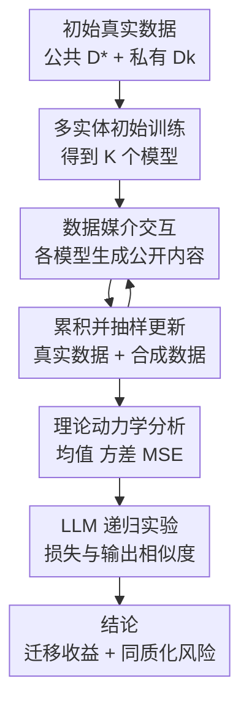

# What happens when generative AI models train recursively on each others' outputs?

**会议**: ICLR2026  
**OpenReview**: [https://openreview.net/forum?id=JEU4PBaX85](https://openreview.net/forum?id=JEU4PBaX85)  
**代码**: https://github.com/arguslab-duke/multi_models_interaction  
**领域**: 其他 / 生成模型递归训练  
**关键词**: 模型坍缩、递归训练、合成数据、数据媒介交互、模型同质化  

## 一句话总结
本文把“多个生成式 AI 模型会不会在未来互相吃到彼此生成内容”形式化为数据媒介交互训练问题，理论和 LLM 实验证明：适量混合真实数据与其他模型的合成数据能带来跨任务迁移，但过度依赖合成数据会损害原任务并让模型输出逐渐同质化。

## 研究背景与动机
**领域现状**：大规模生成模型通常依赖互联网语料训练和更新。
GPT、Llama、Phi、Claude、Gemini 等模型的公开材料虽然披露程度不同，但一个共同事实是：早期训练大量使用 Common Crawl、Wikipedia、Books、ArXiv、StackExchange 等公开网页或文本来源。
模型上线后还会继续更新，更新数据往往不是从零开始，而是复用一部分历史数据，再加入新抓取的网页内容、授权数据或产品侧数据。

**现有痛点**：互联网正在被 AI 生成内容快速填充。
已有工作讨论过“模型训练在自己上一代生成内容上”会导致 model collapse，也提出过保留真实数据能缓解坍缩。
但真实互联网不是单模型闭环：ChatGPT、Claude、Gemini、Llama、Phi 等模型都在被用户用于生成网页、问答、文章和社交媒体内容。
未来模型更新时，训练集里更可能混入许多不同模型的输出，而不仅是自己上一代的输出。

**核心矛盾**：其他模型的生成数据既可能是噪声，也可能携带未共享的私有知识。
如果一个模型只反复学习合成数据，它会丢失真实分布的尾部细节，出现坍缩或泛化下降。
但如果另一个模型的合成输出来自它自己的私有数据或任务能力，那么这些输出也可能把新概念、新任务模式间接传播给其他模型。
也就是说，跨模型合成数据既是污染源，也是信息通道。

**本文目标**：作者希望回答三个具体问题。
第一，现实训练流程是否真的支持“多个模型互相吃到彼此输出”这一假设。
第二，在一个可分析的递归训练框架中，公共真实数据、私有真实数据和合成数据的比例如何影响长期误差与模型间差异。
第三，在真实语言模型微调实验里，理论预测的“迁移收益”和“行为同质化”是否会同时发生。

**切入角度**：论文没有把 AI 生成内容检测作为主问题，而是把互联网视作多个模型之间的隐式通信介质。
每个实体保留自己的私有数据，生成内容公开流入互联网，下一轮模型更新再把这些内容采回训练集中。
这个角度很关键：它让“数据污染”问题变成一个多主体动态系统，能够分析私有知识如何泄露式传播、模型如何彼此靠近，以及何时仍能避免传统意义上的坍缩。

**核心 idea**：用一个由真实公共数据、实体私有数据和跨模型合成数据共同组成的递归训练框架，解释生成模型互训时“学到别人会的东西”和“逐渐变得一样”为什么会同时出现。

## 方法详解

### 整体框架
本文的框架从现实模型更新流程出发：每个模型在初始阶段使用公共真实数据 $D^*$ 和自己的私有真实数据 $\tilde{D}_k$ 训练；之后每一代模型都会生成公开内容 $D_{t,k}$，这些内容混入下一轮互联网抓取数据，再被所有实体作为更新数据的一部分。
两个比例控制整个动态：$\beta$ 控制初始/复用真实数据中公共数据与私有数据的相对权重，$\alpha$ 控制每轮更新中新合成数据相对复用真实数据的比例。
作者先在线性回归中推导均值、方差和渐近 MSE，再用 OPT 与 Llama 3.2 的多模型递归微调实验验证这些趋势。

这个图里的闭环不是一个训练技巧，而是论文要研究的现实机制。
只要模型更新继续依赖新网页抓取，且网页中存在来自多个生成模型的内容，模型之间就会通过数据发生交互。
因此，本文关心的不是“某个模型怎样显式蒸馏另一个模型”，而是“没有协作协议时，模型输出进入共同数据池后会造成什么长期影响”。

### 关键设计
**1. 数据媒介交互：把多模型互训从直觉变成可控变量**

传统 model collapse 设置常把递归训练简化为单个模型吃自己的上一代输出。
本文把这个闭环拆成 $K$ 个实体：第 $k$ 个实体拥有自己的模型 $\hat{\theta}_{t,k}$、私有真实数据 $\tilde{D}_k$，同时共享公共真实数据 $D^*$。
每一代模型根据自己的当前参数生成合成数据 $D_{t,k}$，所有模型的合成数据合并为公共更新池 $D_t=\{D_{t,1},\ldots,D_{t,K}\}$。
下一代训练时，每个实体并不知道某条合成样本来自谁，只是把它当作新抓取数据的一部分。

这个设计抓住了互联网训练的核心不确定性：私有数据不会直接共享，但私有数据训练出的模型会生成公开内容，公开内容再被其他模型吸收。
于是，某个模型在私有任务上学到的规律，可能通过合成文本间接改善别的模型；同样，多个模型也可能因为反复学习同一个混合池而收敛到更相似的输出风格和任务偏好。
$\alpha$ 和 $\beta$ 的引入让这种现象可以被系统扫描：$\alpha=0$ 表示没有新合成数据交互，$\alpha=1$ 接近纯合成递归训练，$\beta$ 则决定模型更新时私有真实数据和公共真实数据各有多少锚点。

**2. 线性动力学推导：用均值和方差刻画迁移与同质化**

为了得到可解释公式，作者在线性回归设置中分析交互训练。
每个数据点是 $(x,y)$，模型用平方损失训练，合成标签由上一代参数生成：$y\mid x\sim N(x^\top\hat{\theta}_{t-1,k},\sigma^2)$。
在这个设置下，每一代估计量 $\hat{\theta}_t=\mathrm{vec}(\hat{\theta}_{t,1},\ldots,\hat{\theta}_{t,K})$ 可以写成一个线性动态系统：

$$
\hat{\theta}_t = P_t
\begin{bmatrix}
\tilde{X}^+\tilde{y} \\
X_*^+y_*
\end{bmatrix}
+ Q_t\hat{\theta}_{t-1} + Q_tX_t^+w_t.
$$

这里 $P_t$ 表示当前轮真实私有/公共数据对估计的直接贡献，$Q_t$ 表示上一代模型通过合成数据传递到当前估计的强度。
这个式子很有信息量：如果 $Q_t$ 的跨实体块不为零，第 $k$ 个模型的参数均值就会包含其他实体私有数据估计的线性组合；如果不同实体对应的行块越来越相似，模型就发生同质化。
换句话说，同一个公式同时解释了“模型学到别人的任务”和“模型变得更像彼此”。

作者进一步给出条件均值、协方差和渐近方差的递推公式。
在固定 $\alpha,\beta$ 和固定特征矩阵的情况下，如果 $Q$ 的谱半径小于 1，均值和协方差会收敛到稳定极限。
这也把“纯合成递归训练为什么危险”表达出来：边界情形 $\alpha=1$ 对应只用生成数据更新，方差可能随代数增长而无法稳定；而 $0\leq\alpha<1$ 且保留足够真实数据时，系统可以避免发散。

**3. 相对效率分析：说明适量合成数据为什么可能最优**

论文不是简单得出“合成数据越少越好”的结论。
作者用理论公式计算每个实体在长期训练后的 MSE，并与一个理想估计器对比：理想估计器拥有所有真实公共数据和所有实体私有数据。
二者的比值被定义为 relative efficiency，越接近 1 表示越接近理想状态。

理论图像显示，在 $K=4$、低秩特征设置下，$\alpha=0.5,\beta=0.5$ 往往给出较好的全局表现。
直觉是：如果 $\alpha$ 太小，实体之间几乎不通过合成数据交换信息，各模型很难从别人的私有任务中受益；如果 $\alpha$ 太大，真实数据锚点变少，递归噪声和分布截断会伤害原任务。
中等 $\alpha$ 则把合成数据当作一种带噪声的知识传播通道，同时用保留真实数据限制漂移。

**4. LLM 递归微调验证：同时测性能迁移和输出同质化**

实验部分用语言模型模拟上述流程。
作者没有从零训练大模型，而是把同一预训练架构的多个实例分别微调到不同任务上，作为 $t=0$ 的多个实体。
公共数据 $D^*$ 用 BookCorpus 近似，私有任务包括 SciQ、GSM8K 和 ARC；模型架构包括 OPT-350M、Llama 3.2 1B 和 Llama 3.2 3B。
每一代中，模型会从自己的任务提示生成合成数据，下一代再按 $\bar{\alpha}\beta$、$\bar{\alpha}\bar{\beta}$ 和 $\alpha/K$ 的权重混合私有真实数据、公共真实数据和合成数据进行微调。

评估也分成两条线。
第一条是任务损失：看模型在自己的任务和其他模型的任务上，递归训练前后 token-level cross entropy 如何变化。
第二条是输出表示相似度：对模型在各数据集上的生成结果做 SentenceTransformers embedding，再用 PCA 和 cosine similarity 观察模型输出空间是否靠近。
这套评估正好对应论文的两个核心问题：合成交互有没有迁移收益，以及这种收益是否伴随行为同质化。

### 一个完整示例
以 $K=2$、$\beta=0.5$ 的 Llama 3.2 1B 实验为例，可以把两个模型理解成两个公司各自维护的模型。
模型 1 初始更熟悉 SciQ 科学问答，模型 2 初始更熟悉 GSM8K 数学题；两者都保留一部分 BookCorpus 作为公共真实数据。

如果设 $\alpha=0$，两者每轮只在复用真实数据上更新，没有真正吸收彼此生成内容。
结果是模型 1 在自己任务上基本稳定，但在模型 2 的任务上从 2.0 变到 2.5，模型 2 在模型 1 的任务上从 3.7 变到 4.2，跨任务能力没有改善甚至变差。
这对应“没有数据媒介交互”的情形：模型保留自己的局部能力，却学不到对方的私有任务。

如果设 $\alpha=0.5$，每轮训练有一半来自新生成数据，另一半仍由真实数据锚定。
此时模型 1 在 SciQ 上从 2.8 变到 2.9，几乎不丢原能力；在 GSM8K 上从 2.0 降到 1.4，明显学到了模型 2 的任务。
模型 2 也类似，在自己的 GSM8K 上从 1.2 到 1.3 基本稳定，在 SciQ 上从 3.7 降到 3.0。
这就是论文最重要的正面结果：合成数据不是天然有害，只要比例合适，它可以让模型从别人的私有数据中受益。

如果设 $\alpha=1.0$，模型只吃合成数据，真实数据锚点消失。
模型仍可能在对方任务上有所改善，但原任务开始退化，例如 Llama 1B 的模型 2 在自己任务上从 1.2 变到 1.9。
这说明跨模型合成数据带来的知识迁移并不能替代真实数据；当真实数据不再参与更新时，传统递归训练的风险重新出现。

### 损失函数 / 训练策略
理论部分的训练目标是带权平方损失。
初始阶段，第 $k$ 个实体在私有数据和公共数据上最小化加权经验风险：私有数据权重由 $\beta$ 控制，公共数据权重由 $1-\beta$ 控制。
更新阶段，第 $k$ 个实体最小化三部分损失之和：复用私有真实数据 $\bar{\alpha}\beta L$、复用公共真实数据 $\bar{\alpha}\bar{\beta}L$、以及新合成公共数据 $\alpha L/K$。
其中 $\bar{\alpha}=1-\alpha$，$\bar{\beta}=1-\beta$。

LLM 实验中，每代训练集大小固定为 $n=12{,}500$，样本按上述权重从 $\tilde{D}_k$、$D^*$ 和 $D_t$ 中抽取，模拟 accumulate-and-subsample 更新。
每个模型每代微调 100 step，使用 AdamW，学习率 $8\times10^{-6}$，warmup ratio 为 0.025，最大序列长度 512，混合精度训练。
$K=2$ 系统通常跑 15 代，Llama 3.2 3B 和部分 $K=3$ 设置因算力成本跑 8 代。

## 实验关键数据

### 主实验
主结果集中在 $\beta=0.5$，因为它让初始/复用真实数据中的公共和私有部分都有足够权重。
下表整理了 $K=2$、$\beta=0.5$ 时三个架构在不同 $\alpha$ 下的初始到最终 loss 变化；数值越低越好。

| 模型架构 | 设置 | 自己任务表现 | 对方任务表现 | 主要结论 |
|--------|------|------------|------------|---------|
| OPT-350M | $\alpha=0$ | M1: 3.3→3.3；M2: 1.8→1.7 | M1 on T2: 3.1→3.5；M2 on T1: 5.1→5.1 | 不交互时原任务稳定，但跨任务没有收益 |
| OPT-350M | $\alpha=0.5$ | M1: 3.3→3.3；M2: 1.8→1.7 | M1 on T2: 3.1→1.8；M2 on T1: 5.1→3.5 | 适量合成数据显著提升对方任务 |
| OPT-350M | $\alpha=1.0$ | M1: 3.3→3.5；M2: 1.8→2.2 | M1 on T2: 3.1→2.2；M2 on T1: 5.1→3.5 | 有迁移，但原任务退化更明显 |
| Llama 3.2 1B | $\alpha=0$ | M1: 2.8→2.9；M2: 1.2→1.2 | M1 on T2: 2.0→2.5；M2 on T1: 3.7→4.2 | 不交互时跨任务变差 |
| Llama 3.2 1B | $\alpha=0.5$ | M1: 2.8→2.9；M2: 1.2→1.3 | M1 on T2: 2.0→1.4；M2 on T1: 3.7→3.0 | 最符合理论预测的收益区间 |
| Llama 3.2 1B | $\alpha=1.0$ | M1: 2.8→3.0；M2: 1.2→1.9 | M1 on T2: 2.0→1.8；M2 on T1: 3.7→3.0 | 纯合成递归伤害原任务 |
| Llama 3.2 3B | $\alpha=0.5$ | M1: 2.4→2.5；M2: 1.0→1.0 | M1 on T2: 1.8→1.2；M2 on T1: 3.5→2.6 | 更大模型上趋势仍成立 |

从表中可以看出，$\alpha=0.5$ 的模式最稳定：模型几乎保住自己的任务损失，同时明显降低在对方任务上的损失。
$\alpha=1.0$ 也能让模型接触对方任务，但它缺少真实数据校正，因此原任务 loss 往往上升。
这与理论部分的相对效率结论一致：合成数据的价值依赖“适量”和“真实数据锚定”。

### 消融实验
论文的消融和扩展实验主要改变 $K$、$\alpha$、$\beta$ 和模型架构，并额外分析输出表示相似度。
下表列出几个能支撑核心论点的观察。

| 配置 | 关键指标 | 说明 |
|------|---------|------|
| $K=2,\beta=0.5,\alpha=0$ | Llama 输出 cosine：$\tilde{D}_1$ 0.73→0.70，$\tilde{D}_2$ 0.88→0.79，$D^*$ 0.50→0.59 | 没有跨模型合成数据时，模型只在共享公共数据上略同质化，在私有任务上反而分化 |
| $K=2,\beta=0.5,\alpha=0.5$ | Llama 输出 cosine：$\tilde{D}_1$ 0.73→0.88，$\tilde{D}_2$ 0.88→0.93，$D^*$ 0.50→0.64 | 性能迁移伴随输出表示靠近，说明交互不是免费午餐 |
| $K=2,\beta=0.5,\alpha=1.0$ | Llama 输出 cosine：$\tilde{D}_1$ 0.73→0.86，$\tilde{D}_2$ 0.88→0.94，$D^*$ 0.50→0.58 | 纯合成递归仍会同质化，但原任务退化更强 |
| $K=3,\beta=0.5,\alpha=0.5$ OPT | 多个跨任务 loss 明显下降，如 M1 on T2: 3.1→1.9，M2 on T3: 3.9→3.1，M3 on T2: 2.9→1.9 | 增加第三个任务后，交互训练仍能传播私有任务信息 |
| $K=3,\beta=0.5,\alpha=1.0$ Llama 1B | 自己任务有退化，如 M2 on T2: 1.1→1.4；跨任务仍有改善 | 任务多样性不能消除纯合成递归的真实数据缺失问题 |

### 关键发现
- 适量合成数据可以充当跨模型知识迁移通道。
在 $\alpha=0.5,\beta=0.5$ 时，模型在对方任务上的 loss 普遍下降，而自己的任务基本保持稳定，这说明其他模型的生成内容并不只是污染。
- 纯合成更新会重新暴露 model collapse 风险。
当 $\alpha=1.0$ 时，模型不再使用真实数据更新，原任务 loss 常常上升；它可能学到对方任务的一部分模式，但代价是对原始真实分布的锚定变弱。
- 同质化与迁移收益同时发生。
embedding cosine similarity 在 $\alpha>0$ 时普遍上升，说明模型输出空间变得更相似。
这对实际系统很重要：行业里多个模型可能通过共同互联网语料互相靠近，进而放大共同偏见或减少观点多样性。
- 理论和实证结论方向一致。
线性理论预测中等 $\alpha$ 往往更接近理想估计器，LLM 实验也显示 $\alpha=0.5$ 是最稳的设置。
论文没有声称线性回归能完全解释大模型，但它提供了一个能读懂实验趋势的低维骨架。

## 亮点与洞察
- 这篇论文的最大亮点是把 model collapse 从“单模型自食其果”扩展到“多模型通过互联网共同演化”。
这个视角更贴近现实，因为未来训练数据池里通常会混入多个模型、多个公司的生成内容。
- 论文避免了“AI 生成数据必然有害”的简单结论。
它指出合成数据的作用取决于来源、比例和真实数据保留量；来自其他模型的合成内容可能携带私有任务知识，因此在适当比例下有正迁移价值。
- 理论部分的 $P_t,Q_t$ 动态系统很有解释力。
$Q_t$ 既表示上一代合成数据对当前模型的影响，也决定跨实体信息能否传播；看 $Q_t$ 的行块是否趋同，就能把同质化讲清楚。
- 实验设计虽然规模不大，但评价维度抓得准。
只看任务 loss 会得出“合成交互有用”的结论，只看 embedding similarity 会得出“模型变得更像”的结论；两者合起来才是本文真正的信息。
- 对数据治理也有启发。
如果训练机构只关注过滤低质量合成内容，可能忽略了跨模型输出造成的长期行为收敛；如果只追求用合成数据补任务短板，也可能无意中牺牲模型生态的多样性。

## 局限与展望
- 理论只分析线性回归和高斯生成噪声。
这类模型能解释递归训练的均值/方差传播，但还不能覆盖 LLM 中的非凸优化、指令对齐、采样温度、RLHF 和长上下文记忆等复杂因素。
- 实验是受控微调，不是互联网规模预训练。
作者用 BookCorpus、SciQ、GSM8K、ARC 来模拟公共/私有数据和多任务差异，这有利于解释，但与真实网页抓取、数据清洗、去重、混合多模态内容之间仍有距离。
- 新数据被简化为纯合成数据。
现实互联网更新集会同时包含人类新内容、AI 生成内容、改写内容和混合来源内容；如果真实新数据持续进入，长期动力学可能比本文设置更稳定或更复杂。
- 同质化的社会影响还没有被直接测量。
论文用 embedding 相似度作为输出空间靠近的代理指标，但并未系统评估观点偏差、事实错误共振、文化多样性下降或安全策略趋同。
- 后续可以研究更大 $K$、更长 $T$ 和多模态模型。
尤其是图像、视频和代码生成模型已经大量进入公开数据池，跨模型合成数据的传播路径可能比文本更难检测，也更容易形成生态级反馈。

## 相关工作与启发
- **vs 传统 model collapse 工作**: Shumailov 等工作强调模型训练在自己生成数据上会遗忘真实分布尾部，本文则研究多个模型互相训练在彼此输出上的情形。
区别在于本文允许“别人的合成数据”携带新信息，因此结论从单纯坍缩扩展为收益和同质化并存。
- **vs collapse 缓解工作**: Dey & Donoho、Kazdan 等工作指出保留真实数据能避免误差无界增长。
本文沿用 accumulate-and-subsample 的现实假设，但进一步加入多个实体、私有数据和公共合成池，展示保留真实数据不仅防坍缩，也影响跨模型知识传播强度。
- **vs transfer learning / distillation**: 迁移学习通常是显式的 teacher-student 或权重/数据共享。
本文关注的是非协作、非显式的互联网数据媒介交互，模型提供者未必知道自己的模型正在从其他模型输出中学习。
- **vs AI 生成文本检测**: 检测方法试图识别并过滤 AI 内容，本文则问如果这些内容没有被完全过滤，会怎样改变模型长期演化。
因此它对检测方向的启发是：检测不只是内容真实性问题，也可能影响未来模型生态是否保持多样性。

## 评分
- 新颖性: ⭐⭐⭐⭐⭐ 多模型递归训练的“数据媒介交互”视角很有现实感，比单模型坍缩设定更贴近当下互联网语料环境。
- 实验充分度: ⭐⭐⭐⭐ 理论、OPT、Llama 1B/3B、$K=2/3$ 和多组 $\alpha,\beta$ 都覆盖到了，但规模和真实预训练场景仍有限。
- 写作质量: ⭐⭐⭐⭐ 论文主线清楚，理论和实验互相呼应；部分公式较密，对只关心 LLM 实证的读者门槛偏高。
- 价值: ⭐⭐⭐⭐⭐ 这篇论文提醒模型训练者：合成数据治理不能只看短期性能，还要看跨模型知识泄漏、行为同质化和生态级反馈。

<!-- RELATED:START -->

## 相关论文

- [\[AAAI 2026\] STEM Faculty Perspectives on Generative AI in Higher Education](../../AAAI2026/others/stem_faculty_perspectives_on_generative_ai_in_higher_education.md)
- [\[AAAI 2026\] Beyond World Models: Rethinking Understanding in AI Models](../../AAAI2026/others/beyond_world_models_rethinking_understanding_in_ai_models.md)
- [\[AAAI 2026\] Align When They Want, Complement When They Need! Human-Centered Ensembles for Adaptive Human-AI Collaboration](../../AAAI2026/others/align_when_they_want_complement_when_they_need_human-centere.md)
- [\[AAAI 2026\] Bridging the Skills Gap: A Course Model for Modern Generative AI Education](../../AAAI2026/others/bridging_the_skills_gap_a_course_model_for_modern_generative_ai_education.md)
- [\[ICLR 2026\] Frozen Priors, Fluid Forecasts: Prequential Uncertainty for Low-Data Deployment with Pretrained Generative Models](frozen_priors_fluid_forecasts_prequential_uncertainty_for_low-data_deployment_wi.md)

<!-- RELATED:END -->
