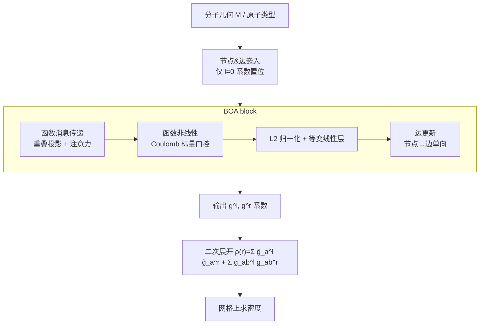

# A Function-Centric Graph Neural Network Approach for Predicting Electron Densities

**会议**: ICLR 2026  
**OpenReview**: [https://openreview.net/forum?id=HDdkFjFEZd](https://openreview.net/forum?id=HDdkFjFEZd)  
**代码**: [https://github.com/sciai-lab/boa](https://github.com/sciai-lab/boa)  
**领域**: 机器学习量子化学 / 等变图神经网络  
**关键词**: 电子密度预测, KS-DFT 代理模型, 等变消息传递, 重叠矩阵, 密度矩阵, 高斯基函数  

## 一句话总结
本文提出 **Basis Overlap Architecture (BOA)**——一种把网络内部特征解释为「基函数展开的空间函数」、并用原子基函数之间重叠积分来传递消息的等变 GNN，用基函数乘积的二次展开（即密度矩阵）表示电子密度，在 QM9 与 MD 密度数据集上刷新 SOTA，并能从 9 个重原子的小分子泛化到近 200 个原子的大分子。

## 研究背景与动机
- **领域现状**：电子结构预测（尤其 Kohn-Sham DFT）是催化、电池、药物设计的核心工具，但计算代价高昂，限制了大体系与高通量场景。机器学习代理模型应运而生，其中「直接预测基态电子密度」介于纯属性预测与 Hamiltonian 预测之间——密度在理论上唯一决定所有基态性质，且可进一步加速 DFT 自洽迭代。
- **现有痛点**：直接预测密度的方法分两类。**基展开类**把密度写成原子中心基函数的线性组合 $\rho(r)=\sum_a\sum_\mu p_{a\mu}\omega^{Z_a}_\mu(r-r_a)$，可扩展但精度高度依赖基的选择，往往需要海量基函数；为缓解这一点，前人引入了「虚拟节点」（在键中点放额外基函数）或「浮动轨道」（逐分子预测基函数位置）。**网格类**直接在体素网格上表示密度，避免基误差但内存开销巨大。
- **核心矛盾**：要么受限于固定原子中心基的表达力不足，要么靠额外节点/浮动轨道增加复杂度，要么承受网格的内存爆炸。如何在不引入虚拟节点/浮动轨道的前提下，让原子中心基也能精细地刻画分子键区与原子间区域的密度？
- **本文目标**：设计一个既保留基展开可扩展性、又能天然覆盖原子间空间、且把量子化学的物理结构（基、重叠、密度矩阵）作为强归纳偏置嵌入网络的架构。
- **核心 idea**：**【密度的二次展开】** 不直接线性展开密度，而是仿照 DFT 中密度由轨道函数平方和构成的方式，用基函数**乘积**展开密度——两个原子中心高斯基函数的乘积自然居中于两原子之间，从而无需虚拟节点或浮动轨道即可覆盖键区；**【函数中心的消息传递】** 把网络特征始终解释为「某个基下的函数」，消息传递时用原子间基函数的**重叠矩阵**把发送节点的函数最小二乘投影到接收节点的基上，使几何信息（重叠依赖相对位置）与基信息一并注入网络。

## 方法详解

### 整体框架
BOA 是一个全等变（SO(3) 旋转 + 平移）的消息传递网络。核心约定是：所有内部特征都被解释为「在给定原子中心高斯基下展开的空间函数」——节点特征 $h_{am\mu}$ 对应函数 $h_m(r)=\sum_a\sum_\mu h_{am\mu}\omega^{Z_a}_\mu(r-r_a)$，边特征同理。骨干由若干 BOA block 堆叠：每个 block 先做**函数消息传递**更新节点特征，再做**边更新**，并穿插函数化的非线性、L2 归一化与等变线性层；最终骨干输出一组系数，按式 (2) 的二次展开在网格上求出电子密度。节点特征承担主要计算量，边特征只单向接收节点信息，避免纯边计算的高开销。

### 关键设计
**1. 密度的二次（低秩密度矩阵）展开：让原子中心基天然覆盖原子间区域。** BOA 不把密度写成基函数的线性组合，而是写成成对函数乘积之和：
$$\rho(r)=\sum_{a\in N}\hat g^{(l)}_a(r)\hat g^{(r)}_a(r)+\sum_{(a,b)\in E^e}\sum_o^{N^o} g^{(l)}_{abo}(r)\,g^{(r)}_{abo}(r),$$
其中每个 $g^{(l)}_{abo},g^{(r)}_{abo}$ 仍只在各自原子的局部基上展开。把它重写为 $\rho(r)=\sum_{\mu\nu}\Gamma_{\mu\nu}\bar\omega_\mu(r)\bar\omega_\nu(r)$ 就能看出 $\Gamma_{\mu\nu}$ 正是 KS-DFT 内部使用的**密度矩阵**，而 BOA 用每条边 $N^o$ 对函数给出了密度矩阵每个分块 $\Gamma_{ab\mu\nu}$ 的**低秩近似**，且全程不显式构造完整密度矩阵——只在网格上评估 $g^{(l)},g^{(r)}$ 再相乘，避免了所有基函数两两乘积的昂贵网格评估。物理直觉很关键：两个原子中心高斯的乘积居中于两原子之间（图 1C 中苯分子的乘积中心均匀分布在键区），因此原子中心基也能精细刻画键区密度，从根本上替代了虚拟节点与浮动轨道。自环项 $\hat g^{(l)}_a\hat g^{(r)}_a$ 充当密度的初始猜测（按原子类型预训练 1000 步后继续微调），模型只需学习对初猜的偏移。

**2. 基重叠消息传递：用重叠矩阵把消息从发送基「翻译」到接收基。** 既然每个通道都是某个基下的函数，从节点 $b$ 向节点 $a$ 发消息时就应做一次基变换。先算节点 $b$ 的特征与节点 $a$ 基函数的重叠积分 $o_{abm\mu}=\sum_\nu W^{ab}_{\mu\nu}h_{bm\nu}$，其中 $W^{ab}_{\mu\nu}=\int dr\,\omega^{Z_a}_\mu(r-r_a)\omega^{Z_b}_\nu(r-r_b)$ 是两原子基函数的重叠矩阵；再乘以接收节点自身重叠矩阵的逆，得到消息 $m_{abm\mu}=\sum_\nu (W^{aa})^{-1}_{\mu\nu}o_{abm\nu}$——这恰是节点 $b$ 的函数在节点 $a$ 基下的**最小二乘最优表示**。由于 $W^{ab}$ 依赖两原子相对位置，几何信息自然进入消息。消息再由**注意力**加权：注意力来自两节点特征函数的重叠 $\alpha_{abmn}=\int dr\,h_{am}(r)h_{bn}(r)=\sum_\mu h_{am\mu}o_{abn\mu}$，经 MLP 得到权重 $\tilde\alpha_{abmn}$，最后聚合 $\tilde h_{am\mu}=\sum_{b}\sum_n \tilde\alpha_{abmn}m_{abn\mu}$。由于消息传递的边集合 $E^{mp}$ 含自环，原始特征以注意力加权的形式保留，相当于内置残差连接。

**3. 尊重「函数本性」的非线性与归一化。** 普通逐元素非线性会破坏特征作为函数（及其旋转张量结构）的语义，因此 BOA 借鉴等变网络的门控思路构造标量门控：先用 Coulomb 矩阵算出 SO(3) 不变的标量特征 $l_{amn}=\int dr\,dr'\,h_{am}(r)h_{an}(r')/\lVert r-r'\rVert=\sum_{\mu\nu}h_{am\mu}C^{aa}_{\mu\nu}h_{an\nu}$（$C$ 由 PySCF 对高斯基生成），过 MLP 后再线性混合各通道函数 $\tilde h_{am\mu}=\sum_n w_{amn}h_{an\mu}$，每种原子类型用独立 MLP。归一化也按函数语义来：用每个通道函数的 L2 范数 $n_{am}=\sqrt{\int dr\,(h_{am}(r))^2}=\sqrt{\sum_{\mu\nu}h_{am\mu}W^{aa}_{\mu\nu}h_{am\nu}}$ 归一。线性层则用 e3nn 的等变线性层（同型张量才混合、偏置只加在标量上）；作者坦言完全函数化的线性层（学习函数核做积分）训练严重不稳，最终在稳定性与归纳偏置之间选择了前者。

**4. 节点/边分离与单向边更新。** 主体计算放在节点特征上以控制开销，边特征只承担辅助角色且**单向**从节点接收信息（节点→边，边不回流节点）。每条有向边有 $(l)$ 与 $(r)$ 两套特征，分别定位在两端节点。边更新先算节点与边的不变重叠积分 $o^{(n)}_{abmn},o^{(e)}_{abmn}$，过 MLP 得到一组权重并按 Frobenius 范数归一化（带可学习标量 $\gamma$），再用这些权重把旧边特征与节点特征线性混合生成新边特征。BOA 还用两个截断半径：较小的 $r^e$ 定义边特征用的边集，较大的 $r^{mp}$ 定义消息传递用的边集。

## 实验关键数据

### 主实验表格（QM9 电子密度，NMAE ↓ [%]）

| 方法 | VASP 真值 | PySCF 真值 |
|---|---|---|
| eqDeepDFT | 0.284 | n/a |
| InfGCN | 0.869 | n/a |
| ChargE3Net | 0.196 | n/a |
| SCDP | 0.178 | n/a |
| ELECTRA | 0.177 | n/a |
| ResNet (Li et al. 2025) | n/a | 0.14 |
| **BOA small** | 0.1381 ± 0.0003 | 0.13 ± 0.01 |
| **BOA large** | **0.1339 ± 0.0005** | **0.116 ± 0.006** |

### MD 数据集（NMAE ↓ [%]，与最强基线对比）

| 方法 | ethanol | benzene | phenol | resorcinol | ethane | malonaldehyde |
|---|---|---|---|---|---|---|
| SCDP | 2.34 | 1.13 | 1.29 | 1.35 | 2.05 | 2.71 |
| ELECTRA | 1.02 | 0.45 | 0.56 | 0.62 | 0.91 | 0.80 |
| **BOA small** | **0.710** | **0.361** | 0.56 | **0.371** | **0.772** | **0.61** |

> 同一套模型、无额外调参（仅训练步数减到 200k）即在 MD 上几乎全面领先，仅 phenol 与最强基线持平。

### 关键发现
- **跨尺度泛化（QMugs，近 200 原子）**：仅在 ≤9 重原子的 QM9 上训练，BOA 即可外推到近 200 原子的大分子。但**视野很关键**——标准截断（$r^{mp}=6$Å, $r^e=3$Å）的 BOA 反而不如 ResNet，而把截断缩小到 $r^{mp}=3$Å, $r^e=2$Å 后，NMAE 在各分子尺寸上**基本保持恒定**并超过 ResNet。原因是大视野在小/大分子间差异巨大、引入分布漂移，限制视野能缓解这一点。
- **效率优势**：小截断版本不仅泛化更好，推理也显著快于标准截断 BOA 与 ResNet（图 4A 时间-原子数曲线）。
- **物理归纳偏置有效**：二次展开 + 重叠消息传递把 DFT 的密度矩阵结构直接搬进网络，是精度全面领先的根源。

## 亮点与洞察
- **把「密度矩阵」做成网络的输出结构**：用基函数乘积的二次展开 = 密度矩阵的低秩分块近似，既继承 KS-DFT 的物理表示，又免去虚拟节点/浮动轨道，思想非常优雅。
- **消息 = 跨基的最小二乘投影**：用重叠矩阵把函数从一个原子的基「翻译」到另一个原子的基，让消息传递同时携带基信息与几何信息，是对「函数中心」理念的彻底贯彻。
- **几乎处处用积分而非启发式**：重叠、Coulomb、L2 范数都用基函数的解析积分（PySCF/e3nn）计算，使每一步都保持函数语义与等变性。
- **泛化-视野的反直觉结论**：更小的感受野反而带来更好的跨尺度泛化与更快推理，对所有「小训大测」的分子 ML 模型都有借鉴意义。

## 局限与展望
- **元素覆盖窄**：QM9/MD 仅含小型有机分子，且每种原子类型用独立参数，扩展到周期表大部分元素会参数爆炸；作者建议改用所有原子类型共享的统一基组。
- **数据规模与多样性不足**：需在更大、更多样的数据集上训练才能落地更广的实际应用。
- **基组仍较固定**：当前用固定的非收缩高斯基 + 学习的径向修正因子；未来可进一步学习高斯指数（如 Fu et al. 2024），甚至用可微量子化学包（PySCFAD）让内部的重叠/Coulomb 矩阵随训练自适应。
- **完全函数化线性层不稳定**：理论上更自洽的函数核积分线性层训练严重不稳，最终被迫退回 e3nn 等变线性层，归纳偏置与训练稳定性仍有张力。

## 相关工作与启发
- **基展开类密度预测**：SCDP（虚拟节点）、ELECTRA（浮动轨道）是最直接的对照——BOA 用基函数乘积的几何居中性替代了二者的额外自由度。
- **网格类密度预测**：ChargE3Net、ResNet (Li et al. 2025) 等避免基误差但内存大，BOA 在精度上反超且更省内存。
- **等变 GNN 与门控非线性**：MACE、e3nn、gated nonlinearity (Weiler et al. 2018) 提供了等变骨架；BOA 把门控标量换成由 Coulomb 矩阵导出的物理量。
- **局部规范/坐标系**：消息的跨基变换与 local canonicalization (Lippmann et al. 2025) 的 frame-to-frame 转换异曲同工。
- **启发**：把领域内已有的「内部表示」（这里是密度矩阵）直接设计成网络的输出/中间结构，往往比泛化的几何 GNN 更强；积分式（重叠/Coulomb）的操作天然兼顾物理含义与等变性，值得在其他科学 ML 任务中复用。

## 评分
- **新颖性**: ⭐⭐⭐⭐⭐ 二次（密度矩阵低秩）展开 + 基重叠最小二乘投影式消息传递，是对量子化学结构与等变 GNN 的深度融合，思想原创性高。
- **实验充分度**: ⭐⭐⭐⭐ QM9（两种真值）、MD（6 分子）、QMugs 跨尺度泛化均覆盖且全面领先，并给出视野-泛化分析；但缺更系统的逐模块消融（各设计单独贡献）。
- **写作质量**: ⭐⭐⭐⭐ 物理动机清晰、公式推导完整、图示（函数消息传递的 1D 示意）直观；细节较多，对非量子化学背景读者门槛偏高。
- **价值**: ⭐⭐⭐⭐⭐ 刷新电子密度预测 SOTA，且小训大测能力直指 DFT 代理模型最关心的实用场景，代码开源，落地潜力大。

<!-- RELATED:START -->

## 相关论文

- [\[ICLR 2026\] Generalized Spherical Neural Operators: Green's Function Formulation](generalized_spherical_neural_operators_greens_function_formulation.md)
- [\[ICLR 2026\] Orbital Transformers for Predicting Wavefunctions in Time-Dependent Density Functional Theory](orbital_transformers_for_predicting_wavefunctions_in_time-dependent_density_func.md)
- [\[ICLR 2026\] Feedback-driven Recurrent Quantum Neural Network Universality](feedback-driven_recurrent_quantum_neural_network_universality.md)
- [\[ICLR 2026\] Incomplete Data, Complete Dynamics: A Diffusion Approach](incomplete_data_complete_dynamics_a_diffusion_approach.md)
- [\[AAAI 2026\] PhysicsCorrect: A Training-Free Approach for Stable Neural PDE Simulations](../../AAAI2026/physics/physicscorrect_a_training-free_approach_for_stable_neural_pde_simulations.md)

<!-- RELATED:END -->
