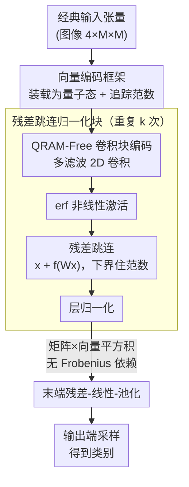

# Accelerating Inference for Multilayer Neural Networks with Quantum Computers

**会议**: ICLR2026  
**OpenReview**: [https://openreview.net/forum?id=QcRto0GjxC](https://openreview.net/forum?id=QcRto0GjxC)  
**代码**: 待确认  
**领域**: 量子机器学习 / 量子算法  
**关键词**: 量子计算, 神经网络推理, 块编码, 残差网络, 复杂度证明

## 一句话总结
本文给出了**首个全程相干（fully-coherent）**的多层神经网络量子实现——把 ResNet 风格的多滤波 2D 卷积、非线性激活、跳连和层归一化全部搬到量子电路上，无需中途测量读出，并在三种量子数据访问假设下证明了从二次加速、四次加速直到对输入维度 $N$ 仅 $O(\mathrm{polylog}(N/\epsilon)^k)$ 的端到端推理复杂度。

## 研究背景与动机

**领域现状**：深度学习靠 GPU 的并行矩阵运算撑起来，但摩尔定律逼近物理极限，GPU/CPU 的持续扩张可能见顶。一个自然的问题是：容错量子处理器（QPU）能不能给深度学习再添一把加速？量子机器学习（QML）大致分两派——一派做贴近近期硬件的变分量子电路（VQA / PQC），另一派用**量子子程序**给经典模型的底层线性代数（矩阵求逆、矩阵-向量运算、采样）提供可证明的渐近加速。本文属于第二派。

**现有痛点**：第一派的变分量子神经网络长期受困于贫瘠高原（barren plateau）、糟糕的局部极小和梯度消失，而缓解这些问题的技巧又往往让电路退化成经典可模拟。第二派虽然有可证明加速，但**致命缺陷是"不相干"**：此前给前馈网络（Allcock et al. 2020）、CNN（Kerenidis et al. 2020）、Transformer（Guo et al. 2024）做加速时，每过一层都要么做内积的中间测量、要么做量子态层析（tomography）把整个态读回经典机，再重新编码进下一层电路。这种"读出—再编码"打断了量子相干性，把潜在的指数加速直接砍没了。

**核心矛盾**：要做多层网络就得在层间施加非线性，而非线性天然要求"测量/读出"；可一旦读出，量子并行带来的好处就荡然无存。更隐蔽的问题是**范数衰减**：向量在多层前向传播中范数可能任意变小，而量子算法复杂度通常与编码向量的范数成反比，于是 $k$ 层网络的运行时间可能爆炸到 $\approx N^k$ 甚至无界——即使是常数深度的网络也变得不可解。

**本文目标**：构造一个**层间不需要任何测量/读出**的、端到端相干的多层网络量子实现，把卷积、激活、跳连、归一化都做成可串联的量子模块，并对常数深度网络给出有界且尽量低的推理复杂度。

**切入角度**：作者把经典 ResNet 当蓝本，敏锐地观察到——**残差跳连不只是经典深网能训起来的功臣，它在量子实现里恰恰是范数稳定与守恒的根本**。围绕"如何在每个归一化层之前把前向范数有效地下界住"这一点，作者搭出全套向量编码（vector-encoding）工具来精确追踪范数。

**核心 idea**：用"块编码 + 向量编码"把每个网络模块表示成不读出的量子线路，靠残差跳连保证范数不衰减，从而把整条多层前向 pass 一气呵成地相干执行，最后只在输出端做一次采样得到分类结果。

## 方法详解

### 整体框架

问题被形式化为**近似采样式分类**（Definition 1）：给定训练好的网络 $h:\mathbb{R}^D\mapsto\mathbb{R}^C$，输入 $x$ 输出一个概率分布 $y=h(x)$（$\|y\|_1=1$），目标是从某个满足 $\|y-\hat y\|_2\le\epsilon$ 的分布 $\hat y$ 中**采一个样**（即给图像分一个类）。注意目标不是读出整个分布，而只是采样——这正好契合量子机器天然擅长采样的特点，也是它能省掉层析读出的关键。

整条流水线是：输入张量经向量编码（VE）装载进量子态 → 串联 $k$ 个残差卷积块（每块内部：2D 卷积块编码 → erf 激活 → 跳连相加 → 层归一化，全程不读出）→ 末端的残差-线性-池化块 → 在输出端采样得到类别。三种数据访问 regime 共享同一段"$k$ 个残差卷积块"，只在**怎么把输入装进来**和**怎么处理末端**上有差别。

### 关键设计

**1. 向量编码（VE）框架与四则原语：把"范数追踪"做成可组合的工具**

量子算法的复杂度几乎总是与编码向量的范数成反比，所以多层网络里"范数怎么变"必须被精确记账，否则无从证明复杂度有界。作者沿用并扩展了向量编码 VE 的定义：称酉矩阵 $U_\psi$ 是 $|\psi\rangle_n$ 的 $(\alpha,a,\epsilon)$-VE，若 $\big\||\psi\rangle_n-\alpha(\langle 0|^a\otimes I_n)U_\psi|0\rangle^{a+n}\big\|_2\le\epsilon$，其中 $\alpha$ 直接编码了向量范数信息（$\epsilon=0$ 时编码态范数恰为 $1/\alpha$）。这层抽象的价值在于：它和"块编码"（block-encoding，把矩阵 $A/\alpha$ 嵌进酉阵左上块）一起，让矩阵作用在向量上时**范数因子按规则相乘累加**，而不是变成黑箱。

在此之上作者补齐了一套向量上的四则原语（Lemmas 1–4）：向量求和、矩阵-向量积、向量张量积、向量拼接。每条引理都显式给出输出 VE 的新 $(\alpha,a,\epsilon)$ 参数（例如矩阵-向量积把误差变成 $(\epsilon_0+\alpha\epsilon_1)/\mathcal{N}$、范数因子变成 $\alpha\beta/\mathcal{N}$）。这些原语本身是已有技术往 VE 框架里的"搬运"，但正是它们让后面每一步的范数都能被解析地推下去——这是整篇复杂度证明的地基。

**2. 矩阵×向量逐元素平方积：甩掉 Frobenius 范数（秩）依赖的新算法**

要在量子上做非线性，一个核心操作是把矩阵 $W$ 作用到向量的**逐元素平方** $g(x)=|x|^2$ 上。直接的做法是先拿到 $W$ 的块编码，但一般稠密满秩矩阵的块编码要么要求低秩、要么要求稀疏，否则复杂度会带上 Frobenius 范数 $\|W\|_F$（对满秩稠密阵这个量随维度增长，等于把加速吃掉）。

作者的 Theorem 1 给出绕过办法：**不去整体块编码 $W$**，而是把 $W$ 按列拆成 $W=(w_0,\dots,w_{N-1})$，归一化为 $|w_j\rangle=w_j/\|w_j\|_2$、记 $a_j=\|w_j\|_2$；借三个对象——$\mathrm{diag}(a_0,\dots)$ 的块编码、列预言机 $U_W|0\rangle|j\rangle=|w_j\rangle|j\rangle$、以及 $|\psi\rangle$ 的 VE——用"重要性加权"把 $W$ 的各列按输入元素相干地组合起来，再作用到修改过的输入向量上，最终得到 $Wg(|\psi\rangle_n)/\mathcal{N}$ 的 VE，电路深度仅 $O(T_\psi+n^2)$。作者称这是**首个让量子算法使用任意满秩稠密矩阵却不带 Frobenius 范数依赖**的结果——它正是末端那个 $N\times N$ 满秩线性层能被加速的前提。

**3. QRAM-Free 的 2D 多滤波卷积块编码：参数少就别走 QRAM**

卷积层的妙处是参数量远小于它作用的向量化张量维度（一个 $16\times16\times3\times3$ 卷积只有 2304 个参数，却作用在 $O(N)$ 维向量上）。作者据此给出（Lemma 5）**首个无需 QRAM** 的 2D 多滤波卷积块编码：对卷积核里每个参数，构造其对应高度结构化矩阵形式的块编码，再取线性组合得到整张卷积矩阵 $C/(2\|C\|_2)$ 的 $(1,\cdot,0)$-块编码，电路深度 $O(m^2C^3D^4\log C\log D)$。

关键是这个深度**对维度 $N$ 只有 polylog 依赖、却对参数量（通道数 $C$、核宽 $D$）是多项式**——而实践里 $D$ 通常很小（如 3）。这与经典精确卷积算法对维度的多项式依赖形成鲜明对比，也是为什么"无 QRAM"这一档（Regime 3）仍能拿到加速：卷积这块天生适合 QRAM-free 实现。作者还指出借助循环卷积可被傅里叶变换对角化，这个结果还能进一步优化。

**4. 残差跳连归一化块与范数守恒：让 $k$ 层不爆炸的根本**

这是全文的"题眼"。单个残差块（Lemma 6，General Skip Norm Block）按图 2 结构走：输入 $|\psi\rangle$ → 线性 $W$（块编码）→ 非线性 $f(x)=\mathrm{erf}(4x/5)$ → 跳连相加得 $|\psi_f\rangle=|\psi\rangle+f(W|\psi\rangle)$ → 归一化。它内部就是把前面的矩阵-向量积、向量求和、激活、归一化几条引理串起来。

为什么非要跳连？因为**没有跳连，归一化层之前的向量范数可能任意衰减**，而范数一小，量子复杂度就反比例放大，$k$ 层叠下来运行时间能到 $\approx N^k$ 乃至无界。残差结构 $x+f(Wx)$ 保证了"原始信号 $x$ 始终被加回来"，于是每个归一化层之前的前向范数都被有效地**下界住**——作者为此专门证明了这些架构块里的范数守恒。把单块重复 $k$ 次即得 $k$ 层残差块（Lemma 7），用前一块输出当后一块输入逐次调用。

附带一个深刻观察：**线性算子（酉矩阵）要施加非线性变换，其定义必须依赖于被作用的向量**（如 $A=\mathrm{diag}(x)$ 时 $Ax=x^2$ 即非线性）。因此算法对每个新输入都要**在线自适应地现搭一条新电路**——这也解释了复杂度里那个 $2^k$ 因子（每层非线性都得"重搭"一次），作者认为这很可能是任何量子算法做深层非线性的**根本限制**，并据此论证量子更适合加速"宽而浅"的网络（经典上宽可并行、深不可并行，恰好互补）。激活选 erf 只是为了解析方便，可换成 GELU 或 tanh。

### 损失函数 / 训练策略

本文是**纯推理加速的理论工作，不涉及训练**：假设给定一个训练好的、且每个卷积层已被正则化使谱范数 $\le 1$ 的经典网络，目标只是把其前向推理搬上量子机并证明复杂度。所有结果都是端到端的复杂度上界证明，而非数值实验。

## 实验关键数据

本文没有数值实验，"实验"即三种 regime 下的**复杂度定理**与对既往工作的能力对比。

### 主结果：三种量子数据访问 regime 的推理复杂度

| Regime | 数据访问假设 | 架构（图1） | 推理复杂度 | 相对经典加速 |
|--------|--------------|-------------|------------|--------------|
| 1 | 输入与权重都经 QRAM | (a) 残差 CNN | $O(\mathrm{polylog}(N/\epsilon)^k)$ | 对维度 $N$ 指数级（polylog） |
| 2 | 仅权重经 QRAM，输入暴力装载 | (b) 双线性残差 CNN | $\tilde O(N\log(1/\epsilon)^{2k})$ | 末端 $N^2\times N^2$ 线性层带来**四次加速**（$d=2$） |
| 3 | 完全无 QRAM | (c) 双线性残差 CNN（去末端线性层） | $O(N\log(1/\epsilon)^{2k})$ | 对 $\Omega(N^2)$ 卷积的**二次加速** |

其中 $N$ 为向量化输入维度，$k$ 为残差层数（视为渐近常数），$d$ 为 Regime 2/3 中并行经典路径数（张量积后维度变 $O(N^d)$，增大 $d$ 可放大加速）。

### 与既往工作的能力对比（Table 1 精简）

| 方法 | 架构 | 相干多层 | 相干非线性 | 免 QRAM | 范数守恒 | polylog $1/\epsilon$ | polylog $N$ |
|------|------|:---:|:---:|:---:|:---:|:---:|:---:|
| Allcock et al. 2020 | 前馈 | ✗ | ✗ | ✗ | ✗ | ✗ | ✗ |
| Kerenidis et al. 2020 | CNN | ✗ | ✗ | ✗ | ✗ | ✗ | ✗ |
| Guo et al. 2024 | Transformer | ✗ | ✓ | ✗ | ✗ | ✗ | ✗ |
| **本文 Regime 1** | 残差 CNN | ✓ | ✓ | ✗ | ✓ | ✓ | ✓ |
| **本文 Regime 2** | 双线性残差 CNN | ✓ | ✓ | ✗ | ✓ | ✓ | ✗ |
| **本文 Regime 3** | 双线性残差 CNN | ✓ | ✓ | ✓ | ✓ | ✓ | ✗ |

### 关键发现
- **"相干多层 + 相干非线性"是本文相对所有既往工作的根本区别**：以往方法必须靠测量/层析在层间读出，本文整条前向 pass 不读出，从而保住加速。
- **范数守恒是复杂度有界的命门**：去掉残差跳连，$k$ 层复杂度会从 polylog 退化到 $\approx N^k$（甚至无界）；跳连把范数下界住才换来可证明的有界复杂度。
- **本文是这一支（加速经典深度学习）中首个不依赖 QRAM 的架构**（Regime 3），代价是把指数（polylog $N$）加速降为二次加速。
- $2^k$ 因子来自"非线性需为每个输入现搭电路"，作者认为这是量子做深层非线性的**内在限制**，因此结论是量子最适合**宽而浅**的推理加速场景。

## 亮点与洞察
- **把"残差跳连"从经典训练技巧重新诠释为量子范数稳定器**：这是全文最"啊哈"的地方——同一个结构在经典是为了梯度，在量子是为了范数守恒与有界运行时间，视角迁移得非常漂亮。
- **绕开 Frobenius 范数依赖的矩阵×向量平方积**（Theorem 1）：用"按列重要性加权"而非整体块编码，第一次让任意满秩稠密矩阵能被量子使用却不付出秩/Frobenius 代价，这个原语本身在量子线性代数里有独立价值。
- **QRAM-free 的卷积块编码**点出一个可复用的判据：当层参数量 $\ll$ 作用维度时，就该走"对每个参数构造结构化块编码再线性组合"的 QRAM-free 路线，对维度 polylog、对参数多项式。
- **采样式分类的问题设定很巧**：只要采样而非读出整个分布，正好避开层析的高代价，也自然涵盖自回归 next-token 预测（输出分布换成词表）。

## 局限与展望
- **依赖容错量子计算机**：所有结果建立在 fault-tolerant QPU 与（部分 regime 的）QRAM 之上，而 QRAM 的物理可行性学界仍有争议——这是纯理论加速，离实机还很远。
- **深度受 $2^k$ 内在惩罚**：非线性需对每个输入重搭电路，导致复杂度随层数 $k$ 指数增长，因此只对常数深度、宽而浅的网络才有意义，深层网络的量子加速看起来是根本性困难。
- **卷积块编码的参数次数偏高**：深度对通道数 $C^3$、核宽 $D^4$，虽然作者指出可大幅优化（如利用循环卷积的傅里叶对角化），但当前形式对大通道/大核并不友好。
- **只做推理、未做训练**，且需要预先把卷积层正则化到谱范数 $\le 1$，对一般训练好的网络要做额外处理；没有任何数值验证，全部是渐近上界。

## 相关工作与启发
- **vs 变分量子神经网络（PQC/VQA，如 Cong et al. 2019）**：它们用参数化量子电路类比多层网络，但受贫瘠高原/局部极小困扰，且不以加速既有经典架构为目标；本文不训练量子电路，而是相干地"模拟"训练好的经典 ResNet 前向，给出可证明加速。
- **vs Allcock et al. 2020（前馈）/ Kerenidis et al. 2020（CNN）/ Guo et al. 2024（Transformer）**：这三者都需层间测量或量子态层析读出，打断相干、限制加速，且都依赖 QRAM；本文做到全程相干、范数守恒，并首次给出免 QRAM 的版本（Regime 3）。
- **vs 双线性网络（Lin et al. 2015）**：Regime 2/3 的多路径张量积架构受双线性 CNN 启发，把多条经典路径的输出做 Kronecker 积喂进残差块序列，借末端高维线性层换取四次加速。

## 评分
- 新颖性: ⭐⭐⭐⭐⭐ 首个全程相干的多层网络量子实现，残差→范数守恒的视角与免 Frobenius 依赖的矩阵平方积都是实打实的新结果。
- 实验充分度: ⭐⭐⭐⭐ 纯理论工作、无数值实验，但端到端复杂度证明严谨完整、三 regime 覆盖清晰（理论论文按其标准给分）。
- 写作质量: ⭐⭐⭐⭐⭐ 把繁复的量子线性代数讲出清楚的故事线，对比表与三 regime 划分让贡献一目了然。
- 价值: ⭐⭐⭐⭐ 为"量子加速经典深度学习"立了相干性与范数守恒的范式，但落地受容错硬件/QRAM 与 $2^k$ 深度惩罚制约。

<!-- RELATED:START -->

## 相关论文

- [\[ICLR 2026\] AQER: A Scalable and Efficient Data Loader for Digital Quantum Computers](aqer_a_scalable_and_efficient_data_loader_for_digital_quantum_computers.md)
- [\[ICCV 2025\] ResQ: A Novel Framework to Implement Residual Neural Networks on Analog Rydberg Atom Quantum Computers](../../ICCV2025/physics/resq_a_novel_framework_to_implement_residual_neural_networks_on_analog_rydberg_a.md)
- [\[ICLR 2026\] Sublinear Time Quantum Algorithm for Attention Approximation](sublinear_time_quantum_algorithm_for_attention_approximation.md)
- [\[ICLR 2026\] Feedback-driven Recurrent Quantum Neural Network Universality](feedback-driven_recurrent_quantum_neural_network_universality.md)
- [\[NeurIPS 2025\] Exoplanet Formation Inference Using Conditional Invertible Neural Networks](../../NeurIPS2025/physics/exoplanet_formation_inference_using_conditional_invertible_neural_networks.md)

<!-- RELATED:END -->
