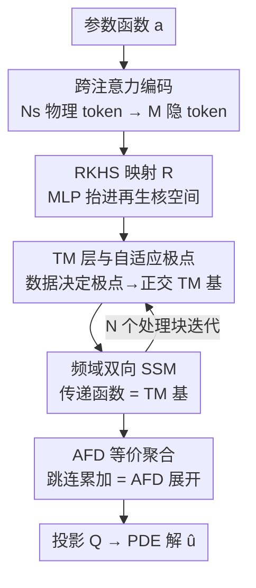

# Adaptive Mamba Neural Operators

**会议**: ICLR2026  
**OpenReview**: [https://openreview.net/forum?id=OenyzvFZPs](https://openreview.net/forum?id=OenyzvFZPs)  
**代码**: https://github.com/checlams/AMO  
**领域**: applications to physical sciences (physics, chemistry, biology, etc.)  
**关键词**: 神经算子, 偏微分方程, 状态空间模型, 自适应傅里叶分解, 频域可解释性

## 一句话总结
AMO 把 Mamba/SSM 的传递函数显式参数化成 Takenaka-Malmquist（TM）系统在再生核 Hilbert 空间里的正交核，让整个网络等价于一次"自适应傅里叶分解"（AFD），从而在规则网格、点云、不规则域和带奇异性的金融 PDE 上都把相对 L2 误差平均压低约 28%。

## 研究背景与动机
**领域现状**：用神经网络学 PDE 的"解算子"（neural operator）是近几年的热门路线。学到一个从参数函数 $a$（边界/初值/系数）到解 $u(x,t)$ 的无限维映射 $G_\theta$ 后，网络是 mesh-independent 的——粗网格上训练、细网格上也能用。其中频域类算子（FNO、WNO、多小波 MWT、LSM 等）特别受欢迎，因为很多 PDE 的解天然能用谱基展开，非线性项在频域里变成卷积。

**现有痛点**：频域算子在不规则几何上会退化。傅里叶/小波基在不规则域里会丢掉正交性和本征函数性质，谱就"串台"（spectral mixing）。最近的 latent Mamba operator（LaMO）把 SSM 的高效性搬进隐空间来处理不规则域，确实有进步，但它用的选择性卷积核**没有正交性**，而且 SSM 核本质是有限阶线性动态滤波器，带**低通滤波偏置**——高频和奇异特征（如 1-D 对流方程里高频扰动的传播、2-D Darcy flow 里分形渗透率场的奇点）会被抹平。

**核心矛盾**：想在不规则几何上算准，就要保留核/基的正交性（避免谱串台）；想算快，就要用 SSM 这种线性时间的结构；而 LaMO 这类已有 SSM 算子根本没有频域实现，无法同时拿到"正交 + 频域 + 高效"。

**本文目标**：设计一个既能在任意几何/网格上解 PDE、又能保住高频和奇异特征、还保持 SSM 线性复杂度的算子，并且让架构每一步都有数学解释。

**切入角度**：作者注意到信号处理里的自适应傅里叶分解（AFD）正好提供了"数据自适应 + 正交基 + 可证收敛"的三件套——它用 Takenaka-Malmquist 系统从自适应选出的极点构造正交基。如果能把 SSM 的传递函数设计成 TM 基，那 SSM 这一步算出来的就正好是 AFD 系数。

**核心 idea**：用"在 RKHS 里构造 TM 正交核 + 把 SSM 传递函数设成该核"代替 LaMO 的非正交核积分，让整个网络的前向传播严格等价于 AFD 展开，从而同时拿到正交性、频域表达和理论保证。

## 方法详解

### 整体框架
AMO 要解的是一族参数化 PDE $L_a[u(x,t)]=f(x,t)$ 的解算子 $G_\theta: a \mapsto u$。整条管线是：先把 $N_s$ 个物理 token（坐标 + 特征）压成 $M \ll N_s$ 个隐 token，映射进再生核 Hilbert 空间（RKHS），然后过 $N$ 个**处理块**迭代精炼，最后投影回物理空间。每个处理块由两部分组成——一个 **TM 层** 从数据自适应地预测极点、构造正交核（TM 基），一个 **频域双向 SSM** 把传递函数设成该 TM 基、在频域里做相关运算。块之间用带跳连的**聚合层**把中间输出累加起来，使整体输出恰好是一次 AFD 展开。

形式上 $\hat u_{N,\theta} = (Q \circ S_N \circ L_N \circ \cdots \circ S_1 \circ L_1 \circ R \circ P)(a)$，其中 $P$ 是 lifting（用一个可学习 query 数组做 cross-attention，把物理 token 压成 $M$ 个隐 token $z_0$），$R$ 是把 $z_0$ 用 MLP 抬进 RKHS 的映射，$L_i = \text{SSM}_i \circ \text{TM}_i$ 是处理块，$S_i$ 是聚合层，$Q$ 是投影回物理空间的局部解码器。

### 关键设计

**1. TM 层与自适应极点：用数据决定的极点构造正交核**

痛点是 LaMO 的核没有正交性、在不规则几何上谱会串台。AMO 的做法是：在第 $i$ 个处理块里，用一个小 MLP 从 token $z_i$ 预测 $i$ 个落在单位圆盘 $\mathbb{D}=\{z:|z|<1\}$ 内的复数"极点" $a_{1:i}$。每个极点先定义一个再生核 $K_a(z)=\frac{1}{1-az}$（$|a|<1$）。作者把极点比喻成"调音旋钮"：极点在复平面上的位置控制它选出的空间模式有多局部化——参数变化快的区域多放极点、平滑区域少放极点；浅层极点对应粗模式、深层对应精细的问题特定模式。

但裸的 $K_a$ 不正交，没法用在不规则域上。于是把它们做 Gram-Schmidt 正交归一化，得到 TM 基

$$B_i(z; a_{1:i}) = \frac{\sqrt{1-|a_i|^2}}{1-a_i z}\prod_{j=1}^{i-1}\frac{z-a_j}{1-a_j z}.$$

这就是 Takenaka-Malmquist 系统。关键在于"极点是数据自适应的"：消融里把 32 个极点固定成随机静态值，误差大幅上升，甚至只用 4 个自适应极点都比 32 个静态极点准（见消融表）——说明性能来自"自适应地把核放在该放的地方"，而不仅是核数量。

**2. 频域双向 SSM：把传递函数设成 TM 基，实现 state-free 推理**

LaMO 的 SSM 核是有限阶线性滤波器，带低通偏置，抹掉高频/奇异特征。AMO 的关键一招是从**传递函数**视角训练 SSM：直接令 SSM 块的传递函数 $H_i(e^{i\omega}) = B_i(e^{i\omega}; a_{1:i})$ 就是上一步算出来的 TM 基。这样频域输出是输入谱与传递函数的乘积 $Y_i(e^{i\omega})=B_i(e^{i\omega};a_{1:i})X(e^{i\omega})$；回到时域，零延迟样本恰好给出内积

$$\hat z_{i+1}[0] = (h_i * z_i)[0] = \sum_{n=0}^{M-1} z_i[n]\,B_i(e^{i2\pi n/M}; a_{1:i}) = \langle z_i, B_i\rangle,$$

也就是一个 AFD 系数。和 Parnichkun et al. (2024) 的有理传递函数（RTF）相比，RTF 要学分子分母共 $2n+1$ 个系数，而 AMO 只学 $n$ 个极点就得到类似形式——参数更省，且无需显式维护状态矩阵 $A,B,C$，是 state-free 的；同时双向扫描让它在不规则几何上比单向/多向 SSM 都更准（见 SSM 选择消融）。

**3. AFD 等价聚合：跳连累加换来可证收敛与可解释性**

要让"整个网络 = 一次 AFD"成立，需要把各块的内积系数正确地累加回去。聚合层 $S_i$ 用跳连把当前 token $z_i$、中间输出 $\hat z_{i+1}[0]=L_i(z_i)$ 和 TM 基 $B_i$ 组合：$i=1$ 时 $z_2=\hat z_2[0]\odot B_1$，$i>1$ 时 $z_{i+1}=z_i+(\hat z_{i+1}[0]\odot B_i)$（$\odot$ 是 Hadamard 积）。这样 $z_{i+1}=\sum_{k=1}^{i}\langle z_k,B_k\rangle B_k$ 正是 AFD 部分和；最终输出 $\hat u_{N,\theta}=Q\big(\sum_{i=1}^{N+1}\langle z_i,B_i\rangle B_i\big)$ 近似一次完整 AFD 展开。

为什么这有用：AFD 理论保证任意 $s\in H$ 都有 $s=\sum_{i=1}^{\infty}\langle s,B_i\rangle B_i$ 收敛，所以 AMO 直接继承了收敛性与误差界（附录给出定理与证明）。这正是"AFD 引导整个架构设计"的落点——不是事后解释，而是先有 AFD，再据此规定 TM 层和 SSM 块该长什么样。整体计算复杂度 $O\big(N(M\log M+MD)\big)+O(N_s MD)$，当 $M\ll N_s$ 且用局部解码器时主导项降到 $O(N_s D)+O(NM\log M)$，对网格点数 $N_s$ 近似线性。

## 实验关键数据

### 主实验
六个基准 PDE（含规则网格、点云、结构网格、不规则域），指标为相对 L2 误差（越低越好）。AMO 对第二名平均提升 28.42%，airfoil / Darcy / N-S 上降幅超过 30%。

| 数据集 | 几何 | 之前最好（多为 LaMO） | AMO | 提升 |
|--------|------|----------------------|------|------|
| Elasticity | 点云 | 0.0050 | 0.0043 | 14.0% |
| Plasticity | 结构网格 | 0.0007 | 0.0006 | 14.3% |
| Airfoil | 结构网格 | 0.0041 | 0.0020 | 51.2% |
| Pipe | 结构网格 | 0.0026 | 0.0023 | 11.5% |
| N-S | 规则网格 | 0.0460 | 0.0278 | 33.3% |
| Darcy | 规则网格 | 0.0039 | 0.0021 | 46.2% |

金融场景的欧式期权定价（Black-Scholes，带终端 payoff 拐点和小 $S$ 退化两类奇异性）上，AMO 把相对 L2 从 LaMO 的 0.0008 降到 0.0006，训练时间最短、参数仅 1.21M（对比 LaMO 3.52M、Transolver 5.91M）。

### 消融实验

| 配置 | 关键现象 | 说明 |
|------|---------|------|
| 自适应核 vs 静态核 | 4 个自适应极点 < 32 个静态极点 | 性能来自"自适应放核"，不只是核数量 |
| 极点数 4→8→16→32→64 | 多数据集 32 最优、64 反弹 | 极点过多反而过拟合/失稳 |
| 去掉正交性（用非正交核 Eq.5） | airfoil 0.0020→0.0083、elasticity 0.0043→0.0094 | 不正交在不规则域上崩得最厉害，且训练时间 +50.3% |
| 双向 vs 单向/多向 SSM | 双向在全部数据集最优 | 双向扫描对 PDE 解更合适 |

### 关键发现
- **正交性是不规则几何的命门**：去掉正交核后 airfoil/elasticity 误差翻 2-4 倍，而规则网格上影响小——印证了"频域算子在不规则域退化源于丢正交性"的诊断。
- **极点分布有物理意义**：Darcy flow 的难点在边界，学到的极点趋向单位圆盘边界；Brusselator 的难点在域内每点的非线性反应，极点就落在圆盘内部。说明自适应极点确实"看懂"了问题结构。
- **可扩展性近似线性**：网格 64→128（$N_s$ 增 4 倍）时训练/推理时间约增 4 倍，显存几乎不变（2.3→2.4 GB）——因为主计算在 $M$ 个隐 token 上，显存与输入分辨率解耦。
- **真实含噪数据也赢**：在乳胶手套 DIC 实验数据上（无已知本构律），AMO 在 3/6/12 隐层全面优于 IFNO 和 FNO，且比 IFNO 最好结果（L=24）还低。

## 亮点与洞察
- **"理论先行、架构反推"的范式**：先认定要做 AFD，再据此规定 TM 层和 SSM 块的形态，最后证明前向传播严格等价于 AFD——这让收敛性/误差界是"设计出来的"而非"事后凑的"，对追求可解释神经算子的方向很有示范意义。
- **传递函数视角统一了 SSM 与谱方法**：把 $H_i$ 直接设成正交基 $B_i$，一步把"SSM 的线性时间扫描"和"频域谱展开"缝在一起，还顺带 state-free（只学极点、不维护状态矩阵），这个 trick 可迁移到其他想要频域可控性的 SSM 任务。
- **自适应极点 = 可学习的谱采样器**：极点位置编码了"哪里该精细、哪里该粗"，且消融证明 4 个自适应极点胜过 32 个静态极点，这种"少而准"的自适应基思路对其他需要稀疏谱表达的任务（信号去噪、压缩感知）有借鉴价值。

## 局限与展望
- **极点数有甜点、过多反弹**：极点 64 时多数数据集误差反而回升，说明极点数是需要调的超参，缺乏自动确定机制。
- **复数极点 / RKHS 的工程门槛**：TM 基涉及单位圆盘上的复数运算与正交化推导，落地和调试成本比标准 FNO 高，论文也未充分讨论数值稳定性（如极点逼近 $|a|\to 1$ 边界时）。
- **理论保证依赖"足够大层数"**：收敛性是渐近的（$\sum_{i=1}^\infty$），实际只用 4 个处理块，有限层下的逼近质量主要靠经验验证。
- **未做 L=24 的完整对比**：真实 DIC 数据上因时间限制没跑 IFNO 的最佳设置 L=24，横向比较留有余地。
- 可改进方向：自动搜索极点数/分布、把奇异性检测显式接进极点放置策略、扩展到时变/三维大规模问题。

## 相关工作与启发
- **vs FNO / WNO / LSM（频域算子）**：它们用固定傅里叶/小波/谱基，在不规则域上丢正交性；AMO 用数据自适应的 TM 正交基，airfoil 上误差从 0.0078（F-FNO）量级降到 0.0020。
- **vs LaMO（SSM 算子）**：LaMO 用非正交的选择性卷积核、无频域实现、带低通偏置；AMO 把传递函数设成正交 TM 基、显式进频域，既补回高频/奇异特征，又比 LaMO 快约 1.2×、轻约 2.5×。
- **vs ONO（正交注意力）**：ONO 靠注意力 + 显式正交化过程保证正交，开销大；AMO 的基本身就是正交形式（Eq.6），无需正交化步骤，训练时间省约 2.7×、显存省约 3×。
- **vs Parnichkun et al. (2024) 的 RTF**：RTF 学 $2n+1$ 个有理传递函数系数；AMO 只学 $n$ 个极点就得到类似形式，更省参且与 AFD 理论挂钩。

## 评分
- 新颖性: ⭐⭐⭐⭐⭐ 首个把 TM 系统/AFD 显式嵌进 Mamba、并证明前向等价于 AFD 的神经算子
- 实验充分度: ⭐⭐⭐⭐⭐ 六大基准 + 金融 PDE + 真实含噪数据，消融覆盖正交性/自适应性/极点数/SSM 方向
- 写作质量: ⭐⭐⭐⭐ 理论推导扎实、逻辑闭环，但 RKHS/TM 部分门槛较高，部分记号略密
- 价值: ⭐⭐⭐⭐⭐ 给"可解释 + 高效 + 任意几何"的神经算子提供了一条有理论支撑的新范式

<!-- RELATED:START -->

## 相关论文

- [\[ICLR 2026\] CFO: Learning Continuous-Time PDE Dynamics via Flow-Matched Neural Operators](cfo_learning_continuous-time_pde_dynamics_via_flow-matched_neural_operators.md)
- [\[ICML 2026\] ANTIC: Adaptive Neural Temporal In-situ Compressor](../../ICML2026/physics/antic_adaptive_neural_temporal_in-situ_compressor.md)
- [\[ICLR 2026\] Learning Data-Efficient and Generalizable Neural Operators via Fundamental Physics Knowledge](learning_data-efficient_and_generalizable_neural_operators_via_fundamental_physi.md)
- [\[ICLR 2026\] From Cheap Geometry to Expensive Physics: A Physics-agnostic Pretraining Framework for Neural Operators](from_cheap_geometry_to_expensive_physics_a_physics-agnostic_pretraining_framewor.md)
- [\[ICML 2026\] EqGINO: Equivariant Geometry-Informed Fourier Neural Operators for 3D PDEs](../../ICML2026/physics/eqgino_equivariant_geometry-informed_fourier_neural_operators_for_3d_pdes.md)

<!-- RELATED:END -->
