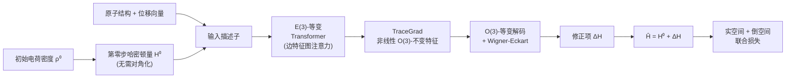

# Advancing Universal Deep Learning for Electronic-Structure Hamiltonian Prediction of Materials

**会议**: ICLR 2026  
**OpenReview**: [https://openreview.net/forum?id=YvmR4vNai2](https://openreview.net/forum?id=YvmR4vNai2)  
**代码**: [https://github.com/DavidYin94/NextHAM](https://github.com/DavidYin94/NextHAM)  
**领域**: AI for Science / 电子结构计算 / 等变图神经网络  
**关键词**: 哈密顿量预测, E(3)-等变, DFT, 自旋轨道耦合, delta-learning, 鬼态  

## 一句话总结
NextHAM 用"第零步哈密顿量"作为带物理先验的输入描述子、配合 E(3)-等变 Transformer 与实空间+倒空间联合训练损失，把跨 60+ 元素的材料电子结构哈密顿量预测做到 DFT 级精度（整体 Gauge MAE 1.417 meV、SOC 块亚 µeV），并发布了含自旋轨道耦合的 17,000 结构基准 Materials-HAM-SOC。

## 研究背景与动机
**领域现状**：电子结构计算的核心是求解哈密顿量矩阵，其本征值/本征态给出能带、波函数等关键物性。传统密度泛函理论（DFT）依赖自洽（SC）迭代，每轮都要对大矩阵做 $O(N^3)$ 对角化，模拟大体系极其昂贵。近年深度学习直接从原子构型回归哈密顿量，绕过 SC 循环，把成本降到接近线性。

**现有痛点**：深度学习方法学的是一个极其复杂的"原子构型→哈密顿量"映射，难以泛化。为了能训出来，现有工作普遍要"缩范围"——限制支持元素、忽略自旋轨道耦合（SOC）、减少轨道数。这让模型无法覆盖真实材料的多样性。同时，覆盖广、含 SOC、细粒度轨道的开源训练数据本身就稀缺。

**核心矛盾**：模型要么泛化（覆盖整张元素周期表）要么精确（达到 DFT 级、能正确导出能带），两者难以兼得；而且即便实空间哈密顿量 MAE 很小，倒空间能带也可能因重叠矩阵病态而出现"鬼态"。

**本文目标**：从方法和数据两端推进"通用"哈密顿量深度学习——既要跨化学/结构多样性泛化，又要精度高到能可靠导出下游物性。

**核心 idea**：
- **物理先验输入**：引入无需对角化即可从初始电荷密度构造的"第零步哈密顿量" $H^{(0)}$ 作为输入描述子，让网络只学残差修正 $\Delta H$。
- **等变且表达力强的架构**：把 TraceGrad 非线性机制扩展进 E(3)-等变 Transformer，强化边特征建模。
- **实空间+倒空间联合损失**：显式在 k 空间解耦能量子空间，消除鬼态、固定规范自由度。

## 方法详解

### 整体框架
NextHAM 把任务从"直接预测整个自洽哈密顿量 $H^{(T)}$"改写成 delta-learning：预测物理先验 $H^{(0)}$ 与真值之间的修正项 $\Delta H = H^{(T)} - H^{(0)}$，最终输出 $\hat{H} = H^{(0)} + \widehat{\Delta H}$。整条管线由三部分组成：带物理先验的输入描述子、E(3)-等变 Transformer + TraceGrad 非线性解码、以及实空间与倒空间联合监督的训练目标。

### 关键设计

**1. 第零步哈密顿量 $H^{(0)}$ 作物理先验输入：把"从零重建"降级为"补残差"。** 不同于已有方法用随机初始化、缺乏物理含义且稀疏的原子/边嵌入，本文从初始电荷密度 $\rho^{(0)}(\mathbf{r})$（孤立中性原子电荷密度之和）构造 $H^{(0)}$。它编码了电子-离子相互作用（赝势）强度与电子-电子相互作用的初步估计，把不同元素的特征嵌入到统一表示空间，因此能向化学复杂甚至训练未见的元素泛化。关键是 $H^{(0)}$ 无需矩阵对角化，成本随非零元个数走（小体系约 $O(N^2)$、大体系趋于 $O(N)$），与图神经网络消息传递同阶，不会拖累渐进复杂度。其 on-site 子矩阵天然作节点初始描述子、off-site 子矩阵作边描述子。受 delta-learning 启发只回归 $\Delta H = H^{(T)} - H^{(0)}$，回归目标的维度与数值范围都大幅收窄——实测把 ↑↑ 实部块的回归量程压了 96%。

**2. E(3)-等变 Transformer + TraceGrad：边级目标专门强化、等变约束下保非线性表达力。** 哈密顿量本质是定义在原子对上的"边级"量，而 Equiformer 之类等变 Transformer 原本为节点级原子性质（如力场）设计。本文据此重写注意力机制：显式跨层维护并更新边特征（而非临时从节点特征生成）；受哈密顿量矩阵元随原子间距衰减的物理规律启发，引入距离嵌入参与注意力权重计算；并把节点间注意力权重以乘性方式直接作用于边特征更新、再经等变变换精炼。为在严格 E(3)-对称下保留强非线性，作者把 TraceGrad 扩进 Transformer：更新后的等变边特征 $f'^{(edge)}_{ab}$ 送入 TraceGrad 产生 O(3)-不变特征 $z^{(edge)}_{ab}$，由不变迹量 $T = \mathrm{tr}(\Delta H \cdot \Delta H^{\dagger})$ 监督，再通过 $o^{(edge)}_{ab} = f'^{(edge)}_{ab} + \frac{\partial z^{(edge)}_{ab}}{\partial f'^{(edge)}_{ab}}$ 把学到的非线性回注等变特征。最后由 Wigner–Eckart 转换器回归 $\Delta H$。此外用集成学习按原子间距区间训练多个子模型分而治之，但每个子模型输入仍是整个体系以提取全局信息。

**3. 实空间 + 倒空间联合损失：消除鬼态并锁定规范自由度。** 多数方法只回归实空间哈密顿量，但重叠矩阵 $S$ 条件数大会把微小误差放大到本征值/本征态——敏感度被因子 $\frac{\kappa(S(\mathbf{k}))}{\|S(\mathbf{k})\|_2}$ 放大，使能带出现非物理跳变（鬼态）。本文在实空间联合监督哈密顿量与迹量：
$$\mathrm{loss}^{(R)} = \mathbb{E}_R\big[\lambda_R((1-\lambda_C)\cdot \mathrm{loss}_H(R) + \gamma\cdot \mathrm{loss}_T(R))\big]$$
并在倒空间把谱划分为主导物性的低能子空间 $P$ 与高能补空间 $Q$，对二者加差异化权重并加一项显式 PQ 惩罚来抑制跨子空间虚假耦合：
$$\mathrm{loss}^{(k)} = \mathbb{E}_k[\lambda_P \mathrm{loss}_P(k) + \lambda_Q \mathrm{loss}_Q(k) + \lambda_{PQ}\mathrm{loss}_{PQ}(k)]$$
总损失 $\mathrm{loss}_{all} = \mathrm{loss}^{(R)} + \mathrm{loss}^{(k)}$。同时整套损失通过解析确定最优规范参数 $\mu$ 解决哈密顿量的规范模糊性（加任意 $\mu S$ 不改下游物性），保证回归目标唯一且物理一致。

## 实验关键数据

### 主实验：Materials-HAM-SOC 测试集 Gauge MAE（meV）

| 区块 | Gauge MAE(0, H^T) 实部/虚部 | Gauge MAE(H⁰, H^T) 实部/虚部 | Gauge MAE(H⁰+ΔH, H^T) 实部/虚部 |
|------|------|------|------|
| ↑↑ | 149.145 / 0.293 | 5.213 / <0.001 | **2.834 / <0.001** |
| ↑↓ | 0.301 / 0.299 | <0.001 / <0.001 | <0.001 / <0.001 |
| ↓↑ | 0.301 / 0.299 | <0.001 / <0.001 | <0.001 / <0.001 |
| ↓↓ | 149.145 / 0.293 | 5.213 / <0.001 | **2.834 / <0.001** |
| Overall | 74.914 | — | **1.417** |

- 引入 $H^{(0)}$ 把 ↑↑ 实部块的回归范围相比从零回归降低 **96%**；自旋翻转块（↑↓/↓↑）与自旋守恒块虚部均达**亚 µeV** 级。

### 消融与对比（Appendix L/M）

| 组件 | 作用 |
|------|------|
| 去 $H^{(0)}$ 物理输入 | 误差显著上升 |
| 去 delta-learning（直接回归 H^T） | 误差上升 |
| 去 TraceGrad 非线性 | 表达力下降 |
| 去集成策略 | 精度下降 |
| 去 k 空间损失 | 能带出现鬼态 |
| vs DeepH-E3 / 原始 TraceGrad | NextHAM 显著领先 |

### 关键发现
- **鬼态实证**：仅用实空间损失时 $H(R)$ 的 MAE 只有 0.53 meV，能带却在个别 k 点突变出现鬼态；加 k 空间损失后 $H(R)$ MAE 仍约 0.49 meV、但 k 空间 loss 降低 >50%，能带几乎与 DFT 重合，光电导率也明显更准。
- **OOD 泛化**：训练集不含 Ne，测试含 Ne 结构时 R 空间 MAE 仅 0.1 meV，说明 $H^{(0)}$ 描述子让模型能外推到未见元素。
- 元素级分析显示大多数元素预测误差 < 1.5 meV，覆盖元素周期表前六行。

## 亮点与洞察
- **把物理过程"截断"成先验**：$H^{(0)}$ 是 DFT 自洽迭代的第零步产物，零对角化成本却携带元素级电子结构信息——用"半步物理计算"换深度学习的泛化与精度，是非常巧的归纳偏置。
- **抓住了"小 MAE ≠ 好能带"这一被忽视的痛点**：明确指出重叠矩阵病态导致的误差放大与鬼态，并用 k 空间子空间解耦 + PQ 惩罚直接对症，而非一味压实空间 MAE。
- **方法 + 数据双贡献**：补齐了含 SOC、细粒度轨道（最高 4s2p2d1f）、跨 60+ 元素的开源基准 Materials-HAM-SOC，对社区价值高。

## 局限与展望
- OOD 仅以单个 Ne 结构作 case study 演示，作者自陈需要更系统的元素级 OOD 定量评测。
- 集成多个距离区间子模型增加了训练/推理开销，可扩展性与单模型方案的权衡未充分讨论。
- 深度学习可解释性有限（伦理声明亦提及），物理知识如何被表征仍是黑箱。
- 数据基于 ABACUS/PYATB 特定赝势与基组生成，跨 DFT 软件/基组的迁移性待验证。

## 相关工作与启发
- **哈密顿量预测谱系**：DeepH 系列、DeepH-E3、TraceGrad、WANet（规范自由度）等是直接前驱；本文在等变性（Equiformer/NequIP/MACE 的 E(3) 等变路线）与表达力（TraceGrad）之间做了融合扩展。
- **delta-learning**：借鉴势能面拟合中"只学修正项"的思路迁移到矩阵回归，对其他"有廉价物理先验 + 昂贵真值"的科学任务（如力场、密度泛函）有借鉴意义。
- **启发**：当深度学习指标（MAE）与真正关心的下游物理量脱节时，应把下游物理（此处的能带/k 空间）直接写进损失，而不是只优化代理指标。

## 评分
- 新颖性: ⭐⭐⭐⭐ — $H^{(0)}$ 物理先验输入 + k 空间鬼态抑制损失是有洞察力的组合创新，虽各组件多源自已有方法。
- 实验充分度: ⭐⭐⭐⭐ — 主实验/元素级分析/消融/OOD/能带与光电导 case study 较完整，但 OOD 偏弱。
- 写作质量: ⭐⭐⭐⭐ — 动机—痛点—方法逻辑清晰，图 1/图 2 把范式对比与框架讲得透彻。
- 价值: ⭐⭐⭐⭐⭐ — DFT 级精度 + 大幅加速 + 含 SOC 的大规模开源基准，对材料电子结构计算社区实用价值很高。

<!-- RELATED:START -->

## 相关论文

- [\[ICLR 2026\] Learning from the Electronic Structure of Molecules across the Periodic Table](learning_from_the_electronic_structure_of_molecules_across_the_periodic_table.md)
- [\[ICLR 2026\] OXtal: An All-Atom Diffusion Model for Organic Crystal Structure Prediction](oxtal_an_all-atom_diffusion_model_for_organic_crystal_structure_prediction.md)
- [\[ICLR 2026\] Deep Learning for Subspace Regression](deep_learning_for_subspace_regression.md)
- [\[ICLR 2026\] Beyond Structure: Invariant Crystal Property Prediction with Pseudo-Particle Ray Diffraction](beyond_structure_invariant_crystal_property_prediction_with_pseudo-particle_ray_.md)
- [\[ICLR 2026\] MoMa: A Simple Modular Learning Framework for Material Property Prediction](moma_a_simple_modular_learning_framework_for_material_property_prediction.md)

<!-- RELATED:END -->
