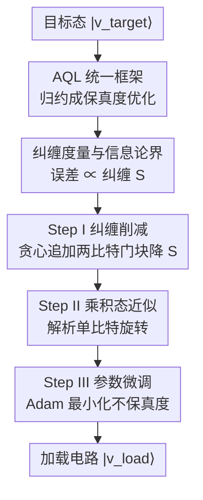

# AQER: A Scalable and Efficient Data Loader for Digital Quantum Computers

**会议**: ICLR2026  
**OpenReview**: [https://openreview.net/forum?id=0zKfU1rsXd](https://openreview.net/forum?id=0zKfU1rsXd)  
**代码**: 有（论文称已开源于 GitHub，⚠️ 具体仓库地址以原文为准）  
**领域**: 量子计算 / 量子机器学习  
**关键词**: 近似量子加载器, 量子态制备, 纠缠度量, 信息论界, 变分量子电路

## 一句话总结
本文把五花八门的近似量子加载器（AQL）统一成一个"最小化目标态与电路输出态距离"的优化问题，并证明加载的近似误差由一种新提出的纠缠度量 $S$ 线性主导；据此设计了 AQER——通过贪心地往电路里追加两比特门块逐步削减纠缠，再用解析单比特旋转和参数微调收尾，在 MNIST/CIFAR-10/SST-2 等经典数据和最多 50 比特的量子多体态上都以更少的两比特门取得更低的不保真度。

## 研究背景与动机

**领域现状**：数字量子计算的三大基础模块是态制备、处理和读出，其中"把经典/量子数据装进量子电路"的态制备是一切量子算法的入口。最坏情况下精确制备任意 $N$ 比特态需要指数多的门或辅助比特，在近期含噪、比特稀缺的硬件上根本不现实。于是近年出现了**近似量子加载器（Approximate Quantum Loader, AQL）**这一思路：放弃可证明的精确制备，转而在"保真度"和"电路复杂度"之间做权衡——很多量子算法（尤其量子机器学习）对输入态的小扰动并不敏感，因此用更少的门换取可接受的误差是划算的。

**现有痛点**：现有 AQL 方法分成两大流派——基于张量网络（TN，如 MPS 表示）的方法，和直接优化门序列的电路法（又分变分与非变分）。但这些方法要么是启发式的、没有理论保证，要么只对特定输入类型（如低纠缠的经典数据）有保证，对量子数据或高纠缠数据就失灵。更关键的是，**整个领域缺一个统一的理论框架**：人们说不清 AQL 的近似误差到底受什么根本量支配，也就无法有原则地去设计算法。

**核心矛盾**：精确态制备的资源代价是指数的，而 AQL 的"够用就好"虽然省资源，却长期停留在经验调参阶段，没人回答"误差的理论极限在哪、由谁决定"。这个空白让 AQL 的设计只能靠试。

**本文目标**：(1) 给出一个能容纳几乎所有现有 AQL 方法的统一优化框架；(2) 在这个框架上推导与具体算法无关的近似误差上下界；(3) 用理论指出的关键量来指导设计一个可扩展、好训练的实用 AQL。

**切入角度**：作者注意到，不管 TN 法还是电路法，本质上都是在"找一串门，让它作用在易制备的乘积态上后尽量逼近目标态"。把这件事写成一个统一的保真度优化问题后，就能做算法无关的信息论分析。分析发现：**误差由"用电路逆作用回目标态后剩下的纠缠"线性决定**——纠缠削得越干净，加载越准。

**核心 idea**：用"最大化纠缠削减"代替"盲目优化保真度"来构造加载电路——纠缠度量 $S$ 既是理论上误差的代理量，又是一个易于局部测量、不易陷入贫瘠高原的优化目标。

## 方法详解

### 整体框架

本文有两层贡献叠在一起：**理论层**先把所有 AQL 归约成同一个优化问题并给出误差的信息论界；**算法层**（AQER）则把理论里的"纠缠度量 $S$"当作实际优化目标，分三步把目标态的加载电路搭出来。

统一框架把 AQL 写成一个优化问题（式 1）：给定门集 $\mathcal{U}$，找一个由 $m$ 个门组成的电路 $U(\theta;A)$（$\theta$ 是可调参数、$A$ 是电路结构），使

$$\arg\min_{\theta,A}\Big[1-|\langle v_{\text{target}}|U(\theta;A)|\psi_{\text{product}}\rangle|^2\Big],$$

即让电路从一个易制备的乘积态 $|\psi_{\text{product}}\rangle$ 出发，输出尽量逼近目标态 $|v_{\text{target}}\rangle$。TN 法、变分电路法、非变分法的区别只在于"怎么更新 $\theta$、怎么设计 $A$"，都落在这同一个式子里。

在此框架上，作者证明近似误差由一种新的纠缠度量主导（见关键设计 2），于是 AQER 直接以"削减这个纠缠度量"为指南，把加载电路分三步构造出来：**Step I 纠缠削减** → **Step II 乘积态近似** → **Step III 参数微调**。整条流水线如下图。

### 关键设计

**1. AQL 统一框架：把零散方法收进同一个保真度优化问题**

现有 AQL 各说各话——TN 法逐步拼接局部酉门、变分法训练固定结构的参数化电路、非变分法按"之字形"调度逐个更新两比特门——彼此没有共同语言，自然也无法横向比较或统一分析。本文的第一步是指出它们其实都在解式 (1) 这同一个优化问题，只是在"更新 $\theta$ 还是改 $A$、还是两者一起改"上做法不同：TN 法是 $U(\theta;A)\to U(\theta\cup\theta_{\text{new}};A\cup A_{\text{new}})$ 式地不断增长电路并冻结旧参数；变分法固定 $A$ 只优化 $\theta$；非变分法则沿之字形同时调 $\theta$ 和 $A$。这个统一视角的价值在于：一旦把问题写成"乘积态经电路演化后与目标态的距离"，就能做**与具体算法无关**的误差分析，这是后面信息论界能成立的前提。

**2. 纠缠度量与信息论界：用一个可测量的纠缠量框住误差**

把 AQL 统一后，作者问：误差的理论极限由什么决定？他们定义 $N$ 比特态 $|\psi\rangle$ 的纠缠度量为各单比特纠缠熵之和 $S(|\psi\rangle)=\sum_{i=1}^{N} S_{\{i\}}(|\psi\rangle)$（其中单比特熵基于 Renyi-2 熵 $S_A=-\log_2\mathrm{Tr}[\rho_A^2]$）。定理 3.1 证明：对目标态 $|v_{\text{target}}\rangle$ 和满足 $S(U^\dagger|v_{\text{target}}\rangle)=S$ 的电路 $U$，不保真度被夹在两条与算法无关的界之间——下界 $f_1(S)=\tfrac12\big(1-\sqrt{2^{\,1-S/N}-1}\big)$，上界 $f_2(S)=\tfrac12\big(1-\sqrt{2^{\,1-S+\lfloor S\rfloor-1}}+\lfloor S\rfloor\big)$（⚠️ 公式以原文为准）。当 $S\to0$ 时两界都退化为线性，$f_1(S)\to\tfrac{\ln 2}{2N}S$、$f_2(S)\to\tfrac{\ln 2}{2}S$。结论很干脆：**近似误差随"用电路逆作用回目标态后剩余的纠缠 $S$"线性变化**，$S$ 越小、加载越准。这把抽象的"优化保真度"翻译成了具体可操作的"削减纠缠"，也是本文第一次从信息论角度给 AQL 立误差极限。

**3. Step I 纠缠削减：贪心地往电路里堆两比特门块，逐步把目标态"解纠缠"**

既然误差由 $S$ 主导，AQER 的第一步就直接以最小化 $S$ 为目标构造门序列。它迭代地往电路里追加结构相同的两比特门块 $V_{I_t}(\alpha_t)$（每块是 $R_{ZZ}R_Y R_Z$ 加双侧单比特旋转）。第 $t$ 次迭代时，在当前态 $|v_{t-1}\rangle=V_{t-1}(\alpha_{1:t-1})|v_{\text{target}}\rangle$ 上贪心地挑作用比特对 $I_t=(j_t,k_t)$ 和参数 $\alpha_t$，使

$$I_t,\alpha_t=\arg\min_{\tilde I,\tilde\alpha} S\big(V_{\tilde I}(\tilde\alpha)|v_{t-1}\rangle\big),$$

即每加一个门块都让纠缠度量降得最多。重复 $T$ 次后得到低纠缠态 $|v_T\rangle=V_T(\alpha)|v_{\text{target}}\rangle$。这一步同时解决了两个老问题：一是它直接逼近理论上的误差极限；二是因为以 $S$（局部可测、梯度信息充分）为目标，**回避了变分电路常见的贫瘠高原（barren plateau）**，让训练在大比特系统上仍能收敛——这正是它区别于以往直接优化保真度的电路法之处。迭代次数 $T$ 还直接控制两比特门数 $G$（一次迭代加一个两比特门），给出了精度-资源的可调旋钮。

**4. Step II 乘积态近似 + Step III 参数微调：先解析收尾，再整体打磨**

Step I 把态削成低纠缠后，定理 3.1 保证它能被一个乘积态很好地近似。Step II 据此从标准初态 $|0\rangle^{\otimes N}$ 出发，施加单比特旋转 $W(\beta,\gamma)=\otimes_{i=1}^N(R_Z(\beta_i)R_Y(\gamma_i))$ 来逼近 $|v_T\rangle$；关键是推论 3.2 给出 $(\beta,\gamma)$ 的**解析闭式**，无需数值优化即可直接算出，省掉一整轮训练。Step III 再把前两步拼成完整电路 $U_{\text{AQER}}(\theta)=V_T(\alpha)^\dagger W(\beta,\gamma)$（$\theta=(\alpha,\beta,\gamma)$），用 Adam 微调全部参数以最小化最终不保真度

$$\theta^*=\arg\min_\theta\big(1-|\langle v_{\text{target}}|U_{\text{AQER}}(\theta)|0\rangle^{\otimes N}|^2\big),$$

得到加载电路 $|v_{\text{load}}\rangle=e^{-ig}U_{\text{AQER}}(\theta^*)|0\rangle^{\otimes N}$（$g$ 是不影响测量的全局相位）。"解析单比特旋转打底 + 全局微调收尾"的组合既快又准：解析步省去优化、微调步把残差压到底。对量子数据，$S$ 和梯度只需局部测量即可估计；对经典数据，整个 AQER 可在经典计算机上模拟出 $U_{\text{AQER}}$。

### 一个完整示例

以加载一张 MNIST 图（$N=10$ 比特、振幅编码）为例走一遍：把 $28\times28$ 灰度图归一化成 1024 维向量，编码成目标态 $|v_{\text{target}}\rangle$。**Step I**：从 $T=5$ 个两比特门块起，每次迭代在所有比特对上试，挑出让 $S$ 降得最多的那一对加进去；随着 $T$ 从 5 增到 100，$S$ 大约降了 4 倍，态越来越"接近可分"。**Step II**：对削好的 $|v_T\rangle$ 直接用闭式解算出 10 组 $(\beta_i,\gamma_i)$ 单比特旋转，把 $|0\rangle^{\otimes10}$ 拉到 $|v_T\rangle$ 附近，这一步不训练。**Step III**：把整条电路用 Adam 跑 2000 步微调，不保真度随 $T$ 增大成倍下降。最终在 $G=80$ 个两比特门下，MNIST 上不保真度约 0.034，优于同等门数的 MPS/HEC/AQCE。

### 损失函数 / 训练策略

Step I 的每次迭代用 Nelder–Mead 法优化 $\alpha_t$（收敛容差 $10^{-4}$，参数初始化为零），比特对 $I_t$ 取使 $S$ 最小的那对；Step III 用 Adam（学习率 $10^{-2}$，$T_3=2000$ 步）。迭代次数默认 $T\in\{5,10,20,40,60,80,100\}$，对大比特的 GS-TFIM（$N\ge20$）扩到最大 200。量子数据上 $S$ 和梯度默认由 $10^5$ 次模拟测量估计。

## 实验关键数据

### 主实验

在 MNIST、CIFAR-10、SST-2（经典）与 S-RQC、GS-TFIM（量子，$N=10$）五个数据集上，比较 AQER（$G\in\{20,40,80\}$）与三个代表性基线 MPS / HEC / AQCE 的不保真度（越低越好）。AQER 在相同或更少的两比特门下普遍取得最低误差。

| 数据集 | 指标(↓) | AQER (G=80) | 次优方法 | 说明 |
|--------|---------|-------------|----------|------|
| MNIST | 不保真度 | 0.034 | AQCE 0.051 | 同 G 下更低 |
| CIFAR-10 | 不保真度 | 0.018 | AQCE 0.024 | 同 G 下更低 |
| SST-2 | 不保真度 | 0.406 | AQCE 0.518 | 高维嵌入更难 |
| S-RQC | 不保真度 | 0.067 | AQCE 0.267 | 相对次优降 >60% |
| GS-TFIM | 不保真度 | 0.003 | MPS 0.041 / AQCE 0.056 | 多体态优势明显 |

最突出的是 S-RQC（随机量子电路态）：AQER 在 $G\in\{40,80\}$ 时相对次优的 AQCE 把不保真度降了 **60% 以上**，甚至能用**少 50% 的两比特门**做到更低误差。

### 消融实验

围绕"纠缠削减"这一核心机制的分析（图 3、图 4）。

| 配置 / 变量 | 关键现象 | 说明 |
|------|---------|------|
| 增大 Step I 迭代 $T$ | $S$ 与不保真度同步下降 | MNIST 上 $T:5\to100$，$S$ 降约 4 倍，误差同步降 |
| 误差 vs $S$ 散点 | 落在定理 3.1 上下界之间 | 验证"误差 ∝ 纠缠 $S$"的线性关系 |
| GS-TFIM 增大 $T$ | 误差从 $>2^{-2}$ 降到 $<2^{-8}$ | 门越多、纠缠削得越干净 |
| 测量 shots 增多 | 误差进一步下降 | $T=100$ 时增益 >16 倍，$T=10$ 时 <4 倍 |
| 比特数 $N:20\to50$ | 仍可收敛 | 无贫瘠高原，可扩展到 50 比特 |

### 关键发现
- **纠缠度量 $S$ 是误差的有效代理**：实测误差始终被 Theorem 3.1 的上下界夹住，且随 $S$ 线性下降，理论与实验自洽。
- **门数 $G$（由 $T$ 控制）是核心旋钮**：$T$ 越大、纠缠削得越干净、误差越低，但代价是更多两比特门，给出明确的精度-资源权衡。
- **可扩展性来自避开贫瘠高原**：以局部可测的 $S$ 为目标使 AQER 在 50 比特量子多体态上仍能训练，这是直接优化保真度的电路法做不到的。
- **量子数据上优势更大**：S-RQC 和 GS-TFIM 这类高纠缠/结构化量子态上，AQER 对基线的领先幅度明显高于经典图像数据。

## 亮点与洞察
- **把"优化保真度"翻译成"削减纠缠"**：信息论界（定理 3.1）证明误差由单比特纠缠熵之和 $S$ 线性主导，于是优化目标从难训练的全局保真度换成易局部测量、梯度信息丰富的 $S$——这一步换目标同时解决了"理论极限"和"贫瘠高原"两个问题，是全文最巧的地方。
- **统一框架的方法论价值**：先把一堆异构方法归约成同一个优化问题，再做算法无关的分析，这套"先统一、再立界、后指导设计"的思路可迁移到其他量子原语（如读出、处理）的研究。
- **解析 + 微调的两段式收尾**：Step II 用闭式解直接给出单比特旋转、不训练，Step III 才整体微调，省掉一整轮优化又不牺牲精度，是个实用的工程取舍。
- **可调资源旋钮**：迭代次数 $T$ 一对一映射两比特门数 $G$，让用户能按硬件预算直接换精度，对近期含噪硬件很友好。

## 局限与展望
- **总体是启发式算法**：作者承认 AQER 一般情况下只是启发式，只有对特定结构化态族（如 IQP 态，见附录 H）才有多项式资源的最优性保证，对任意态没有可证明保证。
- **Step I 的贪心搜索代价**：每次迭代要在所有比特对上试选使 $S$ 最小的那对，比特数大时这个组合搜索的开销值得关注（论文把时间复杂度分析放在附录）。
- **实验为数值模拟**：结果都是经典模拟（最多 50 比特），尚未在真实含噪硬件上端到端验证，噪声信道下的表现只在附录做了理论推广。
- **改进方向**：把 Step I 的贪心比特对选择换成更高效的搜索/剪枝；在真实量子设备上验证纠缠度量估计的稳健性；探索对更广态族的可证明保证。

## 相关工作与启发
- **vs MPS / 张量网络法**：TN 法对低纠缠经典数据有受控误差保证，但对量子数据或高纠缠数据失效；AQER 不依赖显式低纠缠表示，直接以削减纠缠为目标，因此对经典和未知量子态都通用。
- **vs HEC（硬件高效变分电路）**：HEC 固定电路结构、直接优化保真度，易陷贫瘠高原且无理论保证；AQER 以局部可测的 $S$ 为目标，缓解贫瘠高原并有信息论界托底。
- **vs AQCE（非变分自动电路编码）**：AQCE 按之字形逐个调两比特门、无显式参数训练，是当前非变分 AQL 的代表；AQER 在 S-RQC 上以更少门把误差再降 60% 以上，说明"纠缠引导"比"盲目逐门优化"更高效。

## 评分
- 新颖性: ⭐⭐⭐⭐⭐ 首次从信息论角度给 AQL 立误差极限，并把它落成可操作的纠缠削减算法。
- 实验充分度: ⭐⭐⭐⭐ 覆盖经典+量子、最多 50 比特、多基线对比，但全为数值模拟、未上真实硬件。
- 写作质量: ⭐⭐⭐⭐ 理论与算法衔接清晰，框架图把三步流程讲得明白。
- 价值: ⭐⭐⭐⭐⭐ 为可扩展量子数据加载提供了有理论根基的通用方法，是量子机器学习的关键前置模块。

<!-- RELATED:START -->

## 相关论文

- [\[ICLR 2026\] Accelerating Inference for Multilayer Neural Networks with Quantum Computers](accelerating_inference_for_multilayer_neural_networks_with_quantum_computers.md)
- [\[ICLR 2026\] DGNet: Discrete Green Networks for Data-Efficient Learning of Spatiotemporal PDEs](dgnet_discrete_green_networks_for_data-efficient_learning_of_spatiotemporal_pdes.md)
- [\[ICLR 2026\] Learning Data-Efficient and Generalizable Neural Operators via Fundamental Physics Knowledge](learning_data-efficient_and_generalizable_neural_operators_via_fundamental_physi.md)
- [\[CVPR 2025\] ATP: Adaptive Threshold Pruning for Efficient Data Encoding in Quantum Neural Networks](../../CVPR2025/physics/atp_adaptive_threshold_pruning_for_efficient_data_encoding_in_quantum_neural_net.md)
- [\[AAAI 2026\] Data Verification is the Future of Quantum Computing Copilots](../../AAAI2026/physics/data_verification_is_the_future_of_quantum_computing_copilots.md)

<!-- RELATED:END -->
