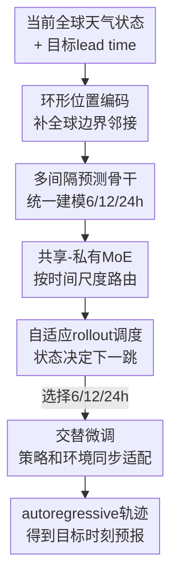

# ARROW: An Adaptive Rollout and Routing Method for Global Weather Forecasting

**会议**: ICLR2026  
**OpenReview**: [https://openreview.net/forum?id=Qs0BieWYEN](https://openreview.net/forum?id=Qs0BieWYEN)  
**代码**: https://github.com/decisionintelligence/ARROW  
**领域**: 物理建模 / 全球天气预报 / 大气动力学  
**关键词**: 全球天气预报, 自适应 rollout, 多时间尺度建模, Mixture-of-Experts, 强化学习调度  

## 一句话总结
ARROW 把全球天气预报里的“下一步预测模型”和“长时 autoregressive rollout 策略”一起重新设计：用一个多间隔预测模型统一处理 6/12/24 小时尺度，再用 DQN 调度器根据当前天气状态自适应选择下一跳，从而在中长期预报中同时降低误差累积并保留细粒度大气变化。

## 研究背景与动机
**领域现状**：数据驱动全球天气预报通常不直接预测十几天后的状态，而是先训练一个短间隔一步预测模型，再把它按 autoregressive 方式反复调用。例如 6 小时模型可以重复 23 次得到 138 小时预报，Pangu-Weather 这类方法则额外训练 6/12/24 小时多个模型，并在推理时用固定的贪心策略拼出目标 lead time。

**现有痛点**：这种范式的第一个问题在模型侧。大气系统在不同时间尺度上不是相互独立的：同一类天气系统可能在 6 小时内表现为局地扰动，在 24 小时内表现为更大尺度的位势高度或温度场迁移。如果为每个时间间隔单独训练一个模型，模型之间无法共享这些跨尺度规律，也带来更多训练和维护成本。第二个问题在 rollout 侧。固定 6 小时 rollout 能细看短期变化，但步数多，误差不断叠加；固定或贪心地用大间隔 rollout 能减少步数，却容易跨过快速天气转折。

**核心矛盾**：全球天气预报的长时推理需要同时满足两个目标：稳定时期应该用更大的时间步减少 autoregressive 调用次数，剧烈变化时期又应该用更小的时间步捕捉快速演化。传统固定策略把这个选择写死了，等于假设所有初始天气状态、所有季节和所有区域都适合同一条时间轨迹。

**本文目标**：作者把问题拆成两层：先训练一个可以接受不同时间间隔 $\delta$ 的统一预测器，让它在 6/12/24 小时上都能输出天气增量；再学习一个 rollout scheduler，让它根据当前预测天气状态、目标 lead time 和剩余时间决定下一步应该走 6 小时、12 小时还是 24 小时。

**切入角度**：这篇论文的直觉很接近数值天气预报中的自适应时间步思想：当系统演化平缓时，求解器可以迈大步；当系统进入转折期时，需要缩小步长。ARROW 将这个思想迁移到数据驱动天气模型中，只不过“步长选择”不再由人工规则或 CFL 条件直接给出，而是用强化学习从历史预报误差中学习。

**核心 idea**：用一个“多间隔天气预测模型 + 状态感知 rollout 调度器”替代固定 autoregressive 轨迹，让模型自己决定什么时候看细、什么时候迈大步。

## 方法详解

### 整体框架
ARROW 的训练分两阶段。第一阶段预训练 Multi-Interval Forecasting Model（MIFM）：输入当前全球天气状态 $X_0$ 和时间间隔 $\delta \in \{6h,12h,24h\}$，模型预测天气增量 $\Delta_\delta=X_\delta-X_0$，再与当前状态相加得到一步预测。第二阶段训练 Adaptive Rollout Scheduler（AR Scheduler）：调度器观察当前预测状态、日期时间和离目标 lead time 的位置，选择下一步时间间隔；MIFM 按该间隔推进天气状态，循环直到到达目标时刻。

整体上，ARROW 不是把 RL 当成天气模型本体，而是把 RL 放在 rollout 决策层。天气场的空间和多尺度动力学主要由 MIFM、Ring Positional Encoding 和 Shared-Private MoE 建模；DQN scheduler 负责在推理轨迹上选择合适的时间步，并通过交替微调让预测模型适应这条学出来的轨迹。

### 关键设计
**1. 环形位置编码：让全球网格知道地图边界其实相邻**

许多 Transformer 天气模型把经纬度网格当作一张普通二维图像，左边界和右边界在 token 序列里相距很远。但在地球上，经度边界对应的是同一条附近区域，180°W 和 180°E 附近的大气场应当被视为连续邻域。ARROW 的 Ring Positional Encoding（RPE）用正余弦环形编码替代普通二维位置编码，让边界 token 在位置相似度上保持接近，从而减少把球面投影成平面后带来的断裂感。

论文给出的位置编码大致形式是：对网格位置 $k:(p_k^x,p_k^y)$，使用 $\sin(\frac{p_k}{w}2\pi i)$ 和 $\cos(\frac{p_k}{w}2\pi i)$ 构造周期性表示，使相隔一个周期的端点具有高相似度。需要注意的是，正文和附录对“经度/纬度哪一维具有环形性质”的文字表述略有不一致；从附录的解释和全球地图边界问题看，关键意图是编码经度方向的环形邻接，具体实现以原文公式为准。这个设计不是为了引入复杂物理方程，而是把一个很基本的球面几何先验塞回 Transformer 的 token 表示里。

**2. 多间隔预测骨干：一个模型同时学不同时间步的天气增量**

传统做法要么只训练一个 6 小时模型反复用，要么为 6/12/24 小时分别训练多个 SIFM。ARROW 改成一个条件化的 MIFM：给定当前状态 $X_0$ 和时间间隔 $\delta$，预测 $\hat{\Delta}_\delta$，最终输出 $\hat{X}_\delta=X_0+\hat{\Delta}_\delta$。这样，6 小时的局地变化、12 小时的中间尺度演化和 24 小时的更长尺度趋势都在同一参数空间里学习。

MIFM 的 Transformer block 通过 AdaLN 注入时间间隔条件，等于告诉模型“这次你要预测多远”。这一步解决的是跨时间尺度共享问题：不同 $\delta$ 的大气动力学并非完全不同，风场、温度场和位势高度场之间仍遵循相同的物理关联；但它们又不能被粗暴混成一类，因为 6 小时和 24 小时的误差形态、变化幅度和空间平滑程度都不同。统一模型让共享成为可能，条件化输入则保留了时间尺度差异。

**3. 共享-私有MoE：把共性动力学和尺度特异性拆开路由**

为了避免统一 MIFM 把所有时间间隔压成一个平均模型，ARROW 在 Arch Block 中加入 Shared-Private Mixture-of-Experts。每个 token 经过一个共享 FFN $E_s$ 和若干私有 FFN $E_m^p$；共享专家负责所有时间间隔都需要的共性动力学，私有专家则通过 gating 更偏向某些时间尺度。论文中的 token 更新可写成 $z_l^{(n)}=\sum_m g'_{m,l}E_m^p(\bar z_l^{(n-1)})+E_s(\bar z_l^{(n-1)})$。

路由不是普通 MoE 的无条件 top-k。ARROW 先计算 gate score $s_l$，再加入与时间间隔 $\delta$ 相关的噪声分布 $b_l^\delta$，用 $Top\text{-}k(s_l+b_l^\delta)$ 选择私有专家。这样，同一位置 token 在不同 $\delta$ 下可能走向不同专家，模型可以把“短时快速变化”和“长时平滑趋势”的特征拆开。两个辅助损失也服务于这个目标：aux-loss1 鼓励不同时间间隔的噪声分布彼此拉开，让私有专家学出差异；aux-loss2 鼓励总体专家使用接近均匀，避免只有少数专家被反复激活。

**4. 自适应rollout调度与交替微调：让时间步选择跟着天气状态走**

AR Scheduler 把 rollout 写成一个序列决策问题。状态包括当前预测天气状态 $\hat{X}_{\tau_{t-1}}$、日期时间信息、已经走过的时间、剩余时间和目标 lead time；动作是离散时间间隔 $\{6h,12h,24h\}$；奖励是每一步预测误差的负值，并额外加入步数惩罚 $\omega$，使策略不能无节制地选择短步长。换句话说，调度器既要让每一步更准，也要考虑整条轨迹太长会积累误差。

作者使用 DQN 估计 $q(s,a)$。调度器将天气 embedding 和时间 embedding 拼接后送入 self-attention，再输出每个动作的价值。一个关键细节是：如果只在预训练 MIFM 上学习策略，随后再按该策略微调 MIFM，那么环境已经变了，原策略就不再最优。因此 ARROW 采用交替优化：一边用 TD loss 更新 DQN，一边让当前 scheduler 生成 rollout 轨迹，并用多步 rollout loss 微调 MIFM 的预测头。这个交替过程把“会选时间步的策略”和“适应该时间步序列的预测器”绑定在一起。

### 一个完整示例
以 138 小时预报为例，固定 naive rollout 会调用 6 小时模型 23 次，轨迹很细，但每一次都把上一步误差带到下一步。贪心策略会先走若干个 24 小时，再补 12 小时和 6 小时，步数少，却可能在强对流、季节转换或台风快速变化阶段跨得太大。

ARROW 的轨迹不是预先写死的。假设初始状态对应一个相对稳定的中纬度天气过程，scheduler 可能先选择 24 小时，把大尺度环流推进到较远位置；如果中途预测状态显示位势高度或温度场出现转折，它可以改选 6 小时或 12 小时来细看后续变化。论文附录的 scheduler 分析也显示，120 小时预报比 354 小时预报更常选择 6 小时间隔，因为短轨迹更能承受细粒度步长；而在 2018 年 8 月末到 9 月初多次热带风暴和台风活跃阶段，scheduler 对 6 小时间隔的选择频率明显升高。

### 损失函数 / 训练策略
预训练阶段的核心是随机时间间隔天气增量预测。模型从 $\delta \sim P(\delta)$ 采样时间间隔，预测对应的 $\hat{\Delta}_\delta$，并用带变量权重和纬度权重的预测损失 $L_\delta$ 优化。S&P MoE 的辅助项写成 $L_{aux}=-aux\text{-}loss1+\alpha\cdot aux\text{-}loss2$：前半项通过最大化不同间隔路由分布的差异来强化专门化，后半项通过接近均匀分布来维持专家负载平衡。总预训练损失为 $L_{pre\text{-}train}=L_\delta+L_{aux}$。

调度器阶段使用 DQN 的 TD loss：$L_\Psi=\mathbb{E}[(R+\gamma\max_a q_{target}(S',a)-q_{main}(S,A))^2]$。同时，MIFM 按 scheduler 生成的轨迹 $\Gamma$ 进行多步微调，损失对轨迹上各时刻的天气增量误差求平均，并带有变量权重和纬度权重。实现细节上，MIFM 使用 16 层 Transformer、hidden size 1024、16 个 attention heads；S&P MoE 含 1 个共享专家和 9 个私有专家，每次选 3 个私有专家；可选时间间隔是 6/12/24 小时。AR Scheduler 的 replay buffer 大小为 9000，target network 每 10 step 同步一次，多步微调学习率比调度器学习率小得多，以免预测器被策略更新牵着剧烈漂移。

## 实验关键数据

### 主实验
论文在 WeatherBench/ERA5 子集上评估，训练集为 2008-2016 年，验证集为 2017 年，测试集为 2018 年。输入空间分辨率为 $128\times256$，时间分辨率为 6 小时，评估变量包括 T2m、U10、V10、TCC、Z500 和 T850。指标为纬度加权 RMSE（越低越好）和 ACC（越高越好）。

| 变量 | Lead time | ARROW RMSE / ACC | 最强数据驱动基线 RMSE / ACC | 主要差异 |
|------|-----------|------------------|------------------------------|----------|
| T2m | 5-day | 1.66 / 0.80 | Stormer 1.76 / 0.78 | 温度短中期预报更准，ACC 也更高 |
| T2m | 14-day | 2.99 / 0.29 | Keisler 3.24 / 0.18 | 长期温度场退化更慢 |
| U10 | 9-day | 4.09 / 0.37 | Keisler 4.26 / 0.28 | 近地面风场保持更好空间相关 |
| Z500 | 7-day | 565.20 / 0.74 | FourCastNet 604.04 / 0.71 | 中层动力结构预测更稳定 |
| T850 | 14-day | 3.91 / 0.20 | Keisler 4.28 / 0.13 | 接近地面温度驱动变量的长期表现更好 |

整体结果显示，ARROW 在六个关键变量和多个 lead time 上都优于数据驱动基线。论文总结的平均提升约为 RMSE 9.3%、ACC 10%，这里的提升对象是各变量/天数上的第二优数据驱动模型。IFS 作为传统数值预报系统在表中仅作参考，因为其初始时刻和变量覆盖不完全，论文没有把它纳入总体数据驱动方法的平均比较。

### 消融实验
| 配置 | T2m-72h RMSE / ACC | U10-72h RMSE / ACC | V10-72h RMSE / ACC | 说明 |
|------|--------------------|--------------------|--------------------|------|
| w/o RPE | 1.12 / 0.91 | 1.76 / 0.90 | 1.82 / 0.90 | 去掉环形位置先验后，全球边界连续性建模变弱 |
| w/o S&P MoE | 1.13 / 0.91 | 1.77 / 0.90 | 1.81 / 0.90 | 统一模型缺少时间尺度专门化 |
| w/o aux-loss1 | 1.15 / 0.89 | 1.83 / 0.88 | 1.92 / 0.88 | 私有专家差异性不足，退化最明显 |
| w/o aux-loss2 | 1.12 / 0.90 | 1.82 / 0.88 | 1.85 / 0.89 | 专家负载失衡，部分专家被过度依赖 |
| ARROW-Pretrain | 1.09 / 0.91 | 1.71 / 0.91 | 1.77 / 0.91 | 完整预训练模型表现最好 |

| Rollout 策略 | 机制 | 138h 上的结论 | 含义 |
|--------------|------|----------------|------|
| Naive | 全程 6h | 细但步数多 | 能捕捉变化，但误差累积严重 |
| Greedy | 尽量用 24h，再补 12h/6h | 比 naive 更差 | 大步长减少误差传递，但会错过细粒度变化 |
| Random | 随机选 6/12/24h | 弱于 adaptive | 说明不是“混合时间步”本身带来提升 |
| Adaptive | DQN 根据状态选时间步 | T2m 和 T850 RMSE 最低 | scheduler 学到了有意义的状态-动作价值 |

### 关键发现
- RPE 的收益不只体现在某一个变量上，T2m、U10、V10 都有稳定改善，说明全球空间几何先验对不同天气变量都有帮助。
- S&P MoE 的两个辅助损失缺一不可。aux-loss1 去掉后下降最大，说明“不同时间间隔走出不同专家使用模式”是多间隔预测器的重要来源；aux-loss2 则负责防止 MoE 退化成少数专家独占。
- Adaptive rollout 的优势来自状态条件化，而不是简单减少步数。贪心大步策略在 138h 上反而不如 naive，说明中长期天气预报不能只按“用最大可用时间步”来规划轨迹。
- Case study 中，ARROW 能较好预测 2018 年 1 月西伯利亚寒潮对东亚和中亚的影响，并在云量预测中识别低云量区域，显示它的提升不只是表格指标，也反映在空间结构和下游应用相关变量上。

## 亮点与洞察
- 把 rollout 策略显式建模成决策问题是本文最有意思的地方。天气预报里 autoregressive 轨迹常被当作工程细节，ARROW 则指出这条轨迹本身会决定误差传播方式，值得单独学习。
- S&P MoE 是一个相对自然的多时间尺度建模方式。它没有为每个时间间隔复制一套完整模型，而是在共享物理共性和保留尺度特异性之间做了结构化拆分。
- RPE 的设计提醒我们，地球系统数据不能完全照搬图像 Transformer 的位置编码。即使模型主体仍是 Transformer，一个简单的球面拓扑先验也可能减少很具体的空间失真。
- 交替训练策略很关键。若只训练 scheduler 而不让 MIFM 适应该 scheduler，策略学到的是旧环境；若只微调 MIFM 而不更新策略，时间步选择又会滞后。这个“策略-环境共同变化”的视角可迁移到交通、空气质量、电力负荷等长时序滚动预测任务。

## 局限与展望
- ARROW 的动作空间只包含 6/12/24 小时，属于离散且较粗的自适应步长。真实大气过程可能需要更连续或更细的时间步选择，尤其是在极端天气快速发展阶段。
- 实验主要在 WeatherBench/ERA5 的 $1.40625^\circ$ 分辨率上进行，离高分辨率业务天气预报仍有距离。模型在更高分辨率、更多垂直层、更多观测同化条件下是否保持收益，需要进一步验证。
- scheduler 的奖励主要来自预测误差和步数惩罚，还没有显式纳入灾害天气、区域重点变量或下游风险成本。对于实际气象业务，台风路径、强降水、极端高温等事件可能需要任务相关 reward。
- MoE 和 DQN 交替微调增加了训练复杂度。虽然论文报告了收敛曲线，但大规模部署时还需要评估稳定性、训练成本和不同随机种子下的策略一致性。
- 论文未来方向提到可探索局地天气预报和 physics-guided 方法。一个自然延伸是把物理守恒约束、流体动力学残差或不确定性估计加入 scheduler，使它不仅知道“哪里误差大”，也知道“哪里物理状态更敏感”。

## 相关工作与启发
- **vs Pangu-Weather**: Pangu-Weather 训练多个不同时间间隔的独立模型，并在推理时用固定贪心策略组合 lead time。ARROW 用一个 MIFM 统一多间隔预测，再用状态感知 scheduler 替代固定贪心，因此更适合非均匀大气演化。
- **vs FourCastNet**: FourCastNet 使用 AFNO/神经算子高效建模全球天气，但 rollout 仍主要依赖固定短间隔 autoregression。ARROW 的贡献不在更换成某个单一算子，而在把多间隔预测和 rollout 决策合并进同一训练框架。
- **vs GraphCast**: GraphCast 通过球面 mesh 和消息传递强化空间结构建模，在全球天气预报中非常强。ARROW 选择 Transformer 路线，用 RPE 补地球环形边界，用 MoE 处理多时间尺度，再通过 adaptive rollout 改善中长期预测。
- **vs Stormer**: Stormer 也是 Transformer 天气模型，并使用多时间间隔预测结果的组合增强稳定性。ARROW 更进一步，把“组合哪些时间步”从静态集成变成序列决策，让不同初始天气状态走不同轨迹。
- **对其他时空预测任务的启发**: 很多城市交通、空气质量、电力系统预测也用 autoregressive rollout，且同样面临“短步长准但累积误差多、长步长稳但漏细节”的矛盾。ARROW 的 scheduler 思想可以迁移为任务自适应的预测步长选择器。

## 评分
- 新颖性: ⭐⭐⭐⭐☆ 把自适应时间步思想与数据驱动天气 rollout 结合得比较清楚，MIFM+RL scheduler 的组合有辨识度。
- 实验充分度: ⭐⭐⭐⭐☆ 主实验覆盖多个强基线、变量和 lead time，也有组件消融与 case study；但高分辨率和业务场景验证仍不足。
- 写作质量: ⭐⭐⭐⭐☆ 问题动机和整体框架比较清晰，附录分析 scheduler 行为很有帮助；RPE 经/纬措辞有轻微不一致，需要读者结合公式判断。
- 价值: ⭐⭐⭐⭐⭐ 对全球天气预报和广义时空滚动预测都有启发，尤其是把 rollout 从固定工程策略提升为可学习决策模块这一点很值得复用。

<!-- RELATED:START -->

## 相关论文

- [\[NeurIPS 2025\] A Regularized Newton Method for Nonconvex Optimization with Global and Local Complexity Guarantees](../../NeurIPS2025/physics/a_regularized_newton_method_for_nonconvex_optimization_with.md)
- [\[ICLR 2026\] Adaptive Mamba Neural Operators](adaptive_mamba_neural_operators.md)
- [\[ICLR 2026\] Towards a Transferable Acceleration Method for Density Functional Theory](towards_a_transferable_acceleration_method_for_density_functional_theory.md)
- [\[ICML 2026\] ANTIC: Adaptive Neural Temporal In-situ Compressor](../../ICML2026/physics/antic_adaptive_neural_temporal_in-situ_compressor.md)
- [\[AAAI 2026\] Adaptive Fidelity Estimation for Quantum Programs with Graph-Guided Noise Awareness](../../AAAI2026/physics/adaptive_fidelity_estimation_for_quantum_programs_with_graph.md)

<!-- RELATED:END -->
