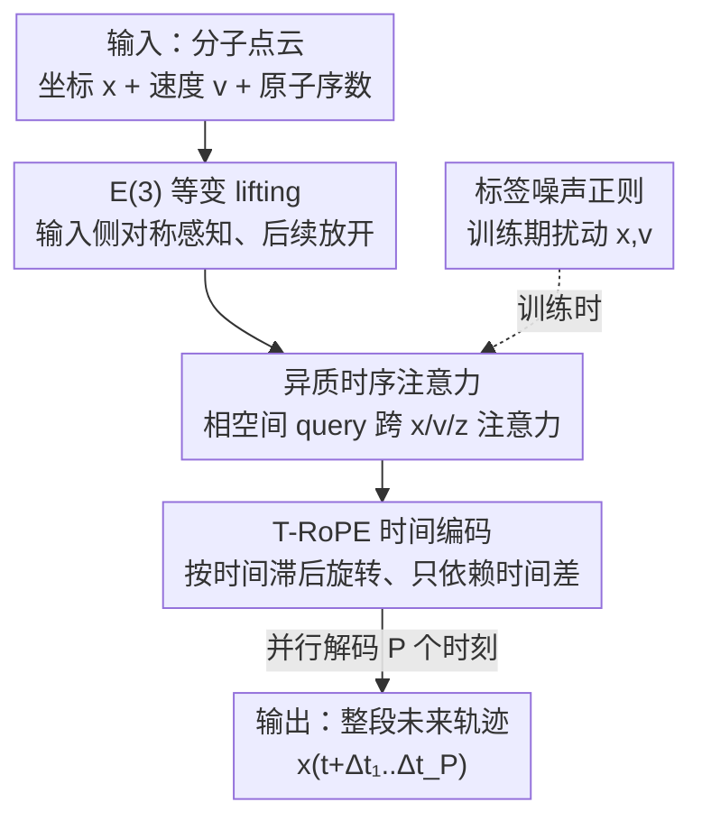

# ATOM: A Pretrained Neural Operator for Multitask Molecular Dynamics

**会议**: ICLR2026  
**OpenReview**: [https://openreview.net/forum?id=e9cV4xSjbR](https://openreview.net/forum?id=e9cV4xSjbR)  
**代码**: 待确认（论文称已开源仓库）  
**领域**: 分子动力学 / 神经算子 / 科学机器学习  
**关键词**: 分子动力学, 神经算子, 准等变, Transformer, 零样本泛化

## 一句话总结
ATOM 把分子动力学预测重新表述为"学习轨迹算子"，用一个准等变（quasi-equivariant）Transformer 神经算子并行解码多个未来时刻的原子坐标，配合自建的多分子 MD 数据集 TG80 做多任务预训练，从而首次在分子动力学上实现对未见分子、未见时间跨度的零样本泛化。

## 研究背景与动机
**领域现状**：分子动力学（MD）是药物发现和材料科学的"计算显微镜"。第一性原理 MD 用 DFT 算原子受力再积分得到轨迹，精度高但 DFT 复杂度至少随原子数立方增长、还依赖双精度难以 GPU 加速。近年的机器学习 MD 模型（NequIP、MACE、EGNN、EGNO 等）通过学习原子间作用力或轨迹，能在大幅降低成本的同时逼近第一性原理精度。

**现有痛点**：作者点名三个具体问题。其一，主流方法把**严格等变**（每一层都精确保持旋转/平移对称）当成必需的物理先验，但严格等变会增加计算开销、限制模型表达力、让优化更难。其二，绝大多数方法是**自回归**的——用当前状态预测下一步，长程时间依赖捕捉不好、误差会随预测步数累积，而且必须顺序积分、吃不到现代硬件的并行红利。其三，它们基本是**单任务**的：每个分子、固定时间窗各训一个模型，对未见化合物和更长时间步几乎没有泛化能力。

**核心矛盾**：等变性带来的泛化收益和它造成的表达力/效率损失之间存在 trade-off；而"单分子单模型"的范式让神经方法最有价值的迁移学习能力（推广到没有数值解的新分子）根本没被发挥出来。唯一接近"算子学习"思路的 EGNO 仍然既严格等变又单任务。

**本文目标**：在一个统一框架里同时解决等变约束、自回归累积误差、零样本泛化三件事。

**切入角度**：作者假设**严格等变可以被放松**——只在输入侧用一个等变 lifting 层产生"对称感知"的特征，后续 Transformer 块完全不受等变约束，照样能对随机旋转保持鲁棒，且精度更高。同时把整条轨迹当作算子的输出一次性并行解码，而不是一步步 rollout。

**核心 idea**：用"准等变 Transformer 神经算子 + 时间旋转位置编码 + 多分子预训练数据集"替代"严格等变 GNN + 自回归 + 单任务"，直接学习从初始状态到整段未来轨迹的传播算子，实现跨分子、跨时间尺度的零样本迁移。

## 方法详解

### 整体框架
ATOM（Atomistic Transformer Operator for Molecules）把分子建模为 $\mathbb{R}^3$ 中的点云 $G(t)=(x_i^{(t)}, v_i^{(t)})_{i=1}^N$（坐标+速度），目标是学习一个神经算子 $F_\theta$ 逼近真实的解算子 $F^\dagger: G(t)\to U$，其中 $U:[0,\Delta T]\to \mathbb{R}^{N\times3}$ 是把时间滞后 $\Delta t$ 映到未来分子坐标的轨迹函数。训练时在时间域离散采样 $\{\Delta t_1,\dots,\Delta t_P\}$，用 L2 损失对齐预测坐标和真实坐标：

$$\min_\theta \frac{1}{P}\sum_{p=1}^{P}\mathbb{E}_{G(t)}\left\|F_\theta(G(t))(\Delta t_p) - x^{(t+\Delta t_p)}\right\|_2^2$$

整条 pipeline 是：原子坐标/速度/相空间特征先经过 **E(3) 等变 lifting** 升到高维对称感知嵌入 → 进入若干 **异质时序注意力块**（以相空间特征为 query，对坐标/速度/相空间三类 key-value 做注意力，并叠加 **T-RoPE** 编码时间滞后）→ 投影回坐标空间，**并行**输出 $P$ 个未来时刻的分子状态。训练时再注入 **标签噪声正则**抵抗 DFT 轨迹本身的数值噪声。算子可写成 $F_\theta := P\circ\sigma(K_L)\circ\cdots\circ\sigma(K_1)\circ Q$，其中 $Q,P$ 是等变 lifting / 投影算子，$K_l$ 是注意力诱导的数据相关核。多任务时只需把 mini-batch 换成多个分子、把 $\Delta t$ 从 $\text{LogUnif}(\Delta t_{\min},\Delta T)$ 随机采样，并在相空间特征上补一个基于半径图的随机游走位置编码来区分不同分子。

### 关键设计

**1. 准等变设计：只在输入侧等变、后续 Transformer 彻底放开**

针对"严格等变限制表达力、拖慢优化"的痛点，ATOM 提出 $\varepsilon$-准等变（$\varepsilon$-quasi-equivariance）：一个函数对群 $G$ 只需满足 $\mathbb{E}_{x}\|\int_G f(\phi(g)(x))d\mu(g) - \int_G \rho(g)(f(x))d\mu(g)\|\le\varepsilon$（$\mu$ 为归一化 Haar 测度，实践中用蒙特卡洛采样近似群积分），而不是逐层精确等变。具体做法是：每个原子用坐标、速度及其范数编码，再过一个 **E(3) 等变线性层**（e3nn 风格）把坐标和速度 lift 到满足等变约束的特征空间，相空间特征则把坐标/速度和原子序数拼起来再过等变层。关键在于——**lifting 之后的所有 Transformer 块都不再强制等变**。消融显示这种放松不仅没有牺牲对旋转的鲁棒性（去掉等变 lifting 后 SO(3) 旋转下 S2T MSE 恶化的倍数从 10.80× 飙到 19.77×），反而比"全程严格等变"的 ATOM 变体精度更高，且这一优势在多任务下被进一步放大。这印证了"严格等变会压低模型容量、复杂化优化"的近期观点。

**2. 点云全连接注意力：扔掉预定义分子图，天然吃下长程相互作用**

针对"MPNN 依赖固定键连接图、对非局域/瞬态相互作用建模不准"的痛点，ATOM **不需要任何预定义分子图**，直接在点云上做注意力——等价于一张全连接图，信息可以在分子内无障碍传播。这对大而稀疏连接的分子尤其关键：MD22 里的二十二碳六烯酸（DHA，24 个重原子）、水苏糖（45 个重原子）这类分子，长程非键的位阻和静电作用主导动力学行为，而 EGNN/EGNO 把消息传递限制在键图或半径图里，会严重欠表达这些作用，导致 EGNO 在 MD22 上直接不收敛。作者还做了消解实验：把 ATOM 的异质注意力换成在同样键/半径图上跑的 GATv2（ATOM-GATv2），性能仍大幅落后完整 ATOM，说明增益来自**全连接点云交互模式本身**，而不只是"用了注意力"。

**3. 异质时序注意力 + T-RoPE：用相空间当 query 混合多种特征，用旋转编码处理任意时间间隔**

针对"自回归累积误差、且难以并行/外推任意时间跨度"的痛点，ATOM 做两件事。其一是**异质注意力**：用相空间嵌入 $Z$ 当 query，对 $\{X,V,Z\}$ 三类特征分别做 key-value 注意力，并用可学习权重 $\gamma_F$ 调节每类特征的相对重要性，单头计算为

$$\sum_{F\in\{X,V,Z\}}\gamma_F\,\text{softmax}\!\left(\frac{\text{T-RoPE}(Q(Z))\,\text{T-RoPE}(K(F))^\top}{\sqrt{d_h}}\right)V(F)$$

相比标准自注意力，单任务下这一项带来约 6.36% 提升（论文附录证明它等价于一个核积分算子）。其二是 **T-RoPE（Temporal Rotary Position Embedding）**：把 RoPE 改造成只依赖时间滞后。定义频率 $\omega_k=b^{-2k/d_h}$，由每步增量 $\{\Delta t_p\}$ 累积出时间戳 $t_p=t+\sum_{r=1}^p\Delta t_r$，给时刻 $p$ 的所有原子施加同一个旋转矩阵 $R_p$，旋转角 $\theta_{p,k}=\frac{\omega_k}{\tau}(t_p-t_0)$（$\tau$ 是时间尺度超参）。这样 query 和 key 的旋转点积 $Q_pR_p(K_{p'}R_{p'})^\top$ **只依赖时间间隔 $t_{p'}-t_p$**，使注意力对时间平移不变，从而支持在不规则时间增量上做插值和外推；同一时刻所有原子共享 $R_p$ 又保证了分子内的置换不变性。更妙的是——预训练好的 ATOM 可以在推理时通过调制旋转相位**自由改变时间窗 $\Delta T$，无需重训**。这正是它相对 EGNO（用 Fourier 时间卷积）在长时间外推上更强的根源。

**4. 标签噪声正则：把 DFT 轨迹的数值噪声变成正则化手段**

针对"DFT 数据集本身含噪、MD 模型容易过拟合噪声"的痛点，ATOM 在训练时对观测的坐标和速度注入随机高斯噪声 $\xi_x,\xi_v\sim\mathcal{N}(0,\sigma^2 I)$，得到加噪初态 $G_\xi^{(t)}$，并对加噪后的预测目标也加同分布噪声，最小化

$$\min_\theta\frac{1}{P}\sum_{p=1}^P\mathbb{E}_{G(t),\xi,\xi_x^p}\left\|F_\theta(G_\xi^{(t)})(\Delta t_p)-(x^{(t+\Delta t_p)}+\xi_x^p)\right\|_2^2$$

噪声只在训练期施加，评测仍用未扰动的真实轨迹。它借鉴了"标签噪声有正则化效应"的理论，作用是抑制对 DFT 噪声的过拟合、提升鲁棒性。消融中去掉它会让单任务 S2T MSE 变差。

### 损失函数 / 训练策略
单任务：用均匀时间离散 $t_p=t+\frac{p}{P}\Delta T$，设 $\Delta T=3000$ fs、$P=8$，6 个 Transformer 块、隐层 256，训练 2500 epoch，按最低 S2S 验证损失早停，三次训练取均值 $\pm2\sigma$。多任务预训练：每个 mini-batch 含多个分子，$\Delta t\sim\text{LogUnif}(8\text{ fs}, 24000\text{ fs})$，目标对多分子初态和时间滞后取期望。评测用 ECFP-4 指纹 + UMAP + 凝聚聚类把化合物分成 10 个不相交簇，做五折簇级交叉验证，确保训练/验证/测试占据化学空间的不同区域，比随机划分或骨架划分更难、更贴近"必须泛化到未见分子"的真实科研场景。

## 实验关键数据

### 主实验
评测指标用 S2T（state-to-trajectory，整段轨迹平均误差 $\frac{1}{P}\sum_p\|\hat x_p-x_p\|_2^2$）和 S2S（state-to-state，仅最后一步误差 $\|\hat x_P-x_P\|_2^2$）。

**单任务 MD17**（MSE ×10⁻², 节选 S2S）：

| 分子 | EGNO | MACE | ATOM |
|------|------|------|------|
| Aspirin | 9.64 | 6.95 | **6.82** |
| Salicylic | 0.89 | 1.05 | **0.88** |
| Toluene | 11.00 | 6.44 | **4.66** |
| Uracil | 0.58 | 0.75 | 0.63 |

ATOM 在 MD17 上平均把 S2S MSE 降 14.96%、S2T MSE 降 8.3%（已排除噪声极大的 benzene）。

**单任务 MD22 大分子**（MSE ×10⁻², S2S）：

| 分子（重原子数） | EGNO | ATOM-GATv2 | ATOM | 相对 EGNO 改善 |
|------|------|------|------|------|
| Ac-Ala3-NHMe (20) | 357.89 | 223.57 | **9.65** | +97.30% |
| DHA (24) | 178.39 | 16.72 | **10.60** | +94.06% |
| Stachyose (45) | 42.11 | 41.40 | **21.25** | +49.54% |

EGNO 在 MD22 上基本失败（不收敛），ATOM 因为全连接点云能抓长程相互作用而大幅领先；ATOM-GATv2 仍远逊于完整 ATOM，证明增益来自连接模式而非注意力本身。

**多任务 TG80 零样本**（S2T MSE ×10⁻², 五个簇）：ID（同簇训练测试）下 ATOM 平均超基线 83.96%；OOD（预测未见簇的分子）下 ATOM 把 EGNO 的 S2T MSE 近乎砍半，五折平均改善 39.74%，且**五折中有四折 OOD 的 ATOM 直接打败 ID 的 EGNO**——在完全没见过测试分子的前提下做到这点，是分子动力学领域首次报告的此类零样本泛化能力。

### 消融实验

| 配置 | 影响（S2T/S2S MSE ×10⁻²） | 说明 |
|------|------|------|
| Full ATOM | 基准 | 完整模型 |
| 去等变 lifting | S2T +22.48 | 旋转下恶化倍数 10.80×→19.77×，对称鲁棒性崩 |
| 全程严格等变 | 变差（多任务更明显） | 严格等变限制容量 |
| 异质注意力→标准自注意力 | S2S +0.47 | 失去跨特征交互 |
| 去 T-RoPE（NoPE，随机 ΔT） | MSE +1.07 | 失去变时间间隔编码，外推退化成 EGNO 趋势 |
| 去标签噪声正则 | S2T 变差 | 过拟合 DFT 噪声 |

### 关键发现
- **全连接点云**是大分子上碾压 EGNO 的根因——ATOM-GATv2 对照实验把"连接模式"和"注意力"解耦，证明关键是前者。
- **T-RoPE 的价值与时间设定强相关**：单任务固定 $\Delta T$ 时它退化成常数旋转、几乎无用；一旦换成随机 $\Delta T$，去掉它 MSE 涨 1.07，且 ATOM 能在推理时改 $\Delta T$/改 $P$ 而保持稳定（离散化不变性，$P$ 从 4 扫到 24 时 S2T MSE 基本恒定）。
- **准等变 > 严格等变**：放松等变约束在多任务下优势被放大，与"严格等变限制模型容量"的近期理论一致。

## 亮点与洞察
- **"准等变"这个折中点抓得很准**：只在输入 lifting 处保留 E(3) 等变、后续 Transformer 全放开，既保住了对旋转的鲁棒性，又拿回了 Transformer 的表达力和易优化性——一个能迁移到很多几何深度学习任务的设计哲学。
- **把 RoPE 搬进时间维并连续化（T-RoPE）**很巧妙：让注意力只依赖时间差，于是同一个预训练模型能在任意 $\Delta T$、任意离散步数 $P$ 上推理而不重训，这正是神经算子"离散化不变"理想的具体落地。
- **数据集即贡献**：作者意识到"在已有数值解的分子上做单任务预测意义不大"，转而自建 TG80（80 个化合物、250 万飞秒轨迹、用 ORCA + PBE/def2-SVP + D4 色散校正生成），并用簇级交叉验证逼真地测"泛化到未见分子"，把评测协议本身也往前推了一步。
- **把 MD 彻底重述为算子学习**：力是被绕开的——ATOM 是"无力（force-free）的确定性粗粒化"，直接学时间推前算子并行解码，这与主流"先学力再积分"的范式正交。

## 局限与展望
- **只预测坐标、不预测力/能量**：沿用 EGNO 的设定只建模位置状态，不保证能量守恒，做长时间物理一致性模拟时这是隐患（相关工作里 Bigi et al. 显式引入哈密顿结构，ATOM 没有）。
- **TG80 的成本与覆盖**：生成轨迹耗了 80 万 CPU 小时（约 15 万美元），且都在真空、300K、def2-SVP 这一固定设置下，能否推广到溶剂环境、不同温度/泛函仍待验证。
- **准等变只是近似等变**：$\varepsilon$ 用蒙特卡洛估计，旋转下误差仍会涨（10.80×），对要求严格对称守恒的场景未必够。
- **OOD 方差较大**：多任务 OOD 表中某些簇（如 Cluster 2）ATOM 的标准差极大（±104.64），泛化稳定性在部分化学子空间还不牢靠。
- **可改进方向**：把能量/力守恒作为软约束引入、扩展到更大体系和显式溶剂、用 T-RoPE 的时间灵活性做自适应时间步长的主动学习。

## 相关工作与启发
- **vs EGNO**：两者都把 MD 当算子学习并并行建模整段轨迹，但 EGNO 是严格等变的 EGNN（固定键图）+ Fourier 时间卷积、且单任务；ATOM 改成准等变 + 全连接点云注意力 + T-RoPE + 多任务预训练。优势是大分子、长外推、零样本泛化全面领先；代价是放弃了端到端严格等变。
- **vs MACE / NequIP 等严格等变力场**：它们逐层精确等变、靠学力再积分、自回归 rollout；ATOM 主张放松等变、force-free、并行解码。MACE 在个别小分子上更准（但用自家数据预训练，非严格同条件对比），ATOM 在大分子和迁移场景上全面胜出。
- **vs 随机粗粒化（normalizing flow / 扩散 / flow-matching 的转移核）**：那类方法学的是构型空间上的随机转移核、采样 Boltzmann 分布；ATOM 是确定性地学时间推前算子，定位不同。
- **vs 通用 Transformer 神经算子（OFormer / GNOT / FNO 系）**：ATOM 把这套算子 Transformer 的表达力嫁接到 EGNO 奠定的 MD 问题表述上，相当于"EGNO 的问题设定 + Transformer 算子的表达力"的合流。

## 评分
- 新颖性: ⭐⭐⭐⭐⭐ 准等变 + T-RoPE + 多任务预训练三件套，首次在 MD 上实现跨分子零样本泛化。
- 实验充分度: ⭐⭐⭐⭐ MD17/RMD17/MD22 + TG80 多任务 + 大量消融与不变性分析，但 OOD 方差偏大、缺力/能量评估。
- 写作质量: ⭐⭐⭐⭐ 问题表述清晰、与 EGNO 的对比拆解到位，公式和动机讲得明白。
- 价值: ⭐⭐⭐⭐⭐ 同时贡献新范式（准等变算子）和新数据集/评测协议（TG80 + 簇级 CV），对可迁移 MD 模型是实打实的一步。

<!-- RELATED:START -->

## 相关论文

- [\[ICML 2026\] Speculative Sampling for Faster Molecular Dynamics](../../ICML2026/physics/speculative_sampling_for_faster_molecular_dynamics.md)
- [\[ICML 2026\] Teaching Molecular Dynamics to a Non-Autoregressive Ionic Transport Predictor](../../ICML2026/physics/teaching_molecular_dynamics_to_a_non-autoregressive_ionic_transport_predictor.md)
- [\[ICLR 2026\] DRIFT-Net: A Spectral--Coupled Neural Operator for PDEs Learning](drift-net_a_spectral--coupled_neural_operator_for_pdes_learning.md)
- [\[ICLR 2026\] CFO: Learning Continuous-Time PDE Dynamics via Flow-Matched Neural Operators](cfo_learning_continuous-time_pde_dynamics_via_flow-matched_neural_operators.md)
- [\[ICLR 2026\] KANO: Kolmogorov–Arnold Neural Operator](kano_kolmogorov-arnold_neural_operator.md)

<!-- RELATED:END -->
