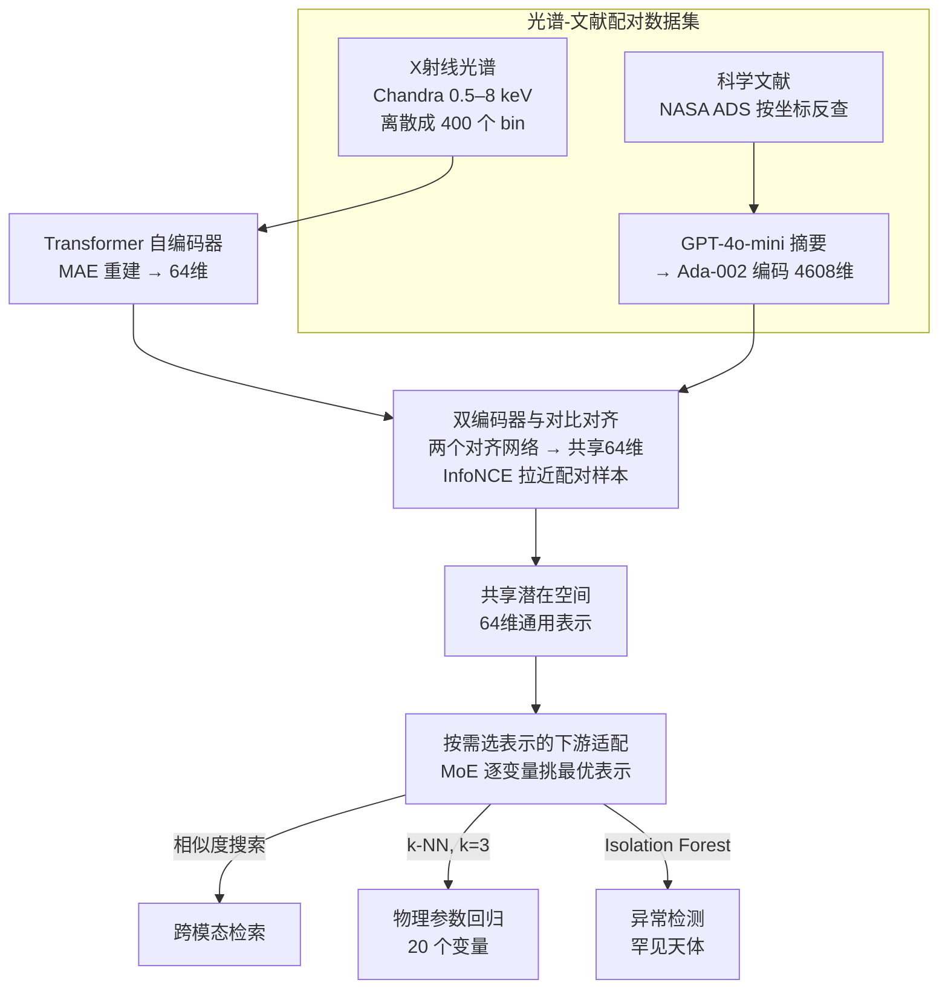

# Augmenting Representations with Scientific Papers

**会议**: ICLR 2026  
**arXiv**: [2603.04516](https://arxiv.org/abs/2603.04516)  
**代码**: 无  
**领域**: 物理/科学计算  
**关键词**: 对比学习, 多模态表示, X射线光谱, 科学文献, 基础模型, 异常检测, 天文学  

## 一句话总结

提出首个将 X 射线光谱与科学文献通过对比学习对齐的多模态基础模型框架，在共享潜在空间中实现 20% Recall@1% 的跨模态检索，物理参数估计提升 16–18%，同时发现候选脉动超亮 X 射线源等罕见天体。

## 研究背景与动机

**天文数据的多模态特性**：单个天体可能同时拥有图像、光谱、光变曲线以及数十年的科学文献描述，每种模态捕获互补的物理信息。

**海量数据与可扩展性需求**：即将上线的 Vera Rubin 天文台、Roman 太空望远镜将产生 PB 级多模态数据，需要可扩展方法来提取科学洞察。

**文献知识未被系统整合**：虽然已有天文单模态和多模态基础模型，但将观测数据与科学文献文本系统性整合仍未被探索。

**科学文献蕴含高质量知识**：论文包含同行评审的专家解读、物理模型和上下文信息，是原始观测数据无法提供的宝贵资源。

**跨领域通用性**：该框架不限于天文，任何具有观测序列和文本标注配对的领域（地震学、气候科学、医学）都可适用。

## 方法详解

### 整体框架

这篇论文要解决的是：天文领域里同一个天体既有标准化的 X 射线光谱，又有数十年积累的论文描述，但这两类信息几乎从不被系统性地放到一起用。作者的思路是把"科学文献"当成观测数据的一种"软标注"，用对比学习把光谱和文献摘要对齐进同一个表示空间。

整条流水线分三段走。第一段是配对数据集构建：从 Chandra Source Catalog 取光谱，通过 NASA ADS 反查同一天体的相关论文，凑出成对的"光谱-文献"样本。第二段是对齐：光谱和文本各自先用现成编码器压成单模态向量，再经两个对齐网络投影到共享的 64 维潜在空间，用 InfoNCE 把配对样本在该空间里拉近、非配对推远。第三段是下游适配：对齐后的共享空间不绑定某个具体任务，而是按需为跨模态检索、物理参数回归、异常检测三类评估挑最合适的表示来用。

### 关键设计

**1. 光谱-文献配对数据集：用文献当观测数据的"软标注"**

整个框架能成立的前提，是拿到大规模"光谱-文本"配对样本，而光谱本身没有现成的语义标签。作者注意到天文领域恰好同时存在标准化光谱目录和数十年论文积累，于是用文献摘要充当光谱的监督信号。具体做法是：X 射线光谱取自 Chandra Source Catalog，把 0.5–8 keV 能段离散成 400 个 bin、每个 bin 记录光子计数率并做 min-max 归一化（保留谱形这一物理特征）；文献侧通过 NASA ADS 用天空坐标和 SIMBAD 源标识符反查同一天体的相关论文，由 GPT-4o-mini 生成摘要后用 OpenAI Ada-002 编码成 4,608 维嵌入。最终得到 11,447 个光谱-文本对，按训练 69% / 校准 1% / 验证 15% / 测试 15% 划分，每个样本还关联最多 20 个物理变量作为后续回归评估的 ground truth。这样用现成的同行评审文献当监督信号，绕开了人工逐条标注光谱的高昂成本。

**2. 双编码器与对比对齐：把异构维度压到同一空间**

光谱和文本的原始维度差异极大（64 维 vs 4,608 维）、语义也不在一个层面，直接比对无从下手，所以要先各自降维、再投影到同一空间对齐。光谱端是一个基于 Transformer 的自编码器，以 MAE 重建损失把光谱压成 64 维潜在向量；文本端直接复用 Ada-002 的 4,608 维嵌入。随后两个全连接对齐网络分别把 64 维光谱和 4,608 维文本映射到共享的 64 维空间，并在该空间上优化 InfoNCE 损失：

$$\mathcal{L}_{\text{InfoNCE}} = -\frac{1}{N}\sum_{i=1}^{N}\log\frac{\exp(\text{sim}(t_i, d_i)/\tau)}{\sum_{j=1}^{N}\exp(\text{sim}(t_i, d_j)/\tau)}$$

其中 $\text{sim}$ 为余弦相似度，$\tau$ 为温度参数（在校准集上调）。这一步把对齐目标显式写成"配对样本的相似度要高于该 batch 内所有非配对样本"。值得注意的是，对齐后的潜在维度还涌现出对物理变量更强的相关性（对齐前光谱平均 $|\rho|=0.43$，对齐后组合达 $0.55$）——这是 InfoNCE 损失里并没有显式约束的副产物。

**3. 按需选表示的下游适配：让同一表示服务不同任务**

对齐空间要同时服务检索、回归、发现三类任务，而不同物理变量对模态的依赖并不一致，所以下游不固定一种融合方式，而是按任务和变量自适应地选表示。跨模态检索直接在共享空间用相似度搜索，给定光谱即可召回对应的文献描述。物理参数回归用 $k$-NN（$k=3$）从潜在表示预测 20 个变量，并采用混合专家（Mixture of Experts, MoE）策略：为每个变量在"对齐前/后 × 光谱/文本/两者"这些候选表示里，按验证集 Pearson 相关系数挑最优的那一个——例如时间变异性指标因光谱本身不含时间信息、对齐时还会丢失，反而文本单独表现更好。异常检测则在对齐后的潜在空间上跑 Isolation Forest 识别稀有天体。这种按需选表示的做法比固定多模态融合更灵活，也让单一对齐空间能一并支撑检索、回归和发现三类目标。

### 损失函数 / 训练策略

整体用 Adam 优化，并对关键超参做网格搜索：学习率 $10^{-4}$ 到 $10^{-3}$、共享空间维度 16–128、dropout 0.1–0.5、隐藏维度 16–1024。评估指标覆盖检索的 Recall@k% 与 Median Rank、回归的 MAE，以及衡量潜在空间-物理变量关系的 Pearson 相关系数。

## 实验关键数据

### 跨模态检索

| 指标 | 数值 |
|------|------|
| Recall@1% | ≈20% |
| Recall@5% | ≈50% |
| Median Rank | 84 / 1,719 |

> 中位距离 84 意味着仅需探索约 5% 的搜索空间即可找到正确匹配。

### 物理参数估计（表3 精选）

| 变量 | 对齐前最佳 MAE | MoE MAE | 提升 |
|------|---------------|---------|------|
| hard_hs | 0.20 | 0.12 | 40% |
| powlaw_gamma | 0.65 | 0.41 | 36% |
| powlaw_nh | 33.08 | 21.63 | 35% |
| brems_nh | 23.31 | 14.12 | 39% |
| flux_significance_b | 7.36 | 4.54 | 38% |
| **平均** | — | — | **16–18%** |

- 硬度比 (hard_hs, hard_ms, hard_hm) 平均提升 34%。
- 氢柱密度 ($N_H$) 跨光谱模型平均提升 34%。
- 时间变异性指标中，文本单独表现更优，因为光谱本身不含时间信息。

### 潜在空间物理可解释性

| 潜在维度 | 物理变量 | Pearson 相关系数 |
|---------|---------|----------------|
| $L_{12}$ | hard_hs | 0.82 |
| $L_{48}$ | apec_kt | 0.74 |
| $L_8$ | powlaw_gamma | 0.68 |
| $L_{62}$ | bb_kt | 0.68 |

- 对齐前光谱平均 $|\rho| = 0.43$，文本平均 $|\rho| = 0.30$；对齐后组合平均 $|\rho| = 0.55$，提升显著。
- 97% 数据压缩（4,672 → 128 维）同时保留预测能力，对十亿级巡天至关重要。

### 异常检测

- 类星体 (QSOs) 的中位异常分数高于典型 AGN，反映其极端光度。
- 超亮 X 射线源 (ULXs) 方差大，与含脉动/非脉动子群一致。
- Top 1% 异常包括引力透镜系统 2CXOJ224030.2+032131 和候选脉动 ULX 2CXOJ004722.6-252050，后者被独立研究验证为候选 PULX。

## 亮点与洞察

- **首个光谱-文献对齐框架**：将科学文献作为一种模态系统性整合到天文观测基础模型中，开辟了"知识增强表示学习"新范式。
- **对比学习的新兴属性**：对齐过程不仅实现了检索，还使潜在空间涌现出对物理变量的更强相关性——这是训练中未显式强制的。
- **MoE 策略的优越性**：在单模态、共享表示之间为每个变量自适应选择最优表示，比固定多模态融合更灵活。
- **跨领域蓝图**：框架可直接推广到地震学（波形+事件报告）、气候科学（时序+评估文档）、医学（生理信号+临床笔记）等领域。
- **科学发现能力**：通过异常检测独立发现了后续被确认的候选天体，验证了方法的科学发现潜力。

## 局限性

1. **检索性能有提升空间**：20% Recall@1% 表明尚未充分对齐，可通过改进文本摘要和增加数据对来缓解。
2. **模态信息不对称**：科学文献涵盖的物理上下文远比单一光谱丰富，天然存在对齐失配。
3. **仅覆盖检索和回归**：尚未验证在文本生成等生成式任务上的有效性。
4. **异常检测缺乏物理先验**：纯统计异常可能包含伪影，引入物理约束可帮助优先标记科学有意义的异常值。
5. **仅在天文数据上验证**：虽然声称跨领域通用，但实际实验仅限于 X 射线天文观测。

## 相关工作与启发

- **AstroCLIP (Lanusse et al.)**：天文多模态基础模型，但未整合文本/文献模态。
- **CLIP (Radford et al., 2021)**：图文对比学习的经典方法，本文将其思想迁移到科学观测-文献对齐。
- **NASA ADS**：提供了交叉引用基础设施，使大规模光谱-文献配对成为可能。
- **启发**：科学文献是最容易获取且信息密度最高的"监督信号"之一，将其作为对比学习的锚点模态，可低成本增强各类观测数据的表示能力。

## 评分

| 维度 | 分数 (1-5) | 说明 |
|------|-----------|------|
| 新颖性 | 4 | 首次将科学文献作为模态与观测数据对齐，开辟新方向 |
| 技术深度 | 3 | 方法相对直接（对比学习 + kNN），但数据构建和评估设计完整 |
| 实验充分性 | 3 | 20 个物理变量全面评估，但仅单一数据集和领域 |
| 写作质量 | 4 | 结构清晰，跨领域愿景描述有启发性 |
| 实用价值 | 4 | 框架通用性强，数据已公开，对大规模巡天有实际意义 |
| **总分** | **3.6** | 方向开拓性强的工作，方法简洁但有效，跨领域推广是核心潜力 |

<!-- RELATED:START -->

## 相关论文

- [\[ICML 2026\] TriForces: Augmenting Atomistic GNNs for Transferable Representations](../../ICML2026/physics/triforces_augmenting_atomistic_gnns_for_transferable_representations.md)
- [\[AAAI 2026\] Learning Fair Representations with Kolmogorov-Arnold Networks](../../AAAI2026/physics/learning_fair_representations_with_kolmogorov-arnold_networks.md)
- [\[ICML 2026\] Quiver: Quantum-Informed Views for Enhanced Representations in Large ML Models](../../ICML2026/physics/quiver_quantum-informed_views_for_enhanced_representations_in_large_ml_models.md)
- [\[AAAI 2026\] Scientific Knowledge-Guided Machine Learning for Vessel Power Prediction: A Comparative Study](../../AAAI2026/physics/scientific_knowledge-guided_machine_learning_for_vessel_power_prediction_a_compa.md)
- [\[ICML 2025\] OmniArch: Building Foundation Model For Scientific Computing](../../ICML2025/physics/omniarch_building_foundation_model_for_scientific_computing.md)

<!-- RELATED:END -->
