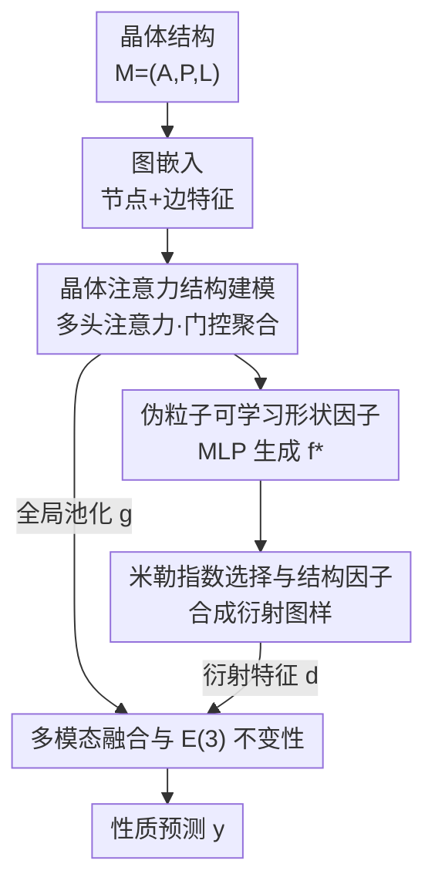

# Beyond Structure: Invariant Crystal Property Prediction with Pseudo-Particle Ray Diffraction

**会议**: ICLR2026  
**OpenReview**: [https://openreview.net/forum?id=OfmurJrzlT](https://openreview.net/forum?id=OfmurJrzlT)  
**代码**: https://github.com/Bin-Cao/PRDNet  
**领域**: 应用于物理科学 / 晶体性质预测 / 材料信息学  
**关键词**: 晶体性质预测, 倒易空间, 衍射表征, 伪粒子, 多模态融合

## 一句话总结
PRDNet 在传统图神经网络之外，引入一个**可学习的"伪粒子"**去模拟晶体衍射，用神经网络生成的形状因子（form factor）合成倒易空间的衍射图样，把图表示（短程）与衍射表示（长程）做模态级融合，同时严格满足晶体学对称不变性，在 Materials Project、JARVIS-DFT、MatBench 三大基准上刷新 SOTA。

## 研究背景与动机
**领域现状**：晶体性质（形成能、带隙、模量等）本质由量子力学方程决定，精确解（DFT）对大体系算不动，于是机器学习成了 DFT 的"廉价替身"。这类模型的精度高度依赖**原子系统怎么表示**，目前主流是把晶体当作图、做消息传递的图神经网络（CGCNN、MEGNet、Matformer、eComFormer、Crystalformer 等），近年又叠加键角、周期向量、等变/不变约束，越做越精细。

**现有痛点**：晶体在原理上是**无限的三维周期体系**，而真实空间编码器的感受野有限、又是局部编码，难以刻画**长程原子相互作用**。这导致一个致命问题——**不同的晶体被映射到同一个表示**（论文 Figure 2 给了多边图、键角嵌入、周期向量三类方法各自"撞表示"的反例）。表示一旦退化，下游性质预测必然出错。

**核心矛盾**：长程相互作用要么靠 DFT 那样的超胞/边界条件去硬算（贵），要么在真实空间里强行扩大感受野（仍然有限、且破坏对称不变性）。真实空间这条路天然受感受野的约束。

**切入角度**：换到**倒易空间（衍射空间）**。因为晶体有周期性，**完整的衍射图样可以从单个真实空间原胞解析推导出来**，无需构造大超胞——这天然紧凑又能编码长程信息。每个原子都沿特定晶面对衍射有贡献，理想衍射表示能无损嵌入完整的真实空间信息（Figure 1、Figure 3 用光衍射做类比说明倒易空间如何编码长程相互作用）。

**为什么现有衍射类方法不够**：EwaldMP、PotNet、ReGNet(ReciNet) 这些工作虽然引入了 Ewald 求和/傅里叶变换，但把它当成"傅里叶式信息融合"塞进逐层消息传递，**忽略了形状因子（form factor）本应是由结构和探针唯一决定、不随层间聚合传播的物理量**。而且传统 X 射线衍射用的是查表得到的**固定形状因子**，只依赖散射矢量 $|Q|$ 和原子种类，无法区分同一元素处在不同局部化学环境的原子——而这恰恰决定材料性质。

**核心 idea**：用一个**数据驱动的"伪粒子"**当探针替代真实的 X 射线/电子/中子。它的形状因子由神经网络学习，显式依赖局部化学环境，对元素和环境变化更敏感；据此合成衍射图样，并把它作为**模态**（而非原子级特征）与图表示融合，同时保证对晶体学对称（旋转/反射/平移，E(3) 群）的完全不变性。

## 方法详解

### 整体框架
PRDNet 要解决的是"图表示抓不住长程、且会把不同晶体撞成同一表示"的问题。它的做法是**双模态**：一条路用图注意力建模短程原子环境，另一条路用伪粒子衍射建模长程周期信息，最后在模态层融合做性质预测。

具体流转是：晶体 $M=(A,P,L)$ 先转成图并做嵌入，经过若干层**晶体注意力（crystal attention）**消息传递得到节点表示 $h_i^{(L)}$；这些节点表示一方面被全局池化成短程特征 $g$，另一方面送进一个**形状因子层** $\mathrm{MLP_{form}}$，为每个原子生成依赖局部环境的**可学习形状因子** $f_i^*$；再按一组系统选取的**米勒指数** $\mathcal{H}$ 计算**结构因子**，得到衍射特征张量 $F_{\mathrm{concat}}$，映射为长程特征 $d$；最后把 $g$ 和 $d$ 拼接融合 $z_{\mathrm{fused}}$，输出性质 $y$。整条链路被证明对 E(3) 群不变。

### 关键设计

**1. 晶体注意力结构建模：在图侧用多头注意力+门控抓短程环境**

这是双模态里的"真实空间"分支，负责把每个原子的**局部化学环境**编码进节点表示，为后面生成依赖环境的形状因子打底。晶体转成图 $G=(V,E)$，节点是原子的 one-hot 嵌入 $h_i^{(0)}$，边特征拼接了径向基、球面基（含键角 $\theta_{ijk}$）和距离：$e_{ij}=\mathrm{RBF}(d_{ij})\oplus\mathrm{SBF}(\theta_{ijk})\oplus d_{ij}$。消息传递层在常规图注意力上做了两点增强：一是把边特征 $E_{ij}^{(h)}$ 一起投影进 query/key/value，注意力分数 $\alpha_{ij}^{(h)}=\frac{q_{ij}^{(h)}\odot k_{ij}^{(h)}}{\sqrt{3d_h}}$ 显式吃进边信息；二是**门控聚合**，用 $g_{ij}^{(h)}=\sigma(\mathrm{LayerNorm}(\alpha_{ij}^{(h)}))$ 当自适应滤波器调制每条消息 $m_{ij}^{(h)}=W_{\mathrm{msg}}v_{ij}^{(h)}\odot g_{ij}^{(h)}$，再带残差更新 $h_i^{(l+1)}=\beta_i\odot h_i^{(l)}+(1-\beta_i)\odot\mathrm{SiLU}(\mathrm{BN}(W_{\mathrm{concat}}m_i^{\mathrm{agg}}))$。消融里"单头""去残差""去边特征"都会明显掉点，说明这三件套是结构建模的有效组件。

**2. 伪粒子可学习形状因子：把"查表固定"的形状因子换成"依赖环境可学习"**

这是全文最核心的创新，直接针对"同元素不同环境的原子被混淆"这个痛点。传统 X 射线的形状因子是查《国际晶体学表》得到的固定值，只依赖散射矢量大小和原子种类：$f_i^{\text{X-ray}}=f_i^{\text{X-ray}}(|Q|,\,f_i^{\text{type}})$，所以对给定 $Q$ 完全分不开处于不同局部环境的同种原子。PRDNet 设计一个不受真实粒子物理定律约束的**伪粒子**，把形状因子扩展为
$$f_i^{\text{Pseudo}}=f_i^{\text{Pseudo}}\big(|Q|,\,G_\theta(\mathcal{G}),\,f_i^{\text{type}}\big),$$
其中 $G_\theta(\mathcal{G})$ 正是上一步图网络学到的**局部化学环境编码**。实现上由专门的形状因子层把最终节点表示映射成各个 $(h,k,l)$ 方向的散射强度：$f_i^*(H)=\mathrm{MLP_{form}}(h_i^{(L)})\in\mathbb{R}^{N_{hkl}}$。关键在于它把形状因子物理上该有的三重依赖（原子种类、局部环境、衍射矢量）**一个都不少地保留**，而 EwaldMP 忽略了 $G_\theta(\mathcal{G})$、PotNet 连 $G_\theta(\mathcal{G})$ 和 $|Q|$ 都忽略、ReGNet 也没考虑这两者的依赖——这正是它们倒易表示不自洽的根源。

**3. 米勒指数选择与结构因子计算：系统覆盖倒易空间并合成衍射图样**

有了形状因子，还要选"在哪些方向衍射"并把它们累加成衍射图样。每个米勒指数三元组 $(h,k,l)$ 对应一条晶面方向、一个唯一散射矢量 $Q$。论文先取
$$\mathcal{H}_0=\{(h,k,l)\in\mathbb{Z}^3:|h|,|k|,|l|\le C_{\max},\ \gcd(|h|,|k|,|l|)=1\},$$
用 $\gcd=1$ 滤掉冗余的高阶反射、只保留基本反射，$C_{\max}=8$ 控制倒易空间分辨率；再对全排列加正负号取闭包 $\mathcal{H}=\{\pm\mathrm{perm}(h,k,l)\}$，**保证指数集对所有晶体学操作封闭**（这是后面不变性证明的前提）。然后对每个指数累加结构因子的实部、虚部：
$$\mathrm{Re}(F_{hkl})=\sum_{i=1}^N f_i^*\cos(2\pi\,\mathbf{h}\cdot r_i^T),\quad \mathrm{Im}(F_{hkl})=\sum_{i=1}^N f_i^*\sin(2\pi\,\mathbf{h}\cdot r_i^T),$$
其中 $r_i$ 是原子 $i$ 的分数坐标。把实虚部展平拼成衍射特征张量 $F_{\mathrm{concat}}=\mathrm{flatten}(\mathrm{Re}\oplus\mathrm{Im})\in\mathbb{R}^{2N_{hkl}}$，这就是单个原胞解析得到的、紧凑且无需超胞的长程描述。

**4. 多模态融合与 E(3) 不变性：模态级融合，且全程对称不变**

论文反复强调衍射是**整个结构的全局属性**，必须在**模态层**融合，而不是当成原子级特征去拼。融合用 $g=\mathrm{GlobalPool}(\{h_i^{(L)}\})$、$d=\mathrm{MLP_{diff}}(F_{\mathrm{concat}})$、$z_{\mathrm{fused}}=\mathrm{MLP_{fusion}}([g\oplus d])$ 三步。不变性方面：晶体学操作 $g:r\mapsto R_g r+t_g$（$R_g$ 是整数幺模矩阵，$\det R_g=\pm1$）作用下，坐标和米勒指数同步变换，结构因子只多出一个相位 $\phi(g,h)=(R_g h)\cdot t_g$，
$$F_{g\cdot h}(\{g\cdot r_i\})=e^{2\pi i\,\phi(g,h)}F_h(\{r_i\}),$$
而 $\phi(g,h)$ 恒为整数，故 $e^{2\pi i\phi}=1$，衍射表示天然不变。再加上 $g$ 依赖的几何量 $d_{ij},\theta_{ijk}$ 在 E(3) 下不变，最终 $z_{\mathrm{fused}}$ 对旋转、反射、平移**完全不变**。这相比前作只满足"基本"不变性、却仍可能撞表示，是一个更彻底的保证。

### 损失函数 / 训练策略
回归任务用 MAE、分类任务用准确率评估；基于 PyTorch 实现，在 RTX 3090 上训练，所有对比基线均沿用原开源设置不额外调参。PRDNet 参数量约 20.9M（明显大于多数基线）。

## 实验关键数据

### 主实验
在 Materials Project（122,959 条）上，PRDNet 在多数任务取得最低误差与最高分类准确率：

| 数据集/任务 | 指标 | PRDNet | 之前最好基线 |
|--------|------|------|----------|
| MP 形成能 | MAE eV/atom ↓ | **0.028** | 0.030 (Crystalframer) |
| MP 带隙 | MAE eV ↓ | **0.151** | 0.153 (eComFormer) |
| MP 体模量 | MAE log(GPa) ↓ | **0.035** | 0.047 (Crystalframer) |
| MP 剪切模量 | MAE log(GPa) ↓ | **0.108** | 0.111 (GATGNN) |
| MP 杨氏模量 | MAE log(GPa) ↓ | **0.104** | 0.106 (Crystalframer) |
| MP 金属/非金属 | Acc% ↑ | **93.3** | 92.7 (Matformer) |

在 JARVIS-DFT 与 MatBench 上同样全面领先或持平，例如 JARVIS 形成能 0.032、带隙(OPT) 0.140、总能量 0.032、带隙(MBJ) 0.267；MatBench 形成能 0.019、剪切模量 0.058、折射率 0.242，均为最优。

### 消融实验（Materials Project）

| 配置 | 形成能 | 带隙 | 体模量 | 金属分类Acc | 说明 |
|------|---------|------|------|------|------|
| Default | 0.028 | 0.151 | 0.035 | 93.3 | 完整模型 |
| NoDiff | 0.041 | 0.361 | 0.081 | 81.9 | 去掉衍射模块，全面大幅掉点 |
| SingleHead | 0.040 | 0.318 | 0.067 | 89.3 | 单头注意力 |
| NoRes | 0.038 | 0.297 | 0.077 | 82.7 | 去残差连接 |
| NoEdge | 0.043 | 0.355 | 0.071 | 80.1 | 去边特征 |

### 关键发现
- **衍射模块贡献最大**：去掉它（NoDiff）带隙从 0.151 飙到 0.361、分类从 93.3% 跌到 81.9%，印证"长程衍射表示"是性能主来源。
- 多头注意力、残差、边特征三者各自去掉都会掉点，说明短程结构分支也是必要的组件，而非可有可无的陪衬。
- 论文还做了一个有意思的扩展（Table 4）：把衍射模块**接到其它基线**（CGCNN、SchNet、Matformer 等）上，多数任务都能带来提升（标 ↓ 表示误差下降），说明伪粒子衍射是一个可移植的增强模块，而不只对自家结构有效。

## 亮点与洞察
- **把"固定查表的形状因子"变成"可学习、依赖局部环境的伪粒子形状因子"**，这是最让人"啊哈"的一步：它用一个虚构探针绕开了真实粒子（X 射线/电子/中子）的物理局限，让同元素不同环境的原子也能被区分开。
- **从真实空间转战倒易空间**抓长程：利用晶体周期性"单原胞即可解析出完整衍射"的特性，避免构造大超胞，紧凑又无损，是一个很物理的角度。
- **不变性证明很干净**：靠米勒指数集对称封闭 + 结构因子相位恒为整数倍 $2\pi$，直接得到 E(3) 不变，而不是靠数据增强硬学。
- **衍射模块可即插即用**地增强其它 GNN，复用价值高——这套"先学环境敏感的形状因子、再合成结构因子做模态融合"的范式，可迁移到任何需要长程周期信息的材料/晶体任务。

## 局限与展望
- **参数量偏大**：PRDNet 约 20.9M，远高于不少 <1M 的轻量基线，性价比/部署成本在论文里未充分讨论。
- $C_{\max}=8$ 的米勒指数截断是个**硬超参**，决定倒易空间分辨率与衍射特征维度 $N_{hkl}$，对不同体系是否需要重调、对精度-成本如何权衡，正文交代有限（细节在附录）。
- 对比中的 ReGNet(ReciNet) 因官方代码不可得而由作者自行复现（隐藏维度从 256 调到 304 以对齐参数量），该基线数字应带一点 caveat 看待。
- 伪粒子缺乏直接的物理可解释性——它强于判别，但"学到的形状因子对应什么物理量"还需更多分析（论文给了 CaF₂ 的案例研究在附录）。

## 相关工作与启发
- **vs 多边图 / 键角 / 周期向量类（CGCNN、ALIGNN、Matformer、Crystalformer 等）**：它们都在真实空间里加结构信息，但受有限感受野与局部编码所限，仍会把不同晶体撞成同一表示；PRDNet 改到倒易空间，用衍射的全局性从原理上保证表示唯一。
- **vs 倒易空间/长程类（EwaldMP、PotNet、ReGNet）**：前者把 Ewald 求和/傅里叶当成逐层"信息融合"，且简化或丢掉了形状因子的物理依赖（环境 $G_\theta$、$|Q|$）；PRDNet 把形状因子当成由结构和探针唯一决定的不变量、在模态层一次性融合，三重依赖一个不少，因而表示更自洽、精度更高。

## 评分
- 新颖性: ⭐⭐⭐⭐⭐ 用可学习伪粒子+倒易空间衍射做晶体表示，角度独到且物理动机扎实
- 实验充分度: ⭐⭐⭐⭐⭐ 三大基准多任务、系统消融、还验证衍射模块可移植增强其它基线
- 写作质量: ⭐⭐⭐⭐ 物理铺垫与公式完整，但部分关键超参与可解释性放在附录、正文略紧
- 价值: ⭐⭐⭐⭐⭐ 刷新 SOTA 且提供一个可复用的"形状因子→结构因子→模态融合"范式

<!-- RELATED:START -->

## 相关论文

- [\[ICLR 2026\] OXtal: An All-Atom Diffusion Model for Organic Crystal Structure Prediction](oxtal_an_all-atom_diffusion_model_for_organic_crystal_structure_prediction.md)
- [\[ICLR 2026\] MoMa: A Simple Modular Learning Framework for Material Property Prediction](moma_a_simple_modular_learning_framework_for_material_property_prediction.md)
- [\[ICLR 2026\] Advancing Universal Deep Learning for Electronic-Structure Hamiltonian Prediction of Materials](advancing_universal_deep_learning_for_electronic-structure_hamiltonian_predictio.md)
- [\[ICLR 2026\] FM4NPP: A Scaling Foundation Model for Nuclear and Particle Physics](fm4npp_a_scaling_foundation_model_for_nuclear_and_particle_physics.md)
- [\[ICLR 2026\] Learning from the Electronic Structure of Molecules across the Periodic Table](learning_from_the_electronic_structure_of_molecules_across_the_periodic_table.md)

<!-- RELATED:END -->
