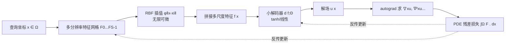

# $\partial^\infty$-Grid: A Neural Differential Equation Solver with Differentiable Feature Grids

**会议**: ICLR 2026  
**OpenReview**: [https://openreview.net/forum?id=7G0L4cj452](https://openreview.net/forum?id=7G0L4cj452)  
**代码/项目页**: [https://4dqv.mpi-inf.mpg.de/DInf-Grid/](https://4dqv.mpi-inf.mpg.de/DInf-Grid/)  
**领域**: 物理信息机器学习 / 神经场 / PDE 求解  
**关键词**: 神经微分方程求解器, 特征网格, 径向基函数插值, 高阶可微, 多分辨率网格, PINN  

## 一句话总结
用无限可微的径向基函数（RBF）插值替换特征网格里常用的线性插值，让原本只为"拟合信号"设计的快速网格表示第一次能稳定地算出高阶导数，从而把求解 Poisson/Helmholtz/Kirchhoff-Love 等微分方程的训练时间从几小时压到几秒到几分钟（5–20× 加速），精度还与 Siren 相当。

## 研究背景与动机
**领域现状**：用神经网络替代传统数值求解器去解微分方程（PDE）已成为物理信息机器学习的主流，代表作是基于坐标 MLP 的 PINN 和正弦激活的 Siren。Siren 因为无限可微、能拟合高频信号，成了求解物理场的首选表示。

**现有痛点**：坐标 MLP 类方法（包括 Siren）对每个采样点都要反向传播经过整个网络，且完全忽略物理场的空间结构，导致训练极慢，有时需要数小时。视觉/图形领域为了加速早就转向了网格类表示（Instant-NGP、K-Planes），它们利用空间局部性，只更新查询点附近的少量特征，训练快上一个数量级。

**核心矛盾**：但这些快速网格表示依赖 **d-线性插值**——它在网格节点处只有 $C^0$ 连续（不可导），网格内部也只到 $C^1$。一阶导在节点处不连续、二阶导处处为零（$\nabla^2_x u = 0$），ReLU 同理。这意味着它们根本算不出求解 PDE 所必需的雅可比和拉普拉斯量，从架构上就无法用作 DE 求解器。于是研究者被迫在"慢但能解 PDE 的 MLP"和"快但解不了 PDE 的网格"之间二选一。

**本文目标**：造一个既有特征网格的训练效率、又支持任意高阶导数的表示，用 PDE 残差作损失直接隐式训练，精确建模物理场。

**核心 idea**：**用径向基函数插值替换线性插值**。RBF（高斯核）在整个邻域上光滑且无限可微（$C^\infty$），导数可由自动微分解析计算；再叠加**多分辨率共址网格**让全局梯度快速传播以捕捉高频。这样网格表示首次具备了求解 DE 的高阶可微性。

## 方法详解

### 整体框架
$\partial^\infty$-Grid 是一个"编码-解码"框架：把输入域 $\Omega\subset\mathbb{R}^d$（$d=2,3$）离散成多分辨率特征网格 $\{F_s\}$，对查询坐标 $x$ 用 RBF 插值从各尺度网格抽取光滑特征 $f(x)$，拼接后送入小解码器 $d(\cdot;\Theta)$ 得到解场 $u(x)=d(f(x;F);\Theta)$。训练时不直接监督 $u$，而是把控制方程 $F(x,u,\nabla_x u,\nabla^2_x u,\dots)=0$ 的残差当损失，对 $x$ 自动微分算出各阶导数后优化网格 $F$ 与解码器 $\Theta$。

### 关键设计

**1. 特征网格 + PDE 残差损失：把"解方程"变成"局部更新网格"** 与坐标 MLP 每个采样点都得反传整个网络不同，本文把场参数化为 $u(x)=d(f(x;F);\Theta)$，其中特征 $f(x)=\sum_{i\in\mathcal{N}(x)} w(x,x_i)F(x_i)$ 只由查询点周围若干网格节点的可学习特征加权得到，因此一次反传只更新邻域里那一小撮参数，天然利用了空间局部性、训练大幅加速。损失则直接写成 PDE 残差在域上的积分 $L(F,\Theta)=\int_\Omega F(x,u,\nabla_x u,\nabla^2_x u,\dots;g(x))\,dx$，实际用域内分层随机采样近似。该形式同时容纳强形式（Poisson）、带边界的变分形式（布料）与数据驱动项（SDF）。边界条件以硬约束注入：$u(x)=d(f(x;F);\Theta)\,B(x)+h(x)\,(1-B(x))$，其中 $B(x)=1-e^{-\|x-x_{\partial\Omega}\|^2/\sigma}$ 是距离加权函数，保证 $x\in\partial\Omega$ 时 $u(x)=h(x)$，从而提升收敛性与解的唯一性。

**2. 径向基函数插值：用 $C^\infty$ 权重换来高阶可微** 这是全文最关键的一刀。线性插值权重 $w(x,x_i)=\prod_{k=1}^d (1-|x_k-x_{ik}|/\sigma)$ 只到 $C^0/C^1$，二阶以上导数全为零，求不了 PDE。本文改用归一化高斯 RBF 权重 $w(x,x_i)=\frac{\phi(\|x-x_i\|)}{\sum_{j\in\mathcal{N}(x)}\phi(\|x-x_j\|)}$，核为 $\phi(r)=e^{-(\varepsilon r)^2}$，其中 $\varepsilon$ 控制核宽。它在邻域上光滑且无限可微，雅可比、拉普拉斯都能由 autograd 解析得到，从而支持四阶 PDE（如 Euler–Bernoulli 梁、Kirchhoff–Love 板）这种连三次基都不够的强形式。$\varepsilon$ 还提供了固定阶多项式做不到的"局部性 vs 精度"可调支撑。代价是高斯 RBF 全局支撑，朴素实现要遍历整张网格，内存与算力爆炸；为此本文配合分层采样**预计算邻域索引**：由 $\varepsilon$ 决定权重非零的有效邻域 $\mathcal{N}_\rho(x)$（如 $\varepsilon=2$ 只需 1-环，$\varepsilon=1$ 需 2-环），并因采样点可能落在格子边界处额外多取一环，使 RBF 的开销逼近线性插值。

**3. 多分辨率共址网格：让全局梯度跑得动** 单分辨率网格的插值邻域很小，梯度信息要在大网格上一步步爬过整个域，收敛极慢。借鉴 Instant-NGP/K-Planes 的层级思路，本文设一组多尺度网格 $F_s\in\mathbb{R}^{(N+1)^d\times F}$，第 $s$ 级分辨率 $N=N_{\max}/2^s$，各尺度 RBF 插值结果拼成 $f(x)=(f_0(x),\dots,f_{S-1}(x))\in\mathbb{R}^{S\cdot F}$。粗尺度负责把梯度迅速铺满全域、保证全局梯度流稳定，细尺度补高频细节，两者组合既高效又富表达力，无需自适应调整 RBF 形状就能稳定恢复复杂信号。

## 实验关键数据
覆盖 Poisson（图像重建）、Helmholtz（波场）、Kirchhoff-Love（布料仿真）、Eikonal（SDF）、平流/热方程等多类问题。

### 主实验表格
图像重建（Poisson，512×512，仅用梯度/拉普拉斯监督）：

| 模型 | 监督 | PSNR ↑ | 训练时间 ↓ | 参数量 |
|------|------|--------|-----------|--------|
| K-Planes | 梯度 | 17.96 | 9.5 min | 8.4m |
| K-Planes | 拉普拉斯 | —（失败） | — | — |
| Siren | 梯度 | 32.12 | 10 min | 330k |
| Siren | 拉普拉斯 | 11.82 | **1h56min** | 1.32m |
| **Ours** | 梯度 | **32.24** | **25s** | 703k |
| **Ours** | 拉普拉斯 | **12.19** | **15 min** | 701k |

梯度监督下相对 Siren 约 **20× 加速**且 PSNR 略高；线性插值的 K-Planes 在拉普拉斯监督下直接失败（二阶导为零）。Helmholtz（$\omega=20$ 点源波场）相对 Siren 约 **4× 加速**且精度匹配闭式 Hankel 解，而 K-Planes/Instant-NGP 完全失效。布料仿真因存在多个平衡解、无唯一参考，故不纳入数值精度评测但能恢复真实褶皱。

### 消融实验表格
RBF 形状 $\varepsilon$ 与邻域环数 $\rho$（768×768 梯度图像重建）：

| 形状 $\varepsilon$ | 环数 $\rho$ | PSNR ↑ | SSIM ↑ | 训练 ↓ |
|------|------|--------|--------|--------|
| 0.6 | 4 | 28.74 | 0.87 | 15 min |
| 1 | 4 | 28.74 | 0.87 | 17 min |
| 1 | 3 | 28.73 | 0.87 | 12 min |
| 1 | 2 | **28.82** | 0.86 | 12 min |
| 1 | 1 | 27.50 | 0.82 | 15 min |
| 2 | 1 | 17.72 | 0.74 | **6 min** |

### 关键发现
- **核宽是核心超参**：小 $\varepsilon$ + 大环更平滑准确但更贵；过窄核（$\varepsilon=2,\rho=1$）退化成线性插值，出现不连续伪影、PSNR 崩到 17.72。$\varepsilon=1$ 配 2–3 环是稳定甜点。
- **多分辨率的价值**：单分辨率网格让 Eikonal 损失局限在局部、产生伪影；多分辨率以极小参数开销实现全域梯度传播，PSNR 收敛显著更快。
- **可微性是分水岭**：所有线性插值/ReLU 网格（K-Planes、Instant-NGP）在二阶及以上监督任务上系统性失败，印证了 RBF 替换的必要性。

## 亮点与洞察
- **一个最小但精准的改动撬动整类问题**：把网格插值核从"线性"换成"$C^\infty$ 的 RBF"，看似一行公式，却恰好补上了快速网格表示通往 PDE 求解的唯一短板，思路干净、动机清晰。
- **效率与可微性不再二选一**：通过分层采样 + 邻域预计算，把本应全局支撑的高斯 RBF 压到接近线性插值的成本，同时保留无限可微，工程上的折中很关键。
- **统一接口**：同一个可微网格不改架构就能干"直接拟合信号"和"从导数/PDE 反解场"两类活（图像、SDF、波场、布料），泛化面广。

## 局限与展望
- **维度灾难**：网格本质上随维数指数膨胀，3D SDF 明显比 2D 慢；作者建议未来用平面投影策略缓解高维与流形上 PDE 的扩展性。
- **对 RBF 核宽敏感 + 平滑偏置**：$\varepsilon$ 选不好会引入过度平滑或伪影；且 RBF 在域边界存在 Runge 现象带来的边界误差。
- **缺理论保证**：邻域截断下虽实验均收敛，但 $C^\infty$ 的理论保证尚未建立。
- **未必胜过传统数值法**：相对多重网格等成熟数值求解器不一定更高效，作者坦言只是初步对比；当前为 PyTorch 实现，定制 CUDA 核有望进一步加速。

## 相关工作与启发
- **vs. Siren/PINN（坐标 MLP）**：本文继承其无限可微、能高频拟合的优点，但用局部网格替换全局 MLP 反传，换来 5–20× 加速。
- **vs. Instant-NGP / K-Planes（快速网格）**：继承其空间局部性带来的训练效率，但用 RBF 修复了线性插值高阶导为零的致命缺陷。
- **vs. NeuRBF**（最接近的工作）：同样把 RBF 引入特征网格，但 NeuRBF 面向"拟合已知目标信号"，需依赖真值信号做 RBF 初始化、且单环邻域导致跨格不连续；$\partial^\infty$-Grid 则在**只有导数监督、看不到目标场**的 PDE 设定下求解，设计目标根本不同。
- **启发**：当某类高效表示因某个不可微算子被挡在某类任务门外时，"替换插值/激活核以恢复可微性"是一条通用且廉价的破局路径，可迁移到其他需要高阶导监督的隐式表示场景。

## 评分
- **新颖性**: ⭐⭐⭐⭐ — 把 RBF 插值引入多分辨率特征网格以支持高阶可微、专为 PDE 求解服务，是清晰且此前缺失的一块拼图；与 NeuRBF 的目标区分讲得也充分。
- **实验充分度**: ⭐⭐⭐⭐ — 覆盖 Poisson/Helmholtz/Kirchhoff-Love/Eikonal/平流热方程多类 PDE，含 Siren、K-Planes、Instant-NGP、NeuRBF 多基线与核宽/多分辨率消融；但缺少 3D 高维与流形上的规模化验证。
- **写作质量**: ⭐⭐⭐⭐ — 动机—矛盾—方案链条干净，图 2 框架与公式表述清晰，痛点（线性插值二阶导为零）讲得直观。
- **价值**: ⭐⭐⭐⭐ — 把神经 DE 求解从小时级压到秒/分钟级且精度持平，对物理信息机器学习、图形仿真有实用价值，且代码以"即插即用"模型形式释出。

<!-- RELATED:START -->

## 相关论文

- [\[ICLR 2026\] Physics-Informed Inference Time Scaling for Solving High-Dimensional Partial Differential Equations via Defect Correction](physics-informed_inference_time_scaling_for_solving_high-dimensional_partial_dif.md)
- [\[ICLR 2026\] Disentangled Representation Learning for Parametric Partial Differential Equations](disentangled_representation_learning_for_parametric_partial_differential_equatio.md)
- [\[ICLR 2026\] OrthoSolver: A Neural Proper Orthogonal Decomposition Solver For PDEs](orthosolver_a_neural_proper_orthogonal_decomposition_solver_for_pdes.md)
- [\[ICLR 2026\] Neural Latent Arbitrary Lagrangian-Eulerian Grids for Fluid-Solid Interaction](neural_latent_arbitrary_lagrangian-eulerian_grids_for_fluid-solid_interaction.md)
- [\[AAAI 2026\] Towards a Foundation Model for Partial Differential Equations Across Physics Domains](../../AAAI2026/physics/towards_a_foundation_model_for_partial_differential_equations_across_physics_dom.md)

<!-- RELATED:END -->
