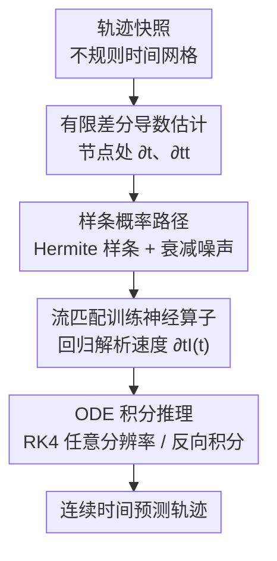

# CFO: Learning Continuous-Time PDE Dynamics via Flow-Matched Neural Operators

**会议**: ICLR2026  
**OpenReview**: [https://openreview.net/forum?id=IQhaeSzyup](https://openreview.net/forum?id=IQhaeSzyup)  
**代码**: https://github.com/shannon-hou/CFO_official  
**领域**: PDE 神经算子 / 科学计算  
**关键词**: 神经算子, 流匹配, 连续时间动力学, PDE 代理模型, 时间分辨率不变性

## 一句话总结
CFO 把生成模型里的流匹配「借」过来学时变 PDE 的右端项动力学——给轨迹拟一条样条、用有限差分估计样条在节点处的时间导数当作速度场标签，训练一个神经算子去回归这个解析速度，从而既不用像神经 ODE 那样反传穿过 ODE 求解器，又能在不规则时间网格上训练、在任意时间分辨率上推理，仅用 25% 不规则采样数据就把全数据自回归基线的相对误差最多降了 87%。

## 研究背景与动机
**领域现状**：用神经网络做时变 PDE 的代理求解器，主流是自回归（autoregressive, AR）方案——学一个「下一帧预测器」，从初始条件一步步往后滚。另一类是把时间当成额外空间坐标的时空方法，还有一类是连续时间的神经 ODE（Neural ODE）。

**现有痛点**：这三条路各有硬伤。AR 在长程 rollout 上误差会累积（exposure bias，自己预测喂给自己越滚越偏），而且必须要求**均匀的时间网格**，没法吃不规则采样的数据；时空方法随空间×时间体积膨胀、难以保证因果性；神经 ODE 虽然理论上优雅，但训练时要通过 adjoint 方法**反传穿过 ODE 求解器**，又慢又吃显存。

**核心矛盾**：连续时间建模（灵活、抗采样不规则）和计算可行性（训练快、不用反传求解器）之间存在拉扯——想要连续时间的好处，传统做法就得付出 ODE 求解器反传的代价。

**本文目标**：要一个既有连续时间灵活性（不规则时间网格训练、任意分辨率推理、可反向积分）、又保持离散方法训练效率（不反传穿求解器）的框架。

**切入角度**：作者注意到生成建模里的**流匹配（flow matching）**有个关键性质——它通过把神经网络回归到一条预定义概率路径的**解析速度**上来学连续时间向量场，整个训练过程**不需要做 ODE 积分**。如果能把「概率路径的速度」对齐到「PDE 真实动力学」，就能白嫖这个免积分的训练方式。

**核心 idea**：用流匹配直接学 PDE 的右端项（RHS）。给每条轨迹拟一条时间样条作为概率路径，用有限差分估计样条在节点处的时间导数，让这条路径的解析速度尽量逼近真实 PDE 动力学，再训练神经算子去匹配这个速度场——把「学动力学」变成「回归一个解析可算的速度」，从而绕开 ODE 求解器反传。

## 方法详解

### 整体框架
CFO（Continuous Flow Operator）的目标是从数据中学到时变 PDE $\partial_t u(t,x) = \mathcal{N}(u(t,x))$ 里那个未知的空间算子 $\mathcal{N}$，把它表示成一个时变神经算子 $\mathcal{N}_\theta(t, u)$。它借用了**method of lines（MOL，线法）**的视角：先把空间离散掉，PDE 就退化成一组关于时间的 ODE $\frac{d}{dt}u_h(t) = \mathcal{N}_h(u_h(t))$；当 $\mathcal{N}$ 未知时，不去手写离散算子 $\mathcal{N}_h$，而是直接学一个连续时间的 $\mathcal{N}_\theta$ 来近似右端项，这样推理时就能用任意步长积分。

难点在于：朴素地「让预测轨迹去匹配真实轨迹」就又要反传穿过 ODE 求解器了。CFO 的破法是把训练目标改造成流匹配式的速度回归。整条管线分两段——

**训练阶段**：对每条轨迹的快照 $\{u(t_i)\}$，先用有限差分估计各节点处的时间导数，再拟一条同时匹配值和导数的样条 $s(t)$；把样条加上一项在节点处衰减为零的噪声 $\gamma(t)z$ 构成随机插值 $I(t)$，它的解析时间导数 $\partial_t I(t)$ 就是免费的、不用积分就能算出的速度标签；最后训练神经算子 $\mathcal{N}_\theta$ 去回归这个速度（流匹配 loss）。**推理阶段**：训好的 $\mathcal{N}_\theta(t,u)$ 定义了一个连续时间向量场 $\dot u_\theta = \mathcal{N}_\theta(t, u_\theta)$，给定初始条件用标准 ODE 求解器（默认 RK4）积分到任意时刻；正向积分得到未来、反向积分还能恢复过去。

### 关键设计

**1. 借流匹配学 PDE 右端项：把「学动力学」变成「回归解析速度」**

这是 CFO 的根。流匹配原本是生成模型里用的：定义一条连接源分布 $p_0$ 和目标分布 $p_1$ 的概率路径 $p_t$，再用网络 $v_\theta$ 去回归这条路径的解析速度 $\frac{d}{dt}I_t$，loss 是 $\mathcal{L}(\theta) = \mathbb{E}\big[\|v_\theta(t, I_t) - \frac{d}{dt}I_t\|^2\big]$，整个训练**不需要做 ODE 积分**。CFO 的关键洞察是：把这条概率路径设计成「沿着 PDE 真实解轨迹走」的路径，那么它的解析速度就近似 PDE 的右端项 $\mathcal{N}(u)$，于是回归这个速度等价于在学 PDE 动力学。这样就把神经 ODE 必须做的「反传穿过 ODE 求解器」彻底省掉——训练时只算样条的解析导数，前向一次回归即可。和那些需要显式 PDE 表达式的生成式 PDE 求解器不同，CFO 通过与 PDE 演化对齐的概率路径**隐式**编码动力学，不需要已知的控制方程。

**2. 样条概率路径 + 有限差分导数监督：让路径速度贴近真实动力学**

普通流匹配的概率路径只匹配首尾两个端点（端点插值），对学连续动力学不够。CFO 改成一条**逐段 Hermite 样条** $s(t;u)$，它在每个快照节点处同时满足值约束 $s(t_i;u)=u(t_i)$ 和导数约束。导数从哪来？用**有限差分**从数据里估计：两点 stencil $d_i = \frac{u(t_{i+1})-u(t_i)}{h_i}$ 是一阶精度 $\partial_t u(t_i)=d_i+O(\Delta t)$；三点 stencil（见原文 Eq.5）在不规则网格上给一阶导二阶精度、二阶导一阶精度。把这些导数估计塞进 Hermite 插值，样条在节点处的导数就满足 $\partial_t s(t_i;u) = \mathcal{N}(u(t_i)) + O(\Delta t^\bullet)$——即样条速度逼近真实 PDE 速度，stencil 阶数控制导数精度、样条次数控制路径光滑度。逐段 Hermite 还有个好处：相比 natural spline 这类全局方法，它给出**闭式系数**，基函数、光滑度、导数精度都能按物理先验灵活选。随机插值整体写作 $I(t;u) = s(t;u) + \gamma(t)z$，其中 $\gamma(t_i)=0$ 保证噪声在节点处消失。

**3. 五次样条作为默认路径：抓住二阶导（加速度）换取长程稳定**

作者比了两个代表：线性样条（$C^0$）和五次样条（$C^2$）。线性样条只插值端点值、节点处不可导，其单边导数只匹配一阶前向差分，精度 $O(\Delta t)$；五次样条在每段同时匹配两端点的**值、一阶导、二阶导**，得到全局 $C^2$ 光滑路径，节点处满足 $\partial_t s(t_i;u)=\mathcal{N}(u(t_i))+O(\Delta t^2)$。为什么默认用五次？因为很多物理定律里**加速度（二阶导）是本质量**（牛顿第二定律、波动方程），五次样条天然能捕捉它。高阶样条带来两个好处：(i) 高阶 stencil 让概率流尽量贴合真实物理流，提升长程精度和数据效率；(ii) 更高光滑度改善训练稳定性和收敛速度。但不再往更高次走——CFO 总误差由样条近似误差和网络训练误差两部分构成，五次之后导数精度只有微小提升而网络误差占主导，边际收益递减。噪声项 $\gamma(t)$ 也用样条形式 $\gamma(t)=\gamma_0\frac{(t-t_k)^m(t_{k+1}-t)^m}{(t_{k+1}-t_k)^{2m}}$ 保证 $C^{m-1}$ 连续，默认 $m=3$ 让噪声 $C^2$ 连续以匹配五次样条的光滑度。

**4. 连续时间推理：时间分辨率不变 + 反向积分 + 任意求解器**

训练用流匹配 loss $\mathcal{L}(\theta)=\mathbb{E}_{u,t,Z}\big[\|\mathcal{N}_\theta(t,I(t;u)) - \partial_t I(t;u)\|^2\big]$，$t\sim\text{Unif}[0,1]$。训完 $\mathcal{N}_\theta$ 是一个连续时间右端项，推理就是积分 $\frac{d}{dt}u_\theta(t)=\mathcal{N}_\theta(t,u_\theta(t))$，$u_\theta(0)=u_0$，默认 RK4。这个连续表述带来三个 AR 给不了的能力：(i) **时间分辨率不变**——训练可接受逐轨迹、不规则的时间戳（稠密稀疏混着喂），推理可在任意时间分辨率甚至训练时没见过的时刻上查询；(ii) **反向积分**——学到的时变向量场在 Lipschitz 条件下诱导一个局部可逆的流映射，于是能做逆问题，从 $t^\star$ 时刻的状态往回积分恢复更早的状态 $u_\theta(s)=u(t^\star)+\int_{t^\star}^{s}\mathcal{N}_\theta(\tau,u_\theta(\tau))d\tau$，这对耗散 PDE 这类病态逆问题在短时回溯上仍能给出合理重建；(iii) **求解器/NFE 灵活**——可换 Euler/Heun/RK4 与不同函数求值数（NFE）来权衡精度和成本，而 AR rollout 是固定步数。

### 损失函数 / 训练策略
训练目标即上面的速度回归 loss（原文 Eq.7），把神经算子对随机插值 $I(t;u)$ 的输出回归到样条的解析导数 $\partial_t I(t;u)$，避免反传穿过 ODE 求解器。推理默认 RK4 积分；噪声 schedule 取 $m=3$、$\gamma_0$ 在 $[0,10^{-4}]$ 这种小量级时性能稳定。CFO 对骨干网络近乎不可知（FNO、U-Net、DiT 都能插），时间连续性由 CFO 框架处理、空间归纳偏置交给骨干。

## 实验关键数据

### 主实验
四个 benchmark：Lorenz（3D 混沌 ODE）、1D Burgers、2D 扩散-反应（DR）、2D 浅水方程（SWE）。训练用逐轨迹随机时间网格、保留比 100%/50%/25%；测试在全分辨率网格。指标为相对 L2 误差（越低越好）。AR 基线只能用全（100%）均匀网格训练、且在多个架构里报最好那个。

| 数据集 | 采样率 | Autoregressive | Linear CFO | Quintic CFO |
|--------|------|----------------|-----------|-------------|
| Lorenz | 100% | $9.04\times10^{-2}$ | $6.42\times10^{-2}$ | **$4.53\times10^{-2}$** |
| Lorenz | 25%  | – | $9.39\times10^{-2}$ | **$6.82\times10^{-2}$** |
| Burgers | 100% | $3.34\times10^{-2}$ | $5.75\times10^{-3}$ | $5.89\times10^{-3}$ |
| Burgers | 25%  | – | $1.04\times10^{-2}$ | **$7.09\times10^{-3}$** |
| DR | 100% | $4.23\times10^{-1}$ | $4.35\times10^{-2}$ | $4.37\times10^{-2}$ |
| DR | 25%  | – | $7.25\times10^{-2}$ | **$5.32\times10^{-2}$** |
| SWE | 100% | $9.04\times10^{-2}$ | $5.93\times10^{-3}$ | **$4.56\times10^{-3}$** |
| SWE | 25%  | – | $1.69\times10^{-2}$ | **$1.55\times10^{-2}$** |

关键结论：**Quintic CFO 只用 25% 不规则采样数据，就全面优于用全数据训练的 AR 基线**，四个 benchmark 上相对误差分别降低 24.6% / 78.7% / 87.4% / 82.8%。DR 上 AR 的 $4.23\times10^{-1}$ 几乎发散，CFO 量级直接降一到两个数量级。

### 消融实验

| 配置 | 关键结果 | 说明 |
|------|---------|------|
| Quintic vs Linear 样条 | Quintic 在各保留比下误差更低、收敛更快 | 高阶样条捕捉加速度，长程更稳、数据更省 |
| NFE：50% AR 预算 | CFO 已超 AR | 用一半 AR rollout 步数就赢 |
| NFE：200% 预算 | 进一步提升后趋稳 | 400% 边际收益递减 |
| 求解器 Euler/Heun/RK4 | 高阶积分器同 NFE 下误差更低 | 默认 RK4 |
| vs Neural ODE（Lorenz） | 0.0453 vs 0.101，训练 0.0035 vs 0.133 s/batch | 更准且训练快约 38× |
| vs PDE-Refiner（DR） | 0.044 vs 0.125，0.40 vs 1.38 s/batch | 更准且更省算力 |
| 时间外推（训前半段测全程） | Lorenz/Burgers/DR 误差几乎不变 | 学到了动力学而非记轨迹 |

### 关键发现
- **数据效率是最大卖点**：25% 不规则数据 > 100% 全数据 AR，说明物理感知的概率路径设计能直接对冲数据稀缺。
- **五次样条贡献核心增益**：相比线性样条，它把概率流更紧地对齐真实物理流，长程稳定性和训练收敛都更好；但超过五次边际收益消失，因为此时网络误差占主导。
- **NFE 可调是 AR 给不了的灵活性**：只用 50% AR 的函数求值预算就反超 AR，理论 NFE 降低直接translate 成 wall-clock 时间节省。
- **架构无关**：换 FNO / U-Net / DiT 骨干精度只有小幅波动，时间连续性由 CFO 负责、空间偏置可按资源自由选。
- **时间外推站得住**：只训前半段轨迹也能外推全程（SWE 稍升到 $2.28\times10^{-2}$，但仍约 4× 优于全程训练的 AR），佐证它学的是动力学不是死记。

## 亮点与洞察
- **「重新利用流匹配」这一步很巧**：流匹配本是生成模型的工具，作者识别出它「免 ODE 积分回归速度」的本质，把它平移到学 PDE 右端项上，一举绕开神经 ODE 的求解器反传瓶颈——这是把一个领域的机制迁移到另一个领域的漂亮案例。
- **样条 + 有限差分构造速度标签**是可复用的 trick：当你想给连续时间动力学造「免积分的监督信号」时，「拟样条 → 取解析导数 → 当回归目标」这套路子可迁移到其他时序/轨迹学习任务（如不规则采样的临床时序、传感器流）。
- **时间分辨率不变性**直击真实科学数据的痛点：现实里测量往往是逐设备不规则采样的，能在不规则网格上训练、任意分辨率推理，比要求均匀网格的 AR 实用得多。
- **反向积分**是连续时间表述的免费红利：同一个学好的向量场反着积分就能做逆问题，AR 的「下一步预测器」天然没有这个能力。

## 局限与展望
- **只解决了时间不规则，空间仍固定**：CFO 对时间网格不可知，但空间分辨率仍受骨干限制；作者指出耦合 mesh-agnostic 算子才能做到完整的时空分辨率不变。
- **推理仍需数值积分**：虽然 NFE 不大、能匹配 AR 效率，但终究比 AR 单步预测多了积分开销；作者设想把学到的流蒸馏进 consistency model 做单步预测。
- **逆问题对耗散 PDE 本质病态**：反向积分只在短时回溯内可靠，horizon 一长误差就涨——这是问题本身的病态性，不是方法 bug，但限制了逆任务的适用范围。
- **样条是固定阶数、有 cost-accuracy 权衡**：当前用固定五次样条，作者建议用带曲率正则的可学样条按局部动力学自适应光滑度。
- 自己看：四个 benchmark 都偏经典/中等规模，缺乏高维、强非线性或真实工业数据的检验；样条导数估计在极稀疏或强噪声采样下的鲁棒性也值得进一步压测。

## 相关工作与启发
- **vs 自回归（AR）方法**：AR 学下一步预测器，长程误差累积、强制均匀时间网格；CFO 学连续时间向量场，吃不规则采样、任意分辨率推理，25% 数据即反超 AR 全数据。
- **vs 神经 ODE（Neural ODE）**：两者都是连续时间，但神经 ODE 训练要 adjoint 反传穿求解器、又慢又吃显存；CFO 借流匹配把训练变成免积分的速度回归，Lorenz 上更准且训练快约 38×。
- **vs 生成式 PDE 求解器（DiffusionPDE / CoCoGen / PBFM）**：它们把解场当成学到分布的样本，通常需要显式 PDE 表达式、且多步采样+时空生成开销大；CFO 用概率路径**隐式**编码动力学，不需控制方程，保持时间因果。
- **vs PDE-Refiner**：PDE-Refiner 靠扩散式去噪做长程 rollout，训练要做去噪模拟；CFO 在长程预测上更优且更省算力（DR 上 0.044 vs 0.125、训练 0.40 vs 1.38 s/batch）。
- **vs Zhang et al. (2024) 的流匹配时序方法**：后者用分段线性插值把临床时序当通用序列处理；CFO 则利用 PDE 结构——拟高阶样条 + 有限差分节点导数，让概率路径速度贴近真实 PDE 动力学，这种物理感知设计是它在 25% 稀疏数据下仍准的关键。

## 评分
- 新颖性: ⭐⭐⭐⭐⭐ 把流匹配重新诠释为「学 PDE 右端项的免积分速度回归」，视角新颖且打通了连续时间与训练效率的矛盾。
- 实验充分度: ⭐⭐⭐⭐ 四 benchmark + 充分消融（样条阶/NFE/求解器/噪声/外推/骨干/反向），但缺高维与真实工业数据。
- 写作质量: ⭐⭐⭐⭐⭐ 动机清晰、preliminaries 把流匹配和 MOL 铺垫到位，方法与实验对应工整。
- 价值: ⭐⭐⭐⭐⭐ 不规则时间采样 + 数据高效 + 任意分辨率推理，直击真实科学数据痛点，是迈向实用神经 PDE 求解器的扎实一步。

<!-- RELATED:START -->

## 相关论文

- [\[ICLR 2026\] Adaptive Mamba Neural Operators](adaptive_mamba_neural_operators.md)
- [\[AAAI 2026\] SVD-NO: Learning PDE Solution Operators with SVD Integral Kernels](../../AAAI2026/physics/svd-no_learning_pde_solution_operators_with_svd_integral_kernels.md)
- [\[ICLR 2026\] Locally Subspace-Informed Neural Operators for Efficient Multiscale PDE Solving](locally_subspace-informed_neural_operators_for_efficient_multiscale_pde_solving.md)
- [\[NeurIPS 2025\] DeltaPhi: Physical States Residual Learning for Neural Operators in Data-Limited PDE Solving](../../NeurIPS2025/physics/deltaphi_physical_states_residual_learning_for_neural_operators_in_data-limited_.md)
- [\[ICLR 2026\] Learning Data-Efficient and Generalizable Neural Operators via Fundamental Physics Knowledge](learning_data-efficient_and_generalizable_neural_operators_via_fundamental_physi.md)

<!-- RELATED:END -->
