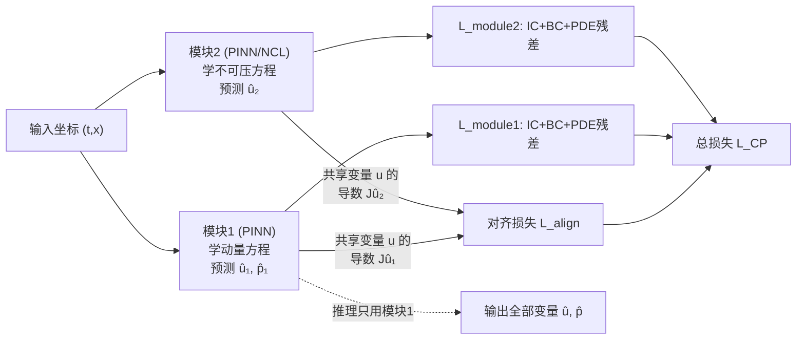

# ComPhy: Composing Physical Models with end-to-end Alignment

**会议**: ICLR 2026  
**OpenReview**: [https://openreview.net/forum?id=ER7zDJXtRI](https://openreview.net/forum?id=ER7zDJXtRI)  
**代码**: [https://github.com/AlexThirty/ComPhy](https://github.com/AlexThirty/ComPhy)  
**领域**: AI for Science / 物理建模 / 偏微分方程求解  
**关键词**: PDE 系统, Physics-Informed Neural Networks, Neural Conservation Laws, 模块化, 对齐损失, 知识迁移  

## 一句话总结
ComPhy 把一个"系统级 PDE 求解"拆成"每条方程一个专属模块"，再用一个基于导数（Jacobian）的端到端对齐损失把共享物理变量的模块绑在一起，从而把单模型多损失的病态优化变成多个简单子问题的协同优化，在 2/3/5 条方程的多个真实物理系统上稳定超过 PINN 与 NCL。

## 研究背景与动机
**领域现状**：用神经网络无监督求解偏微分方程（PDE）正成为 AI for Science 的主力工具，代表方法包括 Physics-Informed Neural Networks（PINN，把 PDE 残差作为软约束损失）和 Neural Conservation Laws（NCL，通过参数化反对称矩阵让输出场天然散度为零）。这些方法在天气预报、流体、量子力学、分子动力学等场景都有应用。

**现有痛点**：当问题不是单条 PDE 而是**方程组**（system of PDEs，如 Navier-Stokes、磁流体）时，主流做法是把每条方程的残差损失简单相加，由**单个网络**同时拟合所有方程。但这种做法在多损失之间尺度差异巨大、目标相互竞争，容易出现梯度范数严重失衡、ill-conditioning，导致 PINN 难以收敛、抓不住湍流。现有补救（逐 epoch 重加权、强制边界、区域分解）大多不是为方程组设计，或只针对某一条方程。

**核心矛盾**：方程组的解只有在**所有方程同时被满足**时才唯一；但把所有方程塞进一个网络又会让优化变得不可控。如何既让每个子问题足够简单、又不丢掉跨方程的物理耦合？

**本文目标**：提出第一个**专门面向 PDE 系统**的通用方法，能即插任意现有求解器（PINN、NCL）作为子模块，且对方程数量可扩展。

**核心 idea**：**「分而治之 + 导数对齐」**——给每条 PDE 分配一个专属学习模块（各自只优化 IC/BC/单条 PDE），再通过一个作用在**共享变量导数**上的对齐损失在模块间传递物理信息，让多个简单模块协同逼近系统的整体解；推理时只用能覆盖全部变量的最小模块子集（通常一个就够）。

## 方法详解

### 整体框架
对于含 $N$ 条方程的 PDE 系统，ComPhy（CP）为每条方程 $F_i[u]=0$ 配一个独立网络模块 $i$，输入同样的时空坐标 $(t,x)$，只预测该方程涉及的变量。每个模块独立学习自己的初始条件（IC）、边界条件（BC）和单条 PDE 残差；模块之间通过一个对齐损失耦合——凡是预测了同一物理变量的两个模块，就强制它们在该变量上（尤其是其导数上）保持一致。训练端到端联合进行，推理时只激活能覆盖所有待求变量的最小模块子集。

### 关键设计

**1. 每方程一模块的分解：把"系统多损失"降维成"多个简单子问题"。** 单个 PINN 在 $N$ 条方程上要同时优化 $N+2$ 个损失项（$N$ 个 PDE 残差加 IC、BC），不同残差的尺度和梯度范数差异会相互压制。CP 反其道而行：模块 $i$ 只承担属于自己的那条方程，损失为
$$L_{\text{module } i}=\lambda_{BC}L_{BC}+\lambda_{IC}L_{IC}+\lambda_{PDE\,i}L_{PDE\,i},$$
其中 $L_{PDE\,i}$ 的具体形式取决于该模块选用的求解器（PINN 用 AD 算残差的 $L_2$，NCL 则因散度为零设计而直接省掉这一项）。这样每个模块面对的优化地形显著更简单，跨方程信息不靠堆损失、而靠下面的对齐来获取。论文在梯度直方图分析（3xPINN vs 单 PINN）中证实：CP 各层不同损失的梯度分布明显更"对齐"、尺度更接近，这正是它训练更稳的经验解释。

**2. 基于导数的对齐损失：用 Jacobian 而非输出来传递物理。** 设 $\mathbf v$ 是两个模块共同预测的共享变量子集，模块 $i,j$ 对它的预测分别为 $\hat v_i,\hat v_j$，对齐损失有三种：
$$\text{OUTL: }\|\hat v_i-\hat v_j\|_2^2,\quad \text{DERL: }\|J\hat v_i-J\hat v_j\|_2^2,\quad \text{SOB: }\|\hat v_i-\hat v_j\|_2^2+\|J\hat v_i-J\hat v_j\|_2^2,$$
其中 $J\hat v_i$ 是模块 $i$ 对全部输入的 Jacobian。SOB 对齐 Sobolev 范数，DERL 只对齐导数，OUTL 只对齐输出值作为对照。作者的核心论点是：物理系统的**演化由导数（动力学）决定**，因此对齐导数比对齐输出值更能传递、蒸馏物理约束——理论上也契合 Sobolev 距离在 PDE 解存在唯一性分析中的核心地位。实验一致验证：OUTL 明显最差，DERL/SOB 远胜，且 DERL 往往最优（连只对齐输出+导数的 SOB 在某些场景都不如纯导数的 DERL）。

**3. 端到端联合训练、最小子集推理：训练用全部、推理只用一个。** 完整损失把所有共享变量的模块对的对齐损失与各模块损失相加：
$$L_{CP}=\lambda_{\text{align}}\sum_{i,j}L_{\text{align }i,j}+\sum_{i=1}^N L_{\text{module }i}.$$
实践中还可简化成只保留"推理模块与其他模块之间"的对齐项。关键洞察是：训练阶段需要所有模块互相约束以保证解唯一，但**推理阶段只需用能预测出全部目标变量的最小模块集合**——例如 Navier-Stokes 里动量方程模块同时输出 $u$ 和 $p$，于是单它一个就够，省下可观的推理时间。

**4. 模块即插任意求解器：PINN 与 NCL 自由组合。** CP 对子模块的实现不做限定，论文实验里同一系统可以用 2xPINN、PINN+NCL、3xNCL 等多种配置。NCL 模块通过让 MLP 输出反对称矩阵 $A$ 再按行取散度 $u_i=\mathrm{div}(A_{i\cdot})$，保证 $\nabla\!\cdot u=0$ 天然成立；作者还把原 NCL 推广到对"任意同尺寸输入输出子集"产生散度为零的场，从而能灵活适配方程组里不同方程的散度结构。这让 CP 既能继承 NCL 在散度约束上的硬保证，又比 NCL 更通用（NCL 只对散度为零的场有效，CP 不受此限）。

## 实验关键数据

### 主实验表格（案例研究，L2 误差，越小越好）

| 模型 | Taylor-Green L2(×10⁻⁵) | Kovasznay L2(×10⁻⁶) | Acoustics L2(×10⁻⁵) |
|---|---|---|---|
| PINN | 3.677 | 10.83 | 8.016 |
| PINN+RAR | 5.235 | 11.48 | 120.6 |
| PINN+Grad | 4.245 | 7.471 | 10.05 |
| NCL | 2.830 | 3.014 | 5.243 |
| **CP-PINN+NCL DERL+Grad** | **2.795** | 4.325 | — |
| **CP-PINN+NCL SOB+Grad** | 4.386 | **3.663** | — |
| **CP-3xNCL DERL+Grad** | — | — | **2.718** |

CP 在三个案例上都拿到最优或近最优；尤其在 Taylor-Green 上，CP-PINN+NCL（DERL+Grad）比天生绕过散度方程的 NCL 还略好，说明跨模块迁移散度约束是有效的。

### 真实系统 + 消融（Euler 气体 3 方程 / MHD 5 方程，L2 误差）

| 模型 | Euler Gas L2(×10⁻³) | MHD L2(×10⁻⁴) |
|---|---|---|
| PINN | 1.712 | 1.967 |
| PINN+Grad | 3.319 | 1.657 |
| NCL | 1.690 | 1.975 |
| **CP-2xPINN SOB** | **1.296** | 1.599 |
| **CP-3xPINN SOB/DERL** | 1.382 | **1.535** |
| CP-2xNCL SOB（对照）| 2.029 | — |

对齐方式消融（OUTL vs DERL/SOB）贯穿全文：OUTL 始终最差，验证"对齐导数优于对齐输出"的核心假设。

### 关键发现
- **导数对齐 > 输出对齐**：OUTL 在所有任务上明显落后，DERL/SOB 稳定领先，DERL 常为最优。
- **可扩展性**：从 2 条到 5 条方程（MHD），CP 都以较大优势超过 PINN/NCL，且 3xPINN、4xPINN 等更多模块配置依旧稳健。
- **优化机理**：梯度直方图显示 CP 各层各损失的梯度分布比单 PINN 更均衡，从经验上解释了"为什么分模块训得更好"。
- **推理高效**：训练用全部模块，推理常只需一个模块即可预测所有变量。

## 亮点与洞察
- **问题定位精准**：明确指出"单模型多损失"是 PDE 系统求解的病根，第一个专门为 PDE 系统设计模块化框架。
- **"导数才是物理的载体"这一观点既有理论支撑（Sobolev 距离）又有干净的消融验证**，是全文最有说服力的一击。
- **训练/推理解耦**：训练时全模块互相约束保证解唯一，推理时最小子集省算力，工程上很实用。
- **正交于已有方法**：PINN、NCL、梯度重加权都能作为模块或叠加进来，是一个"组合器"而非又一个孤立求解器。

## 局限与展望
- **理论仍是开口**：物理模型收敛到真解本身是开放问题，CP 的优势主要靠经验（梯度分析、误差表）说明，缺少收敛性保证。
- **模块/对齐对数随方程数增长**：方程多、共享变量复杂时，模块对的对齐项与超参（各 $\lambda$）调节可能变重，论文用简化对齐缓解但未系统研究其代价。
- **依赖共享变量结构**：对齐的有效性建立在模块间存在共享物理变量之上，对于耦合方式更隐晦的系统如何划分模块、选共享变量仍需人工设计。
- **评测仍是经典基准解**：多数参考解来自解析解或经典数值求解器（Clawpack、有限元/有限体积），尚未在缺乏参考解的纯真实观测数据上验证。

## 相关工作与启发
- **PINN（Raissi et al., 2019）** 与其优化改进（梯度重加权 Wang et al.、RAR 重采样 Wu et al.、区域分解）是直接对比基线；CP 把这些都视作可插拔模块或可叠加技巧。
- **Neural Conservation Laws（Richter-Powell et al., 2022）** 提供散度为零的硬约束设计，CP 将其推广到任意子集并作为模块之一。
- **知识蒸馏中"用导数/Jacobian 做迁移目标"（Czarnecki et al., 2017）** 是导数对齐的思想来源，CP 把它从模型压缩迁到物理建模。
- **启发**：把"多目标耦合优化"重构为"专家模块 + 一致性对齐"是一个可推广范式——在多任务学习、多物理场耦合、甚至多模态一致性约束里，"对齐导数/中间表示而非最终输出"或许都值得一试。

## 评分
- **新颖性**: ⭐⭐⭐⭐ 首个专门面向 PDE 系统的模块化框架，"导数对齐传递物理"视角清晰且有理论直觉。
- **实验充分度**: ⭐⭐⭐⭐ 覆盖 2/3/5 条方程的多个系统、三种对齐方式消融、梯度机理分析，但仍以有参考解的基准为主。
- **写作质量**: ⭐⭐⭐⭐ 动机—方法—验证逻辑顺畅，Navier-Stokes 实例把抽象框架讲得很具体。
- **价值**: ⭐⭐⭐⭐ 即插任意求解器、推理省算力、对方程数可扩展，对 AI for Science 的 PDE 系统求解有实用与方法论双重价值。

<!-- RELATED:START -->

## 相关论文

- [\[ICML 2025\] Sum-of-Parts: Self-Attributing Neural Networks with End-to-End Learning of Feature Groups](../../ICML2025/physics/sum-of-parts_self-attributing_neural_networks_with_end-to-end_learning_of_featur.md)
- [\[ICLR 2026\] RealPDEBench: A Benchmark for Complex Physical Systems with Real-World Data](realpdebench_a_benchmark_for_complex_physical_systems_with_real-world_data.md)
- [\[ICLR 2026\] Spectral-Guided Physical Dynamics Distillation](spectral-guided_physical_dynamics_distillation.md)
- [\[ICLR 2026\] Physics-Constrained Fine-Tuning of Flow-Matching Models for Generation and Inverse Problems](physics-constrained_fine-tuning_of_flow-matching_models_for_generation_and_inver.md)
- [\[ICLR 2026\] PRO-MOF: Policy Optimization with Universal Atomistic Models for Controllable MOF Generation](pro-mof_policy_optimization_with_universal_atomistic_models_for_controllable_mof.md)

<!-- RELATED:END -->
