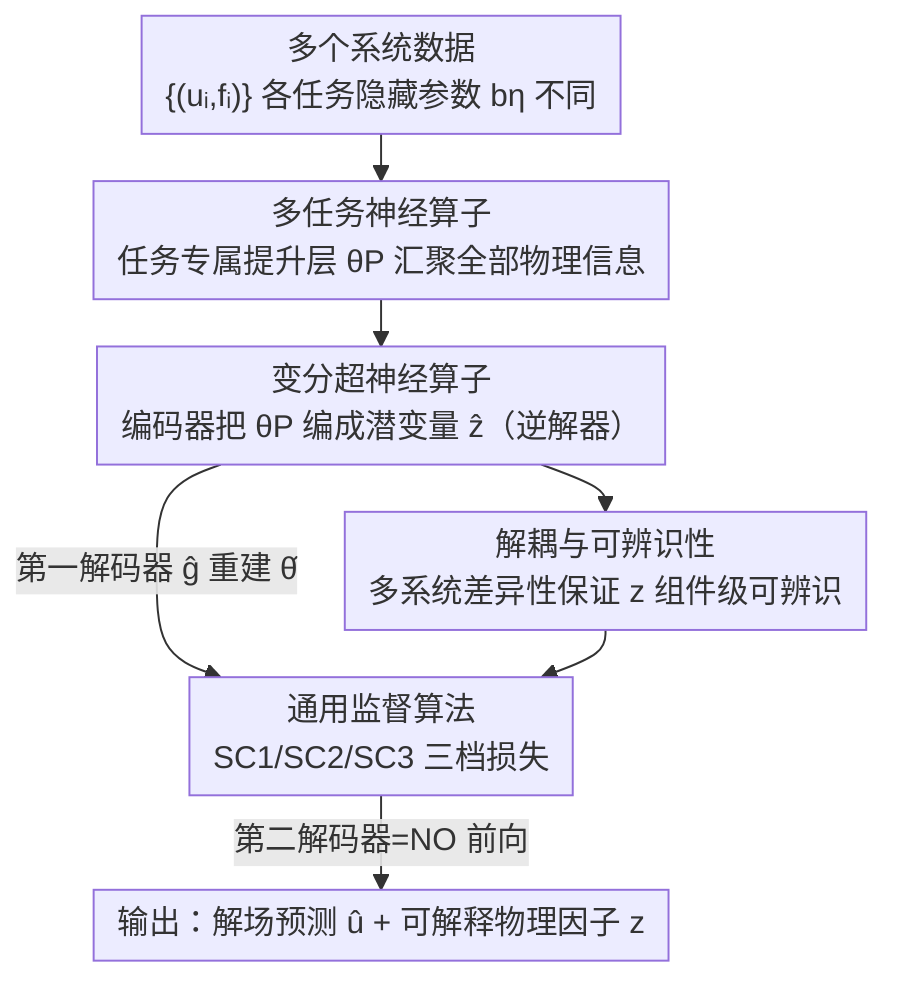

# Disentangled Representation Learning for Parametric Partial Differential Equations

**会议**: ICLR2026  
**OpenReview**: [https://openreview.net/forum?id=xaTJAxZTvV](https://openreview.net/forum?id=xaTJAxZTvV)  
**代码**: https://github.com/ningliu-iga/DisentangO  
**领域**: 科学机器学习 / 神经算子 / 偏微分方程  
**关键词**: 神经算子, 解耦表示, 超网络, 变分自编码器, 逆问题

## 一句话总结
DisentangO 提出一种"变分超神经算子"架构，把多个物理系统的神经算子参数当作信号，用 VAE 从这些黑盒参数里解耦出可辨识的潜在物理因子，从而在同一个模型里**同时**完成前向 PDE 求解（预测解场）和逆向物理发现（还原驱动系统的隐藏参数），并给出了组件级可辨识性的理论保证。

## 研究背景与动机
**领域现状**：神经算子（Neural Operator, NO，如 FNO、DeepONet、MetaNO）擅长学习函数空间之间的映射，是 PDE 控制系统高效的前向代理求解器——给定载荷 $f$ 和参数场 $b$，快速预测解 $u$。它们做前向预测又快又准。

**现有痛点**：但 NO 是彻底的黑盒。它把某个固定参数 $b$ 的系统拟合成一个万能逼近器，对"这个系统背后到底由哪些物理量驱动"一无所知，也无法解释。换句话说，NO 给你答案，却不告诉你物理机理。这在科学场景里是致命的：物理建模的价值恰恰在于看清支配规律。

**核心矛盾**：还原物理参数本质上是一个**逆问题** $H:(u,f)\to b$，而逆问题天生病态——单个系统的若干 $(u,f)$ 对往往不足以唯一确定 $b$（比如 Dirichlet 边界上 $u\equiv 0$，$b$ 在边界上根本不可学）。已有的逆向方法要么需要预先知道 PDE 形式、要么靠正则化注入先验，这些假设在真实场景常常站不住脚。同时，模型表达力与可解释性之间一直存在张力：太复杂的模型掩盖了真实物理关系，太简单又丢掉系统行为的关键细节。

**本文目标**：在**不需要知道 PDE 形式、也不需要 $b$ 的监督**的前提下，构造一个既能前向预测、又能逆向发现物理机理，并且把还原出的物理因子**解耦**成各自独立、可解释维度的统一框架。

**切入角度**：作者的关键观察是——既然神经算子的参数 $\theta$ 本身就编码了它所拟合系统的全部物理信息，那么"逆问题"就可以从"从数据 $(u,f)$ 反推 $b$"转化为"从 NO 参数 $\theta$ 里解耦出 $b$ 的潜在表示 $z$"。更妙的是，如果同时学习**多个**具有不同隐藏参数的系统，系统之间的差异性（variability）本身就能缓解逆问题的病态、带来可辨识性。

**核心 idea**：用一个超网络（hypernetwork）+ VAE 的组合，把"多任务神经算子的任务专属参数"作为 VAE 的输入信号，从黑盒参数里解耦出可辨识的物理因子——相当于"对神经网络的参数本身做解耦表示学习"，而不是对数据做。

## 方法详解

### 整体框架
DisentangO 要解决的是：给定 $S$ 个共享同一类 PDE、但各自隐藏参数 $b^\eta$ 不同的系统，每个系统提供若干 $(u_i^\eta, f_i^\eta)$ 函数对（每个系统视为一个"任务"），目标是学一个既能对所有任务做前向预测、又能从中解耦出物理因子的模型。

整体数据流是这样转的：所有任务共享一个**多任务神经算子**骨干，但每个任务有自己专属的"提升层（lifting layer）"参数 $\theta_P^\eta$，所有关于 $b^\eta$ 的物理信息都被压缩进这个低维向量。接着一个 VAE 把 $\theta_P^\eta$ 当作输入：**编码器**充当逆映射 $H$，把 $\theta_P^\eta$ 编成解耦潜变量 $\hat z^\eta$（这就是"物理发现"）；**第一解码器** $\hat g$ 把 $\hat z$ 重建回 NO 参数 $\hat\theta$；**第二解码器**就是神经算子前向映射本身，拿重建出的 $\hat\theta$ 和载荷 $f$ 去预测解 $\hat u$（这就是"前向求解"）。整个系统端到端训练，靠数据重建损失、参数重建损失和 KL 损失共同约束。

### 关键设计

**1. 多任务神经算子：把所有物理信息逼进一个任务专属提升层**

逆问题病态的根源是单个系统信息不足。本文的破局点是同时学 $S$ 个系统、并强制所有"系统间差异"只能体现在一个低维参数上。作者采用 MetaNO（基于隐式 Fourier 神经算子 IFNO）作为骨干，对一个 $L$ 层网络写成
$$G[f;\theta^\eta](x) = Q_{\theta_Q}\circ (J_{\theta_J})^L \circ P_{\theta_P^\eta}[f](x),$$
其中 $P,Q$ 是浅层 MLP（提升 / 投影），中间层 $J$ 模拟不动点迭代。关键约束是：**只有第一层提升参数 $\theta_P^\eta$ 随任务自适应，迭代参数 $\theta_J$ 和投影参数 $\theta_Q$ 在所有任务间共享**。MetaNO 的万能逼近分析保证不同 PDE 可以共用 $\theta_J,\theta_Q$，于是隐藏参数 $b$ 的全部信息都被"逼"进了 $\theta_P^\eta$ 这一个低维向量里。这样一来逆映射只需建在 $\theta_P^\eta$ 上：$H(\theta^\eta;\Theta):=\mathrm{MLP}(\theta_P^\eta)$，自由度大幅收缩，也让下一节的可逆性假设变得现实可行。

**2. 变分超神经算子：对 NO 参数本身做解耦，而非对数据**

有了高度浓缩的 $\theta_P^\eta$，作者把它当作一个 VAE 的观测信号——这是和以往"从数据解耦"工作的本质区别，DisentangO 是**第一个从黑盒网络参数里解耦**的方法。它假设隐藏参数按 $b\sim P_b,\ z\sim p(z\mid b)$ 生成，最大化数据对数似然的 ELBO：
$$\mathcal{L}_{\text{ELBO}}=\frac{1}{S}\sum_{\eta=1}^{S}\Big[\mathbb{E}_{q(z^\eta|\theta^\eta)}\log p(\theta^\eta|z^\eta)-D_{\mathrm{KL}}\big(q(z^\eta|\theta^\eta)\,\|\,p(z^\eta)\big)\Big].$$
整体落成一个分层 VAE（HVAE）：编码器给出后验 $q_{\mu_z,\Sigma_z}(\hat z^\eta|\theta^\eta)$ 即逆映射 $H$；第一解码器 $\hat\theta=\hat g(\hat z)$ 把潜变量重建回 NO 参数；第二解码器直接用神经算子前向 $\hat u=\hat G[f;\hat\theta]$ 把参数翻译回解场。这种"超网络（一个网络生成另一个网络参数）+ VAE"的配对，使得同一架构**一次前向就同时输出预测解和可解释潜因子**。

**3. 组件级可辨识性：用"多系统差异"换"逆问题可解"**

解耦最怕学出来的潜变量没有物理意义、各维纠缠在一起。本文给出理论保证：在密度光滑正性、$z\to\theta$ 可逆、条件独立、以及"足够变化性（线性独立）"等假设下，能证明两层结论——**定理 1**：只要学到的模型让 $p_{\hat u|f}=p_{u|f}$（边际数据分布对齐），潜变量 $z$ 就可被辨识到一个可逆变换 $h$ 之内（$\hat z=h(z)$）；**定理 2**：再加上条件独立和跨系统的数据变化性假设，可进一步得到**组件级**可辨识——每个真因子 $z_i$ 都对应某个学到的 $\hat z_j$ 及一维可逆函数 $z_i=h_i(\hat z_j)$。这里的核心直觉是：Assumption 4 要求存在 $2d_z+1$ 个不同的 $b$ 使若干梯度向量线性独立，即"系统之间足够不一样"——这正是把多任务学习当成解药的理论依据，借鉴了非线性 ICA 的可辨识性框架。作者称这是首次在多任务神经算子学习语境下讨论组件级可辨识性。

**4. 通用监督算法：一套损失覆盖有监督 / 半监督 / 无监督三档**

真实场景里对 $b$ 的了解程度参差不齐，本文设计了统一损失适配三种监督强度——SC1（给出 $b^\eta$ 的值）、SC2（只给标签 $c(b^\eta)$，如分类）、SC3（什么都不给）。在高斯后验假设下 KL 项有闭式：无监督时 $D_{\mathrm{KL}}=\frac12\sum_i\big((\Sigma_z)_i^2+(\mu_z)_i^2-2\log(\Sigma_z)_i-1\big)$，有监督时把先验均值锚到 $b$，即把 $(\mu_z)_i^2$ 换成 $(\mu_z-b)_i^2$。简化后的无监督总损失为
$$\mathcal{L}_{\text{loss}}=\frac1S\sum_\eta\Big(\beta_d\sum_{j}\big\|\hat G[f_j^\eta;\hat\theta^\eta]-u_j^\eta\big\|_{L^2}^2+\big\|\hat\theta^\eta-\mu_\theta^\eta\big\|^2+\beta_{\mathrm{KL}}\|\mu_z^\eta\|^2\Big),$$
半监督再加一项分类约束 $\beta_{\mathrm{cls}}\mathcal{L}_c$（如交叉熵）。两个权重各管一摊且相互拮抗：$\beta_{\mathrm{KL}}$ 对应 $\beta$-VAE 里的解耦旋钮，调大鼓励解耦但会压缩潜瓶颈造成信息损失；$\beta_d$ 是数据重建强度，调大迫使潜因子参与复杂解场的全局重建，从而**缓解**信息损失。实验里正是靠平衡这两者来兼顾精度与解耦。

### 损失函数 / 训练策略
总目标即上节的 $\mathcal{L}_{\text{loss}}$，由四块组成：数据重建损失（前向预测 $\hat u$ 对 $u$）、参数重建损失（$\hat\theta$ 对 $\theta$）、KL 损失（解耦正则）、以及半监督时的（半）监督损失。$\beta_d$、$\beta_{\mathrm{KL}}$、$\beta_{\mathrm{cls}}$ 与噪声标准差 $\varpi$ 均作为可调超参数；为避免过参数化，第一解码器协方差取 $\Sigma_\theta=\sigma_\theta^2 I$。

## 实验关键数据

### 主实验
作者在三种监督场景、共三组物理数据上评测，对比多达 14 个基线（8 个 NO 类 + 6 个非 NO 类）。

**实验一（SC1 全监督，HGO 各向异性纤维增强超弹性材料）**：

| 模型 | 参数量 | 前向误差(data) | 逆向误差 z (SC1) |
|------|--------|---------------|------------------|
| **DisentangO** | 697k | 1.65% | **4.63%** |
| MetaNO（仅前向） | 296k | **1.59%** | - |
| FNO | 698k | 2.45% | 14.55% |
| NIO（仅逆向） | 709k | - | 15.16% |
| FUSE | 706k | - | 4.99% |
| InVAErt（仅逆向） | 707k | - | 5.16% |

前向上 MetaNO 是上界，DisentangO 几乎追平并比第三名高 32.7%；逆向上 DisentangO 是**唯一**把误差压到 5% 以下的方法，比第二好的联合（同时前向+逆向）求解器高 25.2%。

### 消融实验
**实验二（半监督 Mechanical MNIST）**：考察潜维度与数据损失权重 $\beta_d$ 的影响。

| 配置 | DNO-2 | DNO-5 | DNO-10 | DNO-15 | MetaNO(上界) |
|------|-------|-------|--------|--------|--------------|
| $\beta_d=1$ | 12.82% | 9.56% | 7.36% | 6.29% | 2.68% |
| $\beta_d=100$ | 11.49% | 8.43% | 6.65% | **5.48%** | - |
| $\beta_d=1000$ | 11.62% | 8.22% | 6.50% | 5.80% | - |

潜维度从 2 增到 15，前向误差从 11.49% 降到 5.48%，逐步逼近 MetaNO 上界；$\beta_d$ 增大持续提升精度但 $>100$ 后收益递减甚至略降，故取 $\beta_d=100$。即便最弱的 DNO-2($\beta_d=1$) 也比 VAE / $\beta$-VAE 高 21.5% / 25.2%，最强 DNO-15 高出 66.5% / 68.0%。

**实验三（无监督异质材料 / 合成组织）**：DNO-30 在 $\beta_d=100$ 下误差 5.28%，比最佳基线高 90.7%，并逐步收敛到 MetaNO 的 2.67% 上界。

### 关键发现
- **数据损失项 $\beta_d$ 是解耦的隐形推手**：增大 $\beta_d$ 不仅提升前向精度，还让潜因子间的互信息（MI）分数持续下降（解耦更彻底）；而分类损失 $\beta_{\mathrm{cls}}$ 反而提升 MI、损害解耦，因为分类器要线性组合所有潜因子，分类越准、因子间相关性越强。
- **解耦因子真的有物理含义**：在 MMNIST 上做潜空间遍历（latent traversal），数字从"6"连续变到"0""2""7"等，与潜聚类分布吻合；在合成组织数据上 DNO-3 的三个因子分别控制两段交界处的旋转、两段相对纤维取向、上段纤维取向——可解释性落到了真实微结构参数上。
- **半监督的取舍**：加分类损失会让前向精度略降（额外正则），但换来了"能识别嵌入数字并据此解耦有意义因子"的能力；纯无监督版本精度略高却无法获取这种偏标签知识。

## 亮点与洞察
- **"对网络参数做解耦"这一视角很巧**：以往解耦都是从数据里抽因子，本文转而把神经算子参数 $\theta_P$ 当信号——因为 MetaNO 已经把物理信息全压进了这个低维参数，等于先做了一次极强的信息浓缩，再解耦自然事半功倍。这个"先用骨干压缩、再对参数解耦"的两段式思路可迁移到任何参数高度可分离的多任务模型。
- **把"多任务"从工程技巧升级成理论解药**：逆问题病态是老大难，本文用"多个系统的差异性带来可辨识性"把多任务学习和非线性 ICA 的可辨识性理论接上，给出组件级可辨识保证，而不只是经验上 work。
- **一个架构同时吃下前向与逆向**：第二解码器直接复用神经算子前向映射，使得前向预测和逆向发现共享同一套参数、端到端联合优化，而不是拼两个独立模型。
- **$\beta_d$ 与 $\beta_{\mathrm{KL}}$ 的拮抗关系给了实用调参直觉**：解耦强度和重建保真度之间的 trade-off 被显式拆成两个旋钮，可解释也可控。

## 局限与展望
- **作者承认**：DisentangO 的可扩展性受限于所用 NO 骨干的可扩展性，因此本文聚焦于"高潜维度"实验，对**高维 PDE**的演示超出当前范围。
- **依赖足够的系统间变化性**：组件级可辨识性的 Assumption 4 要求 $2d_z+1$ 个充分不同的 $b$，若可用系统太少或彼此太像，理论保证和实际解耦都会退化——对"系统数量/多样性"有隐性要求。
- **可辨识只到可逆变换之内**：定理保证的是 $z_i=h_i(\hat z_j)$ 这种一维可逆对应，潜因子的尺度 / 排列仍需事后对齐，自动赋予物理量纲仍要人工解读（如靠 latent traversal 观察）。
- **超参数较多**：$\beta_d,\beta_{\mathrm{KL}},\beta_{\mathrm{cls}},\varpi,\sigma_\theta$ 都需调，且 $\beta_d$ 的最优值随数据集变化（100 与 1000 之间），实际部署需要一定调参成本。

## 相关工作与启发
- **vs MetaNO（骨干）**：MetaNO 提供"任务专属提升层 + 共享迭代/投影层"的多任务 NO 结构，但**只能前向**、且参数本身仍是黑盒；DisentangO 在其上套一层 VAE，把 $\theta_P$ 解耦成可解释因子，从而补上逆向发现能力。
- **vs 传统逆 PDE 方法（NIO / 注入 PDE 先验或正则化）**：它们多数需要预知 PDE 形式或结构算子来对抗病态，假设强且不现实；DisentangO 不需 PDE 形式、不需 $b$ 监督，靠多系统差异性获得可辨识性。
- **vs 数据侧解耦（β-VAE / FactorVAE / InfoGAN）**：这些方法在视觉/机器人上对**数据**做解耦，潜因子有视觉含义；DisentangO 首次对**网络参数**解耦，并把场景搬到物理系统学习，潜因子对应真实物理参数。
- **vs FUSE / InVAErt 等联合/逆向求解器**：在精度上 DisentangO 是唯一把 SC1 逆向误差压到 5% 以下者，且能同时保持接近 MetaNO 的前向上界，做到"前向不掉队 + 逆向最强 + 因子可解释"三者兼得。

## 评分
- 新颖性: ⭐⭐⭐⭐⭐ 首次"从黑盒神经算子参数里解耦物理因子"，并给出多任务 NO 语境下的组件级可辨识性理论。
- 实验充分度: ⭐⭐⭐⭐ 覆盖有监督/半监督/无监督三场景、对比 14 个基线、含潜遍历可解释性验证；但未涉高维 PDE。
- 写作质量: ⭐⭐⭐⭐ 动机—方法—理论—实验逻辑清晰，公式完整；理论假设较密集，需要一定背景。
- 价值: ⭐⭐⭐⭐⭐ 在科学机器学习里同时打通前向求解、逆向发现与可解释性，落到真实材料/微结构参数，应用前景明确。

<!-- RELATED:START -->

## 相关论文

- [\[AAAI 2026\] Towards a Foundation Model for Partial Differential Equations Across Physics Domains](../../AAAI2026/physics/towards_a_foundation_model_for_partial_differential_equations_across_physics_dom.md)
- [\[ICLR 2026\] Physics-Informed Inference Time Scaling for Solving High-Dimensional Partial Differential Equations via Defect Correction](physics-informed_inference_time_scaling_for_solving_high-dimensional_partial_dif.md)
- [\[ICML 2026\] Foundation Inference Models for Ordinary Differential Equations](../../ICML2026/physics/foundation_inference_models_for_ordinary_differential_equations.md)
- [\[ICML 2025\] Closed-form Symbolic Solutions: A New Perspective on Solving Partial Differential Equations](../../ICML2025/physics/closed-form_solutions_a_new_perspective_on_solving_differential_equations.md)
- [\[ICLR 2026\] $\partial^\infty$-Grid: A Neural Differential Equation Solver with Differentiable Feature Grids](boldsymbolpartialinfty-grid_a_neural_differential_equation_solver_with_different.md)

<!-- RELATED:END -->
