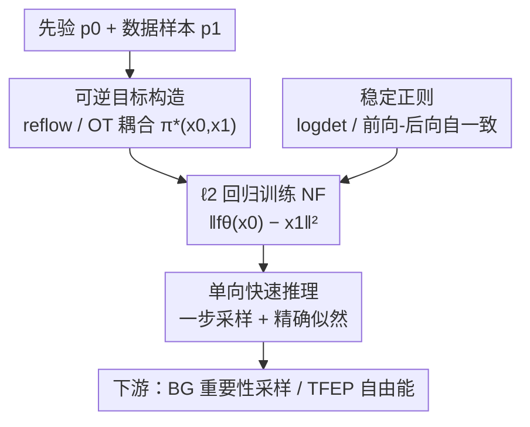

# Efficient Regression-based Training of Normalizing Flows for Boltzmann Generators

**会议**: ICLR 2026  
**OpenReview**: [https://openreview.net/forum?id=ctdnzPxDI3](https://openreview.net/forum?id=ctdnzPxDI3)  
**代码**: https://github.com/danyalrehman/RegFlow  
**领域**: 科学计算 / 分子采样 / 归一化流 / Boltzmann Generator  
**关键词**: 归一化流, 回归训练, Boltzmann Generator, 最优传输, reflow

## 一句话总结
本文提出 REGFLOW，用一个简单的 $\ell_2$ 回归目标替代经典归一化流（NF）一直依赖的最大似然（MLE）训练，让 NF 直接去拟合由 reflow（预训练 CNF）或最优传输给出的"已知可逆映射"的噪声-数据配对，从而绕开 MLE 的数值不稳定与雅可比行列式开销，在分子构象平衡采样上既保住"一步采样 + 精确似然"，又显著超过 MLE 训练的同款架构。

## 研究背景与动机
**领域现状**：在分子模拟里，Boltzmann Generator（BG）= 一个归一化流（提供可计算的提议分布 $p_\theta$）+ 重要性采样校正，用来从目标 Boltzmann 分布 $p_{\text{target}}\propto e^{-E(x)/k_BT}$ 里抽 i.i.d. 样本、估自由能差等物理量。这类应用的硬约束是：既要快又要**精确的似然**——重要性权重 $w(x)=e^{-E(x)/k_BT}/p_\theta(x)$ 里必须能廉价、精确地算出 $p_\theta(x)$。

**现有痛点**：当下生成模型的两条路都不满足这个约束。一条是扩散 / 流匹配这类连续归一化流（CNF），生成质量高、似然也精确，但推理极贵——算精确似然要积分速度场的散度（一个二阶导），动辄上百次模型调用；论文实测 CNF 算似然比最慢的 NF 还贵约 450 倍、比最快的贵约 7700 倍。另一条是经典离散 NF，天生一步、似然精确，但只能用 MLE 训练，而 MLE 在表达力强的架构上极易数值不稳定，逼着架构在"好优化"和"够表达"之间妥协，结果 BG 里用经典流常常欠拟合目标分子系统。至于 shortcut、IMM 这类一步图像生成模型，本文用棋盘格实验证明它们**不可逆**，重采样也救不回来——逐点收敛 $f_\theta\to f^\star$ 并不蕴含梯度收敛 $\nabla f_\theta\to\nabla f^\star$（反例 $f_m(x)=\tfrac1m\sin(mx)+x$，函数收敛但导数 $\cos(mx)$ 不收敛），所以似然不可信。

**核心矛盾**：MLE 训练 NF 难，根子在于它要同时学正向映射 $f_\theta$、逆映射 $f_\theta^{-1}$，却**没有现成的噪声-数据配对** $\pi(x_0,x_1)$——耦合 $\pi$ 是和流一起在训练中演化出来的，当配对次优时优化极难。而流匹配之所以好训，正是因为它先固定了一个目标耦合再回归。

**本文目标 / 切入角度**：能不能把"流匹配让 CNF 好训"这套红利搬到经典 NF 上，同时还白赚"一步精确似然"？作者的关键观察是：**只要能拿到任意一个可逆映射 $f^\star$ 的配对样本，就足以用回归目标训练一个生成模型**。

**核心 idea**：先选定一个可逆解 $f^\star\in\mathcal F$、固定它诱导的耦合 $\pi^\star(x_0,x_1)$，再让经典 NF 去 $\ell_2$ 回归匹配这些噪声-目标配对，用回归代替 MLE。

## 方法详解

### 整体框架
REGFLOW 把"训练一个能算精确似然的一步可逆映射"这件事，从难解的 MLE 优化改写成了一个**匹配已知可逆函数**的回归问题。整条流水线分三段：先在离线阶段构造一批来自某个可逆映射 $f^\star$ 的噪声-数据配对（用最优传输或预训练 CNF 的 reflow），再让经典 NF 以 $\ell_2$ 回归去拟合这些配对、并辅以稳定正则，最后推理时一步从噪声映到数据、同时用变量替换公式一次算出精确似然，喂给下游的 BG 重要性采样或自由能预测。

理论支撑是命题 1：当回归损失 $L(\theta)\to0$ 时，$\big((f^\star_t)^{-1}\circ f_{t,\theta}\big)(x)\to x$（在 $p_0$ 测度下几乎处处成立），即学到的流在 $p_0$ 支撑上行为等同于 $f^\star$——这说明原本要靠 MLE 解的生成问题，可以安全地重写成对一个已知可逆函数的匹配问题。

### 关键设计

**1. 可逆目标构造：reflow 与 OT 两种无需端到端学习的耦合**

回归训练的前提是先有一个**真·可逆**的 $f^\star$ 提供噪声-目标配对 $\pi^\star(x_0,x_1)$，否则配对不可逆就会重蹈 shortcut / IMM "似然不可信"的覆辙。本文给两种构造。其一是 **reflow**：用一个预训练好的 CNF（速度场 $v^\star_t$）把噪声积分到数据，$f^\star_{\text{reflow}}(x_0)=x_0+\int_0^1 v^\star_t(x_t)\,dt=x_1$，从而离线收集一大批 $(x_0,x_1)$ 配对。命题 2 给了它的理论保证：用 reflow 目标训练的 NF 满足 $W_2(p_1,p_\theta)\le K\exp\!\big(\int_0^1 L_t\,dt\big)+\epsilon$，第一项是预训练 CNF 对真实分布的逼近误差、第二项 $\epsilon$ 是 NF 回归到 reflow 目标的逼近间隙——把误差清晰拆成"老师准不准"和"学生学得像不像"两块。其二是 **最优传输（OT）**：OT 在连续空间给出的传输映射是某凸函数的梯度，天然连续可逆，$f^\star_{\text{ot}}=\arg\min_T\int T(x)\,c(x,T(x))\,dp_0(x)$ 且 $T_\#(p_0)=p_1$；它完全不用训练，缺点是精确 OT 是 $O(n^3)$ 时间、$O(n^2)$ 空间，但作为一次性离线预处理在可承受规模上仍然好用（注意这与按 mini-batch 近似 OT 的 OT-CFM 不同，这里用的是全 batch OT）。

**2. ℓ2 回归训练目标：先定耦合，把 MLE 换成一步匹配**

有了固定耦合，经典 NF 由于本身就是一步映射，训练目标直接退化成最朴素的形式：

$$L(\theta)=\mathbb E_{x_0,x_1}\big[\|f_{1,\theta}(x_0)-f^\star_1(x_0)\|^2\big]+\lambda_r R=\mathbb E_{x_0,x_1}\big[\|\hat x_1-x_1\|^2\big]+\lambda_r R$$

即让 NF 一步把噪声 $x_0$ 推到目标 $x_1$，对齐到 $\ell_2$ 距离即可。这一步是全文的核心红利：它彻底绕开了 MLE 里那个随训练演化的耦合难题（MLE 要边学流边学配对），也不必在训练时反复求雅可比行列式（NF 用 MLE 训练的主要开销来源）。它和流匹配的区别在于回归的是**一步终点目标** $x_1=f^\star_1(x_0)$，而非流匹配那种逐时刻的条件速度场——所以推理时不需要数值积分概率流 ODE，一次前向就出结果。对作为通用密度逼近器的 NF 而言，这个学习问题存在可行解。

**3. 稳定正则：logdet 与前向-后向自一致，防止数值崩塌**

单纯回归会损害 NF 的数值可逆性（和 MLE 训练里观察到的现象类似），一旦 NF 数值不稳定，重要性重采样就会被污染。因为目标分布常常病态、集中在低维子空间附近，作者用三招维持稳定：给目标加小量高斯噪声、给优化器加权重衰减，以及核心的两种正则。第一种是 **logdet 正则**：

$$\mathcal L_{\text{log-det}}=\|f_\theta(x_0)-x_1\|_2^2+\lambda_r\big(\log|\det(J_\theta(x))|\big)^2$$

它惩罚的正是变量替换公式里本来就要算的那个对数行列式，所以对本文用的架构**零额外开销**；几何上行列式衡量体积缩放，平方惩罚能阻止流把质量塌成尖峰。第二种是 **前向-后向自一致正则**：

$$\mathcal L_{\text{fwd-bwd}}=\|f_\theta(x_0)-x_1\|_2^2+\lambda_r\|f_\theta^{-1}(f_\theta(x_0))-x_0\|_2^2$$

它做一次前向再做一次反向、要求重构回原始先验，是一种 cycle-consistency，在输出层面保证可逆。代价是要算逆映射、约两倍开销，但好处是**完全不需要雅可比**，因而为更不受约束、更灵活的架构打开了门。两种正则都能避免崩塌；实验里 logdet 因零开销成了性价比最优解，作者主实验默认用它。

**4. 单向快速推理：把训练和推理都对齐到"噪声→数据"方向**

经典 MLE 训练 NF 时是从数据到噪声跑，生成时反过来从噪声到数据；对自回归型流（如神经样条流 NSF），正向 $f(x)$ 比逆向 $f^{-1}(x)$ 快得多，于是 MLE 的"生成走慢方向"就成了瓶颈。REGFLOW 因为训练和推理**都从噪声到数据**，可以把自回归流的快方向直接朝向生成，从而大幅加速推理。对有解析逆的流（RealNVP、Jet）这一项差别不大，但对 NSF 这种逆向慢的架构，似然计算可获得约 34× 的加速。

### 损失函数 / 训练策略
最终损失即式 (5) 的回归项加正则项 $\lambda_r R$，$R$ 取 logdet 或前向-后向二选一。算法上（Algorithm 1）每步从数据集采一批配对 $(x_0,x_1)$，先给目标加缩放噪声 $x_1\leftarrow x_1+\lambda_n\cdot\varepsilon,\ \varepsilon\sim\mathcal N(0,I)$，再算带正则的 $\ell_2$ 损失并更新 $\theta$。正则强度的甜区在 $10^{-6}\le\lambda_r\le10^{-5}$；再加大虽足以保证经验可逆（验证集 $\mathcal L_{\text{fwd-bck}}<10^{-4}$），但会拖累生成质量。

## 实验关键数据

在三个递增规模的分子系统——丙氨酸二肽（ALDP）、三肽（AL3）、四肽（AL4）——上评测平衡构象采样与靶向自由能预测（TFEP），架构覆盖 RealNVP（Res-NVP）、神经样条流（NSF）、Jet 三类，逐一对比同款架构在 MLE 与 REGFLOW 下的表现。指标为有效样本量 ESS（↑）、能量分布的 1-Wasserstein 距离 E-W1（↓）、主二面角的 2-Wasserstein 距离 T-W2（↓）。

### 主实验
| 系统 | 架构 | 指标 | MLE | REGFLOW |
|------|------|------|-----|---------|
| ALDP | NSF | E-W1 ↓ | 13.797 | **0.501** |
| ALDP | NSF | T-W2 ↓ | 1.243 | **0.951** |
| ALDP | Res-NVP | E-W1 ↓ | >1e3（崩） | **2.104** |
| AL3 | NSF | E-W1 ↓ | 17.596 | **0.853** |
| AL4 | NSF | E-W1 ↓ | 20.886 | **3.277** |

REGFLOW（reflow 目标）在所有架构上的 E-W1 与 T-W2 都稳定优于 MLE，仅 ESS 略低——但作者指出这是因为 MLE 发生了模式坍塌（Ramachandran 图可见），坍塌反而人为抬高了 ESS，而能量直方图显示 REGFLOW 更贴合真实能量分布。更关键的是 Res-NVP、Jet 这类用 MLE **根本训不动（>1e3）** 的架构，换成 REGFLOW 后变得可用。

推理效率上（算 200k 点的似然，ALDP）：NSF 从 277.0s 降到 8.18s，约 **33.8×** 加速；有解析逆的 Res-NVP（3.64→3.51）、Jet（67.63→60.43）提升较小；而 CNF（DiT）需 26969.8s，比最快的 NF 贵约 7700×。训练时间上，REGFLOW 在 E-W1 上约省 27%、T-W2 上约省 35%（已计入 CNF 训练 / OT 预计算 + 采样 + 训练全成本）。

### 消融实验
| 配置（ALDP, NSF） | E-W1 ↓ | T-W2 ↓ | 说明 |
|------|--------|--------|------|
| MLE | 13.797 | 1.243 | 基线 |
| REGFLOW w/o reg | 0.604 | 1.083 | 无正则也已远超 MLE |
| REGFLOW w/ logdet | 0.519 | 0.958 | 零开销，性价比最优 |
| REGFLOW w/ fwd-bwd | 0.501 | 0.951 | 略好但约 2× 开销 |
| REGFLOW @ 100k CNF | 17.39 | 1.232 | reflow 样本太少则退化 |
| REGFLOW @ 10.4M CNF | 0.501 | 0.951 | reflow 样本越多越好 |
| REGFLOW @ OT | 0.604 | 2.019 | OT 目标，E-W1 仍强 |

### 关键发现
- **reflow 样本量是主要旋钮**：从 10 万到 1040 万配对，E-W1 从 17.39 砍到 0.501，所有架构都随样本增多单调变好——这是 reflow（可无限采样）相对 OT 的独特优势。
- **正则只需轻量**：三种正则都已超过 MLE，logdet 因复用变量替换公式里现成的行列式而零开销，成为默认选择；fwd-bwd 略优但贵一倍，价值在于为免雅可比的灵活架构铺路。
- **新应用——免能量评估的 TFEP**：因为 REGFLOW 只靠两个亚稳态 A、B 的样本（配 OT 目标）就能训练、**训练时完全不调用能量函数**，作者实现了一种 MLE 做不到的靶向自由能微扰；在 ALDP 上自由能差预测逼近真实分子动力学，而作为参照的 DiT CNF 虽精度相近却慢近三个数量级。

## 亮点与洞察
- **一句话抓住全局**：MLE 之所以难，是因为它要"边学流边学配对"；只要先固定一个可逆映射的配对，训练就退化成最朴素的 $\ell_2$ 回归——把难优化问题改写成匹配问题，这是全文最漂亮的视角转换。
- **"一步 + 精确似然"是真正稀缺的组合**：图像领域的一步模型（shortcut/IMM）不可逆、似然不可信，而科学应用恰恰需要精确似然；本文用棋盘格 + 导数不收敛的反例把"为什么一步图像模型的似然不能用"讲得很透。
- **零开销正则的巧思**：logdet 正则惩罚的正是变量替换公式里本就要算的那一项，等于白捡一个稳定器——可直接迁移到任何需要维持可逆性的 NF 训练。
- **误差可分解的理论保证**：命题 2 把 $W_2$ 误差拆成"预训练 CNF 准不准"和"NF 学得像不像"两块，给"reflow 目标该投多少资源"提供了清晰的指导。

## 局限与展望
- 作者承认 REGFLOW 的上限受**提议分布质量**约束：reflow 目标的好坏直接被预训练 CNF 的逼近误差封顶（命题 2 的第一项），CNF 不行则 NF 也好不到哪去。
- reflow 路线需要先训练一个 CNF 并大量采样（实验用到 1040 万配对），OT 路线则受 $O(n^3)/O(n^2)$ 复杂度限制难以扩到超大数据集——两条目标构造路线各有"前置成本"。
- 实验局限在丙氨酸二/三/四肽这类短肽与笛卡尔坐标，尚未验证更大蛋白、显式溶剂或内坐标等更复杂体系；ESS 略逊 MLE 的现象虽有模式坍塌的解释，但跨指标横向比较时仍需注意各指标对"坍塌"的敏感度不同。
- 可延伸方向：fwd-bwd 正则免雅可比这一点，为引入更灵活、非传统耦合结构的可逆架构留了口子，值得进一步探索。

## 相关工作与启发
- **vs MLE 训练的经典 NF**：两者都给一步精确似然，但 MLE 需在训练时反复求雅可比行列式且耦合随训练演化、数值易崩；REGFLOW 先固定耦合、用回归绕开雅可比，既稳又快，还能训练 MLE 训不动的架构。
- **vs 流匹配 / CNF**：流匹配同样是"先定耦合再回归"，但回归的是逐时刻速度场，推理仍要数值积分 ODE、算精确似然要积分散度（极贵）；REGFLOW 把这套红利搬到离散 NF，回归一步终点目标，推理一次前向即出样本与精确似然。
- **vs shortcut / IMM 等一步模型**：它们能出高质量样本但**不可逆**，似然不可信、重采样也纠不回；REGFLOW 刻意选已严格可逆的经典 NF 作 $f_\theta$，从根上保证似然可用。
- **vs OT-CFM**：OT-CFM 用 mini-batch 近似 OT 计划；本文用全 batch 精确 OT 作一次性离线预处理来构造目标耦合。

## 评分
- 新颖性: ⭐⭐⭐⭐⭐ 把"回归代替 MLE 训 NF"这一视角讲清且给出理论保证，并解锁免能量评估的 TFEP 新应用。
- 实验充分度: ⭐⭐⭐⭐ 三架构 × 三分子系统 + 效率/正则/目标量多维消融，但体系仍限于短肽。
- 写作质量: ⭐⭐⭐⭐⭐ 动机层层递进，反例与命题把"为什么一步图像模型不行 / 为什么回归可行"讲得透彻。
- 价值: ⭐⭐⭐⭐⭐ 让经典 NF 在 BG 里重新可用，一步精确似然 + 大幅加速，对计算化学的平衡采样与自由能计算实用价值高。

<!-- RELATED:START -->

## 相关论文

- [\[ICLR 2026\] Learning Boltzmann Generators via Constrained Mass Transport](learning_boltzmann_generators_via_constrained_mass_transport.md)
- [\[ICLR 2026\] GenSR: Symbolic Regression based on Equation Generative Space](gensr_symbolic_regression_based_on_equation_generative_space.md)
- [\[NeurIPS 2025\] From Images to Physics: Probabilistic Inference of Galaxy Parameters and Emission Lines via VAE & Normalizing Flows](../../NeurIPS2025/physics/from_images_to_physics_probabilistic_inference_of_galaxy_parameters_and_emission.md)
- [\[ICLR 2026\] Deep Learning for Subspace Regression](deep_learning_for_subspace_regression.md)
- [\[ICLR 2026\] MatRIS: Toward Reliable and Efficient Pretrained Machine Learning Interatomic Potentials](matris_toward_reliable_and_efficient_pretrained_machine_learning_interatomic_pot.md)

<!-- RELATED:END -->
