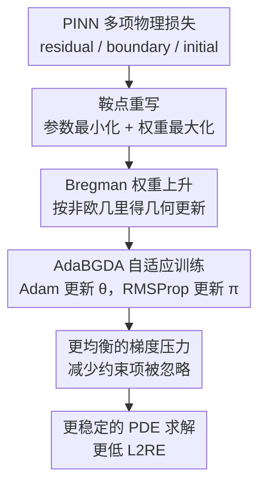

# Enhancing Stability of Physics-Informed Neural Network Training Through Saddle-Point Reformulation

**会议**: ICLR 2026  
**OpenReview**: [https://openreview.net/forum?id=EQNp3sFrY3](https://openreview.net/forum?id=EQNp3sFrY3)  
**代码**: https://anonymous.4open.science/r/pinns-bgda-00D6  
**领域**: PINN训练 / Scientific ML  
**关键词**: 物理信息神经网络、鞍点优化、损失重加权、Bregman散度、科学机器学习  

## 一句话总结

这篇论文把 PINN 训练中的残差项、边界项等多目标损失重加权改写为非欧几里得的非凸-强凹鞍点问题，并用 AdaBGDA 动态更新网络参数和损失权重，在 PINNacle 的 22 个 PDE 基准与 3D Navier-Stokes 挑战实验中显著提升训练稳定性和 L2 相对误差。

## 研究背景与动机

**领域现状**：Physics-Informed Neural Networks（PINNs）的基本思路是用神经网络 $u(\theta)$ 近似 PDE 的解，再把方程残差、边界条件、初始条件都写进训练损失。相比有限差分、有限元、有限体积等传统数值方法，PINN 的吸引力在于推理阶段可以很快给出近似解，尤其适合需要反复查询、快速插值或和学习系统结合的科学计算场景。

**现有痛点**：PINN 的训练并不稳定。标准做法通常最小化所有物理约束项的加权和，例如内部 PDE residual loss 与 boundary loss 的总和，但总损失下降并不等于每一项都被同等解决。实际训练中，不同损失项的梯度范数可能相差几个数量级，优化器会被梯度大的项牵着走，导致模型只拟合边界、忽略域内方程，或者反过来只压低内部残差、边界条件学得很差。

**核心矛盾**：PINN 训练真正需要的是在多个物理约束之间保持“公平”的优化压力，而不是提前固定一组权重。已有 LRA、NTK、RAR、MultiAdam、augmented Lagrangian 等方法都在尝试调整损失权重或采样策略，但不同 PDE 的损失地形差异很大，一个方法在 Poisson 上合适，换到 Heat、Wave 或 Navier-Stokes 时就可能失效。因此，优化器选择本身变成了按问题调参的负担。

**本文目标**：作者希望用一个统一的训练重写来解决两件事：第一，自动抬高被低估的物理约束项，让各个 residual/boundary 目标都能获得足够更新；第二，让这种动态重加权有清晰的优化解释和收敛保证，而不是只靠经验规则。

**切入角度**：论文观察到 PINN 的损失项权重天然处在一个有约束的集合里，最典型的是 unit simplex：每个权重非负，总和为 1。这样的空间不适合简单欧氏梯度步，因为权重的相对变化比绝对变化更重要。于是作者把网络参数 $\theta$ 看成最小化变量，把损失权重 $\pi$ 看成最大化变量，用 Bregman divergence（实验中主要对应 KL 几何）来描述权重空间。

**核心 idea**：用“网络参数下降 + 损失权重上升”的非欧几里得鞍点优化替代固定加权 ERM，使训练过程自动关注当前最难满足、最容易被忽略的物理约束项。

## 方法详解

### 整体框架

本文不是提出新的 PDE 离散格式，也不是换一个更大的 PINN 架构，而是重写 PINN 的训练目标。传统 PINN 直接最小化 $\sum_m L_m(\theta)$ 或人工加权的 $\sum_m \pi_m L_m(\theta)$；本文改成在训练中同时更新 $\theta$ 和 $\pi$，让模型参数去降低加权物理误差，让权重变量去寻找当前更难被满足的约束项。

形式上，作者把残差项和边界项统一记作 $M$ 个损失分量 $L_m(\theta)$，再求解下面的 saddle-point objective：

$$
\min_{\theta \in \mathbb{R}^d}\max_{\pi \in S}
L(\theta, \pi)
= \sum_{m=1}^{M}\pi_m L_m(\theta) - \lambda D_\psi(\pi\|\hat{\pi}).
$$

其中 $S$ 通常是 unit simplex，$\hat{\pi}$ 是参考分布，通常取均匀权重，$D_\psi$ 是 Bregman divergence，$\lambda$ 控制权重能偏离均匀分布多远。直观地说，如果某个 PDE residual 或 boundary condition 还没有被压下去，它对应的损失项会在最大化步里得到更大权重；如果权重过度集中，Bregman 正则会把它拉回合理范围。

### 关键设计

**1. 鞍点重写：把损失平衡从外部调参变成训练变量**

PINN 的不稳定性来自多个物理约束项之间的竞争：每个 $L_m(\theta)$ 都代表一个必须满足的方程或边界条件，但普通加权和只给出一个整体方向。当某一项的梯度巨大时，优化器会优先服务它；当某一项梯度很小但误差仍然重要时，它可能长期被忽略。本文的第一步是把权重 $\pi$ 从人工超参数变成对抗变量，让训练目标变成 $\min_\theta \max_\pi L(\theta,\pi)$。

这个最大化不是为了让训练变难，而是为了让被低估的损失项重新进入优化视野。如果某个约束项当前误差较大，$\nabla_\pi L$ 会推动它的权重上升；随后 $\theta$ 的下降步会更强地优化这一项。这样，训练过程不再依赖“Poisson 用 LRA、Wave 用 NTK、Navier-Stokes 用 Adam”这类问题级经验选择，而是在每次迭代里根据各项物理约束的状态自适应调整。

**2. Bregman 权重上升：用 simplex 的几何约束避免权重更新失真**

权重 $\pi$ 通常位于 simplex 上，非负且和为 1。若直接做欧氏上升或普通投影，更新容易忽略“相对比例”这一事实：从 $0.01$ 到 $0.02$ 与从 $0.40$ 到 $0.41$ 的绝对变化相近，但优化含义完全不同。因此作者使用 Bregman proximal mapping 来更新权重：

$$
\pi_{t+1}=\arg\min_{\pi\in S}
\left\{-\gamma_\pi\langle \nabla_\pi L(\theta_t,\pi_t),\pi\rangle + D_\psi(\pi,\pi_t)\right\}.
$$

当 $D_\psi$ 取 KL divergence 时，这一步可写成类似 softmax 的闭式更新。它的好处是两层的：一方面，权重始终留在合法 simplex 内；另一方面，更新尊重概率分布的几何，尤其适合表达多个损失项之间的相对重分配。论文还加入 $-\lambda D_\psi(\pi\|\hat{\pi})$，防止最大化步把所有权重推到单个损失项上，从而保持“关注困难项”与“不过度偏科”之间的稳定平衡。

**3. 非凸-强凹理论：利用权重侧的强凹性给训练动态可解释性**

神经网络参数 $\theta$ 对应的损失地形仍然是非凸的，作者并不试图把 PINN 训练说成凸优化。关键在于，给定 $\theta$ 后，关于 $\pi$ 的目标因为 Bregman 正则变成 $\lambda$-strongly concave，因此每个 $\theta$ 都有唯一的最佳权重响应 $\pi^*(\theta)$。论文据此把问题分析为 nonconvex-strongly concave saddle-point problem。

理论上，作者定义 $\Phi(\theta)=L(\theta,\pi^*(\theta))$，并用 $\|\nabla\Phi(\theta)\|\le \epsilon$ 表示收敛到 saddle-point 意义下的近似 stationary point。核心引理证明了当前权重 $\pi_t$ 到最佳响应 $\pi^*(\theta_t)$ 的 Bregman 距离会随迭代收缩，只要参数步长足够小、权重步长选择合理。最终 BGDA 达到 $\epsilon$-stationary 的迭代复杂度为

$$
O\left(\frac{\kappa^4L\Delta + \kappa^2L^2D_\psi(\pi^*(\theta_0),\pi_0)}{\epsilon^2}\right),
$$

其中 $\kappa=L/\lambda$。这个结论不是为了给实际深网训练一个完全紧的界，而是说明该重写不是纯 heuristic：权重上升步并不会无限追逐噪声，而是在非欧几里得几何下跟随最佳权重响应。

**4. AdaBGDA 实用化：参数侧用 Adam，权重侧用 RMSProp**

理论算法 BGDA 足够简单：$\theta$ 做梯度下降，$\pi$ 做 Bregman 上升。但深度网络训练的损失地形复杂，实际版本 AdaBGDA 引入自适应统计。作者在参数侧使用 Adam 式一阶、二阶动量来平滑 $\nabla_\theta L$，因为 $\theta$ 的非凸地形更需要稳定方向；在权重侧则使用 RMSProp 式二阶缩放来处理 $\nabla_\pi L$，因为 $\pi$ 侧已经由强凹结构约束，沿当前梯度更直接地更新更合适。

这个组合不是随意拼接。论文在 Poisson 2d-C 上比较了 Adam+RMSProp、Adam+Adam、RMSProp+RMSProp 三种自适应组合，Adam+RMSProp 的 L2RE 为 $8.15\times10^{-3}$，明显优于 Adam+Adam 的 $4.45\times10^{-2}$ 和 RMSProp+RMSProp 的 $6.02\times10^{-1}$。这说明 AdaBGDA 的实用版本确实把“参数侧复杂非凸”和“权重侧强凹 simplex”区别对待，而不是简单套一个通用 optimizer。

### 一个完整示例

可以把 Poisson 2d-C 的训练想成两个主要约束在拉扯：内部 PDE residual $L_r(\theta)$ 和边界条件 $L_b(\theta)$。若使用普通 NTK 重加权，论文观测到梯度范数比值 $\chi=\|\nabla L_r(\theta)\|/\|\nabla L_b(\theta)\|$ 在早期就达到非常高的量级，前 $0$ 到 $10000$ epoch 的均值约为 $2487$，后续仍保持在 $2342$、$1998$ 左右。这意味着训练更新几乎被内部项主导，边界项很难获得公平优化。

使用 AdaBGDA 时，同样的比值在三个训练阶段的均值约为 $7$、$25$、$45$。训练并不是强行让所有梯度完全相等，而是避免某一类物理约束长期压倒另一类。权重变量 $\pi$ 会把注意力转向被低估的项，参数变量 $\theta$ 随后根据新的加权损失更新。最终，在 Poisson 2d-C 的 error heatmap 中，NTK 模型在域内部出现明显高误差区域，而 AdaBGDA 的误差分布更均匀，这正是“权重最大化步”在实际训练中的可视化结果。

### 损失函数 / 训练策略

本文的基础 PINN 损失仍由 PDE 残差项和边界/初始条件项组成，只是训练目标从静态求和变为动态鞍点形式。对每个方程残差项，损失可理解为采样点上的均方 residual：

$$
L_{r,i}(\theta)=\frac{1}{N_r}\sum_{n=1}^{N_r}\left(R_i[u(\theta)](x_r^n)-f_i(x_r^n)\right)^2.
$$

边界项同理：

$$
L_{b,j}(\theta)=\frac{1}{N_b}\sum_{n=1}^{N_b}\left(B_j[u(\theta)](x_b^n)-g_j(x_b^n)\right)^2.
$$

训练中，vanilla PINN 实验使用 5 层、每层 hidden size 100 的网络。AdaBGDA 的主要初始超参数为 $\gamma_\pi^0=0.1$、$\gamma_\theta^0=0.008$、$\alpha_1^0=0.9$、$\alpha_2^0=0.999$、$\beta^0=0.999$、$\lambda=0.01$，并将 $\gamma_\theta$ 线性衰减到 $0.0004$。在 3D Navier-Stokes 的 DoMINO 挑战实验中，作者改用 $\gamma_\theta^0=0.002$、$\lambda=0.1$，训练 500 epochs 并将 $\gamma_\theta$ 线性衰减到约 $0.001$。

## 实验关键数据

### 主实验

论文首先在 PINNacle 的 22 个 PDE benchmark 上比较 AdaBGDA 与 Adam、LBFGS、LRA、NTK、RAR、MultiAdam 等方法，指标是 3 次运行的 mean L2 relative error（L2RE）。整体结果是 AdaBGDA 在 $77.3\%$ 的 PDE 上取得最好结果，而第二强方法的 dominant 比例只有 $27.3\%$。

| PDE 类别 | 代表任务 | 之前最佳 L2RE | AdaBGDA L2RE | 主要结论 |
|----------|----------|---------------|--------------|----------|
| Poisson | 2d-C | $1.14\times10^{-2}$ | $8.15\times10^{-3}$ | 在 NTK 已很强的 Poisson 上继续降低误差 |
| Heat | 2d-MS | $1.74\times10^{-2}$ | $1.40\times10^{-2}$ | 在多尺度热方程上略优于 LBFGS |
| Navier-Stokes | 2d-C | $4.67\times10^{-2}$ | $2.35\times10^{-2}$ | 误差约减半，说明平衡项对流体方程有效 |
| Wave | 1d-C | $9.20\times10^{-2}$ | $1.63\times10^{-2}$ | 相对提升最明显，优于 NTK 很多 |
| High dim | PNd | $4.69\times10^{-4}$ | $1.31\times10^{-4}$ | 高维问题上也能改善稳定性 |

更完整的 Table 3 显示，AdaBGDA 并非在所有 PDE 上都赢。例如 Burgers 2d-C、Heat 2d-VC、Heat 2d-LT 这类任务上它不是最优或整体误差仍然很大。作者的解释是，部分困难任务中 vanilla PINN 架构本身表达能力不足，优化器只能缓解训练偏置，不能弥补模型容量和表示形式的根本限制。

### 消融实验

论文的消融重点有三类：自适应组合、梯度冲突、计算开销。自适应组合验证了参数侧 Adam 与权重侧 RMSProp 的必要性；梯度冲突实验解释了为什么 AdaBGDA 更稳；计算开销实验则说明额外权重更新并没有让方法变成重型二阶优化器。

| 实验设置 | 关键指标 | 结果 | 说明 |
|----------|----------|------|------|
| Adam+RMSProp | Poisson 2d-C L2RE | $8.15\times10^{-3}$ | 最佳组合，参数侧平滑、权重侧按当前梯度调节 |
| Adam+Adam | Poisson 2d-C L2RE | $4.45\times10^{-2}$ | 权重侧也用 Adam 时效果变差 |
| RMSProp+RMSProp | Poisson 2d-C L2RE | $6.02\times10^{-1}$ | 参数侧缺少 Adam 动量后训练明显失败 |
| NTK 梯度比 $\chi$ | $I_1/I_2/I_3$ 均值 | $2487/2342/1998$ | residual 与 boundary 梯度严重失衡 |
| AdaBGDA 梯度比 $\chi$ | $I_1/I_2/I_3$ 均值 | $7/25/45$ | 失衡大幅缓解，训练更公平 |
| Burgers 1d-C 时间 | 每 1000 iter | $7.64$s | 比 Adam 的 $8.24$s 还略低，明显低于 NTK/LRA/LBFGS |
| Burgers 1d-C 显存 | optimizer states | $0.37$GB | 高于 Adam 的 $0.23$GB，但远低于 SSBroyden/NNCG |

作者还做了可扩展性实验：在 DrivAerML 单车几何上，用 38M 参数的 DoMINO 模型求 3D incompressible Navier-Stokes，比较 Adam、LBFGS 与 AdaBGDA。AdaBGDA 在 x/y/z velocity 和 volume pressure 上均明显优于基线，surface pressure 与 Adam 接近。这说明 saddle-point 重加权不是只对小 MLP PINN 有效，在较大科学机器学习模型上也能保留“多约束平衡”的收益。

| 3D Navier-Stokes 指标 | Adam L2RE | LBFGS L2RE | AdaBGDA L2RE | 观察 |
|-----------------------|-----------|------------|--------------|------|
| x-velocity | $3.39\times10^{-1}$ | $3.62\times10^{-1}$ | $2.78\times10^{-1}$ | AdaBGDA 最优 |
| y-velocity | $8.60\times10^{-1}$ | $9.56\times10^{-1}$ | $5.99\times10^{-1}$ | 提升明显 |
| z-velocity | $7.16\times10^{-1}$ | $8.23\times10^{-1}$ | $5.34\times10^{-1}$ | 提升明显 |
| volume pressure | $4.55\times10^{-1}$ | $4.88\times10^{-1}$ | $2.89\times10^{-1}$ | 压力场也受益 |
| surface pressure | $2.71\times10^{-1}$ | $3.42\times10^{-1}$ | $2.69\times10^{-1}$ | 与 Adam 基本持平，略优 |

### 关键发现

- AdaBGDA 的主要收益不是来自更复杂的模型，而是来自更稳定的训练动力学；在相同 vanilla PINN 架构下，它能让多个 PDE residual/boundary 约束获得更均衡的优化压力。
- 梯度冲突分析是论文最有说服力的解释实验：NTK 的 $\chi$ 长期在几千量级，而 AdaBGDA 把它压到几十量级，说明方法确实在处理 PINN 的核心失败模式。
- 计算开销控制得很好。由于 simplex 上 KL-Bregman 上升步常有闭式形式，而且权重数量通常只有几个到十几个，额外 optimizer state 相比 40K 参数的 PINN 或 38M 参数的 DoMINO 都很小。
- 方法并非万能。对于 vanilla PINN 架构本身难以表达的长时间、多尺度或复杂动力系统，AdaBGDA 仍可能得到较大误差；它解决的是训练公平性，不是所有 PDE 表示难题。

## 亮点与洞察

- 论文把 PINN loss balancing 解释成一个自然的 minimax 问题，而不是把权重更新写成一条经验公式。这一点很重要，因为 PINN 的多损失项并不是普通多任务学习里的松散任务，而是同一个物理解必须同时满足的约束集合。
- 非欧几里得几何用得比较贴切。simplex 上的权重本来就是分布，KL/Bregman 更新比欧氏投影更符合“相对权重调整”的直觉，也解释了为什么 dual-dimer 这类欧氏 saddle-point 版本不如本文稳定。
- 实验没有只停留在表格刷榜，而是用梯度范数比和误差热图解释了性能来源。对于 PINN 论文来说，这比单纯列 22 个 PDE 的 L2RE 更有价值，因为它直接对应了社区长期讨论的 gradient pathology。
- AdaBGDA 的工程成本低。它不需要计算完整 NTK Jacobian，不需要二阶近似，也不需要复杂内外循环；如果代码里已经把各个 residual/boundary loss 分开记录，加入一个权重变量和 Bregman 更新并不难。
- 这篇论文给 Scientific ML 的启发是：很多“物理约束训练不稳”的问题可能不该只从采样点、网络结构或 PDE 特定 trick 入手，也可以从约束项之间的 game dynamics 入手。

## 局限与展望

- 理论分析仍依赖 smoothness、强凹正则等理想条件，这些条件在真实深度网络里只能近似成立。论文用经验收敛曲线说明理论趋势合理，但这不等于严格覆盖实际 PINN 的全部非光滑和自动微分误差问题。
- 实验中的权重集合和 Bregman divergence 主要围绕 simplex/KL 几何展开。对于更多物理约束、更复杂层级约束，或者需要保留某些约束最低权重的场景，$S$ 与 $D_\psi$ 如何选择仍需要系统研究。
- AdaBGDA 缓解的是 loss term imbalance，但对采样点覆盖不足、PDE 刚性、长时间积分误差、网络表达能力不足等问题帮助有限。Heat 2d-LT、NS 2d-LT、Wave 2d-MS 等任务仍显示 vanilla PINN 的结构短板。
- 论文的 challenge-test 只固定了 DrivAerML 中一个 vehicle geometry。若要证明在工程 CFD 中真正通用，还需要更多几何、边界条件、Reynolds number 和数据规模下的测试。
- 后续可以把 AdaBGDA 和 residual-based adaptive refinement、domain decomposition、operator learning 架构结合起来，让“采样哪里”和“优化哪个约束”同时自适应，而不是只调 loss 权重。

## 相关工作与启发

- **vs LRA / NTK weighting**: LRA 和 NTK 都试图根据梯度统计或 kernel 信息调整损失权重，但它们通常是面向 PINN 的经验型重加权机制。本文把权重更新纳入 saddle-point objective，并用 Bregman 几何给出统一解释；优势是更稳、更便宜，劣势是仍需要选择 $\lambda$、$\gamma_\pi$ 等超参数。
- **vs RAR**: RAR 主要通过 residual-based adaptive refinement 改变训练点分布，关注“在哪里采样更多点”。AdaBGDA 关注“哪个物理约束项该被更重视”。两者并不冲突，未来很适合组合：RAR 负责空间/时间点，AdaBGDA 负责约束项权重。
- **vs AL-PINN**: AL-PINN 用 augmented Lagrangian 把边界或初始条件作为约束处理，同样带有 saddle-point 味道。本文的差异是对所有损失项做 simplex 权重最大化，并强调非欧几里得 Bregman 更新；实验中 AdaBGDA 在更多 PINNacle 任务上优于 AL-PINN。
- **vs dual-dimer**: dual-dimer 也把 PINN 训练写成 minimax，但更偏欧氏几何。本文与它的对比说明，权重空间的几何不是细节；当 $\pi$ 是分布时，KL/Bregman 更新能避免稀疏或失真的权重跳变。
- **对 Scientific ML 的启发**: 多物理场、多边界、多任务 PDE 学习里，损失项之间的冲突可能是常态。把 loss balancing 作为有结构的优化问题，而不是每篇论文手调一套权重，是更可迁移的路线。

## 评分

- 新颖性: ⭐⭐⭐⭐☆ 将 PINN loss balancing 系统改写为非欧几里得 nonconvex-strongly concave SPP，思路清晰且和权重 simplex 几何匹配，不过 minimax/自适应权重的大方向已有相关工作。
- 实验充分度: ⭐⭐⭐⭐⭐ 覆盖 22 个 PINNacle PDE、多种 baseline、梯度冲突、计算开销、超参数鲁棒性和 3D Navier-Stokes challenge-test，证据链比较完整。
- 写作质量: ⭐⭐⭐⭐☆ 论文结构从动机、理论到实验推进顺畅，表格和分析充分；不足是理论附录较长，AdaBGDA 若能给更多实现细节会更方便复现。
- 价值: ⭐⭐⭐⭐⭐ 对 PINN 训练稳定性这个长期痛点给出低开销、可解释、可扩展的优化方案，尤其适合作为 Scientific ML 代码库里的通用 loss balancing baseline。

<!-- RELATED:START -->

## 相关论文

- [\[ICLR 2026\] Fast training of accurate physics-informed neural networks without gradient descent](fast_training_of_accurate_physics-informed_neural_networks_without_gradient_desc.md)
- [\[ICLR 2026\] Iterative Training of Physics-Informed Neural Networks with Fourier-enhanced Features](iterative_training_of_physics-informed_neural_networks_with_fourier-enhanced_fea.md)
- [\[NeurIPS 2025\] Score-informed Neural Operator for Enhancing Ordering-based Causal Discovery](../../NeurIPS2025/physics/score-informed_neural_operator_for_enhancing_ordering-based_causal_discovery.md)
- [\[ICLR 2026\] A Function-Centric Graph Neural Network Approach for Predicting Electron Densities](a_function-centric_graph_neural_network_approach_for_predicting_electron_densiti.md)
- [\[ICLR 2026\] Feedback-driven Recurrent Quantum Neural Network Universality](feedback-driven_recurrent_quantum_neural_network_universality.md)

<!-- RELATED:END -->
