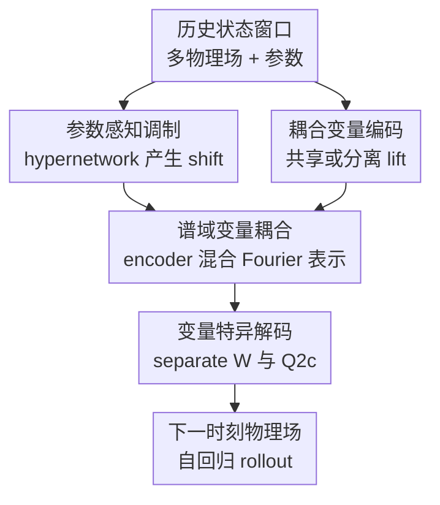

# Extending Fourier Neural Operators for Modeling Parameterized and Coupled PDEs

**会议**: ICLR2026  
**OpenReview**: [https://openreview.net/forum?id=rtUT5Wic10](https://openreview.net/forum?id=rtUT5Wic10)  
**代码**: 无  
**领域**: 物理科学 / 神经算子 / 参数化 PDE  
**关键词**: Fourier Neural Operator, 参数化 PDE, 耦合系统, 谱域耦合, 等离子体模拟  

## 一句话总结

这篇论文在 Fourier Neural Operator 上做了两类很克制的结构扩展：用轻量 hypernetwork 把物理参数注入每层隐表示，用 Fourier 域 encoder-decoder 混合多个物理场，从而在参数化、耦合 PDE 预测中显著降低误差，同时基本保住 FNO 的模型规模和训练效率。

## 研究背景与动机

**领域现状**：神经算子（Neural Operator）已经成为 PDE surrogate modeling 里的主流路线之一。它学习的是函数到函数的映射，不是固定维度样本到标签的映射，因此很适合替代昂贵的数值求解器，用在参数扫描、实时预测、工程设计和不确定性分析等场景。Fourier Neural Operator（FNO）尤其常见，因为它通过 Fourier 空间里的谱卷积捕获长程相互作用，在很多时间依赖 PDE 上兼顾了精度和效率。

**现有痛点**：很多神经算子工作默认初始条件、边界条件或物理参数都会变化，模型可以从输入轨迹窗口里“猜到”系统状态差异。但工程中常见的情况恰好更窄也更难：初始条件固定，真正改变动力学的是材料参数、反应速率、驱动电压、扩散系数这类物理参数。此时如果只把过去若干帧输入 FNO，模型可能在窗口足够长时隐式推断参数；一旦可用历史变短，参数信息就变得稀薄，非参数化 FNO 很容易退化。

**核心矛盾**：参数化 PDE 需要模型显式感知物理参数，耦合 PDE 又要求不同物理量之间发生交互；但直接为每个参数生成一整套 FNO 权重，或者为每个物理量维护一套复杂分支，会迅速增加参数量、训练开销和实现复杂度。论文的核心张力是：如何在不放弃 FNO 简洁性的前提下，让模型同时知道“当前是哪组物理参数”和“多个物理场如何互相影响”。

**本文目标**：作者把目标拆成两个问题。第一，给定物理参数 $\mu$，FNO 的内部状态应该如何被条件化，而不是只在输入端拼接参数。第二，对于电子密度/电势、化学物种浓度、温度/组分等耦合变量，FNO 应该在哪里交换跨变量信息，才能既捕获耦合关系又不把结构做得很重。

**切入角度**：作者选择从 FNO 的三个核心组件入手：lift operator $P$、Fourier layers、projection operator $Q$。这个切入点比较务实，因为它没有推翻 FNO，而是逐个检查输入投影、谱更新、输出投影这些位置是否该共享、分离或混合。参数化部分则借鉴 hypernetwork/modulation 思路，只让一个小网络产生层内偏移，不让 hypernetwork 生成整套大权重。

**核心 idea**：用“层内参数调制 + Fourier 域变量耦合”替代“只拼接参数或堆多分支模型”，把参数依赖和跨物理量交互都放在 FNO 最有表达力、又相对省参数的位置上。

## 方法详解

### 整体框架

论文提出的模型族可以理解为两条扩展线叠在标准 FNO 上。参数化线把物理参数 $\mu$ 送入轻量 hypernetwork，得到每个 Fourier layer 的 shift $s_\ell(x, \mu)$，在隐表示更新时作为参数相关 bias 加进去；耦合线把多个变量各自 Fourier transform 后，在谱域用 encoder-decoder 混合，再分解回各变量对应的谱系数。最终作者把这套组合称为 extended FNOs，即 FNOx；加上输入参数拼接是 pFNOx，加上 hypernetwork shift 调制是 hpFNOx。

标准 FNO 的一层通常可以写成 $v_{\ell+1}(x)=\sigma(Wv_\ell(x)+(K(a;\phi)v_\ell)(x))$。本文的 hpFNO 在这个更新里加入参数相关项：$v_{\ell+1}(x)=\sigma(Wv_\ell(x)+(K(a;\phi)v_\ell)(x)+s_\ell(x,\mu))$。对耦合变量，FNOx 不在空间域反复交换 hidden states，而是在 Fourier 空间先聚合多个变量的谱表示，再通过共享的谱卷积和 decoder 分发回每个变量。

在实验配置里，FNOx 的默认组合来自消融：共享 lift operator、变量分离的 point-wise linear map、耦合的 global spectral convolution，以及 projection 端变量分离的 basis 和 coefficients，并在投影前激活上加 layer norm。论文正文写成 $P1+L2+\mathcal{G}+Q2c$，实现细节里也说明所有 FNO 基线都固定为 4 个 Fourier layers、modes $k=12$、width $d_v=20$，这样性能差异主要来自结构设计而不是容量堆叠。

### 关键设计

**1. 参数感知调制：让物理参数影响每一层动力学，而不生成整套 FNO 权重**

最直接的参数化办法是把 $\mu$ 当成额外通道拼到输入里，得到 $[a(x);\mu(x)]$，这就是 pFNO。这个办法实现简单，也确实能改善一部分任务，但参数只在 lift 阶段进入网络，后续每层是否持续使用参数信息完全依赖隐表示自己保留。对于固定初始条件、动力学由参数主导的系统，这种一次性输入拼接往往不够直接。

hpFNO 的做法更像条件调制：轻量 hypernetwork 接收 $(x,\mu)$ 以及历史窗口信息，输出层相关的 shift $s_\ell(x,\mu)$，然后把它作为每个 Fourier layer 里的 additive bias。这样核心 FNO 权重仍然共享，模型学到的是一套跨参数的“基础物理算子”，而不同参数只通过小的层内扰动改变隐状态演化。它和 HyperFNO 的差别也在这里：HyperFNO 会用 hypernetwork 生成 lift/projection、point-wise map、spectral kernel 等较大权重子集；本文只调制激活，表达力略克制，但参数效率和训练稳定性更好。

**2. 谱域变量耦合：把跨物理量交互放到 Fourier 空间里完成**

耦合 PDE 的关键不是把两个变量简单拼起来，而是让变量之间在长期、全局尺度上交换信息。论文考虑两个变量 $\alpha,\beta$ 时，先分别得到 $\tilde v^\alpha(k)=\mathcal{F}v^\alpha_\ell(k)$ 和 $\tilde v^\beta(k)=\mathcal{F}v^\beta_\ell(k)$，再用浅层 encoder $f_{enc}(\tilde v^\alpha(k),\tilde v^\beta(k))$ 聚合成耦合谱表示。经过 mode-wise kernel $R_\phi(k)$ 更新后，decoder $f_{dec}$ 再把耦合后的谱表示拆回每个变量，最后 inverse Fourier transform 回到数据空间。

这个位置选得很关键。若在空间域频繁交换 hidden states，模型会更重，也容易变成一堆特化分支；若只在输入端拼接变量，跨场交互可能被普通 FNO 当成多通道特征处理，缺少对物理耦合结构的显式归纳偏置。Fourier 域天然承载长程相关，许多 PDE 的全局模式也更容易在谱空间表达，所以作者把变量混合放在谱卷积前后，用一个轻量 encoder-decoder 给标准 FNO 加上跨变量通路。

**3. 变量特异解码：共享编码保持紧凑，分离局部演化和输出基函数保留物理差异**

FNOx 不是所有组件都分离，也不是所有组件都共享。作者系统比较了 lift $P$、point-wise map $W$、projection $Q$ 的共享/分离选项后，得到一个相对经济的组合：lift 用共享映射 $P1$，point-wise linear map 用变量分离 $L2$，projection 使用 $Q2c$，也就是 basis functions $\Psi$ 和 coefficients $\Xi$ 都按变量分离。

背后的理由是，输入投影阶段共享可以减少参数并让不同物理量进入统一 latent space；但在 Fourier layer 的局部线性变换和输出投影阶段，不同变量的局部演化规律与物理量纲可能明显不同，需要变量特异的通道来恢复各自场。作者还用 adaptive basis 视角解释 $Q$：若 $Qv_T(x)=W_2\sigma(W_1v_T(x)+b_1)+b_2$，则 $\Psi(a(x))=\sigma(W_1v_T(x)+b_1)$ 可看作自适应基函数，$\Xi=W_2$ 是输出系数。$Q2c$ 让基函数和系数都分离，给每个物理场保留独立的输出表示能力。

**4. 新 CCP benchmark：用固定初始条件下的等离子体动力学检验参数化神经算子**

论文不只在已有 Gray-Scott 反应扩散方程上验证，还构造了一个一维 capacitively coupled plasma（CCP）benchmark。这个系统描述交变电压驱动下的低温等离子体，目标变量包括电子密度 $n_e(x,t)$ 和电势 $\phi(x,t)$，方程含电子连续性方程与 Poisson 方程。作者固定几何和初始条件，改变反应系数 $R_0$、驱动电压 $V_0$、离子质量 $m_i$ 等物理参数，让模型必须学习参数如何改变动力学，而不是靠初始状态差异偷懒。

这个 benchmark 对本文方法很重要，因为它把“参数化”和“耦合”两个难点同时放在一个工程相关问题里。数据由有限差分求解器生成，空间离散为 128 cells，每个周期 100000 个时间步，再每 1000 步采样得到 100 个 temporal indices。每个参数场景采 100 条轨迹，训练/测试按 9:1 随机划分。这样的设置规模不算大，但足以暴露短历史窗口、参数外推和变量耦合下的模型差异。

### 损失函数 / 训练策略

所有模型都被训练成一步时间推进算子：给定过去 $T_{in}$ 个状态窗口 $\{u(t-\tau)\}_{\tau=0}^{T_{in}-1}$，预测下一步 $u(t+1)$。多步预测时采用自回归 rollout，把模型预测结果重新放回输入窗口。评价指标使用 relative $\ell_2$ error / nRMSE，表格里报告 5 个随机种子的均值和标准差；当 $T_{in}=2$ 或 $T_{in}=1$ 出现训练不稳定时，论文用 10 个随机种子训练并报告较好 5 次的平均。

训练实现基于 PyTorch 和原始 FNO 代码，主要实验在 NVIDIA A100 80GB 上完成。为了公平比较，FNOm、FNOc、FNOx 等 FNO 系列保持相同层数、modes 和 width；DeepONet、U-Net、多小波神经算子、CFNO/CMWNO、HyperFNO 等作为对照。论文没有强调新的损失函数，主要贡献来自模型结构和参数条件化方式。

## 实验关键数据

### 主实验

主实验最有代表性的是 1D CCP benchmark，因为它同时包含耦合变量和物理参数变化。表中数值越低越好；hpFNOx 在反应系数、驱动电压、离子质量三种单参数变化下都是最佳。

| 任务 / 参数变化 | 最强基线 nRMSE | FNOx | pFNOx | hpFNOx | 主要结论 |
|--------|------|------|------|------|------|
| CCP: reaction rate $R_0$ | CMWNO 0.0312 | 0.0193 | 0.0194 | **0.0154** | 谱域耦合已经明显优于耦合 NO 基线，hypernetwork shift 继续降误差 |
| CCP: driving voltage $V_0$ | HyperFNOc 0.0355 | 0.0345 | 0.0278 | **0.0192** | 参数调制在边界驱动变化下收益最大，hpFNOx 比 HyperFNOc 更稳 |
| CCP: ion mass $m_i$ | CMWNO 0.0241 | 0.0212 | 0.0142 | **0.0128** | 输入拼接也有效，但层内调制仍是最低误差 |
| Gray-Scott: feed rate $F$ | MWTc 0.0092 | 0.0075 | 0.0041 | **0.0022** | 在反应扩散耦合系统上，hpFNOx 相对最强基线降误差超过一半 |
| Gray-Scott: diffusion coefficient $\epsilon_1$ | CMWNO 0.0048 | 0.0039 | 0.0027 | **0.0022** | 对已有耦合 benchmark 也成立，不只适用于新 CCP 数据 |

短历史窗口实验进一步说明参数显式注入的意义。非参数化模型在 $T_{in}=10$ 时还能靠历史窗口隐式推断参数，但当窗口缩短到 2 或 1 时会明显失败；hpFNOx 仍保持在约 0.13 的误差水平。

| 模型 | $T_{in}=10$ | $T_{in}=5$ | $T_{in}=2$ | $T_{in}=1$ | 说明 |
|------|------|------|------|------|------|
| FNOc | 0.0375 | 0.1324 | 1.0048† | 1.4484† | 窗口太短时基本学不稳 |
| hpFNOc | 0.0196 | 0.0804 | 0.1515‡ | 0.1609‡ | 参数调制显著缓解短窗口退化 |
| FNOx | 0.0193 | 0.0406 | 1.2832† | 1.8143† | 仅耦合扩展不足以解决参数不可见问题 |
| pFNOx | 0.0194 | 0.0464 | 0.1640‡ | 0.2522‡ | 输入拼接能救回一部分短窗口性能 |
| hpFNOx | **0.0154** | **0.0317** | **0.1324‡** | **0.1372‡** | 层内调制在所有窗口下最好 |

### 消融实验

结构消融显示，FNOx 的提升不是来自随意增加复杂度，而是来自几个位置的组合选择。默认共享所有组件的设置误差为 0.0341；分离 point-wise map 后降到 0.0281；projection 端引入变量特异 basis/coefficients 并加 layer norm 后，最终 FNOx 达到 0.0193。

| 配置 | 关键指标 | 说明 |
|------|---------|------|
| $P1+L1+Q1$ | 0.0341 | lift、局部线性映射、projection 都共享，是最朴素的耦合 FNOx 版本 |
| $P1+L2+Q1$ | 0.0281 | 分离不同变量的 point-wise map 后，局部演化差异开始被建模 |
| $P1+L2+Q2a$ | 0.0259 | 分离输出 coefficients，说明 projection 端的变量特异性有价值 |
| $P1+L2+Q2b$ | 0.0315 | 只分离 basis 效果不如只分离 coefficients，二者作用不对称 |
| $P1+L2+Q2c$ | 0.0275 | basis 和 coefficients 都分离但不归一化时收益有限 |
| $P1+L2+Q2c$ + layer norm | **0.0193** | 最终 FNOx，说明变量特异 projection 需要稳定的归一化配合 |
| $P2+L2+Q2c$ + layer norm | 0.0204 | 再分离 lift 没有继续改善，反而略差于共享 lift |

参数调制消融也很有意思。作者尝试了 shift only、weight+shift、scale+shift 和带幅度控制的 scale-$\eta$+shift。朴素乘性 scale 会严重不稳定，例如 reaction term 下误差到 0.5037，ion mass 下甚至到 0.8550；用 $\gamma_\ell(x,\mu)=1+\eta\tanh(\tilde\gamma_\ell(x,\mu))$ 限幅后，scale-0.1 或 scale-0.5 能在部分场景超过 shift only，但需要调 $\eta$。所以主文选择 shift-only 是一个偏稳健的工程折中。

### 关键发现

- hpFNOx 的收益在短历史窗口下最明显。长窗口时，非参数化 NO 可以从过去状态里隐式恢复一部分参数信息；窗口变短后，这条路径失效，显式参数调制就变成核心优势。
- 谱域耦合比“多变量直接拼接”更有效。FNOx 在不加参数化的情况下已经超过 FNOc、FNOm、CFNO、CMWNO 等多种基线，说明跨变量交互的位置选择本身有贡献。
- 论文强调效率，不只报误差。Figure 4、Figure 16、Figure 19 都显示 FNOx/pFNOx/hpFNOx 在模型大小和每 epoch 时间上没有明显牺牲；这点对 surrogate modeling 很关键，因为替代数值模拟的模型不能靠巨大网络换精度。
- OOD 参数测试趋势合理：反应系数被扩展到训练范围外时，所有模型误差都会随参数远离训练区间而增大，但 FNOx 系列仍保持更低误差。作者没有夸张成 foundation model 式外推能力，而是把它定位为平滑参数外推分析。
- 在更高维/更多变量 ADR 任务上，CFNO 和 CMWNO 不容易直接扩展到高阶耦合，论文只比较 FNOc、MWTc、DONc 等部分基线；结果显示 hpFNOx 相对 FNOc 约降误差 61%，但这个实验的表格数值主要以图示和百分比报告。

## 亮点与洞察

- **轻量调制比大 hypernetwork 更贴合 FNO**：这篇论文没有让 hypernetwork 生成整套 FNO 参数，而是只产生 layer-wise shift。这个选择很朴素，但对 PDE surrogate 很实用，因为工程场景里模型常常要在许多参数点上反复调用，参数效率和稳定性比极限表达力更重要。
- **耦合发生在 Fourier 域是一个好归纳偏置**：多物理量 PDE 的耦合往往不是局部像素级拼接能完全表达的，尤其是 Poisson 方程、电势场、反应扩散模式这类全局相关很强的系统。把变量混合放在谱空间，相当于在 FNO 最擅长的长程模式位置加入跨变量交互。
- **消融给出了可迁移的设计经验**：共享 lift、分离 point-wise map、分离 projection 的 basis/coefficients、配合 layer norm，这组结论不一定只属于 CCP。以后做多变量神经算子时，可以优先从这个结构组合开始，而不是盲目把所有变量都分支化。
- **新 benchmark 的问题设置很干净**：固定初始条件、改变物理参数的 CCP benchmark 能逼迫模型学习参数到动力学的映射，避免模型靠初始状态差异取巧。这对评估“参数化 neural operator”比许多混合变化数据集更有辨识度。
- **短窗口实验揭示了一个常被忽略的现实约束**：实际部署时不一定有很长历史轨迹可用，尤其是实时控制或冷启动预测。论文用 $T_{in}=1,2$ 的实验说明，参数条件化不是锦上添花，而可能是让模型从失败变可用的必要信息通道。

## 局限与展望

- 论文主要围绕 FNO 架构展开，虽然作者说思想可迁移到其他 neural operator，但没有系统验证在 Galerkin Transformer、UNO、PINO 或 foundation PDE 模型上的泛化效果。
- hpFNO 的 shift-only 调制稳健但表达力有限；附录显示乘性 gating 在部分场景能更好，但需要幅度控制和超参数搜索。未来可以研究更自动的调制幅度约束，避免每个 PDE 重新调 $\eta$。
- CCP 数据规模相对小，每个单参数场景 100 条轨迹、9:1 划分，适合结构比较，但还不能说明在大规模、多参数、高噪声工程仿真上的表现。
- 耦合扩展主要以两个变量讲清楚，ADR 虽涉及更多变量，但高阶耦合机制和复杂多物理场边界条件下的可扩展性还需要更充分的数值表格和消融。
- OOD 实验只是在参数区间边缘做平滑外推，不能等同于真正跨物理 regime 的泛化。对强非线性分岔、相变、冲击波或刚性更强的系统，模型可能需要不止结构调制，还需要物理约束或误差校正。

## 相关工作与启发

- **vs 标准 FNO**: 标准 FNO 用 Fourier layer 学函数空间映射，适合许多 PDE surrogate，但对物理参数和多变量耦合没有显式结构。本文保留 FNO 主体，只在内部调制和谱域耦合位置加最小改动，因此更像是 FNO 的参数化/耦合插件。
- **vs HyperFNO**: HyperFNO 用 hypernetwork 生成 FNO 的多组权重，条件化能力强但结构更重。本文的 hpFNO 只生成 $s_\ell(x,\mu)$ 这样的 shift，参数开销更小，在 CCP 实验里还明显优于 HyperFNOc-T/A。
- **vs CFNO / CMWNO**: CFNO 和 CMWNO 都面向耦合系统，但要么通过多个 FNO 交换 hidden representation，要么依赖 multiwavelet 结构。FNOx 的区别是把耦合集中到 Fourier 域 encoder-decoder，让跨变量交互和 FNO 的谱卷积天然对齐。
- **vs PINNs / 传统 surrogate modeling**: PINNs 直接把 PDE residual 写进训练目标，对方程约束友好但训练成本和优化稳定性常是问题。本文走数据驱动 neural operator 路线，不显式加入 PDE residual，优势是预测快、结构清晰；代价是需要高质量仿真数据，并且物理守恒/约束满足程度没有被单独保证。
- **启发**: 做参数化科学机器学习模型时，可以先问两个问题：参数是只该进输入，还是该调制每层动力学？变量耦合是该在空间域交换，还是在频域/模态域混合？这篇论文给出的答案并不复杂，却提供了可复用的结构化思考方式。

## 评分

- 新颖性: ⭐⭐⭐⭐ 参数调制和谱域耦合都不是凭空发明，但把它们以轻量、可消融的方式嵌入 FNO，并配合新 CCP benchmark，创新点清楚。
- 实验充分度: ⭐⭐⭐⭐ 主实验、短窗口、OOD、结构消融、调制消融和多个 PDE benchmark 都覆盖到了；不足是部分 ADR 结果以图和百分比为主，表格细节不够完整。
- 写作质量: ⭐⭐⭐⭐ 论文方法脉络清晰，组件设计空间解释得比较扎实；但符号和变体命名较多，主文与附录里 FNOx 默认组合表述略需要读者来回对照。
- 价值: ⭐⭐⭐⭐⭐ 对做 PDE neural operators 的读者很实用，尤其是固定初始条件、参数扫描、多物理量耦合这些工程场景；结构改动小，容易成为后续模型的默认 baseline 或插件。

<!-- RELATED:START -->

## 相关论文

- [\[ICLR 2026\] DRIFT-Net: A Spectral--Coupled Neural Operator for PDEs Learning](drift-net_a_spectral--coupled_neural_operator_for_pdes_learning.md)
- [\[ICML 2026\] EqGINO: Equivariant Geometry-Informed Fourier Neural Operators for 3D PDEs](../../ICML2026/physics/eqgino_equivariant_geometry-informed_fourier_neural_operators_for_3d_pdes.md)
- [\[ICLR 2026\] Adaptive Mamba Neural Operators](adaptive_mamba_neural_operators.md)
- [\[ICLR 2026\] CFO: Learning Continuous-Time PDE Dynamics via Flow-Matched Neural Operators](cfo_learning_continuous-time_pde_dynamics_via_flow-matched_neural_operators.md)
- [\[ICLR 2026\] Iterative Training of Physics-Informed Neural Networks with Fourier-enhanced Features](iterative_training_of_physics-informed_neural_networks_with_fourier-enhanced_fea.md)

<!-- RELATED:END -->
