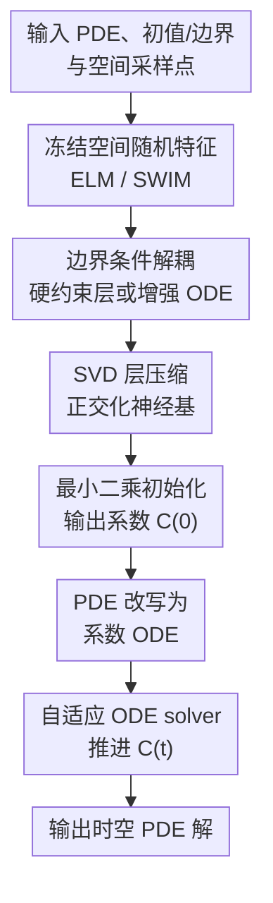

# Fast training of accurate physics-informed neural networks without gradient descent

**会议**: ICLR 2026  
**OpenReview**: [https://openreview.net/forum?id=3VdSuh3sie](https://openreview.net/forum?id=3VdSuh3sie)  
**代码**: https://gitlab.com/felix.dietrich/swimpde-paper；https://gitlab.com/fd-research/swimpde  
**领域**: 物理机器学习 / PINNs / 神经 PDE 求解  
**关键词**: 物理信息神经网络, PDE 求解, 无梯度训练, 随机特征, 时空分离

## 一句话总结

本文提出 Frozen-PINN，把 PINN 的空间基函数随机采样后冻结，再用最小二乘和自适应 ODE solver 推进随时间变化的输出层系数，从根上绕开梯度下降训练，在多类时间依赖 PDE 上同时获得更快训练、更高精度和显式时间因果性。

## 研究背景与动机

**领域现状**：PINN 的吸引力在于它用神经网络近似 PDE 解，并把 PDE 残差、初值条件和边界条件写进训练目标。相比传统网格法，它可以在点云上工作、天然 mesh-free，也比较容易用自动微分处理复杂算子；因此在科学机器学习、物理仿真代理模型和高维 PDE 中被广泛使用。

**现有痛点**：问题是，经典 PINN 的“训练”本身往往比求解 PDE 还难。网络参数多、PDE/初值/边界损失耦合在一起、损失地形非凸且病态，梯度下降需要在多个互相拉扯的目标之间慢慢找平衡。对含高阶导数、高频时间变化、冲击波或长时间滚动的 PDE，这种训练很容易慢、误差高，甚至完全失败。

**核心矛盾**：PINN 把时间当作额外空间维度输入网络，得到的是横跨整个时空域的基函数；但初值问题的物理结构是因果的，后一个时间步应从前一个时间状态演化而来。于是传统 PINN 一边想拟合全时空函数，一边又要满足局部时间演化规律，优化问题被人为放大，还失去了常规时间推进算法天然具备的 Markov 结构。

**本文目标**：作者想回答的问题不是“换一个更强 optimizer 能不能训好 PINN”，而是“能不能让 PINN 不再依赖梯度下降训练”。具体来说，方法需要保留 neural basis 的 mesh-free 和高维表达优势，同时把初值、边界和 PDE 残差解耦，并让时间推进由显式 ODE 系统完成。

**切入角度**：Frozen-PINN 的观察是，PDE 解未必可分离为单个空间函数乘单个时间函数，但可以用一组只依赖空间的基函数线性组合表示，组合系数随时间变化。只要空间基函数足够好，真正需要随时间演化的就不是全网络参数，而是一小组输出层系数。

**核心 idea**：用“冻结的空间随机特征 + 时间系数 ODE”替代“全网络参数梯度下降”，把 PINN 从一个大规模非凸多目标优化问题改写成采样、最小二乘和经典 ODE 求解的组合。

## 方法详解

### 整体框架

Frozen-PINN 针对时间依赖 PDE $u_t + Lu + \gamma N(u)=f$ 构造一个单隐层网络，但只让输出层系数随时间变化。给定空间采样点和 PDE，方法先采样空间基函数，按需要加入边界约束层，再用 SVD 压缩/正交化这些基，最后通过最小二乘得到 $C(0)$，并把 PDE 代入 ansatz 后得到关于 $C(t)$ 的 ODE，用 RK45、LSODA 等自适应 ODE solver 推进到测试时间。

形式上，论文使用

$$
\hat u(x,t)=C(t)[\Phi(x),1]=c(t)\sigma(Wx^\top+b)+c_0(t),
$$

其中 $W,b$ 是只依赖空间的隐藏层参数，采样后保持冻结；$C(t)=[c(t),c_0(t)]$ 是随时间变化的输出层参数。与普通 PINN 最大的差别是：训练不再反复更新 $W,b,C$，而是把 $C(t)$ 当作状态变量，交给由 PDE 推导出来的 ODE 系统演化。

### 关键设计

**1. 时空分离的 Frozen-PINN ansatz：把训练对象从全网络参数缩成时间系数**

传统 PINN 的网络输入是 $(x,t)$，隐藏层基函数本身覆盖整个时空域；一旦 PDE 有高频时间振荡或长时间演化，网络需要同时学空间形状和时间传播，优化很容易卡住。Frozen-PINN 改为只构造空间基函数 $\phi_m(x)=\sigma(w_mx^\top+b_m)$，解写成这些空间基的时间变系数组合。这样不是假设 PDE 解严格可分离，而是假设一组空间基可以张成足够好的近似空间，时间变化由系数轨迹 $C(t)$ 承担。

这个设计直接降低了问题维度：内部权重不再训练，输出层初值由线性最小二乘确定，后续动态由 ODE solver 推进。对初值问题来说，这比“在整个时空盒子里一次性拟合函数”更接近数值 PDE 的常规思路，也天然保留了时间因果结构。

**2. ELM / SWIM 冻结空间随机特征：用采样代替反向传播学习基函数**

Frozen-PINN 给空间基函数提供两种采样方式。ELM 是 data-agnostic 的：权重从高斯分布采样，bias 从区间 $[-\eta,\eta]$ 采样，适合解比较光滑、没有局部陡峭结构的 PDE。SWIM 是 data-dependent 的：用两个空间采样点 $x^{(1)},x^{(2)}$ 构造方向和偏置，让 tanh 基函数的过渡区域落在域内，并沿 $x^{(1)}\to x^{(2)}$ 的方向变化。

SWIM 的意义在 Burgers 方程这类有 shock 的问题上尤其明显。普通随机基或 Fourier/Chebyshev 基可能在冲击附近产生振荡，且无法控制陡峭基函数落在哪里；SWIM 可以根据解的梯度或重采样点对，把更多局部陡峭基放到 shock 区域。论文还在反应扩散例子中用初值梯度投影点对，让基函数对齐真正变化的低维方向，从而在 5 维空间里只捕捉解实际变化的两个内在维度。

**3. 损失解耦与系数 ODE：用最小二乘和时间推进替代多目标 PINN loss**

经典 PINN 的总损失通常是 $L_{PDE}$、$L_{IC}$、$L_{BC}$ 的加权和，训练时必须调 loss weight，还会遇到不同项收敛速度不一致的问题。Frozen-PINN 先把初值单独解掉：在空间 collocation 点 $X$ 上，用

$$
C(0)=u(X,0)^\top[\Phi(X),1]^+
$$

拟合初始状态。然后把 ansatz 代入 PDE，把 $u_t$ 写成 $C_t(t)[\Phi(X),1]$，并把右侧空间算子、非线性项和 forcing 都整理成 $R(X,C(t))$，得到

$$
C_t(t)=R(X,C(t))[\Phi(X),1]^+.
$$

这一步是整篇论文最关键的“去梯度下降”动作：PDE residual 不再作为一个要靠 backprop 最小化的损失，而是变成时间系数的显式演化方程。线性 PDE 给出线性或近线性 ODE，非线性 PDE 的非线性则进入 ODE 右端；求解器可以用步长控制处理 stiffness 和精度需求。

**4. 边界处理与 SVD 层：让 ODE 系统既满足约束又不至于太大太病态**

边界条件如果继续作为 soft loss，会重新引入传统 PINN 的耦合优化问题。论文给出两种处理方式：能构造解析变换时，用 boundary-compliant layer，把基函数线性变换成天然满足周期边界、零 Dirichlet 或简单 Neumann 条件的外层基；如果边界复杂或条件难以写成硬约束，则把边界点加入增强 ODE，例如对 Dirichlet 条件加入 $\hat u_t(x)=-\kappa(\hat u(x)-g(x))$，让边界值以速率 $\kappa$ 被拉回目标边界。

最后的 SVD 层解决的是另一个现实问题：冻结基函数数量大时，输出系数 ODE 维度高、矩阵条件数差，ODE solver 会慢甚至僵硬。作者对边界处理后的特征矩阵做截断 SVD，用 $A_r=V_r^\top A$ 得到正交化、压缩后的神经基。它不是为了改变表达形式，而是为了把“有很多冗余随机基”的系统压成更小、更好条件的 ODE；实验中可把 ODE 维度压缩最高约 20 倍，并带来最高约 75 倍训练加速。

### 一个完整示例

以一维 advection 方程 $u_t+\beta u_x=0$ 为例，普通 PINN 会输入 $(x,t)$ 并通过梯度下降同时压低 PDE、初值和周期边界残差。当 $\beta$ 很大时，真实解 $u(x,t)=\sin(x-\beta t)$ 在时间方向变化极快，PINN 的全时空基函数很难拟合这种高频动态。

Frozen-PINN 的流程会更像一个数值时间推进器：先在 $x\in[0,2\pi]$ 上采样空间点，构造 ELM 或 SWIM 的 $\Phi(x)$，再用周期边界兼容层得到满足边界的基；接着用最小二乘把 $u(x,0)=\sin x$ 投影到这些基上，得到 $C(0)$。代入 advection 方程后，$u_x$ 只需要对空间基求导，ODE 变成

$$
C_t(t)=-\beta C(t)[\Phi_{A_r}(X)]_x[\Phi_{A_r}(X)]^+.
$$

之后 ODE solver 从 $t=0$ 推到目标时间，最后计算 $\hat u(x,t)=C(t)\Phi_{A_r}(x)$。读者可以把它理解为：Frozen-PINN 先学出一组空间形状，再让这些形状的系数沿着 PDE 指定的方向流动，而不是让一个大网络在全时空域里反复试错。

### 损失函数 / 训练策略

Frozen-PINN 没有传统意义上的反向传播训练 loss。它的“训练策略”由三类数值步骤组成：第一，采样隐藏层参数并冻结；第二，通过最小二乘拟合初始条件，其中伪逆/`rcond` 的截断会影响初值拟合精度；第三，用 ODE solver 推进 $C(t)$，并由 SVD cutoff $\epsilon_{SVD}$ 控制精度和速度的 trade-off。

实验默认常把最小二乘的 `rcond` 和 SVD cutoff 设成相同数量级，例如 $10^{-12}$。附录中的消融表明，如果 SVD cutoff 太大，会丢掉重要奇异方向、降低精度；如果太小，则 ODE 系统更大、更 stiff，速度下降。作者给出的经验是：高精度场景用 $\epsilon_{SVD}\le 10^{-13}$，中等精度快速求解可用更大的 cutoff，而 $10^{-12}$ 常是速度和精度之间的稳健折中。

## 实验关键数据

### 主实验

论文在低维、高维、非线性、复杂边界、shock、混沌和长时间滚动等多个 PDE benchmark 上比较 Frozen-PINN、普通 PINN、Causal PINN、若干已有 PINN 变体，以及 IGA/FEM 等传统网格法。核心结论不是某一个数据集上快一点，而是 Frozen-PINN 在大多数神经 PDE baseline 面前同时更快、更准，并且很多实验只用 CPU 即可完成。

| PDE / 场景 | 指标 | 本文方法 | 对比方法 | 结论 |
|--------|------|------|----------|------|
| Advection, $\beta=40$ | 相对 $L_2$ / 时间 | Frozen-PINN-swim: $8.42\times10^{-9}$, 0.7s | Causal PINN: $2.90$, 357.63s；PINN(L-BFGS): $6.92\times10^{-1}$, 30.5s | 高速输运下普通 PINN 基本失败，Frozen-PINN 兼具高精度和数百倍速度优势 |
| Euler-Bernoulli beam | 相对 $L_2$ / 时间 | Frozen-PINN-elm: $2.82\times10^{-4}$, 0.05s；高精度 $9.33\times10^{-9}$, 6.90s | PINN(Adam): $3.95\times10^{-2}$, 4209.82s；PINN(L-BFGS): $4.21\times10^{-3}$, 2303.71s | 高阶空间/时间导数不再通过 backprop 反复计算，速度差距达到四到五个数量级 |
| Wave equation 多尺度 | 相对 $L_2$ / 时间 | Frozen-PINN-elm: $1.81\times10^{-6}$, 0.56s | FBPINN: $5.91\times10^{-1}$, 3090s+；NTK PINN: $9.79\times10^{-2}$, 840s+ | 多频解上 Frozen-PINN 比 GPU 训练的 PINN 变体快数百到数千倍且更准 |
| Burgers shock | 相对 $L_2$ / 时间 | Frozen-PINN-swim: $1.00\times10^{-3}$, 0.52s；高精度 $2.27\times10^{-7}$, 5.25s | Causal PINN: $1.60\times10^{-2}$, 1531.79s；PINN(L-BFGS): $3.88\times10^{-3}$, 275.2s | SWIM 重采样能把陡峭基函数放在 shock 附近，高精度下仍比强 PINN optimizer 快数百倍 |
| 100-d heat equation | 相对 $L_2$ / 时间 | Frozen-PINN-elm: $4.12\times10^{-4}$, 0.13s（主表低精度） | PINN(Adam+L-BFGS): $4.98\times10^{-3}$, 26.25s+ | 高维热方程中网格法不可行，Frozen-PINN 比 GPU PINN 快约 200 倍且误差更低 |

### 消融实验

| 配置 / 消融 | 关键指标 | 说明 |
|------|---------|------|
| Burgers: SVD layer vs no SVD | 有 SVD: 316 个 ODE 维度、141.5s、相对误差 $3.34\times10^{-4}$；无 SVD: 500 维、989.84s、$3.28\times10^{-4}$ | SVD 基本不损精度，但带来约 7 倍速度提升 |
| Nonlinear diffusion: SVD layer | Frozen-PINN-elm-accurate 有 SVD: 60.98s、$6.49\times10^{-8}$；无 SVD: 7087.38s、$1.02\times10^{-6}$ | 压缩和改善条件数对 ODE solver 很关键，速度提升约 52 倍 |
| Reaction-diffusion: SWIM projection | Frozen-PINN-swim projection: $9.99\times10^{-5}$；普通 SWIM: $5.70\times10^{-3}$；ELM: $1.67\times10^{-2}$ | 用初值梯度投影点对后，基函数对齐解的低维变化方向，精度提升两个数量级 |
| SVD cutoff 扫描 | $\epsilon_{SVD}<10^{-10}$ 时性能较稳；较大 cutoff 更快但可能误差上升或 blow-up | cutoff 控制“保留多少奇异方向”，本质是速度-精度旋钮 |
| 初值最小二乘 `rcond` | `rcond` 过大时初值误差和完整时空误差同步变大 | Frozen-PINN 虽然不做梯度训练，但初值投影必须足够准，否则 ODE 会传播初始误差 |

### 关键发现

- Frozen-PINN 的最大收益来自把 PINN 训练改写成数值时间推进：PDE residual 不再是待最小化的 soft loss，而是 $C(t)$ 的演化方程，因此高阶导数和多 loss 权重不再造成同样的 backprop 负担。
- ELM 和 SWIM 不是谁绝对更好：光滑解、高维热方程等场景 ELM 往往更合适；shock、局部陡峭梯度、低维流形结构明显的解更适合 SWIM 或带投影/重采样的 SWIM。
- SVD 层是工程上很关键的加速器。随机基函数很多时，直接推进全部输出系数会让 ODE 系统大而病态；截断 SVD 把冗余基方向剪掉后，常能在同等误差量级下显著减少时间。
- 与 FEM/IGA 相比，Frozen-PINN 在低维光滑问题上精度接近经典数值法，在复杂几何和高维问题上保留了 mesh-free 与维度扩展优势；但它并没有宣称全面替代成熟网格法。

## 亮点与洞察

- **从优化问题改成演化问题**：这篇论文最巧的地方不是提出一个新的 loss，而是直接取消了大部分非凸训练。PINN 的痛点常被归因于 optimizer 不够强，本文则指出真正可疑的是把初值问题做成全时空非凸拟合。
- **时间因果性是结构，不是正则项**：Causal PINN 等方法用时间权重软性鼓励早期时间先拟合好，Frozen-PINN 则通过 $C(t)$ 的 ODE 推进让因果性自然出现。这种区别很重要，因为物理约束如果能放进参数化结构，就不必再靠调权重“祈祷”训练学到。
- **随机特征在科学计算里被重新定位**：ELM/SWIM 在这里不是廉价 baseline，而是构造空间试探函数的方式。把随机特征和 ODE solver、最小二乘、SVD 结合后，它更像 mesh-free spectral/Galerkin 方法与 PINN 的混合体。
- **可迁移到其他神经科学计算框架**：任何“空间结构复杂但时间演化明确”的问题，都可以借鉴这种只让少量系数随时间演化的思路。例如 Hamiltonian neural networks、neural Galerkin、reduced-order modeling、operator data generation 都可能受益于类似的冻结基 + 系数动力学设计。

## 局限与展望

- 该方法需要已知 PDE 形式和算子，主要解决 forward solve；如果 PDE 本身未知或只有观测数据，仍需额外的系统辨识或 inverse problem 机制。不过作者也指出，快速 forward solve 可以反过来服务 inverse problem。
- 空间复杂性仍是下一步难点。论文展示了复杂二维几何和高维热方程，但像 Navier-Stokes 这类空间结构、边界、湍流尺度都更复杂的问题，可能需要 domain decomposition 或更强的自适应采样。
- 冻结空间基函数会遇到 Kolmogorov n-width barrier。SWIM 重采样可以在 shock 场景缓解这个问题，但什么时候、如何重采样，是否有通用理论，论文还没有完全解决。
- 方法依赖多个数值超参，如 hidden width、collocation 点、SVD cutoff、ODE tolerance、增强边界项的 $\kappa$。这些参数比 PINN loss weight 更可解释，但实际使用中仍需要针对 PDE 调整。
- 对强非线性和混沌系统，论文更多展示了模式层面的合理性；严格 trajectory-level 误差在混沌系统中本来就不稳定，后续可以增加统计量、守恒量或谱性质层面的评估。

## 相关工作与启发

- **vs 经典 PINN**: 经典 PINN 通过反向传播最小化 PDE/初值/边界残差的加权和；Frozen-PINN 把初值用最小二乘处理，把 PDE 变成时间系数 ODE，把边界尽量硬约束或放入增强 ODE。区别在于前者是全参数非凸训练，后者是采样 + 线性代数 + ODE solver。
- **vs Causal PINN**: Causal PINN 通过时间权重让早期时间残差影响后续训练，仍然是在优化 loss；Frozen-PINN 直接按时间推进 $C(t)$，因果性来自问题重写本身。前者更像给 PINN 加训练策略，后者更像改变求解器范式。
- **vs ELM / randomized neural PDE methods**: 既有 ELM 类方法也冻结隐藏层，但常把时间当输入一起拟合，基函数跨全时空域。Frozen-PINN 只冻结空间基，让时间系数演化，因此在高频时间动态和长时间模拟中更稳。
- **vs Neural Galerkin / reduced-order modeling**: Neural Galerkin 会让更多网络参数随时间变化，ODE 系统维度更大；Frozen-PINN 只推进最后一层系数，更轻量。它的代价是表达能力更依赖固定空间基质量，因此需要 SWIM、重采样和 SVD 来补足。
- **vs FEM / IGA**: FEM/IGA 有扎实理论和高精度，低维规则问题上仍非常强；Frozen-PINN 的优势是 mesh-free、易处理点云/复杂域，并在高维问题上避免网格维度灾难。实际应用中更合理的启发是把它看作传统数值方法与 PINN 之间的桥，而不是单纯替代其中一边。

## 评分

- 新颖性: ⭐⭐⭐⭐⭐ 把 PINN 训练从梯度下降改成冻结空间基 + 系数 ODE，是对 PINN 求解范式的实质性重构。
- 实验充分度: ⭐⭐⭐⭐⭐ 覆盖 advection、beam、wave、Burgers、nonlinear diffusion、reaction-diffusion、Kuramoto-Sivashinsky 和高维 heat 等多类 PDE，并有 SVD、width、sampling、cutoff 等消融。
- 写作质量: ⭐⭐⭐⭐ 方法主线清楚，主文和附录给了较完整推导；但表格和 benchmark 很密，读者需要一定数值 PDE 背景才能快速消化。
- 价值: ⭐⭐⭐⭐⭐ 对 PINN 社区很有冲击力：它不是再调一个 loss，而是提醒大家很多 PINN 训练困难可以通过更贴近 PDE 结构的参数化直接绕开。

<!-- RELATED:START -->

## 相关论文

- [\[ICLR 2026\] Iterative Training of Physics-Informed Neural Networks with Fourier-enhanced Features](iterative_training_of_physics-informed_neural_networks_with_fourier-enhanced_fea.md)
- [\[ICLR 2026\] Enhancing Stability of Physics-Informed Neural Network Training Through Saddle-Point Reformulation](enhancing_stability_of_physics-informed_neural_network_training_through_saddle-p.md)
- [\[ICLR 2026\] From Cheap Geometry to Expensive Physics: A Physics-agnostic Pretraining Framework for Neural Operators](from_cheap_geometry_to_expensive_physics_a_physics-agnostic_pretraining_framewor.md)
- [\[ICML 2025\] Differentiable Stellar Atmospheres with Physics-Informed Neural Networks](../../ICML2025/physics/differentiable_stellar_atmospheres_with_physics-informed_neural_networks.md)
- [\[ICLR 2026\] Uncertainty-Aware Diagnostics for Physics-Informed Machine Learning](uncertainty-aware_diagnostics_for_physics-informed_machine_learning.md)

<!-- RELATED:END -->
