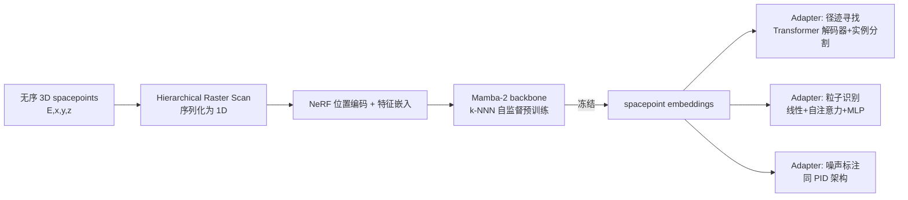

# FM4NPP: A Scaling Foundation Model for Nuclear and Particle Physics

**会议**: ICLR 2026  
**OpenReview**: [https://openreview.net/forum?id=qaI3cLFsiX](https://openreview.net/forum?id=qaI3cLFsiX)  
**代码**: 待确认  
**领域**: AI for Science / 粒子物理探测器数据 / 基础模型  
**关键词**: Foundation Model, Self-supervised Learning, Particle Physics, Mamba/SSM, Neural Scaling Law, Track Finding  

## 一句话总结
把"大模型自监督预训练 + 冻结权重 + 轻量 adapter"的范式第一次成功搬到稀疏、3D 点云式的对撞机探测器数据上：用 Mamba 在 1000 万次碰撞事件上自监督预训练出最大 1.88 亿参数的基础模型 FM4NPP，冻结后接小适配器就能在径迹寻找、粒子识别、噪声标注三个下游任务上全面超越专用模型，并展现出清晰的神经缩放规律。

## 研究背景与动机

**领域现状**：大语言/视觉模型证明了"海量无标注数据 + 自监督 + 可缩放架构"能学出通用表征，科学界因此兴起"科学基础模型"热潮。但进展集中在数据形态接近语言/图像的领域（气象的连续时空场、高能物理里已被聚合成稠密矩阵的 jet）。

**现有痛点**：实验核物理与粒子物理（NPP）的底层探测器数据天生不适配这套范式——它是**稀疏、无序、三维空间点（spacepoint）**的集合：一次碰撞产生几百到几千个带能量与坐标 $(E,x,y,z)$ 的点，没有天然的序列顺序，也没有现成的自监督任务定义。传统做法上，GNN 适合稀疏数据但受 oversmoothing 限制难以放大；Transformer 自注意力是二次复杂度，面对超长点序列吃不消。

**核心矛盾**：一方面 NPP 实验（如 RHIC 上 2023 年投运的 sPHENIX，仅 TPC 就有 4160 万体素、产生 85% 数据量）能轻松产出海量无标注数据；另一方面没人知道该怎么给这种稀疏数据设计自监督目标、用什么架构、缩放规律长什么样、冻结表征能否真正迁移到下游并打败专用算法。

**本文目标**：回答两个问题——(a) NPP 基础模型**能否缩放**（更大模型/数据是否持续提升）；(b) 冻结表征**能否泛化**到多个差异很大的下游任务。

**核心 idea**：
- **序列化是钥匙**：提出 Hierarchical Raster Scan 把无序 3D 点序列化为既保留径迹局部连续、又保留全局向外传播结构的 1D 序列，从而能用线性复杂度的 Mamba。
- **几何感知的自监督目标**：用 k-Next-Nearest-Neighbor（k-NNN）预测代替"下一个点预测"，让目标与粒子物理传播方向对齐、且避开自回归里的信息泄漏。
- **冻结 FM + 轻量 adapter**：预训练一次，下游只训练几十万到几百万参数的小适配器。

## 方法详解

### 整体框架
FM4NPP 是两阶段范式：**阶段一**在 1000 万碰撞事件上用 k-NNN 自监督预训练一个 Mamba backbone（最大 1.88 亿参数）；**阶段二**冻结 backbone，针对径迹寻找、粒子识别（PID）、噪声标注三个任务各接一个轻量 adapter。整条管线的前提是先把无序 3D 点云序列化成 Mamba 能吃的 1D 序列。

### 关键设计

**1. Hierarchical Raster Scan：在"全局向外流"与"局部径迹连续"之间走钢丝。** 这是整套方法的物理先验入口。难点在于一个好的序列化必须同时满足两个互相打架的目标：粒子径迹整体从碰撞点向外辐射（全局结构），而同一条径迹上的点又要在序列里彼此挨着（局部连续）。空间填充曲线（Hilbert、Z-order）只顾空间局部性，会把不同径迹的点交错混在一起、破坏轨迹连贯；单纯按半径排序保住了向外的流向，却把同一径迹的点撒得到处都是。作者的解法是先把点从笛卡尔坐标换到更贴合对撞机对称性的柱极坐标 $(r,\phi,\eta)$（$r$ 半径、$\phi$ 方位角、$\eta$ 赝快度），再做两级排序：**inter-box**把空间切成 $6\times8\times8$ 的 3D 网格盒子（$r$ 轴对齐 TPC 物理层边界，$\eta/\phi$ 用频率分箱保证点分布均衡），按盒子几何中心的 $(r,\phi,\eta)$ 从内向外排；**intra-box**在每个盒子内按半径 $r$ 排序（大致就是粒子传播方向）。把盒内序列按盒间顺序拼起来，就得到了同时保住局部连续与全局递进的 1D 序列。消融里 Hilbert 序列化让三个任务都明显变差（径迹 ARI 相对差距增大 9.1%），证明"轨迹一致"比"纯空间局部"更重要。

**2. Mamba-2 backbone + NeRF 式输入嵌入：用线性复杂度扛住超长点序列。** 由于一次事件点数巨大、序列很长，作者放弃二次复杂度的自注意力，选用选择性状态空间模型 Mamba-2——它通过让内部状态矩阵随输入变化（selection 机制）动态聚焦相关信息、过滤噪声，并借结构化状态空间对偶（SSD）做到线性时间与硬件友好。每个 spacepoint 当作一个 token，输入映射借鉴 NeRF 走双通路：能量特征 $E$ 投影成 $d_{model}$ 维特征嵌入，空间坐标 $(r,\phi,\eta)$ 先过高频正余弦位置编码函数 $\gamma(\cdot)$ 再投影成 $d_{model}$ 维位置嵌入，两者逐元素相加得到既含属性又含位置的 token 向量。模型宽度从 64 一路放大到 1536，对应 0.34M→188M 参数。

**3. k-Next-Nearest-Neighbor（k-NNN）自监督目标：把预测从"序列下一个"解耦成"几何下一个"。** 自监督任务必须与序列顺序解耦，否则模型只会学到序列化本身的人造规律。直接预测最近邻在自回归框架里又会泄漏已见过的点信息。k-NNN 的做法是：对任意查询点 $s_i$，只在它的"下一邻域" $N_c(s_i)=\{s_j\in E \mid r_j>r_i\}$（半径更大的点，即更外侧、尚未在序列中出现的点）里预测 $k$ 个最近点，天然对齐粒子向外传播且无泄漏。设预测 $\hat Y_i=\{\hat y_{i,1},\dots,\hat y_{i,k}\}$ 与真值 $Y_i=\{y_{i,1},\dots,y_{i,k}\}$ 均按距离升序，损失为

$$L_i = \frac{1}{k}\sum_{m=1}^{k}\lVert \hat y_{i,m}-y_{i,m}\rVert_2^2$$

$k$ 越大几何视野越宽、任务越难。消融显示 $k=30$ 优于 $k=1/5$（太小只看到极局部几何），也优于普通 next-token 预测——几何感知邻域比通用自回归学到的表征更可迁移。

**4. 轻量下游 adapter：冻结表征 + 单层线性"探针"。** FM 的点级特征先经**单个线性层**压缩重排到低维（既做任务对齐过滤，又作为评估 FM 表征任务相关性的探针）。径迹寻找借鉴全景分割：初始化 $N$ 个可学 track query，过 $L$ 层 Transformer 解码器（交叉注意力从点嵌入聚合信息、附加注意力掩码、query 间自注意力），输出 track 嵌入与分类分数 $\hat y_n$，点-query 分配概率 $\hat p_{in}$ 取点嵌入与 track 嵌入内积的 sigmoid；训练用匈牙利算法匹配真值径迹，匹配损失 $L_{match}^{(j,n)}=\lambda_{dice}L_{dice}+\lambda_{focal}L_{focal}+\lambda_{cls}L_{cls}$，推理时每点取 $n_i^*=\arg\max_n(\hat p_{in}\cdot\hat y_n)$。PID 与噪声标注共用更简单的"线性投影 + 单层自注意力 + MLP 分类"结构，仅约 0.74M 参数。

## 实验关键数据

### 主实验表格

**径迹寻找**（FM4NPP 用最大 m6 模型，10 个随机种子平均；冻结 FM + 2.39M adapter）：

| 模型 | 可训练参数 | ARI↑ | efficiency↑ | purity↑ |
|------|-----------|------|-------------|---------|
| EggNet | 0.16M | 0.726 | 74.2% | 75.1% |
| Exa.TrkX | 3.86M | 0.877 | 91.8% | 66.4% |
| HEPT | 0.31M | 0.831 | 81.2% | 78.0% |
| AdapterOnly（无预训练） | 2.39M | 0.724 | 78.0% | 64.5% |
| **FM4NPP(m6)** | 2.39M | **0.945** | **96.1%** | **93.1%** |

对比官方 sPHENIX 重建管线（Cellular Automaton 播种 + Kalman 滤波，限定 $p_T>1$ GeV、$|\eta|<1.1$、TPC 内 ≥20 点的长径迹）：FM4NPP 径迹效率 **99.6%** vs sPHENIX **94.6%**。

**粒子识别（PID）与噪声标注**（FM4NPP adapter 仅 0.74M 参数）：

| 模型 | 参数 | PID acc.↑ | PID recall↑ | PID pre.↑ | Noise acc.↑ | Noise recall↑ | Noise pre.↑ |
|------|------|-----------|-------------|-----------|-------------|---------------|-------------|
| SAGEConv（最佳 GNN） | 0.91M | 0.726 | 0.456 | 0.650 | 0.917 | 0.723 | 0.817 |
| OneFormer3D | 44.95M | 0.770 | 0.490 | 0.577 | 0.965 | **0.940** | 0.895 |
| AdapterOnly | 0.74M | 0.663 | 0.339 | 0.611 | 0.911 | 0.622 | 0.836 |
| **FM4NPP(m6)** | 0.74M | **0.904** | **0.765** | **0.878** | **0.971** | 0.937 | **0.919** |

PID 上全面碾压；噪声标注上用 0.74M 参数打平 45M 的 OneFormer3D。

### 消融实验表格

（用第二大模型 m5，括号为"到完美性能剩余差距"的相对增大量）

| 消融项 | Noise(Acc.) | PID(Acc.) | Track(ARI) |
|--------|-------------|-----------|------------|
| Next-token（vs k-NNN） | −0.0010 (4.6%) | −0.0023 (2.5%) | −0.0009 (1.6%) |
| k=1（vs k=30） | −0.0012 (5.7%) | −0.0049 (5.3%) | −0.0019 (3.3%) |
| k=5（vs k=30） | −0.0007 (3.6%) | −0.0016 (1.7%) | −0.0003 (0.5%) |
| Hilbert（vs Raster Scan） | −0.0014 (7.0%) | −0.0075 (8.0%) | −0.0051 (9.1%) |

三个设计点（k-NNN、较大 k、Hierarchical Raster Scan）都被验证有效，其中**序列化策略影响最大**。

### 关键发现
- **清晰的神经缩放规律**：验证 MSE 对模型参数量、训练数据量、计算 FLOPs 三个轴都呈幂律下降（log-log 直线），与 LLM 的 Kaplan/Chinchilla 缩放律一致；m6（188M）出现疑似饱和。
- **下游随 FM 增大而单调变好**：同一冻结表征，FM 越大三个下游任务全部提升。
- **数据高效**：标注越少，预训练增益越大——径迹 ARI 相对 AdapterOnly 在少标注区增益 **2.9×**，多标注区 1.3×。
- **表征任务无关 + 单线性可特化**：冻结表征是 task-agnostic 的，靠一个线性映射即可特化到不同下游。
- µ-parameterization 让在 m3 调出的学习率 $2\times10^{-4}$ 零样本迁移到所有模型尺寸。

## 亮点与洞察
- **范式迁移的"第一步"做得很扎实**：不是简单套 LLM，而是针对稀疏 3D 点云的三大痛点（无序→序列化、长序列→Mamba、无标签任务→k-NNN）逐一给出物理先验驱动的解，且每一步都有消融背书。
- **比官方物理管线还强**：径迹效率 99.6% vs 94.6% 是很有说服力的"AI 打败手工算法"证据，且是在底层 spacepoint 上直接做、不依赖高层径迹或量能器输入。
- **参数效率惊人**：0.74M adapter 打平 45M 的 OneFormer3D，说明价值真的沉淀在冻结表征里。
- **开放基准的贡献**：1000 万事件 + 三个带标注下游任务，把"基础模型缩放研究"在 NPP 领域的基础设施补上了。

## 局限与展望
- **只在单一探测器（sPHENIX）上验证**：要变成跨探测器、跨设施（LHC 等）的"通用 FM"还有距离。
- **m6 出现缩放饱和**：188M 处性能 plateau，更大模型是否还有收益、饱和原因未深究。
- **下游任务仍偏分割类**：径迹寻找/PID/噪声标注本质都是点级分类/分割，回归型或事件级物理量预测尚未验证。
- **k-NNN 仍是"部分缓解"泄漏**：作者自己用 partially 一词，自监督目标设计还有打磨空间。
- 实际部署到高吞吐在线触发环境（latency、计算预算）的工程问题留待后续。

## 相关工作与启发
- **科学基础模型**：气象的 Aurora、高能物理 jet 层面的 OmniJet-α / OmniLearned——但它们的数据都偏稠密/结构化，本文专攻"底层稀疏探测器数据"这块硬骨头。
- **可缩放架构**：Transformer（二次复杂度受限）、MoE（专家不均衡）、SSM/Mamba（线性复杂度）——本文选 Mamba-2 正是看中长序列效率。
- **NPP 任务方法**：传统 Kalman 滤波径迹重建、GNN 类 Exa.TrkX/EggNet、Transformer 类 HEPT、SSM 类跟踪模型——多在 O(1M) 参数；本文把规模拉大两个数量级并系统研究缩放。
- **启发**：对任何"无序、稀疏、带几何先验"的科学数据（材料科学、单细胞组学、点云），"物理先验驱动的序列化 + 几何感知自监督 + 冻结表征 + 轻量探针"是一条可复用的基础模型化路线。

## 评分
- 新颖性: ⭐⭐⭐⭐ 首次把可缩放自监督基础模型范式系统迁移到稀疏底层探测器数据，序列化与 k-NNN 目标都是为该数据形态量身定制，思路新且自洽。
- 实验充分度: ⭐⭐⭐⭐ 三轴缩放律 + 三任务多基线 + 对官方物理管线对比 + 数据效率 + 消融齐备；扣分在仅单探测器、缺事件级/回归任务。
- 写作质量: ⭐⭐⭐⭐ 动机—挑战—设计—证据链条清晰，图表（缩放曲线、架构图）到位，叙述好读。
- 价值: ⭐⭐⭐⭐ 为 NPP 提供开放基准 + 可超越官方管线的实用模型 + 一条可推广到其他稀疏科学数据的基础模型化方法论，落地与方法价值兼具。

<!-- RELATED:START -->

## 相关论文

- [\[AAAI 2026\] Towards a Foundation Model for Partial Differential Equations Across Physics Domains](../../AAAI2026/physics/towards_a_foundation_model_for_partial_differential_equations_across_physics_dom.md)
- [\[ICML 2025\] OmniArch: Building Foundation Model For Scientific Computing](../../ICML2025/physics/omniarch_building_foundation_model_for_scientific_computing.md)
- [\[ICLR 2026\] Physics-Informed Inference Time Scaling for Solving High-Dimensional Partial Differential Equations via Defect Correction](physics-informed_inference_time_scaling_for_solving_high-dimensional_partial_dif.md)
- [\[ICLR 2026\] OXtal: An All-Atom Diffusion Model for Organic Crystal Structure Prediction](oxtal_an_all-atom_diffusion_model_for_organic_crystal_structure_prediction.md)
- [\[ICLR 2026\] Physics vs Distributions: Pareto Optimal Flow Matching with Physics Constraints](physics_vs_distributions_pareto_optimal_flow_matching_with_physics_constraints.md)

<!-- RELATED:END -->
