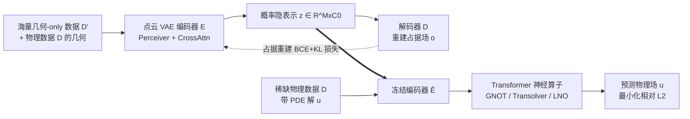

# From Cheap Geometry to Expensive Physics: A Physics-agnostic Pretraining Framework for Neural Operators

**会议**: ICLR 2026  
**OpenReview**: [https://openreview.net/forum?id=iCprPzyrRp](https://openreview.net/forum?id=iCprPzyrRp)  
**代码**: [https://github.com/zzzwoniu/Physics-agnostic-Operator-Pretraining](https://github.com/zzzwoniu/Physics-agnostic-Operator-Pretraining)  
**领域**: 科学计算 / 神经算子 / 自监督预训练  
**关键词**: Neural Operator, PDE Surrogate, Physics-agnostic Pretraining, Occupancy Field, Point Cloud VAE  

## 一句话总结
用大量"只有几何、没有物理标签"的廉价网格数据，通过占据场（occupancy）重建这一物理无关的自监督代理任务预训练一个点云 VAE，再把学到的几何隐表示喂给 Transformer 神经算子，在稀缺 PDE 标签下显著提升求解精度。

## 研究背景与动机
- **领域现状**：工业设计评估依赖对控制方程（PDE）的高保真仿真，精确但极其昂贵。神经算子（DeepONet、FNO、GNOT、Transolver、LNO 等）作为代理模型可快速预测 PDE 解，已成为加速设计空间探索的主流路径。
- **现有痛点**：神经算子的精度高度依赖带标签的 PDE 解，而这些标签必须由昂贵的数值求解器生成。已有的提效手段大多是 **physics-aware** 的——要么重建 PDE 解场注入归纳偏置，要么在相关 PDE 族上做大规模自回归预训练——它们仍然消耗 PDE 解标签，没有触及"求解贵"这个真正的计算瓶颈。
- **核心矛盾**：工业场景里候选几何（网格/点云）极其丰富且几乎零成本生成，但因为没有跑求解器，它们没有任何物理场标签，于是被标准算子学习流水线完全忽略——**最廉价、最丰富的资源恰恰被浪费**。
- **本文目标**：设计一个 **physics-agnostic（物理无关）预训练框架**，仅在监督训练阶段才需要 PDE 标签，把海量只有几何的数据 $D'$（$|D'|\gg|D|$）转化为对稀缺物理数据 $D$ 有用的几何表示，缓解算子学习长期存在的标签稀缺瓶颈。
- **核心 idea**：**用占据场重建作代理任务，把"学几何"和"学物理"两阶段解耦**——预训练只看几何、产出函数空间里的隐表示；算子学习只换输入（用隐表示替代原始点云），冻结编码器即可即插即用接入任意 Transformer 算子。

## 方法详解

### 整体框架
框架分两阶段：**阶段一**在 $D\cup D'$ 的所有几何上预训练一个点云 VAE，用一个可从网格零成本计算的代理场（默认占据场 $o$）作重建目标，学到几何隐表示；**阶段二**冻结编码器，把隐表示作为输入喂给 Transformer 神经算子，在稀缺的物理数据 $D$ 上用标准监督方式学习预测 PDE 解。关键在于代理任务完全不碰求解器，因此能吃下海量廉价几何。

### 关键设计

**1. 物理无关代理任务的三条选择准则：用占据场把"几何"翻译成"算子能听懂的语言"。** 作者明确提出代理任务必须同时满足三点——*计算高效*（可直接从网格/点云低成本算出，不碰求解器）、*与算子学习一致*（本身也是"从输入函数到某个场"的算子任务，自然桥接到物理场预测）、*采样不变*（同一底层几何的不同点云离散化应被等价对待）。综合考虑后选定**占据场** $o(z)\in\{0,1\}$：$o(z)=1$ 表示查询点 $z$ 落在物体内部，反之为 0。它把几何信息表达成一个定义在查询坐标上的场（与物理解 $u$ 同构），从而让"重建几何"和"预测物理"住在同一个函数空间里，避免了直接喂离散点云带来的信息损失。

**2. 点云 VAE：把不规则几何压成函数空间里的隐表示。** 编码器采用 Perceiver 架构，用一组固定数量 $M$ 的可学习 token $L$ 对点云做交叉注意力聚合 $m_k=\mathrm{CrossAttn}(L,\mathrm{PosEmb}(X_k))$，再经两个 MLP 投到概率隐空间得到均值/方差，按重参数化 $h_k^i=(h_\mu)_k^i+(h_\sigma)_k^i\cdot\epsilon,\ \epsilon\sim\mathcal N(0,1)$ 采样隐变量 $z\in\mathbb R^{M\times C_0}$。解码器在任意查询点上预测占据值 $o_k(z^i)=D(h_k)(z^i)$，因此隐表示**驻留在函数空间**而非固定网格。训练目标是占据重建的 BCE 加 KL 正则：
$$\min_{\phi,\eta}\frac{1}{|D\cup D'|}\sum_{k}\Big(\mathbb E_{z\sim p}\,\mathrm{BCE}(\tilde D_\eta(\tilde E_\phi(a_k))(z),o_k(z))+\lambda\cdot \mathrm{KL}(\mathcal N(h_\mu,h_\sigma)\,\|\,\mathcal N(0,1))\Big)$$
查询点采样融合两路：计算域上的均匀采样 $U(\Omega)$ 和对网格点加小扰动 $z^i=x^i+\varepsilon^i,\ \varepsilon\sim\mathcal N(0,\zeta I)$，前者覆盖全域、后者精修边界附近这一几何最关键的区域。与为规则网格/像素设计的 MAE 不同，这里用 Transformer 架构允许任意查询坐标，天然适配不规则几何。

**3. 冻结编码器即插即用接入算子：只换输入，不改算子本体。** 算子学习阶段把神经算子写成 $\tilde F_\theta(\tilde E_\phi(a_k))=u_k$，**只更新算子参数 $\theta$，编码器 $\tilde E_\phi$ 全程冻结**，目标是最小化归一化物理场上的相对 L2 误差：
$$\min_\theta \frac{1}{|D|}\sum_k \frac{\sqrt{\sum_i(\tilde F_\theta^i(\tilde E_\phi(a_k))-\hat u_k^i)^2}}{\sqrt{\sum_i(\hat u_k^i)^2}}$$
由于预训练编码器输出的是一组隐 token，可无缝塞进 GNOT 的 branch net、替换 Transolver 第一层 physics-attention、或接入 LNO 的 branch 分支，几乎不需改动算子结构。此外把占据值 $o_k^i$ 拼到查询坐标上一起输入（网格查询时占据恒为 1），并同时支持"网格点查询"与"均匀随机点查询"两种物理场查询策略。

**4. 误差分解视角解释为何有效（并支撑可换代理任务）。** 论文给出误差分解分析（Appendix B），把算子的预测误差拆出一项随无标签几何数量增加而可被压低的**表示误差**——这正是消融中"几何数据越多、隐表示越强、算子越准"现象的理论依据。基于"代理任务只要廉价、可表达为场、不预设具体 PDE"这一原则，框架是**即插即用**的：占据场是最通用直观的默认选择，而对 CFD 这类边界主导的问题，还可换成有向距离场（SDF）或最短向量场（SV）等更贴合的代理。

## 实验关键数据

### 主实验表格
四个数据集（Stress 2D、AirfRans near 2D、Inductor 3D、Electrostatics 2D）× 三个 Transformer 算子（GNOT / Transolver / LNO），报告归一化数据上的相对 L2 误差（$\times10^{-2}$，括号为三次独立实验标准差），KL 权重固定 0.001：

| 数据集 | 查询 | GNOT | G+VAE | Trans | T+VAE | LNO | L+VAE |
|---|---|---|---|---|---|---|---|
| Stress | Mesh | 9.8 | **9.0** | 11.5 | **11.2** | 26.5 | **13.6** |
| Stress | Random | 10.3 | **8.3** | 11.5 | **9.7** | 20.0 | **11.6** |
| AirfR(near) | Mesh | 6.8 | **5.6** | 13.4 | **12.7** | 27.4 | **27.1** |
| AirfR(near) | Random | 7.8 | **5.9** | 15.0 | **10.8** | 25.3 | **10.0** |
| Inductor(3D) | Mesh | 7.0 | 7.1 | 11.4 | **8.4** | 24.9 | **9.2** |
| Inductor(3D) | Random | 12.5 | **11.8** | 16.8 | **13.2** | 20.3 | **13.0** |
| Electrostat | Mesh | 4.2 | **3.3** | 5.0 | **3.8** | 13.5 | **4.6** |
| Electrostat | Random | 4.6 | **3.4** | 5.6 | **3.9** | 13.5 | **4.7** |

数据成本对比极悬殊：以 AirfRans 为例，物理数据 $D$ 需 7680 CPU·hr，而几何-only 数据 $D'$ 仅 0.14 CPU·hr；LNO 弱基线（如 Stress mesh 26.5）经预训练后几乎腰斩（13.6），增益最大。

### 消融实验表格
**几何数据量**（Stress，GNOT）：VAE1 只见物理数据几何、VAE2/VAE3 加入更多（含不同分布的）几何：

| 编码器 | VAE1 | VAE2 | VAE3 |
|---|---|---|---|
| GNOT Random | 9.1 | 8.6 | **8.3** |
| Trans Random | 10.4 | 9.8 | **9.7** |

**KL 权重**（GNOT，相对 L2）：

| 数据集 | 查询 | base | VAE(0.01) | VAE(0.001) | VAE(0.0001) | AE |
|---|---|---|---|---|---|---|
| Stress | Random | 10.3 | 9.7 | 8.3 | **8.0** | 8.9 |
| Airf | Random | 7.8 | 6.2 | 5.9 | **5.2** | 5.9 |

**替代代理任务**（GNOT，AirfRans）：SV 作代理任务取得最佳，Random 查询从 7.8 降到 4.9：

| 查询 | base | SDF | SV | OCC-VAE | SDF-VAE | SV-VAE |
|---|---|---|---|---|---|---|
| Mesh | 6.8 | 5.2 | 5.4 | 5.6 | 5.3 | **4.8** |
| Random | 7.8 | 6.5 | 5.1 | 5.9 | 5.4 | **4.9** |

### 关键发现
- 预训练在绝大多数设置下一致降低误差，跨数据集、跨算子稳定，说明隐表示比原始点云更强。
- **随机查询的提升普遍大于网格查询**：网格采样在边界附近更密，基线已能抓住关键几何细节，留给预训练的空间较小；3D Inductor 上该现象最明显，因为 3D 均匀采样尤其低效。
- 几何数据越多隐表示越强，即便部分来自不同分布也有增益，印证误差分解中"表示误差随无标签几何增多而下降"的假设。
- 概率隐空间 + 较小 KL 权重（0.001 或 0.0001）比确定性 AE 更鲁棒；所有自编码器 IOU 均 >99.5%，但高重建精度并不等于下游算子最优。

## 亮点与洞察
- **范式切换**：把预训练从"physics-aware"推到"physics-agnostic"，第一次系统性地把工业界海量但被忽视的几何-only 数据变成算子学习的免费燃料，直击"求解贵"这一真瓶颈。
- **函数空间表示是关键**：用占据场重建让隐表示住在函数空间，比直接喂离散点云更接近真实几何，这是精度提升的根因，也是与 MAE 类方法的本质区别。
- **解耦带来即插即用**：冻结编码器、只换输入的设计让框架对 GNOT/Transolver/LNO 几乎零侵入，工程落地友好。
- **代理任务可换且有理论支撑**：占据/SDF/SV 各擅胜场（CFD 里 SV 最佳），配合误差分解分析，给出了"为什么有效"而不仅是"它有效"。

## 局限与展望
- **多几何交互未探索**：多个相互作用的物体下，占据重建可能需把 BCE 换成多类交叉熵，论文坦承尚未验证。
- **代理任务选择仍偏经验**：占据是直觉默认，SDF/SV 只是小消融，缺乏依据控制 PDE、几何格式、数据可得性来系统挑选最优代理任务的方法论。
- **两阶段集成较浅**：目前只是简单喂隐表示，作者指出可探索联合/顺序微调、重建与 PDE 监督的混合损失、adapter 式条件注入等更深耦合。
- **未做超参穷举**：作者刻意不调模型/训练超参，结果不应被解读为算子间的优劣定论，绝对数值有进一步压低空间。

## 相关工作与启发
- **神经算子谱系**：从 DeepONet 奠基，到 GNO/FNO 处理分辨率不变与不规则几何，再到 Transformer 化的 GNOT（异构交叉注意力）、Transolver（physics-attention 切片）、LNO（可逆 physics-cross-attention 降 token），本文正是站在这条 SOTA 线上做通用增强。
- **算子预训练**：相对 Serrano/Rahman（重建解场）和 McCabe/Hao/Herde（跨 PDE 族自回归预训练）这两类 physics-aware 路线，本文以"不碰 PDE 标签"作差异化定位；相对少数 MAE 式物理无关尝试（多为规则网格/像素），本文直接在非结构化几何上做。
- **启发**：自监督预训练在 NLP/CV 已被反复验证，本文把"用廉价无标签数据预训练表示"这一思想精准移植到 PDE 代理建模——给科学计算领域的一个普遍提示是，**先想清楚哪种廉价信号能被组织成与下游任务同构的函数/场，往往比堆更多昂贵标签更划算**。

## 评分
- **新颖性**: ⭐⭐⭐⭐ —— physics-agnostic 预训练 + 占据场代理任务的组合在算子学习里是清晰的新角度，切中工业数据瓶颈；但点云 VAE、占据重建本身均为已有组件的迁移组合。
- **实验充分度**: ⭐⭐⭐⭐ —— 覆盖 4 个 2D/3D 数据集、3 个 SOTA 算子、多组消融（数据量/KL 权重/代理任务）且带误差分解理论，扎实；多几何交互、更系统的代理任务搜索仍缺。
- **写作质量**: ⭐⭐⭐⭐ —— 动机叙事清晰，方法与图示对应良好，三条代理任务准则提炼到位；部分公式与采样细节略密集。
- **价值**: ⭐⭐⭐⭐ —— 直接解决工业仿真"标签贵、几何多"的现实痛点，即插即用、增益稳定，落地潜力高。

<!-- RELATED:START -->

## 相关论文

- [\[ICLR 2026\] Learning Data-Efficient and Generalizable Neural Operators via Fundamental Physics Knowledge](learning_data-efficient_and_generalizable_neural_operators_via_fundamental_physi.md)
- [\[NeurIPS 2025\] Towards Universal Neural Operators through Multiphysics Pretraining](../../NeurIPS2025/physics/towards_universal_neural_operators_through_multiphysics_pretraining.md)
- [\[ICML 2026\] EqGINO: Equivariant Geometry-Informed Fourier Neural Operators for 3D PDEs](../../ICML2026/physics/eqgino_equivariant_geometry-informed_fourier_neural_operators_for_3d_pdes.md)
- [\[ICLR 2026\] Adaptive Mamba Neural Operators](adaptive_mamba_neural_operators.md)
- [\[ICLR 2026\] Physics vs Distributions: Pareto Optimal Flow Matching with Physics Constraints](physics_vs_distributions_pareto_optimal_flow_matching_with_physics_constraints.md)

<!-- RELATED:END -->
