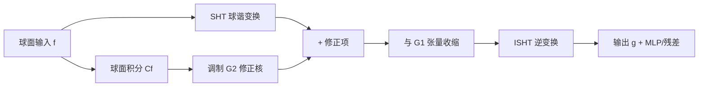

# Generalized Spherical Neural Operators: Green's Function Formulation

**会议**: ICLR 2026  
**OpenReview**: [https://openreview.net/forum?id=XkGjzSDTnm](https://openreview.net/forum?id=XkGjzSDTnm)  
**代码**: [https://github.com/haot2025/GSNO](https://github.com/haot2025/GSNO)  
**领域**: 神经算子 / 球面 PDE 求解 / 科学机器学习  
**关键词**: Green's function, 球面神经算子, 球谐变换, 等变性与不变性, 多尺度建模  

## 一句话总结
用"可设计的球面 Green's 函数"重新推导球面神经算子，把现有 SFNO 解释为相对位置 Green's 函数的特例，并通过引入绝对位置依赖项得到能灵活平衡等变与不变的 GSNO 算子与多尺度网络 SHNet，在弥散 MRI、浅水方程和全球天气预报上全面超越 SOTA。

## 研究背景与动机

**领域现状**：求解参数化偏微分方程（PDE）是科学与工程的核心任务。神经算子（如 FNO）通过在频域学习函数空间映射，绕开了昂贵的数值求解。但 FNO 基于标准傅里叶变换并假设欧氏几何，搬到球面上时极点附近的小位移会被映射成笛卡尔空间的大位移，破坏空间连续性。为此 SFNO 用球谐变换（SHT）替换 FFT，把函数投影到球谐基上，从而在球面上保持旋转等变性，在天气预报等任务取得不错效果。

**现有痛点**：作者指出三层问题。其一是**理论根基薄弱**——现有球面算子大多靠 SHT 加球面卷积定理"把 FNO 搬到球面"，而非从球面原生 PDE 的积分解推导而来，导致学到的积分核物理意义不明、可推广性受限。其二是**算子块过度等变**——真实物理系统充满非等变与非对称约束（边界效应、位置相关模式、各向异性介质），但 SFNO 为了频域计算效率强行施加严格旋转等变，无法刻画这类不对称性。其三是**网络单尺度**——现有球面算子网络多为 ResNet 单尺度结构，难以表达气候动力学的多尺度特征。

**核心矛盾**：球面建模需要在"保持球面几何与谱效率所要求的旋转等变"与"真实系统所固有的非等变约束"之间取得平衡，而现有方法把等变当作硬约束，没有给非等变留出口子。

**本文目标**：建立一个从 Green's 函数出发、可推导出系统对应算子解的统一球面算子理论框架，并据此设计一个能灵活调和等变与不变的算子，再配上多尺度网络。

**核心 idea**：**【可设计 Green's 函数】** 把球面 PDE 的解写成与 Green's 函数卷积的积分形式，Green's 函数本身变成"可设计的归纳偏置"——设计成纯相对位置依赖就退化为 SFNO，再叠加一个绝对位置依赖的修正项就得到能建模非等变约束的 GSNO。

## 方法详解

### 整体框架
方法分三层递进：先从球面 Green's 函数推出一套通用的算子设计框架（4.1），证明现有 SFNO 只是其中"相对位置 Green's 函数"的特例；再在此框架上设计绝对+相对位置依赖的 Green's 函数，导出 GSNO 算子块（4.2）；最后把 GSNO 嵌入 U-Net 式多尺度网络 SHNet（4.3），用球谐域的上下采样替代传统采样以避免畸变。

### 关键设计

**1. 从 Green's 函数推导球面算子框架：给球面学习一个 PDE 解的出身。** 作者不再把球面算子当成"FNO 的球面版"，而是直接从球面原生 PDE 出发。定义球面上的线性微分算子 $D$ 与待解 PDE $D(g(u))=f(u)$，并引入满足 $D(G(u,R))=\delta(R^{-1}u)$ 的球面 Green's 函数 $G$，则解天然写成卷积积分 $g(u)=\int_{S^2} G(u,R)f(Rn)\,dR$。当把 $G$ 设计成只依赖相对位置 $G(R^{-1}u)$ 时，套用球面卷积定理就能化简成 $\mathrm{SHT}[g](l,m)=G_\theta(l)\cdot\mathrm{SHT}[f](l,m)$，再经 ISHT 还原——这正是 SFNO 的频域参数化形式。这一步既证明了框架的自洽（SFNO 是特例），又用 Green's 函数的"可设计性"打开了模拟不同系统的口子：换一个 Green's 函数就是换一个系统。

**2. 绝对+相对位置依赖的 Green's 函数（GSNO 算子）：给等变算子缝上一条非等变补丁。** 严格等变假设 $G(R,u)=G(R^{-1}u)$ 忽略了真实世界的各向异性、局部异质与非周期边界。作者把 Green's 函数扩展为相对项加绝对项之和：

$$G(R,u)=\underbrace{\sum_{l',m'}\mathrm{SHT}[G_1]_{l'}^{m'} Y_{l'}^{m'}(R^{-1}u)}_{T_{\text{orig}}}+\underbrace{\sum_{l',m'}\mathrm{SHT}[G_1]_{l'}^{m'}\mathrm{SHT}[G_2]_{l'}^{m'} Y_{l'}^{m'}(u)}_{T_{\text{corr}}}$$

其中 $T_{\text{orig}}$ 是保留旋转等变的原始项，$T_{\text{corr}}$ 是可学习的非等变修正项，专门捕捉空间约束与异质性。对目标的 SHT 拆成两路：等变路 $I(T_{\text{orig}})=G^1_{\theta_1}(l)\cdot\mathrm{SHT}[f](l,m)$，修正路化简为 $I(T_{\text{corr}})=G^1_{\theta_1}(l)\cdot C_f\cdot G^2_{\theta_2}(l,m)$，$C_f$ 是输入函数的球面积分。两路合并后输出 $g(u)=\mathrm{ISHT}[G^1_{\theta_1}(l)\cdot(\mathrm{SHT}[f](l,m)+C_f\cdot G^2_{\theta_2}(l,m))]$。直觉上 $G_1$ 编码动态特征、$G_2$ 提供模式级谱嵌入来稳定地编码地形/边界等系统约束，二者共享 $G^1_{\theta_1}(l)$ 以省参数。妙处在于：修正项只是给球谐系数加了个偏置后再做同样的张量收缩，因此**在保持 SFNO 同等谱效率与低参数量的前提下放松了严格 SO(3) 等变**，且不破坏球面几何与网格不变性。

**3. SHNet 多尺度球面网络：用球谐域的采样替代会引入畸变的传统上下采样。** 谱卷积擅长全局依赖但弱于多尺度。SHNet 采用 U-Net 结构对空间与通道做扩张/压缩，并加位置嵌入增强全局建模。核心技巧是：尺度变换通过修改 SHT/ISHT 中沿纬度 $\theta$、经度 $\phi$ 的采样点数以及球谐次数 $l$ 来实现——下采样减少采样点并用 MLP 增强特征以抽象大尺度结构，上采样恢复高频内容并靠跳连提供高分辨率直通路径。这种"几何自适应"的上下采样直接在球面谱域完成，避开了传统插值采样在球面上造成的混叠与畸变，从而在跨分辨率时仍保持几何一致性。

## 实验关键数据

在弥散 MRI、球面浅水方程（SSWE）、全球天气预报三类任务上评测，对手包括 Transformer 系 ClimaX、FNO 系 FourCastNet、SFNO 系 SFNONet，全部 16GB A5000 GPU、统一设置。

### 主实验表格

SSWE 上的 MRE（×10⁻³，越低越好），3 个变量（H/V/D）均值：

| 方法 | 5h Average | 10h Average |
|------|-----------|-------------|
| ClimaX | 409 | 443 |
| FourCastNet | 302 | 353 |
| SFNONet | 147 | 195 |
| **SHNet (Ours)** | **136** | **176** |

平均提升 5h 约 7.5%、10h 约 9.7%。

WeatherBench ACC（%，越高越好）6 变量均值（注意参数量更小）：

| 方法 (算子) | Params | 1 天 | 3 天 | 5 天 |
|------|--------|------|------|------|
| ClimaX | 5.4M | 93.1 | 68.7 | 41.6 |
| FourCastNet (FNO) | 5.3M | 92.3 | 67.1 | 41.5 |
| SFNONet (SFNO) | 5.3M | 87.3 | 68.8 | 49.2 |
| **SHNet (GSNO)** | **4.0M** | 91.5 | **72.4** | **52.5** |

GSNO 在 3/5 天的长程预测优势最明显，且参数量更少（4.0M vs 5.3M）。

弥散 MRI（HCP 数据集 FOD 角度超分，ACC↑）：

| 方法 | Params | White matter | Whole brain |
|------|--------|--------------|-------------|
| FOD-Net | 19.44M | 0.8858 | 0.8250 |
| FOD-SFNO | 1.15M | 0.8995 | 0.8334 |
| ESCNN | 1.47M | 0.9006 | 0.8362 |
| **FOD-GSNO (Ours)** | 1.21M | **0.9083** | **0.8517** |

### 消融实验表格

WeatherBench 上交叉替换算子/网络（灰块为消融）的 5 天 ACC：把 SHNet 里 GSNO 换回 SFNO（→89.9 起的退化）、或把 SFNONet 的块换成 GSNO（51.3 vs 原 49.2 提升），证明 GSNO 块与 SHNet 多尺度结构各自有效。算子级公平对比（同架构同设置）：

| 模型 | 通道 | Params | 训练时间 | ACC@120h |
|------|------|--------|----------|----------|
| SFNO | 64 | 3.69M | 981s | 50.9% |
| SFNO (96通道) | 96 | 8.30M | 1267s | 50.7% |
| 空间位置嵌入 SNO | 64 | 4.31M | 1037s | 50.3% |
| **GSNO (ours)** | 64 | 4.00M | 1024s | **52.5%** |

即便给 SFNO 加大容量（96 通道）或加空间位置嵌入，仍不及 GSNO，说明优势来自修正项的设计而非单纯堆参数。

### 关键发现
- **修正项可解释性**：冻结等变项 $I(T_{\text{orig}})$ 只用修正项 $I(T_{\text{corr}})$，就能勾勒出与地球地形耦合的温度分布框架（极地持续低温 vs 赤道高温），说明 $T_{\text{corr}}$ 确实显式编码了地形约束。
- **长程增益更大**：GSNO 在更长预测步数上提升更明显，暗示非等变项对长程动力学建模愈发关键。

## 亮点与洞察
- **把 SFNO 收编为特例**：从 Green's 函数推导出现有方法只是"相对位置 Green's 函数"这一特例，给一类经验性算子补上了 PDE 解的理论出身，这种"先统一再扩展"的叙事比单纯加模块更有说服力。
- **等变/不变的可控旋钮**：修正项本质是一个可学习的非等变偏置，工程上几乎零额外开销（共享 $G_1$、同形于球谐系数），却在参数更少的情况下拿到更好结果，性价比突出。
- **几何自适应采样**：用改变 SHT/ISHT 采样点数与球谐次数来做多尺度，从根上避免了球面插值采样的混叠畸变，是个干净的工程取舍。

## 局限与展望
- 实验主要集中在 H/V/D 三变量与六个气象变量，未在更高分辨率（如 0.25°）或更长程（>5 天）的业务级预报上验证，长程稳定性仍待检验。
- 修正项的"绝对位置"建模依赖球面积分 $C_f$ 作为全局标量调制，对高度局部化、强非线性的边界约束是否足够仍是开放问题。
- Green's 函数"可设计"是框架卖点，但文中只实例化了绝对+相对位置一种设计；如何为其他系统（如各向异性扩散、强非平稳）系统性地设计 Green's 函数尚无方法论。
- 对比基线未涵盖最新的 message-passing/图神经算子等非谱方法，跨范式优势还不完全清楚。

## 相关工作与启发
- **几何等变与复杂约束**：群等变网络（Cohen & Welling）、DISCO 谱方法等用对称群提升效率；另一支（Finzi 等）则主动放松严格等变以增强真实建模能力——本文恰好落在后一支，但用 Green's 函数给"放松"提供了理论依据。
- **神经算子谱系**：DeepONet → FNO → SFNO 这条频域算子主线；本文把 SFNO 纳入 Green's 函数框架，相当于给这条线补了一个统一视角。
- **多尺度神经算子**：现有上下采样易引入混叠与畸变（尤其球面），本文用球谐域采样规避，对其他球面/流形上的多尺度建模有借鉴意义。

## 评分
- **新颖性**: ⭐⭐⭐⭐⭐ — 用可设计 Green's 函数统一并扩展球面算子，把 SFNO 解释为特例再引入非等变修正项，理论视角新颖且落地。
- **实验充分度**: ⭐⭐⭐⭐ — 覆盖 MRI/浅水/天气三类异质任务，算子级与网络级消融齐全、含可解释性分析；但缺业务级高分辨率与跨范式基线。
- **写作质量**: ⭐⭐⭐⭐ — 理论推导清晰、图表配合到位，"先统一再扩展"叙事顺畅；部分推导依赖附录，正文略密。
- **价值**: ⭐⭐⭐⭐⭐ — 为球面算子设计提供统一理论框架与即插即用的高效算子块，对气候、神经影像等真实球面系统建模有直接价值。

<!-- RELATED:START -->

## 相关论文

- [\[ICLR 2026\] A Function-Centric Graph Neural Network Approach for Predicting Electron Densities](a_function-centric_graph_neural_network_approach_for_predicting_electron_densiti.md)
- [\[NeurIPS 2025\] Neural Green's Functions](../../NeurIPS2025/physics/neural_greens_functions.md)
- [\[ICLR 2026\] Adaptive Mamba Neural Operators](adaptive_mamba_neural_operators.md)
- [\[ICLR 2026\] DGNet: Discrete Green Networks for Data-Efficient Learning of Spatiotemporal PDEs](dgnet_discrete_green_networks_for_data-efficient_learning_of_spatiotemporal_pdes.md)
- [\[ICLR 2026\] Locally Subspace-Informed Neural Operators for Efficient Multiscale PDE Solving](locally_subspace-informed_neural_operators_for_efficient_multiscale_pde_solving.md)

<!-- RELATED:END -->
