# GenSR: Symbolic Regression based on Equation Generative Space

**会议**: ICLR 2026  
**OpenReview**: [https://openreview.net/forum?id=8emIjwUQZg](https://openreview.net/forum?id=8emIjwUQZg)  
**代码**: [https://github.com/tokaka22/ICLR26-GENSR](https://github.com/tokaka22/ICLR26-GENSR)  
**领域**: 符号回归 / AI for Science / 生成式隐空间搜索  
**关键词**: Symbolic Regression、CVAE、生成式隐空间、CMA-ES、ELBO、贝叶斯推断  

## 一句话总结
GenSR 用双分支 CVAE 把离散的方程空间重参数化成一个"既全局符号连续、又局部数值平滑"的生成式隐空间（一张方程世界的"地图"），再按"建图→粗定位→精搜索"范式用退化版 CMA-ES 在隐空间里高效找方程，从贝叶斯视角把符号回归重写成最大化 $p(\text{Equ.}\mid\text{Num.})$ 的 ELBO 优化。

## 研究背景与动机
**领域现状**：符号回归（Symbolic Regression, SR）想从观测数据 $\{x_i,y_i\}_{i=1}^N$ 里反推出可解释的数学表达式 $f:x\mapsto y$，是科学发现和工程建模的核心任务，因为它既要拟合精度、又要表达式可读。主流做法是在**离散符号空间**里搜索：遗传编程（GP）靠交叉变异、蒙特卡洛树搜索（MCTS）靠树展开、还有强化学习/Transformer/RAG/LLM 提示等神经引导方法。

**现有痛点**：离散空间里衡量两个方程相似度用的是"编辑距离"，但**编辑距离和数值行为根本不相关**——结构很像的方程数值表现可能天差地别，反之亦然。于是拟合误差这个本该指导搜索的反馈信号变成了噪声：它既对应不上编辑距离，也给不出可靠的搜索方向，搜索只能靠随机变异、组合、回溯，轨迹不稳、时间复杂度高。

**核心矛盾**：就算想把方程映射到连续隐空间来获得"方向"，也面临两难。空间要**生成式**（任意隐向量都能解码成合法方程，支持平滑插值和细粒度搜索），而判别式预训练方法（SNIP、E2ESR）学的是判别嵌入，隐空间碎片化、充满不可解码的死区；空间还要**组织良好**（数值行为相近的方程在隐空间里也相近），但已有生成式方案里欧氏距离只反映编辑距离。更棘手的是 $\cos^2 x$、$1-\sin^2 x$ 和它们的泰勒展开数值完全相同却符号形式迥异——硬把它们摆在一起会逼着解码器把相邻向量映射到差异巨大的表达式，解码崩溃。**符号连续性**和**数值平滑性**因此天然冲突。

**本文目标 / 核心 idea**：受人类"先粗定位再精确瞄准"的直觉启发，**构造一个"全局符号连续 + 局部数值平滑"的生成式隐空间**——前者保证解码稳定并按结构聚类、利于粗定位，后者让拟合误差在局部提供方向信号、利于精搜索。在此之上提出 **GenSR**，遵循"建图（map construction）→粗定位（coarse localization）→精搜索（fine search）"范式，并从**贝叶斯视角**把 SR 统一为最大化 $p(\text{Equ.}\mid\text{Num.})$ 的 ELBO 优化，给方法本身一个理论保证。

## 方法详解

### 整体框架
GenSR 分两阶段：**训练期**用一个双分支 Conditional VAE 在约 500 万条合成"方程-样本"对上预训练，把离散方程空间重参数化为生成式隐空间（"地图"）；**推理期**只用先验分支把输入数据编码成隐空间里的初始定位分布，再用退化版 CMA-ES 沿平滑的数值梯度收缩分布、解码出候选方程。整套流程对应一次对 $p(\text{Equ.}\mid\text{Num.})$ 的 ELBO 估计与近似优化。

```mermaid
flowchart LR
    subgraph 训练期[训练期：建图]
        F[符号方程 F<br/>前缀序列] --> ENC[8层Transformer编码器]
        X1[数值样本 X] --> ENC
        ENC --> POST[后验网络<br/>q&#40;z&#124;X,F&#41;]
        X1 --> PRIOR[先验网络<br/>p&#40;z&#124;X&#41;]
        POST --> FUSE[特征融合MLP] --> DEC[8层Transformer解码器] --> REC[重构损失 L_rec<br/>→符号连续]
        POST -. KL散度对齐 .-> PRIOR
        PRIOR --> KL[KL损失<br/>→数值平滑]
    end
    subgraph 推理期[推理期：粗定位+精搜索]
        XN[新数据 X] --> PR2[仅先验分支] --> DIST[初始分布 N&#40;μ0,σ0²&#41;<br/>粗定位]
        DIST --> CMA[退化版CMA-ES<br/>采样→解码→BFGS调常数→评估R²-ω·复杂度]
        CMA --> OUT[最优方程 f&#770;]
    end
    训练期 -.冻结解码器.-> 推理期
```

### 关键设计

**1. 双分支 CVAE：用"后验拉符号、先验抓数值"同时焊死两个互斥目标。** GenSR 的核心是让一张地图同时满足符号连续和数值平滑，办法是让两条分支分工。**后验分支**（8 层 Transformer 编码器 + 后验网络 + 特征融合 MLP + 8 层解码器）同时吃数值样本 $X$ 和符号方程 $F$，学后验分布 $q(z\mid X,F)=\mathcal N(\mu_1,\sigma_1^2 I)$，重参数化采样 $n$ 个隐向量后由解码器重构原方程——重构损失 $L_{rec}$ 逼着隐空间保住符号结构的连续性。**先验分支**与后验分支共享除"后验网络换成先验网络"之外的所有模块，只吃数值样本 $X$，学先验分布 $p(z\mid X)=\mathcal N(\mu_2,\sigma_2^2 I)$，专门捕捉方程的数值行为。两支在配对数据 $(F,X)$ 上联合训练，靠 KL 散度 $D_{KL}\big(q(z\mid X,F)\,\|\,p(z\mid X)\big)$ 把后验向先验对齐——这样推理时只有数值、没有真方程也能用先验分支可靠定位。训练用 KL annealing 防止 posterior collapse。

**2. 分布级对齐 + 重复采样融合：把"符号连续"和"数值平滑"分别落到高置信区域而非单点。** 这是 GenSR 区别于 VAE/SNIP 的精巧处。**符号连续**靠重复采样实现：传统 VAE 只采一个 $z$，GenSR 对每个分布采 $n$ 个向量 $Z^{(j)}=\{\mu^{(j)}+\sigma^{(j)}\odot\epsilon\}$ 再经特征融合，使重构损失作用于整个高置信区域 $R_\alpha^{(i)}$（卡方分位定义的椭球）。若两个方程 $f^{(1)},f^{(2)}$ 的高置信区域相交 $z^*\in R_\alpha^{(1)}\cap R_\alpha^{(2)}$，该点会被两者的重构目标共同塑形、解码出介于两者之间的结构，从而在隐空间里形成平滑的符号过渡，全局上把结构相近的方程聚到一起。**数值平滑**靠分布级 KL 对齐实现——与 SNIP 对比学习"对齐单点"不同，GenSR 对齐**整个分布**。对独立高斯（$\Sigma_1=\sigma_1^2 I,\Sigma_2=\sigma_2^2 I$），KL 化简为
$$D_{KL}(q\|p)=\frac12\sum_{j=1}^d\!\left(\frac{(\mu_{1,j}-\mu_{2,j})^2}{\sigma_{2,j}^2}+\frac{\sigma_{1,j}^2}{\sigma_{2,j}^2}-\ln\frac{\sigma_{1,j}^2}{\sigma_{2,j}^2}-1\right),$$
最小化它既拉近后验/先验的均值、又对齐方差，保证匹配的是高置信区域而非孤立点，局部数值平滑由此而来。此外预训练时刻意控制表达式长度，把复杂方程推到隐空间外围，缓解搜索时对复杂解的过拟合。

**3. 退化版 CMA-ES：在平滑地图上做粗定位到精搜索的分布收缩。** 推理时真方程未知，只用先验分支把数据编码成初始高斯 $\mathcal N(\mu_0,\sigma_0^2 I)$ 完成**粗定位**（高置信区会对齐到三角/指数等符号族和输入维度）。但先验/后验只是近似，直接解码 $\mu_0$ 未必最优，于是用改造的 **CMA-ES** 做**精搜索**：每代从 $\mathcal N(\mu_i,\sigma_i^2 I)$ 采样隐向量→冻结解码器解码成候选方程→用 BFGS 精调常数→按 $\text{Fitness}=R^2-\omega\cdot\text{complexity}$ 评估→选 top-$p$ 更新 $\mu,\sigma$。为对抗高维下 CMA-ES 的开销，做两处退化：**对角协方差假设**把 $\Sigma$ 限成 $\sigma^2 I$ 只独立更新每维方差（恰好契合 VAE 的独立高斯假设），**Top-$k$ 方差更新**只更新方差最大的 $k$ 个维度（其余置零），把搜索集中到最不确定、最相关的方向上，在不掉精度的前提下加速收敛。

**4. 贝叶斯视角：把整个框架解释成 $p(\text{Equ.}\mid\text{Num.})$ 的 ELBO 优化。** GenSR 把 SR 重写为贝叶斯问题——给定数值 $X$，推断方程后验 $p(F\mid X)$ 并最大化它，从而能对整个候选分布做不确定性量化和概率比较，而非只求单一最优。引入变分分布 $q(z\mid X,F)$ 后推出证据下界
$$\log p(F\mid X)\ge \mathbb E_{q(z\mid X,F)}\big[\log p(F\mid X,z)\big]-D_{KL}\big(q(z\mid X,F)\,\|\,p(z\mid X)\big),$$
其中第一项最大化重构 $F$ 的概率，正对应最小化 $L_{rec}$；第二项正对应第 2 点的 KL 损失。于是"训练双分支 CVAE = 最大化 ELBO"，"CMA-ES 精修 = 对变分分布的近似优化"。论文称这是首个基于估计并优化 $p(\text{Equ.}\mid\text{Num.})$ 的 ELBO 来做 SR 的框架，既给方法理论保证、也给 SR 提供了新的技术路线。

## 实验关键数据

### 主实验设置与结果
在 **SRBench** 基准上评测：119 个 Feynman 方程、14 个 ODE-Strogatz 挑战、57 个黑箱回归任务，对比 **18 个基线**（涵盖预训练类与各种启发式类，如 GP-GOMEA、Operon、DSR、RAG-SR、E2ESR、SNIP、TPSR、AIFeynman2 等），指标为精度 $R^2$、时间复杂度、方程复杂度，用 Pareto front 展示三者权衡。

| 维度 | GenSR 表现 |
|------|-----------|
| Feynman / $R^2$ vs 方程复杂度 | 稳居 **rank-1 Pareto 前沿**，整体优于所有基线 |
| Feynman / $R^2$ vs 时间复杂度 | 同样位于 rank-1 Pareto 前沿，搜索更高效 |
| Strogatz（含噪 0.000→0.1） | 各噪声水平下 **$R^2$ 最高且方差最小**，运行时间显著更短、方程更简洁 |

### 隐空间可视化（消融式验证）
用 t-SNE 对比 GenSR、E2ESR、SNIP 的隐空间结构（三种函数族 exp/trig/log × 2D/5D 输入，共 6 类）：

| 方法 | 隐空间结构 |
|------|-----------|
| E2ESR | 无法有效区分函数类型与输入维度，trig 和 exp 高度纠缠 |
| SNIP | 算子级稍好但类内不紧凑，exp-5D 簇分裂成两块、跨类重叠 |
| **GenSR** | 函数类型与输入维度**清晰解耦**，结构可分性最佳 |

进一步用"归一化 $y$ 均值"上色，GenSR 每个结构簇内部数值特征**平滑过渡**，验证了"定位到高概率区后可沿平滑数值方向精修收敛"的设计假设。

### 关键发现
- 生成式连续隐空间提供了稳定的方向信号，相比离散符号空间靠启发式变异/回溯，搜索更高效、更不易过拟合。
- GenSR 在精度、表达式简洁度、计算效率三者上**联合优化**，且在噪声下保持鲁棒——印证了隐空间在扰动下仍保住结构组织与局部平滑。
- 隐空间天然把不同方程族分到不同区域，附带支持方程分类等下游任务。

## 亮点与洞察
- **诊断准、抓手新**：把 SR 长期低效的病根精确归到"编辑距离≠数值行为"，再用"符号连续 + 数值平滑"双性质隐空间正面解决，而不是继续在离散空间打补丁。
- **双分支分工优雅**：后验分支管符号重构、先验分支管数值定位、KL 把两者焊接，推理时只剩先验分支也能干活——结构清爽且推理无需真方程。
- **分布级对齐胜过单点对齐**：对齐整个高置信区域而非单点，是它比 SNIP 对比学习更能保住数值平滑、解码更稳的关键。
- **理论闭环**："训练=最大化 ELBO、CMA-ES=近似优化变分分布"把工程组件和贝叶斯目标一一对应，给方法上了理论保险。

## 局限与展望
- **依赖大规模合成预训练**：500 万合成方程-样本对的预训练成本高，且隐空间覆盖的函数族受合成数据分布限制，对训练分布外的奇异方程外推能力存疑。
- **刻意压短表达式**：为防过拟合把复杂方程推到外围，可能牺牲对本身就很复杂的真实方程的发现能力。
- **CMA-ES 精搜索仍是近似**：先验/后验只是近似分布，精修依赖 BFGS 调常数和 top-$k$ 方差更新，高维下的收敛保证仍偏经验。
- **作者展望**：引入更丰富的生成式先验与物理约束、用更强的生成模型构造更通用的方程空间，推动可解释、领域感知的科学发现 ML。

## 相关工作与启发
- **离散符号搜索**：GP（Operon、PySR）、MCTS、RL（DSR）、Transformer 规划（TPSR）、RAG（RAG-SR）、MDL、LLM 提示——共同短板是结构相似度反映不了数值行为，误差反馈无信息量。
- **避开离散搜索的路线**：seq2seq 直接生成方程（E2ESR、NeSymReS）不强制符号-数值对齐；SNIP 用对比学习建共享隐空间但是判别式、存在大量不可解码点。GenSR 用生成式 CVAE 把它们的隐空间从"判别/碎片化"升级成"生成/结构化流形"。
- **启发**：把组合式科学搜索问题重参数化到"组织良好的生成式隐空间 + 连续优化"，是连接离散符号推理与连续优化的通用思路，可迁移到分子设计、程序合成等其他组合搜索场景。

## 评分
- **新颖性** ⭐⭐⭐⭐⭐：首个用 $p(\text{Equ.}\mid\text{Num.})$ 的 ELBO 来做 SR，"符号连续+数值平滑"双性质隐空间 + 分布级对齐 + 退化 CMA-ES 是一套自洽的新范式。
- **实验充分度** ⭐⭐⭐⭐：SRBench 全套（Feynman/Strogatz/黑箱）对比 18 个基线，含噪声鲁棒性与 t-SNE 隐空间可视化；但正文主要给 Pareto 排名图，缺少直接的数值表格（详表在附录）。
- **写作质量** ⭐⭐⭐⭐⭐：动机推导环环相扣，从痛点→两个设计要点→双分支→贝叶斯理论一气呵成，图 1 流程清晰。
- **价值** ⭐⭐⭐⭐：为符号回归提供了可落地的新技术路线，且"生成式隐空间做组合科学搜索"的思路有较强的可迁移性与科学发现价值。

<!-- RELATED:START -->

## 相关论文

- [\[NeurIPS 2025\] Symbolic Regression Is All You Need: From Simulations to Scaling Laws in Binary Neutron Star Mergers](../../NeurIPS2025/physics/symbolic_regression_is_all_you_need_from_simulations_to_scaling_laws_in_binary_n.md)
- [\[ICLR 2026\] Deep Learning for Subspace Regression](deep_learning_for_subspace_regression.md)
- [\[ICLR 2026\] $\partial^\infty$-Grid: A Neural Differential Equation Solver with Differentiable Feature Grids](boldsymbolpartialinfty-grid_a_neural_differential_equation_solver_with_different.md)
- [\[ICML 2026\] Quantum latent distributions in deep generative models](../../ICML2026/physics/quantum_latent_distributions_in_deep_generative_models.md)
- [\[ICML 2026\] Generative Neural Operators Through Diffusion Last Layer](../../ICML2026/physics/generative_neural_operators_through_diffusion_last_layer.md)

<!-- RELATED:END -->
