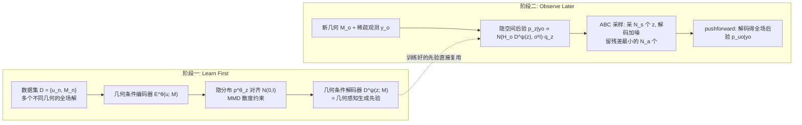

# Geometric Autoencoder Priors for Bayesian Inversion: Learn First Observe Later

**会议**: ICLR 2026  
**OpenReview**: [https://openreview.net/forum?id=QMMlaI9VbR](https://openreview.net/forum?id=QMMlaI9VbR)  
**代码**: [https://github.com/gduthe/GABI](https://github.com/gduthe/GABI)  
**领域**: 科学计算 / 贝叶斯反问题 / 不确定性量化 / 图神经网络生成模型  
**关键词**: Bayesian inversion, geometry-aware prior, graph autoencoder, uncertainty quantification, pushforward prior, ABC sampling  

## 一句话总结
GABI 用图自编码器从一大批"几何各异"的物理场数据中蒸馏出一个几何条件化的隐空间先验，做到"先学先验、后看观测"——训练时完全不需要知道 PDE / 边界条件 / 观测过程，推理时把这个先验和任意观测似然组合，借助 ABC 采样高效求解全场重建的贝叶斯反问题并给出标定良好的不确定性。

## 研究背景与动机
**领域现状**：工程中大量任务是从稀疏带噪传感器读数反推整个物理场（温度场、流场、共振模式），这是典型的高度不适定反问题。贝叶斯范式能给出有原理的正则化和不确定性量化，但其成败关键在**先验设定**——先验太弱(vague)就会得到弥散的后验，预测精度远不如确定性监督方法。

**现有痛点**：一个自然的想法是"从一批相关物理系统的数据里学一个先验"。但工程系统的核心特征是**几何在变**：每个airfoil形状不同、每辆车body不同、每块地形不同。场所在的函数空间/概率空间都和各自的几何绑定，无法直接在"场空间"上学一个统一先验，标准的多系统贝叶斯 UQ 在变几何下失效。

**核心矛盾**：要么用监督学习的 direct map（精度高，但**观测过程必须在训练时就固定**——传感器数量、位置、噪声类型一旦变化就要重训）；要么用 GP/物理先验（灵活但要么先验太弱、要么需要 PDE 知识）。二者都不能做到"训练一次、到处可用"。

**本文目标**：学一个几何感知、且**完全独立于观测过程**的数据驱动先验，使得同一个先验能服务于任意传感器布置、任意噪声模型、任意观测算子的反问题。

**核心idea**：**"learn first, observe later" 解耦**——把"学先验"和"用观测做推断"彻底拆开。用图自编码器把(几何, 全场解)联合嵌入到一个固定维度的隐高斯先验里；再证明"在隐空间解反问题 = 在原始场空间用 pushforward 先验解反问题"，于是推理时只需在低维隐空间采样后验、再解码回任意几何上的场。

## 方法详解

### 整体框架
GABI 是一个两阶段框架：**阶段一(学先验)**用一个几何条件化的图自编码器，把数据集 $D=\{u_n, M_n\}_{n=1}^N$（场 + 网格）中所有几何上的解压缩进同一个隐高斯分布 $q_z=\mathcal{N}(0,I)$，这个解码器 $D^\psi$ 就充当"几何条件化的生成式先验"；**阶段二(用观测)**对新几何 $M_o$ 上的稀疏带噪观测 $y_o$，借助一个核心 pushforward 等价定理，把贝叶斯反问题搬到低维隐空间求解，再用解码器把后验样本推回目标几何上的全场。整个推理用 ABC 采样实现，天然适配 GPU 大规模并行。

### 关键设计

**1. Pushforward 先验等价定理：把反问题合法地搬进隐空间**。这是整个方法的理论基石。设解码器 $g=D^\psi$ 把隐先验 $P_z$ 推前(pushforward)成场空间先验 $P_u := g_\# P_z$。论文的 Lemma 2.1 证明：以 $P_u$ 为先验、似然正比于 $\exp(-\Phi(u;y))$ 的场空间后验，恰好等于隐空间后验的 pushforward，即 $P_{u|y} = g_\# P_{z|y}$，其中 $dP_{z|y}(z) \propto \exp(-\Phi(g(z);y))\,dP_z(z)$。直白说：**在隐空间 $Z$ 上对低维 $z$ 做贝叶斯推断、再解码，与直接在高维场空间上用生成先验做推断是同一件事**。Theorem 2.2 把它落到几何反问题——一个统一的隐先验 $q_z$ 配上几何条件解码器 $D^\psi_o$，就能服务于任意分布内几何 $M_o$ 的反问题，后验为 $p^\psi_{u_o|y_o} = D^\psi_o{}_\# p_{z|y_o}$。正因为反问题只发生在低维隐空间，采样才变得廉价，且先验与观测过程彻底解耦。

**2. 几何条件化的统计自编码器：用 MMD 把任意几何的场压成统一高斯先验**。编码器 $E^\theta_n(u_n):=E^\theta(u_n;M_n)$ 和解码器 $D^\psi_n(z):=D^\psi(z;M_n)$ 都是以网格 $M_n$ 为条件的图神经网络，把变几何上的场映到/映回固定维度的隐向量。训练目标同时压重构误差和把隐分布对齐到标准高斯：

$$\theta^\star,\psi^\star = \arg\min_{\theta,\psi}\ \widehat{\mathbb{E}}_D\big[\|u_n - (D^\psi_n\circ E^\theta_n)(u_n)\|_2^2\big] + d(p^\theta_z,\, q_z)$$

其中 $p^\theta_z=\widehat{\mathbb{E}}_D[\delta_{E^\theta_n(u_n)}]$ 是编码后解的经验分布，$q_z=\mathcal{N}(0,I)$，散度 $d$ 取**最大均值差异 MMD**（也可用 energy distance、Wasserstein 等）。这里关键是用统计自编码器而非 VAE：作者在附录专门论证 VAE 不适合本任务，统计自编码器直接在分布层面把"各几何编码后的点云"整体拉成高斯，从而让后续把 $z$ 的先验直接设成 $\mathcal{N}(0,I)$ 在数学上自洽。几何条件来自把编码/解码都 condition 在网格上（思路接近 conditional autoencoder），架构本身要求几何感知、定维映射、非局部性三个性质（实验里用带非局部平均层的 GCN，地形大问题用 GEN GNN）。

**3. ABC 采样实现：用 GPU 并行换掉 MCMC 的串行瓶颈**。把数据生成模型改写成隐变量形式 $y_o = H_o D^\psi_o(z) + \xi_o,\ \xi_o\sim\mathcal{N}(0,\sigma^2 I)$，对应隐空间后验 $p^\psi_{z|y_o}(z) \propto \mathcal{N}(H_o D^\psi_o(z), \sigma^2 I)\cdot q_z(z)$。求解时（Algorithm 1 GABI-ABC）：批量从先验 $q_z$ 采 $N_s$ 个 $z^{(i)}$，解码得 $u'^{(i)}_o=D^\psi(z^{(i)};M_o)$，过观测算子加噪得 $y'^{(i)}_o=H_o u'^{(i)}_o+\xi'^{(i)}_o$，算残差 $r_i=\|y_o-y'^{(i)}_o\|_2$，**留下残差最小的 $N_a$ 个样本**作为后验。选 ABC 而非 MCMC 的三个理由：(i) 神经网络可大规模并行，而 MCMC 本质串行；(ii) 学到的先验已经很"贴"，先验-后验重叠好，接受率不会太低；(iii) 观测维度低，不需要可能有问题的 summary statistics。额外好处：ABC **不需要计算似然**，对似然不可解的观测过程也适用。

**4. 观测噪声的联合估计：免重训地把噪声也纳入推断**。贝叶斯框架可顺手联合估计每个系统可能不同的观测噪声标准差 $\sigma_o$，通过隐联合后验 $p^\psi_{z,\sigma_o|y_o}(z,\sigma_o) \propto p^\psi_{y_o|z,\sigma_o}(y_o)\,q_z(z)\,p_{\sigma_o}(\sigma_o)$（Corollary 2.3 给出对应的 pushforward 采样）。关键卖点是：**这种扩展完全独立于自编码器的训练**——直接回归方法必须在训练时就把所有观测变量(含噪声)写死，而 GABI 只在测试时引入噪声先验即可，再次体现"observe later"的灵活性。

## 实验关键数据

测试四类工程物理问题：矩形域稳态热传导、airfoil 周围 RANS 流场、3D 车身 Helmholtz 共振与声源定位、地形上的 RANS 气流（多 GPU）。对比 direct map（图 NN 监督回归）和图上 GP 回归（Matérn 1/2、3/2、RBF 核）。指标含 MAE、落在 1/2 标准差内的覆盖率(标定)、训练与单几何预测时间（RTX 4090）。

### 主实验表格（稳态热传导，已知噪声，10 个观测点）

| 方法 | MAE | % 1 std | % 2 std | 训练 | 预测 |
|---|---|---|---|---|---|
| GABI-ABC | $1.58\times10^{-2}$ | 80.91% | 95.59% | 2.62hr | 0.908s |
| GABI-NUTS | $1.11\times10^{-2}$ | 66.66% | 96.18% | 同上 | 410.31s |
| Direct Map (监督) | $1.25\times10^{-2}$ | – | – | 1.47hr | 0.0029s |
| GP (Matérn 1/2) | $8.46\times10^{-2}$ | 66.36% | 89.45% | – | 0.65s |
| GP (RBF) | $1.39\times10^{-1}$ | 14.88% | 29.36% | – | 0.64s |

GABI 精度与确定性监督 Direct Map 同量级，且远优于 GP；2σ 覆盖率达 95.59%，标定良好。ABC 比 NUTS 快 ~450 倍（0.9s vs 410s）。

### airfoil 流场重建（已知噪声，观测点数 5–50 随机）

| 方法 | 场 | MAE | % 1 std | % 2 std |
|---|---|---|---|---|
| GABI-ABC | 压力 $p$ | $6.92\times10^{-2}$ | 78.77% | 97.28% |
| Direct Map | 压力 $p$ | $5.35\times10^{-2}$ | – | – |
| GABI-ABC | $v_x$ | $1.31\times10^{-1}$ | 80.36% | 97.28% |
| GABI-ABC | $v_y$ | $3.94\times10^{-2}$ | 75.87% | 96.08% |

只用翼面上几个压力传感器就能反推整个流场（极度不适定），精度接近监督 Direct Map，同时给出可靠 UQ；而 Direct Map 必须在训练时就知道观测点数分布。

### 消融 / 噪声估计（稳态热传导，未知噪声）

| 方法 | QoI | MAE | % 1 std | % 2 std |
|---|---|---|---|---|
| GABI-ABC | 场 $u$ | $2.09\times10^{-2}$ | 75.74% | 94.76% |
| Direct Map | 场 $u$ | $2.13\times10^{-2}$ | – | – |
| GABI-ABC | 噪声 $\sigma$ | $7.96\times10^{-1}$ | 42.10% | 69.11% |
| GP (M 1/2) | 噪声 $\sigma$ | $1.08\times10^{0}$ | – | – |

噪声未知时 GABI 仍能联合估计场和 $\sigma$，场重建 MAE 与 Direct Map 持平且优于所有 GP，噪声估计也优于 GP——而 Direct Map 根本无法估计噪声。

### 关键发现
- **精度追平监督、还白送 UQ**：在监督学习适用的受限场景下，GABI 预测精度与确定性方法可比，但额外提供标定良好的不确定性。
- **几何越复杂、UQ 越显价值**：在复杂几何反问题上 UQ 稳健、标定好；查询点落在数据集中变化大的区域时后验自动变宽，落在恒定边界附近时后验很窄。
- **ABC 是关键工程选择**：相比 MCMC 快两个数量级，且无需算似然，对不可解似然的观测过程同样适用。
- **可扩展性**：地形流问题用多 GPU 实现，展示了训练 GABI "基础模型"的潜力。

## 亮点与洞察
- **"learn first, observe later" 的解耦是真正的卖点**：先验与观测过程完全分离，实现 train-once-use-everywhere——换传感器/换噪声/换观测算子都不用重训，这对工业落地极具吸引力，是监督 direct map 结构上做不到的。
- **理论干净**：pushforward 等价定理把高维场空间的贝叶斯反问题严格地降维到隐空间，既给了方法合法性，又解释了为什么采样能这么便宜。
- **ABC + 神经网络是天作之合**：用 GPU 的大规模并行抵消 ABC 通常的低效，同时绕开似然计算和 summary statistics，把一个经典统计工具用出了新意。
- **架构无关**：方法只要求几何感知 + 定维映射 + 非局部性，GCN/GEN/Transformer 都能插，泛化性好。

## 局限与展望
- **ABC 的精度-预算权衡**：ABC 靠"留残差最小的 $N_a$ 个样本"近似后验，本质依赖先验-后验重叠度；一旦先验对某新几何不够贴合，接受样本可能稀少或有偏，需要更大采样预算 $N_s$。
- **预测耗时显著高于监督**：GABI-ABC 单几何预测 ~0.9s（airfoil ~35s），而 Direct Map 仅 ~3ms，实时性场景仍有差距。
- **依赖"分布内几何"假设**：理论保证针对 in-distribution 几何，对训练分布外的全新几何形状外推能力未充分检验。
- **噪声估计精度有限**：$\sigma$ 估计的覆盖率（42% @1std）明显低于场估计，联合反演噪声仍偏粗。
- **展望**：作者已展示多 GPU 可扩展性，下一步是训练真正的 GABI "基础模型"，跨更多物理/几何域共享一个先验。

## 相关工作与启发
- **direct map 反演**（Duthé et al. 2025、Arridge et al. 2019、Adler & Öktem 2017）：本文监督对比基线的灵感来源，但都要求观测过程训练时固定。
- **图上前向/反问题与图 GP**（Borovitskiy et al. 2021、Garcia Trillos & Sanz-Alonso 2018）：GP 基线来自图高斯过程方法；物理信息图 ML（Raissi et al. 2019 等）需要 PDE 知识，与本文纯数据驱动路线区分。
- **统计自编码器**（MMD/Wasserstein autoencoder、Tolstikhin et al. 2018、Gretton et al. 2012）：本文采用 MMD 变体而非 VAE，并 condition 在几何上（conditional autoencoder 思路）。
- **启发**：把"生成模型作为先验 + pushforward 降维 + likelihood-free 采样"组合起来，给一类"训练时不知道观测过程"的科学反问题提供了通用范式，思路可迁移到 tomography、PIV、EIT 等多种全场测量任务。

## 评分
- **新颖性**: ⭐⭐⭐⭐ — pushforward 等价定理 + 几何条件统计自编码器 + ABC 三者组合出"learn first observe later"范式，解耦先验与观测过程的角度新颖且实用。
- **实验充分度**: ⭐⭐⭐⭐ — 覆盖热/流/共振/地形四类异构几何问题，对比监督与多种 GP，含已知/未知噪声与多 GPU 可扩展性，但缺对分布外几何和更大规模基础模型的验证。
- **写作质量**: ⭐⭐⭐⭐ — 理论(引理/定理/推论)与方法叙述清晰，贡献点明确，记号规范；公式偏多对工程读者略有门槛。
- **价值**: ⭐⭐⭐⭐ — train-once-use-everywhere 对工程 UQ 落地价值大，理论与实现都具可迁移性，是科学机器学习中先验学习方向的扎实一步。

<!-- RELATED:START -->

## 相关论文

- [\[AAAI 2026\] Knowledge-Guided Masked Autoencoder with Linear Spectral Mixing and Spectral-Angle-Aware Reconstruction](../../AAAI2026/physics/knowledge-guided_masked_autoencoder_with_linear_spectral_mixing_and_spectral-ang.md)
- [\[CVPR 2025\] Improve Representation for Imbalanced Regression through Geometric Constraints](../../CVPR2025/physics/improve_representation_for_imbalanced_regression_through_geometric_constraints.md)
- [\[ICML 2026\] From Geometry to Dynamics: Learning Overdamped Langevin Dynamics from Sparse Observations with Geometric Constraints](../../ICML2026/physics/from_geometry_to_dynamics_learning_overdamped_langevin_dynamics_from_sparse_obse.md)
- [\[ICML 2026\] Distribution Transformers: Fast Approximate Bayesian Inference With On-The-Fly Prior Adaptation](../../ICML2026/physics/distribution_transformers_fast_approximate_bayesian_inference_with_on-the-fly_pr.md)
- [\[ICML 2026\] Loss Landscape Diagnosis for Gradient-Based Gray-Scott System Inversion: Disentangling the Roles of PINN Components](../../ICML2026/physics/loss_landscape_diagnosis_for_gradient-based_gray-scott_system_inversion_disentan.md)

<!-- RELATED:END -->
