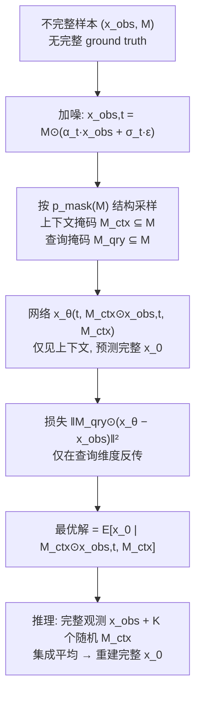

# Incomplete Data, Complete Dynamics: A Diffusion Approach

**会议**: ICLR 2026  
**OpenReview**: [https://openreview.net/forum?id=NYvvkBlSX2](https://openreview.net/forum?id=NYvvkBlSX2)  
**代码**: 待确认  
**领域**: 科学计算 / 物理动力学 / 扩散模型  
**关键词**: 扩散模型, 缺失数据, 物理动力学, 数据补全, 条件生成, 收敛性保证  

## 一句话总结
提出一个**只用不完整观测就能训练**的条件扩散框架：通过按观测分布结构设计的「上下文-查询」划分策略，让扩散模型在从未见过完整样本的情况下，逼近真实完整数据的条件期望，并给出渐近收敛的理论保证，在流体、气象等稀疏物理观测上显著优于现有补全方法。

## 研究背景与动机

**领域现状**：从观测数据学习物理动力学（天气预报、流体、生物系统）是机器学习与科学计算的核心问题。相比像素稠密的自然图像，物理测量天生稀疏——传感器只在离散位置采样、卫星受云遮挡、实验受仪器限制。这种不完整性不是"采集得更好就能解决"的临时问题，而是观测物理系统的**内在属性**。

**现有痛点**：

- **观测模式被过度简化**：多数缺失数据生成方法假设像素级 i.i.d. 的随机缺失，每个空间位置等概率被观测。但真实观测有强空间结构——气象站覆盖局部连续区块、卫星沿轨道扫成条带、水下传感阵列受声传播范围限制。现有方法对所有缺失模式都套同一套训练策略，无法利用具体掩码分布的特性。
- **缺乏理论根基**：现有处理缺失数据的生成方法多是启发式设计，没有收敛保证或学习动力学的理解；少数有理论动机的方法又因需多次完整重训练、复杂重要性加权而计算代价高昂，只能用于低维玩具问题。

**核心矛盾**：训练集里**根本没有完整样本**（只有 $\{(x^{(i)}_\text{obs}, M^{(i)})\}$），那扩散模型凭什么能学会预测那些"从未被观测过"的维度？这是从不完整数据学完整分布的根本张力。

**本文目标**：构建一个理论上有收敛保证、又能高效处理高维物理动力学的扩散框架，回答三个问题：仅用不完整数据训练的扩散模型能否恢复完整数据分布？观测模式如何影响训练效率？在什么条件下未观测区域的重建有保证？

**核心 idea**：**[分层掩码]** 把每个不完整样本 $x_\text{obs}$ 当作"局部完整"，再从中切出上下文掩码 $M_\text{ctx}$（喂给模型）与查询掩码 $M_\text{qry}$（算损失），并让 $M_\text{ctx}$ 的采样**模仿真实观测掩码 $p_\text{mask}(M)$ 的结构**，从而保证每个维度（包括原始缺失维度）都有正的被查询概率，配合集成采样桥接训练与推理的分布差异。

## 方法详解

### 整体框架
方法把"从不完整数据训练补全模型"拆成三块：(1) **不完整数据上的去噪 data-matching**——构造一个只用上下文掩码作输入、用查询掩码算损失的训练目标，并证明其最优解就是条件期望；(2) **策略性上下文-查询划分**——按真实观测掩码的结构（像素级/区块级）来采样上下文掩码，保证所有维度都有非零查询概率；(3) **集成采样重建**——推理时用完整观测、对多个随机上下文掩码做集成平均，消除方差、收敛到真值条件期望。

### 关键设计

**1. 不完整数据上的去噪 data-matching 损失：把"缺失"变成"主动隐藏"。** 关键转念是把已观测部分 $x_\text{obs}$ 视为该样本范围内的"完整数据"，再人为地从中再切出上下文与查询。给定时刻 $t$ 的带噪样本 $x_{\text{obs},t}=M\odot(\alpha_t x_\text{obs}+\sigma_t\epsilon)$，网络只能看到上下文掩码下的带噪观测 $M_\text{ctx}\odot x_{\text{obs},t}$ 与掩码 $M_\text{ctx}$ 本身，去预测完整干净数据 $x_0$，损失只在查询维度上计算：

$$L(t, x_\text{obs}, M_\text{ctx}, M_\text{qry}) = \big\|M_\text{qry}\odot\big(x_\theta(t, M_\text{ctx}\odot x_{\text{obs},t}, M_\text{ctx}) - x_\text{obs}\big)\big\|^2$$

这种"主动隐藏一部分已观测值再要求模型还原"的设计，让模型被迫学习从局部上下文推断其他位置的能力，这正是补全所需的归纳能力。

**2. 最优解定理：揭示"哪些维度能学会、哪些学不会"。** Theorem 1 证明上述损失的最优解为

$$(x_\theta)_i = \begin{cases} \mathbb{E}[(x_0)_i\mid M_\text{ctx}\odot x_{\text{obs},t}, M_\text{ctx}], & P((M_\text{qry})_i=1\mid M_\text{ctx})>0\\ \text{任意值}, & P((M_\text{qry})_i=1\mid M_\text{ctx})=0\end{cases}$$

即只有当维度 $i$ 有**正的被查询概率**时，模型才会在该维度学到有意义的条件期望；否则它从不收到梯度，输出任意。进一步，梯度幅度与参数更新频率都正比于查询概率 $p_i=P((M_\text{qry})_i=1\mid M_\text{ctx})$。这条定理把"能不能学会重建某维度"直接归结为"该维度有没有正查询概率"，为下一步的划分策略提供了精确的设计依据——必须保证每个上下文之外的维度（包括原始缺失维度）都有机会被选为查询点。

**3. 按观测分布结构采样上下文掩码：让划分匹配真实缺失模式。** Principle 1 要求对所有未观测维度满足非零查询概率且近似均匀。论文把查询概率按全概率公式分解为 $P((M_\text{qry})_i=1\mid M_\text{ctx})=\sum_M P((M_\text{qry})_i=1\mid M_\text{ctx},M)\cdot P(M\mid M_\text{ctx})$，关键洞察是：上下文掩码必须采得"足够模糊"，使得有**多个**可能的观测掩码 $M$ 都包含它。以 9 宫格随机缺 2 块为例——若按像素均匀采上下文（Fig.1 上），给定 $M_\text{ctx}$ 只对应唯一一个 $M$，原始缺失维度永远查询概率为 0、学不到；若**按区块结构采上下文**（Fig.1 下，通常含 4 个完整区块），同一个 $M_\text{ctx}$ 对应多个可能的 $M$，从而保证所有维度查询概率为正。实现上就是让 $M_\text{ctx}$ 的采样模仿 $p_\text{mask}(M)$：像素级观测就独立采像素，区块级观测就采完整区块。这把抽象的理论条件落成了一条"上下文采样要复刻观测掩码结构"的可操作准则。

**4. 集成采样桥接训练-推理分布差异。** 训练时模型学的是随机上下文掩码下的条件期望 $\mathbb{E}[x_0\mid M_\text{ctx}\odot x_{\text{obs},t}, M_\text{ctx}]$，而推理想要的是基于完整观测的 $\mathbb{E}[x_0\mid x_{\text{obs},t}, M]$。论文用单步采样（取极小噪声 $t=\delta\approx0$ 使 $M\odot x_\delta\approx x_\text{obs}$）配合对 $K$ 个随机上下文掩码的集成平均来逼近：

$$x^* = \mathbb{E}[x_0\mid x_\text{obs}, M] \approx \frac{1}{K}\sum_{k=1}^{K} x_\theta\big(\delta, M^{(k)}_\text{ctx}\odot x_{\text{obs},\delta}, M^{(k)}_\text{ctx}\big)$$

Theorem 2 证明集成平均能消去方差项（误差以 $1/K$ 速率收敛），最终残差只剩"上下文与完整观测之间的信息差"加系统性模型偏置。论文还给出训练时的两个权衡：上下文点太少则信息差大、收敛慢（Theorem 2）；上下文点太多则查询概率 $p_i$ 小、缺失维度更新太稀疏（式 5），故**中等上下文比例**最优，对需要多样性的场景则提供多步采样变体。

## 实验关键数据

数据集：合成 PDE（Shallow Water、Advection、Navier-Stokes）+ 真实气候数据 ERA5，观测率从 80% 低至 1%。关键设定是训练集**永远没有完整 ground truth**，区别于人为遮挡完整数据的传统补全任务。

### 主实验表格（像素级掩码，数值越低越好）

| Method | Navier-Stokes 80% (×10⁻³) | NS 60% | NS 20% | ERA5 20% (×10⁻²) | ERA5 10% | ERA5 1% |
|---|---|---|---|---|---|---|
| Temporal Consistency | 1.341 | 2.709 | 5.709 | 0.967 | 1.179 | 9.735 |
| Fast Marching | 0.486 | 1.220 | 3.737 | 0.710 | 0.978 | 3.053 |
| Navier-Stokes inpaint | 0.263 | 0.656 | 2.989 | 0.600 | 0.942 | 3.074 |
| MissDiff | 0.251 | 0.611 | 3.077 | 0.416 | 0.676 | 1.653 |
| AmbientDiff | 0.238 | 0.538 | 2.043 | 0.256 | 0.414 | 1.234 |
| **Ours** | **0.223** | **0.507** | **1.931** | **0.250** | **0.408** | **1.229** |

在绝大多数稀疏度下取得最优，越稀疏（如 ERA5 1%）相对传统方法优势越明显。

### 消融实验表格（区块级掩码，验证划分策略必要性）

| Method | Shallow Water 8/9 | SW 5/9 | Advection 8/9 | Adv 5/9 | NS 8/9 |
|---|---|---|---|---|---|
| MissDiff | 0.0285 | 0.1166 | 0.1202 | 0.1979 | 1.4357 |
| AmbientDiff | 0.0217 | 0.0925 | 0.1077 | 0.1524 | 1.4954 |
| Ours **像素级划分(错)** | 0.0215 | 0.0989 | 0.1171 | 0.1894 | 1.4925 |
| Ours **区块级划分(对)** | **0.0203** | **0.0865** | **0.1065** | **0.1407** | **0.7592** |

同一模型，仅把上下文-查询划分策略从"错误的像素级"换成"匹配观测的区块级"，Navier-Stokes 8/9 误差从 1.49 骤降到 0.76（近半），直接验证了理论：**划分必须匹配观测结构**。

### 关键发现
- **越稀疏越占优**：在 1%~20% 极稀疏区间，相对启发式与现有扩散方法的领先幅度最大。
- **划分匹配是关键开关**：区块观测下用像素级划分几乎退化到 baseline 水平，用区块级划分才发挥威力。
- **跨分布泛化优雅退化**：训练/测试观测率不一致时（Tab.3），通过保持有效输入比例的自适应上下文采样，性能随分布偏移平滑下降而非崩溃。

## 亮点与洞察
- **把"无法学习的维度"形式化**：Theorem 1 用"查询概率是否为正"精确刻画了哪些维度可学、哪些不可学，这是从不完整数据学完整分布的根本机制，少见地把直觉做成了可验证的判据。
- **划分策略与观测分布同构**：核心招式不是新网络，而是"让上下文采样复刻真实缺失结构"，从而制造出"一个上下文对应多个可能观测掩码"的多义性——这正是让原始缺失维度获得正查询概率的关键。
- **理论-方法-实验闭环**：信息差/更新频率两个权衡预测了"中等上下文比例最优"，集成平均消方差的 $1/K$ 收敛也都有定理支撑，并被消融实验印证。

## 局限与展望
- **依赖已知掩码分布先验**：方法需要对 $p_\text{mask}(M)$ 有合理估计（传感器布局、测量协议），当观测过程未知或会漂移时如何鲁棒尚未充分探讨。
- **单步采样的适用前提**：单步重建依赖"后验高度集中、解唯一"的假设，对强不确定/多模态后验需退回多步采样，而多步会累积误差。
- **集成成本**：推理需对 $K$ 个上下文掩码前向，$K$ 与精度的权衡在高维大规模场景下的开销值得关注。
- **评测域偏物理 PDE/气象**：泛化到更不规则、非网格、多变量耦合更强的真实科学观测仍待验证。

## 相关工作与启发
- **缺失数据扩散**：MissDiff、AmbientDiff 等直接在不完整数据上训扩散，但用统一掩码策略且缺收敛保证；本文把它们统一到 data-matching 范式下做公平对比并补上理论。
- **逆问题/补全**：传统 Fast Marching、Navier-Stokes inpainting 等无学习先验，稀疏时退化严重。
- **启发**：对任何"训练数据本身就缺失/带结构噪声"的生成任务，与其追求更大模型，不如先想清楚"自监督划分能否覆盖所有需要预测的维度"——查询概率为零的维度无论怎么训都学不会，这条判据可迁移到掩码建模、稀疏重建、传感器融合等场景。

## 评分
- 新颖性: ⭐⭐⭐⭐ 把"上下文采样复刻观测结构"与可学习性判据（查询概率>0）结合，从不完整数据学完整分布的视角清晰且有理论新意。
- 实验充分度: ⭐⭐⭐⭐ 合成 PDE + 真实 ERA5、像素/区块两类掩码、80%~1% 稀疏度、跨分布泛化与多项消融，覆盖较全。
- 写作质量: ⭐⭐⭐⭐ 问题动机—理论—划分准则—采样—实验逻辑闭环，定理与设计一一对应，图示直观。
- 价值: ⭐⭐⭐⭐ 面向科学测量稀疏这一真实痛点，给出有理论保证且可扩展到高维的补全框架，对地球科学/流体等领域有实用潜力。

<!-- RELATED:START -->

## 相关论文

- [\[ICLR 2026\] LD-EnSF: Synergizing Latent Dynamics with Ensemble Score Filters for Fast Data Assimilation with Sparse Observations](ld-ensf_synergizing_latent_dynamics_with_ensemble_score_filters_for_fast_data_as.md)
- [\[ICLR 2026\] Proximal Diffusion Neural Sampler](proximal_diffusion_neural_sampler.md)
- [\[ICLR 2026\] A Function-Centric Graph Neural Network Approach for Predicting Electron Densities](a_function-centric_graph_neural_network_approach_for_predicting_electron_densiti.md)
- [\[ICLR 2026\] Spectral-Guided Physical Dynamics Distillation](spectral-guided_physical_dynamics_distillation.md)
- [\[ICLR 2026\] OXtal: An All-Atom Diffusion Model for Organic Crystal Structure Prediction](oxtal_an_all-atom_diffusion_model_for_organic_crystal_structure_prediction.md)

<!-- RELATED:END -->
