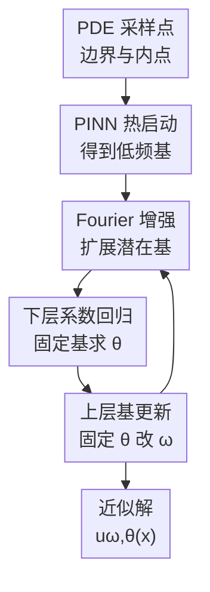

# Iterative Training of Physics-Informed Neural Networks with Fourier-enhanced Features

**会议**: ICLR2026  
**OpenReview**: [https://openreview.net/forum?id=ybffyf7LE7](https://openreview.net/forum?id=ybffyf7LE7)  
**代码**: https://github.com/CyberAltrumi/IFeF-PINN  
**领域**: PINN / Scientific ML / Physics-Informed Learning  
**关键词**: PINN, 谱偏置, 随机傅里叶特征, 双层优化, 高频 PDE  

## 一句话总结
IFeF-PINN 把 PINN 的隐藏层特征先扩展成随机傅里叶基，再交替求解“基函数生成”和“线性系数回归”，从而在高频和多尺度 PDE 上显著缓解普通 PINN 的谱偏置。

## 研究背景与动机
**领域现状**：Physics-Informed Neural Networks（PINNs）把 PDE 残差、边界条件和少量观测数据写进损失函数，用一个神经网络直接近似未知解 $u(x)$。这种做法不依赖固定网格，对复杂几何和高维问题很有吸引力，也让深度学习成为数值 PDE 求解的一条通用路线。

**现有痛点**：普通 PINN 的训练很容易出现谱偏置：网络先拟合低频部分，高频振荡成分学得慢，甚至长期欠拟合。对波传播、湍流、量子动力学这类本来就含有快速振荡的系统，低频先行不是小误差，而是会把解推向错误的稳态或混叠版本；边界项和内点残差之间的梯度不平衡又会进一步放大这种失败模式。

**核心矛盾**：标准 PINN 把两个本该分开的角色绑在同一个非凸优化里：隐藏层负责生成可用的特征基，最后一层负责在这些基上拟合系数。特征还没学好时，系数回归也被拖着走；系数没找到合适投影时，反向传播给隐藏层的信号也会偏向低频和局部残差。于是“学什么基”和“怎样组合基”互相干扰。

**本文目标**：作者希望保留 PINN 的通用物理约束训练形式，同时让模型更像经典数值方法那样先构造基函数、再求解基函数系数。更具体地说，本文要解决三个问题：如何在已有 PINN 的 latent feature 上补入高频表达能力；如何把线性 PDE 下的系数求解变成可控的凸问题；如何在不完全推翻 PINN 训练流程的情况下，形成一个可迭代的训练算法。

**切入角度**：作者观察到 PINN 最后一层本质上是在隐藏层特征 $h_\omega(x)$ 上做线性读出，如果直接在 $h_\omega(x)$ 上套随机傅里叶特征，就能把原本的点积核替换为更适合表达高频变化的 stationary kernel。这样一来，高频增强不是加在原始输入上，而是加在已经由网络自适应学习出的 latent basis 上。

**核心 idea**：用随机傅里叶特征扩展 PINN 的隐藏层基函数，并把训练拆成“固定基求最优线性系数”和“固定系数更新基生成器”的迭代双层优化。

## 方法详解

### 整体框架
IFeF-PINN 的整体流程可以理解为“先用普通 PINN 热启动一个低频可用的 latent basis，再用随机傅里叶特征把这个 basis 扩展到更丰富的高频空间，最后在扩展基上反复做系数回归和基函数更新”。输入仍然是 PDE 的空间/时间坐标与采样点，输出是满足边界条件和物理残差约束的近似解 $u_{\omega,\theta}(x)$。

在线性 PDE 中，固定隐藏层参数 $\omega$ 后，输出系数 $\theta$ 的下层问题是一个二次优化问题，可以直接求到唯一最优解；随后再固定这个 $\theta$，对 $\omega$ 做一步梯度下降，让隐藏层继续生成更适合当前 PDE 的基。非线性 PDE 中，下层问题不再凸，作者改用周期性的梯度下降近似求局部极小点。

### 关键设计
**1. Fourier 增强潜在基：在自适应特征空间里补高频表达**

普通 Fourier feature PINN 往往把随机傅里叶映射直接加到输入坐标 $x$ 上，而本文把映射加在最后隐藏层特征 $h_\omega(x)$ 上。先用一个标准 PINN $\tilde u_{\omega,W}(x)=Wh_\omega(x)$ 进行 warm-up，得到一个已经捕捉低频结构的 latent basis；然后定义 $\psi_D(x)=\gamma_D(h_\omega(x))$，其中

$$
\gamma_D(z)=\frac{1}{\sqrt D}\begin{bmatrix}\cos(2\pi B_Dz)\\ \sin(2\pi B_Dz)\end{bmatrix}, \quad B_D\sim \mathcal N(0,\sigma^2).
$$

这样做的关键不是简单“多加一些特征”，而是把低频 PINN 已经学到的变形坐标系当作 Fourier feature 的输入。若热启动模型只学到了真实解的低频轮廓，RFF 会在这个轮廓空间里生成大量正余弦基，给后续回归提供可能覆盖高频振荡的候选方向。因为 $D$ 可以独立于网络宽度选择，模型能在不加深隐藏网络的情况下扩展基函数数量。

**2. 下层系数回归：把固定基上的 PINN 拟合变成可解的二次问题**

在扩展基上，近似解写成 $u_{\omega,\theta}(x)=\psi_D(x)^\top\theta$。当 PDE 算子 $F$ 和边界/初值算子 $B$ 都是线性的，物理残差和边界误差对 $\theta$ 也是线性的，因此采样损失 $\hat L_\lambda(u_{\omega,\theta})$ 对 $\theta$ 变成二次型：

$$
L_{lower}(\theta\mid\omega)=\frac{1}{2}\theta^\top Q(\omega)\theta+c(\omega)^\top\theta+b.
$$

在正则权重 $\lambda>0$ 且 rank condition 成立时，$Q(\omega)$ 正定，下层最优系数有闭式形式 $\theta^\star(\omega)=-Q(\omega)^{-1}c(\omega)$。这一步把 PINN 中最容易被非凸训练搅乱的“最后线性组合”单独拿出来求最优，至少在线性 PDE 上保证固定基时不会停在随便一个局部解。它和端到端训练的差别很大：端到端训练把 $\theta$ 当普通参数随机初始化、跟 $\omega$ 一起慢慢学，而 IFeF-PINN 每次都让 $\theta$ 对当前基达到最优。

**3. 迭代双层训练：让基生成器和系数求解交替校正**

只做一次“热启动 + RFF + 闭式回归”还不够，因为热启动得到的 $h_\omega$ 可能仍然是偏低频的基。IFeF-PINN 因此采用迭代训练：第 $k$ 轮先基于当前 $\omega_k$ 构造 $\psi_D$，求出 $\theta_{k+1}=\theta^\star(\omega_k)$；然后固定 $\theta_{k+1}$，对上层损失 $L_{upper}(\omega\mid\theta_{k+1})$ 做一步梯度下降，得到 $\omega_{k+1}$。下一轮再用更新后的隐藏层重新构造 RFF 扩展基。

这个交替过程的直觉是：下层回归告诉模型“在当前候选基里，怎样组合才最满足 PDE”；上层更新则根据这个最优组合反过来调整隐藏层，让下一批候选基更有用。理论部分证明了在强凸下层问题、光滑超梯度和有界下方等常见假设下，$\theta^\star(\omega)$ 对 $\omega$ 局部 Lipschitz，进而上层梯度下降会收敛到 stationary point。对非线性 PDE，作者承认下层不再有全局凸性，只能依赖 SOSC 附近的局部极小和周期性下层更新。

**4. 可插拔权重平衡：把 IFeF 当作 PINN 训练外壳而不是单一模型**

论文还测试了 IFeF-PD，即把 primal-dual 权重平衡方法接入 IFeF 的训练流程。这个设计点说明 IFeF-PINN 不是只靠某个固定损失权重赢，而是把“高频基扩展 + 双层系数求解”作为一个可以和现有 PINN 技巧组合的外壳。普通 PINN 的物理残差权重 $\lambda$ 固定时，边界项和 PDE 残差常常互相压制；引入 primal-dual 后，可以在上层训练中更自适应地调节约束强度。

这也解释了实验里 IFeF 和 IFeF-PD 的互补关系：在一些低频问题上，单纯的 IFeF 已经足够好；在高频 Helmholtz 这类更难的线性 PDE 上，IFeF-PD 进一步把相对 $L_2$ 误差从 $0.0156$ 降到 $0.0092$。换句话说，RFF 增强解决“有没有高频基可用”，双层训练解决“系数是否对当前基最优”，权重平衡解决“不同物理约束的梯度是否合理”。

### 一个完整示例
以高频 Helmholtz 方程为例，普通 PINN 从边界点和内点残差开始训练时，通常先学到一个平滑的低频近似，快速振荡部分长期残留在误差图里。IFeF-PINN 会先用这个普通 PINN 作为 warm-up，哪怕它只是一个不完整的低频解，也能提供一组初始隐藏层特征 $h_\omega(x)$。

接着，模型把每个采样点的 $h_\omega(x)$ 投影到随机矩阵 $B_D$ 上，生成 $2D$ 维的正弦/余弦扩展基 $\psi_D(x)$。固定这批基后，线性 Helmholtz 的残差和边界项都可以写成 $\theta$ 的二次目标，于是直接解出当前最优 $\theta$。如果当前基还不能覆盖某些高频波纹，上层梯度会继续调整 $h_\omega$，下一轮 RFF 映射随之改变，相当于重新给系数回归提供一组更合适的高频候选基。

实验中的高频 Helmholtz 设置为 $a_1=a_2=100$。Vanilla PINN、PINNsformer 和 NTK 在该设置下都没有收敛，PIG 的相对 $L_2$ 误差约为 $1.6884$；而 IFeF 达到 $0.0156$，IFeF-PD 达到 $0.0092$。这个例子正好体现了方法的主要收益：不是让网络“更努力训练”，而是改变最后表示空间和系数求解方式，让高频模式有机会进入解空间。

### 损失函数 / 训练策略
基础 PINN 损失包含边界/初值误差与 PDE 内点残差：

$$
\hat L_\lambda(u_\omega)=\frac{1}{N_u}\sum_i\|g(x_u^i)-B[u_\omega](x_u^i)\|^2+\lambda\frac{1}{N_f}\sum_i\|F[u_\omega](x_f^i)\|^2.
$$

IFeF-PINN 先用标准 PINN 预训练若干 epoch 得到 $\omega_0$，这个 warm start 对齐次 PDE 特别重要，因为随机初始化下接近零输出可能让下层问题退化到 $u\equiv 0$ 的无意义解。线性 PDE 中，每轮都对 $\theta$ 做精确下层更新；非线性 PDE 中，作者每隔 $N_{lower}$ 个 epoch 用梯度下降近似更新 $\theta$，中间轮次保持 $\theta$ 不变以节省计算。实验中主要评价指标是收敛后的相对 $L_2$ 误差 $\|u_{pred}-u_{real}\|_2/\|u_{real}\|_2$，每个方法用 5 个随机种子运行。

## 实验关键数据

### 主实验
论文覆盖低频 benchmark、高频/多尺度 PDE、谱分析和若干消融。基线包括 Vanilla PINNs、NTK、PINNsformer、Physics-Informed Gaussians（PIG），附录还比较了 Multiple Fourier Features。作者报告 IFeF 和 IFeF-PD 两个版本，其中 IFeF-PD 额外接入 primal-dual 权重平衡。

| 任务 | 指标 | 本文最好结果 | 主要对比 | 结论 |
|------|------|--------------|----------|------|
| 低频 2D Helmholtz | relative $L_2$ error | IFeF-PD: $3.5\times10^{-5}$ | 多个 PINN 变体 | 本文在低频线性 PDE 上也能取得最低误差 |
| 低频 1D convection | relative $L_2$ error | IFeF: $4.3\times10^{-5}$ | Vanilla / NTK / PINNsformer / PIG | IFeF 不只适用于高频，普通 benchmark 上也稳定 |
| Viscous Burgers | relative $L_2$ error | IFeF 中位误差最低 | 非线性 PDE 基线 | 非线性场景仍有收益，但理论保证弱于线性情况 |
| 高频 Helmholtz $(a_1=a_2=100)$ | relative $L_2$ error | IFeF-PD: $0.0092\pm0.0031$ | PIG: $1.6884\pm0.2775$，多基线未收敛 | 高频线性 PDE 是本文优势最明显的场景 |
| 高频 convection $(\beta=200)$ | relative $L_2$ error | IFeF-PD: $0.0025\pm0.0005$ | Vanilla: $0.9024\pm0.0239$ | 谱偏置被显著缓解 |
| 多尺度 convection-diffusion | relative $L_2$ error | IFeF: $0.0009\pm0.0003$ | Vanilla: $0.0501\pm0.0030$ | 能同时拟合低频和高频成分 |

### 消融实验
| 配置 | 关键指标 | 说明 |
|------|----------|------|
| 去掉 RFF 扩展，仅保留类似两步优化 | 低频 convection 误差约 $1.4923\times10^{-2}$ | 比 Vanilla 略好，但远弱于完整 IFeF；高频 Helmholtz 和 convection 不收敛 |
| End-to-End vs IFeF，低频 Helmholtz | End-to-End: $0.0088\pm0.0006$；IFeF: $0.0003\pm0.0003$；IFeF-PD: $0.00005\pm0.00002$ | 共同优化 $\omega,\theta$ 会失去下层最优性，线性 PDE 上差距很大 |
| End-to-End vs IFeF，高频 Helmholtz | End-to-End 不收敛；IFeF: $0.0156\pm0.0055$；IFeF-PD: $0.0092\pm0.0031$ | 两阶段训练是高频线性问题成功的关键 |
| End-to-End vs IFeF，Burgers | End-to-End: $0.0049\pm0.0009$；IFeF: $0.0024\pm0.0011$；IFeF-PD: $0.0033\pm0.0004$ | 非线性 PDE 中优势仍在，但不如线性场景压倒性 |
| 低频 Helmholtz 改变 $D$ | $D=400$ 时误差 $2.1\times10^{-4}$，$D=3000$ 时 $4.5\times10^{-4}$ | 特征数不是越多越好，过多可能带来过拟合或破坏 rank condition |
| 高频 Helmholtz 改变 $\sigma$ | $\sigma=10$ 时 $3.0\times10^{-3}$，$\sigma=0.2$ 时 $1.05\times10^{-1}$ | 高频问题对 RFF 采样尺度非常敏感，需要更大的频率带宽 |

### 关键发现
- RFF 扩展和双层训练缺一不可。只保留两阶段优化但去掉 RFF，高频问题仍然不收敛；只做 end-to-end 训练虽然也使用公式 $u_{\omega,\theta}=\psi_D(x)^\top\theta$，但没有每轮求最优 $\theta$，在线性 PDE 上明显弱于 IFeF。
- 高频任务是最有说服力的实验。高频 Helmholtz 中多个强基线直接失败或误差大于 1，而 IFeF-PD 能降到 $0.0092$；高频 convection 中，Vanilla 的误差接近 $0.9$，IFeF-PD 只有 $0.0025$。
- 谱分析直接支持作者关于谱偏置的解释。在由 10 个不同频率正弦叠加构成的 convection 初值上，Vanilla PINN 难以恢复高频幅值；增加随机傅里叶特征数量后，高频频谱的归一化幅值恢复更好，即使还没有进行完整双层训练也能看到 basis extension 的作用。
- 超参数 $D$ 和 $\sigma$ 的选择很重要。低频问题较鲁棒，高频问题尤其依赖 $\sigma$；较大的 $\sigma$ 能覆盖更高频率，但过多特征或不合适的采样尺度会带来数值和泛化风险。

## 亮点与洞察
- 最大亮点是把 PINN 的最后一层读出重新解释为“在基函数上做回归”。这个视角把神经网络训练和经典数值 PDE 方法连接起来，让作者可以在线性 PDE 下证明固定基时的全局最优系数，而不是只靠经验调参。
- RFF 加在 latent feature 而不是 raw coordinate 上很巧妙。raw coordinate 的 Fourier feature 是固定频率字典，latent feature 的 Fourier feature 则跟随 $h_\omega$ 自适应变形，更像是在“已经学到的粗解坐标系”上补高频。
- 论文没有把谱偏置只当成实验现象，而是通过频域分析展示了不同频率幅值的恢复情况。这个分析比单纯看误差图更有解释力，也能说明 RFF 的作用并非只是在某个 benchmark 上偶然调出来的。
- IFeF-PINN 可以作为现有 PINN 技巧的外壳使用。IFeF-PD 的结果说明，基扩展/双层求解与权重平衡并不冲突，后续可以把自适应采样、domain decomposition 或 curriculum 策略接进去。
- 对 scientific ML 来说，这篇论文的启发是：有些 PINN failure mode 未必需要更大的网络，而是需要把“表示空间”和“求解器”拆开。对线性或近线性物理系统，这种拆分尤其值得优先考虑。

## 局限与展望
- 最核心的局限是非线性 PDE。线性 PDE 中下层问题是强凸二次规划，可以闭式求最优 $\theta$；非线性 PDE 中下层损失对 $\theta$ 变成非凸，只能用梯度下降近似局部最优，理论保证和实际稳定性都会下降。
- RFF 扩展会带来较高内存开销。特征维度是 $2D$，而高频问题往往需要更大的 $D$ 和更大的 $\sigma$，这会增加线性系统构造、矩阵求解和自动微分残差计算成本。
- 方法仍依赖 warm start 和超参数选择。齐次 PDE 中不做预训练可能收敛到零解；高频 Helmholtz 的 ablation 也显示 $\sigma$ 不合适时误差会急剧变差，因此实际使用需要针对频率范围调参。
- 实验主要是经典 benchmark PDE，复杂几何、高维随机 PDE、强非线性混沌系统和真实观测噪声下的表现还需要进一步验证。尤其是和自适应采样结合时，RFF 扩展后的采样分布是否仍然稳定，是一个值得继续研究的问题。
- 未来可以把下层非凸问题换成更成熟的 implicit differentiation、trust-region bi-level optimization 或低秩/增量线性代数求解器，减少每轮重新求解 $\theta$ 的代价。

## 相关工作与启发
- **vs Vanilla PINN**: Vanilla PINN 直接端到端最小化物理残差和边界误差，本文则把隐藏层基生成和输出系数回归拆开。优势是线性 PDE 中固定基后有全局最优系数，劣势是需要维护更大的 RFF basis 和双层训练流程。
- **vs Fourier feature PINN / MFF**: 这些方法通常把 Fourier feature 加到输入坐标上，本文把 RFF 加到最后隐藏层特征 $h_\omega(x)$ 上，并用双层优化求解输出系数。区别在于本文的 Fourier basis 是建立在自适应 latent space 里的，不只是固定输入编码。
- **vs NTK / weight balancing PINN**: NTK 和权重平衡主要调整训练动力学或损失项衰减速度，本文主要扩大可用基空间并改变系数求解方式。两者并非替代关系，IFeF-PD 已经展示了把 primal-dual 权重平衡接入 IFeF 的收益。
- **vs adaptive resampling 方法**: PINNACLE、adversarial sampling 和 RL-PINNs 试图改进 collocation point 的选择，降低采样损失和真实损失的差距；IFeF-PINN 直接针对谱偏置和特征表达不足。一个自然方向是让采样策略根据 RFF basis 的频谱误差动态调整。
- **vs operator learning 方法**: FNO、DeepONet 学的是算子映射，往往需要特定数据分布或较多训练样本；IFeF-PINN 仍是单个 PDE 实例上的 physics-informed solver。它更像增强版 PINN，而不是替代 operator learning 的通用 surrogate。

## 评分
- 新颖性: ⭐⭐⭐⭐☆ 把 RFF latent basis 与双层系数回归结合得比较自然，线性 PDE 下的凸下层视角有辨识度。
- 实验充分度: ⭐⭐⭐⭐☆ 低频、高频、多尺度、谱分析和消融都覆盖到了，但复杂真实 PDE 与大规模计算代价分析还可以更深入。
- 写作质量: ⭐⭐⭐⭐☆ 结构清楚，理论和实验能互相支撑；部分算法细节和非线性扩展的实际稳定性还需要读附录才能完全复现。
- 价值: ⭐⭐⭐⭐☆ 对 PINN 高频失败模式给出一个可解释、可组合的解决方向，尤其适合线性和弱非线性 scientific ML 场景。

<!-- RELATED:START -->

## 相关论文

- [\[NeurIPS 2025\] Physics-Informed Neural Networks with Fourier Features and Attention-Driven Decoding](../../NeurIPS2025/physics/physics-informed_neural_networks_with_fourier_features_and_attention-driven_deco.md)
- [\[ICLR 2026\] Fast training of accurate physics-informed neural networks without gradient descent](fast_training_of_accurate_physics-informed_neural_networks_without_gradient_desc.md)
- [\[ICLR 2026\] Uncertainty-Aware Diagnostics for Physics-Informed Machine Learning](uncertainty-aware_diagnostics_for_physics-informed_machine_learning.md)
- [\[ICLR 2026\] Extending Fourier Neural Operators for Modeling Parameterized and Coupled PDEs](extending_fourier_neural_operators_for_modeling_parameterized_and_coupled_pdes.md)
- [\[ICLR 2026\] Enhancing Stability of Physics-Informed Neural Network Training Through Saddle-Point Reformulation](enhancing_stability_of_physics-informed_neural_network_training_through_saddle-p.md)

<!-- RELATED:END -->
