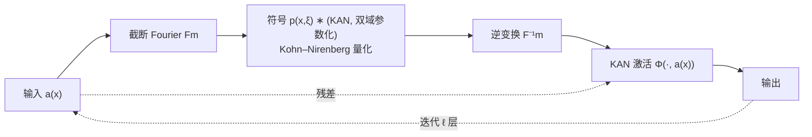

# KANO: Kolmogorov–Arnold Neural Operator

**会议**: ICLR 2026  
**OpenReview**: [https://openreview.net/forum?id=2QmiKXfsIr](https://openreview.net/forum?id=2QmiKXfsIr)  
**代码**: 待确认  
**领域**: 应用于物理科学 / 神经算子  
**关键词**: 神经算子, KAN, 伪微分算子, 符号可解释性, 变系数 PDE, 量子哈密顿量学习  

## 一句话总结
KANO 把 KAN 子网络嵌入伪微分算子框架，在频域和空域两个基上联合参数化算子，既突破了 Fourier Neural Operator (FNO) 的纯谱瓶颈、能在变系数 PDE 上稳健泛化，又能把学到的算子读出成闭式符号公式（系数精确到小数点后第四位）。

## 研究背景与动机
**领域现状**：算子学习用神经网络逼近无穷维函数空间之间的映射 $G:\mathcal{A}\to\mathcal{U}$，是数据驱动建模物理动力学（PDE）的主力工具。FNO 把编码器硬编码为截断 Fourier 变换、用谱域对角核学习潜在映射，当目标算子在谱域稀疏时又快又准，已成事实标准。

**现有痛点**：现实中一大类重要问题是**变系数 PDE**——至少一项的系数随变量（尤其是位置）变化，本文称之为"位置依赖动力学"，例如空间变黏滞流体、带位置势的薛定谔方程。这类算子在谱域是**稠密**的：以量子谐振子 $Ha=-\partial_{xx}a + x^2 a$ 为例，微分项 $-\partial_{xx}$ 在谱域是对角乘子 $\xi^2$（稀疏），但乘子项 $x^2$ 在谱域变成稠密 Toeplitz 矩阵。FNO 的谱核是对角的、无法混合模式，只能靠非线性激活去凑这些非对角项，而这些非对角项被绑死在训练输入分布上——这就是 **FNO 的纯谱瓶颈**：模型只在样本内映射上收敛，一出训练分布就崩。

**核心矛盾**：先前所有 FNO 变体（factorized / 多尺度谱核、注入局部空域核的 U-FNO、AM-FNO 等）仍然**以谱基为特权**，无法在空域基上取得最优稀疏；另一方面，基于 KAN 的算子网络（DeepOKAN 等）虽有性能提升，却从未报告过学到算子的**符号恢复**。"既能在变系数 PDE 上稳健泛化、又能符号可解释"的算子网络是缺失的。

**本文目标**：填补这一空白——构建一个对一般位置依赖动力学具备实用参数复杂度、且能内在符号可解释的算子网络。

**核心 idea**：**用"每一项在它稀疏的那个基里表示"的双域参数化**——微分项放谱域、局部乘子项放空域，套进伪微分算子（pseudo-differential operator）框架，并用 KAN 子网络承载可读的一元函数边，从而既稀疏又可符号读出。

## 方法详解

### 整体框架
KANO 沿用 FNO 的迭代层结构 $G_\theta^{\text{KANO}}=L^{(\ell)}_{\text{KANO}}\circ\cdots\circ L^{(1)}_{\text{KANO}}$，但**去掉了 FNO 标志性的宽 lift-up/projection 网络**（因为宽 KAN 不利于符号恢复）。每个 KANO 层用一个 KAN 子网络 $p(x,\xi)$ 充当**伪微分符号**，它同时由空间 $x$ 和频率 $\xi$ 两个基参数化；再用另一个 KAN 子网络 $\Phi$ 充当可学习非线性激活。所有计算都用 Kohn–Nirenberg 量化在双域上完成符号演算。

### 关键设计

**1. 双域伪微分符号 $p(x,\xi)$：让每一项落在自己稀疏的基里**。KANO 层定义为 $L_{\text{KANO}}(a)(x)=\Phi\big(F^{-1}_m[\,p(x,\xi)*F_m(a)(\xi)\,](x),\,a(x)\big)$，注意这里是卷积 "$*$" 而非 FNO 的对角乘 "$\cdot$"。关键在于符号 $p(x,\xi)$ 同时吃空间和频率：由 Fourier 对偶关系，空间项在谱域表现为微分（卷积），谱项在谱域表现为乘子，于是同一个 $p$ 能把微分项写成 $\xi^2$ 型对角、把乘子项写成空域稀疏的位移矩阵 $S^{(2)}_n$。对量子谐振子，KANO 只需取 $p(x,\xi)\approx x^2+\xi^2$ 就能精确表示 $H$，每一项都用它稀疏的那个表示，从根本上绕开了 FNO "稠密 Toeplitz 必须靠激活硬凑、被绑死在训练分布"的困境。

**2. Kohn–Nirenberg 量化：在双域上严格做符号演算**。因为 $p(x,\xi)$ 是空频联合的，不能简单地频域逐点相乘，必须在两个域上同时量化。KANO 采用 Kohn–Nirenberg 量化把符号变成算子 $\text{Op}_m(p):=F^{-1}_m[p(x,\xi)*F_m]$，具体计算为双重求和 $\frac{h}{L^d}\sum_{\xi\in\Xi}\sum_{y\in Y}e^{i(x-y)\cdot\xi}\,p(x,\xi)\,a(y)$。这一步虽然引入了双重求和的计算量，但对目标算子类（变系数 PDE）可以被它证明的参数效率补偿；它带来的回报是**理论上无输入约束**：由 Demanet–Ying 的求积界，投影误差满足 $\|G-\text{Op}_m(p_G)\|\le C\,B\,m^{-s}$，只要输入有限能量，宽度 $m$ 就按 $\epsilon_{\text{proj}}$ 多项式缩放——而 FNO 必须要求输入 Fourier 尾快速衰减、且对稠密算子潜在网络规模会**超指数**爆炸 $N_{\text{net}}\sim O(\epsilon_{\text{net}}^{-\epsilon_{\text{proj}}^{-d/s}})$。

**3. KAN 边带来的符号可解释性**。由于符号 $p(x,\xi)$ 和激活 $\Phi$ 都用紧凑 KAN（每条边是可视化的一元 B 样条曲线）承载，整个网络可逐边检视，进而对学到的边做符号回归，读出闭式公式。训练收敛后冻结这些符号边、继续微调，得到 **KANO symbolic** 变体——它在合成算子上把真实算子的系数恢复到小数点后第四位（如 $\tilde{G}_1 f=(x^2+0.0003)f-\partial_{xx}f$），且 KANO 与 KANO symbolic 损失相当，证明 KANO 确实收敛到了接近真实算子的解。

**4. Q-KANO：面向量子态演化的改装**。为学习长时程量子动力学，符号被参数化为幺正形式 $p_\theta=\exp(-i\Delta T\,\phi_\theta(x,\xi))$，激活也改成带可学相位的复指数，整层为 $G^{\text{Q-KANO}}_\theta[\psi]=\text{Op}_m(\exp(-i\Delta T\,\phi_\theta(x,\xi)))\psi\cdot e^{-i\Delta T\vartheta}$，从而在保物理结构（幺正性）的前提下从投影测量数据学哈密顿量。

## 实验关键数据

### 主实验表格（合成位置依赖算子，相对 $\ell_2$ 损失 $\times10^{-4}$；A=训练族内, B=未见测试族, B/A 越接近 1 泛化越稳）

| 模型 (参数量) | G1 A | G1 B | G1 B/A | G2 B/A | G3 B/A |
|---|---|---|---|---|---|
| FNO (566k) | 6.36 | 98.8 | 15.53 | 8.21 | 7.14 |
| U-FNO (579k) | 2.79 | 22.9 | 8.21 | 41.65 | 3.16 |
| AM-FNO (548k) | 1.08 | 20.9 | 19.35 | 13.75 | 25.69 |
| PDNO (538k) | 1.41 | 6.31 | 4.5 | 6.3 | 6.7 |
| **KANO (152)** | 1.04 | 1.44 | **1.38** | **1.19** | **1.03** |
| KANO symbolic | 0.512 | 0.526 | 1.03 | 1.00 | 1.03 |

三个算子 $G_1 f=x^2 f-\partial_{xx}f$、$G_2 f=x\partial_x f+\partial_{xx}f$、$G_3 f=f^3+x\partial_x f+\partial_{xx}f$。KANO 仅用 **152 个参数（FNO 的 0.03%）** 就拿到低一个数量级的损失，且 B/A 接近 1（稳健泛化），而 FNO 系出训练分布损失暴涨十几倍。

### 消融实验表格

| 变体 | 说明 | 结果 |
|---|---|---|
| KANO MLP (2k) | 把 KAN 子网换成紧凑 MLP | B/A≈1.8–2.0，仍稳健泛化 → 泛化主要来自双域架构而非 KAN 本身 |
| PDNO | 伪微分框架但用 MLP+保留宽网络 | FNO 族里最稳，但仍不如 KANO |
| U-FNO / AM-FNO | 谱核+局部增强 | 反而更差 |

### 关键发现
- **泛化来自双域架构**：KANO MLP 仍稳健，说明稳健泛化源于伪微分双域设计，符号可解释性才是 KAN 的额外红利。
- **符号恢复**：KANO symbolic 把真实算子系数恢复到第四位小数（见 Table 2，如 $\tilde{G}_3 f=1.0001 f^3+0.99997\,x\partial_x f+0.99997\,\partial_{xx}f-\dots$）。
- **插值测试印证理论**：把训练族 A 与测试族 B 的样本插值 100 步并施加真实算子，FNO 损失在前中段缓增（说明样本内映射尚接近真值）、在后段骤升（已远离训练分布），与 Theorem 1/2 的预测一致；KANO 全程平稳。
- **量子长时程基准**（双阱 DW / 立方非线性薛定谔 NLSE，预测后续 90 步态保真度）：Q-KANO 用真实波函数训练得到态不保真度 $\approx 6.3\times10^{-6}$，比用**理想完整波函数**训练的 FNO（$\approx1.5\times10^{-2}$）**低四个数量级**；即便只用物理可得的位置+动量 PMF（非完整信息）也能达到 $\approx6.3\times10^{-6}$，而仅用位置 PMF 则退化到 $4.7\times10^{-3}$（DW），说明动量信息对可观测重建很关键。

## 亮点与洞察
- **"在稀疏的基里表示每一项"是核心洞见**：FNO 失败不在逼近能力（普适逼近定理仍成立），而在**泛化**——把稠密 Toeplitz 强塞进对角谱核会把非对角项绑死在训练分布上。双域稀疏让投影误差 $\epsilon_{\text{proj}}$ 与网络误差 $\epsilon_{\text{net}}$ 解耦，破除超指数缩放。
- **理论扎实**：Lemma 1 + Theorem 1 证明位置算子会拉长 Fourier 尾、导致 FNO 维度灾难；Theorem 2 证明只要 KANO 符号光滑，模型规模就按精度多项式缩放。
- **极致参数效率**：合成基准上 KANO 仅 152 个参数即超越数十万参数的 FNO 族，这种"小而准"对可解释科学建模尤为关键。
- **范式转移**：从算子学习的"普适逼近"转向"普适泛化"，并首次量化算子学习中经由 KAN 的符号恢复。
- **实用价值**：量子哈密顿量学习能从投影测量（实际可测）而非理想全波函数中重建闭式哈密顿量，对实验物理极有吸引力。

## 局限与展望
- **计算开销**：Kohn–Nirenberg 量化需双重求和，单层计算偏重；作者称对变系数 PDE 类可被参数效率补偿，但通用场景成本仍是问题。
- **去掉宽 lift-up/projection 网络**牺牲了高维大基准上的性能——作者明确把 KANO 定位为"优先符号恢复+稳健泛化"，与 FNO 互补，高维扩展留作未来工作。
- **符号恢复依赖光滑符号假设**：面对高度不规则系数需借助 KAN 符号恢复的近期进展（非光滑、不连续目标）。
- lift-up/projection 网络的理论作用本身仍是开放问题。

## 相关工作与启发
- **FNO 及其变体**（U-FNO、AM-FNO、factorized/多尺度 FNO）：都仍以谱基为特权；KANO 指出根本问题在于单一谱基的稠密 Toeplitz。
- **PDNO**（Shin et al. 2022）：最早把伪微分算子框架用于神经算子，但假设符号可分离 $p(x,\xi)=p_x(x)\cdot p_\xi(\xi)$、用 MLP 且保留宽网络；KANO 用联合不可分 KAN 符号、去宽网络，实现符号恢复。
- **KAN 系**（Liu et al. 2024、DeepOKAN）：把 KAN 引入科学建模/算子网络，但未报告算子级符号恢复；KANO 是首个量化算子学习符号恢复的工作。
- **理论基石**：FNO 的投影误差由 Fourier 尾决定（Kovachki et al. 2021）、Kohn–Nirenberg 量化的求积界（Demanet–Ying 2011）、KAN 表达力界（Wang et al. 2024）三者拼出了 KANO 的多项式缩放保证。
- **启发**：把"选对表示基"作为归纳偏置来换取分布外泛化，这一思路可推广到其他被单一变换域硬编码限制的算子/信号模型。

## 评分
- **新颖性**: ⭐⭐⭐⭐⭐ 首次把 KAN 嵌入伪微分算子框架实现双域稀疏 + 算子级符号恢复，理论上破除 FNO 纯谱瓶颈，范式从普适逼近转向普适泛化。
- **实验充分度**: ⭐⭐⭐⭐ 合成算子（含泛化/插值测试）+ 量子长时程基准 + 多消融，结论清晰；但高维真实 PDE 与计算成本未系统评估。
- **写作质量**: ⭐⭐⭐⭐ 理论推导严谨、动机—瓶颈—方法逻辑顺畅，公式密度高对读者要求较高。
- **价值**: ⭐⭐⭐⭐⭐ 在变系数 PDE/量子哈密顿量学习上既稳健又可解释，参数量降到 FNO 的 0.03%，对科学 AI 有方法论意义。

<!-- RELATED:START -->

## 相关论文

- [\[ICLR 2026\] Initialization Schemes for Kolmogorov-Arnold Networks: An Empirical Study](initialization_schemes_for_kolmogorov-arnold_networks_an_empirical_study.md)
- [\[AAAI 2026\] Catastrophic Forgetting in Kolmogorov-Arnold Networks](../../AAAI2026/physics/catastrophic_forgetting_in_kolmogorov-arnold_networks.md)
- [\[AAAI 2026\] FlashKAT: Understanding and Addressing Performance Bottlenecks in the Kolmogorov-Arnold Transformer](../../AAAI2026/physics/flashkat_understanding_and_addressing_performance_bottlenecks_in_the_kolmogorov-.md)
- [\[AAAI 2026\] Learning Fair Representations with Kolmogorov-Arnold Networks](../../AAAI2026/physics/learning_fair_representations_with_kolmogorov-arnold_networks.md)
- [\[CVPR 2025\] KAC: Kolmogorov-Arnold Classifier for Continual Learning](../../CVPR2025/physics/kac_kolmogorov-arnold_classifier_for_continual_learning.md)

<!-- RELATED:END -->
