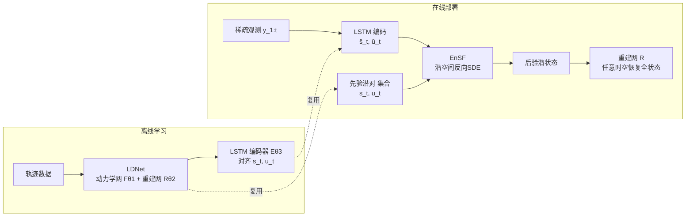

# LD-EnSF: Synergizing Latent Dynamics with Ensemble Score Filters for Fast Data Assimilation with Sparse Observations

**会议**: ICLR 2026  
**OpenReview**: [https://openreview.net/forum?id=AWSVzzhbr7](https://openreview.net/forum?id=AWSVzzhbr7)  
**代码**: [https://github.com/pengpeng-xiao/ld-ensf](https://github.com/pengpeng-xiao/ld-ensf)  
**领域**: 数据同化 / 科学计算 / 基于分数的滤波  
**关键词**: 数据同化, Ensemble Score Filter, 潜空间动力学, LDNet, 稀疏观测, LSTM 编码器  

## 一句话总结
LD-EnSF 用可学习的潜动力学网络（LDNet）替代昂贵的全空间数值前向模拟，把基于分数的集合滤波（EnSF）完全搬进一个极低维潜空间，并用历史感知的 LSTM 编码器对齐稀疏不规则观测，从而在保持高精度的同时把数据同化加速数个量级。

## 研究背景与动机
**领域现状**：数据同化（Data Assimilation, DA）通过把观测数据融入数值模型来跟踪复杂动力系统，广泛用于天气预报、计算流体力学、海冰建模。经典贝叶斯滤波方法如 Kalman Filter、Ensemble Kalman Filter（EnKF）效率高，但在高维非线性系统下受困于维度的二次复杂度和线性化后验假设。基于分数的 Ensemble Score Filter（EnSF）以线性复杂度、无线性假设的方式编码概率密度，通过求解反向时间 SDE 采样后验，在 Lorenz 96、准地转动力学等高维非线性问题上表现出色。

**现有痛点**：EnSF 在**稀疏观测**下严重失效——未观测区域的似然梯度为零，分数信息消失。Latent-EnSF 用耦合 VAE 把状态和观测投影到共享潜空间，让分数滤波获得更有信息量的梯度，即便只用 0.44% 的状态分量也能同化成功。但它的同化之后**仍需在全空间用数值方法传播完整动力学**，计算代价高昂，难以实时；而且 VAE 的潜状态震荡、不光滑，难以在潜空间上构建稳定的代理动力学模型。

**核心矛盾**：要么用全空间前向模拟（精度好但慢到无法实时），要么用代理模型（快但精度和稳定性不足）。如何既避免全空间模拟、又在稀疏噪声观测下保持高精度，是关键张力。

**本文目标**：构建一个完全运行在低维潜空间、无需调用原始数值模拟器的快速、鲁棒、精确的数据同化方法。

**核心 idea**：用改进的 **LDNet** 学习光滑且低维的代理潜动力学来替代全空间前向传播，用 **LSTM 编码器**把历史稀疏观测对齐到该潜空间，然后在这个统一的潜空间里跑 EnSF 完成贝叶斯滤波——**潜动力学（LD）+ 集合分数滤波（EnSF）协同**。

## 方法详解

### 整体框架
LD-EnSF 分离线学习与在线部署两段。离线阶段先训练 LDNet 捕获潜动力学（phase 1），再训练 LSTM 编码器把观测历史 $y_{1:t}$ 映射到与 LDNet 的潜状态 $s_t$ 和参数 $u_t$ 对齐的潜变量（phase 2）。在线阶段，每个同化时刻把先验潜对 $\{s_t, u_t\}$ 的集合与 LSTM 编码得到的潜观测 $(\hat{s}_t, \hat{u}_t)$ 一起喂给 EnSF，在潜空间求解反向 SDE 得到后验潜状态，最后用重建网络在任意时空点恢复全状态。

### 关键设计
**1. 改进的 LDNet 作为光滑代理潜动力学：** LDNet 由动力学网络 $F_{\theta_1}$（演化潜状态）和重建网络 $R_{\theta_2}$（把潜状态映回任意空间点的全状态）组成，相比 VAE 它不需要单独编码器、参数更少且潜状态更光滑。动力学网络输出潜状态的时间导数 $\dot{s}_{t-1} = F_{\theta_1}(s_{t-1}, u_t)$，再以一步前向 Euler 更新 $s_t = s_{t-1} + \Delta t\, \dot{s}_{t-1}$。作者做了三处针对性改进让它适配数据同化：其一是**平移初始潜状态**，把初始化从 $s_0=0$ 改成 $s_{-1}=0$，以容纳变化的初始条件（这正是 tsunami 例子里随机高斯隆起位置带来的难点）；其二是**两阶段训练**，先联合训练 $F_{\theta_1},R_{\theta_2}$ 最小化重建损失 $L = \frac{1}{NMn}\sum_j\sum_t\sum_\xi \|\tilde{x}_j(t,\xi)-x_j(t,\xi)\|^2$，再固定潜表示单独微调重建网降低重建误差；其三是**ResNet + Fourier 编码的重建网架构**，用 $\xi \mapsto [\cos B\xi, \sin B\xi]$（$B$ 可训练）捕捉高频空间分量，专门救 Kolmogorov 湍流这类高频动力学。这些改进让 LDNet 在三个例子上的相对 RMSE 全面低于原版 LDNet 和 VAE，且潜状态明显更光滑——而光滑是后续潜观测对齐与时间插值的前提。

**2. 历史感知的 LSTM 观测编码器：** Latent-EnSF 的 VAE 编码器只能处理规则网格上单步 $t$ 的观测，且无法利用时间相关性。本文改用单层 LSTM $E_{\theta_3}: \mathbb{R}^{d_y \times t} \to \mathbb{R}^{d_u+d_s}$，输入历史观测序列 $y_{1:t}$，输出**同时**逼近潜状态和系统参数的对 $(\hat{s}_t, \hat{u}_t) = E_{\theta_3}(y_{1:t})$。这本质上是学习一个非线性时延嵌入（Takens 嵌入），用历史观测补偿单步信息的极度稀疏；同时 LSTM 天然能吃任意/不规则空间位置的观测，不受规则网格限制。训练目标对齐编码输出与 LDNet 给出的真实潜状态和参数：$L(\theta_3) = \frac{1}{Nn}\sum_j\sum_t (\|\hat{s}_t^{(j)} - s_t^{(j)}\|^2 + \|\hat{u}_t^{(j)} - u_t^{(j)}\|^2)$。这个设计让同化不仅估计状态、还**联合估计不确定参数** $u_t$（如 Reynolds 数、地震位置、强迫项幅度），而这正是 LDNet 对参数高度敏感所必需的纠错环节。

**3. 潜空间内的 EnSF 贝叶斯滤波：** 把增广潜状态记为 $\kappa_t = (s_t, u_t)$，LSTM 编码的潜观测记为 $\phi_t = (\hat{s}_t, \hat{u}_t)$，并把潜观测模型近似为恒等映射加噪声 $\phi_t = \kappa_t + \hat{\gamma}_t$。贝叶斯滤波两步走：预测步 $P(\kappa_t|\phi_{1:t-1}) = \int P(\kappa_t|\kappa_{t-1}) P(\kappa_{t-1}|\phi_{1:t-1}) d\kappa_{t-1}$，其转移概率直接由 LDNet 的潜动力学给出，参数样本 $u_t$ 从 $u_{t-1}$ 的经验后验中抽取；更新步 $P(\kappa_t|\phi_{1:t}) \propto P(\phi_t|\kappa_t) P(\kappa_t|\phi_{1:t-1})$。由于整个流程都在潜空间，EnSF 的反向时间 SDE 也在潜空间求解（从标准正态采样积分到后验样本），**同化期间完全不需要映回全空间**——只在最后用重建网恢复全状态。加上潜轨迹光滑，还能在任意连续时间点插值重建，不局限于观测时刻。

## 实验关键数据
三个递增复杂度的高维例子：Kolmogorov 流（$150\times150$，不确定 Reynolds 数）、tsunami 浅水波（$150\times150$，不确定初始隆起位置）、大气建模（$512\times256$，不确定强迫项，空间稀疏 ~0.1%、时间稀疏 ~0.2%）。

### 代理模型精度（相对 RMSE，时间平均）

| 例子 | VAE | VAE-dyn | LDNet（原版） | LDNet（本文） |
|------|-----|---------|--------------|--------------|
| Kolmogorov | 0.0131 | 0.964 | 0.0349 | **0.0123** |
| Tsunami | 0.0309 | 1.33 | 0.1837 | **0.0168** |
| Atmospheric | 0.0856 | 0.483 | 0.1042 | **0.0656** |

VAE-dyn（VAE+LSTM 预测潜动力学）长期预测不稳定、误差快速累积；原版 LDNet 在 tsunami 上无法捕捉变化初始条件、在 Kolmogorov 上高频误差大；本文 LDNet 三例全面最优。

### 同化精度与计算成本
- **精度**：在 10% 观测噪声下，全空间方法 EnSF、LETKF 在高维稀疏场景失效（EnSF 因梯度无信息、LETKF 因 CFL 数值不稳定提前发散），Latent-EnSF-dyn 因前向精度受限退化。**LD-EnSF 同化误差最小**；在大气例子极端稀疏（空间 0.1%、时间 0.2%）下仍保持约 **5% 相对 RMSE**。
- **加速**：相比其他方法的全动力学演化，LD-EnSF 仅演化代理潜动力学，三例分别取得约 $2\times10^5$、$4\times10^3$、$5\times10^5$ 倍加速（演化时间 $T_d$）。潜维度仅 **10 / 12 / 52**，远低于 Latent-EnSF 的 **400 / 400 / 512**，进一步降低同化时间；且同化全程不需逐步解码回全状态（只在最后一步重建），省去额外重建时间 $T_r$。

### 关键发现
- LDNet 的潜状态比 VAE **显著更光滑**，这是潜观测能精确匹配预测潜状态、并支持任意时刻时间插值的根本原因。
- 联合估计参数 $u_t$ 是必要的：LDNet 对参数高度敏感，同化中纠正参数才能维持长期精度。

## 亮点与洞察
- **"代理动力学 + 分数滤波"的协同闭环**：以往潜空间同化（Latent-EnSF）只把"采样"搬进潜空间、"前向传播"仍留在全空间，本文把两者统一在同一个低维潜空间里，从根上消除全空间模拟，这才是数个量级加速的来源。
- **光滑性是被低估的关键变量**：LDNet 相对 VAE 的真正优势不只是低维，而是潜轨迹光滑——光滑直接决定了稀疏观测能否对齐、以及能否做时间插值。
- **把"参数敏感"从缺点变成抓手**：LDNet 对参数敏感本是隐患，但作者借数据同化在线估计并纠正参数，反而让它适配同化任务。

## 局限与展望
- 实验主要采用静态或缓变参数 $u(t)$；若参数剧烈变化，需额外学习显式参数动力学 $u_{t+1}=F_u(u_t)$，本文未充分验证。
- 方法依赖离线训练 LDNet 和 LSTM，需要充足的高质量轨迹数据；离线成本与泛化到训练分布外初始条件/参数范围的能力值得进一步考察。
- 潜观测噪声 $\hat{\gamma}_t$ 通过 LSTM 编码真实噪声估计，这一近似在更复杂噪声结构下的有效性有待检验。

## 相关工作与启发
- **EnSF**（Bao et al., 2024）：基于分数的集合滤波，线性复杂度、无线性假设，但稀疏观测下梯度消失——本文要解决的直接前身。
- **Latent-EnSF**（Si & Chen, 2025）：用耦合 VAE 把状态与观测投到共享潜空间缓解稀疏问题，但前向仍在全空间、潜状态不光滑——本文的直接基线与改进对象。
- **LDNet**（Regazzoni et al., 2024）：联合学习光滑潜表示与时间演化、无需独立编码器的代理模型，本文在初始化、训练策略、架构三方面改进它。
- **启发**：当"采样/推断"和"动力学传播"被拆在不同空间时，往往是计算瓶颈所在；把整条贝叶斯滤波管线统一到一个光滑、低维、可学习的潜空间，是兼顾速度与精度的有效范式，可迁移到其他需要实时反演的科学计算场景。

## 评分
- **新颖性**: ⭐⭐⭐⭐ — 把 LDNet 代理动力学与潜空间 EnSF 统一进同一低维空间、并用 LSTM 联合估计状态与参数，是对 Latent-EnSF 的实质性而非增量改进。
- **实验充分度**: ⭐⭐⭐⭐ — 三个递增复杂度的真实物理系统、与 EnSF/Latent-EnSF/LETKF/4DEnVar 多基线对比，精度与计算成本双维度评估，消融覆盖代理模型与不规则观测。
- **写作质量**: ⭐⭐⭐⭐ — 动机层层递进、框架图清晰、公式与算法完整，前因后果交代到位。
- **价值**: ⭐⭐⭐⭐ — 数个量级加速使高维稀疏观测下的实时数据同化成为可能，对天气/海洋/大气等领域有现实意义。

<!-- RELATED:START -->

## 相关论文

- [\[ICML 2026\] From Geometry to Dynamics: Learning Overdamped Langevin Dynamics from Sparse Observations with Geometric Constraints](../../ICML2026/physics/from_geometry_to_dynamics_learning_overdamped_langevin_dynamics_from_sparse_obse.md)
- [\[ICLR 2026\] VisionLaw: Inferring Interpretable Intrinsic Dynamics from Visual Observations via Bilevel Optimization](visionlaw_inferring_interpretable_intrinsic_dynamics_from_visual_observations_vi.md)
- [\[ICLR 2026\] Incomplete Data, Complete Dynamics: A Diffusion Approach](incomplete_data_complete_dynamics_a_diffusion_approach.md)
- [\[AAAI 2026\] Fast 3D Surrogate Modeling for Data Center Thermal Management](../../AAAI2026/physics/fast_3d_surrogate_modeling_for_data_center_thermal_management.md)
- [\[ICLR 2026\] Neural Latent Arbitrary Lagrangian-Eulerian Grids for Fluid-Solid Interaction](neural_latent_arbitrary_lagrangian-eulerian_grids_for_fluid-solid_interaction.md)

<!-- RELATED:END -->
