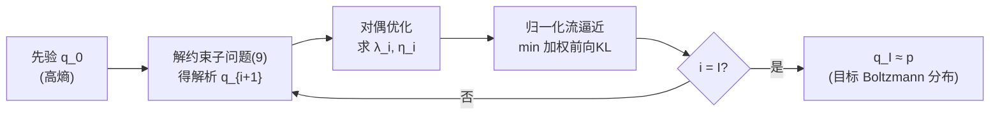

# Learning Boltzmann Generators via Constrained Mass Transport

**会议**: ICLR 2026  
**OpenReview**: [https://openreview.net/forum?id=MQmrcX5jnk](https://openreview.net/forum?id=MQmrcX5jnk)  
**代码**: 待确认  
**领域**: 概率方法 / 采样 / Boltzmann 生成器 / 分子模拟  
**关键词**: Boltzmann generator, 变分采样, 退火路径, 信赖域约束, 熵约束, 归一化流  

## 一句话总结
针对几何退火路径在训练 Boltzmann 生成器时常见的"质量瞬移"(mass teleportation)与模式坍缩问题，本文提出**约束质量传输 (Constrained Mass Transport, CMT)**：把直接最小化反向 KL 拆成一串"既约束相邻分布 KL、又约束熵衰减速率"的子优化问题，自动诱导出更平滑的退火路径，使有效样本量比 SOTA 高出 2.5 倍以上且不坍缩。

## 研究背景与动机
**领域现状**：从高维多峰的未归一化分布 $p(x)=\tilde p(x)/Z$ 中采样是科学计算与机器学习的核心难题，其中归一化常数 $Z=\int \tilde p(x)\,\mathrm dx$ 不可解。分子 Boltzmann 生成器 (BG) 是典型代表，目标分布为 $\tilde p(x)=\exp(-E(x)/k_BT)$，训练好后能绕过昂贵的分子动力学 (MD) 模拟、直接高效采样热力学系综。

**现有痛点**：直接最小化反向 KL $D_{\mathrm{KL}}(q\|p)$ 容易**模式坍缩**——忽略目标分布的低概率模式。为缓解，主流做法是构造从可采样先验 $q_0$ 到目标 $p$ 的中间分布序列，最常用的是几何退火路径 $q_i\propto q_0^{1-\beta_i}\tilde p^{\beta_i}$。但几何退火存在两个顽疾：(1) **质量瞬移**——相邻步之间大块概率质量突然转移到当前中间分布密度近乎为零的区域，阻断有效传输；(2) 性能高度依赖退火 schedule 的人工调参。

**核心矛盾**：固定的几何退火路径形状单一，无法同时保证"相邻分布充分重叠"和"避免过早收敛"，调度表又难调。

**本文目标**：设计一个能**自动调度**、且路径形状可主动调控的变分框架，在仅靠能量评估(不用 MD 样本)的前提下训练大分子 BG。

**核心 idea**（**约束化退火**）：借鉴强化学习中的信赖域思想，把单一的反向 KL 最小化拆成一连串带约束的子问题——既用信赖域约束限制相邻分布的 KL（保证重叠、自动调度），又用熵约束限制熵的衰减速率（防止质量瞬移与过早收敛），两者结合即得到一族介于"几何"与"温度"之间的可控退火路径。

## 方法详解

### 整体框架
CMT 把"从 $q_0$ 直奔 $p$"替换为求解一串带约束的变分子问题，每解一步得到一个解析形式的中间密度 $q_{i+1}$，序列 $(q_i)$ 自然构成一条从先验插值到目标的退火路径。由于解析的 $q_{i+1}$ 无法直接采样，再用归一化流 $\hat q_i$ 通过加权前向 KL 去逼近它，并复用上一步样本作 replay buffer，最终迭代逼近 $q_I\approx p$。

### 关键设计

**1. 信赖域约束：自动调度的几何退火路径**　第一块拼图是把全局的 $\min_q D_{\mathrm{KL}}(q\|p)$ 拆成迭代子问题 $q_{i+1}=\arg\min_q D_{\mathrm{KL}}(q\|p)\ \text{s.t.}\ D_{\mathrm{KL}}(q\|q_i)\le\varepsilon_{\mathrm{tr}}$，即要求新分布与上一步分布的 KL 不超过信赖域半径 $\varepsilon_{\mathrm{tr}}$。借助 KL 的凸性，除最后一步外约束都取等号，因而存在有限步 $I$ 使 $q_I=p$。用拉格朗日松弛 $L_{\mathrm{tr}}=D_{\mathrm{KL}}(q\|p)+\lambda(D_{\mathrm{KL}}(q\|q_i)-\varepsilon_{\mathrm{tr}})$ 可解出解析最优密度 $q_{i+1}(x)\propto q_i(x)^{\frac{\lambda}{1+\lambda}}\tilde p(x)^{\frac{1}{1+\lambda}}$，这正是几何退火路径，但其指数 $\beta_i$ 由信赖域自动决定——**调度表不再需要手调**，而是由"相邻分布保持固定重叠度"这一物理约束反推出来。最优乘子 $\lambda_i$ 通过最大化凹的对偶函数 $g_{\mathrm{tr}}(\lambda)=-(1+\lambda)\log Z_{i+1}(\lambda)-\lambda\varepsilon_{\mathrm{tr}}$ 获得。

**2. 熵约束：抑制过早收敛**　光有信赖域仍会保留几何路径的质量瞬移。第二块拼图改为约束熵的衰减速率：$q_{i+1}=\arg\min_q D_{\mathrm{KL}}(q\|p)\ \text{s.t.}\ H(q_i)-H(q)\le\varepsilon_{\mathrm{ent}}$，其中 $H(q)=-\int q\log q$。其解析解为温度退火路径 $q_{i+1}(x)\propto\tilde p(x)^{\frac{1}{1+\eta}}$，相当于沿温度方向缓慢"降温"，每步熵的下降幅度被 $\varepsilon_{\mathrm{ent}}$ 卡住，从而避免过早塌到单一模式。与强化学习里约束**绝对熵值**不同，CMT 约束的是**熵的相对变化**，无需事先知道目标分布的熵——这对采样任务至关重要。但它有死角：若初始熵 $H(q_0)\gg H(p)$，$q_0$ 到 $q_1$ 的 KL 可能任意大，缺乏重叠导致不稳定。

**3. 混合约束：兼顾重叠与防坍缩**　把前两者合并成单一子问题 $q_{i+1}=\arg\min_q D_{\mathrm{KL}}(q\|p)\ \text{s.t.}\ D_{\mathrm{KL}}(q\|q_i)\le\varepsilon_{\mathrm{tr}},\ H(q_i)-H(q)\le\varepsilon_{\mathrm{ent}}$，引入两个乘子 $\lambda,\eta$。解析最优密度变为几何-温度混合路径 $q_{i+1}(x)\propto q_i(x)^{\frac{\lambda}{1+\lambda+\eta}}\tilde p(x)^{\frac{1}{1+\lambda+\eta}}$。信赖域分量保证即便 $H(q_0)\gg H(p)$ 时 $q_0,q_1$ 的 KL 也不超过 $\varepsilon_{\mathrm{tr}}$、从而充分重叠；熵分量则压住质量瞬移与过早收敛。求 $\lambda_i,\eta_i$ 只需在凹的二维对偶 $g_{\mathrm{tr\text-ent}}(\lambda,\eta)=-(1+\lambda+\eta)\log Z_{i+1}(\lambda,\eta)-\lambda\varepsilon_{\mathrm{tr}}-\eta(H(q_i)-\varepsilon_{\mathrm{ent}})$ 上做凸优化，代价极小（在 alanine dipeptide 上仅占总训练时间约 0.01%）。

**4. 归一化流逼近 + 重要性加权前向 KL**　解析的 $q_{i+1}$ 不可直接采样，于是用归一化流族 $Q_{\mathrm{NF}}=\{f_\#q_z\}$ 逼近。关键在选择**重要性加权的前向 KL** 作为逼近散度：$D_{\mathrm{KL}}(q_{i+1}\|q)=\mathbb E_{x\sim q_i}\big[\tfrac{q_{i+1}(x)}{q_i(x)}\log\tfrac{q_{i+1}(x)}{q(x)}\big]$。前向 KL 强烈惩罚低估支撑集，从机制上**鼓励模式覆盖、抑制坍缩**；由于 $q_{i+1}$ 有闭式解，重要性权重 $q_{i+1}/q_i$ 只需 $q_i$ 与 $\tilde p$ 即可算出，并能复用 $q_i$ 的样本接入 replay buffer 提高样本效率。更妙的是信赖域约束把重要性权重的方差控制得近乎恒定、**与维度 $d$ 无关**，归一化常数 $Z_{i+1}$ 也能用 $q_i$ 下的低方差蒙特卡洛估计 $Z_{i+1}(\lambda,\eta)=\mathbb E_{x\sim q_i}\big[(\tilde p(x)/q_i(x)^{1+\eta})^{\frac{1}{1+\lambda+\eta}}\big]$，使整套算法高度可扩展。

## 实验关键数据

### 主实验表格
在四个分子系统上对比 SOTA 变分采样方法（FAB、TA-BG），指标含目标能量评估次数 (Target evals↓)、证据上界 (EUBO↓，越低越好可检测坍缩)、反向有效样本量 (ESS↑)、与 MD 的 Ramachandran 图总变差距离 (Ram TV↓)。Forward KL 用 MD 真值样本训练仅作参考，Reverse KL 易坍缩。

| 系统 | 方法 | Target evals↓ | EUBO↓ | ESS [%]↑ | Ram TV↓ |
|------|------|---------------|-------|----------|---------|
| Alanine dipeptide (d=60) | FAB | 2.13×10⁸ | −174.98 | 94.80 | 1.03×10⁻² |
|  | TA-BG | 1×10⁸ | −174.99 | 95.76 | 1.24×10⁻² |
|  | **CMT (本文)** | 1×10⁸ | **−175.00** | **97.69** | **9.43×10⁻³** |
| Alanine tetrapeptide (d=120) | FAB | 2.13×10⁸ | −333.93 | 63.59 | 3.10×10⁻² |
|  | TA-BG | 1×10⁸ | −333.99 | 65.81 | 1.53×10⁻² |
|  | **CMT (本文)** | 1×10⁸ | **−334.00** | **68.60** | **1.43×10⁻²** |
| Alanine hexapeptide (d=180) | FAB | 4.2×10⁸ | −532.98 | 14.55 | 6.43×10⁻² |
|  | TA-BG | 4×10⁸ | −533.43 | 18.22 | 2.59×10⁻² |
|  | **CMT (本文)** | 4×10⁸ | **−533.51** | **29.63** | **2.48×10⁻²** |
| ELIL tetrapeptide (d=219, 新基准) | FAB | 8.43×10⁸ | −276.67 | 7.21 | 7.54×10⁻² |
|  | TA-BG | 8×10⁸ | −277.40 | 13.75 | 2.54×10⁻² |
|  | **CMT (本文)** | 8×10⁸ | **−277.83** | **26.06** | 3.13×10⁻² |

### 消融实验表格
论文在附录 B 给出对两类约束的消融及不同信赖域半径 $\varepsilon_{\mathrm{tr}}$ 随维度的影响分析，核心结论可定性概括如下（对应正文图 1 的路径可视化）：

| 约束配置 | 退火路径 | 现象 |
|----------|----------|------|
| 仅线性 schedule | 几何路径(朴素) | 调度不规则 |
| 仅信赖域(2) | 几何路径(自动调度) | 缓解调度不规则，但仍**质量瞬移** |
| 仅熵约束(7) | 温度路径 | 防瞬移，但 $q_0$ 与后续重叠不足 |
| **信赖域+熵(9)** | 几何-温度混合 | **既保持重叠又避免瞬移** |

### 关键发现
- **有效样本量大幅领先**：ELIL 上 ESS 从 TA-BG 的 13.75% 提到 26.06%（约 1.9×），hexapeptide 上从 18.22% 提到 29.63%（约 1.6×），整体摘要为相对 SOTA "2.5×+ higher ESS"。
- **不模式坍缩**：所有系统 EUBO 最低、Ramachandran 分布与 MD 最接近，验证前向 KL + 约束路径有效抑制坍缩。
- **可扩展到最大体系**：新引入 ELIL 四肽 (d=219) 是迄今"仅用能量评估"设定下研究过的最大、侧链交互最复杂的分子系统。
- **预算更省**：CMT 在更少或相当的目标能量评估次数下超越基线（dipeptide 仅 1×10⁸ vs FAB 2.13×10⁸）。

## 亮点与洞察
- **把退火路径"内生化"**：以往退火 schedule 是外部超参，CMT 把它变成"满足相邻分布约束"的副产物，理论上证明了三种约束分别对应几何/温度/几何-温度三类路径 (Theorem 2.4)，给出统一刻画。
- **熵约束用"相对衰减"而非"绝对值"**：避开了采样任务中无法预知目标熵的死结，这是相对强化学习熵约束的关键改造。
- **信赖域顺带控方差**：约束相邻 KL 不仅保证重叠，还把重要性权重方差稳定在与维度无关的水平，让方法天然可扩展到高维分子。
- **闭式中间密度是工程支点**：每个 $q_{i+1}$ 都有解析式，使重要性权重、归一化常数、replay buffer 全部低成本可算。

## 局限与展望
- **路径仍受归一化流表达力限制**：解析的 $q_{i+1}$ 再好，最终由流逼近，流的容量不足时仍可能损失模式。
- **超参从 schedule 转移到 $\varepsilon_{\mathrm{tr}},\varepsilon_{\mathrm{ent}}$**：虽自动调度，但信赖域半径与熵界仍需按系统维度选择（附录有分析），并非完全免调。
- **固定步数 vs 停止准则**：理论上 $\lambda=\eta=0$ 可作收敛停止信号，但实验为公平对比改用固定退火步数控预算，自适应停止的实际收益尚未充分验证。
- **能量评估成本**：对 DFT 级精度能量，单次 $E(x)$ 评估昂贵，方法虽省评估次数但绝对开销仍受能量函数制约。
- **展望**：框架对逼近族 $Q$ 与散度 $D$ 的选择是开放的，可换扩散模型或其他流；向更大蛋白质、向温度迁移设定推广是自然方向。

## 相关工作与启发
- **Boltzmann 生成器**：No\'e 等 (2019) 奠基；纯能量训练有流方法 (FAB, TA-BG) 与扩散方法，后者在分子上仍弱于流方法、易坍缩。CMT 属流方法阵营并刷新 SOTA。
- **约束优化/信赖域**：源自 TRPO 等 RL 信赖域思想 (Schulman 2015)；Blessing 等 (2025) 首次在随机最优控制的路径空间测度上建立信赖域与几何退火的联系，本文将其推广到采样并新增熵约束。
- **改进退火路径**：相对 AIS/SMC 的几何路径、moment-averaging 路径、deformed-log 路径等，CMT 提供了由约束自动诱导路径的新视角。
- **启发**：把"难优化的全局散度"拆成"带物理约束的局部子问题序列"是一种通用范式，可迁移到变分推断、生成建模中其它存在路径/调度难调的场景。

## 评分
- **新颖性**: ⭐⭐⭐⭐⭐　把信赖域+熵约束统一成退火路径理论 (Theorem 2.4)，并用相对熵约束破解"需预知目标熵"的死结，视角新且有理论支撑。
- **实验充分度**: ⭐⭐⭐⭐　四个递增维度系统 + 新的 ELIL d=219 基准 + 四独立 run + 多指标 (EUBO/ESS/Ram TV) + 消融，相当扎实；扣分在于消融细节多在附录、缺更大蛋白质验证。
- **写作质量**: ⭐⭐⭐⭐　动机—约束—解析解—算法层层递进，图 1 直观展示三类路径差异；公式密集但推导清晰。
- **价值**: ⭐⭐⭐⭐⭐　仅靠能量评估训练大分子 BG 是高价值方向，2.5×+ ESS 且不坍缩对分子模拟、药物发现有实际意义。

<!-- RELATED:START -->

## 相关论文

- [\[ICLR 2026\] Physics-Constrained Fine-Tuning of Flow-Matching Models for Generation and Inverse Problems](physics-constrained_fine-tuning_of_flow-matching_models_for_generation_and_inver.md)
- [\[ICML 2025\] Universal Neural Optimal Transport](../../ICML2025/physics/universal_neural_optimal_transport.md)
- [\[NeurIPS 2025\] Neural Deprojection of Galaxy Stellar Mass Profiles](../../NeurIPS2025/physics/neural_deprojection_of_galaxy_stellar_mass_profiles.md)
- [\[ICML 2026\] Teaching Molecular Dynamics to a Non-Autoregressive Ionic Transport Predictor](../../ICML2026/physics/teaching_molecular_dynamics_to_a_non-autoregressive_ionic_transport_predictor.md)
- [\[NeurIPS 2025\] FEAT: Free Energy Estimators with Adaptive Transport](../../NeurIPS2025/physics/feat_free_energy_estimators_with_adaptive_transport.md)

<!-- RELATED:END -->
