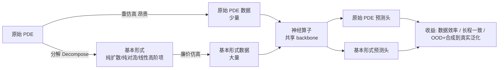

# Learning Data-Efficient and Generalizable Neural Operators via Fundamental Physics Knowledge

**会议**: ICLR 2026  
**OpenReview**: [https://openreview.net/forum?id=mJiPqOzc3O](https://openreview.net/forum?id=mJiPqOzc3O)  
**代码**: [https://sites.google.com/view/sciml-fundemental-pde](https://sites.google.com/view/sciml-fundemental-pde)  
**领域**: AI for Science / 神经算子 / 偏微分方程求解  
**关键词**: 神经算子, PDE 代理模型, 多物理训练, 数据效率, OOD 泛化, FNO  

## 一句话总结
把复杂 PDE 拆解出"基本形式"（如纯扩散、纯对流项），在训练时让神经算子同时学原始 PDE 和它的廉价基本形式，从而用更少的仿真数据换来更低误差、更稳的长程外推和更强的 OOD/仿真到真实泛化。

## 研究背景与动机
**领域现状**：神经算子（Neural Operators, NO）如 FNO 已成为求解偏微分方程（PDE）的快速代理模型，近年还出现了在多个 PDE 上联合预训练的 SciML 基础模型（MPP、DPOT 等）。它们直接从目标 PDE 的仿真数据学习时空演化。

**现有痛点**：相比传统数值求解器内在地满足守恒、对称等物理定律、能在不同参数/边界/几何下稳定泛化，数据驱动模型对训练分布高度敏感，存在三大问题——① **数据需求高**：缺物理先验，要靠大规模多样数据堆精度；② **物理不一致**：缺归纳偏置，长程 rollout 容易违反守恒律、产出非物理结果；③ **泛化差**：遇到没见过的仿真设置常需重训。

**核心矛盾**：现有"多物理预训练"只是把一堆甚至弱相关的 PDE 系统聚在一起，却**从未显式验证模型是否真正掌握了构成复杂方程的基本物理项**。作者在 2D Navier-Stokes 上做了一个关键观察（Figure 2）：把 NS 分解出的对流项（convection term）单独拿来评测，主流神经算子在基本项上的误差（0.133–0.308）远高于原始 PDE（0.008–0.056），但两者皮尔逊相关高达 **0.9625**。这说明强模型隐式地学到了基本项，但因为基本项从未进入训练数据，掌握得并不可靠。

**本文目标**：回答两个科学问题——神经算子能否同时理解原始 PDE 与基本物理知识？显式学习基本物理知识能否带来收益？

**核心 idea**：**把原始 PDE 系统地分解出"基本形式"（basic form），作为一个廉价、物理上合理的辅助任务，与原始 PDE 联合训练**。基本形式仿真成本远低于原始 PDE，可以"以一换多"——在同等仿真预算下换取更多基本形式样本，从而既省数据又增强泛化。方法**架构无关**（architecture-agnostic）。

## 方法详解

### 整体框架
方法分两步：先**定义并分解**出 PDE 的基本形式（保留主导动力学项、去掉引入刚性/高成本/对目标模式贡献小的项），再让神经算子**联合训练**原始 PDE 与基本形式两个任务——共享 backbone、用两个独立的预测头分别输出。基本形式仿真便宜，于是把基线一半的仿真预算"挪去"生成大量基本形式样本，在相当或更低的总成本下获得数据效率、长程一致性与 OOD 泛化三重收益。

### 关键设计

**1. 基本形式的系统化分解准则：保主导、弃刚性**。作者把"什么是基本物理知识"形式化为一套分解流程——保留支配本质和主导动力学的项，移除会引入求解器刚性（stiffness）、增加计算成本、对目标模式形成贡献小的项。以二阶 PDE 一般形式 $\sum_{i,j} a_{ij}\partial^2_{x_ix_j}u + \sum_i b_i\partial_{x_i}u + c = f$ 为模板，对每类 PDE 给出具体分解：Diffusion-Reaction 丢掉非线性反应项 $R_u,R_v$ 只留纯扩散 $\partial_t u = D_u\partial_{xx}u + D_u\partial_{yy}u$（反应项变化快带来刚性、扩散项才是图样形成的空间耦合主因）；Navier-Stokes 丢掉压力项 $\frac{1}{\rho}\nabla p$ 和粘性扩散项 $\nu\nabla^2 u$，只留惯性对流 $\frac{\partial u}{\partial t} = -(u\cdot\nabla)u + f$（压力项要解大型线性系统极贵，对流项是流体运动的主驱动）；Kuramoto-Sivashinsky 丢掉非线性对流 $-u\partial_x u$，只留线性的"反扩散+扩散"竞争 $\partial_t u = -\partial_{xx}u - \partial_{xxxx}u$。从机器学习视角看，这种分解本质是一种**物理驱动的数据增强**，大幅降低数据采集成本。

**2. 以仿真成本为汇率的"样本混合比"**。因为基本形式仿真比原始 PDE 便宜得多（如 2D NS 原始仿真 2.775 秒/步 vs 基本形式 0.113 秒/步），作者定义 **Sample Mixture Ratio**（原始 PDE : 基本形式），按两者仿真成本之比来确定"用一份原始数据换多少份基本形式数据"，确保替换后总仿真预算相当或更低。实测比例为 Diffusion-Reaction 1:3、2D NS 1:24、3D NS 1:3、KS 1:12。这把"省下来的算力"直接兑换成更多廉价但富含物理知识的训练样本。

**3. 多任务联合训练：基本形式作辅助任务**。借鉴课程学习（curriculum learning）和辅助任务学习（auxiliary task learning）的思想，把基本形式当作一个更简单、物理上有动机的辅助任务，与原始 PDE 主任务一起优化——基本形式帮助模型更高效地学习表示、加速主任务收敛。注意：基本形式数据**只在训练时使用**，所有测试都只在原始 PDE 上进行，目标始终是评估原始 PDE 的预测性能。

**4. 架构无关的双头共享设计**。方法不绑定具体网络：主体以 Fourier Neural Operator（FNO）为例，但**共享神经算子 backbone** 同时学主 PDE 与基本项，仅用**两个独立的最终预测层**区分两个任务。这一设计让方法可平滑迁移到 Transformer 类算子（附录给出更多结果），保证 architecture-agnostic 的通用性。

## 实验关键数据

### 主实验（OOD 泛化，nRMSE，越低越好）
在四类 PDE 上比较"只学原始 PDE 的 Baseline"与"联合学基本形式的 Ours"，源分布与两个目标 OOD 分布均评测：

| PDE | 方法 | Source | Target 1 | Target 2 |
|---|---|---|---|---|
| Diffusion-Reaction (2D) | Baseline | 0.0289 | 0.0413 | 0.0770 |
| | **Ours** | **0.0231** | **0.0331** | **0.0538** |
| Navier-Stokes (2D) | Baseline | 0.0487 | 0.0825 | 0.0369 |
| | **Ours** | **0.0175** | **0.0222** | **0.0125** |
| Navier-Stokes (3D) | Baseline | 0.0675 | 0.0393 | 0.0836 |
| | **Ours** | **0.0481** | **0.0329** | **0.0602** |
| Kuramoto-Sivashinsky (1D) | Baseline | 0.0037 | 0.0021 | 0.0200 |
| | **Ours** | **0.0034** | **0.0018** | **0.0197** |

2D NS 上提升最显著（Source 误差从 0.0487 降到 0.0175，约降 64%），且 OOD（粘性 $\nu$ 偏移）一致变好。

### 合成到真实泛化（ScalarFlow 真实烟羽数据集）
在 3D Navier-Stokes 仿真上训练、迁移到真实烟羽观测：

| 方法 | nRMSE |
|---|---|
| Baseline | 0.250 |
| **Ours** | **0.213** |

### 关键发现
- **数据效率（Figure 5）**：在所有 PDE 和架构上，Ours 的点都落在 Baseline 左下方——更低误差 + 更少仿真成本。
- **长程一致性（Figure 6）**：自回归 5 步 rollout 中，Ours 的优势持续保持，累积误差更小，物理一致性更好。
- **动机观察**：原始 PDE 误差与基本项误差皮尔逊相关 0.9625，但基本项绝对误差远大，证明现有模型"隐式会、显式不可靠"，正是显式学习的切入点。

## 亮点与洞察
- **重新定义"多物理"**：现有 SciML 基础模型的"多物理"是把不同 PDE 简单聚合，本文主张**复杂 PDE 必须以其基本项为基础**，提供了一个可验证、可分解的物理一致性视角（用分解后的 PDE 组件去 audit 模型）。
- **"算力换数据"的免费午餐**：分解出的基本形式仿真极廉价，几乎不增加计算成本就能带来多方面收益，本质是把昂贵的高保真仿真预算重新分配给富含物理知识的廉价样本。
- **简单且通用**：方法无需修改损失函数或网络主体（区别于 PINN 把 PDE 塞进 loss），只改数据组成 + 加一个预测头，架构无关，易落地。

## 局限与展望
- **基本形式靠人工分解**：每类 PDE 的"保留哪些项、丢弃哪些项"目前依赖物理先验和人工设计，缺乏自动发现基本形式的机制，迁移到新 PDE 需要专家介入。
- **样本混合比需调**：以仿真成本之比定混合比是启发式的，不同 PDE 的最优比例差异很大（1:3 到 1:24），缺少理论指导。
- **测试仍限于原始 PDE 族内**：OOD 主要是物理参数偏移与合成到真实，未涉及跨方程族（如训 NS 测 KS）的更激进泛化。
- **展望**：自动化基本项发现（如可微分/可学习的 PDE 分解）、把该思想注入大规模 SciML 基础模型预训练、在更多 3D 真实物理场景验证。

## 相关工作与启发
- **物理信息神经网络（PINN）**：通过把 PDE 残差放进损失强约束物理，但泛化与优化困难；本文走的是"数据侧增强"而非"损失侧约束"的互补路线。
- **神经算子（FNO/DeepONet/CNO/LNO/KNO）**：学函数空间映射、灵活但吃数据。本文不是简单换便宜仿真，而是强调显式学习基本物理知识的多重收益。
- **SciML 基础模型（MPP/DPOT/Hyena）**：多 PDE 联合预训练追求泛化但忽视数据效率与基本项一致性，本文恰好补上这一缺口。
- **启发**：课程学习/辅助任务学习的思想可迁移到任何"复杂目标可被分解出更简单子结构"的科学建模任务；"用可分解的物理子组件去验证黑盒模型"也为 SciML 的可信评测提供了新范式。

## 评分
- **新颖性**: ⭐⭐⭐⭐ — "分解基本形式 + 联合训练"的视角清新且与现有多物理预训练有本质区别，Figure 2 的相关性观察很有说服力；但每个组成部分（多任务、数据增强、辅助任务）单看都不算全新。
- **实验充分度**: ⭐⭐⭐⭐ — 覆盖 1D/2D/3D 四类 PDE、数据效率/长程/OOD/合成到真实四类收益、含 ScalarFlow 真实数据，较完整；跨方程族泛化和更多架构的主文验证略少。
- **写作质量**: ⭐⭐⭐⭐ — 动机—方法—收益的逻辑链清晰，每个分解都给出"为何丢/为何留"的物理解释，图表丰富易懂。
- **价值**: ⭐⭐⭐⭐ — 几乎零额外成本就能提升数据效率与泛化，方法简单可复现、架构无关，对 SciML 代理模型的实用价值高。

<!-- RELATED:START -->

## 相关论文

- [\[ICLR 2026\] From Cheap Geometry to Expensive Physics: A Physics-agnostic Pretraining Framework for Neural Operators](from_cheap_geometry_to_expensive_physics_a_physics-agnostic_pretraining_framewor.md)
- [\[ICLR 2026\] DGNet: Discrete Green Networks for Data-Efficient Learning of Spatiotemporal PDEs](dgnet_discrete_green_networks_for_data-efficient_learning_of_spatiotemporal_pdes.md)
- [\[ICLR 2026\] Locally Subspace-Informed Neural Operators for Efficient Multiscale PDE Solving](locally_subspace-informed_neural_operators_for_efficient_multiscale_pde_solving.md)
- [\[ICLR 2026\] Overtone: Cyclic Patch Modulation for Clean, Efficient, and Flexible Physics Emulators](overtone_cyclic_patch_modulation_for_clean_efficient_and_flexible_physics_emulat.md)
- [\[ICLR 2026\] Adaptive Mamba Neural Operators](adaptive_mamba_neural_operators.md)

<!-- RELATED:END -->
