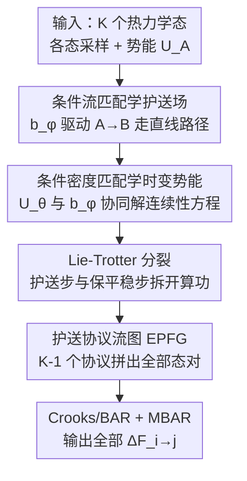

# Learning Escorted Protocols For Multistate Free-Energy Estimation

**会议**: ICLR 2026  
**OpenReview**: [https://openreview.net/forum?id=Da8PJXp0js](https://openreview.net/forum?id=Da8PJXp0js)  
**代码**: 待确认  
**领域**: 物理科学应用 / 分子模拟 / 流匹配  
**关键词**: 自由能估计, 护送协议, 条件流匹配, Jarzynski 等式, 多态 MBAR

## 一句话总结
本文用条件流匹配（CFM）联合提出的条件密度匹配（CDM）来**学习**护送式非平衡（E-NEQ）自由能估计中的护送向量场 $b$ 与时变势能 $U$，再用 Lie-Trotter 分裂降低做功计算成本、用护送协议流图（EPFG）把多态估计的协议数从 $O(K^2)$ 压到 $K-1$，在丙氨酸二肽（ADP）六态体系上比 TFEP 更准。

## 研究背景与动机

**领域现状**：在计算生物化学里，估计两个热力学态 $A,B$ 之间的相对自由能差 $\Delta F_{A\to B}$ 是结合亲和力预测、先导化合物优化等任务的核心。主流的非平衡（NEQ）做法基于 Jarzynski 等式（JE）：定义一个把 $A$ 慢慢"切换"成 $B$ 的开关协议 $U_{A\to B}(x,t)$，让样本沿这条路径演化并累积做功 $W$，再由 $\langle e^{-\beta W}\rangle = e^{-\beta\Delta F}$ 反解出自由能差。

**现有痛点**：JE 估计量的方差和偏差都随"超额做功" $W^{ex}=\langle W\rangle-\Delta F$ 增长，而每个时刻 $W^{ex}_t \ge \beta^{-1}D_{KL}(\rho(x,t)\,\|\,p(x,t))$——也就是说，**瞬时分布 $\rho$ 落后于该时刻平稳分布 $p$ 越多，估计越差**。为压低这个滞后，Vaikuntanathan & Jarzynski 提出"护送协议"：在保持平稳分布的随机动力学之外，额外加一个确定性护送向量场 $b(x,t)$ 来主动把样本推向目标分布。理论上若 $(b,p)$ 共同满足连续性方程 $\partial_t p + \nabla\cdot(pb)=0$，单条轨迹即可零方差地给出 $\Delta F$。

**核心矛盾**：问题在于**这样一对 $(b, U)$ 极难手工构造**。已有神经方法（TFEP 系列）大多只学确定性映射 $b$、丢掉了保平稳的随机动力学，相当于护送协议的一个特例；而真正同时学好 $b$ 和 $U$ 让二者协同满足连续性方程，此前没有统一框架。

**本文目标**：(1) 提出一个**统一可学**的框架，联合学出护送向量场 $b_\phi$ 和时变势能 $U_\theta$，让它们共同近似满足连续性方程；(2) 解决两个落地障碍——做功计算太贵、以及多态场景下协议数随态数指数增长。

**切入角度**：作者观察到护送协议要找的 $(b,p)$ 同时求解连续性方程，这与条件流匹配（CFM）"边际向量场+边际分布共解连续性方程"的结论结构完全一致。于是把学 $b$ 直接交给 CFM，再"照葫芦画瓢"给学 $U$ 设计一个对偶的密度匹配目标。

**核心 idea**：用 **CFM 学护送场 $b_\phi$ + 新提出的 CDM 学时变势能 $U_\theta$**，二者协同补偿彼此的小误差，得到比"只学向量场"更准的低方差 E-NEQ 估计量。

## 方法详解

### 整体框架

方法要解决的是"如何学一对护送协议 $(U_\theta, b_\phi)$ 并高效地用它做多态自由能估计"。整体分三步走：先用**条件流匹配**回归出护送向量场 $b_\phi$；再用对偶的**条件密度匹配**学出与之配套的时变势能 $U_\theta$，两者一起近似求解连续性方程；最后在做估计时，用 **Lie-Trotter 分裂**把昂贵的做功计算拆开降本，并用**护送协议流图（EPFG）**把多个态之间的协议拼接复用、配合 MBAR 给出全部态对的自由能差。最终用双向的 Crooks 涨落定理 + BAR/MBAR 把做功样本转成自由能差。

### 关键设计

**1. 条件流匹配 + 条件密度匹配：联合学护送向量场与时变势能**

护送协议的难点是要找一对 $(b, U)$ 共同满足连续性方程，传统上无解析解。作者把它拆成两个互相对偶的回归问题。对**护送向量场** $b_\phi$，直接套用 CFM：通过耦合分布 $q(z)$ 和条件向量场 $v_t(x_t\mid z)$，最小化 $L_{CFM}=\mathbb{E}\big[\|v_\phi(x_t,t)-v_t(x_t\mid z)\|^2\big]$，并取最优传输（OT）耦合让路径尽量走直线；CFM 的理论保证边际向量场 $v_t$ 与边际分布 $p_t$ 自动共解连续性方程，再经 $t=st_f$、$t_f^{-1}v_\phi(x,s)=b_\phi(x,t)$ 的重标定，$b_\phi$ 就是要找的护送场。

但这只解决了 $b$，**时变势能** $U_\theta(x,t)$（也即 $p_\theta(x,t)\propto e^{-\beta U_\theta(x,t)}$）还没着落。作者提出对偶的密度匹配目标：理想的最大似然目标 $L_{DM}=\mathbb{E}_{x_t\sim p_t}[-\log p_\theta(x_t,t)]$ 因 $p_t$ 未知不可直接优化，于是仿照 CFM 改用**条件分布** $p_t(x_t\mid z)$：

$$L_{CDM}=\mathbb{E}_{t,\,z\sim q(z),\,x_t\sim p_t(x_t\mid z)}\big[-\log p_\theta(x_t,t)\big].$$

关键性质是 $\nabla_\theta L_{DM}=\nabla_\theta L_{CDM}$——用条件分布做 MLE 与用未知边际分布做 MLE 得到**同一个**学到的边际密度 $p_\theta^t$。这样 CFM 学 $b$、CDM 学 $U$，二者合起来就是一对协同近似满足连续性方程的护送协议；作者的假设是两个分支能相互补偿对方的小误差（随机步纠正确定性步的积分漂移，确定性步补足纯随机步够不到目标态的部分），从而比 TFEP 这类只用向量场的方法更准。

**2. Lie-Trotter 分裂：把昂贵的散度计算从不稳定动力学里解耦出来**

护送动力学 $\widehat{\mathcal{L}}_t=\mathcal{L}_t+\mathcal{E}_t$（$\mathcal{E}_t$ 是护送输运项）在做功公式里需要反复评估护送场的散度 $\nabla\cdot b(x,t)$。而分子动力学因为势能含 Lennard-Jones 这类尖峰项，必须用极小的全局步长 $dt$ 才数值稳定（实验里过阻尼 Langevin 甚至要 $dt=10^{-8}$），导致散度评估次数爆炸式增长、算不动。

作者用 Lie-Trotter 分裂把组合动力学拆成两个独立子步：先走护送步 $x_k'=x_k+b(x_k,t_k)h$，再走保平稳的转移核 $x_{k+1}\sim K_{t_k}(x_k',\cdot)$，即 $e^{h\widehat{\mathcal{L}}_t}\approx e^{h\mathcal{L}_t}e^{h\mathcal{E}_t}$。在此分裂下成立"分裂版护送 Jarzynski 等式"，做功简化为

$$\widehat{W}_{A\to B}(x,h)=\sum_{k=0}^{N-1}\Big(\tfrac{\partial U_{A\to B}(x_k',t_k)}{\partial t}-\beta^{-1}\nabla\cdot b(x_k,t_k)\Big)h,$$

在 $h\to 0$ 时精确还原 E-JE。这样做功计算只需按全局步长 $h$ 评估散度，而**保平稳核内部可以用更小的步长独立细分**，把散度评估次数和不稳定动力学解耦，使整套估计在可接受算力内可行。

**3. 护送协议流图（EPFG）：把多态协议数从 $O(K^2)$ 压到 $K-1$**

要估 $K$ 个态两两之间的自由能差 $\{\Delta F_{i\to j}\}$，最准的做法是拿到所有态对的做功 $\{W_{i\to j}\}$ 喂给自洽的多态 BAR（MBAR）；但逐对训练需要 $K(K-1)/2$ 个模型，态一多就不可行。简单地只训一个中心态 $k$ 出发的 $K-1$ 个协议、再用自由能是态函数的性质 $\Delta F_{i\to j}=-\Delta F_{k\to i}+\Delta F_{k\to j}$ 去推非直连对，虽省模型但精度不如 MBAR。

作者折中提出护送协议流图：把 $K$ 个态当节点、护送协议当边，只训练中心节点 $k$ 出发的 $K-1$ 条边，**非直连的边 $(i\to j)$ 通过把两条已训练协议时间反转再拼接得到**：前半段走 $k\to i$ 的反向、后半段走 $k\to j$ 的正向，

$$(U_{i\to j},b_{i\to j})=\begin{cases}(U^{\theta_i}_{k\to i}(x,t_f-2t),\,-2b^{\phi_i}_{k\to i}(x,t_f-2t)) & 0\le t<\tfrac{t_f}{2}\\[2pt](U^{\theta_j}_{k\to j}(x,2t-t_f),\,2b^{\phi_j}_{k\to j}(x,2t-t_f)) & \tfrac{t_f}{2}\le t\le t_f.\end{cases}$$

这样只需训练 $K-1$ 个协议，却能为**所有**态对（含拼接出来的）拿到独立的做功样本喂给 MBAR，既保住 MBAR 的精度又把训练成本压到最低。实验证实拼接协议（EPFG=Y）在几乎所有情形下都比纯逐对求和（EPFG=N）更准，且连直连态对的估计也跟着变好。

### 损失函数 / 训练策略

护送向量场 $b_\phi$ 用 SE(3)-等变图神经网络 + 可学时间嵌入实现，配 OT 耦合让路径接近动力学最优传输；时变势能 $U_\theta$ 用带条件仿射耦合层的离散归一化流参数化（取负对数概率为势能，选离散流而非更一般的能量模型是为简化 MLE 训练）。两个分支分别用 $L_{CFM}$ 和 $L_{CDM}$ 训练。估计阶段护送场用 Runge-Kutta 积分，保平稳分支可选过阻尼/欠阻尼 Langevin 或 HMC，均带 Metropolis-Hastings 校正，分裂算子迭代 100 步累积做功；最终用双向 Crooks 定理经 BAR/MBAR 反解自由能差。

## 实验关键数据

实验在丙氨酸二肽（ADP）溶剂体系上做，它有 $\alpha_R,\alpha_L,\alpha_D,\beta,C5,\alpha'$ 六个亚稳态，是多态自由能的经典 benchmark。每个态用谐振平底约束采 10,000 个样本；基线为大量窗口的伞形采样（US，作为"真值"）和共享同一 $b_\phi$ 的神经 TFEP——TFEP 与 E-NEQ 的唯一区别就在于是否引入保平稳的随机动力学。

### 主实验

以中心态 $\alpha_R$ 为参考，报告各直连态的 $\Delta F$（kJ/mol）及全部态对的 MAE：

| 方法 | 积分器 | EPFG | $\alpha_L$ | $\beta$ | $C5$ | MAE |
|------|--------|------|-----------|---------|------|-----|
| US（真值） | - | - | 7.42 | -1.11 | 1.37 | - |
| TFEP | - | N | 8.60 | 0.77 | 2.39 | 1.17 |
| E-NEQ（本文） | UL | N | 7.93 | 0.54 | 1.47 | 0.93 |
| E-NEQ（本文） | UL | Y | 7.35 | 0.78 | 1.31 | **0.88** |
| E-NEQ（本文） | OL | Y | 8.06 | 0.24 | 1.69 | **0.59** |
| E-NEQ（本文） | HMC | Y | 7.33 | 0.50 | 1.83 | 0.95 |

三种积分器下 E-NEQ 的 MAE 都低于 TFEP 的 1.17，最好（OL+EPFG）做到 0.59。与 US 真值的相关性上，E-NEQ 取得 $R^2=0.91$、Pearson $r=0.96$，略优于 TFEP（0.90 / 0.95），两者都稳在 1 kcal/mol 容差内、多数情形甚至在 1 kJ/mol 内。$\beta$ 态是显著例外（各方法都偏离 US）。

### 消融实验

| 配置 | 关键指标 | 说明 |
|------|---------|------|
| TFEP（无保平稳动力学） | MAE 1.17 | 只用确定性向量场 |
| E-NEQ（UL，逐对 N） | MAE 0.93 | 加入保平稳随机步即降 |
| E-NEQ（UL，EPFG Y） | MAE 0.88 | 拼接协议进一步降 |
| E-NEQ（OL，EPFG Y） | MAE 0.59 | 过阻尼 Langevin 最佳 |

另外比较三种积分器的成功轨迹数（最大 50,000）：欠阻尼/过阻尼 Langevin 在各态都能保持 48k+ 成功率，而 HMC 在 $C5$ 等态掉到 32,477，长程拼接时更易发散。

### 关键发现
- **保平稳随机动力学是 E-NEQ 胜过 TFEP 的关键**：两者共享同一护送场，唯一差别就是 E-NEQ 多了保平稳随机步，MAE 从 1.17 直接降到 0.88-0.93，印证"随机步与确定性步相互补偿"的假设。
- **EPFG 拼接协议几乎全面提升精度**：不仅非直连态对的 MAE 变好，连直连态对的估计也因 MBAR 自洽而改善——用同样的轨迹拿到更准的结果。
- **HMC 在长程更不稳**：拼接长协议时 HMC 易把样本推进学到势能的高能区导致发散，MH 校正也救不回来（不稳定根源在确定性向量场而非随机步）；Langevin 类更稳。
- **Lie-Trotter 分裂是可行性前提**：过阻尼 Langevin 需要 $dt=10^{-8}$ 的极小步长，不做分裂解耦散度计算根本算不动。

## 亮点与洞察
- **把"找护送协议"翻译成两个对偶的流匹配回归**：CFM 学 $b$ 已知，新提的 CDM 用同样的"条件分布替代未知边际"技巧学 $U$，且证明二者梯度相等——这种把一个难解的约束（连续性方程）拆成两个可回归目标的思路很优雅，可迁移到其他需要联合学"场+密度"的采样问题。
- **EPFG 的时间反转+拼接构造**：用"自由能是态函数"这一物理事实，把组合复杂度从 $O(K^2)$ 个模型降到 $K-1$，同时不牺牲 MBAR 的精度，是工程与物理的漂亮结合。
- **同一护送场做受控对照**：让 TFEP 复用 E-NEQ 学到的 $b_\phi$，干净地隔离出"保平稳随机动力学"单一变量的贡献，实验设计严谨。

## 局限与展望
- **只在 ADP 玩具体系验证**：作者承认 ADP 虽有多亚稳态、challenge 与大体系相似，但相对真实药物发现仍是 toy problem，亟需向更大体系扩展，重点在于更准地学时变势能 $U_\theta$（建议借力可扩展离散归一化流）。
- **$\beta$ 态系统性偏离**：各方法对 $\beta$ 态的估计都明显偏离 US 真值，文中未深入解释根因。
- **多处为贴合理论而做了保守选择**：用 MH 校正保平稳、用固定 Runge-Kutta 而非自适应 ODE 解算、把连续性方程当软约束编码进损失而非硬约束、EPFG 仅在估计时拼接而非训练时融入——作者指出放宽这些约束、或换用 Schrödinger Bridge / Flow-Map 等更强生成框架都可能进一步提升。

## 相关工作与启发
- **vs TFEP（Targeted Free-Energy Perturbation）**: TFEP 是护送协议只用确定性可逆映射 $b$ 的特例，丢掉了保平稳随机动力学；本文同时学 $b$ 和 $U$ 并保留随机步，靠两者互补把 MAE 从 1.17 降到 0.59，区别就在"是否让确定性与随机步协同"。
- **vs FEAT（He et al., 2025）**: FEAT 同样参数化护送协议，但前向/后向用两套不同协议且不考虑多态场景；本文用统一协议 + EPFG 把多态估计的训练成本压到 $K-1$ 个模型。
- **vs 传统 FEP / 热力学积分（TI）**: 传统平衡法依赖 Zwanzig 方程或沿耦合参数积分；本文走非平衡护送路线，用神经网络学开关协议，天然契合机器学习框架且单轨迹理论上即可估计。

## 评分
- 新颖性: ⭐⭐⭐⭐⭐ 首次用 CFM+新提 CDM 联合学护送协议的 $(b,U)$，并配 EPFG 解决多态组合爆炸，框架新颖且理论扎实。
- 实验充分度: ⭐⭐⭐ 体系完整覆盖六态、三积分器、与 US/TFEP 对照清晰，但只在 ADP 单一玩具体系验证，缺大体系/真实配体证据。
- 写作质量: ⭐⭐⭐⭐ 理论铺陈（JE→E-JE→Crooks）层层递进，方法与背景衔接自然，公式规范。
- 价值: ⭐⭐⭐⭐ 为神经非平衡自由能估计提供了统一可学框架与降本工具，对药物发现的结合亲和力预测有潜在价值，待扩展性验证。

<!-- RELATED:START -->

## 相关论文

- [\[NeurIPS 2025\] FEAT: Free Energy Estimators with Adaptive Transport](../../NeurIPS2025/physics/feat_free_energy_estimators_with_adaptive_transport.md)
- [\[ICLR 2026\] PINFDiT: Energy-Based Physics-Informed Diffusion Transformers for General-purpose Time Series Tasks](pinfdit_energy-based_physics-informed_diffusion_transformers_for_general-purpose.md)
- [\[ICLR 2026\] HSG-12M: A Large-Scale Benchmark of Spatial Multigraphs from the Energy Spectra of Non-Hermitian Crystals](hsg-12m_a_large-scale_benchmark_of_spatial_multigraphs_from_the_energy_spectra_o.md)
- [\[ICLR 2026\] Stretching Beyond the Obvious: A Gradient-Free Framework to Unveil the Hidden Landscape of Visual Invariance](stretching_beyond_the_obvious_a_gradient-free_framework_to_unveil_the_hidden_lan.md)
- [\[AAAI 2026\] Adaptive Fidelity Estimation for Quantum Programs with Graph-Guided Noise Awareness](../../AAAI2026/physics/adaptive_fidelity_estimation_for_quantum_programs_with_graph.md)

<!-- RELATED:END -->
