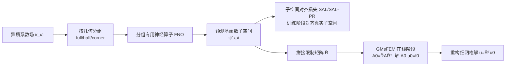

# Locally Subspace-Informed Neural Operators for Efficient Multiscale PDE Solving

**会议**: ICLR 2026  
**OpenReview**: [https://openreview.net/forum?id=RqXxkiCYip](https://openreview.net/forum?id=RqXxkiCYip)  
**代码**: 待确认  
**领域**: AI for Science / 多尺度 PDE 求解  
**关键词**: 神经算子, GMsFEM, 多尺度有限元, 子空间对齐损失, 高对比度异质介质, 算子学习  

## 一句话总结
用神经算子（FNO）直接预测 GMsFEM 的多尺度谱基函数所张成的**子空间**，并配上一个对齐子空间而非单个基函数的 subspace-informed 损失，把 GMsFEM 最贵的离线基函数构造阶段加速 60 倍以上，同时保留传统数值方法的精度与可靠性。

## 研究背景与动机

**领域现状**：高对比度、强异质性的多尺度 PDE（如地下渗流、复合材料中的扩散）在工程中极常见，但直接在细网格上求解代价高昂。广义多尺度有限元法（GMsFEM）是处理这类问题的成熟手段——它在粗网格的每个局部子域上求解局部谱特征问题，构造出能捕捉细尺度信息的多尺度基函数，再把细网格系统投影到低维粗空间求解，从而在保证精度的前提下大幅降低在线求解成本。

**现有痛点**：GMsFEM 的精度依赖离线阶段构造的谱基函数，而求解大量局部特征值问题极其昂贵——在 100×100×100 的 3D 网格上构造基函数要花上万秒，离线成本成为整个流程的瓶颈。另一方面，数据驱动的神经算子（FNO、DeepONet 等）虽然推理快，但在高对比度异质系数上往往难以捕捉局部精细特征，需要大量数据和庞大网络，且鲁棒性差——一旦测试时外力项（右端项）分布漂移就会灾难性失效。

**核心矛盾**：GMsFEM 慢但可靠（有严格数值分析支撑），纯神经算子快但不可靠。两者各执一端，已有的混合方法大多假设宏观方程形式已知、只学有效系数，这在无尺度分离、高对比度的场景下不成立。

**本文目标**：构造一个既快又准的求解器，用神经算子加速 GMsFEM 的离线阶段，同时保留其数值分析根基。

**核心 idea**：**不学完整 PDE 解，也不逐个学基函数，而是让神经算子直接把异质系数场映射到 GMsFEM 基函数张成的低维子空间。** 因为基函数本身比单个特征向量更光滑、维度更低，学起来更省数据；又因为最终解仍由 GMsFEM 在线阶段求出，即便子空间预测有瑕疵也能保证合法性，从而比纯神经算子更鲁棒。

## 方法详解

### 整体框架
GMsFEM-NO 把 GMsFEM 的离线"解局部特征问题→得基函数"替换为"神经算子一次前向→得基函数子空间"，在线阶段完全沿用 GMsFEM。训练时，针对每个局部子域 $\omega_i$ 上的异质系数场 $\kappa^{\omega_i}$，神经算子预测 $N_{bf}$ 个基函数 $\{\tilde\psi^{\omega_i}_j\}$，用子空间对齐损失把预测子空间对齐到真实基函数子空间；推理时，把预测基函数补零延拓到全域、向量化拼成限制矩阵 $\tilde R$，将细网格矩阵 $A$ 与右端项投影到粗空间 $A_0=\tilde R A\tilde R^\top$、$f_0=\tilde R b$，解粗系统 $A_0 u_0 = f_0$ 后再用 $\tilde R^\top$ 重构细网格解。

### 关键设计

**1. 子空间预测而非基函数预测：抓住"学什么"这个关键选择。** GMsFEM 的解只取决于基函数所张成的子空间，而非基函数的具体表示——同一子空间可以有无数组基。逐个学单个基函数会让网络去拟合那些对小扰动敏感、且本质上由旋转/符号自由度决定的冗余信息。本文转而让神经算子学习"映射系数场到子空间"这件事，目标更光滑、维度更低（每子域只取最小 $N_{bf}=8$ 个特征值对应的基），因此比学完整 PDE 解或学单个基函数都更省数据、更稳定。

**2. 子空间对齐损失 SAL：用子空间几何度量而非逐点误差。** 核心是衡量预测子空间与真实子空间的"重叠度"。设真实子空间的正交化基为 $Q_{R_i}$、预测的为 $Q_{\tilde R_i}$，损失定义为 $L_{\text{SAL}}=\mathbb{E}_i\big[N_{bf}-\|Q_{R_i}^\top Q_{\tilde R_i}\|_F^2\big]$，其中 Frobenius 范数项度量两子空间的重叠，当两者完全对齐时取得最大值 $N_{bf}$。这个损失天然对基函数的旋转与符号自由度不变——它只关心子空间本身是否对齐，不在意网络用哪组基去表示，从而避免了网络被无意义的表示自由度误导。附录还给出了把子空间对齐误差连接到解精度的理论误差界。

**3. 投影正则项 SAL-PR：约束投影行为的细粒度一致性。** SAL 保证了子空间整体重合，但可能忽略"向量投影到子空间后"的细微差异。本文加入投影正则项 $L_{\text{SAL-PR}}=L_{\text{SAL}}+\lambda\cdot\mathbb{E}_{i,c}\|(P_{R_i}-P_{\tilde R_i})v_i\|^2_2$，其中 $P_{R_i}=Q_{R_i}Q_{R_i}^\top$ 是投影矩阵，$v_i=\sum_k c_k\psi^i_k$ 是随机测试向量（$c\sim\mathcal N(0,I)$），衡量同一随机向量投影到真实与预测子空间后的差异。该项在小网格上几乎无影响（SAL 已足够），但在大问题上效果显著——250² Richards 方程的 L2 误差从 1.82% 进一步降到 1.72%；不过其计算代价在 100³ 这种超大规模下变得过高，因此大问题实际用纯 SAL。

**4. 局部子域按几何分组 + 旋转归一化：处理子域形状方向多样性。** 局部子域因共享粗节点 $x_i$ 的相对位置不同而呈现不同形状与朝向（2D 分 full/half/corner 三类，3D 分 full/half/quarter/corner 四类）。训练前对每个子域的输入数据与目标基函数做旋转归一化，保证组内粗节点位置一致；再为每一类训练一个专用神经算子。这种分组专门化让每个网络只需应对一种几何变体，显著提升预测精度。骨干网络采用 Factorized FNO（F-FNO），把谱卷积按维度分解、参数量从 $O(LH^2M^D)$ 降到 $O(LH^2MD)$，便于扩展到更深网络与 3D 问题。

## 实验关键数据

### 主实验：GMsFEM-NO vs 原始 GMsFEM（精度几乎无损）

| 网格 (Nv) | 数据集 | GMsFEM L2 | GMsFEM-NO L2 | GMsFEM H1 | GMsFEM-NO H1 |
|---|---|---|---|---|---|
| 100×100 (36) | Diffusion | 1.15% | 1.06% | 11.68% | 11.57% |
| 100×100 (36) | Richards | 2.03% | 1.87% | 11.68% | 11.25% |
| 250×250 (121) | Richards | 1.79% | 1.72%(SAL-PR) | 14.57% | 14.53% |
| 50³ (216) | Diffusion | 3.07% | 3.10% | 20.72% | 20.39% |
| 100³ (729) | Richards | 2.54% | 2.57% | 17.83% | 17.91% |

GMsFEM-NO 在所有数据集和 2D/3D 网格上都达到与 GMsFEM 几乎一致甚至偶尔更优的精度。

### 关键加速：基函数构造时间

| 网格 | Nv | GMsFEM (秒) | GMsFEM-NO (秒) | 加速 |
|---|---|---|---|---|
| 100×100 | 36 | 16.87 | 0.28 | ~60× |
| 250×250 | 121 | 210.5 | 0.31 | ~680× |
| 50³ | 216 | 935.4 | 0.84 | ~1100× |
| 100³ | 729 | 10547.2 | 1.33 | ~7900× |

加速比随网格规模与维度增长而急剧放大。

### 消融与对比实验

| 对比维度 | 结果 |
|---|---|
| 损失函数 (100², Nbf=8, Richards) | RBFL2 L2=3.46% → SAL 1.88%（1.8× 提升），SAL-PR 1.87% |
| vs 纯神经算子 (250², Richards-9) | F-FNO 4.45% / GNOT 14.69% / Transolver++ 8.82% → GMsFEM-NO **1.60%**（比最优 NO 降 2.8×） |
| 数据效率 (250², Richards-8) | F-FNO 从 800→200 样本误差 2.44%→6.52%；GMsFEM-NO 仅 1.82%→2.07% |
| OOD 外力项 | 纯 NO 在分布外右端项上灾难性失效；GMsFEM-NO 因独立于右端项而保持稳定 |
| 分辨率不变性 | 低分辨率训练、高分辨率推理，精度损失极小 |

### 关键发现
- 子空间对齐损失相比逐基 L2 损失带来一致提升，验证了"学子空间而非学基函数"的设计动机；
- GMsFEM-NO 的解独立于外力项，继承了 GMsFEM 的泛化能力，这是它对纯神经算子最本质的优势；
- 数据效率高：即便只用 200 样本，性能退化也很小。

## 亮点与洞察
- **抓住了问题的不变量**：解只依赖子空间而非具体基，因此对齐子空间、用 Frobenius 重叠度量天然消除旋转/符号自由度，是把数值结构注入学习目标的优雅做法。
- **混合而非替代**：神经算子只接管最贵的离线基函数构造，在线求解仍走 GMsFEM，从而"快"来自学习、"准与可靠"来自数值分析，两全其美。
- **加速比随规模放大**：从 60× 到近 8000×，越大越难的 3D 问题收益越高，正好命中传统方法最痛的地方。
- **可靠性即合法性**：即使子空间预测不完美，最终解仍是合法的 GMsFEM 解，避免了纯 NO 的"黑箱失控"。

## 局限与展望
- **未消除训练与造数据成本**：方法只是摊薄了重复仿真下的离线成本，存在一个"盈亏平衡点"（需多少次推理才能抵消初始训练/造数代价），论文在附录中给出推导，但对一次性问题不划算。
- **分组与旋转归一化偏工程化**：按几何类型分别训练多个网络增加了流程复杂度，且依赖人工定义的子域类别划分。
- **SAL-PR 在超大规模下不可用**：投影正则项的计算代价在 100³ 网格上过高，只能退回纯 SAL，说明高阶约束的可扩展性仍待改进。
- **验证范围**：主要在椭圆扩散与稳态 Richards 方程上验证，向时变、多物理场耦合等更复杂 PDE 的推广仍需进一步实验（论文已初步给出时变方程与混合边界的附录结果）。

## 相关工作与启发
- **GMsFEM 谱方法**：Efendiev 等的多尺度有限元方法是本文的数值根基，提供了局部谱基函数构造的理论框架。
- **神经算子**：FNO/F-FNO、DeepONet 提供算子学习骨干；本文用 F-FNO 因其参数高效、易扩展到 3D。
- **与已有混合方法的区别**：多数 ML+数值均化/升尺度方法假设宏观方程已知、只学有效系数，无法处理无尺度分离的高对比度问题；本文直接学习宏观解空间（多尺度基函数）本身。
- **降阶建模**：POD、DeepPOD、PCANet 用神经网络学紧凑解表示，是效率对比的基线。
- **启发**：把"解只依赖某个几何不变量（子空间）"这一结构识别出来并设计成损失，是将传统数值分析与深度学习融合的通用范式——值得迁移到其他有内在不变性的算子学习任务。

## 评分
- 新颖性: ⭐⭐⭐⭐ 子空间预测 + 子空间对齐损失的组合切中"解只依赖子空间"的本质，区别于逐基学习与已有混合方法，思路清晰且有理论支撑。
- 实验充分度: ⭐⭐⭐⭐ 覆盖 2D/3D、线性扩散与非线性 Richards、多种损失/基线/数据量/分辨率/OOD 对比，加速与精度量化充分；时变与多物理场推广略浅。
- 写作质量: ⭐⭐⭐⭐ 动机—矛盾—方法逻辑顺畅，图示与表格清晰，公式与附录理论支撑到位。
- 价值: ⭐⭐⭐⭐ 把 GMsFEM 离线瓶颈加速 60–8000× 且保留可靠性，对地下渗流、复合材料等高对比度多尺度工程问题有直接实用价值。

<!-- RELATED:START -->

## 相关论文

- [\[ICLR 2026\] Learning Data-Efficient and Generalizable Neural Operators via Fundamental Physics Knowledge](learning_data-efficient_and_generalizable_neural_operators_via_fundamental_physi.md)
- [\[ICLR 2026\] Operator Learning with Domain Decomposition for Geometry Generalization in PDE Solving](operator_learning_with_domain_decomposition_for_geometry_generalization_in_pde_s.md)
- [\[ICLR 2026\] CFO: Learning Continuous-Time PDE Dynamics via Flow-Matched Neural Operators](cfo_learning_continuous-time_pde_dynamics_via_flow-matched_neural_operators.md)
- [\[NeurIPS 2025\] DeltaPhi: Physical States Residual Learning for Neural Operators in Data-Limited PDE Solving](../../NeurIPS2025/physics/deltaphi_physical_states_residual_learning_for_neural_operators_in_data-limited_.md)
- [\[ICLR 2026\] (U)NFV: (Un)supervised Neural Finite Volume Methods for Solving Hyperbolic PDEs](unfv_unsupervised_neural_finite_volume_methods_for_solving_hyperbolic_pdes.md)

<!-- RELATED:END -->
