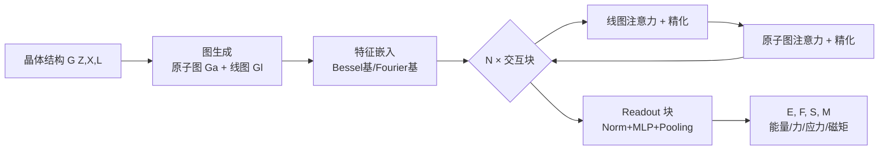

# MatRIS: Toward Reliable and Efficient Pretrained Machine Learning Interatomic Potentials

**会议**: ICLR 2026  
**OpenReview**: [https://openreview.net/forum?id=5xBT5Ziute](https://openreview.net/forum?id=5xBT5Ziute)  
**代码**: 待确认  
**领域**: 机器学习原子间势 / 计算材料科学 / 等变 vs 不变网络  
**关键词**: MLIP, 三体相互作用, 线性复杂度注意力, 不变模型, Matbench-Discovery  

## 一句话总结
MatRIS 用一套 O(N) 复杂度的「可分离注意力」显式建模三体（键角）相互作用，证明精心设计的**不变模型**可以在材料发现等基准上达到甚至超过昂贵的等变模型精度，同时把训练成本压低 6–13 倍。

## 研究背景与动机
**领域现状**：机器学习原子间势（MLIP）已成为替代量子力学（QM）计算的主流工具，能在保持近量化精度的同时把分子动力学模拟加速若干数量级。当前精度榜首（如 Matbench-Discovery 上的 eSEN-30M、eqV2 S DeNS）几乎都是**等变模型**——它们通过张量积（tensor product）和高阶不可约表示（irreps，degree $L$）把旋转等变性硬编码进网络，从而拿到 SOTA。

**现有痛点**：等变性带来的代价极高。论文指出三个成本来源：张量积等等变操作本身昂贵、参数量大、训练周期长（eSEN-30M-MP / eqV2 S DeNS / SevenNet-l3i5 分别要 100 / 150 / 600 epoch）。结果就是 eSEN-30M-MP 和 eqV2 S DeNS 分别消耗了 335 和 228 个 A100 GPU-天才换来 0.831 / 0.815 的 F1。

**核心矛盾**：等变性本质上是一种隐式的数据增强。但随着 QM 参考数据集（OMat、OMol 等）爆炸式增长，AlphaFold 等工作已经表明数据充足时非等变模型也能学到对称性——那么**「在数据持续膨胀的今天，严格等变性还是不可或缺的吗？能不能用更紧凑的架构充分挖掘 QM 数据里的高维原子相互作用？」**

**本文目标**：构建一个既高效（不变模型的计算优势）又有表达力（能捕获三体以上相互作用）的紧凑 MLIP，在主流基准上匹配等变模型。

**核心 idea**：作者观察到（1）元素类型 + 两体相互作用不足以区分不同化学性质的图，必须引入**三体相互作用**；（2）自注意力是提升表达力和可扩展性的有效手段。**于是把这两点合一——用线性复杂度注意力显式建模三体（键角）交互**，这是据作者所知第一个用 O(N) 注意力建模三体相互作用的 MLIP。

## 方法详解

### 整体框架
MatRIS 是一个不变 MLIP，骨架沿用 CHGNet 的「原子图 + 线图」双图结构：原子图 $G^a$ 里节点是原子、边是键（两体）；**线图 $G^l$ 把原子图的边变成节点、把共享原子的两条边连成线图的边——这条边恰好编码了三个原子构成的键角（三体相互作用）**。数据先经特征嵌入，再堆叠 $N$ 个「图注意力 + 精化（refinement）」模块在两张图之间来回传递信息，最后由 readout 块用自动微分导出能量、力、应力、磁矩。

### 关键设计

**1. 线图—原子图交互：用线图把三体相互作用显式化。** 不变模型只用距离这类两体标量会丢失角度信息，而表达力受限。MatRIS 把原子图转成线图——线图的每个节点对应原子图的一条边（键），线图的每条边连接共享同一原子的两条键，因此自然编码了三个原子的键角 $\theta_{ijk}$。模型在线图上更新得到带三体信息的边/角特征，再把这些更新后的边特征**传回原子图**，让原子特征吸收来自线图的高阶信息。这样既保持了不变性（角度在旋转平移下不变），又把三体相互作用塞进了消息传递。

**2. Dim-wise Softmax：让注意力对每个特征维度独立打分。** 现有注意力方法对一个邻居算出一个标量权重 $a_i$，然后用它去加权整个 $D$ 维 value 向量，隐含假设所有特征维度同等重要。MatRIS 认为这限制了模型区分各维度独立贡献的能力，于是改成**沿特征维度独立做 softmax**：给定输入 $x\in\mathbb{R}^{\text{neighbors}\times D}$，

$$\alpha_{id} = \text{Dim-wise Softmax}(x_{id}, N(i)) = \frac{\exp(x_{id})}{\sum_{k\in N(i)}\exp(x_{kd})}$$

得到的权重矩阵 $\alpha\in\mathbb{R}^{\text{neighbors}\times D}$ 在每个维度 $d$ 上都对邻居重新归一化，从而保留维度独立性、更细粒度地刻画局部结构。消融显示换回标准 softmax，能量 MAE 从 28.0 升到 28.4 meV/atom。

**3. 可分离注意力（Separable Attention）：把原子的「源」「靶」双重角色分开。** 现实物理系统里相互作用是有方向的——在极性键、带电环境或缺陷结构中，源原子对靶原子的影响 ≠ 靶对源的影响，但多数方法只做 source→target 单向聚合、默认信息流对称。MatRIS 给每条交互边 $e_{ij}$ 算两套独立权重：

$$t_{ij}=\text{Linear}(e_{ij}),\quad ta_{ij}=\text{Dim-wise Softmax}(t_{ij}, N(i))$$
$$s_{ij}=\text{Linear}(e_{ij}),\quad sa_{ij}=\text{Dim-wise Softmax}(s_{ij}, N(j))$$

其中 target 权重 $ta_{ij}$ 在靶节点邻域 $N(i)$ 上归一化、刻画邻居如何影响中心原子；source 权重 $sa_{ij}$ 在源节点邻域 $N(j)$ 上归一化、刻画中心原子如何影响邻居。最终输出是 $ta_{ij}$、$sa_{ij}$ 与融合特征 $e'_{ij}$（由 $e_{ij},v_i,v_j$ 拼接后经 gMLP 融合）的加权和。两个分支计算流相同、可并行执行，作者还写了优化 kernel 加速。关键的是，这两个机制**复杂度都是 O(N)**（对比全注意力 O(N²)），既扩展又有表达力。消融显示去掉 source 分支（退回单向）MAE 进一步劣化到 29.1。

**4. 可靠的物理量输出与训练增强。** Readout 块对最后一层节点特征做归一化后用 MLP 预测原子能量与磁矩，原子能量求和得总能 $E$；为保证物理可靠性（而非直接回归），力和应力都由能量对坐标/应变求导得到：

$$F_i = -\frac{\partial E}{\partial X_i},\qquad \sigma = \frac{1}{V}\frac{\partial E}{\partial \epsilon}$$

训练侧叠加三个增强：去噪预训练（denoising，缓解过平滑）、磁矩预测（节点级任务，帮助区分不同化学环境、同样缓解过平滑）、图级（graph-level）损失归约（避免力损失被系统大小差异带偏）。三者在消融里把 MAE 从 30.2 逐步压到 27.2 meV/atom。

## 实验关键数据

### 主实验表格（Matbench-Discovery compliant，MPTrj 训练）

| 模型 | 参数量 | F1↑ | Precision↑ | MAE↓ (meV/atom) | RMSD↓ |
|------|--------|-----|-----------|------|-------|
| eqV2 S DeNS | 31.2M | 0.815 | 0.771 | 0.036 | 0.0757 |
| eSEN-30M-MP | 30.1M | 0.831 | 0.804 | 0.033 | 0.0752 |
| MatRIS-S | 4.3M | 0.811 | 0.784 | 0.036 | 0.0766 |
| MatRIS-M | 6.3M | 0.833 | 0.820 | 0.033 | 0.0742 |
| **MatRIS-L** | **10.4M** | **0.847** | **0.829** | **0.031** | **0.0717** |

MatRIS-L 全指标 SOTA（F1 0.847、RMSD 0.0717）；MatRIS-S/M 以远少的参数（4.3M/6.3M vs 30M+）追平 eqV2/eSEN，训练效率分别提升 **13.0×/6.4×**。MatCalc / MDR phonon / 分子零样本（TorsionNet-500、MD22、ANI-1x、AIMD-Chig）等基准上也普遍 SOTA 或近 SOTA——在 TorsionNet-500 能量误差比 SOTA 的 DPA3 降低约 22%–33%。

### 消融实验表格

| 模块组合 | Ef MAE (meV/atom) |
|----------|-------|
| 全部模块 | 28.0 |
| 去 Dim-wise Softmax | 28.4 |
| 再去 Separable Attention（单向） | 29.1 |
| 再去 learnable envelope | 31.3 |

| 训练方法 | Ef MAE (meV/atom) |
|----------|-------|
| 去噪+磁矩+图级损失 | 27.2 |
| 去 denoising | 28.0 |
| 再去磁矩 | 29.7 |
| 全去 | 30.2 |

### 关键发现
- **不变 ≥ 等变（在数据充足时）**：MatRIS-M 仅 6.3M 参数就追平 30M 的等变 eSEN-30M-MP，直接回答了「等变性是否不可或缺」——精心设计的不变模型够用。
- **效率—精度权衡占优**：推理速度快于 eqV2/eSEN（慢于只用 2 层的 MACE-L，因 MatRIS-S/M 用了 4/6 层）；relaxation 吞吐与精度平衡好。
- **跨数据集鲁棒**：从 MPTrj 换到 MatPES/OAM 训练，MatRIS 的「PES 软化」（f/fDFT）现象不显著，说明优势来自架构而非数据。

## 亮点与洞察
- **观点鲜明**：在「等变是 SOTA 共识」的语境下，正面论证「数据膨胀时代不变模型可以匹配等变」，并用 13×/6.4× 的成本对比给出有说服力的证据。
- **三体 + 线性注意力的结合是真创新**：第一个用 O(N) 注意力显式建模三体相互作用，把「线图编码角度」和「注意力提表达力」两条独立思路统一。
- **可分离注意力有物理直觉**：从极性键/缺陷结构的非对称作用出发拆分源/靶角色，不是为了加模块而加模块。
- **物理可靠性**：力/应力都从能量求导而非直接回归，符合保守力场要求。

## 局限与展望
- 推理速度仍慢于浅层 MACE-L（层数更多），在极致速度场景未必最优。
- 「不变模型够用」的结论建立在 MPTrj/OAM 这类大规模数据集上，小数据/特殊体系下等变归纳偏置可能仍有价值，文中未充分探讨边界。
- Dim-wise Softmax 对每维独立归一化的可解释性、是否会在某些维度引入噪声，缺乏深入分析。
- 作者把可分离注意力推广到等变模型的「通用性分析」只给了思路，未实证。

## 相关工作与启发
- **不变 MLIP 谱系**：SchNet/CGCNN（两体距离）→ DimeNet（方向消息传递引入角度）→ GemNet（二面角）→ DPA3（线图捕获高阶交互），MatRIS 沿着「不断提升表达力但保持高效」这条线，把注意力机制接入线图。
- **等变 MLIP**：NequIP/MACE/EquiformerV2/eSEN 用张量积和 irreps 拿 SOTA，但贵——本文正是它们的「廉价替代」假设的检验。
- **注意力 MLIP**：Equiformer 系列、Orb 等已用注意力，MatRIS 的差异在于 O(N) 可分离 + dim-wise + 显式三体。
- **启发**：这类「用更强的归纳偏置编码（线图三体）替代昂贵的硬约束（张量积等变）」的思路，对其它需要在精度/成本间权衡的几何深度学习任务（蛋白、点云）有借鉴意义。

## 评分
- **新颖性**: ⭐⭐⭐⭐ — O(N) 注意力建模三体 + 可分离源/靶注意力 + dim-wise softmax 三个组件组合是首创，且立意（挑战等变必要性）有讨论价值。
- **实验充分度**: ⭐⭐⭐⭐⭐ — 覆盖 Matbench-Discovery、MatCalc、MDR phonon、分子零样本四大基准 + 双消融 + 效率分析，证据链完整。
- **写作质量**: ⭐⭐⭐⭐ — 动机—方法—验证逻辑清晰，图表充分；部分模块（refinement、gMLP）细节偏简。
- **价值**: ⭐⭐⭐⭐⭐ — 用 1/6 成本逼近等变 SOTA，对计算材料/药物发现的工程落地价值很高，为高效 MLIP 指明方向。

<!-- RELATED:START -->

## 相关论文

- [\[ICLR 2026\] DGNet: Discrete Green Networks for Data-Efficient Learning of Spatiotemporal PDEs](dgnet_discrete_green_networks_for_data-efficient_learning_of_spatiotemporal_pdes.md)
- [\[ICLR 2026\] Learning Data-Efficient and Generalizable Neural Operators via Fundamental Physics Knowledge](learning_data-efficient_and_generalizable_neural_operators_via_fundamental_physi.md)
- [\[NeurIPS 2025\] F-Adapter: Frequency-Adaptive Parameter-Efficient Fine-Tuning in Scientific Machine Learning](../../NeurIPS2025/physics/f-adapter_frequency-adaptive_parameter-efficient_fine-tuning_in_scientific_machi.md)
- [\[ICLR 2026\] ATOM: A Pretrained Neural Operator for Multitask Molecular Dynamics](atom_a_pretrained_neural_operator_for_multitask_molecular_dynamics.md)
- [\[ICLR 2026\] The False Promise of Zero-Shot Super-Resolution in Machine-Learned Operators](the_false_promise_of_zero-shot_super-resolution_in_machine-learned_operators.md)

<!-- RELATED:END -->
