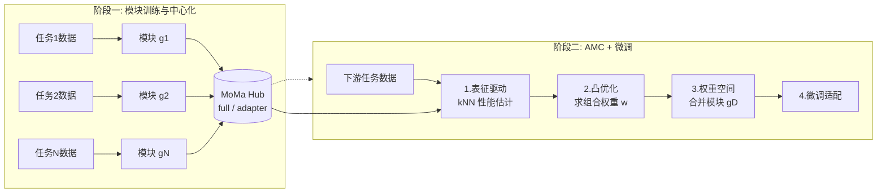

# MoMa: A Simple Modular Learning Framework for Material Property Prediction

**会议**: ICLR 2026  
**OpenReview**: [https://openreview.net/forum?id=jiSt3M25TP](https://openreview.net/forum?id=jiSt3M25TP)  
**代码**: [https://github.com/GenSI-THUAIR/MoMa](https://github.com/GenSI-THUAIR/MoMa)  
**领域**: 材料属性预测 / 模块化深度学习 / AI for Science  
**关键词**: 模块化学习, 材料属性预测, 模型合并, kNN 代理误差, 凸优化, 少样本学习  

## 一句话总结
MoMa 把每个材料属性任务训成一个独立"模块"存入 Hub，面对新任务时用一套训练无关、表征驱动的算法（kNN 估计性能 + 凸优化求权重 + 权重空间合并）自适应地组合出最协同的模块再微调，在 17 个材料任务上平均比最强基线提升 14%。

## 研究背景与动机
- **领域现状**：材料属性预测（形成能、带隙、声子等）是材料发现的核心环节，传统 DFT 精度高但算力代价过大。近年深度学习方法（CGCNN、各类力场大模型、JMP 等）走"在势能面 PES 数据上预训练 → 下游微调"的范式，已能在大量任务上超越从零训练的专用模型。
- **现有痛点**：作者指出当前范式忽视了材料任务的两个本质特征——**多样性（diversity）**与**异质性（disparity）**。力场模型几乎只在 PES 派生属性（力、能量、应力）上训练、且偏向晶体材料，难以泛化到有机分子、热学/电子等更广谱的系统与属性；而把一大堆差异巨大的任务塞进单一模型联合训练，又会因不同物理规律之间的**知识冲突**互相干扰。
- **核心矛盾**：要覆盖广谱任务就得多任务联训，但多任务联训会引发任务间干扰；要避免干扰就得任务隔离，但隔离后又如何为新任务复用这些分散的知识？已有的模块组合方法（搜索式、路由式）都依赖"组合后模型的下游预测误差"作为监督信号，而材料场景下任务异质性高使误差信号噪声大、且下游数据稀缺使路由网络难训、加载全部模块成本随规模爆炸。
- **本文目标**：设计一个既尊重多样性、又规避异质性干扰的模块化框架，且组合过程要数据驱动、高效、可扩展，不依赖人工先验或昂贵的穷举搜索。
- **核心 idea**：**先隔离、后组合**——把每个高资源任务封装成独立模块避免干扰（解 disparity），面对下游任务时再自适应组合协同模块复用知识（解 diversity）；关键创新是用一套**训练无关、表征驱动**的组合算法 AMC 替代不稳定的"误差监督"。

## 方法详解

### 整体框架
MoMa 分两阶段：**(1) 模块训练与中心化**——为每个高资源材料任务以预训练 backbone（默认 JMP）为初始化训练一个专用模块，存入 MoMa Hub；**(2) 自适应模块组合（AMC）与微调**——给定下游任务，用训练无关算法估计每个模块的契合度、求解组合权重、在权重空间合并出定制模块，再微调适配。

### 关键设计

**1. 模块训练与中心化：把任务封装成可复用、保隐私的模块。** MoMa 以一个预训练 backbone 编码器 $f$ 作为每个模块的统一初始化，因此框架与 backbone 无关、可平滑替换。每个任务有两种参数化：**full module** 直接把整网微调后的权重当作模块 $g_i=\theta^i_f$，性能最好；**adapter module** 则在每层间插入 adapter 层、仅更新 adapter 而冻结 backbone，记为 $g_i=\Delta^i_f$，以一点性能换取大幅降低显存，适合算力受限场景。所有模块汇入中心仓库 $H=\{g_1,\dots,g_N\}$ 即 MoMa Hub，当前涵盖 Matminer 中 18 个 >10000 数据点的材料任务（热学/电子/力学等属性）。由于模块只存权重而非原始数据，这种设计天然**保护专有数据**，使社区能在不泄露私有数据的前提下贡献新模块。

**2. 表征驱动的性能估计：绕开不稳定的误差监督。** AMC 不依赖"组合后模型的预测误差"（在材料场景下因高异质性而噪声大、监督不足），而是先单独评估每个模块表征空间的内在质量。直觉是：一个与任务对齐的好模块，会把属性相近的材料映射到嵌入空间中相邻的点。形式上，对每个模块 $g_j$ 把下游训练数据编码为表征 $X^j$，再做留一法 kNN 标签传播得到每个样本的预测 $\hat{y}^j_i=\sum_{k\in N_i}\frac{f_d(x^j_i,x^j_k)}{Z^j_i}y_k$，其中 $f_d$ 为指数余弦相似度。选 kNN 是因为它直接探测表征空间的局部几何、不引入可学习参数，严格契合"训练无关"原则、对数据稀缺任务也抗过拟合。实验显示这种 kNN 代理误差与模块微调后的真实 MAE 呈强正相关（Pearson $r>0.6$）。

**3. 训练无关的权重优化：用集成代理误差求凸优化最优解。** 拿到每个模块的 kNN 预测 $\{\hat{y}^j\}$ 后，目标是找一组权重 $w\in\mathbb{R}^N$ 来组合模块。直接最小化微调后验证误差会因组合爆炸而不可行，于是借鉴集成学习用"加权集成预测（微调前）"的误差作为**代理误差**：$E_D(w)=\frac{1}{M}\lVert\sum_j w_j\hat{y}^j-y\rVert_2^2$，并约束 $\sum_j w_j=1,\ w_j\geq0$。由于目标凸、可行域凸，问题有全局最优解、标准求解器可可靠求得，且不引入任何可学习参数、无需梯度更新或额外调参。作者还在附录给出风险分析，证明最小化该代理误差可约束微调后模型的风险。

**4. 权重空间模块合并：用线性模式连通性保证合并有效。** 得到最优权重 $w^*$ 后，MoMa 直接在权重空间合并出单一定制模块 $g_D=\sum_j w^*_j g_j$（受 model merging / Model Soup 启发）。这种平均之所以有效，依赖**线性模式连通性**：所有模块都源自同一预训练初始化，尽管任务化分叉但参数结构上仍兼容，因此合并出的模块是一个稳定、良态的下游微调初始化。最后给 $g_D$ 接一个任务专属 head，在下游数据上微调到收敛即可。整个 AMC 仅需一轮前向取嵌入 + 轻量 kNN + 凸优化，最大数据集 30 秒内收敛。

## 实验关键数据

### 主实验表格
17 个低数据材料属性预测任务（Matminer，5 split × 5 seed），报告 MAE 与平均排名：

| 方法 | Average Rank | 说明 |
|------|------|------|
| CGCNN | 6.88 | 经典无预训练 |
| MoE-(18) | 4.71 | CGCNN 专家混合，最相关基线 |
| UMA | 4.53 | 通用原子基础模型（力场） |
| JMP-MT | 4.53 | 18 任务多任务预训练 + 微调 |
| JMP-FT | 3.12 | 直接微调 JMP，最强非模块基线 |
| **MoMa (Adapter)** | 2.59 | 参数高效版 |
| **MoMa (Full)** | **1.35** | 14/17 最优，两变体合计 16/17 最优 |

MoMa (Full) 相比 JMP-FT 在 14 个任务更优、平均提升 **14.0%**；相比 JMP-MT 在 16/17 任务更优、平均领先 **24.8%**，印证模块化隔离对缓解任务干扰的价值。JMP-MT 反而落后 JMP-FT，佐证多任务联训存在知识冲突。

### 消融实验表格
对 AMC（基于 MoMa-Full）的拆解（average test MAE 增幅，越高说明该组件越关键）：

| 消融变体 | 劣于 AMC 的任务数 | 平均 MAE 增加 |
|------|------|------|
| Select Average（选中模块均匀平均） | 13/17 | +11.0% |
| All Average（全模块平均 = Model Soup） | 15/17 | +18.0% |
| Random Selection（随机同数模块） | 15/17 | +20.2% |

替换 AMC 为其他组合范式的分析实验：相比 LoRAHub（搜索式）、JMP-(18)（路由式）、Softmax Weighting（启发式）分别在 15/17、17/17、12/17 任务更优，平均 MAE 降低 **21.8% / 15.5% / 13.7%**。

### 关键发现
- **少样本优势更大**：10-shot / 100-shot / full 下归一化 MAE，MoMa 为 0.5503 / 0.2990 / 0.1871，JMP-FT 为 0.7003 / 0.4076 / 0.2217；数据越少 MoMa 领先越明显（margin 从 0.03 扩大到 0.15），契合真实材料场景标签稀缺。
- **模块可扩展**：Hub 从 5→10→18→30 模块，17 任务平均归一化 MAE 从 0.2040 单调降到 0.1759，无饱和迹象；加入 12 个 QM9 分子模块后平均再降 1.7%（MP Phonons 任务降 11.8%）。
- **跨架构一致**：换成非等变、更简单的 Orb-v2（GNS）backbone，MoMa 在 13/17 任务更优、平均提升 6.1%，说明效果不绑定特定 backbone。
- **AMC 权重可解释**：优化出的模块权重揭示了材料属性间的关系，提供科学洞察。

## 亮点与洞察
- **"先隔离后组合"的范式转换**：把 disparity 和 diversity 两个看似矛盾的诉求解耦——隔离训练规避干扰、自适应组合复用知识，干净利落。
- **用表征几何替代误差监督**：AMC 的核心洞见是"在异质材料任务上，组合后的预测误差信号不可靠"，转而用单模块 kNN 代理误差，既训练无关又抗过拟合，且有理论风险界 + 经验强相关双重背书。
- **凸优化保证全局最优**：把权重选择写成凸约束问题，避免了搜索式/路由式的不稳定与高成本，最大数据集 30 秒收敛，天然可扩展。
- **保隐私的社区平台愿景**：模块只存权重不存数据，使专有数据持有者也能贡献模块，MoMa 有望成为材料知识"模块化分发"的开放平台。

## 局限与展望
- Hub 目前仅 18（+12 QM9）个任务，虽展示了扩展性但距"广谱覆盖"仍有距离，更大规模下 AMC 的稳定性与组合质量仍需验证。
- 权重空间合并依赖"所有模块同源初始化"的线性模式连通性假设，若引入异构 backbone 或不同初始化的模块，合并有效性存疑。
- kNN 代理误差与微调后性能的相关性虽强（$r>0.6$）但非完美，个别任务可能误判最优组合。
- full module 性能最好但存储/加载成本随模块数线性增长，adapter 版省显存却有性能损失，大规模部署时的存储-性能权衡需进一步优化。
- 评测集中在 Matminer 低数据回归任务，对分类、生成式或更复杂多模态材料任务的适用性尚未探索。

## 相关工作与启发
- **材料属性预测**：CGCNN 用多边图 + GNN 表征晶体；力场大模型（MACE、Orb、UMA 等）在海量 PES 数据上预训练；JMP 跨域预训练在分子与晶体任务上表现突出——MoMa 把这些 backbone 的知识"模块化"再组合，superior 于直接微调。
- **模块化深度学习**：MoE、Adapter、LoRA 等通过组合/选择/聚合参数模块实现专精与复用；已有组合方法分搜索式（LoRAHub、AKiba 等）与路由式（Muqeeth、Lu 等），均依赖下游预测误差——MoMa 指出这在材料场景失效，提出表征驱动替代。
- **模型合并**：Model Soup、Task Arithmetic、DARE 等在权重空间合并模型，背后是线性模式连通性——MoMa 把它落到材料模块组合上。
- **启发**：在任何"任务高度异质 + 下游数据稀缺"的领域（不限材料），用单模块表征质量的代理误差 + 凸优化做模块组合，可能是比误差监督更稳的范式。

## 评分
- **新颖性**: ⭐⭐⭐⭐ 把模块化学习引入材料属性预测，并用训练无关、表征驱动的 AMC 替代主流误差监督式组合，思路清晰且有理论支撑，组件本身（kNN、凸优化、权重合并）虽非全新但组合得当。
- **实验充分度**: ⭐⭐⭐⭐⭐ 17 任务 × 5 split × 5 seed，含主实验、细粒度消融、组合范式对比、跨架构、少样本、Hub 扩展、权重可解释性，覆盖面与严谨度都很高。
- **写作质量**: ⭐⭐⭐⭐ 动机（diversity/disparity）与方法对应清晰，图表完整，公式与直觉解释到位。
- **价值**: ⭐⭐⭐⭐ 14% 平均提升 + 少样本更强 + 保隐私社区平台愿景，对 AI for materials 有实际推动力，开源进一步降低落地门槛。

<!-- RELATED:START -->

## 相关论文

- [\[ICLR 2026\] Beyond Structure: Invariant Crystal Property Prediction with Pseudo-Particle Ray Diffraction](beyond_structure_invariant_crystal_property_prediction_with_pseudo-particle_ray_.md)
- [\[ICLR 2026\] Advancing Universal Deep Learning for Electronic-Structure Hamiltonian Prediction of Materials](advancing_universal_deep_learning_for_electronic-structure_hamiltonian_predictio.md)
- [\[ICLR 2026\] OXtal: An All-Atom Diffusion Model for Organic Crystal Structure Prediction](oxtal_an_all-atom_diffusion_model_for_organic_crystal_structure_prediction.md)
- [\[ICLR 2026\] From Cheap Geometry to Expensive Physics: A Physics-agnostic Pretraining Framework for Neural Operators](from_cheap_geometry_to_expensive_physics_a_physics-agnostic_pretraining_framewor.md)
- [\[ICLR 2026\] Stretching Beyond the Obvious: A Gradient-Free Framework to Unveil the Hidden Landscape of Visual Invariance](stretching_beyond_the_obvious_a_gradient-free_framework_to_unveil_the_hidden_lan.md)

<!-- RELATED:END -->
