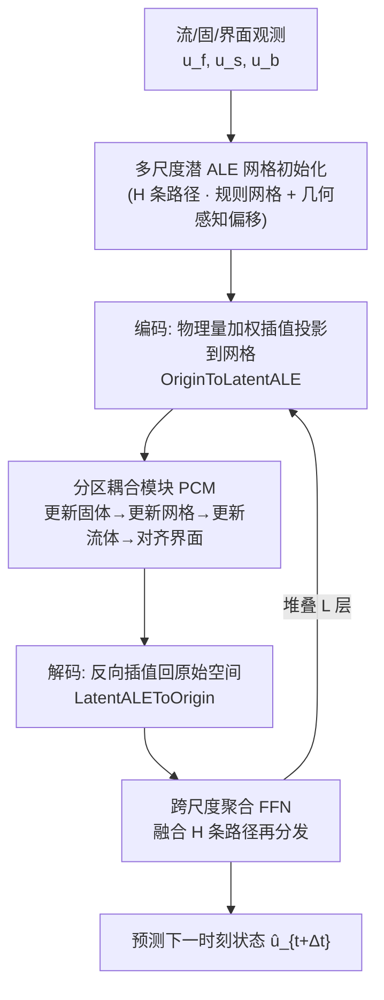

# Neural Latent Arbitrary Lagrangian-Eulerian Grids for Fluid-Solid Interaction

**会议**: ICLR 2026  
**OpenReview**: [https://openreview.net/forum?id=jKeOsMdMe5](https://openreview.net/forum?id=jKeOsMdMe5)  
**代码**: [https://github.com/therontau0054/Fisale](https://github.com/therontau0054/Fisale)  
**领域**: 科学计算 / 物理仿真 (AI for Science · 流固耦合)  
**关键词**: 流固耦合(FSI), Arbitrary Lagrangian-Eulerian, 分区耦合, 神经算子, 多尺度潜空间网格  

## 一句话总结
Fisale 把经典数值方法里的 ALE（任意拉格朗日-欧拉）网格和分区耦合算法搬进神经网络，用多尺度"潜空间 ALE 网格"为流体、固体、耦合界面提供统一的几何感知表示，再用分区耦合模块把双向流固耦合拆成"更新固体→更新网格→更新流体→对齐界面"四个子步逐级迭代，在 2D/3D 三个真实场景上做到双向 FSI 的 SOTA。

## 研究背景与动机
**领域现状**：流固耦合（Fluid-Solid Interaction, FSI）描述固体在流体作用下运动/变形、同时反过来改变流体压力速度场的强耦合现象，广泛存在于血管瓣膜、机翼气动、土木结构等场景。传统数值解法把问题离散成网格，用浸没边界法（IBM）或 ALE 方法配合单体（monolithic）或分区（partitioned）迭代求解，但计算昂贵、强依赖网格、还有稳定性问题。深度学习作为 PDE 求解器近年兴起，训练后推理远快于传统求解器。

**现有痛点**：绝大多数深度学习 FSI 方法只能处理**单向 FSI**——把固体当成刚性、静止的内边界（比如把机翼当成不变形的固定壁面），只解流体域，大幅简化了耦合。真实机翼会在气动载荷下显著变形，流固界面是动态的、耦合关系更复杂。少数处理**双向 FSI** 的工作里，GNN 模拟器的消息传递是"无状态、无区分"的，难以区分域内/域间信息且局部感受野缺乏全局建模；最接近的 CoDA-NO 沿物理变量通道切分输入、用 codomain 注意力学全局映射，但这种变量切分仍是**单体视角**，没有显式处理固体变形带来的动态流固界面。

**核心矛盾**：现有神经算子普遍用"单体、无区分"的方式建模，无法同时学到流体和固体两个域各自不同的行为与它们之间的双向依赖，导致双向 FSI 仍未被充分探索。

**本文目标**：提出一个纯数据驱动框架，能分别刻画固体、流体的演化以及二者复杂的耦合交互。

**核心 idea**：**(1) 把耦合界面当成一等公民**——和固体、流体并列地显式建模成独立组件；**(2) 借鉴 ALE** 用一套与材料帧、空间帧都解耦的网格为异构域提供统一表示，于是提出"潜空间 ALE 网格"；**(3) 借鉴分区耦合算法**，用分区耦合模块（PCM）把单体非线性更新拆成有结构的子步，逐级迭代地捕捉非线性相互依赖。

## 方法详解

### 整体框架
Fisale 由 $H$ 条并行的"潜空间 ALE 网格"路径（pathway，对应不同空间尺度）组成，每条路径先做一次 ALE 网格初始化为流/固/界面提供统一表示，再经过 $L$ 个堆叠的 processor。每个 processor 包含三步串联：把原始空间物理量编码（投影）到潜空间 ALE 网格 → 在网格上跑分区耦合模块 PCM → 解码回原始空间；每过一层之后用一个聚合模块（FFN）把各尺度路径的特征拼接融合再分发回各路径，实现跨尺度通信。

### 关键设计

**1. 显式界面建模：把耦合界面提升为一等组件。** 不同于把流固界面当成隐式约束，Fisale 把界面 $u_b=[g_b, q_b]$ 和固体 $u_s$、流体 $u_f$ 并列成第三个显式组件，满足 $C_f+C_s=C_b$、$N_f+N_s+N_b=N$。这一步是后面所有设计的认知前提：正因为界面被单独拿出来，模型才能在变形剧烈、界面动态移动的区域专门分配建模能力。消融显示去掉显式界面后整体误差上升 28.68%，因为界面行为本身就是固/流双向作用最集中的地方。

**2. 几何感知的潜空间 ALE 网格初始化。** 先在归一化后的 $[-3.5,3.5]^d$ 区间均匀采样一个规则笛卡尔网格 $a\in\mathbb{R}^{M\times d}$（按 3σ 法则覆盖 99.95% 输入网格点），让空间拓扑与具体几何解耦。再通过几何感知偏移把规则网格"拉"向感兴趣区域：对每个网格节点 $a_i$，计算它到各域采样点的方向向量，过线性层后用归一化径向核加权（近点权重大），如流体贡献的偏移为
$$\Delta_f(a_i)=\sum_{j=1}^{N_f}\frac{\exp(\text{Linear}(-\|a_i-g_{f_j}\|_2))}{\sum_{j}\exp(\text{Linear}(-\|a_i-g_{f_j}\|_2))}(g_{f_j}-a_i)$$
三个域偏移相加 $\Delta(a)=\Delta_s+\Delta_f+\Delta_b$，再线性投影得 $g_a=\text{Linear}(a+\Delta(a))$，并在其上做 k-NN 建边 $E=\text{kNN}(g_a)$。核的空间衰减让远处区域更新平缓，保住网格光滑性。之所以叫 ALE 网格，是因为它在求解中以"既不跟随材料点、也不固定于空间帧"的方式独立运动，介于拉格朗日与欧拉视角之间——通过简单地改变节点数 $M$ 就能并行构造多尺度网格，粗网格管全局气动、细网格管局部变形。

**3. 注意力式的物理量编码/解码插值。** 每次耦合前，要把异构域的物理量投影到统一网格上。编码用类注意力的加权插值：以网格 $Q=\text{Linear}(g_a)$ 为查询、物理量 $K=\text{Linear}(x_f)$ 为键，权重 $w_f=QK^T$，投影 $p_f=\text{Softmax}(w_f)x_f$，固/界面同理，于是网格被扩展成在**每个潜节点上同时携带流、固、界面三类特征**的元组 $\{g_a,p_s,p_f,p_b\}$，天然支持跨域交互。解码用转置方向的 Softmax $\hat{x}_f=\text{Softmax}(w_f^T)\hat{p}_f$ 保证插值权重和为 1，再跨尺度拼接过 FFN 融合。

**4. 分区耦合模块 PCM：把单体更新拆成四个注意力子步。** PCM 严格对应经典分区耦合算法的四步循环，用一连串注意力顺序更新。**①更新固体**：用交叉注意力，查询 $Q=\text{Linear}(\text{Concat}(p_s+g_a, p_b+g_a))$ 只含固体+界面、键值含整个系统，用被证明等价于神经算子的线性注意力 $\tilde{Q}(\tilde{K}^TV\cdot D^{-1})$（$\tilde Q,\tilde K$ 为 Softmax 归一化），让每个固体节点选择性地关注全系统后更新；网格几何 $g_a$ 充当位置编码。**②更新网格坐标**：用速度型 Laplacian 光滑 $\nabla\cdot(\gamma\nabla v_g)=0$，离散后恰好等价于图上局部消息传递，把 $\gamma\in[0,1]$ 设为可学习且邻域归一化，$v_{g,i}\leftarrow\sum_{j\in N(i)}\gamma_{ij}\text{Linear}(\text{Concat}(p_s',p_f,p_b')_j)$，再显式 $\hat{g}_a\leftarrow g_a+\Delta t\cdot v_g$（取 $\Delta t=1$ 为抽象时间步）并做几何光滑控制网格质量。**③更新流体**：与固体对称，在更新后的网格 $g_a'$ 上交叉注意力更新流体与界面。**④对齐界面**：用自注意力让流、固、界面三域互相对齐、调和界面两侧的不一致。四步构成一个 PCM 并堆叠以增强容量。消融发现四步的**更新顺序基本不影响性能**（堆叠架构会跨层补偿局部顺序选择），且换成"单层注意力+FFN"的简化模块后误差上升 9.56%，说明多阶段跨域注意力级联是有效的。

## 实验关键数据

三个真实相关、覆盖 2D/3D 与不同任务类型的 FSI 场景；与 10+ 先进学习型求解器（GeoFNO/GINO/CoDA-NO/LSM/LNO 等神经算子，Galerkin/GNOT/ONO/Transolver 等 Transformer，MGN/HOOD/AMG 等 GNN）公平对比（参数量对齐），单卡 RTX 3090 训练。

### 主实验表格

**结构振荡（Structure Oscillation / FLUSTRUK-A，2D 单步预测，Relative L2 ↓）**

| 模型 | Solid | Fluid | Interface | Mean ↓ |
|---|---|---|---|---|
| Geo-FNO | 0.0003 | 0.0387 | 0.0074 | 0.0155 |
| CoDA-NO | 0.0005 | 0.0703 | 0.0075 | 0.0261 |
| Transolver | 0.0004 | 0.0265 | 0.0075 | 0.0115 |
| AMG（次优） | 0.0004 | 0.0211 | 0.0051 | 0.0089 |
| **Fisale** | **0.0003** | **0.0148** | **0.0047** | **0.0066** |

**静脉瓣膜（Venous Valve，2D 自回归仿真，RMSE-all ↓，节选）**

| 模型 | Solid-Geo | Solid-Stress | Fluid-Vel(x) | Interface-Geo |
|---|---|---|---|---|
| Transolver | 0.3262 | 3055.56 | 0.0901 | 0.3432 |
| CoDA-NO | 0.6843 | 4385.24 | 0.1713 | 0.7806 |
| **Fisale** | **0.2794** | **2658.59** | **0.0768** | **0.2565** |

**柔性机翼（Flexible Wing，3D 稳态推断，Relative L2 ↓）**

| 模型 | Solid | Fluid | Interface | Mean ↓ |
|---|---|---|---|---|
| GNOT | 0.0081 | 0.0558 | 0.0227 | 0.0289 |
| Transolver（次优） | 0.0051 | 0.0200 | 0.0242 | 0.0164 |
| **Fisale** | **0.0042** | **0.0155** | **0.0211** | **0.0136** |

Fisale 在三个任务的所有域上全面领先，流体域优势尤为明显。OOD 测试（训练 Re∈{200,400,2000}，测试 Re=4000）Fisale 误差 0.0637，优于 AMG 的 0.0696。

### 消融实验表格（均在柔性机翼任务上，Mean Relative L2 ↓）

| 消融设置 | Mean ↓ | 相对劣化 |
|---|---|---|
| **Fisale 完整** | **0.0136** | - |
| w/o 显式界面组件 | 0.0175 | +28.68% |
| PCM 换成简化注意力模块 | 0.0149 | +9.56% |
| PCM 四步更新顺序（6 种排列） | 0.0134~0.0139 | 基本不变 |

### 关键发现
- **显式界面是最大增益来源**：去掉后劣化 28.68%，远大于其他组件，印证"界面提升为一等公民"是核心。
- **PCM 顺序鲁棒**：六种更新排列性能几乎一致，说明堆叠架构能跨层补偿局部顺序，PCM 是灵活框架而非死板流程。
- **大规模场景抗干扰**：柔性机翼每样本 3.5 万+ 网格点时多个 baseline 崩溃（稠密流体点淹没固体信息），Fisale 靠分域建模避免固体信息被淹没。
- **长程稳定**：自回归静脉瓣膜场景下，显式界面+统一表示让 Fisale 在 rollout 后期仍保持固体几何一致性。

## 亮点与洞察
- **数值方法到神经网络的"结构性迁移"**：不是泛泛地"受启发"，而是把 ALE 的网格运动、分区耦合的四步循环、Laplacian 光滑的离散形式逐一对应到可学习模块（潜 ALE 网格 / PCM / 图消息传递），这种"经典算法即归纳偏置"的做法解释性强。
- **界面一等公民是关键认知**：把通常被隐式处理的耦合界面显式拎出来，直接抓住了双向 FSI 中作用最强、最难学的区域，消融数据有力支撑。
- **统一潜节点携带多域特征**：每个网格节点同时持有流/固/界面三类特征，从表示层面就内建了跨域交互能力，避免了 GNN 消息传递"无区分"的弊病。
- **多尺度即"换个 M 值"**：用同一套机制、只改节点数就构造多分辨率网格并行处理，简洁优雅。

## 局限与展望
- **缺独立 arXiv 与更广 PDE 验证**：当前三个任务虽覆盖 2D/3D，但都是 FSI 范畴，框架对更一般多物理场（热-流-固、电磁-流体）的迁移性未验证。
- **网格初始化超参敏感**：规则网格区间、节点数 $M$、k-NN 的 $k$ 等都需设定，论文显示单路径下 $M$ 增大收益有限，多尺度路径的设计依赖经验。
- **自回归长程误差累积**：虽然比 baseline 稳，但 RMSE 量级（应力达数千）说明长 rollout 仍有累积漂移，缺乏物理约束（如守恒律）的硬保证。
- **计算与可扩展性**：3.5 万点已是上限附近，工业级千万网格规模、三维大变形接触的可扩展性仍待考。

## 相关工作与启发
- **混合求解器**（用 NN 替换分区框架里的流/固求解器、或加速界面力/速度估计）vs **纯数据驱动**：本文属后者，完全绕开传统求解器。
- **降阶模型 ROM**（autoencoder/PCA/POD 假设 FSI 在低维流形演化）与 **PINN**（把控制方程写进损失）是另两条主线；本文不嵌方程、靠结构归纳偏置。
- **神经算子**（GeoFNO/GINO/Transolver/CoDA-NO）学函数空间映射、网格无关，CoDA-NO 是最直接对手但单体视角；**GNN 模拟器**（MeshGraphNet/GNS）靠 mesh/particle 连接学局部交互。Fisale 的启发在于：当问题本身有成熟的经典数值结构时，把该结构显式编码进网络（分区、ALE 网格运动、界面分离）比堆通用算子更对症。

## 评分
- **新颖性**: ⭐⭐⭐⭐ 把 ALE 网格运动 + 分区耦合算法系统性地结构化迁移到神经网络，并首倡"耦合界面一等公民"，在双向 FSI 这个 underexplored 问题上立意清晰、组件设计与经典算法一一对应。
- **实验充分度**: ⭐⭐⭐⭐ 三个 2D/3D 真实场景 + 10+ 强 baseline + OOD + 多项消融（界面/顺序/简化模块/多尺度），证据链完整；扣分在于全限于 FSI、缺更广多物理场。
- **写作质量**: ⭐⭐⭐⭐ 从数值方法到神经模块的映射讲得清楚，图 2 三联图与公式配合到位，notation 规范。
- **价值**: ⭐⭐⭐⭐ 为双向 FSI 的数据驱动建模提供了一个可解释、可扩展的范式，"经典算法即归纳偏置"对 AI4Science 仿真有方法论借鉴意义。

<!-- RELATED:START -->

## 相关论文

- [\[ICLR 2026\] $\partial^\infty$-Grid: A Neural Differential Equation Solver with Differentiable Feature Grids](boldsymbolpartialinfty-grid_a_neural_differential_equation_solver_with_different.md)
- [\[ICML 2026\] A Call to Lagrangian Action: Learning Population Mechanics from Temporal Snapshots](../../ICML2026/physics/a_call_to_lagrangian_action_learning_population_mechanics_from_temporal_snapshot.md)
- [\[ICLR 2026\] LD-EnSF: Synergizing Latent Dynamics with Ensemble Score Filters for Fast Data Assimilation with Sparse Observations](ld-ensf_synergizing_latent_dynamics_with_ensemble_score_filters_for_fast_data_as.md)
- [\[NeurIPS 2025\] Simulation-Based Inference for Neutrino Interaction Model Parameter Tuning](../../NeurIPS2025/physics/simulation-based_inference_for_neutrino_interaction_model_parameter_tuning.md)
- [\[ICML 2026\] Quantum latent distributions in deep generative models](../../ICML2026/physics/quantum_latent_distributions_in_deep_generative_models.md)

<!-- RELATED:END -->
