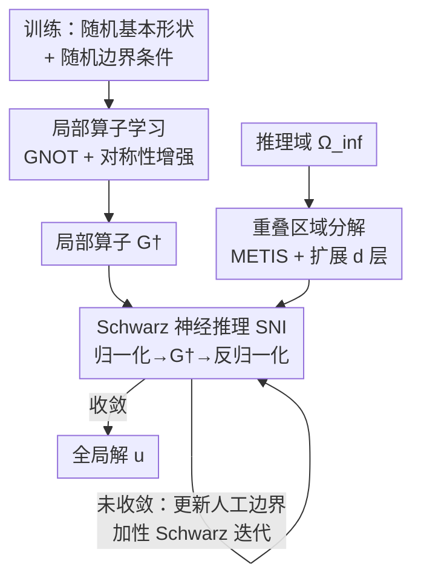

# Operator Learning with Domain Decomposition for Geometry Generalization in PDE Solving

**会议**: ICLR 2026  
**OpenReview**: [https://openreview.net/forum?id=IxAnL4PRsg](https://openreview.net/forum?id=IxAnL4PRsg)  
**代码**: https://github.com/questionstorer/sni  
**领域**: AI4Science / 偏微分方程求解  
**关键词**: 神经算子, 区域分解, 几何泛化, Schwarz 方法, 数据效率

## 一句话总结
本文把经典的区域分解方法（DDM）和神经算子结合，提出"局部到全局"框架：只在随机生成的基本形状（简单多边形）上训练一个局部神经算子，推理时把任意几何域切成小子域、逐域求解再用加性 Schwarz 迭代缝合（称为 Schwarz Neural Inference, SNI），从而在完全没见过的新几何上把相对误差从直接推理的 20%~167% 降到个位数。

## 研究背景与动机
**领域现状**：神经算子（FNO、DeepONet、GNOT 等）把 PDE 的输入函数到解的映射学成一个网络，求解时只需一次前向传播，比传统有限元/有限差分求解器快很多，因此近年很火。

**现有痛点**：神经算子是纯数据驱动的，存在一个"先有鸡还是先有蛋"的死结——想训练算子就得先用昂贵的经典求解器造大量数据，而用神经算子本来就是为了绕开经典求解器。更要命的是**几何泛化能力差**：训练时见过的域形状和推理时的域形状必须相近，一旦遇到和训练分布差别很大的全新几何，算子精度就崩。已有的几何参数化、坐标表示等做法只能处理"长得像"的域，无法外推到任意形状；Lie 点对称数据增强（LPSDA）只缓解了数据量问题，几何泛化问题原封未动。

**核心矛盾**：神经算子的泛化半径被训练几何的分布牢牢限制住，而工业界真实问题的几何千变万化，不可能在训练阶段穷举。

**本文目标**：让一个**只在简单基本形状上训练过**的神经算子，能在任意复杂几何上求解 PDE，且不需要为新几何重新造数据、重新训练。

**切入角度**：作者借用数值分析里成熟的区域分解思想——任何复杂域都可以被剖分成一堆小的、简单的子域。如果神经算子在这些"基本形状"上能泛化得很好，那么把局部解拼起来就能逼近全局解。

**核心 idea**：用"在基本形状上学局部算子 + 经典 Schwarz 迭代缝合局部解"代替"直接在全局复杂几何上学算子"，把几何泛化难题转化为可控的局部泛化 + 收敛的迭代缝合。

## 方法详解

### 整体框架
整个框架分两个阶段。**训练阶段**只关心一件事：让神经算子学会在各种"基本形状"上求解局部边值问题。作者随机生成大量简单多边形作为基本形状，在上面随机施加边界条件并用经典求解器算出局部解，再配合基于 PDE 对称性的数据增强，训出一个局部算子 $G^\dagger$。**推理阶段**面对任意复杂几何域 $\Omega_{\text{inf}}$：先用图剖分把它切成若干带重叠的子域，每个子域形状都接近训练用的基本形状；然后在每个子域上调用 $G^\dagger$ 得到局部解，再用加性 Schwarz 迭代不断更新子域间人工边界上的值，把局部解缝合成全局解，直到收敛。这个推理算法就是 Schwarz Neural Inference (SNI)。

### 关键设计

**1. 基本形状选取与训练数据生成：把"任意几何"压缩成可枚举的训练分布**

训练阶段无法显式枚举任意形状，所以必须挑一类"基本形状"作为积木。作者要求基本形状满足两个条件：**采样可行**（能方便地采样并在上面解边值问题）和**完备覆盖**（足够灵活，能拼出任意离散平面域）。他们选择**最多 $n$ 个顶点的简单多边形**（无自交、无洞，限定在紧致区域内）的空间 $P_s(n)$——简单多边形是 Lipschitz 域、采样方便，且理论上能逼近任意离散平面域。施加边界条件时有两个坑要处理：一是子域上会出现混合边界，所以训练时把多边形边界随机切成两段连通分量分别当 Dirichlet 和 Neumann 边界；二是推理时边界值范围任意，但训练不可能覆盖无界范围，于是训练数据的边界值、系数场、源项都归一化到有界区间 $[0,1]$，超出范围的情况留给推理阶段用对称性处理。

**2. 局部算子学习与对称性数据增强：在简单形状上把局部解学准**

框架对神经算子架构是正交的——只要能吃可变的输入/输出格式、表达力够强即可。作者用 **GNOT**（一个基于 transformer、能处理不规则网格和多输入函数的灵活神经算子）来学习局部解算子 $G: P \times H \to U$，其中 $P$ 是基本形状空间、$H$ 是边界条件等输入函数、$U$ 是解空间。为了增强泛化，作者自然地引入 **Lie 点对称数据增强（LPSDA）**：利用 PDE 本身的对称性（如旋转、缩放）从已有解生成新解，关键是要把这些变换**一致地**作用到边界条件和其他输入函数上，才能保持解的合法性。实验显示旋转增强普遍有益，而缩放增强要谨慎——用得不对反而掉点。

**3. 重叠区域分解：把复杂域自动切成接近基本形状的子域**

任意域没有标准的剖分方式，作者沿用 DDM 文献里的常规做法：先对域 $\Omega$ 做三角剖分 $\mathcal{T}_h(\Omega)$，把它的连通关系建成一张图，再用 **METIS** 图剖分算法把图切成 $K$ 个不重叠的连通子图。但 Schwarz 方法需要子域**互相重叠**才能传递信息，所以每个子图再向外迭代扩展 $d$ 层邻居顶点，得到重叠分解 $\{\Omega_k\}_{k=1}^K$。这里 $K$（分块数）和 $d$（扩展深度）是关键超参，要调到让切出来的子域形状尽量贴近训练用的基本形状 $P$，否则局部算子在子域上就泛化不好。

**4. Schwarz 神经推理（SNI）：归一化 + 局部推理 + 加性 Schwarz 迭代缝合**

这是把局部解拼成全局解的核心算法。它脱胎于经典的加性 Schwarz-Richardson 迭代

$$u^{n+1} = u^n + \tau \sum_{k=1}^{K}\left(R_k^\top w_k^{n+1} - R_k^\top R_k u^n\right)$$

其中 $R_k$ 是把全局函数限制到子域 $\Omega_k$ 的限制算子、$R_k^\top$ 是补零扩展回全局的算子、$0<\tau<\frac{1}{K}$ 是步长。每一轮迭代里，每个子域 $\Omega_k$ 的局部输入 $B_k^n$ 由两部分拼成：落在全局边界上的那段用预先给定的真实边界数据（迭代中不变），落在子域间人工边界上的那段用上一轮的解 $u^n$（迭代中更新）。SNI 把经典迭代里"用 FEM 解局部问题"这一步换成"用学好的局部算子推理"：先用问题相关的变换 $T_k$（平移/缩放/数值平移缩放）把超出训练范围的局部输入映射回训练范围（这正是设计 1 里留的坑——靠 PDE 对称性补救），调用 $\hat w_k^{n+1} = \tilde T_k\big(G^\dagger(T_k(\Omega_k, B_k^n, H_k))\big)$ 得到局部解，再反变换 $\tilde T_k$ 还原，最后按加性 Schwarz 形式更新全局解，循环到满足收敛准则。

作者还为 SNI 给出了**理论保证**（Theorem 1）：当算子 $L$ 是自伴、强制椭圆，且学习到的局部解算子有一致误差界 $\|\tilde S_k - S_k\| \le c$、每个自由度被至多 $t$ 个子域覆盖、经典迭代以速率 $0<\rho<1$ 收缩时，SNI 收敛到不动点，且与真解的误差满足 $\|\tilde u^* - u^*\| \le c' = \frac{\tau t}{1-\rho}c$。也就是说**全局精度由局部算子的泛化误差线性控制**——局部学得越准，缝合出的全局解越准。非线性方程不在理论覆盖范围内，作者用实验验证其有效性。

### 一个完整示例
以在复杂域 C 上解 Laplace2d-Dirichlet 为例：先三角剖分并建图，METIS 切成 $K=20$ 个连通子图，每块向外扩 $d=2$ 层得到重叠子域；初始化全局解 $u^0$；每轮迭代里，对 20 个子域分别取出局部输入（真实全局边界 + 上一轮人工边界值），用 $T_k$ 归一化到训练范围、过一遍 GNOT、再反归一化得到 20 个局部解，按步长 $\tau=0.04$ 做加性 Schwarz 更新；这样迭代上千步直到 $l_2$ 相对误差收敛。最终 GNOT 直接推理的误差是 28%，SNI 降到 2.1%。

## 实验关键数据

### 主实验
在 5 种 PDE（线性/非线性、纯 Dirichlet/混合边界、含系数场/时变）上，每种都在三个不同复杂度的域 A、B、C 上测试，指标是 $l_2$ 相对误差（%，越低越好）。Baseline 是把域整体平移缩放到 $[-0.5,0.5]^2$ 后让 GNOT 直接推理。

| 方程 | 域 | GNOT 直推 (%) | SNI (%) |
|------|----|--------------|---------|
| Laplace2d-Dirichlet | A / B / C | 22 / 22 / 28 | 2.2 / 2.1 / 2.1 |
| Laplace2d-Mixed | A / B / C | 10.7 / 10.7 / 38 | 6 / 7 / 6 |
| Darcy2d | A / B / C | 16 / 63 / 167 | 8 / 8 / 5.4 |
| Heat2d（时变） | A / B / C | 11.5 / 30 / 20 | 5.3 / 11 / 5.8 |
| NonlinearLaplace2d | A / B / C | 22 / 26 / 28 | 2.0 / 2.2 / 2.2 |

在所有定常问题上 SNI 把误差降低 34.8%~96.8%，且**域越复杂、领先越多**（如 Darcy2d 域 C 从 167% 降到 5.4%）；同一个 PDE 在不同几何上的误差差异控制在 3.25% 以内，说明单个算子能在多种几何上保持一致精度。时变热传导问题用空间×时间分解扩展，误差降低 54.1%~74.2%。

### 消融实验

| 数据增强配置 | 验证误差 | 域A | 域B | 域C |
|------|---------|-----|-----|-----|
| 无增强 | 3.79 | 4±2 | 3.0±0.6 | 3±1 |
| 仅旋转 | 2.50 | 2.2±0.6 | 2.1±0.4 | 2.1±0.9 |
| 旋转+缩放[0.2,1] | 5.31 | 4±1 | 3.4±0.5 | 3.4±0.4 |
| 旋转+缩放[0.8,1] | 2.86 | 1.8±0.4 | 3.3±0.7 | 2.8±0.8 |

### 关键发现
- **数据增强**：旋转增强稳定有益（域 A 从 4% 降到 2.2%），但缩放增强范围选不好会反伤（[0.2,1] 缩放把验证误差从 3.79 抬到 5.31），需按 PDE 类型谨慎选。
- **超参数**：分块数 $K$、扩展深度 $d$、步长 $\tau$ 几乎不影响最终精度，只影响收敛速度——$K$ 越大最终误差略小但收敛慢（超过 20 块后基本持平），$\tau$ 越大收敛越快但不能超过上限 $1/K$，$d$ 在 1/2/4/8 下收敛曲线几乎重合。
- **数据效率**：各种数据量下 SNI 都显著优于 GNOT 直推，且大数据量时 SNI 误差甚至低于验证误差，达到同等精度所需的数据量远小于直推。
- **架构无关性**：把 GNOT 换成 Geo-FNO，SNI 在 A/B/C 上得到 9%/13%/13%，仍远好于直推，验证框架对算子架构正交，但局部算子泛化能力的差异会传导到最终精度。

## 亮点与洞察
- **把"几何泛化"问题降维成"局部泛化 + 可证收敛的缝合"**：这是最巧妙的地方——与其硬训一个能吃任意几何的大算子，不如只训练简单形状上的局部算子，把复杂度甩给成熟的 Schwarz 迭代，而且还能给出误差界。
- **理论与工程闭环**：Theorem 1 把全局误差 $c' = \frac{\tau t}{1-\rho}c$ 直接挂钩局部算子误差 $c$，给"为什么局部学准就够了"提供了干净的解释，实验里"域越复杂领先越多"也印证了局部分块的价值。
- **对称性被用了两次**：训练时 LPSDA 增强提升局部泛化，推理时又用同一套对称变换把超范围输入"拉回"训练范围（归一化/反归一化），把训练阶段刻意限定有界范围留下的坑补上，设计自洽。
- **框架即插即用**：算子架构（GNOT/Geo-FNO）、PDE 类型（线性/非线性/时变）都能换，这种正交性让它更像一个通用范式而非单点 trick。

## 局限与展望
- **理论只覆盖自伴强制椭圆 PDE**：非线性方程的收敛只有实验支撑，没有理论保证，对更一般的双曲/对流主导问题是否成立未知。
- **迭代成本**：SNI 是迭代算法（实验里动辄上千步），单次推理要多次调用局部算子，相比一次前向的直推牺牲了速度换精度，论文也承认精确刻画 FEM/本方法的时间复杂度很难。
- **超参敏感于几何匹配**：$K$、$d$ 必须调到让子域"像"基本形状，否则局部算子泛化失效；自动选取分解超参、保证子域边界至多两段连通分量等仍需人工经验。
- **目前主要在 2D**：实现集中在 $\Omega \subseteq \mathbb{R}^2$，3D/更高维只在时变热传导的空间×时间分解里浅尝，工业级三维几何的可扩展性待验证。

## 相关工作与启发
- **vs 直接神经算子（GNOT/Geo-FNO 直推）**：它们试图让单个算子直接吃下整个复杂几何，分布外几何上误差爆炸；本文不动算子架构，只改"在哪求解"——先分解再缝合，把外推问题变成内插问题。
- **vs Lie 点对称增强（LPSDA, Brandstetter et al. 2022）**：LPSDA 只解决数据量，几何泛化没碰；本文把对称性既用于训练增强、又用于推理归一化，并叠加区域分解直接攻几何泛化。
- **vs 算子学习 + DDM 加速（Mao et al. 2024）**：他们在均匀网格上结合算子学习与 DDM 来加速经典方法；本文把这一范式推广到**任意几何**，目标是几何泛化与数据效率而非单纯加速。
- **vs 复杂几何编码方法（CORAL / Transolver physics-attention / AROMA）**：这些方法靠把复杂几何编码成低维表示或物理 token 来省算力，本文走的是"分而治之 + 经典迭代缝合"的正交路线，并附带收敛性理论。

## 评分
- 新颖性: ⭐⭐⭐⭐⭐ 把经典 Schwarz 区域分解与神经算子干净地缝在一起，并给出收敛/误差界理论，思路漂亮
- 实验充分度: ⭐⭐⭐⭐ 覆盖 5 类 PDE × 3 种几何 + 数据效率 + 架构无关性，但多为 2D、缺真实工业大几何
- 写作质量: ⭐⭐⭐⭐ 框架与算法叙述清晰，理论与实验呼应良好
- 价值: ⭐⭐⭐⭐⭐ 直击神经算子最痛的几何泛化与数据效率，范式具备很强可迁移性

<!-- RELATED:START -->

## 相关论文

- [\[ICML 2026\] Topology-Preserving Neural Operator Learning via Hodge Decomposition](../../ICML2026/physics/topology-preserving_neural_operator_learning_via_hodge_decomposition.md)
- [\[ICLR 2026\] Locally Subspace-Informed Neural Operators for Efficient Multiscale PDE Solving](locally_subspace-informed_neural_operators_for_efficient_multiscale_pde_solving.md)
- [\[ICLR 2026\] OrthoSolver: A Neural Proper Orthogonal Decomposition Solver For PDEs](orthosolver_a_neural_proper_orthogonal_decomposition_solver_for_pdes.md)
- [\[ICLR 2026\] From Cheap Geometry to Expensive Physics: A Physics-agnostic Pretraining Framework for Neural Operators](from_cheap_geometry_to_expensive_physics_a_physics-agnostic_pretraining_framewor.md)
- [\[ICLR 2026\] KANO: Kolmogorov–Arnold Neural Operator](kano_kolmogorov-arnold_neural_operator.md)

<!-- RELATED:END -->
