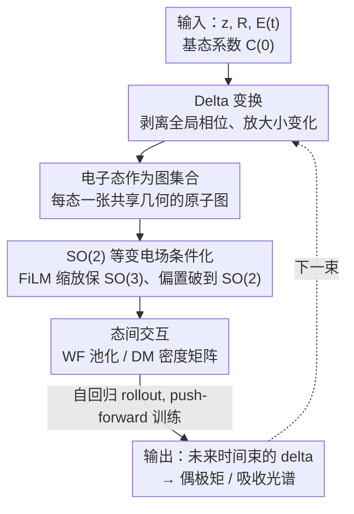

# Orbital Transformers for Predicting Wavefunctions in Time-Dependent Density Functional Theory

**会议**: ICLR 2026  
**OpenReview**: [https://openreview.net/forum?id=06I7jcrkW2](https://openreview.net/forum?id=06I7jcrkW2)  
**代码**: https://github.com/divelab/AIRS/ （作为 AIRS 库一部分）  
**领域**: AI4Science / 量子动力学 / 等变图 Transformer  
**关键词**: TDDFT, 波函数演化, SO(2) 等变, 密度矩阵, 自回归 rollout

## 一句话总结
本文提出 OrbEvo——一个等变图 Transformer，把实时含时密度泛函理论（RT-TDDFT）中所有占据态的 Kohn-Sham 波函数（用原子轨道线性组合系数表示）的时间演化学出来，用约 1 秒的网络推理替代数小时的数值传播，并能在 QM9 上泛化、准确还原偶极矩与吸收光谱。

## 研究背景与动机

**领域现状**：DFT 用变分原理高效求解定态多体薛定谔方程，主导了分子/固体基态性质计算。但激发态、对外场的动态响应这类现象需要含时版本 TDDFT；其中实时 RT-TDDFT 直接在时域里把基态波函数沿时间传播，能算出光吸收、电荷转移、电子动力学等线性与非线性性质。

**现有痛点**：RT-TDDFT 极其耗时。它要对 Kohn-Sham 波函数做精细的时空离散，用很小的时间步长长时间传播，每一步都要重新构造依赖电子密度的 Kohn-Sham 哈密顿量，而且波函数数目随体系增大线性增长。论文里一个分子的 TDDFT 数值求解要数小时。

**核心矛盾**：演化算符 $\hat{U}(t,t_0)$ 依赖于随时间变化的哈密顿量 $\hat{H}(t)$，后者又依赖于当前波函数构成的电子密度，形成"密度 → 哈密顿量 → 波函数 → 密度"的自洽迭代闭环，无法跳步。这正是计算昂贵的根源，也是机器学习要逼近的目标算符。

**本文目标**：学一个神经网络直接映射波函数系数的时间演化 $C_n(t) \to C_n(t+1)$，绕过逐步自洽迭代，同时尊重物理对称性、控制自回归累积误差、并能处理随体系增大而增多的多电子态。

**切入角度**：作者把问题看作"原子图上波函数系数演化的 ML-PDE（机器学习偏微分方程）"问题。关键观察有两个：一是外加均匀电场指定了一个空间方向，会把系统的旋转对称性从 SO(3) 破缺到绕场轴的 SO(2)，模型必须恰好编码这种破缺；二是各占据态是初始哈密顿量的本征矢，应当当作"集合"而非有序拼接的特征通道来处理。

**核心 idea**：用等变图 Transformer（EquiformerV2 骨干）在原子图上自回归地演化波函数 delta，配上 SO(2) 等变的电场条件化、把多电子态建模成共享几何的图集合（并提供波函数池化 / 密度矩阵两种态间交互方式），再用 push-forward 训练抑制 rollout 误差累积。

## 方法详解

### 整体框架

OrbEvo 接收分子的原子类型 $z$、3D 坐标 $R$、随时间变化的均匀外电场 $E(t)$ 以及基态波函数系数 $C(0)$，自回归地预测未来若干步的波函数系数序列 $\{C(t)\}$，再由波函数算出偶极矩和吸收光谱。每个占据电子态被表示成一张独立的原子图（共享同一份几何 $z,R$），波函数系数作为节点特征挂在原子上；网络按时间"束"（time bundle）一次推进多步，循环 rollout 直至覆盖整条轨迹。

整个 pipeline 分四步：① 把要预测的目标从原始系数改写成放大后的 **delta 波函数**（去掉占主导的全局相位，只留外场诱导的小变化）；② 把每个电子态编码成等变图节点特征，喂进 SO(2) 等变的 EquiformerV2 块；③ 在层间做**态间交互**（波函数池化 OrbEvo-WF 或密度矩阵 OrbEvo-DM 二选一），让所有占据态共同决定演化；④ 读出下一时间束的 delta，并用 **push-forward 训练**让模型在自己的预测误差上鲁棒。

### 关键设计

**1. Delta 变换：把"全局相位"从预测目标里剥掉，逼模型学真正的外场响应**

由于外电场幅度很小，未来时刻系数 $C_n(t)$ 相比初始 $C_n(0)$ 几乎只差一个全局相位因子。若直接学 $C_n(t)$，模型会偷懒只学这个无信息的相位旋转。作者为每个电子态定义全局相位 $\gamma_n(t)=\frac{C_n(0)^\dagger S C_n(t)}{|C_n(0)^\dagger S C_n(t)|}$ 与放大的 delta $\Delta_n(t)=\frac{1}{\beta}\left(\frac{C_n(t)}{\gamma_n(t)}-C_n(0)\right)$，其中 $\beta=10^{-3}$ 用来放大微小变化，从而有 $C_n(t)=(C_n(0)+\beta\Delta_n(t))\gamma_n(t)$。无外场时 $\gamma_n(t)=\exp(-i\epsilon_n t/\hbar)$、$\Delta_n(t)=0$，正好说明 $\Delta$ 干净地抽出了外场诱导的那部分波函数。论文主文聚焦学 $\Delta(t)$（相位 $\gamma$ 的学习在附录）。这一步是让任务"有东西可学"的前提。

**2. 电子态作为共享几何的图集合：尊重"本征矢是集合"的物理本性**

所有占据态共同决定电子密度，进而决定演化算符，所以演化某个态时必须考虑态间交互。一个直觉做法是按能级 $\{\epsilon_n\}$ 排序、把所有态拼成一个全局特征向量——但作者实验发现这样**学不出传播**。原因是各电子态是初始哈密顿量的本征矢，更应被当作一个"集合"，把它们当成独立特征通道混在一起会让学习变难。于是把每个态 $n$ 建成独立的图 $\mathcal{G}_n=\{F^{WF}_n, z, R\}$：节点特征 $F^{WF}_n$ 是该态的波函数系数，几何 $z,R$ 被所有态共享。每个原子的轨道系数按旋转阶 $\ell$ 分组成等变特征 $f^{WF}_{n,i}\in\mathbb{R}^{9\times d_{cond}}$（拼到 $\ell\le 2$，氢等少轨道原子做零填充）。

**3. 两种态间交互——波函数池化 vs 密度矩阵：后者天然贴合 TDDFT 数学结构**

在"图集合"之上，作者给出两种让态彼此通信的方式。**OrbEvo-WF** 在每个图 Transformer 块后对电子态做平均池化，再用一个全局块处理、广播回各态：$f^{pool}_i=\mathrm{GT}\left(\frac{1}{N_{occ}}\sum_n f_{n,i}\right)$，$f'_{n,i}=f_{n,i}+f^{pool}_i$；它用上了所有态的完整波函数特征。**OrbEvo-DM** 则直接构造密度矩阵特征：把密度矩阵 $D(t)=\sum_n \eta_n C_n(t)\otimes C_n^*(t)$ 按原子对切成块 $D_{ij}$，用张量收缩（Clebsch-Gordan 系数做基变换）把每块整理成阶数高至 $\ell=4$ 的等变特征 $\tilde D_{ij,n}=\mathrm{TC}(C_{n,i}(t)\otimes C_{n,j}^*(t))$，再按占据数聚合 $\tilde D_{ij}=\sum_n \eta_n\tilde D_{ij,n}$；对角块加进节点特征、非对角块条件化进图注意力 $\alpha_{ij},m_{ij}=\mathrm{TP}_\theta([f_i,f_j,\mathrm{linear}(\tilde D_{ij})],r_{ij})$。由于 delta 变换会让密度矩阵含线性项和二次项，作者发现保留二次项反而有害（贡献小、对噪声敏感），故只留线性项。DM 之所以更优，是因为密度泛函本就是 RT-TDDFT 中评估含时哈密顿量的核心量，让模型直接看到密度矩阵，等于把"学演化算符"摆到了它最自然的输入上。配套地，DM 还支持**电子态采样**（如 DM-s8 只随机监督 8 个态）以省训练成本——因为它在输入端就把全部态聚合进密度矩阵，采样不损交互；而 WF 采样会丢信息、显著掉点。

**4. SO(2) 等变电场条件化：用 FiLM 式缩放/偏置精确实现对称性破缺**

外场指定了 z 轴方向，把系统对称性从 SO(3) 破到绕轴的 SO(2)，模型必须恰好编码这一点。作者在每个 LayerNorm 后插入 FiLM 式条件化：$y_\ell=s_\ell\odot\mathrm{LN}(x)_\ell+b_\ell$，其中缩放 $s_\ell$ 与偏置 $b_\ell$ 由当前及下一时间束的电场强度经 MLP 算出。关键技巧在于：缩放 $s_\ell$ 对每个 $\ell$ 相同，**保持 SO(3) 等变**；偏置 $b_\ell$ 只在 $m=0$ 处非零（对应电场沿 z 轴的球谐编码），**把对称性从 SO(3) 破到 SO(2)**。消融显示，这种"破缺"对正确学出从基态到第一步演化的映射是必需的——它把外场的方向信息以等变-相容的方式注入特征，而非简单拼接。

### 损失函数 / 训练策略

训练目标是逐原子的 $\ell_2$-MAE：$\ell_2\text{-MAE}(\Delta^{pred},\Delta^{target})=\frac{1}{N^{batch}_a}\sum_i\|\Delta^{pred}_{\cdot,i}-\Delta^{target}_{\cdot,i}\|_2$，在时间束内所有步上平均。为对抗自回归 rollout 的分布漂移，采用 **push-forward 训练**（time bundling，$h=f=N_{tb}=8$）：让模型先 unroll 一次，用带误差的预测作为新输入 $\hat\varepsilon=\mathrm{StopGrad}(M(\cdot)-\Delta)$，使训练分布逼近推理时的误差分布；并以等概率混用干净输入与 push-forward 输入，对 $\hat\varepsilon$ 加线性 warm-up（0→1，避免训练初期噪声压过信号），同时把无法用 push-forward 建模的首束 $\Delta(1..h)$ 损失权重翻倍以平衡利用率。

## 实验关键数据

数据集：从 QM9 选 5,000 个多样分子（测泛化），用 MD17 中丙二醛（MDA）的 1,500 个构型做消融。先用 ABACUS 做 SCF DFT 拿基态波函数，再做 RT-TDDFT 在均匀含时电场下传播 5 fs（1,000 步、步长 0.005 fs），每 10 步降采样得到 101 步轨迹。QM9 划分 4000/500/500，MDA 划分 800/200/500。评测三类物理量：含时波函数系数、含时偶极矩、由偶极振子强度刻画的光吸收谱（均为无量纲相对误差）。

### 主实验

| 数据集 | 模型 | 波函数 1-step $\ell_2$-MAE | 波函数 rollout $\ell_2$-MAE | 偶极 rollout nRMSE | 吸收 nRMSE-all |
|--------|------|------|------|------|------|
| MDA | DM-s8 | 0.0242 | 0.0947 | 0.1778 | 0.3008 |
| MDA | WF-sall | 0.0192 | 0.0853 | 0.1585 | 0.3957 |
| QM9 | DM-s8 | 0.0190 | 0.0797 | 0.1885 | 0.1946 |
| QM9 | WF-sall | 0.0164 | 0.0874 | 0.2071 | 0.6045 |

在更接近真实测试场景的 QM9 上，**DM-s8 在 rollout 波函数、偶极、吸收三项上整体优于 WF-sall**（如吸收 nRMSE-all 0.1946 vs 0.6045），印证密度矩阵交互与 TDDFT 数学结构一致带来的优势；WF 虽在 1-step 误差上更低，但泛化与长程 rollout 上不及 DM。

### 消融实验

| 配置 | 效果说明 |
|------|---------|
| 有序拼接电子态（替代图集合） | 学不出传播，验证"态当集合"的必要性 |
| 去掉 SO(2) 对称性破缺 | 无法正确学出基态→首步映射 |
| 密度矩阵保留二次项 | 性能变差（贡献小、对噪声敏感），故只留线性项 |
| WF 用电子态采样 | 显著掉点（丢信息）；DM 采样几乎无影响 |

### 关键发现
- **密度矩阵交互最贴合物理**：DM 把所有占据态在输入端聚合成密度矩阵，既是 TDDFT 中决定哈密顿量的核心量，又使训练时的电子态采样几乎无损——这是 DM 在泛化与效率上双赢的根因。
- **对称性破缺不可省**：恰当地把 SO(3) 破到 SO(2)（缩放保等变、$m=0$ 偏置破缺）是学对外场响应的开关，去掉就学不动。
- **零监督下涌现物理**：训练只监督波函数 delta，从未显式监督偶极/吸收，但 DM-s8 仍能高相关地复现逐步偶极矩并准确定位吸收谱峰位。
- **巨大加速**：单分子 TDDFT 数值求解需数小时，网络推理约 1 秒。

## 亮点与洞察
- **Delta + 全局相位分离**很巧：把"几乎只差相位"的难学目标重参数化为"相位 $\gamma$ + 放大 delta $\Delta$"，让模型把算力花在真正含物理信息的小量上，是该任务能 work 的关键前提。
- **"电子态是集合不是序列"**这个观察直接决定架构成败：把每个本征态建成共享几何的独立图、用池化/密度矩阵做置换不变交互，绕开了"按能级拼接"的失败模式，可迁移到任何需处理一组本征矢/模式的物理 ML 任务。
- **用 FiLM 缩放/偏置实现精确对称性破缺**是干净的工程实现——缩放管"保 SO(3)"、$m=0$ 偏置管"破到 SO(2)"，把物理对称性约束拆成两个可分别控制的旋钮。
- 借鉴 PDE 代理模型的 **time bundling + push-forward** 来治自回归误差累积，说明量子动力学 rollout 可以直接复用神经 PDE 求解器的成熟训练技巧。

## 局限与展望
- 作者承认标准 TDDFT 自身的局限会传导给模型：难处理锥形交叉（conical intersection），且精度受交换-关联泛函近似限制。
- 实验体系偏小（QM9 分子 + 单个 MDA 分子的构型），均匀单方向外场、固定时间步长/时长，尚未验证更大体系、复杂/多方向场或更长时程的外推。
- 两个数据集规模有限（QM9 仅 5000 分子、MDA 仅单分子构型），泛化结论主要在 QM9 同分布测试集上得出，跨化学空间的真实 OOD 仍待更系统检验。
- delta 变换中 $\beta=10^{-3}$、time bundle $N_{tb}=8$、push-forward warm-up 等超参对结果影响明显（warm-up 并非总有益），实用中需调参。

## 相关工作与启发
- **vs 经典 RT-TDDFT 数值求解器**：传统方法逐步自洽传播、精确但每分子数小时；本文用一次网络推理（~1 秒）逼近演化算符，以可控相对误差换取数量级加速，定位为"加速器"而非替代物理。
- **vs EquiformerV2（骨干）**：直接复用其 SO(3) 等变图注意力与块结构，但把任务从静态性质/力/哈密顿量预测换成波函数时间演化，并新增 SO(2) 电场条件化与态间交互模块。
- **vs 神经 PDE 代理模型（Brandstetter 等的 time bundling / push-forward）**：把 PDE 学习范式迁移到"原子图上的波函数系数演化"，证明这套对抗 rollout 漂移的训练技巧在量子动力学上同样有效。
- **vs 按能级拼接电子态的朴素基线**：本文实验证明该基线学不出传播，凸显"把本征态当集合处理"的必要性。

## 评分
- 新颖性: ⭐⭐⭐⭐⭐ 首次把波函数时间演化建模为原子图上的 SO(2) 等变 ML-PDE，密度矩阵特征化与 TDDFT 结构对齐的思路新颖
- 实验充分度: ⭐⭐⭐⭐ QM9+MDA 双数据集、波函数/偶极/吸收三指标、零监督涌现物理可信；但体系偏小、外推验证有限
- 写作质量: ⭐⭐⭐⭐ 物理动机与方法推导清晰，对称性破缺与 delta 变换讲得透彻
- 价值: ⭐⭐⭐⭐⭐ 把数小时的激发态动力学模拟压到秒级且能泛化，对 AI4Science / 量子化学有实在加速价值

<!-- RELATED:START -->

## 相关论文

- [\[ICLR 2026\] Towards a Transferable Acceleration Method for Density Functional Theory](towards_a_transferable_acceleration_method_for_density_functional_theory.md)
- [\[ICLR 2026\] A Function-Centric Graph Neural Network Approach for Predicting Electron Densities](a_function-centric_graph_neural_network_approach_for_predicting_electron_densiti.md)
- [\[ICLR 2026\] PINFDiT: Energy-Based Physics-Informed Diffusion Transformers for General-purpose Time Series Tasks](pinfdit_energy-based_physics-informed_diffusion_transformers_for_general-purpose.md)
- [\[ICML 2026\] TINNs: Time-Induced Neural Networks for Solving Time-Dependent PDEs](../../ICML2026/physics/tinns_time-induced_neural_networks_for_solving_time-dependent_pdes.md)
- [\[NeurIPS 2025\] High-order Equivariant Flow Matching for Density Functional Theory Hamiltonian Prediction](../../NeurIPS2025/physics/high-order_equivariant_flow_matching_for_density_functional_theory_hamiltonian_p.md)

<!-- RELATED:END -->
