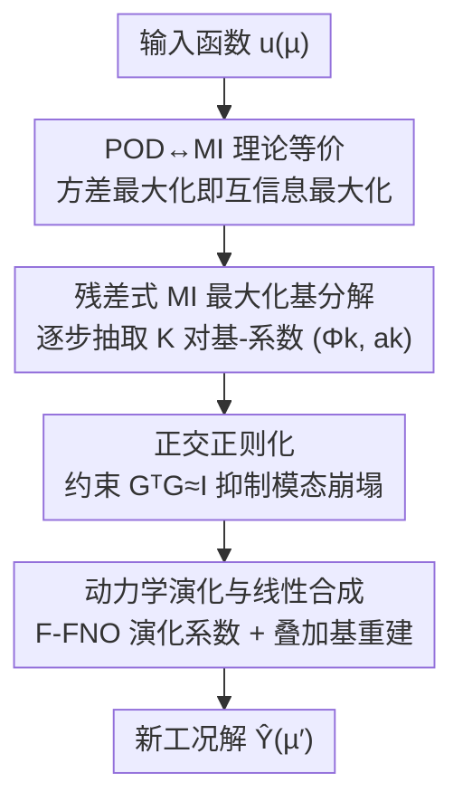

# OrthoSolver: A Neural Proper Orthogonal Decomposition Solver For PDEs

**会议**: ICLR 2026  
**OpenReview**: [https://openreview.net/forum?id=9OOmlDrEfn](https://openreview.net/forum?id=9OOmlDrEfn)  
**代码**: 待确认  
**领域**: 神经 PDE 求解器 / 降阶建模  
**关键词**: 本征正交分解, 互信息最大化, 神经算子, 模态崩塌, 降阶模型

## 一句话总结
本文从信息论视角重新解读经典的本征正交分解（POD），证明其「能量最大化」准则在线性高斯假设下等价于「互信息最大化」，并据此提出 OrthoSolver——一个用互信息最大化把 POD 推广到非线性域、再配正交正则化防模态崩塌的神经算子框架，在 7 个 PDE benchmark 上全面超过现有 SOTA。

## 研究背景与动机

**领域现状**：用 PDE 描述的物理系统做高保真数值模拟代价极高，因此「分解」成了加速求解的核心范式。传统侧用模型降阶（MOR），其中 POD 把高维动力系统投影到一组「能量最优」的正交基张成的低维子空间上，从而大幅加速；数据驱动侧则从 FNO、DeepONet 这类单体算子，逐渐演化到 LSM、Transolver 这类带分解/切片结构的架构。

**现有痛点**：两条路线各有硬伤。POD 受限于它的线性假设——基函数针对特定工况求出后泛化很差，且面对多物理场耦合这类强非线性时，它只能对各变量独立分解或假设线性相关，抓不住底层的非线性耦合。数据驱动的分解（如 Transolver 把输入切成可学习的 slice）虽然灵活，但缺乏物理先验、也没有机制强制各分量相互独立，在复杂场景下会发生**模态崩塌（mode collapse）**：学出来的基互相高度相似、失去区分能力。

**核心矛盾**：传统分解（POD）有坚实的数学基础，但其方差度量在非线性系统上误差很大；数据驱动分解表达力强，却缺乏理论支撑、易崩塌。问题的根子在于——POD 用「方差最大化」来挑主导基，而方差只刻画二阶矩，天然抓不住非线性系统里的高阶依赖结构。

**切入角度**：作者注意到信息论里已有结论——在线性高斯假设下，最大化投影方差等价于最大化原始数据与投影系数之间的**互信息（MI）**。既然 POD 本质是 MI 最大化的一个「被线性高斯约束住」的特例，那只要把度量从方差换成不受线性限制的互信息，就能把 POD 的核心哲学自然推广到非线性域。

**核心 idea**：用「互信息最大化」代替「方差最大化」来迭代地抽取一组紧凑且富表达力的非线性基模，再用正交正则化保证基的多样性、抑制模态崩塌。

## 方法详解

### 整体框架
OrthoSolver 把经典算子学习里「直接学一个映射 $F: X \to Y$」拆成三个算子的复合 $F = D \circ S_\theta \circ E_\theta$：基分解算子 $E_\theta$ 把输入函数 $u(\mu)$ 映成 $K$ 个全局基函数 $\{\Phi_k\}$ 与对应系数 $\{a_k(\mu)\}$；求解算子 $S_\theta$ 在低维系数空间里把系数演化到新的参数条件 $\mu'$；合成算子 $D$ 再用线性叠加 $\hat{Y}(\mu') = \sum_k \hat{a}_k(\mu')\Phi_k$ 重建出高维解。整条 pipeline 把「在哪个子空间表示」和「在子空间里怎么演化」解耦，既继承了 POD 的可解释性，又能高效泛化到新工况。

其中基分解算子 $E_\theta$ 是一个**残差式的逐步抽取过程**：每一步抽出当前数据场里「信息量最大」的一对基-系数 $(\Phi_k, a_k)$，从残差里减掉它，再对新残差重复 $K$ 次——这正是把 POD 的顺序贪心分解搬到了非线性、信息驱动的目标上。

### 关键设计

**1. POD↔互信息的理论等价：把方差最大化重写成信息论原则**

这是整个方法的地基，针对的是「数据驱动分解缺理论支撑、而 POD 理论受困于线性」的核心矛盾。作者形式化地证明（Theorem 1）：当数据快照 $u$ 服从多元高斯、投影 $a = \langle u, \phi\rangle$ 为线性操作时，最大化投影方差 $\mathrm{Var}(a)$ 等价于最大化原始数据与投影系数之间的互信息 $I(u;a)$。证明很简洁：零均值高斯变量的微分熵 $H(a) = \tfrac{1}{2}\log(2\pi e\cdot\mathrm{Var}(a))$，由对数单调性得 $\arg\max \mathrm{Var}(a) \Leftrightarrow \arg\max H(a)$；又因 $a$ 是 $u$ 的确定性函数、$H(a|u)=0$，故 $I(u;a)=H(a)$，三者贯通。这条等价揭示出 POD 的方差准则只是「被线性高斯约束的 MI 最大化特例」，而 MI 作为不受线性约束的通用统计依赖度量，给推广到非线性域提供了正当理由。

**2. 残差式互信息最大化的基分解模块：把贪心抽取从方差换成 MI**

针对 POD 的线性假设抓不住非线性耦合，本模块沿用 POD 那种「顺序、残差式」的抽取过程，但把线性方差目标换成非线性的信息目标。把输入 $u(\mu)$ 当作初始残差 $X_1$，第 $k$ 步求解 $\max_{\Phi_k,a_k} I(X_k, a_k)$，其中基由 F-FNO 给出 $\Phi_k = \mathrm{FNO}(X_k)$、系数由 MLP 给出 $a_k = \mathrm{MLP}(X_k)$，随后更新残差 $X_{k+1} = X_k - a_k\Phi_k$ 并重复 $K$ 步。由于直接最大化 $I(X_k,a_k)$ 难算，作者把它等价改写成最小化抽取后残差里残留的信息 $\min I(X_k, X_{k+1})$（附录证明「模态捕获的信息越多 ⇔ 残差携带的信息越少」），最终 MI 损失为各步平均 $L_{mi} = \tfrac{1}{K}\sum_k I(X_k, X_{k+1})$。而互信息本身不可直接计算，作者采用 **CLUB（Contrastive Log-ratio Upper Bound）** 这个可微的 MI 上界来估计：学一个变分分布 $q(a_k|X_k)$ 近似真实后验，得到 $I_{\text{CLUB}}(X_k,a_k) = \mathbb{E}_{p(X_k,a_k)}[\log q(a_k|X_k)] - \mathbb{E}_{p(X_k)p(a_k)}[\log q(a_k|X_k)]$，可直接用训练 batch 采样优化、端到端训练。这是据作者所知首个把现代 MI 估计器引入 PDE 解分解的工作。

**3. 基正交正则化：用 Gram 矩阵约束直接掐死模态崩塌**

针对数据驱动分解最常见的失效——优化器倾向收敛到冗余特征而非真正独立的分量，表现为学出的基向量高度相似（$\phi_i \approx \phi_j$）、基矩阵 $G$ 的有效秩塌缩（$\mathrm{rank}(G) < K$），从而限制子空间的表达力。作者引入正交约束，把基函数的 Gram 矩阵正则到接近单位阵 $G^TG \approx I$，从而在理论上保证基向量线性独立、维持满秩 $\mathrm{rank}(G) \approx K$。损失用 Frobenius 范数写作 $L_{ortho} = \|G^TG - I\|_F^2$，其中 $G = [\Phi_1,\dots,\Phi_K]$ 是以展平基向量为列的矩阵。这一项与重建约束 $L_{recon} = \|u - \sum_k a_k\Phi_k\|_F^2$ 配合，既保证分解忠于原数据，又强制各模态彼此正交，是抑制崩塌的关键。

**4. 动力学演化与线性合成：在低维系数空间里高效泛化**

分解拿到 $\{\Phi_k\}$ 和 $\{a_k(\mu)\}$ 后，求解算子 $S_\theta$ 负责把系统演化到新参数条件 $\mu'$。对每个模态 $k$，一个专属的 F-FNO 求解器把当前系数与其静态基函数拼接作为输入，预测新系数 $\hat{a}_k(\mu') = \mathrm{FNO}_k(\mathrm{Concat}(a_k(\mu), \Phi_k))$；所有模态的系数预测完后，合成算子 $D$ 做一次**无参数**的线性叠加 $\hat{Y}(\mu') = \sum_k \hat{a}_k(\mu')\Phi_k$ 得到高维解。把演化限制在低维系数空间，让模型既快又能向新工况泛化，预测损失用物理学习常用的相对 L2 误差 $L_{pred} = \|Y(\mu')-\hat{Y}(\mu')\|_2 / \|Y(\mu')\|_2$。

### 损失函数 / 训练策略
框架端到端训练，总损失是四项的加权和：$L_{total} = \lambda_{MI}L_{MI} + \lambda_{recon}L_{recon} + \lambda_{ortho}L_{ortho} + \lambda_{pred}L_{pred}$，分别驱动「抽信息量大的基 / 分解忠于原数据 / 基多样化防崩塌 / 求解器准确演化」四个目标。为平衡多任务，采用 **Dynamic Weight Averaging（DWA）** 动态调权（温度 $T=1.0$）。实现基于 PyTorch、单张 3090，模态数 $K\in\{1,2,4,6\}$，BasisExtractor 与 SolutionOperator 都用 1 层 F-FNO，Adam 学习率 $1\text{e}{-3}$，1D 训 500 epoch、2D 训 200 epoch。

## 实验关键数据

### 主实验
在 PDEBench 的 7 个流体动力学 benchmark（覆盖 1D/2D、含 Advection、Burgers、Navier-Stokes、Diffusion-Sorption、Diffusion-Reaction 等）上，对比 10 个 SOTA 神经算子，指标为相对 L2 误差（越低越好）。

| 数据集 | 本文 | 次优方法 | 说明 |
|--------|------|----------|------|
| 1D Advection | **0.0033** | 0.0036 (Transolver) | 5 个 1D 全部居首 |
| 1D Burgers | **0.0150** | 0.0166 (FNO) | — |
| 1D NS | **0.0157** | 0.0168 (FNO) | — |
| 2D NS | **0.0055** | 0.0091 (F-FNO) | 误差降低 >39% |
| 2D DiffReac | **0.0172** | 0.0189 (Erwin) | 误差降低 >45% |

在所有 7 个数据集上都取得 SOTA，2D 复杂场景优势尤其明显（2D NS 与 2D Diffusion-Reaction 相对次优分别降低 39%、45% 以上），印证了「用非线性信息论目标替换线性方差假设能找到更紧凑、更有表达力的基」这一核心主张。

### 消融实验
完整模型用 $K=4$，下表为去掉单个损失项后各 benchmark 的相对 L2 误差（节选）及平均退化幅度。

| 配置 | 2D-NS | 2D-Reac | 平均退化 |
|------|-------|---------|----------|
| Full model (K=4) | 0.0055 | 0.0172 | — |
| w/o $L_{ortho}$ | 0.0159 | 0.0238 | -35.43% |
| w/o $L_{MI}$ | 0.0109 | 0.0262 | -34.71% |
| w/o $L_{recon}$ | 0.0079 | 0.0233 | -23.71% |

模态数 $K$ 敏感性：从 $K=1$ 到 $K=4$ 性能持续提升，但 $K=6$ 反而下降——说明 MI 最大化原则先抽出的几个模态已捕获了最关键的物理信息，后续模态信息递减甚至引入噪声，验证了「紧凑而高信息量基」的有效性。

### 关键发现
- 三个辅助约束都不可或缺，其中**正交约束贡献最大**（去掉平均掉 35.43%），MI 目标次之（34.71%），重建约束再次（23.71%）。
- 模态崩塌被直接量化：在复杂的 NS、Burgers 上，基模间平均相关系数高达 0.747、0.810（简单的 Advection、DiffSorp 仅 0.38、0.47），证实复杂场景下崩塌更严重；加入正交正则后，平均基间相关系数从 0.7832 降到 0.0631，崩塌被有效压制。
- $K$ 不是越大越好，存在「信息饱和点」，这与传统降阶建模里「主导模态贡献绝大部分能量」的直觉一致。

## 亮点与洞察
- **把 POD 的能量准则翻译成互信息准则**：用一条简洁的高斯熵等价（$H(a)=\tfrac12\log(2\pi e\,\mathrm{Var}(a))$）就把「方差最大化」和「互信息最大化」打通，让「推广 POD 到非线性」这件事从直觉变成有理论锚点的操作，这个视角本身就很「啊哈」。
- **残差式贪心 + MI 上界（CLUB）的组合**：把不可算的 $\max I(X_k,a_k)$ 等价改写成 $\min I(X_k,X_{k+1})$，再用 CLUB 给出可微上界——这套「目标变换 + 变分估计」的思路可迁移到任何想做「信息驱动顺序分解」的表示学习任务。
- **用正交正则当模态崩塌的硬约束**：$\|G^TG-I\|_F^2$ 直接保满秩，比单纯靠数据驱动「自己学独立」可靠得多，且崩塌前后相关系数从 0.78 掉到 0.06 给了非常直观的证据。

## 局限与展望
- 实验全部局限在 PDEBench 的流体动力学 benchmark（1D/2D），未在更高维、更不规则几何或真实工程多物理场上验证。
- 合成算子 $D$ 是无参数线性叠加，虽保可解释性，但这本身又回到「线性重组」——非线性只发生在基与系数的抽取阶段，最终重建是否限制了表达力值得探讨。
- CLUB 是 MI 的上界估计，估计偏差对训练稳定性的影响、以及 DWA 多任务调权的敏感性，论文着墨不多。
- 模态数 $K$ 需手工设定且存在最优值（$K=4$），缺少自适应确定 $K$ 的机制。

## 相关工作与启发
- **vs POD / POD-DeepONet**: 经典 POD 用 SVD 求固定线性基，POD-DeepONet 在 POD 基上用网络演化系数，但都受困于线性分解误差；本文把分解目标从方差换成互信息，让基本身变成可学的非线性基，从根上绕开线性近似。
- **vs Transolver / LSM 等数据驱动分解**: 它们把输入切成可学 slice 或映到隐谱基，灵活但无物理先验、易模态崩塌；本文用 POD↔MI 的理论等价提供物理化目标，并用正交正则显式防崩塌。
- **vs FNO / DeepONet 等单体算子**: 单体算子在复杂场景表达力受限；本文走分解范式，把场拆成可解释的基本分量，兼顾鲁棒性与可解释性。

## 评分
- 新颖性: ⭐⭐⭐⭐⭐ 把 POD 的能量准则重解读为互信息准则并据此推广到非线性，理论视角新颖且自洽
- 实验充分度: ⭐⭐⭐⭐ 7 个 benchmark、10 个基线、含模态崩塌量化，但局限于 PDEBench 流体场景
- 写作质量: ⭐⭐⭐⭐⭐ 理论—方法—实验逻辑链清晰，Theorem 1 推导简洁有力
- 价值: ⭐⭐⭐⭐ 为「物理先验 + 信息论」融合的降阶建模提供了可复用范式

<!-- RELATED:START -->

## 相关论文

- [\[ICLR 2026\] Operator Learning with Domain Decomposition for Geometry Generalization in PDE Solving](operator_learning_with_domain_decomposition_for_geometry_generalization_in_pde_s.md)
- [\[ICLR 2026\] $\partial^\infty$-Grid: A Neural Differential Equation Solver with Differentiable Feature Grids](boldsymbolpartialinfty-grid_a_neural_differential_equation_solver_with_different.md)
- [\[ICML 2026\] Topology-Preserving Neural Operator Learning via Hodge Decomposition](../../ICML2026/physics/topology-preserving_neural_operator_learning_via_hodge_decomposition.md)
- [\[ICLR 2026\] (U)NFV: (Un)supervised Neural Finite Volume Methods for Solving Hyperbolic PDEs](unfv_unsupervised_neural_finite_volume_methods_for_solving_hyperbolic_pdes.md)
- [\[ICLR 2026\] DRIFT-Net: A Spectral--Coupled Neural Operator for PDEs Learning](drift-net_a_spectral--coupled_neural_operator_for_pdes_learning.md)

<!-- RELATED:END -->
