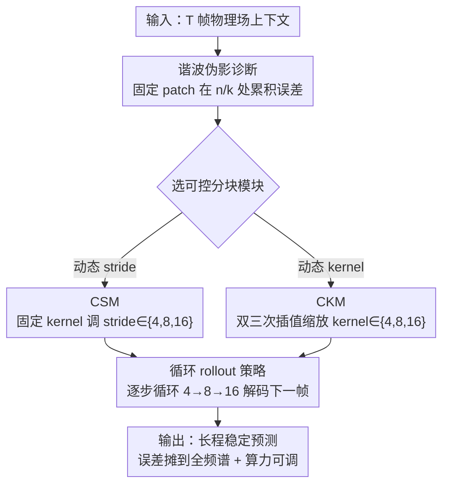

# Overtone: Cyclic Patch Modulation for Clean, Efficient, and Flexible Physics Emulators

**会议**: ICLR 2026  
**OpenReview**: [https://openreview.net/forum?id=itUo64aUeK](https://openreview.net/forum?id=itUo64aUeK)  
**代码**: https://github.com/payelmuk150/patch-modulator  
**领域**: 神经 PDE 代理 / 科学机器学习 / Vision Transformer  
**关键词**: PDE 代理模型, patch 分块, 自回归 rollout, 谐波伪影, 算力自适应

## 一句话总结
针对 ViT 类 PDE 代理模型「固定 patch 尺寸导致谐波误差累积、且算力一旦训完就锁死」的两个老问题，本文提出 Overtone：在自回归推理时**周期性地切换 patch/stride 尺寸**，把误差从单一谐波频率打散到整个频谱，从而在不重训的前提下让长程 rollout 误差最多降低 40%，并让同一个模型在推理时自由权衡精度与速度。

## 研究背景与动机

**领域现状**：用深度学习做时空 PDE 的代理模型（surrogate）已经很主流——训练贵但推理便宜，被广泛用于天气预报、PDE 约束优化、参数推断等。近年来的代理模型大量借用计算机视觉里的 Vision Transformer（ViT）：把离散化的物理场切成不重叠的 $k\times k$ patch、再变成 token，用 non-overlapping patch 来压低 token 数、降低注意力的二次方开销。

**现有痛点**：这套做法有两个被长期忽视的硬伤。其一，作者发现**固定 patch 尺寸在自回归 rollout 中会在谐波频率上系统性地累积误差**。patch 的人工边界会在波数 $n/k$（$n$ 为整数）处注入误差，而每一步都用同样的 patch 尺寸，这些误差就会在时间上「相位锁定」、逐步相长干涉，最终在残差功率谱上形成尖锐的谱峰，在物理场上表现为肉眼可见的网格状伪影。其二，**算力一旦训完就锁死**：物理建模里不同应用对分辨率有硬性阈值（要分辨激波、波前），而更小的 patch 虽然更准却无法在训练后再选——你只能为每个 patch 尺寸单独训一个模型。

**核心矛盾**：精度与算力之间的 trade-off 在数值求解器里是可以通过配置分辨率自由调的，但在固定 patch 的 ViT 代理里被「焊死」在了训练阶段；同时，固定 patch 还把误差注入点固定在了同一组谐波频率上。两个问题其实同源——都来自**推理期 tokenization 缺乏灵活性**。

**切入角度**：作者的关键观察是，如果能在推理时动态控制 patch/stride 尺寸，就能一石二鸟。在自回归 rollout 里**循环交替**地使用 $k_1, k_2, k_3$（如 $4\to 8\to 16$ 反复），既能打破误差在单一谐波上的相位锁定、把它们摊到整个频谱，又顺带提供了无需重训的算力自适应部署能力。

**核心 idea**：用「推理期周期性调制 patch 尺寸」代替「全程固定 patch」，把误差累积问题和算力僵化问题一并解决——而且这个能力完全在测试时生效，与训练解耦。

## 方法详解

### 整体框架
Overtone 是一对**架构无关**的 tokenization 模块，插在 ViT 类 PDE 代理的编码器/解码器位置。模型主体是标准的「时间注意力 + 空间注意力 + MLP」transformer processor，对编码后的 token 做下一步预测；Overtone 不动这个主体，只接管「物理场怎么切成 token、token 怎么还原成场」这一层。它给出两个可控 tokenization 实现——**CSM**（调 stride）和 **CKM**（调 kernel/patch 尺寸）——并在自回归 rollout 时**循环切换**它们的尺寸。

训练时，模型在前向过程中随机采样 $\{4,8,16\}$ 中的尺寸（stride 或 kernel），让一个模型见过所有尺度；推理时，从输入上下文 $\hat{x}^0=(x_1,\dots,x_T)$ 出发，按 $i \bmod 3$ 循环选尺寸、编码→processor→转置卷积解码出下一帧，再把时间窗滑动一格（$\hat{x}^{i+1}_{1:T-1}=\hat{x}^i_{2:T}$）继续推。正是这种「训练随机、推理循环」的解耦，带来了下面的 rollout 误差打散效果。

### 关键设计

**1. 谐波伪影诊断：找出固定 patch 在 rollout 里到底坏在哪**

这是全文的出发点。作者用一个**线性化误差模型**给出启发式解释：误差演化可写成 $e_{n+1}(\omega)=\lambda(\omega)e_n(\omega)+a_n(\omega)$，其中 $\lambda$ 传播已有误差、$a_n$ 在 patch 边界处注入新误差。当 patch 尺寸固定为 $k$ 时，这些注入项始终对齐在谐波频率 $m/k$ 上、跨时间步保持相位锁定，于是误差快速相长累积——在残差功率谱上就是 Figure 2 里那些尖锐谱峰，在物理场上就是网格状畸变。作者强调这是 tokenization 机制本身的产物、**靠训练消不掉**（vanilla / axial / Swin 各种注意力都有），且这个诊断只有在 Overtone 具备测试期灵活性后才可能被发现。

**2. CSM（卷积 stride 调制器）：固定 kernel、只动 stride**

针对上面的诊断，CSM 用最轻量的方式实现可控 tokenization：保持一个固定的基 kernel $w_{\text{base}}$ 不变，只在每次前向时调制卷积的 stride $s\in\{4,8,16\}$。在卷积式 tokenization 里，token 数为 $N_h\cdot N_w$，其中 $N_h=\lfloor(H-k)/s\rfloor+1$；大多数 ViT 让 $k=s$，而 CSM 把两者**解耦**，于是同一个 kernel 配不同 stride 就能在推理时灵活控制 token 数。编码 $x^i_{\text{enc}}=\mathrm{Conv}_{\text{stride}\,s_i}(\hat{x}^i, w_{\text{base}})$，processor 处理后再用同 stride 的转置卷积解码，并按 $s_i=(4,8,16)_{(i\bmod 3)+1}$ 循环。输入边缘用「受边界条件启发的可学习 token」做 padding 以避免边缘伪影。CSM 同时兼容单阶段与多阶段编解码器。

**3. CKM（卷积 kernel 调制器）：动态缩放 patch 尺寸**

CKM 走的是另一条路——直接动态选 patch 尺寸 $k\in\{4,8,16\}$（2 的幂，契合 PDE 数据的常见离散化）。难点在于一个模型怎么用「同一套权重」适配不同 kernel 尺寸，作者借用 **kernel 插值**（SiCNN、FlexiViT 的思路）：用 PI-resize 把基 kernel $w_{\text{base}}\in\mathbb{R}^{k_{\text{base}}\times k_{\text{base}}\times C\times C'}$ 缩放到目标尺寸，即 $x^i_{\text{enc}}=\mathrm{Conv}_{\text{stride}\,k_i}(\hat{x}^i, B^{T\dagger}_{k_i} w_{\text{base}})$，其中 $B_{k_i}$ 是双三次插值矩阵、$B^{T\dagger}_{k_i}$ 是其伪逆转置，编解码两端用同一缩放 kernel，并同样按 $k_i$ 循环。和已有 kernel 插值工作的本质区别在于：FlexiViT 等只是把它当「一次性的尺寸灵活工具」用于图像分类，而 Overtone 把它**搬到 rollout 里做循环调制**，从而把一个算力灵活性工具转化成了缓解长程谐波误差累积的手段。在 vanilla/axial ViT 里作者用 hMLP 式两阶段卷积编解码器，每阶段独立施加 CKM。

**4. 循环 rollout 策略：把测试期灵活性变成「调度旋钮」**

前三个设计提供了「能在推理时换尺寸」的能力，这第四点才是把能力兑现成收益的核心策略。标准自回归预测全程固定 patch，而 Overtone 让 patch/stride 在时间步之间交替（如 $4\to 8\to 16$ 反复），在 tokenization 上引入新的**时间模式**。这带来两个效果：(i) 误差不再在单一 patch 尺度上反复强化，谐波伪影被打散；(ii) 周期性地用更细的分块（4、8）做几步高保真预测，又保留粗分块（16）的效率。更进一步，作者发现**调度的「时序」本身也是一个新旋钮**——即使总 token 预算（即各尺寸的多重集）完全相同，$4\to 8\to 16$ 的排序也优于其他排列，说明「何时用高分辨率分块」会实质影响 rollout 稳定性。这是固定 tokenization 模型完全无法触及的控制维度。

## 实验关键数据

数据集来自 The Well 基准的多个 2D/3D PDE 系统；指标为 VRMSE（方差归一化 RMSE，越低越好）。对比的核心设定是：在**相同总训练预算**下，训一个灵活模型（CSM/CKM）对比训三个固定 patch 模型（patch=4/8/16 各一个）。

### 主实验（次步预测 VRMSE，节选）

| 数据集 | token 数 | CSM | CKM | 固定 patch | Well 基线 |
|--------|---------|-----|-----|-----------|-----------|
| Shear Flow (Vanilla ViT) | 2048 | 0.00546 | 0.00549 | 0.00677 | 0.1049 |
| Turbulent Radiative Layer 2D | 3072 | 0.146 | 0.133 | 0.143 | 0.2269 |
| Active Matter | 4096 | 0.0171 | 0.0192 | 0.0213 | 0.0330 |
| Rayleigh-Bénard | 4096 | 0.0248 | 0.0250 | 0.0310 | 0.2240 |
| Supernova Explosion (3D) | 4096 | 0.287 | 0.267 | 0.272 | 0.3063 |

单个灵活模型在几乎所有数据集和各档算力预算上，都**匹配或超过**了为每个 patch 尺寸单独训练的固定模型，且明显优于 FNO/TFNO/U-Net/CNeXt-U-Net 等 Well 基线。算力-精度 trade-off 也很直观：Active Matter 上把 patch 从 16 减到 4，token 从 256 涨到 4096、推理时间从 0.21s 翻到 0.63s、算力从 5 涨到 170 GFLOPs，但误差降了 30%+。

### rollout 与调度消融

| 实验 | 关键指标 | 说明 |
|------|---------|------|
| 10 步 rollout（Active Matter, Axial ViT） | CSM 0.384 vs 固定 0.640 | 灵活模型长程更稳，最高 +40.0% |
| 10 步 rollout（Rayleigh-Bénard, Vanilla） | 0.140 vs 0.2273 | +38.4% |
| 调度排序（Shear Flow, CSM） | $4\to8\to16$=0.0375 | 同等 token 预算下最优排序 |
| 调度排序（vs $8\to4\to16$ / 随机） | 0.0442 / 0.0433 | 打乱时序退化 15–18% |

### 关键发现
- **谐波误差打散是主要增益来源**：固定 patch 的残差功率谱在 $k/p$ 处有显著谱峰、物理场出现网格畸变；CSM/CKM 的循环 rollout 把误差摊到全频段，谱峰被大幅压平，且这一切「不需要额外训练」。
- **时序排序是独立旋钮**：总 token 预算相同，仅排序不同就能差出 7–18%，$4\to8\to16$（先细后粗的反复）最稳——这是 compute-elastic tokenization 独有的新控制维度。
- **架构无关 + 可迁移**：在 Axial ViT（50M）、Vanilla ViT（100M）上都成立，并能与近期的 CViT 混合架构组合，flexified CViT 同样稳定超过其固定 patch 版本。

## 亮点与洞察
- **把「误差注入的频率位置」当成可调对象**：以往大家把 patch 伪影视为固定缺陷，本文指出真正致命的是它在自回归里「相位锁定地反复打同一组谐波」，于是用时间维度上的尺寸抖动来去相干——这是一个很漂亮的「频域 × 时域」视角。
- **一个工具两用**：kernel 插值原本只是 FlexiViT 里的尺寸灵活手段，本文把它放进 rollout 循环后，意外地变成了长程误差缓解器，说明「训练随机 / 推理循环」的解耦本身就是富矿。
- **推理 rollout 调度可迁移到任何自回归生成**：视频生成、世界模型这类同样靠自回归 rollout 的任务，理论上也可能存在类似的「固定 tokenization → 谐波累积」问题，这套循环调制思路值得试。

## 局限与展望
- **理论解释是启发式的**：作者明确说线性化误差模型只是「与经验一致的启发式解释」，并非严格证明，主要证据是实验。
- **尺寸集合是离散且人工选的**：只在 $\{4,8,16\}$ 上循环，2 的幂的选择和循环长度都未做系统搜索；连续/学习化的调度可能更优。
- **训练用 teacher forcing、未结合 rollout training**：作者承认 rollout 训练是互补方向，叠加上去可能进一步提升所有模型——当前对比是在统一 teacher-forced 设定下做的。
- **额外算力换精度**：用更细分块虽更准但推理时间/FLOPs 显著上升（3D 上可达 8×），实际部署需要按预算挑工作点。

## 相关工作与启发
- **vs 固定 patch ViT 代理（如 McCabe 2023、Morel 2025）**：它们把 patch 固定在 16、且每个尺寸要单独训模型；本文一个模型覆盖全部尺寸，并额外解决了谐波累积，长程 rollout 最高省 40% 误差。
- **vs FlexiViT / SiCNN**：同样用双三次 kernel 插值实现尺寸灵活，但它们面向图像分类、只把它当一次性尺寸工具；本文把它放进自回归 rollout 做循环调制，目标从「灵活」升级为「缓解误差累积」。
- **vs 数据驱动自适应分块（Zhang 2024）**：对方的 patch 划分是数据驱动学出来的，本文则是可手动按算力需求控制的，部署时更可预测、更适合预算感知的生产场景。

## 评分
- 新颖性: ⭐⭐⭐⭐⭐ 「推理期循环调制 patch 缓解谐波累积」是此前 PDE/视频/视觉里都没人做过的角度
- 实验充分度: ⭐⭐⭐⭐ 覆盖多个 2D/3D 系统、两种 backbone、rollout 与调度消融，但理论侧偏弱
- 写作质量: ⭐⭐⭐⭐ 诊断—方法—验证逻辑清晰，频域解释直观
- 价值: ⭐⭐⭐⭐⭐ 给基础模型级 PDE 代理提供了「一个模型多算力点 + 更稳长程」的实用组件

<!-- RELATED:START -->

## 相关论文

- [\[ICLR 2026\] Learning Data-Efficient and Generalizable Neural Operators via Fundamental Physics Knowledge](learning_data-efficient_and_generalizable_neural_operators_via_fundamental_physi.md)
- [\[ICLR 2026\] DGNet: Discrete Green Networks for Data-Efficient Learning of Spatiotemporal PDEs](dgnet_discrete_green_networks_for_data-efficient_learning_of_spatiotemporal_pdes.md)
- [\[ICLR 2026\] From Cheap Geometry to Expensive Physics: A Physics-agnostic Pretraining Framework for Neural Operators](from_cheap_geometry_to_expensive_physics_a_physics-agnostic_pretraining_framewor.md)
- [\[ICLR 2026\] MatRIS: Toward Reliable and Efficient Pretrained Machine Learning Interatomic Potentials](matris_toward_reliable_and_efficient_pretrained_machine_learning_interatomic_pot.md)
- [\[ICLR 2026\] Physics vs Distributions: Pareto Optimal Flow Matching with Physics Constraints](physics_vs_distributions_pareto_optimal_flow_matching_with_physics_constraints.md)

<!-- RELATED:END -->
