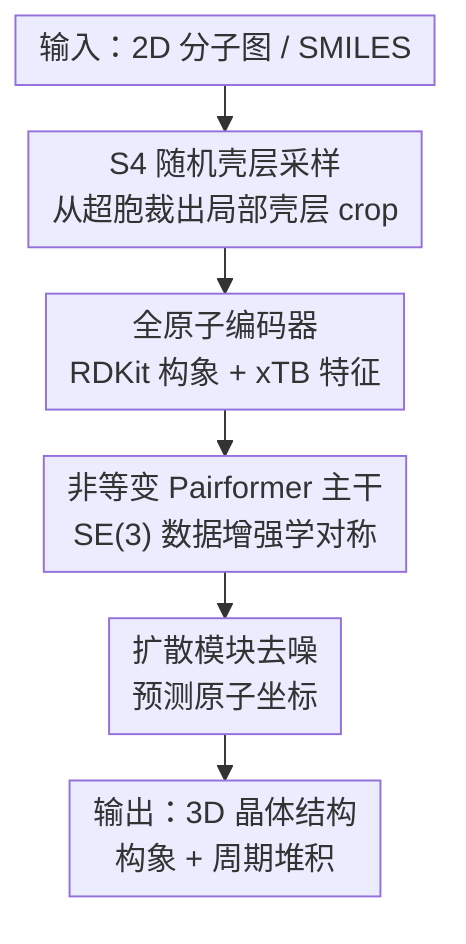

# OXtal: An All-Atom Diffusion Model for Organic Crystal Structure Prediction

**会议**: ICLR 2026  
**OpenReview**: [https://openreview.net/forum?id=6Jd5aBml0y](https://openreview.net/forum?id=6Jd5aBml0y)  
**代码**: 待确认  
**领域**: 扩散模型 / 分子晶体结构预测 / AI for Science  
**关键词**: 晶体结构预测, 全原子扩散模型, 分子晶体, 周期性堆积, 数据增强

## 一句话总结
OXtal 是一个 1 亿参数的全原子扩散 Transformer，只给定分子的 2D 化学图就直接采样出实验上可实现的 3D 晶体结构（分子构象 + 周期堆积），用一套"无晶格"的随机壳层采样训练方案 S4 替代显式晶格参数化和等变架构，在 60 万条实验晶体上训练后，比已有 ML 方法的 CSP 性能高出几个数量级，且比传统 DFT 量化方法便宜几个数量级。

## 研究背景与动机

**领域现状**：晶体结构预测（Crystal Structure Prediction, CSP）是计算化学的一个长期开放难题——给定一个分子的 2D 化学图，要预测它在实验中能形成的 3D 周期性晶体堆积方式。晶体堆积直接决定有机固体的物理化学性质：在制药领域影响溶解度、生物利用度和长期稳定性；在材料领域决定电荷输运、孔隙率和光学响应。经典 CSP 方法把"搜索过程"（枚举或进化算法）和"能量/排序模型"（力场或 DFT）组合起来。

**现有痛点**：经典 DFT 路线为了找到正确结构，每个分子往往要生成并优化 1,000 到 100,000 个候选结构，其中大部分还卡在不利的局部能量极小值里，算力消耗巨大——CCDC 第 7 届盲测中,仅解出 8 个晶体目标就花掉了约 4600 万 CPU 核小时。更关键的是，经典方法只看热力学（Gibbs 自由能），无法刻画真正决定哪个能量极小值会被实验采到的动力学条件。

**核心矛盾**：分子 CSP 同时泛化了蛋白质折叠（AlphaFold3）和无机晶体（MatterGen）两类问题，但比它们都难。蛋白质靠骨架的强分子内约束、且有进化信息（MSA）先验；无机晶体原子数少（< 30）、是强共价/离子键、没有构象自由度。而有机分子晶体化学骨架多样、构象高度柔性、一个晶胞里常含多个分子拷贝 $Z$（且 $Z$ 未知），分子内构象和分子间堆积之间强耦合，单胞动辄超过 100 个原子，全靠弱的长程相互作用。

**本文目标**：构建一个既要在 60 万规模数据上能高效训练、采样又要足够富有表现力的全原子生成模型，并且要在训练时考虑晶格中的周期性相互作用而不拖累可扩展性。

**核心 idea**：抛弃显式等变架构和晶格参数化，改用"在笛卡尔坐标上直接训练 + SE(3) 数据增强"来学对称性，并用一套受结晶过程启发的"无晶格"局部壳层采样方案 S4，让模型在不参数化晶格的前提下也能学到长程周期相互作用，从而把高容量 Transformer 扩展到全原子分辨率。

## 方法详解

### 整体框架

OXtal 把分子 CSP 形式化为一个条件概率推断：给定一组分子图 $g$，要在对称等价类商空间 $M(g)=X(g)/\sim$ 上采样物理上不同的晶体配置 $[C]=[(L,B)]$。整体上 OXtal 是一个以 2D 分子图为条件的全原子扩散模型，输入是 SMILES（化学组成），输出是一套带正确分子内构象和周期堆积的 3D 晶体结构。

它的核心在于把"要生成什么"（构象 + 堆积）和"训练时晶体怎么表示"（单胞、$Z$ 等）解耦。具体由三块串起来：先用 S4 训练方案从一个超胞里裁出一块以某个中心分子为核的"局部壳层"作为训练样本（绕开晶格参数化）；这块裁剪出的原子团（crop）送进一个全原子编码器拿到物理与结构特征；再经 Pairformer 主干在所有原子间传播信息，得到单原子表示和原子对表示；最后扩散模块以这些表示为条件、在加噪坐标上去噪，输出生成的晶体结构。

### 关键设计

**1. 随机壳层采样 S4：用局部裁剪绕开晶格参数化，又不丢长程信息**

直接对整个周期晶格建模会被迫显式参数化晶格向量 $L$ 和未知的分子拷贝数 $Z$，这正是等变 CSP 模型扩展不动的根源。S4（Stoichiometric Stochastic Shell Sampling）的出发点是一个化学观察：结晶是"局部到全局"的过程——分子一旦靠近接触距离，弱而特异的相互作用就会诱导出反复出现的堆积基序并周期性地传播出去；所以只要学会去噪这些局部一致的邻域，推断时就能恢复更大尺度的周期性。

具体做法是：在一个超胞 $C(U)=(LU, B(U))$ 里，先用最小镜像分子间距离 $d_{\min}(m,m')=\min_{x\in X(m), x'\in X(m')}\|x-x'\|_2$ 定义分子接触图，再绕一个均匀采样的中心分子 $m_c$ 按固定接触半径 $r_{cut}$ 建同心壳层：

$$S_k(m_c)=\{m_i\in M:\, k\,r_{cut}\le d_{\min}(m_c,m_i)<(k+1)\,r_{cut}\}$$

随机采壳层数 $K\sim\text{Uniform}(0,k_{max})$，取 $V_K=\cup_{j=0}^{K}S_j$ 作为分子块，并用原子 token 预算 $T_{max}$ 卡住块大小。当最外层放不下时，会按"化学计量"对前沿壳层 $S_{K^\star}$ 子采样——若分子类型 $i$ 在不对称单元里出现 $N_i^{ASU}$ 次、在该壳层出现 $N_i$ 次，则以权重 $\omega_i\propto N_i^{ASU}/N_i$ 采样，从而保住晶体的分子配比（这也是名字里 Stoichiometric 的来由）。这种"壳层裁剪"比按质心或 kNN 裁剪更尊重各向异性的堆积基序和次强相互作用。论文还给出 Proposition 1：裁剪带来的边界损失误差随 token 数的立方根衰减，$\frac{L_\partial(A_{crop})}{T(A_{crop})}=O((1+r_{cut})\,T(A_{crop})^{-1/3})$，从理论上保证了局部裁剪不会丢太多长程信息。这一步同时缩小了 token 规模、提供了天然增强、并模拟了成核生长的"部分可观测性"。

**2. 非等变 Pairformer 主干 + 数据增强：用规模换等变，撑起全原子分辨率**

无机 CSP 模型普遍靠显式等变架构注入晶体对称性的归纳偏置，但等变层在大分子晶体（未知 $Z$、上百原子）上扩展性很差。OXtal 反其道而行：放弃对晶格向量和晶体对称性的等变表示，直接在笛卡尔坐标上训练，靠 SE(3) 数据增强让模型自己学会全局平移/旋转不变性。主干借鉴 AlphaFold3 的 Pairformer——但把蛋白质残基级 tokenization 简化成"一个 token 直接对应一个原子 $a_i$"，再叠 Pairformer 栈用三角自注意力更新单表示和原子对表示。与 AlphaFold2 依赖的等变 Evoformer 不同，Pairformer 本身不显式等变，正是这种"不等变"换来了在更大序列上训练的能力。这条设计是整篇论文可扩展性的核心赌注：用 1 亿参数的容量和数据增强，去替代等变架构强加的对称归纳偏置。

**3. 全原子编码器 + 强分子嵌入：把化学先验喂进模型**

给定输入 SMILES $s$，先用 RDKit ETKDG 生成一个 3D 构象，再用半经验量化方法 GFN2-xTB 做弛豫；把原子序数、坐标、形式电荷、Mulliken 部分电荷和键信息都作为特征嵌入。论文实验表明 OXtal 对作为条件的构象坐标其实并不敏感（§E），说明模型主要靠这些化学/结构特征而非精确初始几何。为了消除"完全相同的分子拷贝"带来的歧义，编码器还在实体标识符上做相对位置编码（沿用 AlphaFold3）。这一步保证多拷贝晶胞里的等价分子能被正确区分，而不至于让模型在对称冗余里混乱。

**4. 扩散模块 + 复合损失：在去噪框架下同时抓全局结构和局部化学环境**

扩散模块沿用 AlphaFold3 设计：先用 atom attention encoder 把 Pairformer 给的 token 信息和加噪坐标 $x_t$ 的编码结合，再过一个 70M 参数的 Diffusion Transformer，最后用 atom attention decoder 预测去噪后的原子位置（预处理遵循 Karras 等人的 EDM 方案）。训练目标是一个复合损失：均方误差 $L_{mse}$ 抓全局结构，平滑局部差异距离测试 $L_{sLDDT}$ 通过原子间距离的代理强调 crop 内的成对相互作用，外加一个从主干分支出去的 distogram 损失 $L_{dist}$ 保证主干输出含有分箱的成对距离信息：

$$L(\theta)=\mathbb{E}_{t,x_t}\big[L_{mse}(\hat x_0, x_0^{align})+L_{sLDDT}(\hat x_0, x_0^{align})\big]+\lambda_{dist}L_{dist}(\hat d, d)$$

其中预测结构 $\hat x_0:=D_\theta(x_t,t)$ 会与对齐后的真值 $x_0^{align}=\text{align}(x_0,\hat x_0)$ 比较。这三项分工——全局 + 局部 + 距离图——共同保证生成的晶体既在大尺度上对、又在原子接触的化学环境上准。

### 损失函数 / 训练策略
训练数据来自剑桥结构数据库（CSD），约 60 万条实验晶体，覆盖刚性/柔性分子、共晶（co-crystal）和溶剂化物（solvate）。扩散过程采用 VE（variance exploding）SDE 家族，去噪网络回归最优去噪器 $D(x_t,t)=\mathbb{E}[X_0|X_t=x_t]$，推断时模拟反向时间 SDE，score 由 $s_\theta\approx(D_\theta(x_t,t)-x_t)/\sigma_t^2$ 给出。整体训练流程仿照蛋白质结构预测的成功经验。

## 实验关键数据

### 主实验

刚性与柔性分子的 ab initio ML 模型对比（每个目标 30 个样本，箭头表示越大/越小越好）：

| 数据集 | 模型 | ColS ↓ | PacS ↑ | PacC ↑ | RecC ↑ | SolC ↑ |
|--------|------|--------|--------|--------|--------|--------|
| Rigid | A-Transformer | 0.731 | 0.015 | 0.060 | 0.120 | 0.060 |
| Rigid | AssembleFlow | 0.524 | 0.001 | 0.040 | 0.760 | 0 |
| Rigid | **OXtal** | **0.011** | **0.873** | **1.000** | **0.960** | **0.300** |
| Flexible | A-Transformer | 0.900 | 0.001 | 0.020 | 0 | 0 |
| Flexible | AssembleFlow | 0.883 | 0 | 0 | 0.140 | 0 |
| Flexible | **OXtal** | **0.097** | **0.291** | **0.900** | **0.400** | **0.220** |

OXtal 在所有指标上碾压已有 ML 方法：碰撞率（ColS）在刚性目标上几乎为零、柔性上也很低；分子内构象恢复（RecC）在刚性集达 96%、柔性集 40%；而且是唯一能"近似解出"柔性分子晶体的 ML 模型。A-Transformer 即便给了 $Z$ 也抓不住有意义的构象，AssembleFlow 生成的分子组装体间距过大、缺乏周期性且频繁碰撞。

CCDC 第 5/6/7 届 CSP 盲测（DFTavg 为汇总的 DFT 提交结果）：

| 盲测 | 模型 | nS | ColS ↓ | PacS ↑ | PacC ↑ | SolC ↑ |
|------|------|----|--------|--------|--------|--------|
| CSP5 | DFTavg | 464 | 0.039 | 0.323 | 0.661 | 0.544 |
| CSP5 | **OXtal** | 30 | **0.006** | **0.667** | 0.833 | 0.167 |
| CSP6 | DFTavg | 83 | 0.067 | 0.183 | 0.520 | 0.496 |
| CSP6 | **OXtal** | 30 | **0.013** | **0.660** | **1.000** | 0.200 |
| CSP7 | DFTavg | 868 | 0.072 | 0.058 | 0.511 | 0.421 |
| CSP7 | **OXtal** | 30 | **0.021** | **0.483** | **0.875** | 0.375 |

OXtal 仅用 30 个样本就在三届盲测中拿到最好或次好成绩，并在堆积相似率上稳居第一。从单样本角度看，DFT 只有 6–30% 的样本能匹配堆积簇，而 OXtal 一般能达到 48–67%——说明 DFT 找到很多局部能量极小值，但 OXtal 能更好捕捉决定哪个基序更可能形成的"热力学 + 动力学"联合特征。虽然 DFT 的近似解出率（SolC）仍更高，但当允许 OXtal 在 CSP5 上生成与 DFT 同样多的样本时，它能匹配 DFTavg 的解出率（§F.2）。

### 消融实验

| 配置 | 关键结论 |
|------|---------|
| S4 vs kNN / 质心裁剪 | S4 裁剪显著优于按 kNN 或质心裁剪（§D.1） |
| 训练 token 规模外推 | S4 训练能泛化到超出训练 token 大小的长程周期性（§F.1） |
| 接触半径 $r_{cut}$ | 给出超参敏感性消融（§D.2） |
| 扩散模块大小 | 提供扩散模块容量消融（§D.3） |
| 条件构象坐标 | OXtal 对作为特征条件的构象坐标不敏感（§E） |

### 关键发现
- **样本效率呈对数线性提升**：随采样数 $n$ 增加，packing-similar 预测的 RMSD15 呈 log-linear 下降（Figure 5），多个刚性目标在 $n<10$ 时就能达到 PacC 和 SolC——说明采样器常常一次就落在正确基序附近、再用更多采样精修全局周期性。
- **算力优势巨大**：OXtal 用 30 个样本就逼近用了几百上千次提交、约 4600 万 CPU 核小时的 DFT 方法，推断成本低几个数量级。
- **化学泛化**：额外分析显示 OXtal 能捕捉多样的分子内/分子间相互作用，包括晶体多晶型（polymorph），并能泛化到共晶和生物分子相互作用。

## 亮点与洞察
- **"用数据增强换等变"是一次反直觉但成功的赌注**：晶体 CSP 社区惯性地往架构里塞对称性等变，OXtal 却证明在足够大数据 + SE(3) 增强下，一个非等变的大 Transformer 反而扩展性更好、性能更高——这把 AlphaFold3 那套"非等变 + 大数据"哲学成功搬到了周期晶体上。
- **S4 把"结晶是局部到全局过程"这个物理直觉变成了可训练机制**：用壳层裁剪绕开晶格参数化，既缩 token 又当增强，还有立方根误差界托底，是把领域知识写进采样策略的漂亮范例，可迁移到其他"周期/大图但局部相互作用主导"的任务（如 MOF、聚合物建模）。
- **从"找能量极小值"转向"建联合分布"**：传统 CSP 是搜索+排序，OXtal 直接学条件分布 $p_\aleph([C]|g)$，隐式把动力学可及性 $\kappa_\aleph$ 学进来，所以不需要任何 ranking 就能少样本命中实验结构。

## 局限与展望
- **绝对解出率仍逊于 DFT**：在等样本预算外，DFT 的 SolC（严格近似解出率，RMSD15 < 2 Å）在多数盲测上仍高于 OXtal，说明在"精确到可发表晶体结构"这一极致精度上 ML 还没完全追平。
- **柔性分子是短板**：柔性数据集上 PacS、RecC 等指标比刚性集明显下降（如 RecC 从 0.96 跌到 0.40），分子内构象与分子间堆积的强耦合仍是最难啃的部分。
- **依赖初始构象生成与量化弛豫**：编码阶段需要 RDKit + GFN2-xTB 预处理，虽然论文说对构象坐标不敏感，但这条管线对更复杂分子的稳健性有待验证。
- **可改进方向**：把显式排序/筛选与扩散采样结合、或引入能量模型做后验重加权，可能在保持少样本效率的同时进一步提升严格解出率。

## 相关工作与启发
- **vs AlphaFold3（生物分子）**：OXtal 直接复用其 Pairformer 主干和扩散模块设计，但把残基级 token 简化为原子级 token，且去掉了蛋白质特有的 MSA 进化先验——因为小分子晶体没有进化信息可借，化学骨架又更多样。
- **vs MatterGen（无机晶体）**：无机晶体原子少、强键、无构象自由度，可用等变架构 + 显式晶格；OXtal 面对的有机分子晶体原子多、弱长程作用、$Z$ 未知，所以放弃等变与晶格参数化，改走 S4 + 数据增强路线。
- **vs AssembleFlow / A-Transformer（ML CSP 基线）**：AssembleFlow 假设刚体分子、从刚体推堆积，导致缺周期性且碰撞多；A-Transformer 是基于单胞的全原子流匹配，即便给了 $Z$ 也抓不住构象。OXtal 用无晶格全原子扩散，同时建模构象 + 堆积，性能高出一个数量级。
- **vs 经典 DFT 盲测方法**：DFT 靠搜索 + 量化排序，算力极贵且偏热力学；OXtal 学联合分布、隐含动力学，少样本、便宜，但极致精度上 DFT 仍有优势。

## 评分
- 新颖性: ⭐⭐⭐⭐⭐ 首个大规模全原子分子 CSP 扩散模型，S4 无晶格采样与"弃等变换可扩展性"都是有分量的原创设计。
- 实验充分度: ⭐⭐⭐⭐⭐ 覆盖刚/柔性数据集、三届 CCDC 盲测、样本效率、算力对比和多项消融，证据链完整。
- 写作质量: ⭐⭐⭐⭐ 形式化严谨、图示清晰，但符号与背景偏重，对非晶体学读者门槛较高。
- 价值: ⭐⭐⭐⭐⭐ 把 CSP 从昂贵 DFT 搜索推向少样本生成式预测，对制药和有机半导体材料发现有直接实用价值。

<!-- RELATED:START -->

## 相关论文

- [\[ICLR 2026\] Beyond Structure: Invariant Crystal Property Prediction with Pseudo-Particle Ray Diffraction](beyond_structure_invariant_crystal_property_prediction_with_pseudo-particle_ray_.md)
- [\[ICLR 2026\] Advancing Universal Deep Learning for Electronic-Structure Hamiltonian Prediction of Materials](advancing_universal_deep_learning_for_electronic-structure_hamiltonian_predictio.md)
- [\[ICLR 2026\] Learning from the Electronic Structure of Molecules across the Periodic Table](learning_from_the_electronic_structure_of_molecules_across_the_periodic_table.md)
- [\[ICLR 2026\] Proximal Diffusion Neural Sampler](proximal_diffusion_neural_sampler.md)
- [\[ICLR 2026\] FM4NPP: A Scaling Foundation Model for Nuclear and Particle Physics](fm4npp_a_scaling_foundation_model_for_nuclear_and_particle_physics.md)

<!-- RELATED:END -->
