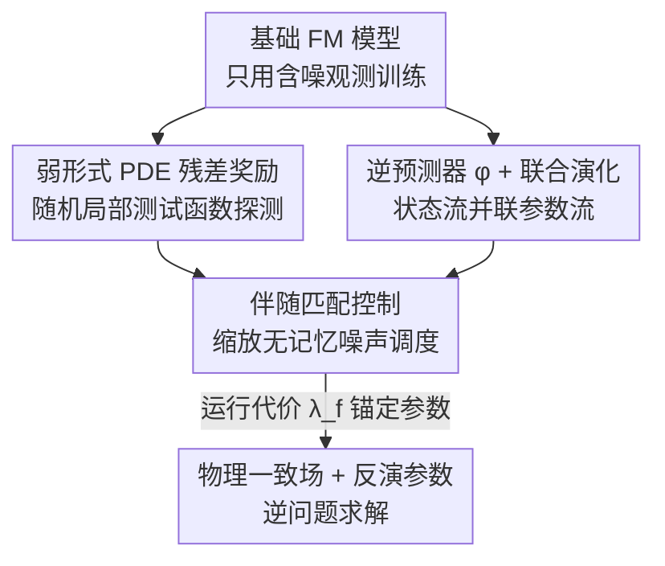

# Physics-Constrained Fine-Tuning of Flow-Matching Models for Generation and Inverse Problems

**会议**: ICLR 2026  
**OpenReview**: [https://openreview.net/forum?id=khBHJz2wcV](https://openreview.net/forum?id=khBHJz2wcV)  
**代码**: https://github.com/jantauberschmidt/PCFT  
**领域**: 扩散模型 / 科学计算 / 生成模型  
**关键词**: 流匹配, PDE 约束, 伴随匹配, 逆问题, 后训练微调

## 一句话总结
本文提出一个**后训练（post-training）框架**，把一个只用观测数据训出来的流匹配生成模型微调成「物理一致」的模型：用弱形式 PDE 残差当奖励、借助伴随匹配（Adjoint Matching）把微调改写成随机最优控制问题，同时给生成过程额外挂一条「隐参数」演化流，从而在没有「解—参数」配对标签的情况下，既生成满足 PDE 的物理场、又反演出隐藏的物理参数（如材料系数、源项），解决病态逆问题。

## 研究背景与动机
**领域现状**：扩散和流匹配模型已被广泛用来给复杂物理系统（大气、海洋、地震、医学成像）建生成模型。这些系统虽然动力学复杂，但本质受守恒律、对称性、边界条件等基本原理约束，把这些物理结构注入生成模型能同时提升样本保真度和分布外泛化。

**现有痛点**：现有「物理约束生成」工作大多只能处理**简单或全局**约束——固定边界、对称性这类对整个分布一致成立的约束。但真实 PDE 残差往往是**参数依赖**的：算子 $L_\alpha x = 0$ 里的 $\alpha$（渗透率、杨氏模量、源项）逐样本不同，而这些参数恰恰是观测不到的。

**核心矛盾**：要朴素地处理参数依赖约束，就得在「解 × 参数」的联合分布上训练，可参数标签缺失、昂贵或高维，联合训练通常不可行。于是逆问题（给定部分/含噪观测去推未观测参数）在数据驱动框架里一直没被干净地解决。

**本文目标**：分解为两个子问题——(1) 在**只有观测状态、没有参数标签**的前提下，把已训好的生成器微调成 PDE 一致；(2) 在微调的同时联合反演出隐参数 $\alpha$。

**切入角度**：作者注意到 Domingo-Enrich 等人的**伴随匹配**框架能把「奖励微调」严格地改写成随机最优控制问题，而 PDE 残差天然可以充当这个奖励。只要再给状态流并联一条参数流，就能把逆问题的参数推断「焊」进生成过程，而且只在后训练阶段才把观测和隐参数联系起来，所需数据远少于联合训练。

**核心 idea**：用「弱形式 PDE 残差作奖励 + 伴随匹配作控制 + 隐参数并联演化流」，把一个普通流匹配模型**后训练**成物理一致且能反演参数的联合生成器。

## 方法详解

### 整体框架
流匹配（FM）模型学一个向量场 $v_t(x)$，通过 ODE $\mathrm{d}X_t = v_t(X_t)\,\mathrm{d}t$ 把噪声搬运成数据，并可注入噪声调度 $\sigma(t)$ 改写成保持相同时间边缘的 SDE。本文的目标是：在不破坏已学分布的前提下，把基础模型分布 $p(x)$ 倾斜（tilt）成 $p_r(x)\propto e^{\lambda r(x)}p(x)$，其中奖励 $r$ 由 PDE 残差定义。

整条管线分四步：① 从基础生成器采样、并预训练一个**逆预测器** $\varphi$，让它从最终去噪样本 $x_1$ 反推参数 $\alpha_1=\varphi(x_1)$ 使弱残差最小；② 用弱形式 PDE 残差构造奖励；③ 给微调模型在状态流 $v^{ft}_{t,x}$ 之外**并联**一条参数流 $v^{ft}_{t,\alpha}$，并用 $\varphi$ 造出一条「代理基础流」给参数当演化目标和正则锚点；④ 把整个微调写成随机最优控制问题，用伴随匹配的一致性损失去优化控制量。最终模型不注入噪声（$\sigma(t)=0$）采样，推理成本与基础模型相同。

### 关键设计

**1. 弱形式 PDE 残差奖励：把物理约束变成可微、低方差的学习信号**

直接拿强残差 $R_{\text{strong}}(x,\alpha)=\lVert L_\alpha x\rVert^2_{L^2(\Omega)}$ 当约束会很糟糕：它含高阶导数，在含噪、误设定数据上优化地形极不稳定。本文改用**弱形式残差**——把样本 $x$ 看成连续场 $x(\xi)$ 的离散化，用一组紧支撑局部多项式核测试函数 $\psi\in\Psi$ 去探测算子违反程度：

$$R_{\text{weak}}(x,\alpha)=\frac{1}{N_{\text{test}}}\sum_{i=1}^{N_{\text{test}}}\big\langle L_\alpha x,\;\psi^{(i)}\big\rangle_{L^2(\Omega)}^2.$$

通过反复分部积分把导数从 $x$ 转移到 $\psi$ 上，再用 mollifier 强制 $\psi|_{\partial\Omega}=0$ 让分部积分成立，就避免了对带噪样本直接求高阶导。每次评估随机抽 $N_{\text{test}}$ 个测试函数，其中心和尺度随机采样——这些「随机局部探针」给出低方差、数据高效的违反信号，必要时残差里还可叠加边界条件的软惩罚项。这是奖励信号能稳定回传的根基。

**2. 隐参数并联演化流 + 代理基础流：在没有参数标签时把逆问题焊进生成过程**

微调难点在于必须**联合**推断隐参数。最朴素的做法是只靠 $\varphi$ 的前推（push-forward）诱导出 $(x_1,\alpha_1)$ 的联合分布，但作者认为这不够。本文让参数 $\alpha$ 也沿一条向量场 $v^{ft}_{t,\alpha}$ 演化（架构上加一个独立头），与状态流 $v^{ft}_{t,x}$ 联合采样。问题是基础模型没有 $\alpha$ 的真值流，于是用逆预测器造一条**代理基础流**：在状态 $(x_t,\alpha_t)$ 处先做一步估计 $\hat x_1=x_t+(1-t)v^{base}_t(x_t)$、$\hat\alpha_1=\varphi(\hat x_1)$，再把「从当前 $\alpha_t$ 指向预测终点 $\hat\alpha_1$」的方向当作基础参数流

$$v^{base}_{t,\alpha}(\alpha_t)=\frac{\hat\alpha_1-\alpha_t}{1-t}.$$

它从噪声 $\alpha^{base}_0\sim\mathcal N(0,I)$ 出发，模拟参数的「去噪」过程。同时再引入一条正则流 $v^{reg}_{t,\alpha}(\alpha^{ft}_t)=(\hat\alpha^{base}_1-\alpha^{ft}_t)/(1-t)$，把微调轨迹的参数往基础模型反演出的参数拉拢——既保留了样本特异性，又让联合采样有据可依。

**3. 伴随匹配 + 缩放无记忆噪声调度：把微调改写成低方差随机最优控制**

把状态和参数拼成增广变量 $\tilde X_t=(X_t^T,\alpha_t^T)^T$，微调就被严格地写成随机最优控制问题：

$$\min_{\tilde u}\;\mathbb E\Big[\int_0^1\big(\tfrac12\lVert\tilde u_t(\tilde X_t)\rVert^2+f(\tilde X_t)\big)\mathrm{d}t+g(\tilde X_1)\Big],\quad \tilde b^{ft}_t=\tilde b^{base}_t+\sigma(t)\tilde u_t.$$

求解用 Domingo-Enrich 等人的**伴随匹配**：它基于一个「精简伴随态」$\tilde a_t$，从终端 $\tilde a_1=\tilde\lambda\nabla_{\tilde x}g(\tilde X_1)$ 沿块雅可比反向积分，再把控制学习写成一个**回归式一致性损失** $L(\tilde u)=\tfrac12\int_0^1\lVert\tilde u_t+\sigma(t)\tilde a_t\rVert^2\mathrm{d}t$（梯度只穿过控制 $\tilde u$、不穿过伴随，省算力又低方差）。$\lambda_x,\lambda_\alpha$ 调节微调分布偏离基础分布的程度。

本文还做了一个小而关键的扩展：原框架用唯一的无记忆噪声调度 $\sigma^2(t)=2\eta_t$，本文改成**缩放版** $\sigma^2(t)=(1-\kappa)\,2\eta_t,\ 0\le\kappa<1$。作者证明（Lemma 1）这一族缩放调度仍满足无记忆性，因此理论一致性不丢，但 $\kappa$ 成了一个数值稳定旋钮——在像素空间直接操作的 PDE 模型里，高方差噪声会把轨迹推离流形并扰动残差，调大 $\kappa$ 能抑制 $t\to0$ 附近的爆炸，并提供「控制—保真」权衡。

**4. 运行代价正则项：在系统误设定下保住样本级细节**

伴随匹配是把**整个**输出分布往奖励倾斜，但在处理观测数据或系统误设定时，我们往往想保留样本特异的细节。作者发现，只要让微调模型反演出的系数与基础模型的尽量一致即可，于是加一个运行状态代价

$$f(\alpha)=\lambda_f\,\big\lVert v^{ft}_{t,\alpha}(\alpha)-v^{reg}_{t,\alpha}(\alpha)\big\rVert^2,$$

惩罚微调参数流偏离「指向基础估计 $\hat\alpha^{base}_1$」的方向。$\lambda_f$ 给出平滑权衡：$\lambda_f=0$ 退化为纯伴随匹配（最激进去噪、但抹掉基础样本细节），$\lambda_f$ 越大越把最终参数 $\alpha_1$ 锚到基础模型对应值，从而保住轨迹级细节。Darcy 实验里 $\lambda_f=1.0$ 能在去噪的同时保持与基础样本接近。

### 损失函数 / 训练策略
训练分两阶段：先从基础生成器采样、预训练逆预测器 $\varphi$（最小化 PDE 残差）；再从基础权重初始化微调，给 $v^{ft}_{t,x}$ 增容以 $\alpha_t$ 为条件、并加一个 $v^{ft}_{t,\alpha}$ 头。微调时用无记忆噪声调度迭代采样轨迹、数值解伴随 ODE、对一致性损失（式 4）做梯度下降；所有上报结果都在 $\sigma(t)=0$（不注入噪声）下生成。PDE 骨干用 U-FNO，图像用 DiT 式潜空间 FM。微调极轻量：含噪 Darcy 只需 20 步梯度、单张 L40S 上 15 分钟内完成，之后采样成本与基础模型一致、无推理期调整。

## 实验关键数据

评测覆盖五个设置：四个 PDE 系统（椭圆扩散 Darcy、线弹性、Helmholtz 波传播、不可压 Stokes，分别引入边界/系统误设定与观测噪声）外加一个自然图像模型。所有评测用 256 个共享随机种子的样本，残差按参考集均值归一化。

### 主实验（线弹性，边界条件误设定）

| 模型 | BC 误差 (MSE) ↓ | $R_{\text{weak}}$ (rel) ↓ | $R_{\text{strong}}$ (rel) ↓ | MMD$_x$ ↓ | MMD$_\alpha$ ↓ |
|------|------|------|------|------|------|
| FM（基础） | $6.98\times10^{-5}$ | $1.59\times10^{1}$ | $1.83\times10^{1}$ | 0.24 | 0.05 |
| PBFM | $2.32\times10^{-5}$ | $6.32\times10^{0}$ | $4.22\times10^{0}$ | 0.92 | 0.54 |
| FM+ECI | 0.0 | $1.01\times10^{3}$ | $2.49\times10^{2}$ | 1.16 | 0.36 |
| **本文 (Ours)** | $\mathbf{1.71\times10^{-6}}$ | $\mathbf{6.15\times10^{0}}$ | $\mathbf{3.79\times10^{0}}$ | **0.15** | 0.12 |

本文在保持极低残差的同时分布漂移最小；PBFM 残差低但分布严重漂移（MMD$_x$=0.92），FM+ECI 虽把 BC 误差压到 0，但弱/强残差爆炸（投影法在局部约束上引入不连续）。

### 消融实验（Helmholtz，代表性配置）

| 配置 | $R_{\text{weak}}$ (rel) ↓ | $R_{\text{strong}}$ (rel) ↓ | MMD$_x$ ↓ | 说明 |
|------|------|------|------|------|
| FM | $1.5\times10^{1}$ | $2.55\times10^{1}$ | 0.18 | 阻尼 vs 无损失配，残差最大 |
| PBFM | $8.33\times10^{0}$ | $1.22\times10^{1}$ | 0.09 | 训练期嵌约束，明显降残差 |
| Base AM（$\varphi$ 冻结） | $4.9\times10^{0}$ | $1.34\times10^{1}$ | 0.15 | 只用 $\varphi$ 算残差、不建参数流 |
| Base AM + $\varphi$ | $4.99\times10^{0}$ | $1.16\times10^{1}$ | 0.13 | $\varphi$ 继续训但 $\alpha$ 不联合演化 |
| **AM（完整联合）** | $\mathbf{4.3\times10^{0}}$ | $\mathbf{1.05\times10^{1}}$ | $\mathbf{0.06}$ | 联合流，残差与 MMD 双低 |

### 关键发现
- **联合流是关键**：在 Helmholtz 上完整联合 AM 残差最低且 MMD$_x$ 最低（0.06），说明并联参数流既能更彻底解决误设定、又保住分布保真；只冻结 $\varphi$ 或不联合演化的两个消融残差略高、MMD 也更大。
- **Stokes 上的差异更戏剧**：所有 AM 变体可达的弱残差相近（$R_{\text{weak}}\approx4$–15），但只有联合模型能进入低 MMD$_\alpha$ 区（0.07–0.13），两个消融都卡在 0.22–0.28——参数分布保真度只有联合流能拿到；PBFM 在此直接发散。
- **可控权衡**：增大 $\lambda_x=\lambda_\alpha$（$\lambda_f=0$）降残差但减少反演参数多样性；固定 $\lambda$、扫 $\lambda_f$ 则用残差换分布保真（MMD$_x$ 更低）。实践者可按需在「残差最小」与「分布保真」之间取点。
- **跨域可迁移**：在 ImageNet 预训练的潜空间 FM 上，把 $\alpha$ 当作潜空间外的多项式调色变换，用固定 prompt 优化 PickScore，联合微调能产出更鲜艳、且背景纹理与重着色协同调整的图像，验证方法不限于 PDE。

## 亮点与洞察
- **把逆问题「焊」进生成过程**：传统做法要么需要「解—参数」配对训练，要么只在推理期投影。本文用逆预测器 $\varphi$ 造代理基础流、再并联一条参数演化流，使得「只有观测、没有参数标签」时也能联合采样出 $(x_1,\alpha_1)$——这是最巧的一笔。
- **弱形式 + 随机测试函数**：用紧支撑随机核当「物理违反探针」，既绕开高阶导数的不稳定，又给出低方差信号，是把 PDE 约束塞进噪声梯度训练的实用工程钥匙。
- **缩放无记忆调度 $\kappa$**：一个看似不起眼的理论扩展，证明了一整族调度都保持无记忆性，把原本「唯一调度」变成可调的数值稳定旋钮，对像素空间直接操作的 PDE 模型尤其重要。
- **极轻量后训练**：20 步梯度、15 分钟、推理零额外开销——这种「拿现成生成器后训练成物理一致」的范式，对已有大模型很有迁移价值。

## 局限与展望
- 作者承认方法目前在**单一 PDE 族**上验证，未来要扩展到耦合 PDE、多物理、随机/混沌动力学等更复杂系统。
- 物理保真与生成多样性之间的权衡仍靠手调 $(\lambda_x,\lambda_\alpha,\lambda_f)$，作者把「自适应权衡」列为未来工作。
- 自己发现的局限：逆预测器 $\varphi$ 的质量是上限——Darcy 例子里因为 $\alpha^{base}$ 本身碎片化，开正则后仍有伪影残留；$\varphi$ 不准会直接污染代理基础流和参数反演。
- 评测主要在 $[0,1]^2$ 规则域、合成参考集上，缺乏真实大规模科学数据集与不确定性量化的系统验证（作者把 UQ、传感器布点等列为后续方向）。

## 相关工作与启发
- **vs PINNs**：PINNs 直接回归满足方程的单个解，不建解的分布，无法采样多样可行解；本文是生成式的，能给出分布并兼顾逆问题。
- **vs Bastek et al.（DDPM 训练期物理残差）/ PBFM**：它们在**预训练/训练期**把物理残差嵌进目标，需重训且 PBFM 在本文实验里常出现分布漂移或发散；本文是**后训练**微调，轻量且分布保真更好。
- **vs 投影类硬约束（FM+ECI、Utkarsh et al.）**：采样时反复投影强制硬约束，但对边界等局部约束易引入不连续/高残差（FM+ECI 在线弹性上强残差爆炸）；本文用软约束 + 控制平滑地倾斜分布。
- **vs 条件/引导扩散逆问题**：传统条件扩散依赖大量配对数据；本文只在后训练阶段把观测与隐参数关联，所需数据量大幅更少，并能在稀疏观测上引导采样后验。

## 评分
- 新颖性: ⭐⭐⭐⭐⭐ 把伴随匹配控制、弱形式残差奖励、隐参数并联演化三者缝成无配对逆问题求解，组合新且自洽。
- 实验充分度: ⭐⭐⭐⭐ 四个 PDE 族 + 图像跨域 + 多组消融较扎实，但缺真实科学数据集与 UQ 验证。
- 写作质量: ⭐⭐⭐⭐ 方法推导严谨、图 1 清晰，但记号密集、对读者数学门槛较高。
- 价值: ⭐⭐⭐⭐⭐ 「后训练把现成生成器变物理一致 + 反演参数」的范式对科学计算很有实用与迁移价值。

<!-- RELATED:START -->

## 相关论文

- [\[NeurIPS 2025\] Physics-Constrained Flow Matching: Sampling Generative Models with Hard Constraints](../../NeurIPS2025/physics/physics-constrained_flow_matching_sampling_generative_models_with_hard_constrain.md)
- [\[ICLR 2026\] Physics vs Distributions: Pareto Optimal Flow Matching with Physics Constraints](physics_vs_distributions_pareto_optimal_flow_matching_with_physics_constraints.md)
- [\[ICLR 2026\] Robust and Interpretable Adaptation of Equivariant Materials Foundation Models via Sparsity-promoting Fine-tuning](robust_and_interpretable_adaptation_of_equivariant_materials_foundation_models_v.md)
- [\[ICLR 2026\] PRO-MOF: Policy Optimization with Universal Atomistic Models for Controllable MOF Generation](pro-mof_policy_optimization_with_universal_atomistic_models_for_controllable_mof.md)
- [\[ICML 2026\] Spectrally Regularized Latent Flow Matching for Turbulence Generation](../../ICML2026/physics/spectrally_regularized_latent_flow_matching_for_turbulence_generation.md)

<!-- RELATED:END -->
