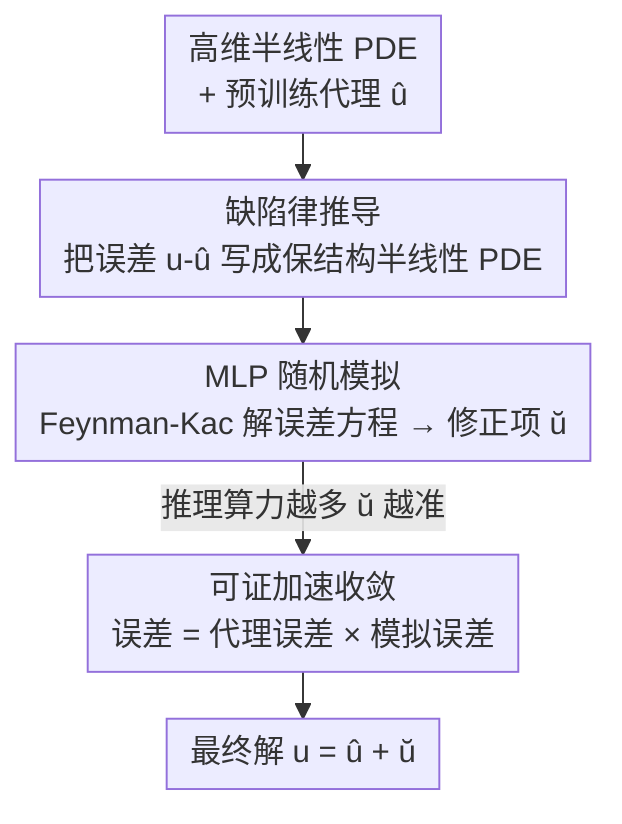

# Physics-Informed Inference Time Scaling for Solving High-Dimensional Partial Differential Equations via Defect Correction

**会议**: ICLR 2026  
**OpenReview**: [https://openreview.net/forum?id=d2pUyiXwcm](https://openreview.net/forum?id=d2pUyiXwcm)  
**代码**: 无  
**领域**: 科学计算 / 物理信息机器学习  
**关键词**: 高维偏微分方程, 推理时扩展, 缺陷修正, Multilevel Picard, PINN

## 一句话总结
SCaSML 把一个预训练好的 PDE 代理模型（PINN / 高斯过程）的误差本身也写成一个保结构的半线性 PDE，在推理时用蒙特卡洛随机模拟解出这个"误差方程"并加回去，无需重训就能把高维 PDE（最高 160 维）的解误差降低 20–80%，并且证明了最终误差是"代理误差 × 模拟误差"的乘积。

## 研究背景与动机
**领域现状**：高维半线性抛物型 PDE（量子多体的虚时薛定谔方程、金融里的非线性 Black–Scholes、最优控制的 HJB 方程等）是科学与工程的核心问题，但维度随分量数线性增长，带来"维数灾难"。传统有限元/有限差分在高维下彻底失效；科学机器学习（SciML，如 PINN、神经网络代理、高斯过程）成了主流替代，用数据驱动模型逼近 PDE 解。

**现有痛点**：SciML 解器是"黑箱"——它能快速给出一个近似解，但**没有严格的误差保证**，会引入隐蔽的偏差。对于安全攸关的应用（控制、定价），"模型给的数到底准不准、差多少"这个问题答不上来，可靠性存疑。另一边，纯随机模拟方法虽然原理上能解高维 PDE，但**方差极高**，单独用往往直接发散（论文表里 naive MLP 在 LQG 100 维上相对误差高达 5.6，几乎不可用）。

**核心矛盾**：机器学习的"快"与数值模拟的"严谨可证"之间存在割裂。代理模型快但不可证，模拟严谨但慢且高方差，二者一直被当成互斥的两条技术路线。

**本文目标**：能不能像大语言模型那样，在**推理时多花算力**来系统性地、可证地改进一个已经训练好的代理模型——给难解的 PDE 状态多分配计算、给简单状态少分配——而完全不重训、不微调？

**切入角度**：作者借鉴了数值分析里经典的**缺陷修正（defect correction）**思想：与其直接相信近似解 $\hat u$，不如为它的误差 $\breve u := u - \hat u$ 单独列一个方程再解出来。关键观察是：误差所满足的那个新 PDE，能够**继承原问题的半线性结构**，于是可以接着用成熟的高维随机模拟器（基于 Feynman–Kac）去解它。

**核心 idea**：把"误差"本身建模成一个保结构的半线性 PDE（称为 Structural-preserving Law of Defect），用随机模拟在推理时把这个误差解出来、加回代理解上，从而把 ML 的速度和数值模拟的严谨融合在一起。

## 方法详解

### 整体框架
SCaSML（Simulation-Calibrated Scientific Machine Learning）要解一类半线性抛物型 PDE：

$$\frac{\partial u}{\partial r} + \mathcal{L}u + F(u, \sigma^\top \nabla u) = 0, \quad u(T,y)=g(y)$$

其中 $\mathcal{L}u := \langle \mu, \nabla u\rangle + \tfrac{1}{2}\mathrm{Tr}(\sigma^\top \mathrm{Hess}(u)\,\sigma)$ 是二阶线性算子。整条流程分两段、三步：先**训练**一个标准 SciML 代理 $\hat u$（PINN / GP / 张量网络）拿到初始近似；**推理时**不直接采纳 $\hat u$，而是先推导出一个描述其误差 $\breve u = u - \hat u$ 的新 PDE（Law of Defect），再用 Multilevel Picard 随机模拟把 $\breve u$ 解出来，最后令最终解 $u_{\text{SCaSML}} = \hat u + \breve u$。整套修正只在用户指定的少数状态上做，是一次"靶向打补丁"，而不是在全域上重训。

### 关键设计

**1. 保结构缺陷律：把"误差"本身写成一个同结构的半线性 PDE**

传统缺陷修正在高维下不可用，因为它依赖网格细化层级；而神经网络的误差既没有网格层级、也没有关于单一分辨率参数的多项式展开，无法套用经典的渐近误差展开。本文的做法是直接做代数相减。先定义代理 $\hat u$ 代入原 PDE 留下的残差（residual）

$$\epsilon(r,y) := \frac{\partial \hat u}{\partial r} + \mathcal{L}\hat u + F(\hat u, \sigma^\top \nabla \hat u), \qquad \breve g(y) := g(y) - \hat u(T,y),$$

再把这个 $\hat u$ 满足的方程从原 PDE 中减掉，得到误差 $\breve u = u - \hat u$ 所满足的方程：

$$\frac{\partial \breve u}{\partial r} + \mathcal{L}\breve u + \breve F(\breve u, \sigma^\top \nabla \breve u) = 0, \quad \breve u(T,y)=\breve g(y),$$

其中修正后的非线性项 $\breve F(\breve u, \sigma^\top\nabla\breve u) := F(\hat u + \breve u, \sigma^\top(\nabla\hat u + \nabla\breve u)) - F(\hat u, \sigma^\top\nabla\hat u) + \epsilon$。关键在于：这个误差方程仍然是**半线性抛物型**、和原 PDE 同构——线性算子 $\mathcal{L}$ 原封不动，只是源项变成了残差 $\epsilon$、终端条件变成了代理在终端的偏差 $\breve g$。这一"保结构"性质是整个方法成立的前提，正因为它没变结构，才能继续用高维随机模拟器去解，而不像经典缺陷修正那样卡死在网格上。据作者所知，这是首个保留半线性结构、从而适配高维蒙特卡洛求解器的缺陷刻画。

**2. Multilevel Picard 随机模拟：把误差方程解成可扩展的推理时计算**

误差方程虽是 PDE，但因为它仍是半线性抛物型，其解可以通过 Feynman–Kac 表示写成一个期望——即把解写成对随机过程轨迹的平均。以线性情形为例，$\breve u(s,x) = \mathbb{E}\big[(g(X_T)-\hat u(T,X_T)) + \int_s^T \epsilon(t,X_t)\,dt\big]$，于是可以用蒙特卡洛模拟估计。半线性情形则把解刻画为某个 Feynman–Kac 型反向传播算子 $\Phi$ 的不动点 $\breve u_\infty = \Phi(\breve u_\infty)$，用 **Multilevel Picard（MLP）** 迭代求解。MLP 借助多层蒙特卡洛（MLMC）把期望写成望远镜求和 $\mathbb{E}[\breve u_n] = \mathbb{E}[\Phi(\breve u_0)] + \sum_{l=1}^{n-1}\mathbb{E}[\Phi(\breve u_l)-\Phi(\breve u_{l-1})]$，相邻层用同一条样本路径生成、强正相关，使差分方差大幅下降；随层数 $l$ 增大迭代线性收敛、方差线性趋零，最细层只需极少昂贵样本，大部分算力压在便宜的粗层上。这一步正是"推理时扩展"的载体：分配的蒙特卡洛样本越多，修正项 $\breve u$ 越精确（论文还区分了用高斯-勒让德求积的 Quadrature MLP 和用蒙特卡洛积时间的 Full-history MLP 两个变体）。之所以用蒙特卡洛而非再训一个网络来拟合误差：神经网络有谱偏差，先学低频光滑成分，残差 $\epsilon$ 往往是高频、不规则的函数，而蒙特卡洛的收敛率与被积函数光滑性无关，恰好擅长把这种复杂误差信号平均掉。

**3. 可证加速收敛：最终误差 = 代理误差 × 模拟误差的乘积**

这套两步法的理论保证是论文的核心卖点。MLP 模拟的方差取决于终端缺陷 $\breve g$ 和修正非线性 $\breve F$ 的尺度，而它们都正比于代理模型的误差——代理越准，误差方程越"容易"解。形式化地，全局 $L^2$ 误差被界为

$$\sup_{(t,x)} \big\| \breve U_{N,M}(t,x) - \breve u(t,x) \big\|_{L^2} \le E(M,N)\cdot \big(C_F\, e(\hat u)\big),$$

即最终误差是 MLP 模拟误差 $E(M,N)$ 与代理误差 $e(\hat u)$ 的**乘积**（$E(M,N)$ 独立于代理）。这条乘积关系直接给出更优的标度律：若代理误差随 $m$ 个训练点按 $e(\hat u)\sim m^{-\gamma}$ 下降，再额外花 $m$ 个样本做推理模拟，方差为 $O(m^{-2\gamma})$，对 $m$ 条新路径平均后统计误差变为 $\sqrt{m^{-2\gamma}/m} = m^{-\gamma-1/2}$。于是在总共 $2m$ 次函数求值的预算下，SCaSML 的收敛率 $m^{-\gamma-1/2}$ 同时超过单纯代理（$m^{-\gamma}$）和朴素蒙特卡洛/MLP（$m^{-1/2}$）。换句话说，初始代理越好，修正这一步要付的计算代价反而越小，达到目标精度 $\varepsilon$ 的成本从朴素 MLP 的 $O(d\,\varepsilon^{-(2+\delta)})$ 降到 $O(d\,\varepsilon^{-(2+\delta)} e(\hat u)^{2+\delta})$。

### 损失函数 / 训练策略
代理模型这一侧沿用标准训练：PINN 用 5 层、每层 50 个神经元、tanh 激活，Adam（学习率 $7\times10^{-4}$，$\beta_1=0.9$，$\beta_2=0.99$）训 $10^4$ 步，每步采约 2500 个内部点、100 个边界点、160 个终端点。推理修正这一侧无训练，只有 MLP 模拟的超参：层数 $N$（实验用 2 层）和每层蒙特卡洛基数 $M$（表格用 $M=10$，标度研究用 $M\in\{10,\dots,16\}$），并对解和梯度施加裁剪阈值（如 $0.5(d+1)$）以稳住方差。整个流程"训练一次、推理时按需修正"，天然实现了**弹性计算**：用户可以用推理时间换精度，无需承担重训全局模型的固定成本。

## 实验关键数据

### 主实验
在多个高维半线性 PDE 上对比代理模型（SR：PINN 或 GP）、朴素 MLP 求解器、以及 SCaSML（full-history），报告运行时间和 $L^2$/$L^\infty$/$L^1$ 相对误差。SCaSML 几乎在所有设置上拿到最低误差。

| 问题 | 维度 | SR 相对 $L^2$ | MLP 相对 $L^2$ | SCaSML 相对 $L^2$ | 误差降幅 |
|------|------|------|------|------|------|
| LCD（线性对流扩散） | 10d | 5.20E-02 | 2.27E-01 | **2.74E-02** | ~47% |
| LCD | 60d | 3.13E-01 | 2.39E-01 | **1.32E-01** | ~58% |
| VB-PINN（粘性 Burgers） | 20d | 1.17E-02 | 8.36E-02 | **4.03E-03** | ~66% |
| VB-GP（高斯过程代理） | 20d | 1.47E-01 | 1.90E-01 | **6.23E-02** | ~58% |
| LQG（HJB 类） | 160d | 1.12E-01 | 5.27E+00 | **9.94E-02** | ~11% |
| DR（扩散反应） | 100d | 1.41E-02 | 8.99E-02 | **1.11E-02** | ~21% |

关键看 LQG：朴素 MLP 在 100–160 维上相对 $L^2$ 误差高达 5.3–5.6（彻底发散），而代理 + 模拟的混合 SCaSML 稳定在 0.05–0.10，说明纯模拟会塌、纯代理不够准，二者融合才同时拿到稳定和精度。

### 消融实验
论文主要做的是"组件对比"式消融——把 SCaSML 拆成它依赖的两块，看单独用各自的失效情况。

| 配置 | 现象 | 说明 |
|------|------|------|
| 仅代理（SR） | 误差中等，无保证 | 黑箱代理，高维下精度有限且无误差界 |
| 仅模拟（朴素 MLP） | 高维下常发散（LQG 误差 5+） | 高方差，单独用不可靠 |
| SCaSML（代理 + 模拟） | 误差降 20–80% | 误差 = 代理误差 × 模拟误差，互相压制方差 |
| 推理样本 $M$ 递增 | 精度单调提升 | 验证"推理时扩展"：算力换精度 |

### 关键发现
- **乘积界是机理核心**：代理越准 → 残差 $\epsilon$ 越小 → 误差方程的源项越小 → MLP 方差越低。这解释了为什么混合法既快又准，而不是简单的两个误差相加。
- **小模型 + 推理扩展 > 大模型**：在相同推理算力预算下，一个较小的基础 PINN 通过把额外算力花在靶向修正、而非堆参数量上，能跑赢一个更大的 PINN——这是"inference-time scaling"在科学计算里的直接体现。
- **统计显著**：误差下降在多设置上 $p \ll 0.001$，并随推理样本增加而单调改善，标度律与理论 $m^{-\gamma-1/2}$ 吻合。
- **维数鲁棒**：从 10 维一路测到 160 维，降幅维持，缓解维数灾难。

## 亮点与洞察
- **把"误差"也当成一个 PDE 来解**：最漂亮的地方是发现误差 $u-\hat u$ 满足的方程与原 PDE 同结构（保半线性），于是同一套高维随机求解器可以无缝复用——这是经典缺陷修正在高维 SciML 上的关键破局点。
- **闭式无偏的一步修正**：相比 Newton/拟 Newton 这类迭代去偏（嵌进蒙特卡洛会形成嵌套模拟、收敛率从 $O(N^{-1/2})$ 退化到 $O(N^{-1/4})$、$O(N^{-1/8})$…），本文的缺陷律是一个精确解析恒等式，单步就给出闭式无偏修正，避免了嵌套方差爆炸。
- **乘积型误差界**可迁移：任何"快但不准的代理 + 严谨但高方差的求解器"组合，只要能把代理误差写成同结构的子问题，都可能复用这套"误差 = 代理 × 模拟"的乘积加速思路。
- **训练/推理分离**对应 ML 的标准范式：代理一次性训好回答全域，精修只在需要高精度的具体状态上触发，天然支持弹性计算。

## 局限与展望
- **依赖代理足够准**：理论保证建立在 Assumption 2.4（代理残差和 $W^{1,\infty}$ 误差受 $e(\hat u)$ 控制）之上；若初始代理太差，乘积界里的代理因子大，加速优势会缩水，甚至误差方程本身难解。
- **理论简化设定**：主定理为简洁起见取 $\mu=0$、$\sigma=sI_d$，更一般系数下的常数追踪留在附录，实际复杂 PDE 上的紧致性仍需更多验证。
- **限于半线性抛物型**：保结构这一核心性质依赖原问题是半线性抛物型 PDE；对完全非线性、双曲型或带强间断的问题，"误差方程同结构"未必成立。
- **裁剪与方差控制**：实现里对解/梯度做了裁剪阈值（如 $0.5(d+1)$）来稳住 MLP 方差，这类工程手段对结果的依赖程度、以及在更难问题上的可调性，论文着墨不多。

## 相关工作与启发
- **vs 纯 PINN / GP 代理**：代理只做一次全域逼近、快但无误差保证；本文在其之上加一层可证的推理时修正，把"黑箱预测"变成"带误差界的预测"，且不动代理权重。
- **vs 朴素 MLP / 蒙特卡洛求解器**：纯模拟在高维半线性 PDE 上方差极高、常发散；本文用代理把源项（残差）先压小，再让 MLP 只去解一个"更容易"的误差方程，方差随之锐减。
- **vs 经典缺陷修正 / Newton 类去偏**：经典方法依赖网格细化层级和渐近误差展开（神经网络没有），Newton 迭代嵌进蒙特卡洛又会形成嵌套模拟、收敛率层层退化；本文给出保半线性结构、闭式一步无偏的缺陷律，绕开了这两难。
- **vs LLM 推理时扩展**：把"难 query 多花算力搜索/规划"的思想搬到科学计算——难解的 PDE 状态多分配蒙特卡洛样本，实现 PDE 版的 inference-time scaling。

## 评分
- 新颖性: ⭐⭐⭐⭐⭐ 首个把误差本身建成保结构半线性 PDE、在推理时可证地修正 SciML 代理的框架。
- 实验充分度: ⭐⭐⭐⭐ 覆盖 4 类 PDE、最高 160 维、PINN/GP 两类代理，$p\ll0.001$；但多为合成 PDE。
- 写作质量: ⭐⭐⭐⭐ 从线性 warm-up 到半线性推广、理论与直觉交替，叙述清晰。
- 价值: ⭐⭐⭐⭐⭐ 给高维 PDE 的 ML 解器补上了严谨误差保证与弹性计算，可靠性意义大。

<!-- RELATED:START -->

## 相关论文

- [\[ICLR 2026\] Disentangled Representation Learning for Parametric Partial Differential Equations](disentangled_representation_learning_for_parametric_partial_differential_equatio.md)
- [\[AAAI 2026\] Towards a Foundation Model for Partial Differential Equations Across Physics Domains](../../AAAI2026/physics/towards_a_foundation_model_for_partial_differential_equations_across_physics_dom.md)
- [\[ICLR 2026\] $\partial^\infty$-Grid: A Neural Differential Equation Solver with Differentiable Feature Grids](boldsymbolpartialinfty-grid_a_neural_differential_equation_solver_with_different.md)
- [\[ICML 2026\] Foundation Inference Models for Ordinary Differential Equations](../../ICML2026/physics/foundation_inference_models_for_ordinary_differential_equations.md)
- [\[ICLR 2026\] Self-Supervised Evolution Operator Learning for High-Dimensional Dynamical Systems](self-supervised_evolution_operator_learning_for_high-dimensional_dynamical_syste.md)

<!-- RELATED:END -->
