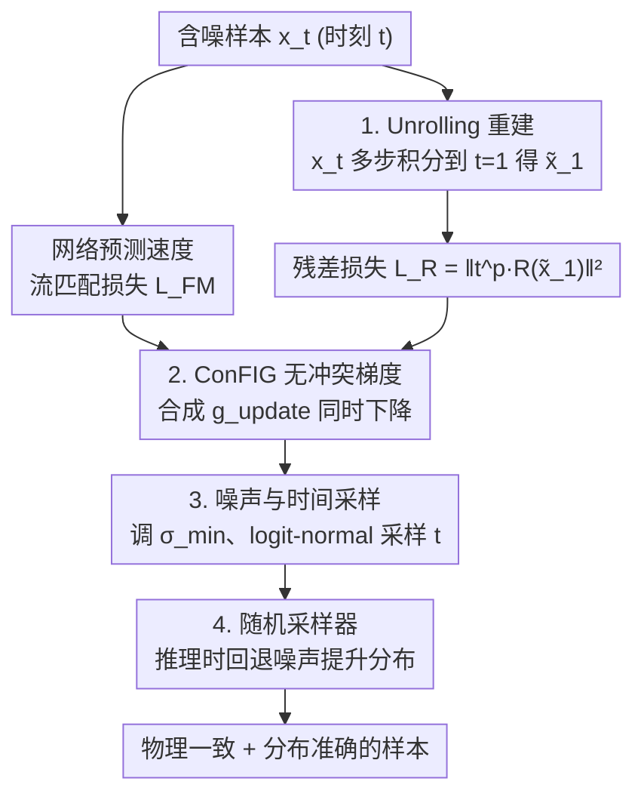

# Physics vs Distributions: Pareto Optimal Flow Matching with Physics Constraints

**会议**: ICLR 2026  
**OpenReview**: [https://openreview.net/forum?id=tAf1KI3d4X](https://openreview.net/forum?id=tAf1KI3d4X)  
**代码**: https://github.com/tum-pbs/PBFM  
**领域**: 扩散模型 / 科学机器学习 / 物理约束生成  
**关键词**: 流匹配, 物理约束, 多目标优化, 无冲突梯度, Jensen 间隙

## 一句话总结
PBFM 把 PDE 残差约束作为训练时的第二个目标，用无冲突梯度（ConFIG）取代手工 loss 加权、用 unrolling 重建干净样本来消除 Jensen 间隙，从而在不增加推理开销的前提下让流匹配同时逼近物理一致性和分布准确性，并在三个 PDE 基准上把整条「物理 vs 分布」帕累托前沿往前推。

## 研究背景与动机

**领域现状**：物理系统的演化由偏微分方程（PDE）描述，但直接离散求解高维/非线性/多尺度问题代价高昂。近年生成模型（DDPM、流匹配 Flow Matching）在捕捉复杂数据分布上表现强劲，流匹配尤其因为概念简单、函数评估次数少而成为科学机器学习的有力工具。和只能给出单一确定解的 PINN 不同，生成模型天然能刻画不确定性，这对工程中的不确定性量化至关重要。

**现有痛点**：把物理约束塞进生成模型很难。训练时同时优化「生成保真度」和「物理一致性」往往产生**互相冲突的梯度**——残差降下去了分布就垮，分布管好了残差又上天。已有做法要么在推理时迭代修正（如 CoCoGen、D-Flow、ECI、PCFM），动辄比标准采样慢 10×～65×；要么在训练时加一个残差 loss 项（如 PIDM），但需要手工调 $w_{FM}$、$w_R$ 两个权重，而且没解决根本冲突。

**核心矛盾**：物理准确性与分布准确性之间存在**内在的帕累托权衡**——本文是第一个明确把这件事识别为「冲突目标」的工作。除此之外还有 **Jensen 间隙**：物理残差本应施加在最终干净样本 $x_1$ 上，但训练时只能在中间噪声态的后验均值 $\mathbb{E}[x_1|x_t]$ 上算约束，由于残差是非线性映射 $f$，$\mathbb{E}[f(Z)] \neq f(\mathbb{E}[Z])$，这个差距会持续污染物理保真度。

**本文目标**：(1) 在训练时融入物理约束、同时最小化 PDE 残差和分布损失而无需手工平衡；(2) 缓解 Jensen 间隙且不增加推理成本；(3) 厘清高斯噪声尺度 $\sigma_{min}$ 在物理约束下的作用；(4) 系统比较确定性与随机采样器。

**核心 idea**：把多任务优化里的**无冲突梯度更新（ConFIG）**搬进流匹配，让生成目标和物理目标在每一步都能同时下降；再用 **unrolling** 把中间态积分到 $t=1$ 得到更准的 $x_1$ 来算残差，从源头掐掉 Jensen 间隙。

## 方法详解

### 整体框架

PBFM（Physics-Based Flow Matching）的输入是一个时刻 $t$ 的含噪样本 $x_t$，输出是一个既分布准确、又满足 PDE 残差约束的生成模型。整体训练流程是：网络先预测流匹配速度 $u_t^\theta$，照常算流匹配损失 $L_{FM}$；然后把 $x_t$ 沿 ODE **unroll** 到 $t=1$ 得到重建的干净样本 $\tilde{x}_1$，在它上面算物理残差损失 $L_R$；最后不再用固定权重相加，而是把两个损失的梯度 $g_{FM}$、$g_R$ 喂给 ConFIG 合成一个**保证两目标同时下降**的更新方向 $g_{update}$。推理时则可选用一个**随机采样器**进一步提升分布保真度。整条 pipeline 极易嵌入已有流匹配代码，且推理开销与无约束的 FM-OT 基本持平。

### 关键设计

**1. 无冲突梯度更新（ConFIG）：用几何对齐取代手工 loss 加权**

这一点直击「手工调 $w_{FM}/w_R$ 调不好」的痛点。传统加权目标是
$$L = w_{FM}\|u_t^\theta(x_t,t)-u_t(x_t)\|^2 + w_R\|R(x_1(x_t,t))\|^2,$$
增大残差项就害生成质量，反之又损害物理一致性。PBFM 改为对两个梯度做几何对齐：记 $g_{FM}$、$g_R$ 为两个损失的梯度，正交算子 $O(g_1,g_2)=g_2-\frac{g_1^\top g_2}{|g_1|^2}g_1$，单位化算子 $U(g)=g/|g|$，则合成方向为
$$g_v = U\big[U(O(g_{FM},g_R)) + U(O(g_R,g_{FM}))\big],\quad g_{update}=(g_{FM}^\top g_v + g_R^\top g_v)\,g_v.$$
这样构造保证 $g_{update}^\top g_{FM}>0$ 且 $g_{update}^\top g_R>0$——即沿该方向**两个目标都在下降**。它自适应地把冲突的梯度对齐，既不需要手工权重，也不会让某个目标压垮另一个，在很大范围的权重设置上都稳定优于固定加权目标。

**2. Unrolling 重建干净样本：从源头缓解 Jensen 间隙**

物理残差只有施加在真正的干净样本 $x_1$ 上才有意义，但训练时拿到的是中间噪声态，单步外推 $\tilde{x}_1 = x_t + dt\cdot u_t^\theta$ 误差大，残差被算歪，这就是 Jensen 间隙的来源。PBFM 的做法是把 $x_t$ **沿 ODE unroll**：用步长 $dt=(1-t)/n$ 做 $n$ 步积分，每步都重新调用网络 $\tilde{u}_t^\theta = \text{model}(\tilde{x}_1,\tilde{t})$ 更新 $\tilde{x}_1 \leftarrow \tilde{x}_1 + dt\cdot\tilde{u}_t^\theta$，直到 $\tilde{t}=1$。多步积分更逼近真实轨迹，残差因此评估在更准的 $x_1$ 预测上，直接降低残差误差并改善最终预测，而**推理成本不变**（unrolling 只在训练时发生）。为稳定训练，unrolling 步数用 curriculum 逐渐增加；同时对 $t\approx 0$ 处不可靠的预测用因子 $t^p$（最优 $p_{opt}=1$，即线性加权，与流匹配的线性噪声调度一致）降权残差损失。代价是要存中间态做反传，显存上升——但实验表明只对最后一步做反传几乎不掉性能。

**3. 噪声尺度与时间采样：让 $\sigma_{min}$ 适配物理精度**

计算机视觉里流匹配习惯用 $\sigma_{min}=10^{-3}$，但在物理约束下过量噪声会扰动残差、抬高可达到的最小残差误差。本文给出一条实用准则：在完美重建下，尺度为 $\sigma_{min}$ 的高斯噪声会诱导一个约 $\sigma_{min}^2$ 量级的残差 MSE，因此要求 $\sigma_{min}\lesssim R_{min}$；例如动态失速场景残差要求严，应取 $\sigma_{min}\lesssim 3\times10^{-4}$，而 Darcy/Kolmogorov 则宽松些。此外，训练时把时间变量 $t$ 从均匀分布换成 **logit-normal 分布**（零均值、单位方差）采样，专门加密流匹配误差更高的 $t\approx 0.5$ 区域，对应改善学习信号。

**4. 随机采样器：以噪声回退换取分布保真度**

确定性 ODE 采样把全部随机性都压进初始噪声，分布刻画不足。受 ECI 启发，PBFM 在推理时引入随机采样：从时刻 $t$ 演化到 $t=1$ 后，用一个**新的噪声样本**回退到 $t+dt$，这一步「带新噪声的时间倒退」增加了采样随机性，从而提升分布准确性。是否回退由阈值 $t^*$ 控制——$t^*=0$ 退化为确定性采样，$t^*=1$ 每步都重采噪声。实验中 $t^*=0.2$ 是兼顾低残差与强生成保真的折中点。

### 损失函数 / 训练策略

总目标由流匹配损失 $L_{FM}=\|u_t^\theta-u_t\|^2$ 与加权残差损失 $L_R=\|t^p\cdot R(\tilde{x}_1)\|^2$ 两项构成，但二者**不相加**，而是各自求梯度后经 ConFIG 合成 $g_{update}$ 再做 AdamW 更新。残差类型分三类：稳态 PDE（如 Darcy 的 $R=\nabla\cdot(K\nabla p)+f=0$）、瞬态守恒律（如 Kolmogorov 的质量守恒 $R=\nabla\cdot U=0$）、代数约束（如动态失速的理想气体定律 $R_{ig}=P-\rho RT$ 与 Sutherland 律的摩擦约束 $R_\tau$）。骨干网络用 DiT（diffusion transformer）。

## 实验关键数据

三个 PDE 基准分别对应三类残差：**Darcy flow**（稳态，64×64，有限差分残差）、**Kolmogorov flow**（瞬态湍流，128×128，FFT 残差，Reynolds 数条件，含 16 个未见 Re 测试）、**Dynamic stall**（最复杂，俯仰 NACA0012 翼型，128×128 六个物理场，含激波，两个代数约束）。评测指标：物理残差 RE、Wasserstein 距离 WD、Jensen-Shannon 散度 JS、函数评估次数 NFE、推理时间 IT；条件基准额外报均值/标准差场的 MSE（MMSE/SMSE）。

### 主实验

Darcy flow（1024 样本，越低越好）：

| 方法 | RE | WD ·10² | JS ·10¹ | NFE | IT [s] |
|------|------|---------|---------|-----|--------|
| **PBFM (ours)** | 0.838 | 0.138 | 0.256 | 20 | 0.101 |
| FM-OT（无约束） | 4.159 | 0.059 | 0.131 | 20 | 0.100 |
| CoCoGen | 1.320 | 0.249 | 0.360 | 100 | 7.395 |
| PIDM | 0.022 | 3.103 | 3.179 | 100 | 2.050 |
| DiffusionPDE | 3.388 | 0.089 | 0.139 | 20 | 0.590 |
| D-Flow | 2.286 | 0.147 | 0.237 | 20 | 3.126 |
| ECI | 3.045 | 2.892 | 2.818 | 20 | 0.122 |

PIDM 残差最低（0.022）但 WD 高达 3.103，分布彻底垮掉；FM-OT 分布最好但残差高达 4.159。PBFM 在 RE=0.838、WD=0.138 取得更优的物理-生成平衡，且推理只要 0.101s，把帕累托前沿往前推。

Kolmogorov flow 与 Dynamic stall（20 FM steps，越低越好）：

| 数据集 | 指标 | PBFM | OT-FM | DiffusionPDE | PCFM |
|--------|------|------|-------|--------------|------|
| Kolmogorov | RE ·10¹ | **1.362** | 2.314 | 1.930 | - |
| Kolmogorov | WD ·10¹ | **1.222** | 2.124 | 3.698 | - |
| Kolmogorov | IT [ms] | 98.97 | 98.75 | 267.8 | - |
| Dynamic Stall | RE ·10⁶ | 0.339 | 11.02 | 12.20 | **0.143** |
| Dynamic Stall | WD ·10⁴ | **1.814** | 2.707 | 2.509 | 4.013 |
| Dynamic Stall | IT [ms] | 60.47 | 59.75 | 171.7 | 3906 |

PBFM 在两个条件基准上几乎全面领先：Kolmogorov 残差与分布都最优；Dynamic stall 上 PCFM 残差最低（0.143），但分布更差且推理慢约 65×（3906ms vs 60.47ms）。

### 消融实验

| 配置 | 关键发现 | 说明 |
|------|----------|------|
| 仅 ConFIG（不 unroll） | 改善有限 | 残差降不动，证明 Jensen 间隙是主因 |
| + Unrolling 1→4 步 | 残差 MAE 持续下降 | unrolling 有效消除 Jensen 间隙 |
| 随机采样器 $t^*=0$ | WD ·10²=1.470（差） | 确定性采样分布保真不足 |
| 随机采样器 $t^*=0.2$ | WD ·10²=0.138（佳） | 兼顾低残差与强分布的折中 |
| 随机采样器 $t^*=1.0$ | RE 最低但 WD 升至 0.316 | 全程重采噪声偏向物理、牺牲分布 |

噪声尺度 $\sigma_{min}$（动态失速）：$\sigma_{min}=0$ 时 RE·10⁶=0.339、WD·10⁴=1.814 均最优，随 $\sigma_{min}$ 增大物理与分布指标都退化，印证「过量噪声扰动残差」的准则。

### 关键发现
- **Jensen 间隙才是物理精度的瓶颈**：单独上 ConFIG 改善有限，必须配 unrolling；二者协同才把残差压下来，且 unrolling 不增加推理成本。
- **物理 vs 分布是真权衡**：基线沿一条负斜率前沿排开（残差越低分布越差），PBFM 把整条前沿往前推而非简单偏向某一端。
- **PBFM 对 FM 步数不敏感**：少量函数评估即可达到高物理精度，在算力受限场景尤其有利。

## 亮点与洞察
- **把多任务无冲突梯度引入物理约束生成**：ConFIG 的几何构造保证两目标同时下降，一举甩掉手工 loss 权重这个老大难，这个思路可迁移到任何「保真 vs 约束」冲突的生成任务（分子生成、可控图像生成）。
- **Unrolling 当作 Jensen 间隙的解药**：把「残差该算在 $x_1$ 上」这个理论缺陷用「训练时多步积分重建 $x_1$」直接补上，且推理零额外开销——理论问题用工程手段干净解决。
- **$\sigma_{min}^2 \approx$ 残差 MSE 的实用准则**：给出噪声尺度与可达物理精度的定量关系，对科学 ML 调参很有指导性，且作者指出这是流匹配的普适性质而非本方法独有。

## 局限与展望
- **训练显存上升**：unrolling 需存中间态做反传，步数多时显存压力大；虽可只反传最后一步缓解，但仍比无约束训练贵。
- **残差需可微/可计算**：方法依赖能高效计算 PDE/代数残差，对极复杂或不可微残差的系统适用性待验证。
- **未做硬约束**：PBFM 不严格满足约束（软约束），追求严格满足的场景（如严格守恒）仍可能需要 PCFM 类推理修正——本文是以可接受的残差换取大幅更好的分布与速度。
- 三个基准虽覆盖稳态/瞬态/代数三类残差，但 Darcy 数据集缺条件输入、不够贴近真实应用（作者自承）。

## 相关工作与启发
- **vs PIDM（训练时加残差 loss）**：PIDM 用固定权重相加，仍受梯度冲突困扰、需手工调权重；PBFM 用 ConFIG 自适应对齐梯度，无需平衡，分布保真显著更好。
- **vs PIDDM（蒸馏解 Jensen 间隙）**：PIDDM 要训两个模型且未解生成-物理的内在冲突；PBFM 单模型、用 unrolling 解 Jensen 间隙、用 ConFIG 解冲突。
- **vs CoCoGen / D-Flow / ECI / PCFM（推理时约束）**：这些方法训练不变、推理迭代修正，慢 10×～65×；ECI 只能处理简单非重叠约束，PCFM 通用但需对残差求导且极慢。PBFM 把约束前移到训练，推理与无约束 FM 持平。

## 评分
- 新颖性: ⭐⭐⭐⭐⭐ 首个明确识别物理-分布帕累托权衡，并用无冲突梯度+unrolling 同时解冲突与 Jensen 间隙。
- 实验充分度: ⭐⭐⭐⭐ 三类残差基准 + 六个强基线 + 噪声/采样器/unrolling 消融，但数据集规模与真实性有限。
- 写作质量: ⭐⭐⭐⭐ 动机链清晰，公式与算法完整，Table 1 把方法定位讲得很明白。
- 价值: ⭐⭐⭐⭐⭐ 易嵌入现有流匹配、推理零额外开销、跨任务泛化，是科学机器学习的实用工具。

<!-- RELATED:START -->

## 相关论文

- [\[ICLR 2026\] Physics-Constrained Fine-Tuning of Flow-Matching Models for Generation and Inverse Problems](physics-constrained_fine-tuning_of_flow-matching_models_for_generation_and_inver.md)
- [\[NeurIPS 2025\] Physics-Constrained Flow Matching: Sampling Generative Models with Hard Constraints](../../NeurIPS2025/physics/physics-constrained_flow_matching_sampling_generative_models_with_hard_constrain.md)
- [\[ICLR 2026\] From Cheap Geometry to Expensive Physics: A Physics-agnostic Pretraining Framework for Neural Operators](from_cheap_geometry_to_expensive_physics_a_physics-agnostic_pretraining_framewor.md)
- [\[ICLR 2026\] FM4NPP: A Scaling Foundation Model for Nuclear and Particle Physics](fm4npp_a_scaling_foundation_model_for_nuclear_and_particle_physics.md)
- [\[ICLR 2026\] Overtone: Cyclic Patch Modulation for Clean, Efficient, and Flexible Physics Emulators](overtone_cyclic_patch_modulation_for_clean_efficient_and_flexible_physics_emulat.md)

<!-- RELATED:END -->
