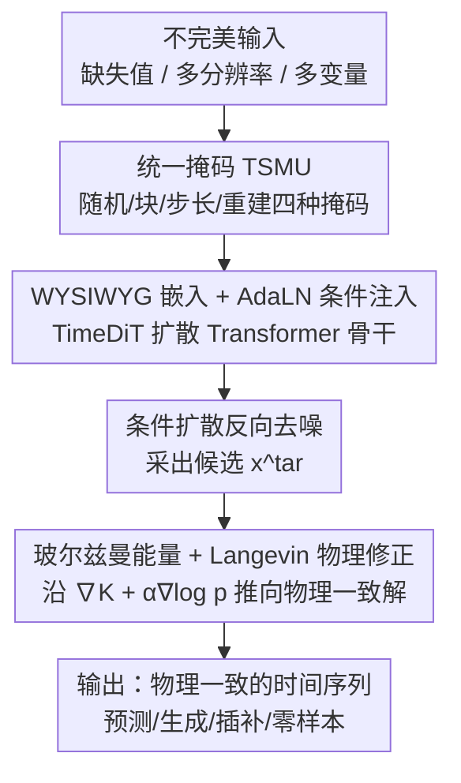

# PINFDiT: Energy-Based Physics-Informed Diffusion Transformers for General-purpose Time Series Tasks

**会议**: ICLR 2026  
**OpenReview**: [https://openreview.net/forum?id=EphTlUJ4XN](https://openreview.net/forum?id=EphTlUJ4XN)  
**代码**: 待确认  
**领域**: 物理信息机器学习 / 扩散模型 / 时间序列 / PDE 求解  
**关键词**: 扩散 Transformer、物理注入、Langevin 修正、玻尔兹曼能量、零样本预测

## 一句话总结
PINFDiT 用一个带统一掩码策略的扩散 Transformer 当"统计通才"，再在**推理阶段**插入一个免重训、免改架构的物理修正步骤——把 PDE 残差当能量项、用校准 Langevin 动力学把生成样本拉向满足物理定律的解，从而在科学时间序列的预测、生成、插补、异常检测乃至零样本任务上统一拿到 SOTA。

## 研究背景与动机
**领域现状**：科学领域的时间序列分析（流体、气候、生理信号）长期由专用模型主导——TCN、LSTM、GNN、Transformer 各自针对预测/插补/异常检测/生成中的某一个任务调优。最近时间序列基础模型（TimesFM、Moirai、Chronos）想做通才，扩散类方法（CSDI、DiffusionTS、TSDiff）则带来了生成与不确定性量化的能力。

**现有痛点**：科学场景把现实的"脏"全暴露出来了。一是**数据不完美**——缺失值切断时序连续性、多分辨率采样让不同变量的信息密度不一致、不规则时间间隔破坏等距假设；二是**样本稀缺**——高能物理、气候、生物医学的数据采集极贵；三是**缺物理一致性**——黑盒预测不遵守守恒律、生理边界这类硬约束，科学家无法信任。channel-independent 的方法虽然受益于时序建模，却丢掉了多变量之间的相关性。

**核心矛盾**：要让模型既"像数据驱动模型一样灵活生成"，又"像物理模型一样守约束"，传统做法是把 PDE 残差塞进训练 loss（PINN、DeepONet、FNO）。但这要求每换一个物理系统就重训一遍，且在数据稀缺时训练本身就学不动。基于仿真的推理（SBI）则绕开了显式似然，但需要海量仿真、还得有可微仿真器，难以 scale 到长时序。本质矛盾是：**精确似然 $\log p(x^{tar}|x^{con})$ 在复杂时序分布上不可计算**，而把物理知识"塞进参数"又太重。

**本文目标**：造一个统一框架，同时吃下不完美数据（缺失/多分辨率/多变量），并能在不重训、不改架构的前提下注入任意 PDE 物理知识。

**切入角度**：把"学一个好的通用生成模型"和"针对具体物理做精修"两件事**解耦**——前者交给扩散 Transformer 离线学好，后者只在采样时做一次轻量修正。作者的关键理论洞察是：带物理正则的最优分布有**闭式的玻尔兹曼形式**，于是修正可以用 Langevin 动力学一步步采样实现，带收敛保证。

**核心 idea**：把 PDE 残差当成一个能量项 $K(x^{tar};F)$，证明"模型分布 × 物理能量"的最优解是玻尔兹曼分布，用校准 Langevin 动力学在推理时采它，做到 model-editing-free 的"通才→专才"转换。

## 方法详解

### 整体框架
PINFDiT 分两段：**离线训练一个通用的时间序列扩散 Transformer（TimeDiT 骨干）**，再在**推理时插入物理修正**。训练侧，原始输入（带缺失值、多分辨率、形状各异）先经过"时间序列掩码单元"（TSMU）统一成观测条件 $x^{con}_0$ 和待生成目标 $x^{tar}_0$，再走"所见即所得"的嵌入层直接映射成 token，喂给若干 TimeDiT Block（用 AdaLN 把观测条件注入）做条件扩散去噪。推理侧，模型先按标准 DDPM 反向过程采出一个候选 $x^{tar}$，再跑 $k$ 步 Langevin 修正，把样本沿"物理能量 + 模型似然"的梯度推向物理一致解，最后输出。

整条管线是"统一掩码 → 扩散去噪 → 物理 Langevin 修正"的串行结构，pipeline 清晰，框架图如下：

### 关键设计

**1. 统一掩码单元 TSMU：用一套掩码吃下所有不完美数据和所有任务**

科学时序的麻烦在于缺失、多分辨率、不规则采样各需一套专门架构，且预测/插补/异常检测本来要分别建模。TSMU 的做法是构造一个统一掩码 $M$，区分出观测 $x^{con}_0$ 和目标 $x^{tar}_0$（形状 $\mathbb{R}^{B\times L\times K}$），并提供四种专门掩码：随机掩码 $M_R$、块掩码 $M_B$、步长掩码 $M_S$、重建掩码 $M_{Rec}$。这套机制利用扩散模型"在精确条件下逐步去噪指定区域"的天然能力——想做预测就 mask 未来段、想做插补就 mask 缺失点、想做异常检测就重建并比对——从而**不需要任务专属的架构改动**就能在同一个模型上切换任务，也正是零样本能力的来源。消融显示步长掩码最关键，去掉它 Solar 上 MSE 从 0.424 飙到 0.862。

**2. WYSIWYG 嵌入 + AdaLN 条件注入：保住多变量相关性和时序连续性**

与 PatchTST 那类 channel-independent 的 patch token 或向量量化不同，PINFDiT 用"所见即所得"(WYSIWYG) 的嵌入哲学：把 $x^{con}_0$ 和加噪的 $x^{tar}_0$ 当作连续的数组**直接**映射成嵌入向量，不切 patch、不做 channel 独立，从而保留了多变量之间的相关性。条件注入上，扩散步 $t$ 被直接注入目标噪声表示（提供全序列统一的时间信息），而观测条件不走简单拼接，而是用自适应层归一化：

$$\text{AdaLN}(h,c)=c_{scale}\,\text{LayerNorm}(h)+c_{shift}$$

其中 $c_{scale},c_{shift}$ 都从 $x^{con}_0$ 推出。这种调制方式把观测信息以"缩放+平移"的形式贯穿每一层，对保持重建序列的时序连续性和演化趋势至关重要；消融里它优于特征相加(Add)和交叉注意力(CA)。

**3. 玻尔兹曼能量闭式解：把物理正则的最优分布写成可采样的形式**

物理定律写成 PDE $\frac{\partial x}{\partial\tau}=F(\tau,x,u,\partial x/\partial u_i,\dots)$，预测与物理的一致性用平方残差度量 $K(x^{tar};F)=-\|\frac{\partial x^{tar}}{\partial\tau}-F(\cdots)\|_2^2$（完全一致时残差为 0、$K$ 取最大）。把物理知识当显式正则，要解的是 $q^*=\arg\max_q\big[\mathbb{E}_{x^{tar}\sim q}K(x^{tar};F)-\alpha D_{KL}(q\|p)\big]$。直接更新参数去优化它太贵，本文的 Theorem 3.1 给出闭式解——最优 $q$ 是定义在能量 $E=K(x^{tar};F)+\alpha\log p(x^{tar}|x^{con})$ 上的玻尔兹曼分布：

$$q(x^{tar}|x^{con})=\frac{1}{Z}\exp\!\big(K(x^{tar};F)+\alpha\log p(x^{tar}|x^{con})\big)$$

这一步是整个方法的理论支点：它说明"注入物理"等价于"在能量分布上采样"，而无需真去编辑模型权重。

**4. 校准 Langevin 物理修正：免重训的"通才→专才"推理插件**

玻尔兹曼分布可以用 Langevin 动力学采样，把 $\nabla\log q$ 展开成模型项和物理项两部分：

$$x^{tar}_{j+1}=x^{tar}_j+\epsilon\nabla K(x^{tar}_j;x^{con})+\alpha\epsilon\nabla\log p(x^{tar}_j|x^{con})+\sqrt{2\epsilon}\,\sigma,\quad\sigma\sim\mathcal{N}(0,1)$$

其中不可计算的似然 $\log p$ 用扩散模型的去噪目标近似 $\log p(x^{tar}|x^{con})=-\mathbb{E}_{\epsilon,t}[\|\epsilon_\theta(x^{tar},t;x^{con})-\epsilon\|^2]$（即 ELBO 的可优化部分）。于是修正变成在已训练好的模型上跑 $k$ 步梯度更新（Algorithm 1）：先标准 DDPM 采出候选，再沿物理梯度 $\nabla K$ 和模型梯度 $\nabla\log p$ 联合修正。这一步**不改架构、不重训**，把扩散模型当统计通才、把 Langevin 修正当领域专才，换一个物理系统只换 $K$ 即可。理论上还给了收敛保证（Theorem 3.2）：$D_{KL}(q_N\|q^*)\le O(d/\sqrt{N}+\varepsilon^2_{score})$，取步长 $\epsilon=\Theta(N^{-1/2})$ 时收敛率 $O(N^{-1/2})$；Lemma 3.3（残差-方差耦合）进一步证明 KL 每减小一截、物理残差的方差 $\text{Var}_q[e_r]\le 2L^2 D_{KL}(q\|q^*)+4L^2\delta^2$ 也随之下降——统计收敛直接翻译成物理一致性，给了可解释的"修正越多越守物理"路径。

### 损失函数 / 训练策略
训练侧是标准条件扩散框架，目标即去噪 $\epsilon$-预测损失（同时充当推理时似然项的近似）；掩码策略在训练中随机切换四种掩码以实现自监督的多任务统一。物理修正完全发生在推理阶段，由步长 $\epsilon$、修正步数 $k$（理论中的 $N$）、物理-似然平衡系数 $\alpha$ 控制，无需为不同物理系统重训。

## 实验关键数据

### 主实验

物理引导预测（6 个 PDE 仿真系统，对比基础模型/深度模型/物理模型/SBI 方法）：

| 系统 | 指标 | PINFDiT | PINFDiT(w/o Phys) | 最优基础模型 Chronos-T5-B | CSDI |
|------|------|---------|-------------------|--------------------------|------|
| Advection | RMSE | **0.0039** | 0.0052 | 0.0414 | 0.0118 |
| Burgers | RMSE | **0.0133** | 0.0136 | 0.0202 | 0.0167 |
| Navier-Stokes | RMSE | **0.0037** | 0.0039 | 0.0081 | 0.0094 |
| Diffusion-Sorption | RMSE | **0.0052** | 0.0057 | 0.0019 (CSDI 更优) | 0.0012 |

相比最优基础模型 Chronos-T5-B，Advection RMSE 降 88.3%、Burgers 降 35.1%、Navier-Stokes 降 54.3%。ERA5 真实气候（2 米气温，ACC↑）上 PINFDiT(Full) 各 lead time 均 0.987，超过 ClimODE 的 0.96。

实际不完美场景预测（23 个指标里赢 19 个，MAE/MSE）：

| 数据集 | 指标 | PINFDiT | 次优 | 改进 |
|--------|------|---------|------|------|
| Air Quality | MAE | **0.457** | 0.521 (DiffTS) | -12.97% |
| MIMIC-III | MSE | **0.534** | 0.681 (CSDI) | -6.17% MSE |
| PhysioNet(c) | MSE | **0.561** | 0.695 (CSDI) | -19.28% |

### 消融实验

零样本设置下的组件消融（Solar / Electricity，CRPS_sum，越低越好）：

| 配置 | Solar | Electricity | 说明 |
|------|-------|-------------|------|
| Full PINFDiT | 0.424 | 0.030 | 完整模型 |
| w/o Phys | 0.445 | 0.033 | 去物理修正，仍可用但掉点 |
| w/o 随机掩码 RM | 0.465 | 0.035 | |
| w/o 步长掩码 SM | **0.862** | **0.101** | 掉点最猛，最关键 |
| w/o 块掩码 BM | 0.469 | 0.037 | |
| patch token (PT) | 0.874 | 0.145 | 不如直接嵌入 |
| 特征相加 (Add) | 0.677 | 0.079 | 不如 AdaLN |
| 交叉注意力 (CA) | 0.711 | 0.077 | 不如 AdaLN |

### 关键发现
- **步长掩码是统一框架的命脉**：去掉后 Solar MSE 从 0.424 暴涨到 0.862（约 2 倍），远超去掉其他任一组件，说明跨分辨率/不规则采样的建模主要靠它。
- **物理修正是稳定的小幅增益而非主力**：w/o Phys 各任务只掉 5% 上下，但它带来的是"物理一致性"这种 loss 看不出的质变，且零成本（推理插件）。
- **WYSIWYG 直接嵌入显著优于 patch token**：patch token 在零样本上是所有变体里最差的（0.874/0.145），印证了保留多变量相关性的重要性。
- **AdaLN 是最优条件注入方式**，优于拼接、相加、交叉注意力。
- 生成任务上判别分(DS)/预测分(PS)也领先，如 Stocks 上 DS 从 DiffTS 的 0.1869 降到 0.0087；插补在 ETTh1 上 MSE 降 39%、MAE 降 22%。

## 亮点与洞察
- **把"物理注入"从训练搬到推理，并给出闭式玻尔兹曼解**：这是最"啊哈"的地方——物理正则的最优分布天然是玻尔兹曼形式，于是不必重训、不必改架构，换物理系统只换能量项 $K$，可迁移到任意已训练好的概率生成模型（model-agnostic）。
- **统计收敛 ↔ 物理一致性的桥接**：Lemma 3.3 把 KL 收敛和物理残差方差直接挂钩，让"多跑几步修正 = 更守物理"有了可解释、可量化的依据，而不是玄学调参。
- **一套掩码统一所有任务**：TSMU 的设计把预测/插补/异常检测/生成/零样本压进同一个自监督训练框架，是"通用时间序列基础模型"的一条干净路线，掩码思路可迁移到其他模态的统一建模。
- 推理时物理修正的 plug-and-play 形态，适合任何已部署的扩散基础模型做"后挂"约束。

## 局限与展望
- **物理修正增益偏小**：多数任务上 w/o Phys 只差 5% 左右，物理项的价值更多体现在难以用 RMSE 衡量的物理一致性上，论文没有给出违反守恒律程度的直接定量指标，说服力打了折扣。
- **依赖已知 PDE 形式**：能量项 $K$ 要求物理定律能写成可微 PDE 残差，对未知/经验性约束（很多生物医学场景）不直接适用。
- **推理变慢**：每个样本要额外跑 $k$ 步 Langevin 修正，步长 $\epsilon$、步数 $k$、系数 $\alpha$ 需要针对系统调，论文未充分讨论其敏感性与额外计算开销。
- 收敛保证依赖 score 估计误差 $\varepsilon_{score}$ 和 $F$ 的 Lipschitz 假设，强非线性/刚性 PDE 下 bound 可能松。
- 改进方向：把物理项扩展到软/经验约束、做修正步数的自适应早停、给出物理违反度的标准化报告。

## 相关工作与启发
- **vs PINN / DeepONet / FNO**: 他们在训练阶段把 PDE 残差塞进 loss，换系统要重训且数据稀缺时学不动；本文物理只在推理时以能量项进入，免重训、model-agnostic。
- **vs 基于仿真的推理 (SNPE / CSBI / LFBC)**: 它们需要可微仿真器和海量仿真来学参数后验，难 scale 到长时序；本文直接对状态轨迹分布建模，用 ELBO 近似似然绕开仿真器。
- **vs 扩散时序方法 (CSDI / SSSD / TSDiff / DiffusionTS)**: 前作多聚焦单任务、或为每个任务训不同模型；PINFDiT 是首个用统一扩散 Transformer 覆盖预测/插补/异常检测/生成/零样本的方案，并额外挂上物理修正。
- **vs 时序基础模型 (TimesFM / Moirai / Chronos)**: 它们是纯数据驱动通才，缺物理约束；PINFDiT 在通才之上加了"专才"修正，在 PDE 系统上大幅领先。

## 评分
- 新颖性: ⭐⭐⭐⭐⭐ 把物理正则的最优分布证成玻尔兹曼闭式解、做成免重训的推理插件，角度新且有理论支撑。
- 实验充分度: ⭐⭐⭐⭐ 覆盖 6 个 PDE + 真实气候/医疗/金融/零样本/生成/插补，任务极广；但物理项单独的定量价值展示偏弱。
- 写作质量: ⭐⭐⭐⭐ 理论与方法清晰，个别记号（modelname 占位符、PhysDiffT 笔误）和图注略乱。
- 价值: ⭐⭐⭐⭐⭐ 给"基础模型 + 物理约束"提供了一条干净、可复用、可迁移到任意生成模型的范式。

<!-- RELATED:START -->

## 相关论文

- [\[ICLR 2026\] Orbital Transformers for Predicting Wavefunctions in Time-Dependent Density Functional Theory](orbital_transformers_for_predicting_wavefunctions_in_time-dependent_density_func.md)
- [\[ICLR 2026\] Physics-Informed Inference Time Scaling for Solving High-Dimensional Partial Differential Equations via Defect Correction](physics-informed_inference_time_scaling_for_solving_high-dimensional_partial_dif.md)
- [\[ICLR 2026\] Proximal Diffusion Neural Sampler](proximal_diffusion_neural_sampler.md)
- [\[CVPR 2026\] Spatial-Spectral Residuals Informed Diffusion Neural Operator for Pan-sharpening](../../CVPR2026/physics/spatial-spectral_residuals_informed_diffusion_neural_operator_for_pan-sharpening.md)
- [\[ICLR 2026\] Incomplete Data, Complete Dynamics: A Diffusion Approach](incomplete_data_complete_dynamics_a_diffusion_approach.md)

<!-- RELATED:END -->
